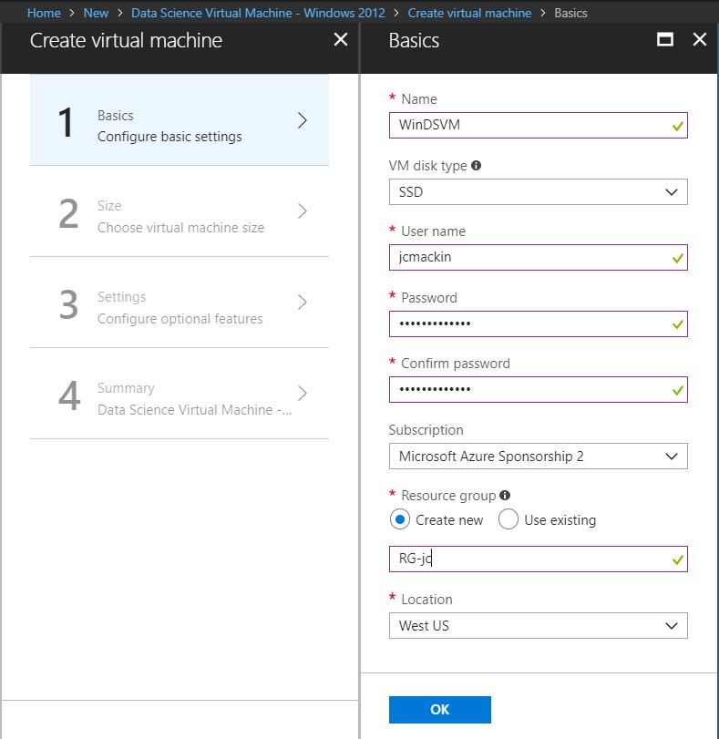
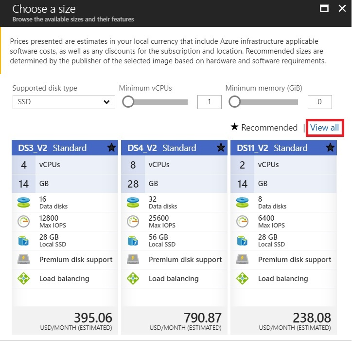
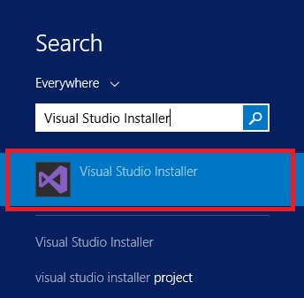
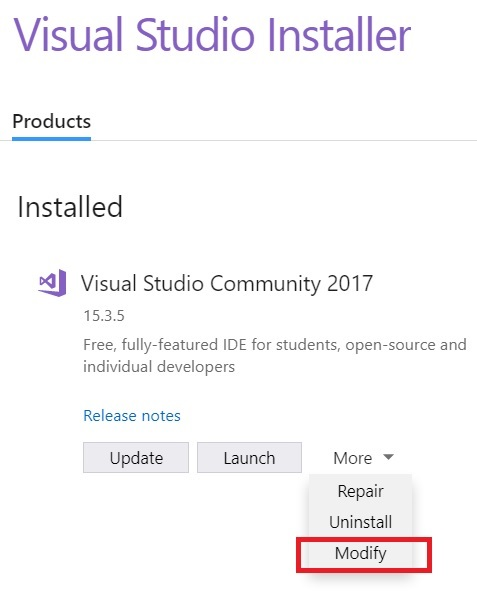
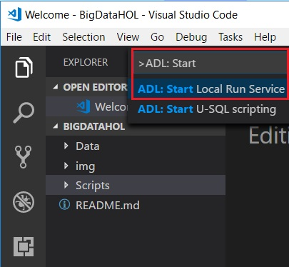
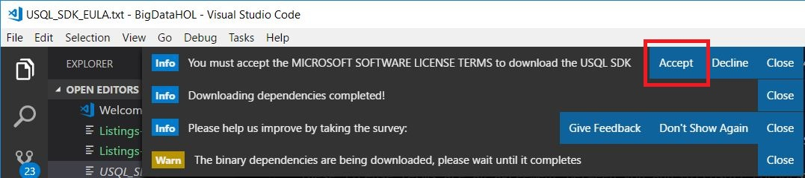
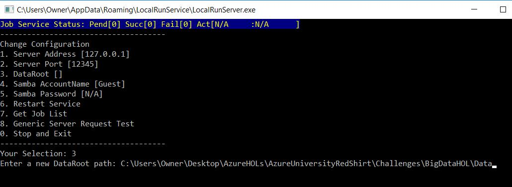
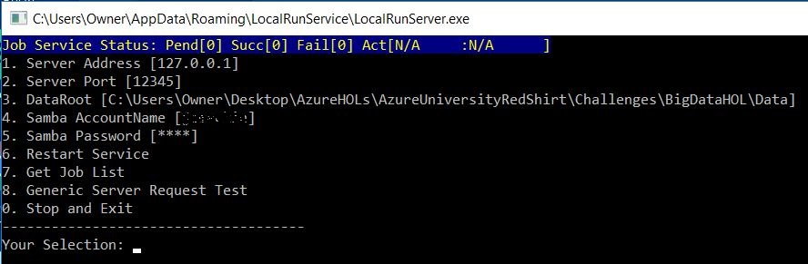

# Big data hands-on lab (HOL) #
<a name="Overview"></a>
## Overview ##
In this hands-on lab (HOL), you will explore U-SQL, a big data language designed to query both structured and unstructured data at any scale. You will also learn how to run U-SQL jobs locally on a development machine to speed up early coding phases.

In the lab, you are a developer helping to create an apartment rental app called ContosoBNB. By querying a large dataset made available by [Airbnb](https://www.airbnb.com/), you hope to get better aquainted with the data that powers the app.

### Objectives
In this hands-on lab, you will:
+ Learn how Azure Data Lake and U-SQL is an alternative to Hadoop/HDFS and Map Reduce.
+ Work with data on your local system and in an Azure Data Lake Store.
+ Execute U-SQL queries on your local system and in Azure Data Lake.
+ Modify queries to address data inconsistency issues.


### Objectives
In this hands-on lab, you will:
+ Learn how Azure Data Lake and U-SQL is an alternative to Hadoop/HDFS and Map Reduce.
+ Work with data on your local system and in an Azure Data Lake Store.
+ Execute U-SQL queries on your local system and in Azure Data Lake.
+ Learn how to use existing data to calculate new values in your datasets.
+ Modify queries to address data inconsistency issues.

### Prerequisites

The following are required to complete this hands-on lab:

- An Azure subscription, to perform Azure Data Lake data-transfer exercises

### Resources

This lab makes use of an existing dataset (released under public domain) to model real-world property listings with their associated details. The complete dataset can be found at [http://insideairbnb.com/get-the-data.html](http://insideairbnb.com/get-the-data.html). For the purposes of this lab, the data has been converted to a standard Windows text file format to emulate how it might be provided if requested directly from an Azure Data Lake Store.

## Exercises

This hands-on lab includes the following exercises:

-   [Exercise 1: Create a DSVM](#Exercise1)
-   [Exercise 2: Set up the U-SQL local run environment](#Exercise2)
-   [Exercise 3: Create U-SQL queries to view rental listings and review information](#Exercise3)
-  [Exercise 4: Modify query to find listings for a specific area using parameters](#Exercise4)


<a name="Exercise1"></a>
## Exercise 1: Create a DSVM


In this exercise, you will create an instance of the DSVM for Windows in Azure. The DSVM for Windows is a VM image in Azure that includes many preinstalled and configured data-science and development tools, and you will be using this VM as your development workstation. (You can read a longer description about the many tools and features available in the DSVM [here](https://azuremarketplace.microsoft.com/en-us/marketplace/apps/microsoft-ads.linux-data-science-vm-ubuntu).)


### Step 1: Creating the DSVM in Azure

1.  In a web browser, open the [Azure portal](https://portal.azure.com/) at [https://portal.azure.com](https://portal.azure.com/), and then sign in with your Microsoft account.

2.  From the left-side menu, click the **+** sign to add a new resource.


4.  In the **Search** field, type **data science**. From the list of matching results, click **Data Science Virtual Machine - Windows 2012**.


5.  Take a few moments to read the description of the DSVM, and then click **Create**.


6.  In the **Name** field, enter a name for your VM; for example, **WinDSVM**.



7.  In the **User Name** field, type a user name of your choice. Save this information, because you will use it to sign in to the VM later.

8.  In the **Password** field, enter a password of your choice. Save this information, because you will use it to sign in to the VM later.

9.  In the **Subscription** drop-down menu, select your subscription.

10.  In the **Resource Group** section, leave **Create New** selected, and then enter a name of your choice for the resource group in the field below; for example, **DataScienceGroup1**.

11.  In the **Location** drop-down menu, ensure that a geographically close location is chosen.

12.  Click **OK**.
At this stage, the Choose a Size page appears. Proceed to the next step.

### Step 2: Sizing the new VM and reviewing settings

1.  On the **Choose A Size** page, click **View All**.



3.  In the list of available VM types, select **DS4_V2 Standard**.


4.  Click **Select**.

5.  On the **Settings** page that appears, review the default settings, and then click **OK**. 

The Create page appears, displaying offer details and summary information.

5.  Click **Create**.

**Important: Make sure you return to the Azure portal and shut down this VM after you complete this lab.**

6.  Wait a few minutes while the DSVM is deployed. After it is deployed, you will see a dashboard for your new VM. At the top of the dashboard, you will see controls.


7.  The **Start** button is not available, indicating that the new VM has already started.

### Step 3: Connecting to the new VM
1. If you are on a Mac, download and install [Microsoft Remote Desktop 10](https://itunes.apple.com/us/app/microsoft-remote-desktop-10/id1295203466?mt=12) from the [Mac App Store](https://itunes.apple.com/us/app/microsoft-remote-desktop-10/id1295203466?mt=12) . 

2. On the control bar for your new VM, click **Connect**.


This step downloads an RDP file through your browser.  

3. Open the RDP file and connect to the DSVM.

- If you are on a Windows computer, you can open the RDP file through the browser. Click **Connect** when prompted, then supply the credentials you specified in step 1 of this exercise when prompted, and finally click Yes to accept the certificate.

- If you are on a Mac, save the RDP file to a convenient location, and then open the file.  If you are prompted to verify a certificate, click **Continue**. Enter the credentials you specified in the step 1 when prompted.

4.  When you see the DSVM desktop, proceed to the next exercise.

<a name="Exercise2"></a>
## Exercise 2: Set up the U-SQL local run environment
We are going to run U-SQL queries on the DSVM, but these tools are missing some components we need by default.  Before you can run U-SQL queries locally in our source code editor Visual Studio Code, you will need to download and install an additional Visual Studio component, Azure Data Lake Tools, and additional script dependencies. Then you will need to start the Azure Data Lake local run service.
   
### Step 1: Installing the Visual Studio component 
1. In the DSVM, right-click the Start button and select **Search** from the shortcut menu. 


2. In the search box that opens on the right side of the screen, type **Visual Studio Installer**, and then click to open that program when its tile appears below the search box.



3. If you are prompted to update the Visual Studio Installer before proceeding, click Update to perform the update. 
4. In the Visual Studio Installer page that opens, expand the More menu associated with Visual Studio Community 2017, and then click Modify on the menu.



5. On the Modifying-Visual Studio Community 2017 page that opens, click **Individual components**.


6. In the list of individual components, within the **Compilers, build tools, and runtimes category**, select the checkbox associated with **VC++ 2015.3 v140 toolset for desktop (x86,x64)**.


7. Click **Modify**.


The installation will require a few minutes to complete. 

8. After the installation has completed, close the Visual Studio Installer window.

### Step 2: Installing Azure Data Lake Tools in Visual Studio Code
We will be using Visual Studio Code as our source code editor of choice. To make Visual Studio Code compatible with U-SQL, we need to install the Azure Data Lake Tools extension.

1.  On the desktop the DSVM, locate and double-click the Visual Studio Code icon to open this application.

Visual Studio Code opens, along with a web page about Visual Studio Code and a dialog box about Internet Explorer settings.  

2. Close all open windows except for Visual Studio Code.

3.  In Visual Studio Code, click the **Extensions** icon in the left pane.


4. In the search box in the top left of the window, enter **Azure Data Lake**

5. Click **Install** next to Azure Data Lake tools.


The Azure Data Lake Tools extension will install. The process will take a few moments.

6. Click Reload to activate the Azure Data Lake tools extension.


You can now see Azure Data Lake Tools in the Extensions pane.


### Step 3: Download the lab files and script dependencies in Visual Studio Code

1.	Create a new folder named AzureHOLs in any convenient location on the DSVM. You will use this folder to store lab files.
2.	Right-click the Start button, and then select **Command Prompt** from the shortcut menu. 
3.	At a command prompt, navigate to the AzureHOLs folder, and then enter the following command: 

**git clone https://github.com/ProwessInfo/AzureUniversityRedShirt**

4.	Switch to Visual Studio Code. In Visual Studio Code, select **File>Open Folder**, navigate to the AzureHOLs\AzureUniversityRedShirt\Challenges\BigDataHOL folder, and then click Select Folder. 

This step sets Visual Studio Code’s current working folder. The results should look similar to the following:

  


You now need to trigger Visual Studio Code to install dependencies needed to continue.

4. In the explorer pane in Visual Studio Code, expand the Scripts folder within BIGDATAHOL and double-click a script.

If you see a Windows Security Alert that informs you that Windows Defender Firewall has blocked some features of this app, click Allow Access.  

5. If your system has not previously downloaded these dependencies, you will see a Warn message at the top of the window indicating that the binary dependences are being downloaded. After a few moments, you will see a message at the top of the screen indicating that dependencies have completed downloading.


6. Click **Close** on all open notifications that appear at the top of the window in Visual Studio Code.

### Step 4: Start and configure the Azure Data Lake local run service
1. In Visual Studio Code, from the **View** menu, select **Command Palette**. (If you are on a PC, you can open the Command Palette with the keystroke Ctrl+Shift+P.)

2. At the prompt, type **ADL: Start**, and then select **ADL: Start Local Run Service** from the drop-down list. 



3. At the top of the screen, click Accept to accept the Microsoft Software License Terms and download the USQL SDK.



4. Wait a few moments for the LocalRunServer.exe terminal window to appear.  


5. At the Your Selection prompt, enter 3 to begin configuring the data root path.


6.  When prompted with the message **Enter a new DataRoot path**, enter the full path to the AzureHOLs\AzureUniversityRedShirt\Challenges\BigDataHOL\Data folder. For example, if you created the AzureHOLs folder on the desktop, you would enter the path C:\Users\\*yourusername*\Desktop\AzureHOLs\AzureUniversityRedShirt\Challenges\BigDataHOL\Data

This step sets the root folder for your project data files.



The service restarts, and new prompt appears.

7. Enter option 4, and then enter the user name you chose for the DSVM.  

8. Enter option 5, and then specify your password. 

These credentials are used to access the data files.
The window should now appear something like this:

**Important: Make sure you leave the LocalRunServer.exe terminal window open for the remainder of this lab.**



Visual Studio Code is now configured to run U-SQL queries locally. 


<a name="Exercise3"></a>
## Exercise 3: View rental listings

The Data folder includes a file called listings.csv, which contains rental listing data for several different US cities. Let’s see how a U-SQL script can be used to analyze and output a smaller, more focused data set.

### Step 1: Reviewing the Listings-MyDates.usql script

1. In Visual Studio Code, within the Explorer on the left side of the window and within the Scripts folder, open the U-SQL script called Listings-MyDates.usql by clicking on it.


2. Take a look at the script and notice the 3 sections.  In U-SQL, there are 3 basic components of a script.

- An EXTRACT statement - A file or storage blob from which data will be read

- A SELECT statement - Where any data transformations and calculations take place.

- An OUTPUT statement - A file or storage blob to which results will be written.

The EXTRACT statement below, from our script, reads records from the file called Listings.csv into the variable @AllListings:
```
@AllListings =
EXTRACT
  id string
, neighbourhood  string
, city  string
, state  string
, zipcode  string
, property_type  string
, room_type  string
, bedrooms  string
, price  string
, last_review string
, review_scores_rating  string
, review_scores_value  string
, reviews_per_month string
, availability_30 string
, availability_365  string
FROM "Listings.csv"
USING Extractors.Csv(skipFirstNRows: 1, silent:true) ;
```
The SELECT statement below limits the data selected to a 6 month period of the entire year of data available, based on the latest review date (last_review). The WHERE clause restricts the listings in the output to those that have last been reviewed between June 1, 2017 and December 31, 2017.

```
@ListingsBetweenDates =
SELECT
id 
, neighbourhood  
, city  
, state  
, zipcode  
, property_type  
, room_type  
, bedrooms  
, price  
, last_review
, review_scores_rating  
, review_scores_value  
, reviews_per_month 
, availability_30 
, availability_365  
FROM @AllListings
WHERE last_review BETWEEN
    DateTime.Parse("6/1/2017") AND
    DateTime.Parse("12/31/2017") ;
```
The OUTPUT section below indicates that the results should be saved to a file named Listings-MyDates.csv:
```
OUTPUT  @ListingsBetweenDates
TO  "Listings-MyDates.csv"
USING Outputters.Csv(outputHeader:true) ;
```

### Step 2: Running the Listings-MyDates.usql script

1. In Visual Studio Code, at the top of the window, close any open messages or notifications.

2.  Open the command palette by selecting **View>Command Palette**. From the prompt, type and run the command **ADL: Submit Job**. (Alternatively, you can also right-click anywhere in the script text and then select **ADL: Submit Job**, as shown in the image below.)


3. At the top of the window, a drop-down menu appears. Click the first option, **Local Run Context**.


The script now runs and after about 30 seconds, it fails. This is because the **last_review** field is extracted as a string, but we later try to compare it to a DateTime value at line 
43. 

All fields in an Extract statement should be cast as the data type you’ll need to work with. To resolve this issue, we need to indicate that the field should be extracted as a DateTime type instead of string. We do this by changing **String** to **DateTime** in the Extract statement.

4.  Edit the script so that, at line 15, the data type specified is **DateTime** (as shown below), and then re-submit the script:

```
, last_review DateTime
```

5. After about 30 seconds, the script now executes successfully, and produces the data file called Listings-MyDates.csv in the Data folder.


6. Click on the data file and take a look at the contents. There are many fields and listings for various states, cities, and neighborhoods. Even with our date limit applied, there is still a lot of data to work with. 


<a name="Exercise4"></a>
## Exercise 4: Modify a query to find listings for a specific area
In this exercise, you’ll see how parameters may be used in U-SQL. By comparing parameter values to field values in a SELECT statement, we can limit the output results of our script even further. We want to locate listing information for a specific type of listing, so we need parameters for: state, city, neighborhood, property type, room type, and bedroom count. 

1. In Visual Studio Code, locate and click the script called Listings-MatchingSearchTerms.usql:


2. Within the script, review the DECLARE, EXTRACT, and SELECT statements, along with the WHERE clause.
```
// Populate our search term variables:
DECLARE @State string = "WA"; // WA, CA, TX, or DC 
DECLARE @City string = "Seattle"; // Seattle, Austin, Los Angeles, or Washington
DECLARE @Neighbourhood string = "Capitol Hill";
DECLARE @Property_type string = "Apartment"; // "Private room" or "Entire home/apt"
DECLARE @Room_type string = "Entire home/apt"; // "Entire home/apt", "Shared room",  or "Private room"
DECLARE @Bedrooms int = 1;
```
Just as with the EXTRACT statement, variables in U-SQL must be TYPED to match their intended use. Most of the C# types are supported.

The EXTRACT statement uses our previously generated data file as its input data file:
```
FROM "Listings-MyDates.csv"
USING Extractors.Csv(skipFirstNRows: 1, silent:true) ;
```
The SELECT statement uses a short-form abbreviation, or alias, to select all (*) fields:
```
SELECT al.*
FROM @AllListings AS al // Using "al" as an alias for @AllListings
```
The WHERE clause of the SELECT statement compares the parameter values to the field values. If they match, then the record is included in the output:
```
WHERE
    state == @State
AND city == @City
AND neighbourhood == @Neighbourhood
AND property_type == @Property_type
AND room_type == @Room_type
AND bedrooms == @Bedrooms ;
```
Finally, in the OUTPUT statement, we  sort the output results by using the review_scores_rating field:
```
// ORDER BY the review score rating, largest values first.
OUTPUT @ListingsMatchingSearchTerms
    TO "Listings-MatchingSearchTerms.csv"
    ORDER BY review_scores_rating DESC 
    USING Outputters.Csv(outputHeader:true);
```
3. Execute the Listings-MatchingSearchTerms.usql script.  (As a reminder, you can do this by right-clicking on script text, selecting ADL: Submit Job, and then clicking the option to run the script in the local run context. If you can't right-click, you can open the Command Palette from the View menu, enter ADL: Submit Job at the prompt, and then click the option to run the script in the local run context. )

After about 20 seconds, the script fails. Why? Because we have a NULL value in our input data. Specifically, they are present in the bedrooms column of many records. This is a common problem when dealing with text files and string data. Let’s fix it.

4.  At line 21, locate the INT data type of the bedrooms column. INT doesn’t support NULLs. 

```
, bedrooms  int
```
Simply adding a “**?**” to the end of the type will allow for NULLs. Not all types support this feature, but INT does. 

5. Change the line to read as below:

```
, bedrooms  int?
```
6.  Execute the script and after 20 seconds or so, you’ll see the Listings-MatchingSearchTerms.csv output file appear in the Data folder of Visual Studio Code.

7.  Click the file to look at the results. 

If you customize your DSVM and add spreadsheet application such as Excel to the environment, then you could open the file in that spreadsheet application to make it much easier to read the columns.

8.  Try changing the query parameter values to see different output results. Here are some good options to try:

```
```
| State        | City           | Neighborhood  | Property Type | Room Type | Bedrooms
| ------------- |:-------------:| -------------:| ------------- | ------- | ---| 
| DC     | Washington | Capitol Hill | Apartment | Entire home/apt | 1 
| CA      | Los Angeles      |   Hollywood | Apartment | Entire home/apt | 1
| WA | Seattle      |   Capitol Hill | Apartment | Entire home/apt | 1 
| TX | Austin      |    East Downtown | House | Private room | 1 


This brings us to the end of the Big Data HOL. Feel free to explore the scripts and the environment more, but when you are done, remember to return to the Azure portal and shut down your DSVM.


### Important: Remember to Shut down the virtual machine in the Azure portal after you have completed this HOL. 

<!--stackedit_data:
eyJoaXN0b3J5IjpbLTc3NTUwOTYyNV19
-->
