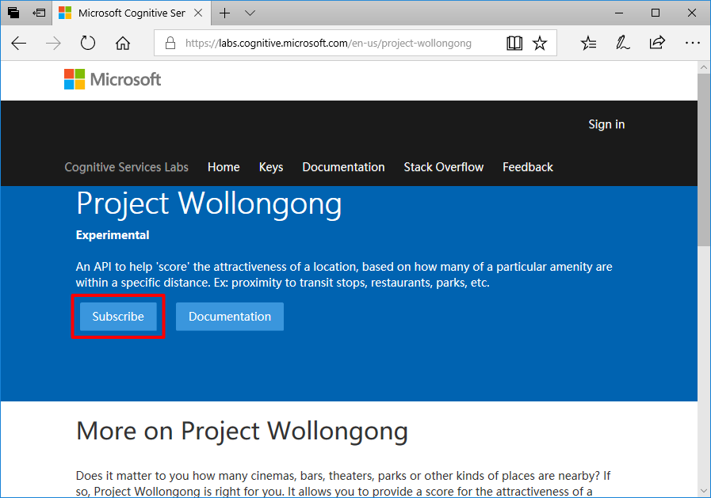
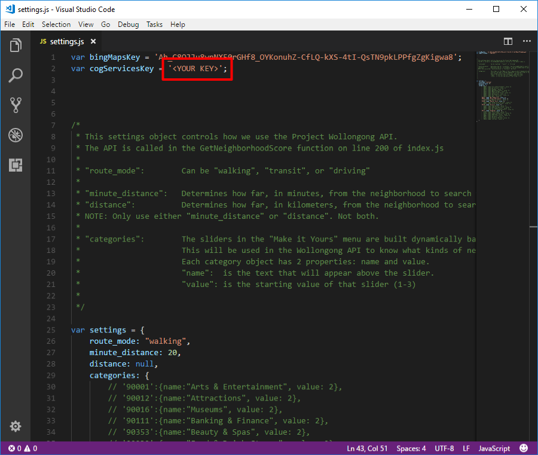

# Deploying the ContosoBNB Web Applicaiton #
---

## Overview ##

This take way resource is a short-term vacation-rental web application called ContosoBNB. The application incorporates the Project Local Insights API from Cognitive Services to provide a custom score for the attractiveness of a location according to a user's select preferences. The resultant application is able to render a Bing Maps image of several cities within the United States, where circles appear on the rendered map to represent neighborhoods, and each circle displays a number that corresponds to the number of available properties within that neighborhood. Neighborhoods are also rated according to preference settings that the user can adjust.

### Prerequisites ###

The following are required to deploy this application:

- A key for the Project Local Insights API. If you haven't already, [subscribe to Project Local Insights](https://labs.cognitive.microsoft.com/en-us/project-local-insights).
- Your favorite development environment for web applications. If you don't have one, try Microsoft Visual Studio Code, with [downloads for Windows, Linux, and Mac available here](https://code.visualstudio.com/download).
- An active Azure subscription
- A FTP client to upload the source files within the decompressed .zip file. 

## Steps ##

To deploy the ContosoBNB web application you will need to follow the steps below:

1. After logging into the Azure Portal, you will need to create a 'Web App'.
  
  
  
2. Enter a unique name for your web app and select ***Windows*** for the OS.  

  
  
3. After your new web app is running, navigate to 'Deployment credentials' and enter unique FTP credentials.  

  
  
4. Navigate back to Overview and note the FTP username and host settings.  

  

5. Download the 'WebApp.zip' file containing source files [here](https://redshirttour.blob.core.windows.net/webapptakeaway/WebApp.zip)
6. Extract the downloaded .zip file.
7. If you haven't done so already, go to https://labs.cognitive.microsoft.com/en-us/project-local-insights and subscribe to Project Local Insights to get your key.

  

8. Once you have your key, navigate on your expanded files to the `WebApp\public\javascripts` folder, and then Right Click the **settings.js** file and select "Open with Code". (On a Mac, you can select the file in Finder, open the File menu, point to Open With, and then select Visual Studio Code.) Replace **\<YOUR KEY\>** with your Project Local Insights key (deleting the brackets "\<" and "\>" along with the letters "YOUR KEY"), and then save and close the file.

  
9. Using a FTP client of your choice, upload the extracted folders/files into the wwwroot folder on your web app.

  

10. From the Azure Portal restart the web app.
