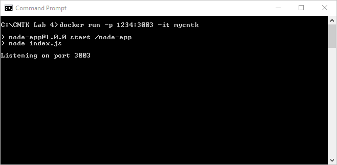
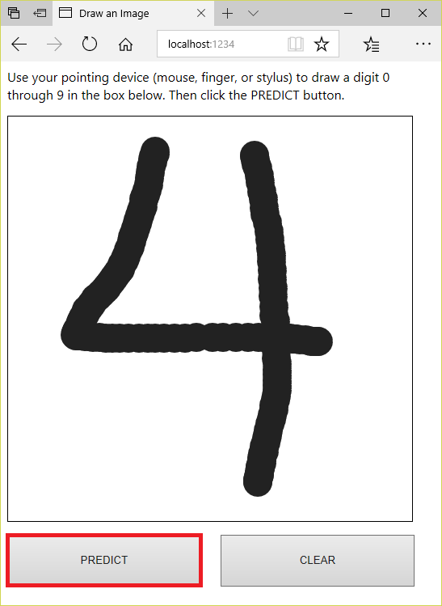

In the [previous lab](../3%20-%20Predict), you used Azure Machine Learning Workbench and the [Microsoft Cognitive Toolkit](https://www.microsoft.com/en-us/research/product/cognitive-toolkit/), also known as CNTK, to train three neural networks to recognize hand-written digits using data from the [MNIST database](http://yann.lecun.com/exdb/mnist/). You also scored the neural networks for accuracy using test data from the same database. The "compiled" networks were written to Azure blob storage.

In this lab, the fourth of four in a series, you will build a Docker image containing one of the compiled networks. The container will also include a rudimentary Web server written in [Node.js](https://nodejs.org/en/) that serves up a Web page in which users can sketch digits. A button click submits a digit to the neural network, which "predicts" which digit was drawn, providing a tangible demonstration of machine learning in action.


<a name="Objectives"></a>
### Objectives ###

In this hands-on lab, you will learn how to:

- Create a Docker image containing a neural network
- Run the image in a Docker container
- Invoke the neural network inside the container

<a name="Prerequisites"></a>
### Prerequisites ###

The following are required to complete this hands-on lab:

- An active Microsoft Azure subscription. If you don't have one, [sign up for a free trial](http://aka.ms/WATK-FreeTrial).
- [Docker](https://www.docker.com/)

If you haven't completed the [previous lab in this series](../3%20-%20Predict), you must do so before starting this lab.

---

<a name="Exercises"></a>
## Exercises ##

This hands-on lab includes the following exercises:

- [Exercise 1: Build a Docker image containing a neural network](#Exercise1)
- [Exercise 2: Run the image in a local container](#Exercise2)
- [Exercise 3: Use the neural network to identify digits](#Exercise3)

Estimated time to complete this lab: **30** minutes.

<a name="Exercise1"></a>
## Exercise 1: Build a Docker image containing a neural network ##

In this exercise, you will download the files created for the "One Convolution" network in the previous lab from blob storage and wrap them in a Docker container image. You will also write a Node.js app that listens for HTTP requests, serves up an HTML page for drawing digits, and implements a REST endpoint that the page can call to use the neural network to identify digits drawn by the user. The app, too, will be included in the container image.

1. Open the [Azure Portal](https://portal.azure.com) and return to the storage account that you created in the first lab. Open the container named "models" and confirm that among the many blobs there are ones named **02_OneConv.***.

	

	_Blobs representing the "One Convolution" network_

1. Download the blobs named **02_OneConv.*** one at a time and save them in a local directory on your hard disk.

	

	_Downloading a blob_

1. When downloaded from the Azure Portal, the blob named **02_OneConv** might have a **.txt** extension added to it. Check the downloaded file and if it's named **02_OneConv.txt**, rename the file **02_OneConv**.

1. Create a directory on your hard disk to hold all the files that will be built into a container image. Name the directory anything you want. Hereafter, this directory will be referred to as the "project directory."

1. Create a subdirectory named "models" in the project directory and copy all the files that you downloaded from blob storage in Step 2 into the "models" directory.

1. Create a subdirectory named "cntk" in the project directory and copy the file named **02-OneConv.cntk** from the [resources that you downloaded for the previous lab](https://topcs.blob.core.windows.net/public/300-cntk-resources-03.zip) into the "cntk" directory.

1. Create an empty subdirectory named "mnist" in the project directory.

1. Create a subdirectory named "public" in the project directory and add an HTML file named **index.html** containing the following statements:

	```html
	<html>
	<title>Draw an Image</title>
	<style>
	#canvas {
	    border:1px solid #000000;
	    margin-top: 16px;
	    margin-bottom: 16px;
	}
	button {
	    width: 240px;
	    height: 64px;
	    margin-right: 20px;
	}
	</style>
	
	<script type="text/javascript">
	var canvas, ctx, flag = false,
	    prevX = 0,
	    currX = 0,
	    prevY = 0,
	    currY = 0;
	
	function init() {
	    canvas = document.getElementById('canvas');
	    ctx = canvas.getContext("2d");
	    var w = canvas.width;
	    var h = canvas.height;
		
	    erase();
	
	    canvas.addEventListener("mousemove", function (e) {
	        findxy('move', e);
	    }, false);
	    canvas.addEventListener("mousedown", function (e) {
	        findxy('down', e);
	    }, false);
	    canvas.addEventListener("mouseup", function (e) {
	        findxy('up', e);
	    }, false);
	    canvas.addEventListener("mouseout", function (e) {
	        findxy('out', e);
	    }, false);
	}
	
	function draw() {
	    ctx.beginPath();
	    ctx.arc(currX, currY, 12, 0, 2 * Math.PI, false);
	    ctx.fillStyle = '#222222';
	    ctx.fill();
	    ctx.lineWidth = 12;
	    ctx.strokeStyle = '#222222';
	    ctx.stroke();
	}
	
	function erase() {
	    ctx.beginPath();
	    ctx.rect(0, 0, 500, 500);
	    ctx.fillStyle = "#ffffff";
	    ctx.fill();
	}
	
	function findxy(res, e) {
	    if (res == 'down') {
	        prevX = currX;
	        prevY = currY;
	        currX = e.clientX - canvas.offsetLeft;
	        currY = e.clientY - canvas.offsetTop;
	        flag = true;
	    }
	
	    if (res == 'up' || res == "out") {
	        flag = false;
	    }
	
	    if (res == 'move') {
	        if (flag) {
	            prevX = currX;
	            prevY = currY;
	            currX = e.clientX - canvas.offsetLeft;
	            currY = e.clientY - canvas.offsetTop;
	            draw();
	        }
	    }
	}
	
	var batchStr = "";
	
	function testImage() {
	    var scaledCanvas = document.createElement('canvas');
	    scaledCanvas.width = 28;
	    scaledCanvas.height = 28;
	    var scaledCtx = scaledCanvas.getContext('2d');
	    scaledCtx.drawImage(canvas, 0,0,28,28);
	    var cntkline = "|features";
		
	    for (var y = 0; y < 28; y++) {
	        for (var x = 0; x < 28; x++) {
	            var pixel = scaledCtx.getImageData(x, y, 1, 1).data;
	            cntkline += " " + (255 - pixel[0]);
	        }
	    }
		
	    batchStr = cntkline + "\n";
		
	    var xhr = new XMLHttpRequest();
	    xhr.open('POST', '/testImage', true);
	
	    xhr.onload = function () {
	        console.log(this.responseText);
	        var data = JSON.parse(this.responseText);
	        alert("Detected a " + data.detected);
	    };
	
	    xhr.send(batchStr);
	}
	</script>
	
	<body onload="init()">
	    <div id="instructions">
	        <span style="font-family: segoe ui">
	            Use your pointing device (mouse, finger, or stylus) to draw a digit 0 through 9 in the box below.
	            Then click the PREDICT button.
	        </span>
	    </div>
	
	    <canvas id="canvas" width="500" height="500"></canvas>
		
	    <div id="controls">
	        <button onclick="testImage()">PREDICT</button>
	        <button onclick="erase()">CLEAR</button>
	    </div>
	</body>
	</html>
	```

	This is the Web page that the Web server running inside the container serves up to allow users to draw digits and submit them to the model. It uses HTML5's [Canvas API](http://www.w3.org/TR/2dcontext/) to do the drawing in response to mouse events. And it features a PREDICT button that, when clicked, uses AJAX to call a REST endpoint in the container and pass in the data representing the digit that was drawn. 

1. Add a file named **index.js** containing the following statements to the project directory:

	```javascript
	var express = require("express");
	var bodyParser = require("body-parser");
	var path = require("path");
	var app = express();
	var exec = require("child_process").exec;
	var fs = require("fs");
	
	var port = 3003;
	
	app.use(express.static(path.join(__dirname, "public")));
	app.use(bodyParser.text());
	
	app.post('/testImage', function (req, res) {
	    fs.readdir("./cntk/", (err, files) => {
	        var results = {};
	        var testNework = function(file, digit) {
	            var cntkline = "|labels ";
	            for (var i = 0; i < 10; i++) {
	                var label = "0 ";
	                if (i == digit) {
	                    label = "1 ";
	                }
	                cntkline += label;
	            }
	
	            cntkline += req.body;
	            fs.writeFileSync("./mnist/Test-28x28_cntk_text.txt" , cntkline);
				
	            exec("cntk configFile=./cntk/" + file + " command=testNetwork", function(error, stdout, stderr) {
	                if (!error) {
	                    var lines = stderr.split("\n");
	
	                    for (var j = 0; j < lines.length; j++) {
	                        if (lines[j].startsWith("Final Results:")) {
	                            results[digit] = lines[j];
	                        }
	                    }
	
	                    if (digit == 9) {
	                        var detect = {detected: "Unknown!"};
	
	                        if (results["0"].indexOf("errs =") > 0) {
	                            var regex = /(.*errs = )(.*%)(.*)/g;
	                            for (var dig in results) {
	                                var matchDigitVal = parseFloat(results[dig].replace(regex, "$2"));
	                                if (matchDigitVal === 0) {
	                                    detect.detected = dig;
	                                }
	                            }
	                            res.json(detect);
	                        }
	                        else {
	                            var regex = /(.*rmse = )(.* )(.*)/g;
	                            var val = 99;
	                            for (var dig in results) {
	                                var matchDigitVal = parseFloat(results[dig].replace(regex, "$2"));
	                                if (matchDigitVal < val) {
	                                    val = matchDigitVal;
	                                    detect.detected = dig;
	                                }
	                            }
	                            res.json(detect);
	                        }
	                    }
	                    else {
	                        testNework(file, digit + 1);
	                    }							
	                }
	                else {
	                    res.send(stderr);
	                }
	            });
	        };
			
	        if (files.length > 0) {
	            testNework(files[0], 0);
	        }
	    });
	});
	
	app.listen(port);
	console.log("Listening on port " + port);
	```

	This file contains the code for the Node app. It uses the popular NPM package named [express](https://www.npmjs.com/package/express) to implement a minimalist Web server. Then it listens for HTTP requests, responds to requests for static files in the "public" directory, and implements a REST method named ```testImage``` that invokes the CNTK model to identify the digit passed in the body of the request.

1. Add a file named **package.json** containing the following statements to the project directory:

	```json
	{
	  "name": "node-app",
	  "version": "1.0.0",
	  "description": "A Node app to identify hand-written digits",
	  "main": "index.js",
	  "scripts": {
	    "test": "echo \"Error: no test specified\" && exit 1",
	    "start": "node index.js"
	  },
	  "dependencies": {
	    "body-parser": "^1.18.2",
	    "express": "^4.16.2"
	  }
	}
	```

	This file includes information about the Node app that is built into the container image, including the file that runs when the app is started (**index.js**) and a list of dependencies — packages that must be downloaded and installed in order for **index.js** to work. Package installation occurs when NPM INSTALL is executed as the container image is being built.

1. Add a file named **Dockerfile** (no file-name extension) containing the following statements to the project directory:

	```dockerfile
	FROM microsoft/mmlspark:plus-0.7.91
	USER root
	RUN curl https://cntk.ai/BinaryDrop/CNTK-2-3-Linux-64bit-CPU-Only.tar.gz  -o /home/mmlspark/CNTK.tar.gz && \
	    tar -xzf /home/mmlspark/CNTK.tar.gz && \
	    chown -R mmlspark:mmlspark cntk
	COPY . /node-app
	WORKDIR /node-app
	ENV PATH=/home/mmlspark/cntk/cntk/bin:$PATH
	ENV LD_LIBRARY_PATH=/home/mmlspark/cntk/cntk/lib:/home/mmlspark/cntk/cntk/dependencies/lib:$LD_LIBRARY_PATH
	RUN apt-get update && apt-get install -y curl && \
	    curl -sL https://deb.nodesource.com/setup_8.x | bash - && \
	    apt-get install -y nodejs && \
	    npm install
	EXPOSE 3003
	CMD npm start
	```

	This file contains instructions for building a Docker container image. It uses Microsoft's ```microsoft/mmlspark:plus-0.7.91``` as a base image and adds CNTK. It also installs Node.js in the container image, copies the files and subdirectories in the project directory into the container image, and opens port 3003 to HTTP traffic.

1. Add a file named **.dockerignore** containing the following statement to the project directory:

	```
	node_modules
	```

	Similar to **.gitignore** in a GitHub repository, this file tells Docker what NOT to include in the container image. In this case, it instructs Docker to ignore the "node_modules" directory, which is created when NPM INSTALL is run during the build process. 

1. Confirm that the project directory contains the files and subdirectories shown below. Also confirm that the "cntk" directory holds a file named **02-OneConv.cntk**, that the "public" directory contains a file named **index.html**, and that the "models" directory contains the **02_Conv.*** files that you downloaded from blob storage — 17 files in all.

	

	_Contents of the project directory_

1. Open a Command Prompt or terminal window and navigate to the project directory. Then execute the following command to build a container image using the files and subdirectories in the project directory and the **Dockerfile** containing build instructions:

	```
	docker build -t mycntk .
	```

	This command names the container image that is created "mycntk." It will probably take a few minutes to run. The faster your connection speed, the faster the command will execute.

Wait for the build process to complete. The container image is ready. Now let's run it in order to operationalize the neural network that you trained in the previous lab.

<a name="Exercise2"></a>
## Exercise 2: Run the image in a local container ##

In this exercise, you will operationalize the "One Convolution" network by running the image that you built in the previous exercise in a Docker container. You will run the container locally, but note that the same container could also be hosted in the cloud using the [Azure Container Service](https://azure.microsoft.com/services/container-service/) or [Azure Container Instances](https://azure.microsoft.com/services/container-instances/).

1. Return to the Command Prompt or terminal window in which you executed the ```docker build``` command in the previous exercise. Then execute the following command to run a container that uses the Docker image that you built:

	```
	docker run -p 1234:3003 -it mycntk
	```

	This command creates a container from the image named "mycntk" and runs it in interactive mode so that output from the code running in the container can be seen in the Command Prompt or terminal window. The ```-p``` switch redirects traffic destined for port 1234 on the local machine to port 3003 in the container — the port that the Web server running inside the container is listening on.

1. Confirm that the following output appears in the Command Prompt or terminal window indicating that the container is running and that the Web server is listening on port 3003:

	

	_Output from the running container_

The container is now running and listening for HTTP requests. The final step is to use the Web page inside it to draw a few digits and submit them to the neural network for identification.

<a name="Exercise3"></a>
## Exercise 3: Use the neural network to identify digits ##

In this exercise, you will use the HTML page in the container to draw a few digits and submit them to the neural network to test its ability to identify the digits that you drew.

1. Open a browser and navigate to http://localhost:1234. Confirm that the page shown below appears in the browser

	

	_Web page served up from the container_

1. Use your mouse to sketch a "4" into the grid, similar to the one shown below. Then click the **PREDICT** button.

    

    _Submitting a digit to the neural network_

1. In a moment, a message appears telling you what digit you drew. Is it correct?

1. Click the **Clear** button to clear the display. Then try a few other digits. You'll probably find that the model you built is better at identifying some digits than others, and that you get the best results when the digits you draw fill the expanse of the drawing area as much as possible.

It's a pretty impressive feat for an app to perform basic OCR in this manner. And it's indicative of the kinds of apps you can build when you have machine learning working for you on the back end.

<a name="Summary"></a>
## Summary ##

Machine learning provides a foundation for building intelligent apps. Azure Machine Learning Workbench simplifies the task of building and operationalizing machine-learning models, and it works on macOS as well as Windows. Moreover, it works with a wide variety of machine-learning libraries, including Microsoft's CNTK, which excels at building neural networks. The series of labs that you just completed demonstrates one way to leverage Azure Machine Learning Workbench to build apps that incorporate machine learning. For further insights into Workbench and an additional tutorial, see https://docs.microsoft.com/en-us/azure/machine-learning/preview/tutorial-classifying-iris-part-1.

---

Copyright 2018 Microsoft Corporation. All rights reserved. Except where otherwise noted, these materials are licensed under the terms of the MIT License. You may use them according to the license as is most appropriate for your project. The terms of this license can be found at https://opensource.org/licenses/MIT.
