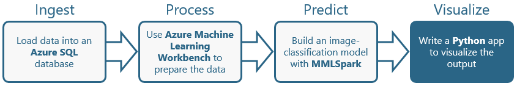

TODO: Add introduction.



<a name="Objectives"></a>
### Objectives ###

In this hands-on lab, you will learn how to:

- tk
- tk
- tk

<a name="Prerequisites"></a>
### Prerequisites ###

The following are required to complete this hands-on lab:

- [Docker](https://www.docker.com/)
- [Node.js](https://nodejs.org/en/)

If you haven't completed the [previous lab in this series](../3%20-%20Predict), you must do so before starting this lab.

---

<a name="Exercises"></a>
## Exercises ##

This hands-on lab includes the following exercises:

- [Exercise 1: Wrap the model in a Web service](#Exercise1)
- [Exercise 2: Run an app that calls the Web service](#Exercise2)

Estimated time to complete this lab: **30** minutes.

<a name="Exercise1"></a>
## Exercise 1: Wrap the model in a Web service ##

TODO: Add introduction.

1. tk.

	

	_tk_

1. tk.

	

	_tk_

1. tk.

	

	_tk_

1. tk.

	

	_tk_

1. tk.

	```python
	import cntk as C
	from PIL import Image
	import numpy as np
	from io import BytesIO
	import base64
	from flask import Flask, request, jsonify
	
	app = Flask(__name__)
	model = C.load_model('PaintingsTransferLearning.model')
	
	def eval_single_image(loaded_model, image_bytes):
	    try:
	        image_dims = (3, 224, 224)
	        img = Image.open(BytesIO(image_bytes)).convert('RGBA')
	        resized = img.resize((image_dims[2], image_dims[1]), Image.ANTIALIAS)
	        bgr_image = np.asarray(resized, dtype=np.float32)[..., [2, 1, 0]]
	
	        hwc_format = np.ascontiguousarray(np.rollaxis(bgr_image, 2))
	        arguments = {loaded_model.arguments[0]: [hwc_format]}
	        output = loaded_model.eval(arguments)
	
	        sm = C.softmax(output[0])
	        return sm.eval()
	
	    except:
	        return [-1.0, -1.0, -1.0]
	
	@app.route('/analyze', methods=['POST'])
	def analyze():
	    data = request.json['image']
	    bytes = base64.b64decode(data)
	    result = eval_single_image(model, bytes)
	
	    output = {}
	    output['Picasso'] = float(str(result[0]))
	    output['Monet'] = float(str(result[1]))
	    output['VanGogh'] = float(str(result[2]))
	    return jsonify(output)
	
	if __name__ == '__main__':
	    app.run(debug=True, port=8008, host='0.0.0.0')
	```

1. tk.

	

	_tk_

1. tk.

	```dockerfile
	FROM microsoft/mmlspark:plus-0.9.9
	USER root
	#RUN curl https://cntk.ai/BinaryDrop/CNTK-2-3-Linux-64bit-CPU-Only.tar.gz  -o /home/mmlspark/CNTK.tar.gz && \
	#    tar -xzf /home/mmlspark/CNTK.tar.gz && \
	#    chown -R mmlspark:mmlspark cntk
	# ENV PATH=/home/mmlspark/cntk/cntk/bin:$PATH
	# ENV LD_LIBRARY_PATH=/home/mmlspark/cntk/cntk/lib:/home/mmlspark/cntk/cntk/dependencies/lib:$LD_LIBRARY_PATH
	RUN pip install https://cntk.ai/PythonWheel/CPU-Only/cntk-2.3.1-cp35-cp35m-linux_x86_64.whl
	RUN pip install pillow
	RUN pip install flask
	RUN mkdir /app
	COPY app.py /app
	COPY PaintingsTransferLearning.model /app
	WORKDIR /app
	EXPOSE 8008
	ENTRYPOINT ["python"]
	CMD ["app.py"]
	```

1. tk.

	

	_tk_

1. tk.

	```
	docker build -t spark-server .
	```

1. tk.

	```
	docker run -p1234:8008 spark-server
	```

1. Verify output.

TODO: Add closing.

<a name="Exercise2"></a>
## Exercise 2: Run an app that calls the Web service ##

TODO: Add introduction.

1. tk.

	

	_tk_

1. tk.

	

	_tk_

1. tk.

	

	_tk_

1. tk.

	

	_tk_

1. tk.

	

	_tk_

TODO: Add closing.

<a name="Exercise3"></a>
## Exercise 3: tk ##

TODO: Add introduction.

1. tk.

	

	_tk_

1. tk.

	

	_tk_

1. tk.

	

	_tk_

1. tk.

	

	_tk_

1. tk.

	

	_tk_

TODO: Add closing.

<a name="Summary"></a>
## Summary ##

TODO: Add summary.

---

Copyright 2018 Microsoft Corporation. All rights reserved. Except where otherwise noted, these materials are licensed under the terms of the MIT License. You may use them according to the license as is most appropriate for your project. The terms of this license can be found at https://opensource.org/licenses/MIT.
