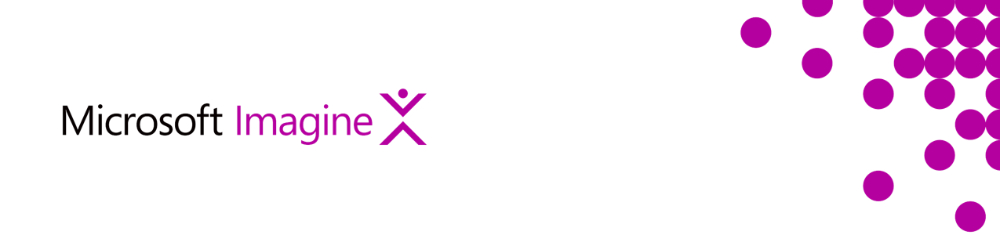
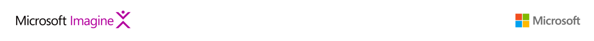

# Data Storage

Storage needs for today’s systems vary from basic file storage to NoSQL
(sharded/partitioned) to relational databases (OLTP, OLAP). We deal with
structured, unstructured and semi-structured data, with stream
processing Topic/Queue based storage is emerging.  
- [NoSQL Storage: Cosmos DB](#nosql-storage-cosmos-db)  
- [File/Blob Storage: Azure Storage](#fileblob-storage-azure-storage)  
- [Structured Storage: Azure SQL Database](#structured-storage-azure-sql-database)  
- [Structured Storage: PostgreSQL](#structured-storage-postgresql)  
- [Structured Storage: MySQL](#structured-storage-mysql)  
- [OLAP: Azure SQL Data Warehouse](#olap-azure-sql-data-warehouse)  
- [Redis Cache: Azure Redis Cache](#redis-cache-azure-redis-cache)  
- [Big Data Storage: Azure Data Lake Store](#big-data-storage-azure-data-lake-store)  

## NoSQL Storage: Cosmos DB

NoSQL based storage is fast and provides low latency reads and writes.
There are many IaaS offerings in Azure that allow use of popular NoSQL
implementations including MongoDB, HBase and Cassandra. Cosmos DB is
NoSQL storage that provides geo-replication, elastic scale, sub second
reads/writes, tunable consistency and no limit on the number of
operations per table. You can develop document, key/value, or graph
databases with Cosmos DB using a series of popular APIs and programming
models like MongoDB, DocumentDB SQL and Azure Tables.

[Learn More](https://docs.microsoft.com/en-us/azure/cosmos-db/introduction)  
[Get Started](https://docs.microsoft.com/en-us/azure/cosmos-db/create-documentdb-dotnet)

## File/Blob Storage: Azure Storage

File storage is fundamental to any system. Azure Storage is massively
scalable, so you can store and process hundreds of terabytes of data to
support big data scenarios or small amounts of data for a small business
website. Azure Storage also provides the storage foundation for Azure
Virtual Machines, a further testament to its robustness. Azure Storage
provides auto partitioning and load balancing and access to a global
audience by using multiple language API’s.

[Learn More](https://docs.microsoft.com/en-us/azure/storage/storage-introduction)  
[Get Started](https://docs.microsoft.com/en-us/azure/storage/storage-create-storage-account)

## Structured Storage: Azure SQL Database

With Azure, there is no need to install and manage your own Microsoft
SQL Server database. SQL Database is a general-purpose relational
database that supports structures such as relational data, JSON,
spatial, and XML. Azure SQL Database provides SQL data access as a
service based on the Microsoft SQL Server database engine.

[Learn More](https://docs.microsoft.com/en-us/azure/sql-database/sql-database-technical-overview)  
[Get Started](https://docs.microsoft.com/en-us/azure/sql-database/sql-database-get-started-portal)  

## Structured Storage: PostgreSQL

The Azure Database for PostgreSQL service provides a database as a
service offering based on open source database PostgreSQL. This version
of the PostgreSQL as a service is built on the community edition of
PostgreSQL.

[Learn More](https://docs.microsoft.com/en-us/azure/postgresql/overview)  
[Get Started](https://docs.microsoft.com/en-us/azure/postgresql/quickstart-create-server-database-portal)

## Structured Storage: MySQL

The Azure Database for MySQL is a service offering based on the
community edition of MySQL.

[Learn More](https://docs.microsoft.com/en-us/azure/mysql/overview)  
[Get Started](https://docs.microsoft.com/en-us/azure/mysql/quickstart-create-mysql-server-database-using-azure-portal)

## OLAP: Azure SQL Data Warehouse

Azure SQL Data Warehouse is a scale out massive parallel processing
platform based on standard SQL (T-SQL). The Azure SQL Data Warehouse
solution provides the capability to scale storage and compute
independently of one another.

[Learn More](https://docs.microsoft.com/en-us/azure/sql-data-warehouse/sql-data-warehouse-overview-what-is)  
[Get Started](https://docs.microsoft.com/en-us/azure/sql-data-warehouse/sql-data-warehouse-get-started-tutorial)

## Redis Cache: Azure Redis Cache

Based on the open source Redis Cache implementation, Azure Redis Cache
provides low latency data access using the Redis key-value data store.
Scale data access independent from data storage to provide lightning
fast data access for application services.

[Learn More](https://docs.microsoft.com/en-us/azure/redis-cache/)  
[Get Started](https://docs.microsoft.com/en-us/azure/redis-cache/cache-dotnet-how-to-use-azure-redis-cache)  

## Big Data Storage: Azure Data Lake Store

Azure Data Lake Store is a multi-purpose storage facility for big data
analytics that has unlimited storage capability. This is the equivalent
to HDFS with Hadoop. The Azure Data Lake Store provides Petabyte storage
with open integration for any processing framework that utilizes open
Source HDFS. Azure Data Lake offers additional capabilities not provided
by HDFS including: data encryption at rest, role based security, and
integration with a full-fledged key vault.

[Learn More](https://docs.microsoft.com/en-us/azure/data-lake-store/data-lake-store-overview)  
[Get Started](https://docs.microsoft.com/en-us/azure/data-lake-store/data-lake-store-get-started-portal)  
