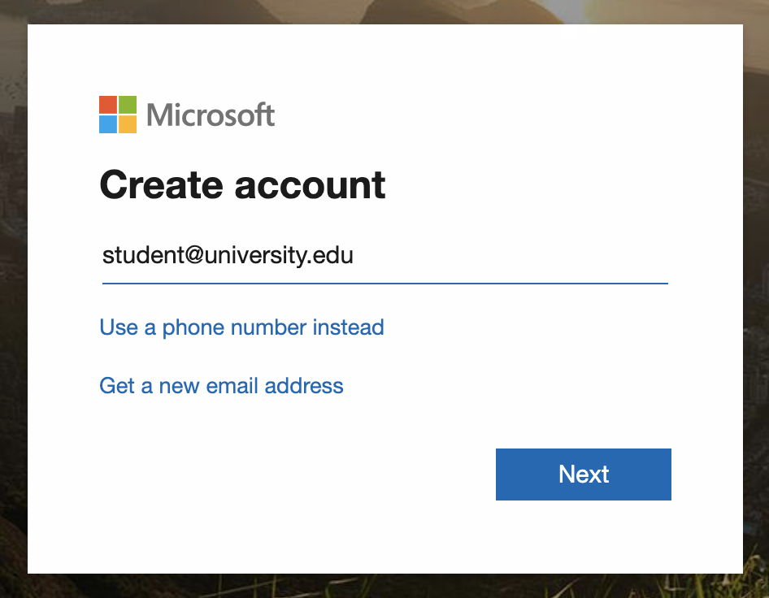
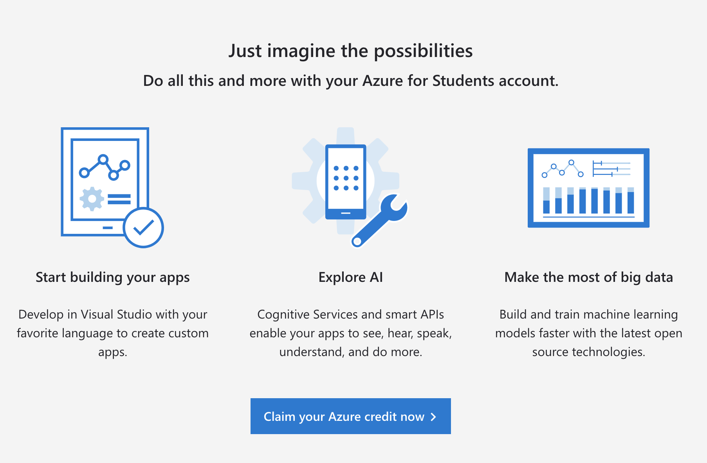
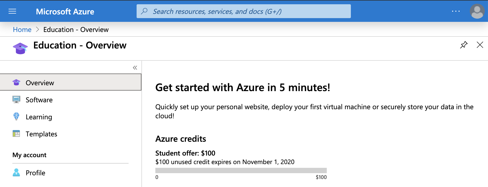

# Azure Tips and Tricks

## Signing up for Azure for Students
Signing up for Azure for Students is a fairly straightforward process for 4-Year-University and Community College students who 
have .edu email addresses. You do not need a credit card to sign up, and get $100 free credit to use with Azure for 1 year!
Just follow these steps to get started:
1. [Create a new Microsoft account here](https://account.microsoft.com/account?WT.mc_id=academiccontent-github-cxa). You should use your .edu email
address for this:  

2. Click Activate Now on the [Azure for Students Sign Up Page](https://azure.microsoft.com/free/students/?WT.mc_id=academiccontent-github-cxa). Make sure 
you login with your .edu email address that you used in Step 1. 
3. Complete the Student Verification process, which will include putting in your name, school email address, and verifying your
idenity through a phone number. 
4. You will immediately be taken to the Education Hub, from here you can Activate your Azure for Students subscription. Clicking
in the hub to claim your credit will take you back to the public facing page (though this time you will be logged in). Scroll
down and click on Claim Your Azure Credit Now.  

5. When you've completed this, the Education Hub in Azure should show your credits.  

6. To get back to the Azure Portal, go to [portal.azure.com](https://portal.azure.com/)
7. To get back to the Education Hub, search "Education" in the Azure Portal.
