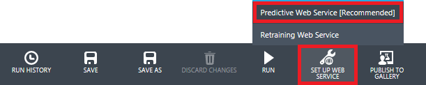
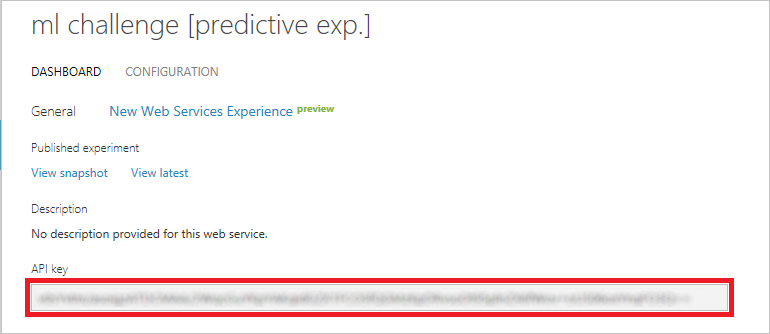
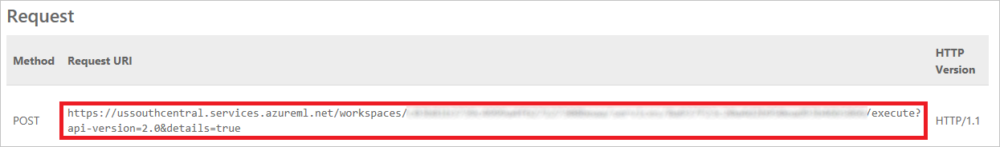

<a name="Overview"></a>
## Overview ##

Machine learning, which facilitates predictive analytics using large volumes of data by employing algorithms that iteratively learn from that data, is one of the fastest growing areas of computer science. Its uses range from credit-card fraud detection and self-driving cars to optical character recognition (OCR) and online shopping recommendations. It makes us smarter by making computers smarter. And its usefulness will only increase as more and more data becomes available and the desire to perform predictive analytics from that data grows, too.

[Azure Machine Learning](https://azure.microsoft.com/en-us/services/machine-learning/) is a cloud-based predictive-analytics service that offers a streamlined experience for data scientists of all skill levels. It's accompanied by the Azure Machine Learning Studio (ML Studio), which is a browser-based tool that provides an easy to use, drag-and-drop interface for building machine-learning models. It comes with a library of time-saving experiments and features best-in-class algorithms developed and tested in the real world by Microsoft businesses such as Bing. And its built-in support for [R](https://www.r-project.org/) and [Python](https://www.python.org/) means you can build custom scripts  to customize your model. Once you've built and trained your model in the ML Studio, you can easily expose it as a Web service that is consumable from a variety of programming languages, or share it with the community by placing it in the [Cortana Intelligence Gallery](https://gallery.cortanaintelligence.com/).

In the Machine Learning Challenge, you will use Azure Machine Learning to build a simple (and not terribly accurate) machine-learning model utilizing on-time arrival data for a major U.S. airline. Then, on your own, you will use "hints" we provide to tune the model and increase its accuracy. The goal is to create a model that might be useful in the real world for predicting, at booking time, whether a given flight is likely to arrive on time. It is precisely the kind of problem that machine learning is commonly used to solve. And it's a great way to increase your machine-learning chops while getting acquainted with Azure Machine Learning.

<a name="Prerequisites"></a>
### Prerequisites ###

The following are required to complete the challenge:

- A Microsoft account
- A modern browser such as Microsoft Edge or Google Chrome

---
<a name="Exercises"></a>
## Exercises ##

This challenge includes the following exercises:

- [Exercise 1: Create an experiment and load a dataset](#Exercise1)
- [Exercise 2: Train a classification model](#Exercise3)
- [Exercise 3: Tune the model](#Exercise3)
- [Exercise 4: Operationalize the model (optional)](#Exercise4)

<a name="Exercise1"></a>
## Exercise 1: Create an experiment and load a dataset ##

The first step in employing Azure Machine Learning is to create a new learning experiment. In this exercise, you'll get a Machine Learning experiment up and running in Azure ML Studio. You will also upload a dataset containing on-time arrival information for one of the United States' largest airlines. This data is a subset of a much larger [dataset](https://www.transtats.bts.gov/DL_SelectFields.asp?Table_ID=236&DB_Short_Name=On-Time) that is publicly available from the Bureau of Transportation Statistics.

1. In your Web browser, navigate to http://studio.azureml.net and click the **Sign Up** button.

    

    _Signing in to ML Studio_

1. Click **Sign In** under Free Workspace. Then sign in using your Microsoft account.

    

    _Choosing a workspace_

1. Click **+ NEW** in the lower-left corner of the page, and then click **Blank Experiment** to start a new experiment.

    

    _Creating a new experiment_

1. Click the experiment title at the top of the page ("Experiment created on...") and type "ML Challenge" as the new experiment name.

    

    _Naming the experiment_

1. Now that the experiment has been created, the next step is to import the data that you will use to train a model. Click **+ NEW** in the lower-left corner of ML Studio. Then click **DATASET**, followed by **FROM LOCAL FILE**.

    

    _Creating a new dataset_

1. Click the **Browse** button. Navigate to this lab's "Resources" subdirectory and select the file named **FlightData.csv**. Make sure **Generic CSV File with a header (.csv)** is selected as the dataset type. Optionally enter a friendly name for the dataset, and then click the check mark in the lower-right corner to begin uploading the dataset.

	> The "Resources" folder also contains a larger dataset named **BigFlightData.csv** that will come in handy in [Exercise 3](#Exercise3). For now, use the smaller dataset to keep training time to a minimum.

    

    _Uploading the dataset_

1. Wait for the upload to finish. Then go to the modules palette on the left and find the dataset you just uploaded under **Saved Datasets**. Drag the dataset from the modules palette and drop it onto the canvas (the gray area to the right).

    

    _Adding the dataset to the model_

1. To see what this dataset looks like, click the output port (the circle with the "1" in it) at the bottom of the dataset and select **Visualize**.

    

    _Visualizing the dataset_

1. Take a moment to examine the dataset. It contains 18,463 rows and 26 columns. Each row represents one flight and contains important information about that flight, including the date that the flight took place (YEAR, MONTH, and DAY_OF_MONTH), the origin and destination (ORIGIN and DEST), the scheduled departure and arrival times (CRS_DEP_TIME and CRS_ARR_TIME), the difference between the scheduled arrival time and the actual arrival time in minutes (ARR_DELAY), and whether the flight was late by 15 minutes or more (ARR_DEL15). The dataset includes a roughly even distribution of dates, which is important because a flight out of Minneapolis is less likely to be delayed due to winter storms in July than it is in January.

    

    _Browsing the dataset_

	Here is a complete list of the columns in the dataset. Times such as departure times and arrival times are expressed in military time, where, for example, 1130 equals 11:30 a.m. and 1500 equals 3:00 p.m.

	| Column              | Description                                                                      |
	|---------------------|----------------------------------------------------------------------------------|
	| YEAR                | Year that the flight took place                                                  |
	| QUARTER             | Quarter that the flight took place (1-4)                                         |
	| MONTH               | Month that the flight took place (1-12)                                          |
	| DAY_OF_MONTH        | Day of the month that the flight took place (1-31)                               |
	| DAY_OF_WEEK         | Day of the week that the flight took place (1=Monday, 2=Tuesday, etc.)           |
	| UNIQUE_CARRIER      | Airline carrier code (e.g., DL)                                                  |
	| TAIL_NUM            | Aircraft tail number                                                             |
	| FL_NUM              | Flight number                                                                    |
	| ORIGIN_AIRPORT_ID   | ID of the airport of origin                                                      |
	| ORIGIN              | Origin airport code (ATL, DFW, SEA, etc.)                                        |
	| DEST_AIRPORT_ID     | ID of the destination airport                                                    |
	| DEST                | Destination airport code (ATL, DFW, SEA, etc.)                                   |
	| CRS_DEP_TIME        | Scheduled departure time                                                         |
	| DEP_TIME            | Actual departure time                                                            |
	| DEP_DELAY           | Number of minutes departure was delayed                                          |
	| DEP_DEL15           | 0=Departure delayed less than 15 minutes, 1=Departure delayed 15 minutes or more |
	| CRS_ARR_TIME        | Scheduled arrival time                                                           |
	| ARR_TIME            | Actual arrival time                                                              |
	| ARR_DELAY           | Number of minutes flight arrived late                                            |
	| ARR_DEL15           | 0=Arrived less than 15 minutes late, 1=Arrived 15 minutes or more late           |
	| CANCELLED           | 0=Flight was not cancelled, 1=Flight was cancelled                               |
	| DIVERTED            | 0=Flight was not diverted, 1=Flight was diverted                                 |
	| CRS_ELAPSED_TIME    | Scheduled flight time in minutes                                                 |
	| ACTUAL_ELAPSED_TIME | Actual flight time in minutes                                                    |
	| DISTANCE            | Distance traveled in miles                                                       |

	Not all of the columns are relevant to a predictive model. For example, the flight number probably has no bearing whatsoever on whether a flight will arrive on time, and at the time you book a ticket, you have no way of knowing whether a flight will be cancelled or diverted or its departure delayed. That's OK, because when you build a model in the next exercise, you will filter out such columns. 

1. Click any column in the dataset to see a detail of that column on the right.

    

    _Viewing a column detail_

1. Close the visualization window by clicking the "**x**" in the upper-right corner.

The data is loaded. Now it's time to do something with it.

<a name="Exercise2"></a>
## Exercise 2: Train a classification model ##

In this exercise, you will use ML Studio's drag-and-drop user interface to train an ML model. *Training* involves picking a machine-learning algorithm and feeding data into the model. During training, the computer looks for patterns in the data that it can use to predict values from future inputs.

There are several types of machine-learning models. One of the most common is the regression model, which uses one of a number of regression algorithms to produce a numeric value — for example, a person's age or the probability that a credit-card transaction is fraudulent. You will be training a classification model, which seeks to resolve a set of inputs into one of a set of known outputs. A classic example of a classification model is one that examines e-mails and classifies them as "spam" or "not spam." Your model will use the dataset you uploaded in the previous exercise and predict whether a flight will arrive on-time or late.

1. At the top of the modules palette, type "select columns" (without quotation marks) into the search box to find the [Select Columns in Dataset](https://msdn.microsoft.com/library/azure/dn905883.aspx) module. Drag the module to the experiment canvas and drop it underneath the dataset. Then connect the output port of the dataset to the input port of the Select Columns in Dataset module by dragging an arrow downward from the output port.

    

    _Adding a Select Columns in Dataset module_

     > A key concept to understand in Azure ML Studio is that of ports and connectors. In this step, you connected the output port of the dataset to the input port of the Select Columns in Dataset module. The data flows from one module to the next through the connector. Some modules support multiple inputs and outputs and therefore have multiple input and output ports. If you want to know what a port does, hover over it with the mouse and a tooltip will pop up. If you want more information, right-click on the module and select **Help** from the popup menu.

1. Click the Select Columns in Dataset module to select it. (When selected, it has a bold blue border.) Then click the **Launch column selector** button in the Properties pane on the right.

    

    _Launching the column selector_

1. Select the following columns in the "Available Columns" box:

	- MONTH
	- DAY_OF_MONTH
	- DAY_OF_WEEK
	- ORIGIN
	- DEST
	- CRS_DEP_TIME
	- ARR_DEL15

	Then click the right-arrow to move them to the "Selected Columns" box. These are the columns, or "features," upon which you will base your predictive model. When you're finished, click the check mark in the lower-right corner of the dialog.

    

    _Selecting feature columns_

1. Type "edit" into the search box at the top of the modules palette. Then add an [Edit Metadata](https://msdn.microsoft.com/library/azure/dn905986.aspx) module to the canvas and connect it to the Select Columns in Dataset module.

    

    _Adding an Edit Metadata module_

1. Click the empty box to the right of **column names** and select **ARR_DEL15** from the drop-down list. Then click the check mark in the lower-right corner.

    

    _Selecting the ARR_DEL15 column_

1. Go to the Properties pane and set **Categorical** to **Make categorical** and **Fields** to **Label**. This tells Azure Machine Learning that ARR_DEL15 is a categorical field rather than a numeric field, and that it is ultimately the value that the model will attempt to predict.

    

    _Designating ARR_DEL15 as a categorical field_

1. Add a [Split Data](https://msdn.microsoft.com/library/azure/dn905969.aspx) module to the model and connect the output from Edit Metadata to the input of Split Data. The purpose of Split Data is to split a single dataset into one that can be used for training, and another that can be used for scoring. It's very useful when you have just one dataset to work with. With Split Data selected on the canvas, change **Fraction of rows in the first output dataset** to 0.8. This will perform an 80-20 split on the data, with 80% exiting the left output port of the module, and 20% exiting the right output port.

    

    _Adding a Split Data module_

1. Add a [Train Model](https://msdn.microsoft.com/en-us/library/azure/dn906044.aspx) module to the model and connect the output from Split Data to the right input of Train Model. Then add a [Two-Class Logistic Regression](https://msdn.microsoft.com/library/azure/dn905994.aspx) module and connect its output to Train Model's left input.

	> [Logistic regression](http://machinelearningmastery.com/logistic-regression-for-machine-learning/) is a well-known method in statistics that is used to predict the probability of an outcome, and is especially popular for classification tasks. By connecting Two-Class Logistic Regression to Train Model, you are specifying the learning algorithm that the model will use. This does not prevent you from experimenting with other algorithms later on.

    

    _Specifying a learning algorithm_

1. Make sure Train Model is selected, and then click **Launch column selector** in the Properties pane. In the ensuing dialog, select the ARR_DEL15 column, and then click the check mark to dismiss the dialog. *This is important, because it identifies for the Train Model module the value that the model will predict*.

    

    _Specifying the target feature_

1. Complete the model by adding a [Score Model](https://msdn.microsoft.com/library/azure/dn905995.aspx) module and an [Evaluate Model](https://msdn.microsoft.com/library/azure/dn905915.aspx) module and connecting them as shown below.

    

    _Completing the model_

1. Click **Save** in the ribbon at the bottom of the page to save the model. Then click **Run** to run the model and train it with the dataset you uploaded.

    

    _Saving and running the model_

1. Wait for the model to finish running. (It should take a minute or less.) Then click the output port at the bottom of the Evaluate Model module and select **Visualize** to gauge the results. Scroll down until you see the panel below, which lists key metrics such as accuracy, precision, and AUC (Area Under Curve).

    

    _Key metrics regarding the model_

	There are several ways to measure the "accuracy" of a binary classification model. Currently, your model has an accuracy of 87% and a precision of 1.000, which seem good taken at face value. However, it is not a very robust model. The [F1 score](https://en.wikipedia.org/wiki/F1_score), which is a weighted average of precision and recall and a reasonable indicator of overall performance, is 0. And AUC is 0.621, which basically means that the model only makes an accurate prediction 62% of the time. In other words, you could get almost the same results by flipping a coin. For more information on the meaning of accuracy, precision, F1 score, AUC, and other metrics, see https://blogs.msdn.microsoft.com/andreasderuiter/2015/02/09/performance-measures-in-azure-ml-accuracy-precision-recall-and-f1-score/.

	For our purposes, we will use AUC to judge the quality of our model. At the top of the visualization window is a graphical depiction of AUC:

    

	The diagonal line in the middle represents a 50-50 chance of obtaining a correct answer. The blue curve generated from your model isn't much better than that. What you *want* is something more like this, which represents an AUC of 0.92:

	

1. Close the visualization window by clicking the "**x**" in the upper-right corner.

In the following exercise, you will tune the model to make it more "accurate" using a variety of techniques that are common in data science.	We won't tell you exactly how to apply these techniques, but we will tell you what some of these techniques are and provide helpful hints regarding their use and implementation.

<a name="Exercise3"></a>
## Exercise 3: Tune the model ##

Now comes the fun part, where you put on your data-scientist hat and tune the model for higher accuracy. The goal is to increase AUC to 0.90 or more, as pictured above. It can be done — but it requires some expertise.

To help, we have provided six hints suggesting techniques that a trained data scientist might use to produce a more robust model. These aren't the only ways to get AUC to 90%, but they're a good place to start. 

### Hint #1: Try different algorithms ###

ML Studio includes nine binary (two-class) classification algorithms that you can employ in a model. Even seasoned data scientists often don't know which algorithm will produce the best results until they try them out. That's one of the strengths of Azure Machine Learning: trying different algorithms is as simple as swapping one module for another.

The model you built in [Exercise 2](#Exercise2) uses [Two-Class Logistic Regression](https://msdn.microsoft.com/library/azure/dn905994.aspx), which is a popular algorithm that uses regression to compute the probability of each of two possible results. Experiment with different algorithms to see which produces the best result.

### Hint #2: Tune the learning algorithm ###

Each algorithm in Azure Machine Learning exposes parameters that you can use to tune its performance. When an algorithmic module such as [Two-Class Logistic Regression](https://msdn.microsoft.com/library/azure/dn905994.aspx) is selected on the canvas, its parameters appear in the Properties pane on the right.


_Parameters for Two-Class Logistic Regression_

Experimenting with different parameters frequently improves the accuracy of a model, but can also require a lot of time. That's why Azure Machine Learning offers a module named [Tune Model Hyperparameters](https://msdn.microsoft.com/library/azure/dn905810.aspx). Replacing [Train Model](https://msdn.microsoft.com/library/azure/dn906044.aspx) with Tune Model Hyperparameters allows the latter to find the optimum combination of parameter values for you at the expense of increased training time. 


_Using Tune Model Hyperparameters_

Tune Model Hyperparameters isn't the only way to tune the learning algorithm. For additional ideas, see https://docs.microsoft.com/azure/machine-learning/machine-learning-algorithm-parameters-optimize.

### Hint #3: Mitigate the effect of cancelled flights ###

The dataset that you are using contains 80 rows representing cancelled flights. These flights are represented by 1s in the CANCELLED column, which you filtered out with the [Select Columns in Dataset](https://msdn.microsoft.com/library/azure/dn905883.aspx) module in [Exercise 2](#Exercise2). Rows representing cancelled flights have no ARR_DEL15 values, which skews the dataset and therefore the results. Visualize the column and you'll note that it has 111 missing values and three unique values, when it should have just two (0 and 1). These are red flags to a data scientist.


_The ARR_DEL15 column_

There are multiple ways in which you can attack this. One is to write an R or Python script that removes rows with missing data (or simply rows where CANCELLED=1) and inject it into the model using an [Execute R Script](https://msdn.microsoft.com/library/azure/dn905952.aspx) or [Execute Python Script](https://msdn.microsoft.com/library/azure/dn955437.aspx) module. Alternatively, since each row representing a cancelled flight has at least one missing feature (a column with no data), you could use the [Clean Missing Data](https://msdn.microsoft.com/library/azure/dn906028.aspx) module, which makes it very easy to remove rows with missing values.

### Hint #4: Reduce imbalance in the dataset ###

In a perfect world, the data used to train a two-class classification model would contain a 50-50 split of positives and negatives. In the real world, it rarely does. Imbalanced datasets adversely affect a model's accuracy. And right now, the data in the ARR_DEL15 column of the dataset you are using — the feature whose value you are attempting to predict — exhibits significant imbalance. The ratio of on-time arrivals to late arrivals is more than 6 to 1.


_The ARR_DEL15 column_

Data scientists use two techniques to reduce imbalance. *Upsampling* increases the number of samples from the minority class — in this case, by adding more rows representing late arrivals. *Downsampling* does the opposite, reducing the number of samples from the majority class.

There are three ways you can reduce imbalance in the datset you were given:

- Reduce the number of rows representing on-time arrivals
- Increase the number of rows representing late arrivals by importing rows from the larger dataset named **BigFlightData.csv** found in this lab's "Resources" folder (be careful not to duplicate rows that are already there, however, or use a [Remove Duplicate Rows](https://msdn.microsoft.com/library/azure/dn905805.aspx) module to delete them)
- Increase the number of rows representing late arrivals using the [Synthetic Minority Oversampling Technique](https://www.jair.org/media/953/live-953-2037-jair.pdf) (SMOTE)

Azure Machine Learning's [SMOTE](https://msdn.microsoft.com/library/azure/dn913076.aspx) module makes it easy to do the latter, synthetically increasing the number of minority samples using a nearest-neighbor approach. A model that uses SMOTE to reduce imbalance takes longer to train, but often produces better results than one that doesn't.

### Hint #5: "Bin" scheduled departure times ###

The CRS_DEP_TIME column of the dataset you are using represents scheduled departure times. The granularity of the numbers in this column — it contains 1,070 unique values — could have a negative impact on accuracy. This can be resolved using a technique called [binning](http://data-informed.com/enhance-machine-learning-with-standardizing-binning-reducing/) or quantization. What if you divided each number in this column by 100 and rounded down to the nearest integer? 1030 would become 10, 1925 would become 19, and so on, and you would be left with a maximum of 24 discrete values in this column. Intuitively, it makes sense, because it probably doesn't matter much whether a flight leaves at 10:30 a.m. or 10:40 a.m. It matters a great deal whether it leaves at 10:30 a.m. or 5:30 p.m.


_The CRS_DEP_TIME column_

There are several ways to accomplish binning in Azure Machine Learning. One of them is the [Group Data Into Bins](https://msdn.microsoft.com/library/azure/dn913065.aspx) module. More often, data scientists prefer to write a few lines of R or Python code, which are easily incorporated into a model using [Execute R Script](https://msdn.microsoft.com/library/azure/dn905952.aspx) or [Execute Python Script](https://msdn.microsoft.com/library/azure/dn955437.aspx). Here's a simple Python script that bins CRS_DEP_TIME values as described above:

```python
# Assume df is the dataframe containing the data
for index, row in df.iterrows():
    df.loc[index, 'CRS_DEP_TIME'] = math.floor(row['CRS_DEP_TIME'] / 100)
```

If you bin departure times this way, you might experiment with different bin sizes as well. 

### Hint #6: Train with a larger dataset ###

The "Resources" folder accompanying this lab contains a larger version of the dataset you used in a file named **BigFlightData.csv**. It contains more than 92,000 rows. Training a model with a larger dataset often improves accuracy. Training will take longer, which is a good reason to tune the model to the extent possible with a smaller dataset, and *then* to introduce a larger dataset.

<a name="Exercise4"></a>
## Exercise 4: Operationalize the model (optional) ##

One of the strengths of Azure Machine Learning is that you can easily operationalize a model by deploying it as a Web service. Once a model is deployed in this manner, you can write client apps that leverage its intelligence by placing calls to the Web service's REST endpoint. Client apps can be written in Java, C#, JavaScript or just about any language you choose because REST calls travel over HTTP, and virtually all programming languages support HTTP.

The "Client" folder that accompanies the challenge contains a desktop app written with [Node.js](https://nodejs.org/) and [Electron](https://electron.atom.io/) that runs on Windows, macOS, and Linux. If you would like to use the app to test the model that you built, simply follow the steps below.

1. In Azure ML Studio, click **SET UP WEB SERVICE** and select **Predictive Web Service**.

    

    _Setting up a predictive Web service_

1. If you used the SMOTE module in your model, **manually remove it from the predictive experiment** or else calls to the Web service will fail. You can delete a module from the predictive experiment the same way you delete it from the training experiment: by right-clicking the module and selecting **Delete**. If you do this, be sure to wire the model back up by connecting the output from the module that formerly provided input to SMOTE to the input of the module that received output from SMOTE.

1. Click **RUN** to run the experiment. When it has finished running, click **DEPLOY WEB SERVICE**.

    

    _Deploying the Web service_

1. Copy the API key into your favorite text editor so you can easily retrieve it in a moment. The API key is transmitted in an HTTP header in each call to the Web service and is used to reject unauthorized calls.

    

    _Copying the API key_

1. Click **REQUEST/RESPONSE** just below the API key. Then copy the Web-service URL into your favorite text editor so you can easily retrieve it.

    

    _Copying the Web-service URL_

1. Find the "Client" subdirectory that accompanies this lab and open the file named **predict.js** in your favorite text or code editor. Replace "api_key" on line 2 with the API key that you saved in Step 4. Replace "web_service_url" on line 3 with the Web-service URL that you saved in Step 5. Then save your changes to **predict.js**.

1. Open a Command Prompt window (Windows) or a Terminal window (macOS and Linux) and type the following command to determine whether Node.js is installed on your system:

	```
	node -v
	```

	If Node is not installed (if you don't see a Node version number), then go to https://nodejs.org/ and install the version of Node that matches your operating system.

1. In the Command Prompt or Terminal window, use a ```cd``` command to navigate to the "Client" directory accompanying this challenge. Then execute the following command:

	```
	npm install
	```

1. Wait the command to finish. Then type the following command to start the application:

	```
	npm start
	```

1. Confirm that the app starts and displays a window like this one:

    

    _The Flightalysis app_

1. Select an origin airport and a destination airport. Then select a date and a flight time and click the **Analyze** button. Confirm that after a brief pause, a message box appears indicating the probability that the flight will arrive late.

    

    _Predicting whether a flight will be late_

Experiment with different origins, destinations, dates, and departure times and see how the results vary. You will probably experience a greater probability of delays with flights that leave later in the day because earlier flights tend to run more on time.

---

Copyright 2017 Microsoft Corporation. All rights reserved. Except where otherwise noted, these materials are licensed under the terms of the MIT License. You may use them according to the license as is most appropriate for your project. The terms of this license can be found at https://opensource.org/licenses/MIT.
