# Harness the power of big data for your BNB rentals app #

<a name="Overview"></a>

## Overview ##

In this hands-on lab, you are acting as a new developer for a startup creating a short-term vacation rental sharing app called ContosoBNB. One feature planned for the ContosoBNB app is to help property owners by suggesting a rental rate  based on recent data about similar rental properties in the local market.

To develop this feature, your team has recently obtained public data about rental properties in four cities in the United States, each in a distinct [comma-separated value (CSV)](https://en.wikipedia.org/wiki/Comma-separated_values) file. You have been tasked with finding the most recent rental data in these large files and also with finding a way to search for all rental properties that match any given criteria within a specific area.

You devise the following plan:
Because your startup does not have the capital to build and maintain a big-data processing workstation, you decide first to create a powerful [Data Science Virtual Machine (DSVM)](https://azure.microsoft.com/services/virtual-machines/data-science-virtual-machines/) in Azure that you can use to perform your work while paying only for the time spent using the VM (Exercise 1).
Next, as a way to complete the specific task that has been assigned to you, you know that you can use [Azure Data Lake](https://azure.microsoft.com/solutions/data-lake/) and [U-SQL](https://docs.microsoft.com/en-us/azure/data-lake-analytics/data-lake-analytics-u-sql-get-started) to directly query data within CSV files without having to load the data into a database. You also want to perform these U-SQL queries quickly - without having to rely on remote storage - so you install the Data Lake local-run service on the VM hosted in Azure (Exercise 2).
You will create and perform U-SQL queries on the VM to compile a list of the most recent rental listings from all four CSV files (Exercise 3).
Finally you will debug a U-SQL query statement devised to find listings within a specific neighborhood (Exercise 4).

### Objectives ###

In this HOL, you will:

* Work with data and U-SQL queries on your local system and in Azure Data Lake Store.
* Execute U-SQL queries on your local system and in Azure Data Lake.
* Modify queries to address data-inconsistency issues

### Prerequisites ###

The following are required to complete this HOL:

* An Azure subscription, which will be used to create the VM and query Data Lake. Students can get access through [Azure for Students](http://aka.ms/azure4students).

**Note:** To quickly verify your student status, use your school-issued email address like "your_name@your_school.edu" or equivalent. This will become your Microsoft Account that you can use to login to the [Azure Portal](http://portal.azure.com).

### Resources ###

This lab makes use of an existing dataset (released under public domain) to model real-world property listings with their associated details. The complete dataset can be found [here](http://insideairbnb.com/get-the-data.html). For the purposes of this lab, the data has been converted to a standard Windows text file format to emulate how it might be provided if requested directly from Data Lake Store.

## Exercises ##

This HOL includes the following exercises:

* [Exercise 1: Create a DSVM](#Exercise1)
* [Exercise 2: Set-up the U-SQL local run environment](#Exercise2)
* [Exercise 3: Use U-SQL to gather data](#Exercise3)
* [Exercise 4: Use U-SQL queries to search listings](#Exercise4)

<a name="Exercise1"></a>

## Exercise 1: Create a DSVM ##

In this exercise, you will create an instance of the Data Science Virtual Machine (DSVM) for Windows in Azure. The DSVM for Windows is a VM image in Azure that includes many preinstalled and configured data-science and development tools, and you will be using this VM as your development workstation. (You can read a longer description about the many tools and features available in the DSVM [here](https://azuremarketplace.microsoft.com/en-us/marketplace/apps/microsoft-ads.standard-data-science-vm?tab=Overview).)

### Step 1: Creating a DSVM in Azure ###

1. In a web browser, open the [Azure Portal](https://portal.azure.com/), and then sign in with your Microsoft Account (use the account your Azure subscription is associated with).

1. From the left-side menu, click the **+** sign to add a new resource.

    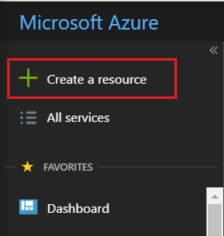

1. In the **Search** field, type **Data Science**. From the list of matching results, click **Data Science Virtual Machine - Windows 2012**.

    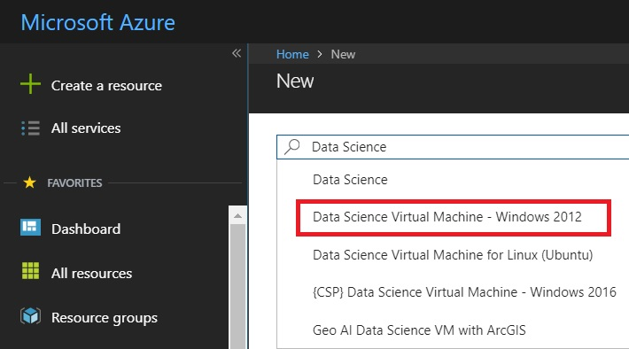

1. Take a few moments to read the description of the DSVM, and then click **Create**.

    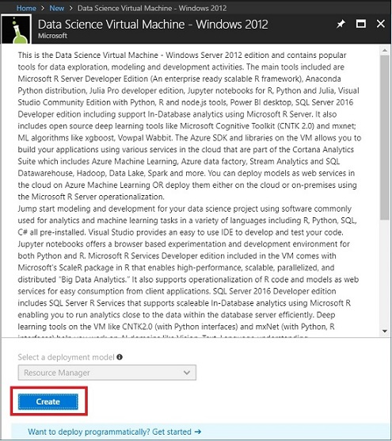

1. In the **Name** field, enter a name for your VM; for example, **WinDSVM**.

    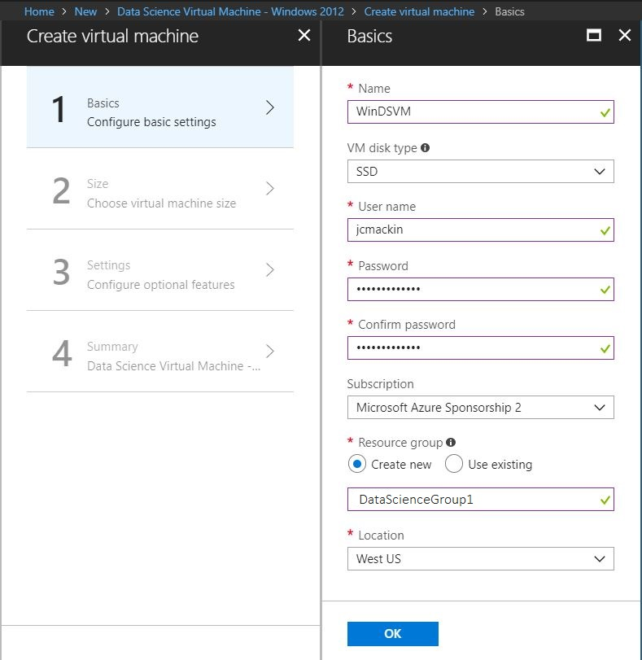

1. In the **User name** field, type a user name of your choice.

1. In the **Password** field, enter a password of your choice that meets the following requirements:
    * Must be between 12 and 72 characters long
    * Must contain three of the following:
        * One lowercase letter
        * One uppercase letter
        * One number
        * One special character that is not "\" or "-"

    Save your user name and password, because you will use this information to sign-in to the VM later.

1. In the **Subscription** drop-down menu, select your current Azure Subscription. Most users will only have one but it's possible to have many.

1. In the **Resource group** section, leave **Create new** selected, and then enter a name of your choice for the resource group in the field below; for example, **DataScienceGroup1**.

    A [resource group](https://docs.microsoft.com/azure/azure-resource-manager/resource-group-overview) in Azure is a container used to run an application. Resource Groups help developers organize and control their solutions such as monitoring, access control, provisioning, active development vs stable production channels, and billing. Generally, items in one Resource Group are intended to have the same lifecycle, so you can easily deploy, update, and delete them as a group.

1. In the **Location** drop-down menu, ensure that a geographically close location is chosen.
1. Click **OK**.

At this stage, the Choose a size page appears. Proceed to the next step.

### Step 2: Sizing the new VM and reviewing settings ###

1. On the **Choose a size** page, click **View all**.

    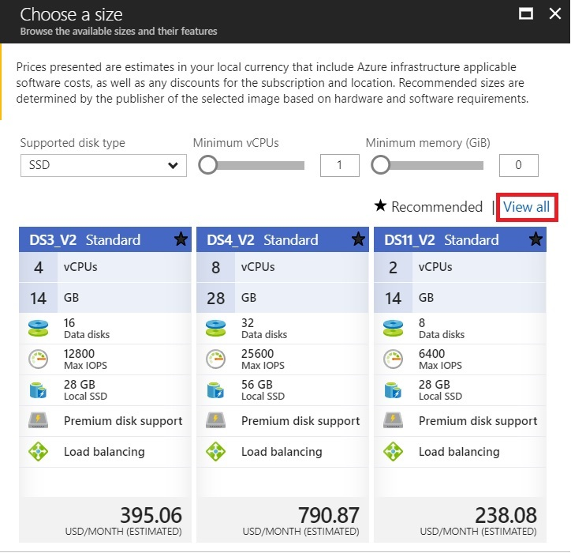

1. In the list of available VM types, select **DS4_V2 Standard**. Notice the wide range of VM choices available. Azure provides these according to the growing needs of your workload or application - for example, you might need the high memory allocation (G-series) or additional GPUs (N-series) that maximize the performance of deep-learning experiments (like image classification). Some VMs are most cost-effective for early experiementation (A-series, Dv2 series). But a D-series is a good starting point for this lab. You can learn more [here](https://docs.microsoft.com/en-us/azure/cloud-services/cloud-services-sizes-specs) or [here](https://blogs.msdn.microsoft.com/uk_faculty_connection/2016/09/12/choosing-the-most-appropiate-azure-virtual-machine-specification/).

    

1. Click **Select**.
1. On the **Settings** page that appears, review the default settings, and then click **OK**.

    The Create page appears, displaying offer details and summary information.

1. Click **Create**.

    **Important**: Make sure you return to the Azure Portal and shut down this VM after you complete this lab. If you do not do this, your VM will continue to consume your available Azure credit. Azure now has [automatic start/stop features for VMs](https://docs.microsoft.com/azure/automation/automation-solution-vm-management) but you must configure them accordingly.

1. Wait a few minutes while the DSVM deploys. After it deploys, you will see a dashboard for your new VM. At the top of the dashboard, you will see controls.

    

1. The **Start** button is not available, indicating that the new VM has already started.

### Step 3: Connecting to the new VM ##

If you are on an Apple Mac device, skip to **Step 3a** below.

1. On the control bar for your new VM, click **Connect**.

    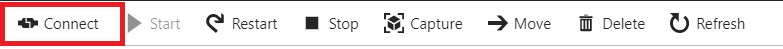

    This step downloads an RDP file through your browser.

1. Open the RDP file, and then connect to the DSVM.

    * If you are on a Windows computer, you can open the RDP file through the browser. Click **Connect** when prompted, then supply the credentials you specified in step 1 of this exercise when prompted, and finally click **Yes** to accept the certificate.
    * If you are on a Mac device, skip to **Step 3a** below.

1. When you see the DSVM desktop, proceed to the next exercise.


### Step 3a: Connecting to the new VM from and Apple Mac device

If you are on an Apple Mac device, download and install [Microsoft Remote Desktop 10](https://itunes.apple.com/us/app/microsoft-remote-desktop-10/id1295203466?mt=12) from the [App Store](https://itunes.apple.com/us/app/microsoft-remote-desktop-10/id1295203466?mt=12).

1. On the control bar for your new VM, click **Connect**.
2. Open the **Applications** folder from **Finder**.
3. Launch **Microsoft Remote Desktop**.
    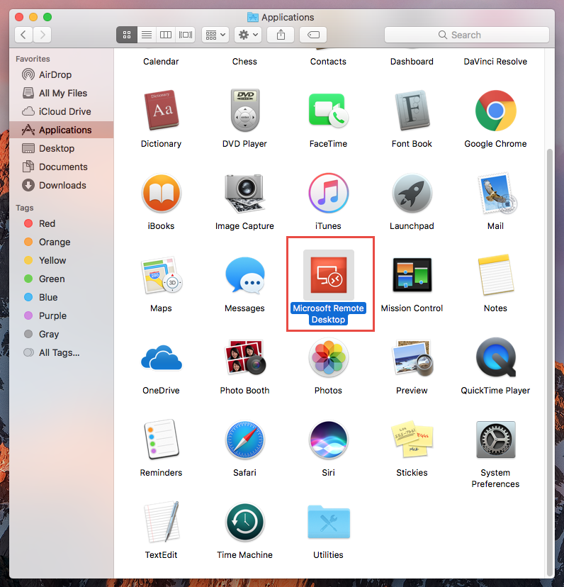
4. Click **New**.
    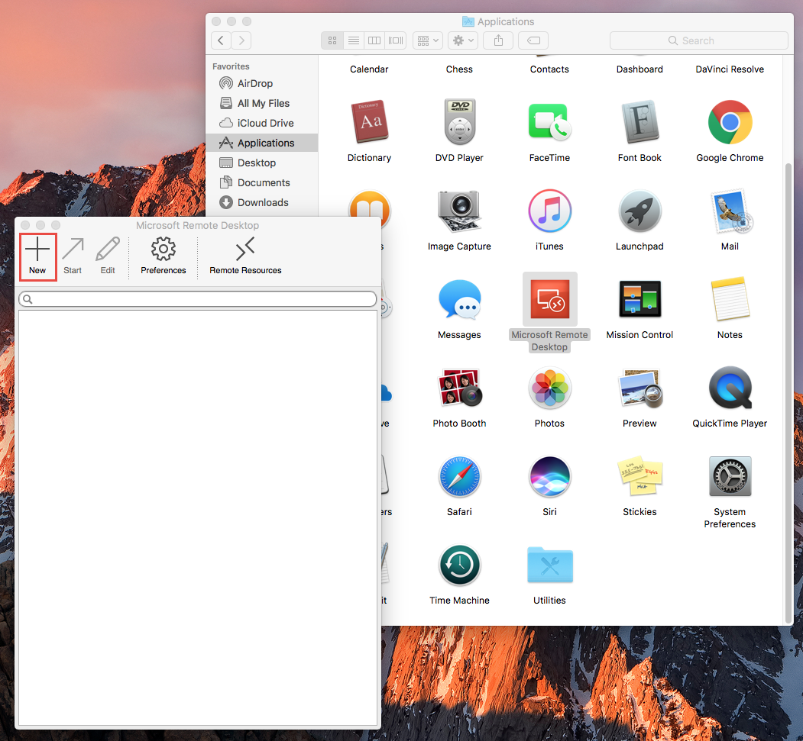
5. In the **Connection name** field, enter a name for the virtual machine.
    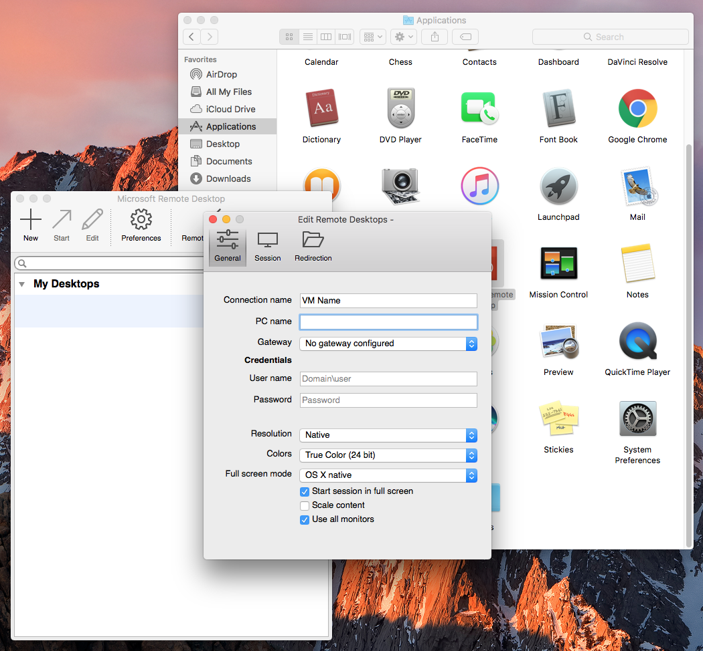
6. From your browser, copy the **Public IP** address of the virtual machine and paste it into **PC name** field in the **Edit Remote Desktops** window.
7. Close the **Edit Remote Desktops** window; the virtual machine will appear under **My Desktops**.
    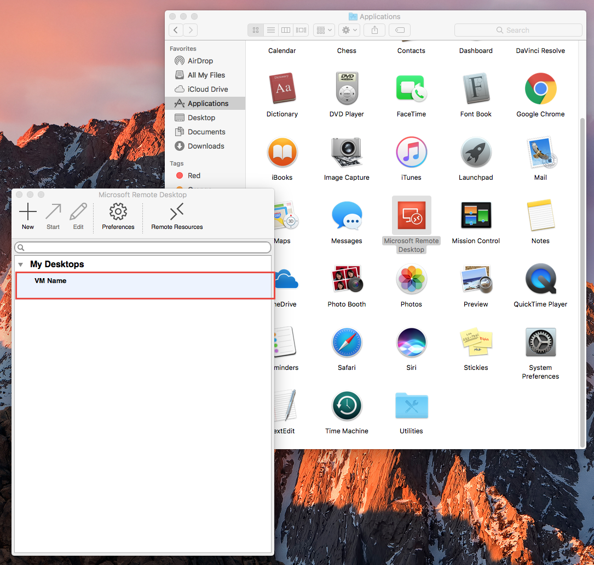
8. Double-click on the VM to launch the session.
9. Enter the username and password to connect to the virtual machine.
10. When you see the DSVM desktop, proceed to the next exercise.

<a name="Exercise2"></a>

## Exercise 2: Set up the U-SQL local run environment ##

We are going to run U-SQL queries on the DSVM but the default configuration is missing some components that we need for our lab. Before you can run U-SQL queries locally in the source code editor like [Visual Studio Code](https://code.visualstudio.com/), you will need to download and install an extension called Azure Data Lake Tools plus some additional script dependencies. Then you will need to start the Data Lake local-run service.

### Step 1: Installing the Visual Studio component ###

1. In the DSVM, right-click the **Start** button, and then select **Search**. Or, on a PC press **Windows Key+S** to search.

    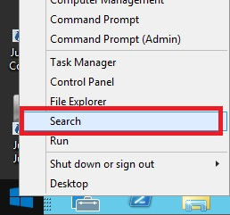

1. In the **Search** box that opens on the right side of the screen, type **Visual Studio Installer**, and then click to open that program when its tile appears below the search box.

    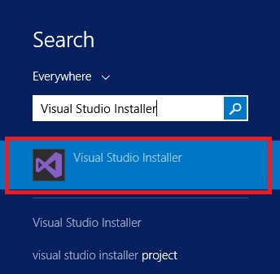

1. If you are prompted to update the Visual Studio Installer before proceeding, click **Update** to perform the update.
1. On the Visual Studio Installer page, expand the **More** menu associated with Visual Studio Community 2017, and then select **Modify**.

    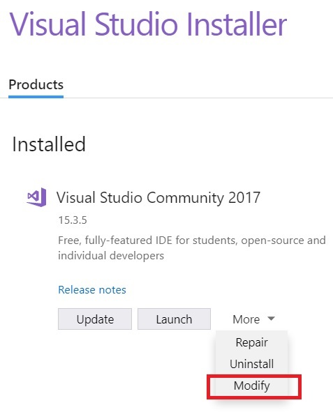

1. On the Modifying—Visual Studio Community 2017 page, click **Individual components**.

    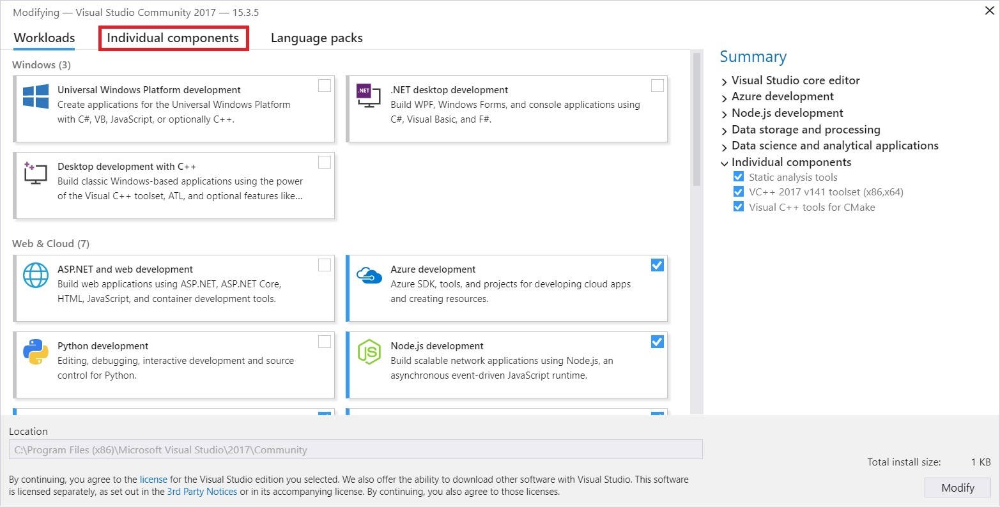

1. In the list of individual components, within the **Compilers, build tools, and runtimes category**, select the check box associated with **VC++ 2015.3 v140 toolset for desktop (x86,x64)**.

    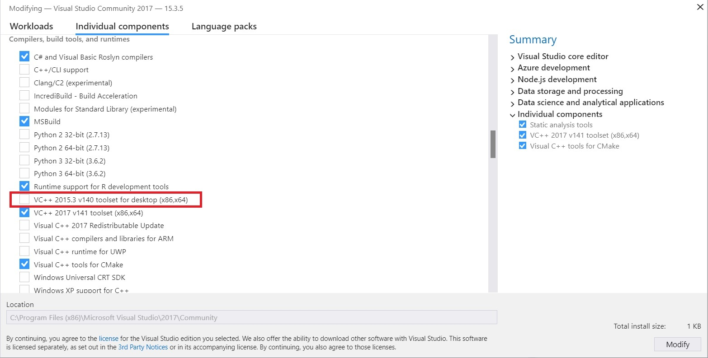

1. Click **Modify**.

    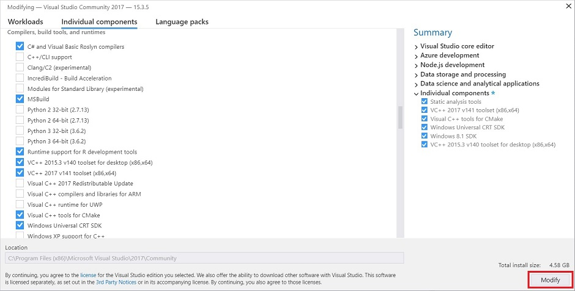

    The installation will require a few minutes to complete.

1. After the installation has completed, close the Visual Studio Installer window.

### Step 2: Installing Azure Data Lake Tools in Visual Studio Code ###

We will be using Visual Studio Code as our source-code editor of choice which has already been pre-installed on the DSVM. If you like using it, you can also [install it](https://code.visualstudio.com/) on your Mac, Windows, or Linux device in the future. To make Visual Studio Code compatible with U-SQL, we need to install the Data Lake Tools extension.

1. On the desktop of the DSVM, locate and double-click the Visual Studio Code icon to open the application.

    Visual Studio Code opens, along with a webpage about Visual Studio Code and a dialog box about Internet Explorer settings.

1. Click **OK** to accept the default security settings for Internet Explorer. Close all open windows except for Visual Studio Code.

1. In Visual Studio Code, click the **Extensions** icon in the left pane.

    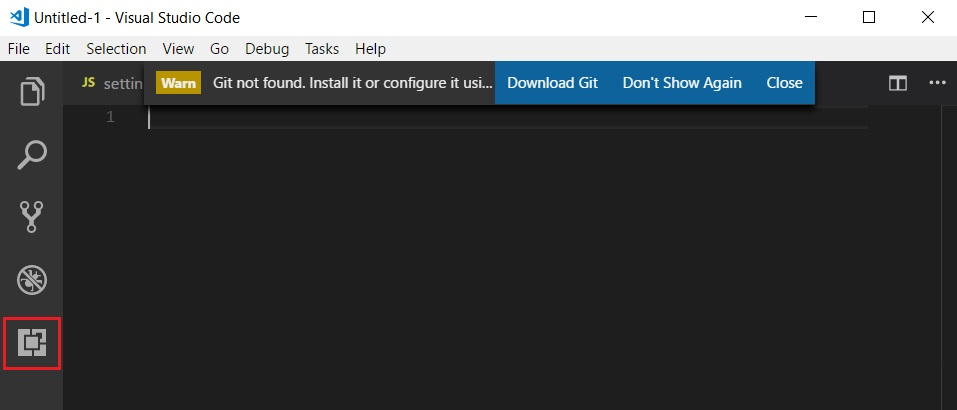

1. In the **Search** box in the top left of the window, enter **Azure Data Lake**.

1. Next to Azure Data Lake Tools, click **Install**.

    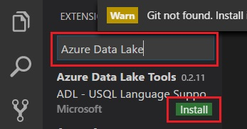

    The Azure Data Lake Tools extension will install. The process will take a few moments.

1. Click **Reload** to activate the Azure Data Lake Tools extension.

    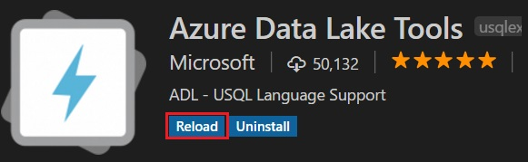

    You can now see Azure Data Lake Tools in the Extensions pane.

### Step 3: Download the lab files and script dependencies in Visual Studio Code ###

1. Using a web browser on the DSVM, download the following ZIP file and save it to any convenient location **on the DSVM**: <https://redshirttour.blob.core.windows.net/challenges/BigDataHOL.zip>
1. Unzip the **BigDataHOL.zip** file. A new BigDataHOL folder will appear.
1. Switch to Visual Studio Code. In Visual Studio Code, click **File** > **Open Folder**, navigate to the **BigDataHOL** folder, and then click **Select Folder**.

    This step sets the current working folder for Visual Studio Code. The results should look similar to the following:

    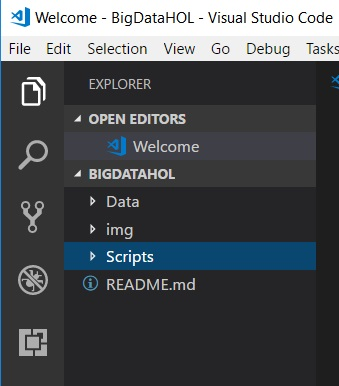

    You now need to trigger Visual Studio Code to install dependencies that are needed to continue.

1. In the **Explorer** pane in Visual Studio Code, expand the **Scripts** folder within **BIGDATAHOL**, and then double-click a script.

    If you see a Windows Security Alert that informs you that Windows Defender Firewall has blocked some features of this app, click **Allow Access**.

1. If your system has not previously downloaded these dependencies, you will see a Warn message at the top of the window indicating that the binary dependences are being downloaded. After a few moments, you will see a message at the top of the screen indicating that dependencies have completed downloading.

    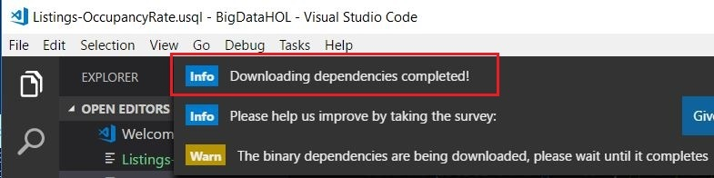

1. Click **Close** on all open notifications that appear at the top of the window in Visual Studio Code.

### Step 4: Start and configure the Azure Data Lake local run service ###

U-SQL is a powerful Big Data query language that blends the best of declarative SQL with C#; it was designed to be used for a wide variety of datasets (both structured and unstructured) that are stored in Data Lake Store, Azure Blob Storage, Azure SQL Database, Azure SQL Data Warehouse, and on-premise Microsoft SQL Server. An additional advantage of U-SQL is that you can query data directly in CSV files, without having to create a database and load the data into that database. U-SQL was designed to be used for large datasets stored in Data Lake and Blob storage. To query *local* data files, you first need to start and configure the Data Lake local run service.

1. In Visual Studio Code, from the **View** menu, select **Command Palette**. Or, on a PC press **Ctrl+Shift+P** to open the command palette.

1. At the prompt, type **ADL: Start**, and then select **ADL: Start Local Run Service** from the drop-down list. This step starts the Data Lake local run service.

    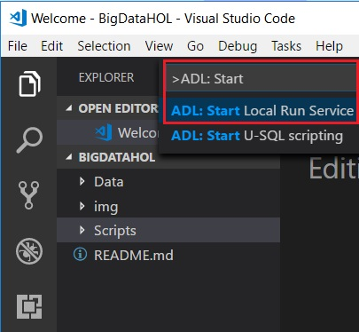

1. At the top of the screen, click **Accept** to accept the Microsoft software license terms and download the U-SQL software development kit (SDK).

    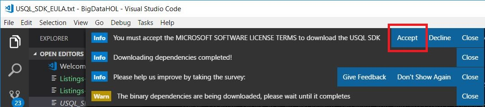

1. Wait a few moments for the LocalRunServer.exe terminal window to appear.

    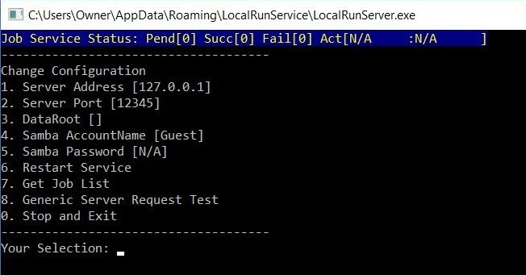

1. Now, you need to configure the Data Lake local run service so that Visual Studio Code can run U-SQL queries locally. First, you want to set the root folder for your project data files. At the **Your Selection** prompt, enter **3** to begin configuring the data-root path.

    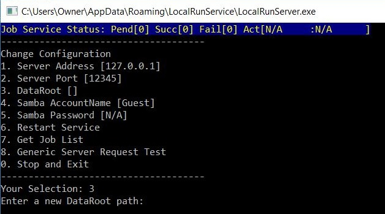

1. When prompted with the message **Enter a new DataRoot path**, enter the full path to the BigDataHOL\Data folder. For example, if you saved and unzipped the BigDataHOL folder on your desktop, you would enter the path **C:\Users\\*yourusername*\Desktop\BigDataHOL\Data**.

    **Note**: As a shortcut, you can use Windows Explorer to browse to the Data folder and then copy the pathname from the address bar. To then paste the address into the terminal window, right-click the blue title bar, point to **Edit**, and then select **Paste**.

    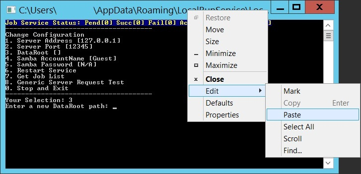

    This step sets the root folder for your project data files.

    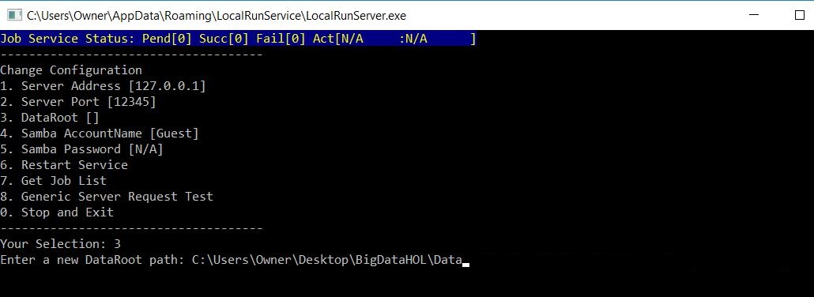

    The service restarts, and a new prompt appears.

1. Enter option **4**, and then enter the user name you chose for the DSVM.
1. Enter option **5**, and then specify your password.

    These credentials are used to access the data files. The window should now appear something like this:

    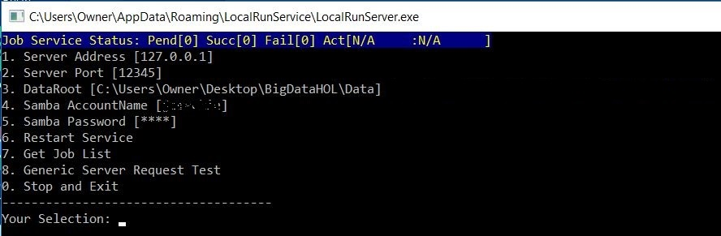

#### Important: Make sure you leave the LocalRunServer.exe terminal window open for the remainder of this lab ####

Visual Studio Code is now configured to run U-SQL queries locally.

<a name="Exercise3"></a>

## Exercise 3: Use U-SQL to gather data ##

A powerful feature of U-SQL is that it enables you to execute queries against multiple data files at the same time. In this example, we have four data files containing rental listings data for the District of Columbia, Washington, Texas, and California. In a typical scenario, you would have to import each file into a single database and then execute a query to see the combined data. Using the U-SQL and Data Lake local-run service, however, querying all four data files is much easier and faster, and you can do it on your local system without a database program.

In the following exercise, you will use two separate scripts to compile data from various CSV files, and you will then reduce the dataset to only the most recent listings. The resulting dataset is the dataset needed by your team to build the ContosoBNB app.

### Step 1: Using U-SQL to compile data into a single file ###

1. In Visual Studio Code, in the **Explorer** pane on the left, browse to and expand the **Data** folder (located beneath the **BIGDATAHOL** folder).

    Notice that the Data folder contains four files: Listings_CA.csv, Listings_DC.csv, Listings_TX.csv, and Listings_WA.csv.

    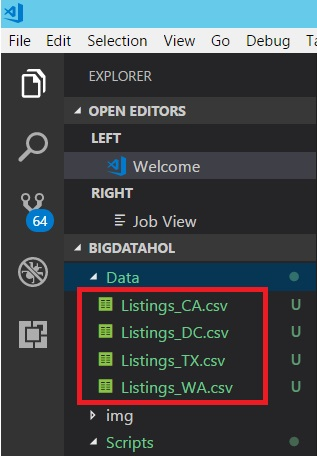

1. Click each of these four CSV files, one at a time, and browse the contents as each file displays in Visual Studio Code. Notice how each CSV file contain data that corresponds only to the location associated with that file's name.

1. Now browse to the **Scripts** folder. In the Scripts folder, click the **Listings-Combined.usql** script.

   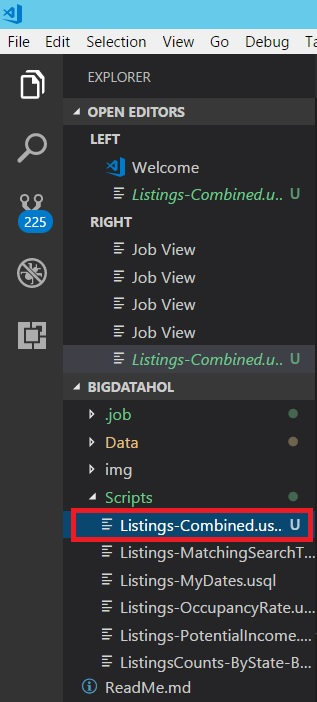

1. Browse the contents of the script and locate the following sections, which are the three basic components of a U-SQL script:
    * An **EXTRACT** statement: a file or storage blob from which data will be read
    * A **SELECT** statement: where any data transformations and calculations take place
    * An **OUTPUT** statement: a file or storage blob to which results will be written

    In this particular script,
    * The EXTRACT statement reads data from various files into a variable named @AllListings.
    * The SELECT statement then takes these records and stores them into a variable named @ListingsCombined.
    * The OUTPUT statement finally directs the output of @ListingsCombined into a new file named Listings.csv.

    This new file will be created in the working directory of the Data Lake local run service, which you configured as the Data folder in Exercise 2, Step 4.

    ```USQL
    // Read all data files named Listings_[anything].csv into @AllListings variable:
    @AllListings =
    EXTRACT
    id string
    , neighbourhood  string
    , city  string
    , state  string
    , zipcode  string
    , property_type  string
    , room_type  string
    , bedrooms  string
    , price  string
    , last_review string
    , review_scores_rating  string
    , review_scores_value  string
    , reviews_per_month string
    , availability_30 string
    , availability_365  string
    FROM "Listings_{*}.csv"
    USING Extractors.Csv(skipFirstNRows: 1, silent:true) ;

    // Put Combined Listing records into @ListingsCombined variable:
    @ListingsCombined =
    SELECT
    id
    , neighbourhood
    , city
    , state
    , zipcode
    , property_type
    , room_type
    , bedrooms
    , price
    , last_review
    , review_scores_rating
    , review_scores_value
    , reviews_per_month
    , availability_30
    , availability_365
    FROM @AllListings ;

    OUTPUT @ListingsCombined
        TO "Listings.csv"
        USING Outputters.Csv(outputHeader:true) ;
    ```

1. Now look closely at line 19 in the Listings-Combined.usql script. The asterisks between braces, **{\*}**, tells the Data Lake run service to use pattern matching to read multiple files. This line directs U-SQL to read from any data file that starts with “Listings_” and ends with “.csv.” The EXTRACT statement reads from all four of the location-specific CSV files because they all follow the naming pattern of "Listings_[Location].csv."

    ```USQL
    FROM "Listings_{*}.csv"
    ```

    Note also the following about the use of asterisks in U-SQL EXTRACT statements:

    * All data files *must* have the same column order and data types.
    * More complex pattern matching can be used. (You can find one such example [here](https://msdn.microsoft.com/en-us/azure/data-lake-analytics/u-sql/extract-expression-u-sql))

1. Now, we will run the query through the Data Lake local run service. Open the command palette by clicking **View** > **Command Palette** (or Ctrl+Shift+P). From the prompt, type and run the command **ADL: Submit Job**.

    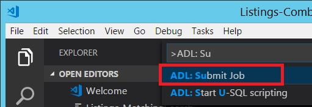

1. At the top of the window, a drop-down menu appears. Click the first option, **Local Run Context**.

    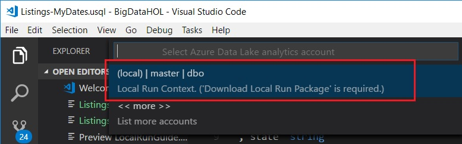

1. After about 30 seconds, the query of all matching files completes. The results of this query are compiled into an output file called **Listings.csv**, which you can find in the **Data** folder.
1. Select the **Listings.csv** file to view its contents. The data file contains the entire data sets of WA, DC, TX, and CA.

Now that the Data folder includes a single file that has compiled all of our rental listing data, let’s see how a U-SQL script can be used to analyze and output only the most recent listings in this new file. This recent data is the data that will eventually be used in the ContosoBNB app.

### Step 2: Reviewing the Listings-MyDates.usql script ###

1. In Visual Studio Code, within the **Explorer** pane on the left side of the window, and within the **Scripts** folder, click the U-SQL script called **Listings-MyDates.usql** to open it.

    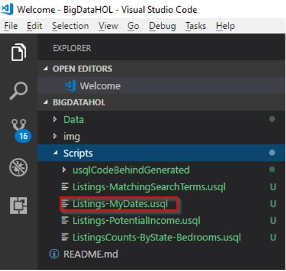

1. Take a look at the script and notice the three sections.

   The EXTRACT statement reads records from the Listings.csv file into the variable @AllListings:

    ```USQL
    @AllListings =
    EXTRACT
    id string
    , neighbourhood  string
    , city  string
    , state  string
    , zipcode  string
    , property_type  string
    , room_type  string
    , bedrooms  string
    , price  string
    , last_review string
    , review_scores_rating  string
    , review_scores_value  string
    , reviews_per_month string
    , availability_30 string
    , availability_365  string
    FROM "Listings.csv"
    USING Extractors.Csv(skipFirstNRows: 1, silent:true) ;
    ```

    The SELECT statement below limits the data selected to a six-month period of the entire year of data available, based on the latest review date (last_review).

    The WHERE clause restricts the listings in the output to those that have last been reviewed between June 1, 2017, and December 31, 2017.

    ```USQL
    @ListingsBetweenDates =
    SELECT
    id
    , neighbourhood
    , city
    , state
    , zipcode
    , property_type
    , room_type
    , bedrooms
    , price
    , last_review
    , review_scores_rating
    , review_scores_value
    , reviews_per_month
    , availability_30
    , availability_365
    FROM @AllListings
    WHERE last_review BETWEEN
        DateTime.Parse("6/1/2017") AND
        DateTime.Parse("12/31/2017") ;
    ```

    The OUTPUT section below indicates that the results should be saved to a file named Listings-MyDates.csv:

    ```USQL
    OUTPUT  @ListingsBetweenDates
    TO  "Listings-MyDates.csv"
    USING Outputters.Csv(outputHeader:true) ;
    ```

### Step 3: Running the Listings-MyDates.usql script ###

1. In Visual Studio Code, at the top of the window, close any open messages or notifications.

1. Open the command palette by clicking **View** > **Command Palette** (or Ctrl+Shift+P). From the prompt, type and run the command **ADL: Submit Job**. (Alternatively, you can also right-click anywhere in the script text and then select **ADL: Submit Job**, as shown in the image below.)

    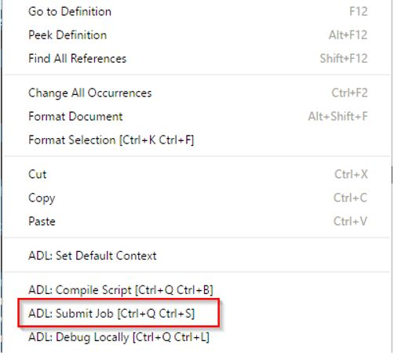

1. At the top of the window, a drop-down menu appears. Click the first option, **Local Run Context**.

    

    The script now runs; after about 30 seconds, it fails. This is because the **last_review** field is extracted as a string, but we later try to compare it to a DateTime value at line 43.

    All fields in an EXTRACT statement should be cast as the data type you’ll need to work with. To resolve this issue, we need to indicate that the field should be extracted as a DateTime type instead of string. We do this by changing **String** to **DateTime** in the EXTRACT statement.

1. Edit the script so that, at line 15, the data type specified is **DateTime** (as shown below), and then re-submit the script:

    ```USQL
    , last_review DateTime
    ```

1. After about 30 seconds, the script now executes successfully. It produces a data file called Listings-MyDates.csv in the Data folder.

1. Click the data file, and then take a look at the contents. There are many fields and listings for various states, cities, and neighborhoods. Even with our date limit applied, there is still a lot of data to work with.

<a name="Exercise4"></a>

## Exercise 4: Use U-SQL queries to search listings ##

As a new developer for the team building the ContosoBNB app, you have been asked to find a way to search recent rental listings compiled from four datasets according to various criteria. In this exercise, you’ll see how parameters can be used in a U-SQL SELECT statement to search a CSV file and find matching entries.

Because you want to be able to search listings by various criteria, you need to be able to assign values to query parameters such as state, city, neighborhood, property type, room type, and bedroom count.

1. In Visual Studio Code, locate and click the **Listings-MatchingSearchTerms.usql** script.

    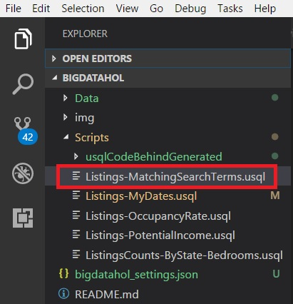

1. Within the script, review the **DECLARE**, **EXTRACT**, and **SELECT** statements, along with the **WHERE** clause. This series of DECLARE statements specifies that we will be performing a search for all one-bedroom, non-shared apartments in the Capitol Hill neighborhood of Seattle. It achieves this by assigning these specific criteria to variables such as @City, @Neighbourhood, and @Bedrooms.

    ```USQL
    // Populate our search term variables:
    DECLARE @State string = "WA"; // WA, CA, TX, or DC
    DECLARE @City string = "Seattle"; // Seattle, Austin, Los Angeles, or Washington
    DECLARE @Neighbourhood string = "Capitol Hill";
    DECLARE @Property_type string = "Apartment"; // "Private room" or "Entire home/apt"
    DECLARE @Room_type string = "Entire home/apt"; // "Entire home/apt", "Shared room",  or "Private room"
    DECLARE @Bedrooms int = 1;
    ```

    Just as with the EXTRACT statement, variables in U-SQL must be typed to match their intended use. Most of the C# types are supported.

    The EXTRACT statement uses the previously generated data file as its input data file:

    ```USQL
    FROM "Listings-MyDates.csv"
    USING Extractors.Csv(skipFirstNRows: 1, silent:true) ;
    ```

    The SELECT statement uses a short-form abbreviation, or alias, to select all (*) fields:

    ```USQL
    SELECT al.*
    FROM @AllListings AS al // Using "al" as an alias for @AllListings
    ```

    The WHERE clause of the SELECT statement compares the parameter values to the field values. If they match, then the record is included in the output:

    ```USQL
    WHERE
        state == @State
    AND city == @City
    AND neighbourhood == @Neighbourhood
    AND property_type == @Property_type
    AND room_type == @Room_type
    AND bedrooms == @Bedrooms ;
    ```

    Finally, in the OUTPUT statement, we sort the output results by using the review_scores_rating field:

    ```USQL
    // ORDER BY the review score rating, largest values first.
    OUTPUT @ListingsMatchingSearchTerms
        TO "Listings-MatchingSearchTerms.csv"
        ORDER BY review_scores_rating DESC
        USING Outputters.Csv(outputHeader:true);
    ```

1. Execute the **Listings-MatchingSearchTerms.usql** script. (As a reminder, you can do this by right-clicking the script text, selecting **ADL: Submit Job**, and then clicking the option to run the script in the local run context. Otherwise, you can open the command palette from the **View** menu, enter **ADL: Submit Job** at the prompt, and then click the option to run the script in the local run context.)

    After about 20 seconds, the script fails. Why? Because you have a NULL value in the input data. Specifically, this value is present in the bedrooms column of many records. This is a common problem when dealing with text files and string data. Let’s fix it.

1. At line 21, locate the **INT** data type of the bedrooms column. INT doesn’t support NULL values.

    ```USQL
    , bedrooms  int
    ```

    Simply adding a “**?**” character to the end of the type will allow for NULL values. Not all types support this feature, but INT does. You can learn more about ["nullable types" in U-SQL here](https://msdn.microsoft.com/en-us/azure/data-lake-analytics/u-sql/built-in-u-sql-types).

1. Change line 21 to read as below:

    ```USQL
    , bedrooms  int?
    ```

1. Execute the script, and after 20 seconds or so, you’ll see the Listings-MatchingSearchTerms.csv output file appear in the Data folder of Visual Studio Code.

1. Click the file to look at the results.

    If you were to customize your DSVM and add a spreadsheet application such as Microsoft Excel to the environment, then you could open the file in that spreadsheet application to make it much easier to read the columns.

1. Try changing the query parameter values in the DECLARE statements to see different output results. Here are some good options to try:

    | State | City        | Neighborhood  | PropertyType | RoomType        | Bedrooms |
    | ----- | ----------- | ------------- | ------------ | --------------- | -------- |
    | DC    | Washington  | Capitol Hill  | Apartment    | Entire home/apt | 1        |
    | CA    | Los Angeles | Hollywood     | Apartment    | Entire home/apt | 1        |
    | WA    | Seattle     | Capitol Hill  | Apartment    | Entire home/apt | 1        |
    | TX    | Austin      | East Downtown | House        | Private room    | 1        |

1. Close all open windows in your DSVM, and then disconnect from your remote session to the DSVM by closing the remote desktop session.

1. Return to the [Azure portal](https://portal.azure.com). Locate and open the settings for the new DSVM that you created as part of this HOL.

1. In the controls, click **Stop** to stop the DSVM.

    

**Important: Do not skip the final shut down step!** If you do not do this, your VM will continue to consume your available Azure credit.

This brings us to the end of the Big Data HOL. In this lab, you learned how to do the following while building your ContosoBNB app's "suggest a rental rate" feature and specifically its data structure:

* Work with data and U-SQL queries on your local system and in Azure Data Lake Store
* Execute U-SQL queries on your local system and in Azure Data Lake
* Modify queries to troubleshoot data-inconsistency issues

Imagine if you were a professional developer working with many types of data (structured and unstructured) with millions of rows. What if your users generated a million rows of data per minute? Or behavioral telemetry per second? Handing these types of large-scale data challenges is what cloud platforms like Azure are uniquely suited for. Feel free to explore the scripts and the environment more.

When you are done, always remember to return to the Azure Portal and **shut down your DSVM** so you can use your cloud credits in future projects!
