# Build ContosoBNB, an AI-powered rentals web app #

<a name="HOLTitle"></a>

<a name="Overview"></a>

## Overview ##

We find ourselves at a fascinating moment in the history of technology. Through our mobile devices, data is abundant, readily available, and easy to share. We have nearly unlimited processing power and it's available to anyone who needs it. Add to that mix the public availability of new, powerful artificial-intelligence (AI) algorithms, and suddenly developers have a mind-boggling degree of programming power, right at their fingertips. With AI, we can tap into huge amounts of data and make it work for us by giving us insights about whatever we care about. [Azure Cognitive Services](https://azure.microsoft.com/services/cognitive-services/) provides a rich source for AI algorithms, enabling your apps to see, hear, speak, understand, and interpret your users' needs.

In this lab, you will experience the benefits of using AI first-hand. You will begin the lab by downloading a short-term vacation-rental web app called [ContosoBNB](https://contosobnb.azurewebsites.net/). Then you will incorporate the [Local Insights API](https://labs.cognitive.microsoft.com/en-us/project-local-insights), an experimental project in the Azure Cognitive Services family. Project Local Insights provides a custom score for the attractiveness of a location according to a user's select preferences. After incorporating the API, the ContosoBNB application renders a [Bing Maps](https://www.microsoft.com/maps/choose-your-bing-maps-api) image of several cities within the United States where the project is supported. Circles appear on the rendered map to represent neighborhoods, and each circle displays a number that corresponds to the number of available properties within that neighborhood. Neighborhoods are also rated according to preference settings that the user can adjust. Finally, using the API, you will alter the neighborhood criteria (categories) displayed in the user interface. This step enables you to customize the attractiveness score of a neighborhood so that the score is determined by its proximity to amenities you prioritize (such as restaurants or parks) within the defined area.

<a name="Objectives"></a>

### Objectives ###

In this hands-on lab, you will learn how to build your own AI-powered ContosoBNB:

- How to install and use Visual Studio Code on your preferred platform
- How to obtain an API key for Cognitive Services
- How to make calls to the Project Local Insights API
- How data is returned from the API (and how to use that data)
- How to tailor your requests to customize the data returned from the API

<a name="Prerequisites"></a>

### Prerequisites ###

The following are required to complete this hands-on lab:

- An API key from Cognitive Services Local Insights. If you haven't already, [subscribe to Project Local Insights](https://labs.cognitive.microsoft.com/en-us/project-local-insights).
- Visual Studio Code, with [downloads for Windows, Linux, and Mac available here](https://code.visualstudio.com/download).

<a name="Resources"></a>

### Resources ###

This lab makes use of an existing dataset (released under public domain) to model real-world property listings and their metadata. The complete dataset can be found at <http://insideairbnb.com/get-the-data.html.> For the purposes of this lab, the data has been separated by city location and provided in [JavaScript Object Notation (JSON)](https://www.json.org/) format to emulate how it might be provided if requested directly from a database.

<a name="Exercises"></a>

## Exercises ##

This hands-on lab includes the following exercises:

- [Exercise 1: Configure your Cognitive Services API key](#Exercise1)
- [Exercise 2: Getting familiar with the core application](#Exercise2)
- [Exercise 3: Add neighborhoods to the core application](#Exercise3)
- [Exercise 4: Add slider controls to the core application](#Exercise4)
- [Exercise 5: Connect the Project Local Insights API](#Exercise5)
- [Exercise 6: Update pins with API ratings data](#Exercise6)
- [Exercise 7: Customizing the API for personalized results](#Exercise7)

Estimated time to complete this lab: **60** minutes

<a name="Exercise1"></a>

## Exercise 1: Configure your Cognitive Services API key ##

In this exercise, you will install (if necessary) and open a local development environment, download the lab's source files, and finally configure the application to use the API key provided after subscribing to Project Local Insights.

1. You will need an editor to view and make changes to the application as part of this lab. If you would like to use Visual Studio Code and your computer is running Windows, proceed to step 2. Otherwise skip to step 4.
1. Download and install Microsoft Visual Studio Code [here](https://code.visualstudio.com/download). Accept the License Agreement and make note of the installation location.

    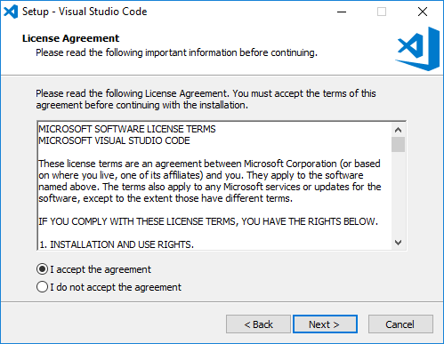
    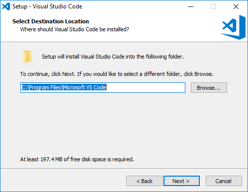

1. Configure Visual Studio Code to "Open with Code"

    

1. Download the .ZIP file containing the resources used in this lab [here](https://redshirttour.blob.core.windows.net/challenges/WebAppHOL.zip).
1. Extract the downloaded .zip file.
1. If you haven't done so already, go to <https://labs.cognitive.microsoft.com/en-us/project-local-insights> and subscribe to Project Local Insights to get your key.

    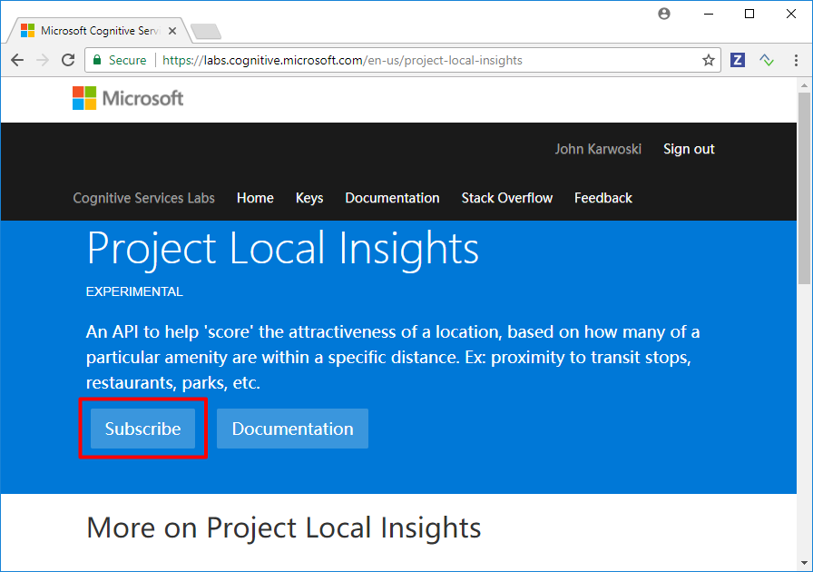

1. Once you have your key, navigate on your device to the `WebAppHOL\WebAppHOL\js` folder, and then Right Click the **settings.js** file and select "Open with Code". (On a Mac, you can select the file in Finder, open the File menu, point to Open With, and then select Visual Studio Code.) Replace **\<YOUR KEY\>** with your Project Local Insights key (deleting the brackets "\<" and "\>" along with the letters "YOUR KEY"), and then save and close the file.

    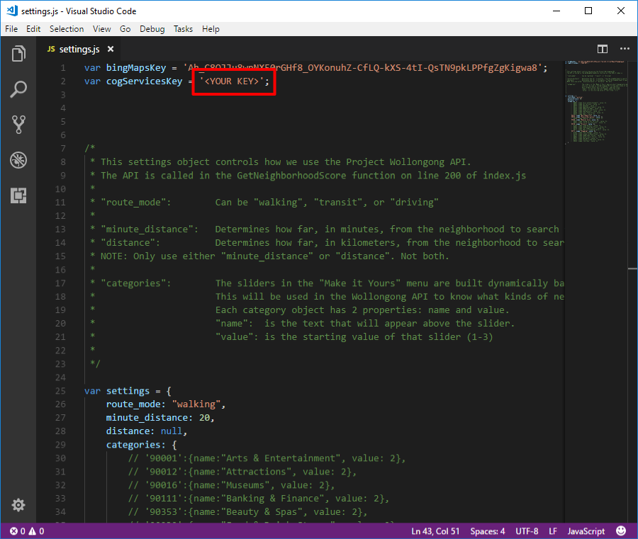

<a name="Exercise2"></a>

## Exercise 2: Getting familiar with the core application ##

In this exercise, you will run the core web application locally to get familiar with its functionality as a baseline for the upcoming exercises.

1. From the **WebAppHOL\WebAppHOL** directory on your computer, open the **index.html** file in your browser to run the application.

    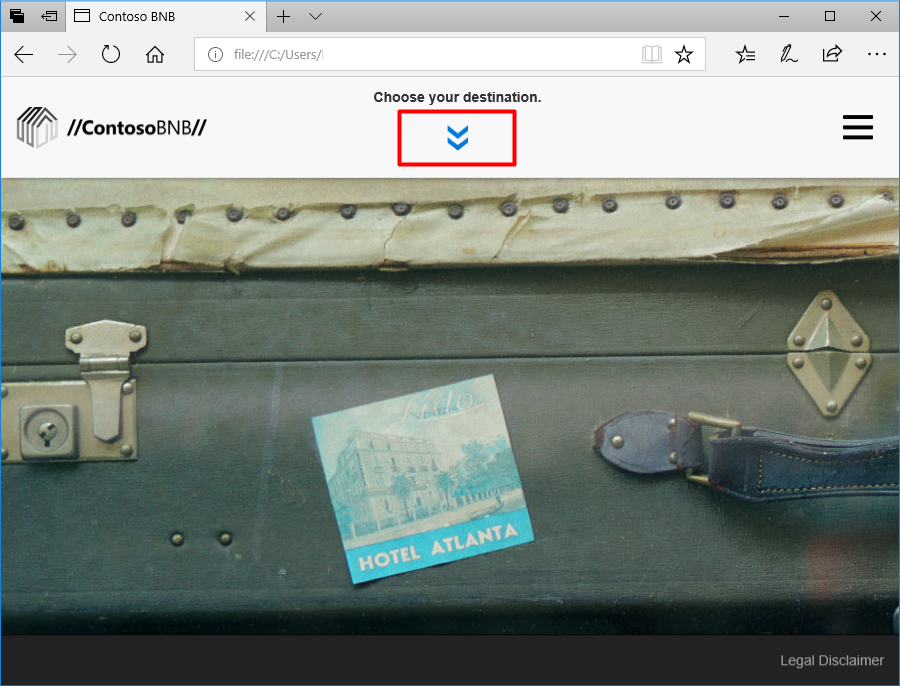

1. Click **Choose your destination** to display a list of available US cities.

    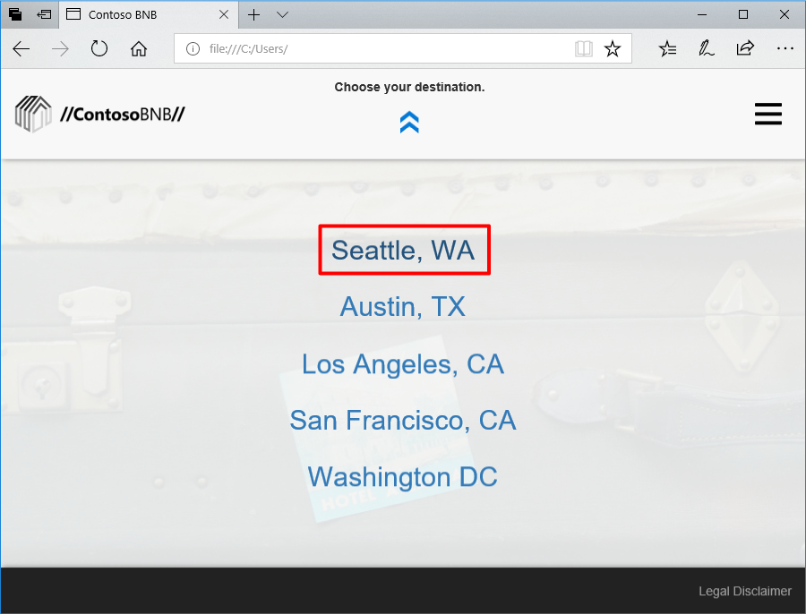

1. Select the **Seattle** location. The application renders a map of the city using the Bing Maps API. For more information visit: <https://www.microsoft.com/en-us/maps/choose-your-bing-maps-api.>

    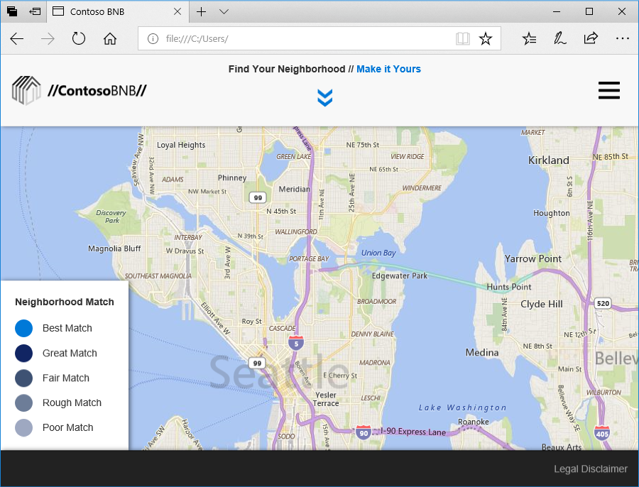

1. Note your ability to zoom in and out using the scroll control, and the **Neighborhood Match** legend in the lower right of the window.

    In the upcoming exercises you will render circles (pins) indicating Seattle neighborhoods containing the number of rentals available in each neighborhood (shown as numbers within the circles). These neighborhoods will be ranked based on how well they meet a user-defined set of criteria, known as `categories` within the Project Wollongong API. The default scoring displayed is based on average-level interest in access to local amenities, such as medical care, grocery and shopping stores, parks and recreation, and nightlife. How well a neighborhood scores is represented by the color of the pins defined in the legend.

1. Note how clicking the hamburger control in the upper-right of the window allows you to change your location to a number of pre-defined cities.

    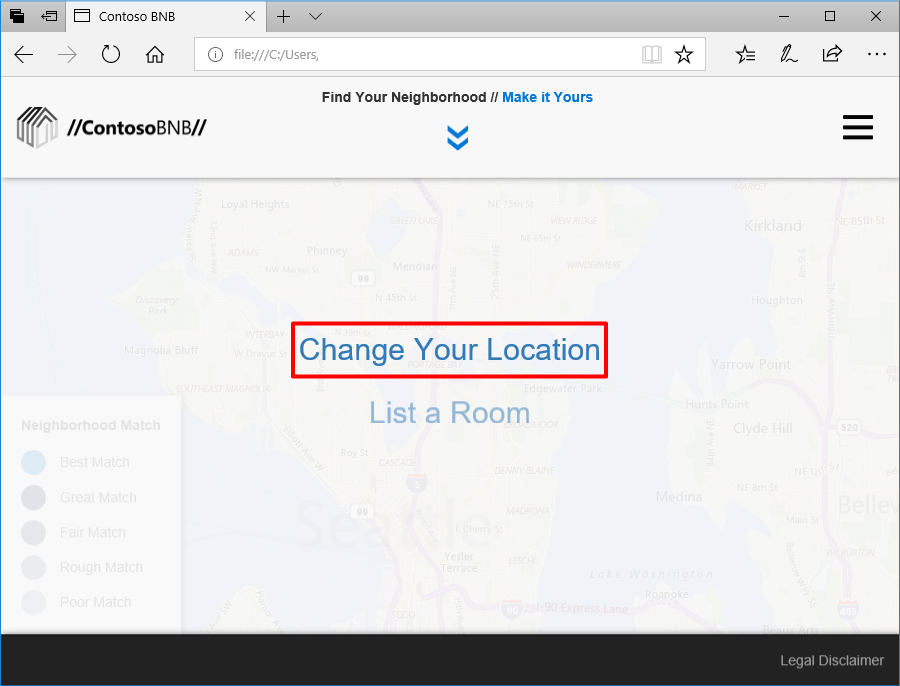

<a name="Exercise3"></a>

## Exercise 3: Adding neighborhoods to the application ##

In this exercise, we'll get neighborhood data from a json file and render the neighborhoods on the map.

1. For reference find and open one of the neighborhood datasets, the datasets are found in the **WebAppHOL\WebAppHOL\data** directory on your computer. Open the **data_se.js** in your editor as an example.

1. Note that the data includes names of the neighborhood and the number of avaialble rentals within that neighborhood. This data is representative for how it might be provided after making a request to a database.

    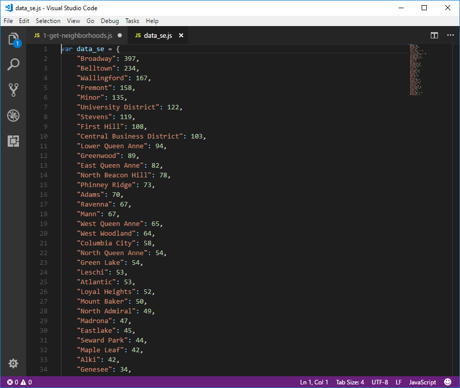

1. Close the neighborhood data file and open the **index.js** file found in the **WebAppHOL\WebAppHOL\js** directory on your computer using Visual Studio Code or another editor. You will be making changes to this file to render the neighborhoods on the map.

1. Search and find "// GetCityData(city_code);" in **index.js** and un-comment the line of code (that is, delete the "//" prior to "GetCity..."). Note that if you are using Visual Studio Code, you can perform a search by pressing '\<CTRL\>\<F\>'.

    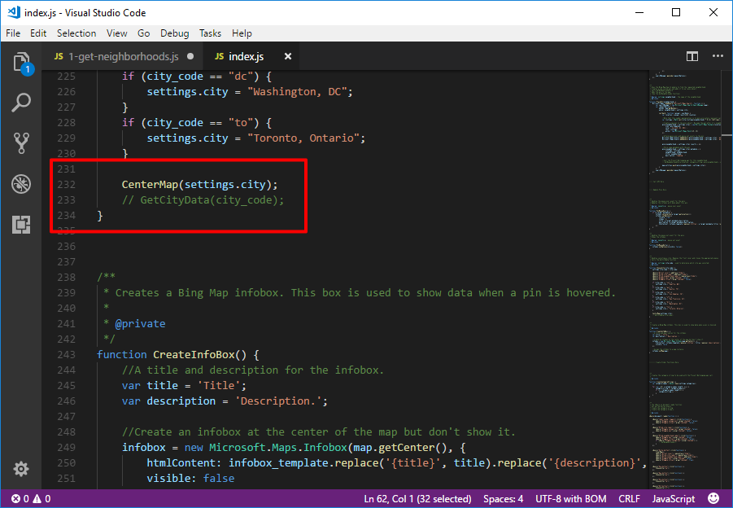

1. Find "// GetNeighborhoods();" within the **index.js** file and un-comment.

    **Note:** You'll be uncommenting and adding functions throughout the rest of this lab so be sure to take time to read and understand the code - what its intent is and why its expressed in this way. If you get stuck, ask a mentor!

    The 'GetCityData' and 'GetNeighborhoods' functions gather neighborhood data for the selected city and set pins on each neighborhood. Find "///// Get Neighborhood Data Here" within the **index.js** file and add these functions starting below that line.

1. Add the 'GetCityData' function using the code snippet below:

    ```javascript
    /**
    * Pulls the json file that contains the neighborhood data for the selected city.
    * Note that, in a real application, this data would be requested from a server.
    * (see the ChooseCity function)
    *
    * @param  {string} dataset - the name of the neighborhood json file
    * @public
    */
    function GetCityData(dataset) {

        city_listings = window["data_" + dataset];
        GetNeighborhoods();

        // If you are running this on a server, you can use this to pull the json data.

        // jQuery.getJSON("./data/data_" + dataset + ".json", function(json) {
        //     city_listings = json;
        //     GetNeighborhoods();
        // });
    }
    ```
1. Add the 'GetNeighborhoods' function to the index.js file using the code snippet below:

    ```javascript
    /**
    * Clears the Map of any existing pins.
    * Centers map at the selected city.
    * Calls the PlacePin function for each neighborhood in the city.
    * (see the GetCityData function)
    *
    * @private
    */
    function GetNeighborhoods() {
        ClearMap();

        if (city_listings) {
            CenterMap(settings.city);

            var neighborhoods_list = Object.keys(city_listings);
            for (var n=0; n<neighborhoods_list.length; n++) {
                PlacePin(neighborhoods_list[n]);
            }
        }
    }
    ```
1. Save the index.js file with your changes, then open the **index.html** file in your browser to run the application (or refresh if it's already open). As a reminder, you'll find the index.html file in the **WebAppHOL\WebAppHOL** directory on your computer.

1. Note how circles or pins have been added to your map representing all the neighborhoods in the dataset. The numbers within the pins represent the number of rental properties within that neighborhood. Every circle is gray because we are not yet comparing any personal preferences to neighborhood features.

1. Click **Make it Yours**. Notice that the page is blank and no customization controls have yet been added to the app.

    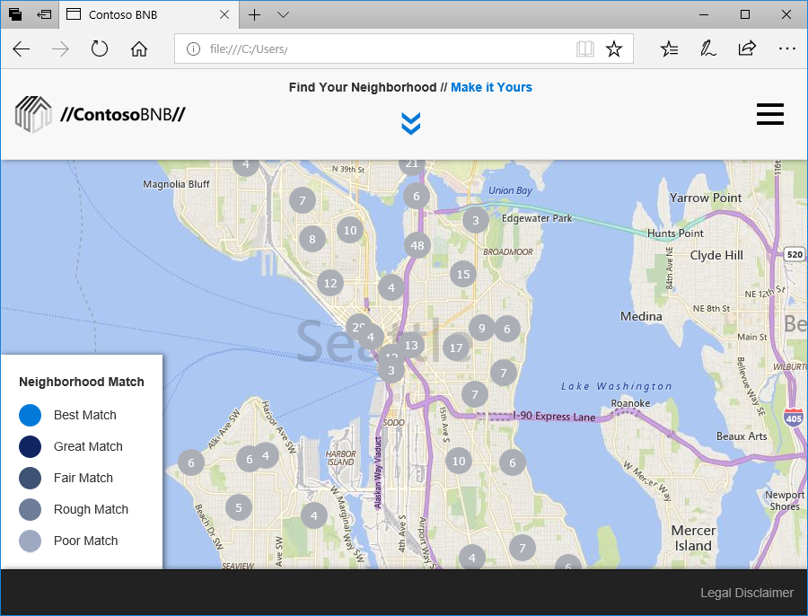

<a name="Exercise4"></a>

## Exercise 4: Adding sliders to the core application ##

In this exercise, we'll add slider controls for categories used by the Project Local Insights API. The application populates a pop-up window with a list of sliders which are found within the **settings.js** file, found within the **WebAppHOL\WebAppHOL\js** directory on your computer.

1. Open the **settings.js** file with Visual Studio Code (or another editor) and take note of how the categories are defined and which categories are currently active vs. commented out.

    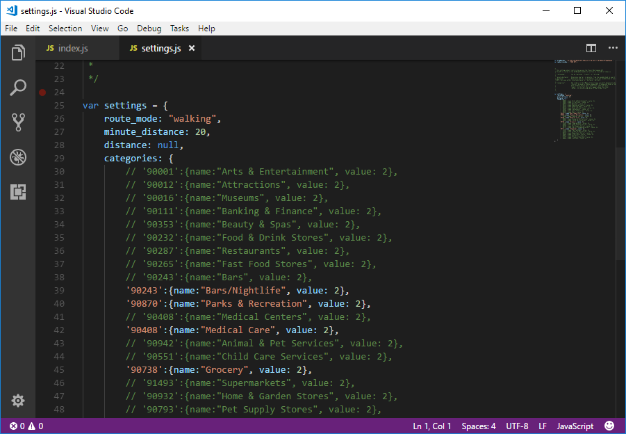

1. Search for "// CreateCategorySlidersList();" in the **index.js** file found at the end of the jQuery document ready function and un-comment it.

1. Below the line `/////// Create Slider Functions Here`, add the 'CreateCategorySlidersList' function using the code snippet below:

    ```javascript
    /**
    * For every category, a range slider is created and added to the "#categories" page.
    *
    * @param  {obj} b Data point
    * @return {funct}   Tween function
    * @private
    */
    function CreateCategorySlidersList() {
        var chart = jQuery("#categories");

        var category_keys = Object.keys(settings.categories);

        for (var i=0; i<category_keys.length; i++) {
            chart.append(CreateCategorySlider(category_keys[i], settings.categories[category_keys[i]].name,  settings.categories[category_keys[i]].value));
        }

    }
    ```

1. And immediately following the last function, add the 'CreateCategorySlider' function using the code snippet below:

    ```javascript
    /**
    * Creates one of the category sliders using the category_template.
    *
    * @param  {string} id - the category code used for the slider id.
    * @param  {string} name - the name of the category
    * @param  {int} value - the default value of the category
    * @return {obj} html object created.
    * @private
    */
    function CreateCategorySlider(id, name, value) {
        var slider = jQuery(category_template.replace('{id}', id).replace('{name}', name).replace('{value}', value));

        jQuery("#"+id, slider).change(function () {
            settings.categories[id].value = parseInt(this.value);
        });

        return slider;
    }
    ```

1. Save the index.js file with your changes, then open the **index.html** file in your browser to run the application (or refresh if it's already open). As a reminder, you'll find the index.html file in the **WebAppHOL\WebAppHOL** directory on your computer.

1. Note how sliders are now displayed after clicking the **Make it Yours** control. The displayed sliders are categories identified in the settings.js file.

    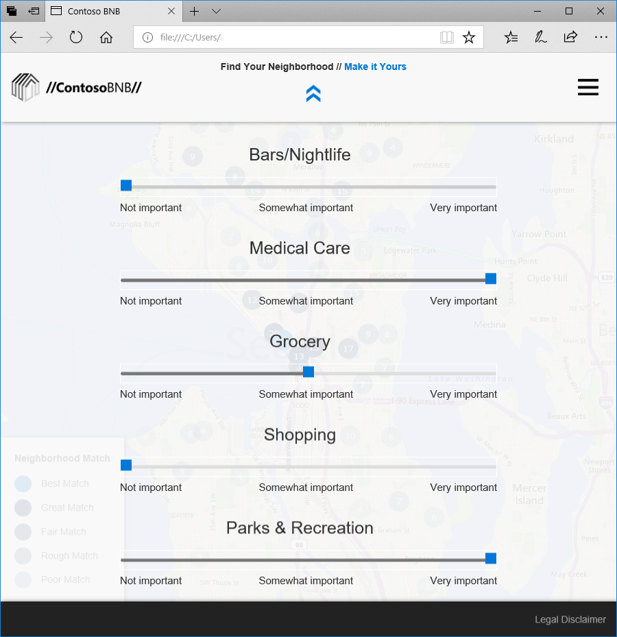

<a name="Exercise5"></a>

## Exercise 5: Connect the Project Local Insights API ##

In this exercise, we'll continue to build our application so that we can make requests to the Project Local Insights API.

1. In the **index.js** file, search for the PlacePin function. In the PlacePin function, add/uncomment:

    `GetNeighborhoodScore(location, category_string, pins[neighborhood + settings.city]);`
    on the line before: `map.entities.push(pins[neighborhood + settings.city]);`

    This line calls the function we'll add in the next step.

1. Now you are going to add the 'GetNeighborhoodScore' function that creates a sum of the weighted categories. Navigate to the end of the the **index.js** file, adding the function before the line containing `window.onresize = Resize;`

    ```javascript
    /**
    * Calls the Project Local Insights api for the requested location.
    * The sum of nearby locations for each category is used for the score of that category.
    * (see the PlacePin function)
    *
    * @param  {obj} location - location object returned from the Maps Search module
    * @param  {string} category - category string used in the Project Local Insights api call
    * @param  {obj} pin - the map pin connected to this location
    * @private
    */
    function GetNeighborhoodScore(location, category, pin) {

        var url = 'https://cognitivegarage.azure-api.net/BingMaps/NavJoin?startPoint='
                + location.latitude + ',' + location.longitude
                + '&routeMode=' + settings.route_mode
                + '&categoryIds=' + category
                // maxTime and maxDistance can be interchanged. (Distance is in km)
                + (settings.minute_distance ? '&maxTime=' + settings.minute_distance : "")
                + (settings.distance ? '&maxDistance=' + settings.distance : "");

        jQuery.ajax({
            type: "GET",
            url: url,
            headers: {
                'Ocp-Apim-Subscription-Key': cogServicesKey
            }
        }).done(function(data) {
            var result = data;
            if (result.NavJoinCategoryResults) {
                for (var i = 0; i<result.NavJoinCategoryResults.length; i++) {
                    var categoryId = result.NavJoinCategoryResults[i].CategoryId;
                    try {
                        //The sum of nearby locations for this category becomes this category's score.
                        pin.results[categoryId] = result.NavJoinCategoryResults[i].NavJoinEntities.length;
                    }
                    catch (err) {
                        pin.results[categoryId] = 0;
                    }
                }
                // CalculatePinScore(pin);
            }
        }).fail(function (error) {

            console.error(error);

            // A work around for a 429 error.
            // (429 means there were too many api calls within a given period. This work around waits a second and then tries again.)
            if (error.status == 429) {
                setTimeout(function(){
                    GetNeighborhoodScore(location, category, pin);
                },1000);
            } else {
                pin.setOptions({ color: "hsla(0, 96%, 19%, "+ .2 +")" });
                pin.metadata.description = "<span class='error'>Match Score Error</span>";
            }

        });
    }
    ```

1. Save the index.js file with your changes, then open the **index.html** file in your browser to run the application (or refresh if it's already open). As a reminder, you'll find the index.html file in the **WebAppHOL\WebAppHOL** directory on your computer.

    **Note:** Running the application, you will notice that nothing seems to have changed. Even though we are now gathering data from the Cognitive Service API, we are not yet rendering that on the pins. You will do that in Exercise 6.

<a name="Exercise6"></a>

## Exercise 6: Update pins with API ratings data ##

In this exercise, we'll use the responses provided by Cognitive Services to create a score for each neighborhood. We'll calculate this score by adding up all the neighborhood weighted category scores. Then we'll apply a color to the pin based on their relative scores.

1. Search for "// CalculatePinScore(pin);" in the **index.js** file and un-comment it. This line now calls the function added in the next step.

1. Now you will add the 'CalculatePinScore' and 'UpdatePinColors' functions. The 'CalculatePinScore' function creates an overall score for each pin (neighborhood), and the 'UpdatePinColors' function sets the color of the pins based on its score. Navigate to the end of the the **index.js** file and then add these functions before the line containing `window.onresize = Resize;`:

    ```javascript
    /**
    * Calculates the score of this pin by adding up all of the pin's weighted category scores.
    * Updates all of the pins' colors based on their relative scores.
    * (see the GetNeighborhoodScore function)
    *
    * @param  {obj} pin - the pin to recieve a score.
    * @private
    */
    function CalculatePinScore(pin) {

        var score = 0;

        var pin_keys = Object.keys(pins);
        var category_results = Object.keys(pin.results);

        var category_names = Object.keys(settings.categories);

        for (var i=0; i<category_results.length; i++) {
            //          The number of nearby locations * The priority of those locations (1-3)  * 10
            score += (pin.results[category_results[i]] * settings.categories[category_results[i]].value) * 10;
        }

        pin.metadata.score = score;

        max_score = Math.max(max_score, score);

        UpdatePinColors();
    }

    /**
    * Updates all of the pins' colors based on their score compared to the highest score.
    *
    * @private
    */
    function UpdatePinColors() {
        var pin;
        var description;
        var pin_keys = Object.keys(pins);
        for (var p=0; p<pin_keys.length; p++) {
            pin = pins[pin_keys[p]];

            if (pin.metadata.score >= 0) {
                // if this pin's score is the best.
                if (pin.metadata.score === max_score) {
                    pin.setOptions({
                        color: "hsl(207, 98%, 43%)"
                    });
                    description = "<strong>Best Match</strong>";
                } else {
                    pin.setOptions({
                        color: "hsla(215, 96%, 19%, "+ (pin.metadata.score/max_score + .1) +")"
                    });
                    description = '<span class="debug">' + Math.round(100*pin.metadata.score/max_score) + "% Match</span>";
                }
                pin.metadata.description = description;
            }
        }
    }
    ```
1. Save the index.js file with your changes, then open the **index.html** file in your browser to run the application (or refresh if it's already open). Reminder, you'll find the index.html file in the **WebAppHOL\WebAppHOL** directory on your computer.

1. Note how the neighborhood pins are now colored to indicate which best the weighting category setting defined by the slider control. The displayed sliders are categories identified in the settings.js file. (Note: To toggle between the map view and the slider control, click the double arrows at the top of the window.)

    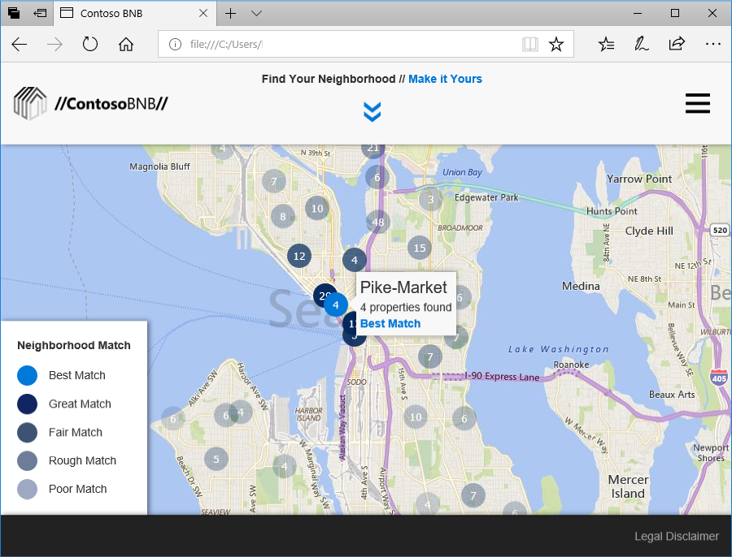

<a name="Exercise7"></a>

## Exercise 7: Customizing the API for personalized results ##

In this exercise, you will customize the implementation of the Project Local Insights API. The `categories` object, found in the **settings.js** file (located in the **WebAppHOL\WebAppHOL\js** directory), provides the full list of categories that are available for use with the Project Local Insights API. By modifying this `categories` object, you can change which sliders appear in the "Make It Yours" menu.

1. Open the **settings.js** file in a text editor, and then browse to the **categories** object. Note that in the list of categories, all but five are currently commented out; these are the five criteria that are currently displayed in the ContosoBNB UI. Add and remove the commenting to match the following five categories: **Arts & Entertainment**, **Food & Drink Stores**, **Restaurants**, **Bars**, and **Bars/Nightlife**. These changes give preference to a rental property that is within walking distance to the best Seattle neighborhood for nightlife.

    ```javascript
    var settings = {
        route_mode: "walking",
        minute_distance: 20,
        distance: null,
        categories: {
            '90001':{name:"Arts & Entertainment", value: 2},
            // '90012':{name:"Attractions", value: 2},
            // '90016':{name:"Museums", value: 2},
            // '90111':{name:"Banking & Finance", value: 2},
            // '90353':{name:"Beauty & Spas", value: 2},
            '90232':{name:"Food & Drink Stores", value: 2},
            '90287':{name:"Restaurants", value: 2},
            // '90265':{name:"Fast Food Stores", value: 2},
            '90243':{name:"Bars", value: 2},
            '90243':{name:"Bars/Nightlife", value: 2},
            // '90870':{name:"Parks & Recreation", value: 2},
            // '90408':{name:"Medical Centers", value: 2},
            // '90408':{name:"Medical Care", value: 2},
            // '90942':{name:"Animal & Pet Services", value: 2},
            // '90551':{name:"Child Care Services", value: 2},
            // '90738':{name:"Grocery", value: 2},
            // '91493':{name:"Supermarkets", value: 2},
            // '90932':{name:"Home & Garden Stores", value: 2},
            // '90793':{name:"Pet Supply Stores", value: 2},
            // '90771':{name:"Malls & Shopping Centers", value: 2},
            // '90771':{name:"Shopping", value: 2},
            // '91567':{name:"Park & Rides", value: 2},
            // '91510':{name:"Liquor & Wine Stores", value: 2},
            // '90727':{name:"Department Stores", value: 2},
            // '90661':{name:"Electronics Stores", value: 2},
            // '90617':{name:"Religion", value: 2},
            // '91457':{name:"Places of Worship", value: 2},
            // '90619':{name:"Churches", value: 2}
        }
    ```

1. Review how these changes provide new best neighborhood matches. In this example, Belltown is now a best match.

    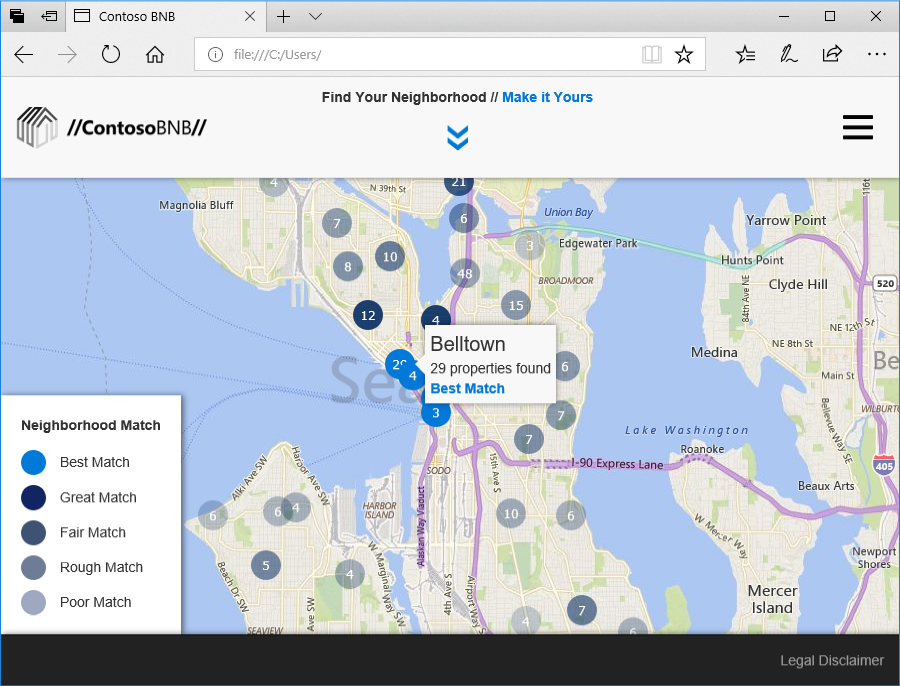

1. Make some adjustments of your own, and see how they impact the results. For example, changing the `route_mode` from "walking" to "driving" in the `settings.js` file typically results in a significantly different output.

    ```javascript
    route_mode: "walking",
        minute_distance: 20,
    ```

<a name="Summary"></a>

## Summary ##

Local Insights is an experimental project within the Azure Cognitive Services family that provides an attractiveness score for a location based on the number of nearby amenities.

In this lab, you learned the following steps in creating an AI solution:

- How to subscribe to a service and receive an API key
- How to make calls to the Project Local Insights API
- How data is returned from the API and how to use that data
- How to customize requests to make data returned by the API suit your needs

As this lab has shown, Azure Cognitive Services enables you to quickly and easily infuse your application with AI using a pre-existing data set. If you were building a fully-productionalized BNB rentals application, you might imagine how your development needs would grow to include real-time user-generated content and more sophisticated models of scoring. Fortunately Azure has enterprise-grade tools like [Azure Data Lake](https://azure.microsoft.com/solutions/data-lake/) and [Azure Machine Learning](https://azure.microsoft.com/overview/machine-learning/) to help. You can learn more about the complete Azure AI platform [here](https://azure.microsoft.com/overview/ai-platform/).

---

Copyright 2018 Microsoft Corporation. All rights reserved. Except where otherwise noted, these materials are licensed under the terms of the MIT License. You may use them according to the license as is most appropriate for your project. The terms of this license can be found at <https://opensource.org/licenses/MIT.>
