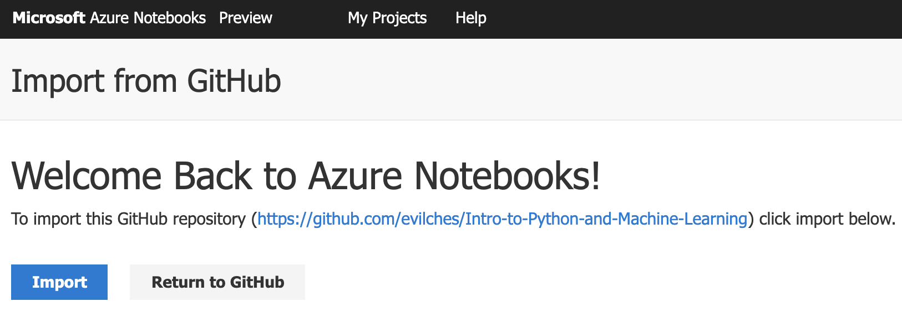
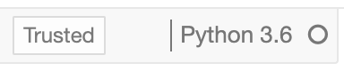

# Introduction to Python and Machine Learning

 

1. 
[Import notebooks ](https://notebooks.azure.com/import/gh/evilches/Intro-to-Python-and-Machine-Learning/) into Azure Notebooks (it's free!).   
     
    <table border="3" width="700px"><tr><td>
  	
 	</td></tr></table>  
       
    <table border="3" width="700px"><tr><td>
  	
 	</td></tr></table>  
	 

2. Open and learn the contents of the notebooks in the following order: 
    - 1_Intro to Python.ipynb
    - 2_Intro to numpy.ipynb
    - 3_Intro to pandas.ipynb
    - 4_Intro to data cleaning.ipynb
    - 5_Intro to Machine Learning.ipynb
    - 6_From Scikit-Learn to NimbusML.ipynb
    - 7_Regression Model with NimbusML.ipynb  
    
      
    
    **Note: Make sure the Azure Notebook kernel is set to `Python 3.6`** when you open a notebook.  
    <table border="3" width="150px"><tr><td>
  	
 	</td></tr></table>
     

### Azure Notebooks - Free Jupyter based notebooks in the Azure cloud
This course makes extensive use of Jupyter Notebooks hosted on Microsoft Azure. Azure-hosted Jupyter Notebooks provide an easy way for you to experiment with programming concepts in an interactive fashion that requires no installation of software by students on local computers.

Jupyter Notebooks are divided into cells. Each cell contains either text written in the Markdown markup language or a space in which to write and execute computer code. Because all the code resides inside code cells, you can run each code cell inline rather than using a separate Python interactive window.

To run a code cell use `Shift-Enter` or press the **** button in the toolbar at the top part of the page.

> **Note**: These notebooks are designed to have you run code cells one by one, and several code cells contain deliberate errors for demonstration purposes. As a result, if you use the **Cell** > **Run All** command, some code cells past the error won't be run. To resume running the code in each case, use **Cell** > **Run All Below** from the cell after the error.

 

### Resources
- [Microsoft Azure Notebooks](https://notebooks.azure.com/)
- [Python Programming Language](https://www.python.org/)
- [Introduction to Python](https://docs.microsoft.com/en-us/learn/modules/intro-to-python/)
- [Introduction to machine learning with Python and Azure Notebooks](https://docs.microsoft.com/en-us/learn/paths/intro-to-ml-with-python/)
- [GitHub Introduction](https://guides.github.com/activities/hello-world/)

