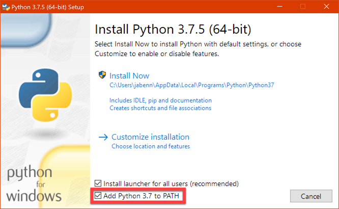
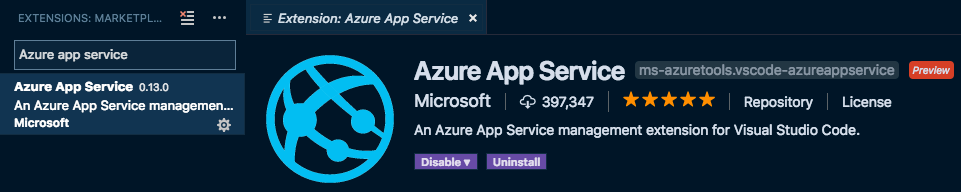

# Happy, Sad, Angry Workshop

This workshop shows how to build a web based game called **Happy, Sad, Angry** using [Python](https://www.python.org) and [Flask](http://flask.pocoo.org) along with some HTML and JavaScript running on [Microsoft Azure](https://azure.microsoft.com/free/students/?WT.mc_id=happysadangry-github-jabenn). This game selects an emotion, and you have to try your best to show that emotion on your face. Once you have your best emotion face on, you take a picture with your camera and the web game will check to see what emotion you are showing using the [Azure Face API](https://azure.microsoft.com/services/cognitive-services/face/?WT.mc_id=happysadangry-github-jabenn). If it is the same as the one you were asked to show, you win.


This workshop is designed for students, and can be run using the free services available as part of the [Azure for students](https://azure.microsoft.com/free/students/?WT.mc_id=happysadangry-github-jabenn) offer.

## Prerequisites

To complete this workshop, you will need:

* An Azure account. Sign up for free using [Azure for students](https://azure.microsoft.com/free/students/?WT.mc_id=happysadangry-github-jabenn), or the [Azure free account](https://azure.microsoft.com/free/?WT.mc_id=happysadangry-github-jabenn) if you are not at an academic institution.

* Python

  * **Windows:**

    You can install Python from the [Windows Store](https://www.microsoft.com/p/python-38/9mssztt1n39l?activetab=pivot:overviewtab&WT.mc_id=happysadangry-github-jabenn). This configures Python correctly on your PATH, and there are no further steps.

    If you don't want to use the store, you can install from the [Python Downloads page](https://www.python.org/downloads/). If you do this, ensure you check the *Add Python to PATH* option.

    

  * **macOS**
  
    You can install Python from the [Python Downloads page](https://www.python.org/downloads/).

    When Python is installed it will open a Finder window. Run the following scripts from inside that Finder window to set up certificates and add Python to your PATH:

    1. `Update Shell Profile.command`
    1. `Install Certificates.command`

* [Visual Studio Code](https://code.visualstudio.com/?WT.mc_id=happysadangry-github-jabenn)

* The [Python Extension for Visual Studio Code](https://marketplace.visualstudio.com/itemdetails?itemName=ms-python.python&WT.mc_id=happysadangry-github-jabenn). This can be installed from inside VS Code using the *Extensions* tab.
  
  

* The [Azure App Service Extension for Visual Studio Code](https://marketplace.visualstudio.com/itemdetails?itemName=ms-azuretools.vscode-azureappservice&WT.mc_id=happysadangry-github-jabenn). This can be installed from inside VS Code using the *Extensions* tab.
  
  

* A laptop with a Web Cam, or an external camera.

## Code format

All code in this sample is shown in code blocks like this one:

```python
print('Here is some code')
```

Ellipses will be used to indicate other code, removed to make new code or the code that is being discussed easier to see. For example a code block like this:

```python
def func():
  ...
  print('end of the suite')
```

means that the `print('end of the suite')` will need to go inside the `func` function, but *after* all existing code in this function

## Steps

The steps for this workshop are:

1. [Create the Flask web app](./steps/CreateAFlaskWebApp.md)
1. [Create a web page for the game](./steps/CreateTheWebPage.md)
1. [Deploy the Web app to the cloud using Azure App Service](./steps/DeployTheWebAppToTheCloud.md)
1. [Create a Face API resource](./steps/CreateAFaceResource.md)
1. [Build out the game to capture from the camera and check for emotion](./steps/CheckTheEmotion.md)
1. [Clean up](./Steps/CleanUp.md)

## Code

For reference, you can find the final code for this workshop in the [Code](https://github.com/jimbobbennett/HappySadAngryWorkshop/tree/master/code) folder.

## Clean up Azure resources

This workshop uses resources that are available in the [Azure for Students account as free services](https://azure.microsoft.com/free/free-account-students-faq/?WT.mc_id=happysadangry-github-jabenn). As there are limits on the number of free services you can create, you may want to delete the resources created once you are done. The instructions to do this are in the last step - [Clean up](./steps/CleanUp.md).
