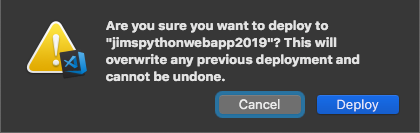
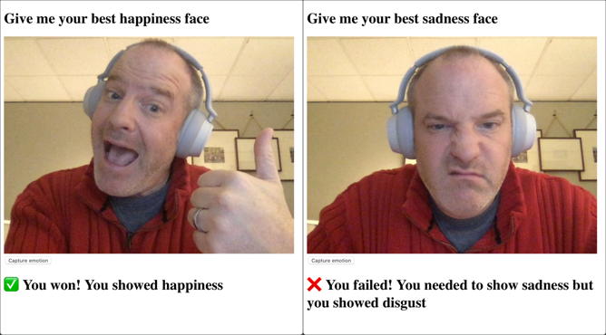

# Build out the game to capture from the camera and check for emotion

In the [previous step](./CreateAFaceResource.md) you created a Face API resource that can be used to analyse the camera images. In this step you will build out the game to capture frames from the camera and look for emotions.

## Install the Face Api package

The Face Api is available as a Python package.

* Open the `requirements.txt` file in Visual Studio Code.

* Add the following to the bottom of the file:

  ```python
  azure-cognitiveservices-vision-face
  ```

* Save the file

* Install the new package from the terminal using the following command:
  
  ```sh
  pip3 install -r requirements.txt
  ```

## Write the code

* Open the `app.py` file in Visual Studio Code.

* Add imports for the Face Api package and an authentication package, as well as some system libraries and additional imports from the Flask module to the top of the file.
  
  ```python
  import random, os, io, base64
  from flask import Flask, render_template, request, jsonify
  from azure.cognitiveservices.vision.face import FaceClient
  from msrest.authentication import CognitiveServicesCredentials
  ```

* Add the following code below the imports:

  ```python
  credentials = CognitiveServicesCredentials(os.environ['face_api_key'])
  face_client = FaceClient(os.environ['face_api_endpoint'], credentials=credentials)

  def best_emotion(emotion):
    emotions = {}
    emotions['anger'] = emotion.anger
    emotions['contempt'] = emotion.contempt
    emotions['disgust'] = emotion.disgust
    emotions['fear'] = emotion.fear
    emotions['happiness'] = emotion.happiness
    emotions['neutral'] = emotion.neutral
    emotions['sadness'] = emotion.sadness
    emotions['surprise'] = emotion.surprise
    return max(zip(emotions.values(), emotions.keys()))[1]
  ```

* Create a new route for `/result` that accepts POST requests to the bottom of the file.

  ```python
  @app.route('/result', methods=['POST'])
  def check_results():
    body = request.get_json()
    desired_emotion = body['emotion']

    image_bytes = base64.b64decode(body['image_base64'].split(',')[1])
    image = io.BytesIO(image_bytes)

    faces = face_client.face.detect_with_stream(image,
                                                return_face_attributes=['emotion'])

    if len(faces) == 1:
      detected_emotion = best_emotion(faces[0].face_attributes.emotion)

      if detected_emotion == desired_emotion:
        return jsonify({
          'message': '✅ You won! You showed ' + desired_emotion
        })
      else:
        return jsonify({
            'message': '❌ You failed! You needed to show ' +
                       desired_emotion +
                       ' but you showed ' +
                       detected_emotion
        })
    else:
      return jsonify({
        'message': '☠️ ERROR: No faces detected'
      })
  ```

* Open the `home.html` file from the `templates` folder.

* Add the following code inside the event listener in the `<script>` tag. Put it after the other code already in this listener.

  ```js
  var message = document.getElementById('message');

  document.getElementById('capture').addEventListener('click', function() {
    var canvas = document.createElement('canvas');
    canvas.width = 640;
    canvas.height = 480;
    var context = canvas.getContext('2d');
    context.drawImage(video, 0, 0, canvas.width, canvas.height);

    var data = {
      'image_base64': canvas.toDataURL("image/png"),
      'emotion': '{{ page_data.emotion }}'
    }

    const getResult = async () => {
      var result = await fetch('result', {
        method: 'POST',
        body: JSON.stringify(data),
        headers: { 'Content-Type': 'application/json' }
      })

      var jsonResult = await result.json()
      message.textContent = jsonResult.message
    }
    getResult()
  });
  ```

## Deploy the code

Once the code is working locally, it can be deployed to Azure so others can play the game.

* Open the command palette:
  * On Windows, press Ctrl+Shift+P
  * On MacOS, press Cmd+Shift+P

* Select *Azure App Service: Deploy to Web App...*
  
  

* A dialog will pop up asking if you want to overwrite the existing deployment. Select the **Deploy** button.
  
  

* A popup will appear showing the deployment progress. You can monitor the progress from the *Output* window by selecting *View -> Output* and selecting *Azure App Service* from the window selector.
  
  

* Open the web site in your browser and play the game.

## Play the game

Every time you load the page it will select a different emotion.

* Look at your camera and do your best to show the requested emotion.

* Click the **Capture emotion** button. An image will be captured and checked for your emotion.

* You will either see a green check showing you successfully showed the given emotion, or a red cross if you didn't, along with the emotion the Face API thought you showed. If no faces are in the image you will see an error.

  

## What does this code do

### The `app.py` file

```python
import random, os, io, base64
from flask import Flask, render_template, request, jsonify
from azure.cognitiveservices.vision.face import FaceClient
from msrest.authentication import CognitiveServicesCredentials
```

This imports all the modules needed from the Python system packages and the packages installed as part of this app.

```python
credentials = CognitiveServicesCredentials(os.environ['face_api_key'])
face_client = FaceClient(os.environ['face_api_endpoint'], credentials=credentials)
```

This code creates a `FaceClient` - an object that can be used to access the Azure Face API. This needs to connect to a specific Face API resource, and this is configures using the endpoint from the resource that was created, and the API key via a `CognitiveServicesCredentials` object that wraps that key.

The values for the endpoint and key are read from environment variables. When run locally these come from the `.env` file, when run in an Azure App Service they come from the application settings.

```python
def best_emotion(emotion):
  emotions = {}
  emotions['anger'] = emotion.anger
  emotions['contempt'] = emotion.contempt
  emotions['disgust'] = emotion.disgust
  emotions['fear'] = emotion.fear
  emotions['happiness'] = emotion.happiness
  emotions['neutral'] = emotion.neutral
  emotions['sadness'] = emotion.sadness
  emotions['surprise'] = emotion.surprise
  return max(zip(emotions.values(), emotions.keys()))[1]
```

The emotion information is sent as a set of properties on the emotion with a value for how likely it is that that particular emotion is being shown on a scale of 0-1, 0 being not likely and 1 being very likely. We want to find the emotion with the highest likelihood, so this code declares a function to do this by putting these values into a dictionary of the name of the emotion to the likelihood. The code looks through the dictionary of emotions and detects the one with the highest likelihood, returning its name as the return value of the `best_emotion` function.

```python
@app.route('/result', methods=['POST'])
def check_results():
```

This declares a new function that is exposed as a REST endpoint. Making an HTTP POST request to `<website>/result` will execute this function. This REST endpoint will be called passing in a JSON document containing the emotion the player has to show, as well as their picture stored as a base64 encoded string.

```python
body = request.get_json()
```

This gets the JSON that was passed to this REST endpoint when called.

```python
desired_emotion = body['emotion']
image_bytes = base64.b64decode(body['image_base64'].split(',')[1])
```

This code gets the value of the `emotion` and `image_base64` properties on the JSON. The JSON document this expects is in this format:

```json
{
  "emotion" : "<the expected emotion>",
  "image_base64" : "<the image encoded as a data URL>"
}
```

The `image_base64` property is the image encoded as a data URL, which is a way to encode data inline in web pages. In the template file, the code that extracts the picture will generate data in this format. The format for an image is `data:image/png;base64,<base64 encoded data>`, with the `<base64 encoded data>` containing the image encoded as a base64 string. To get the image, this string needs to be split at the comma, and only the section after used. Once split, the base64 encoded data is decoded into binary data.

```python
image = io.BytesIO(image_bytes)
```

This converts the binary image data into a stream.

```python
faces = face_client.face.detect_with_stream(image,
                                            return_face_attributes=['emotion'])
```

This calls the Face API, passing in the image stream. This API can return a number of features for each face that is detected, and in this call we just want the emotion, indicated by the `return_face_attributes` parameter.

```python
if len(faces) == 1:
  ...
else:
return jsonify({
  'message': '☠️ ERROR: No faces detected'
})
```

This checks how many faces were detected, returning an error if one wasn't found. This function returns data as JSON in the following format:

```json
{
  "message" : "<message>"
}
```

The value of `<message>` is set to whatever needs to be displayed to the player. In this case the message is an error that no faces were detected.

```python
detected_emotion = best_emotion(faces[0].face_attributes.emotion)
```

This finds the emotion with the highest probability from the face that was detected.

```python
if detected_emotion == desired_emotion:
  return jsonify({
    'message': '✅ You won! You showed ' + desired_emotion
  })
else:
  return jsonify({
    'message': '❌ You failed! You needed to show ' +
               desired_emotion +
               ' but you showed ' +
               detected_emotion
  })
```

If the detected emotion is the one the player was asked to show, the returned JSON has a message that they won, otherwise the message says they failed.

### The template file

```js
var message = document.getElementById('message');
```

This locates the `h1` HTML element that will be used to show the message by its id.

```js
document.getElementById('capture').addEventListener('click', function() {
  ...
});
```

This creates a listener for the `click` event of the `capture` button.

```js
var canvas = document.createElement('canvas');
canvas.width = 640;
canvas.height = 480;
var context = canvas.getContext('2d');
context.drawImage(video, 0, 0, canvas.width, canvas.height);
```

This creates an HTML canvas sized at 640x480, and draws an image onto it from the video element, essentially capturing the output of the camera.

```js
var data = {
  'image_base64': canvas.toDataURL("image/png"),
  'emotion': '{{ page_data.emotion }}'
}
```

This created the JSON document that will be passed to the `/result` route, containing the image extracted from the canvas as a data URL, and the emotion the player is trying to show.

```js
const getResult = async () => {
  var result = await fetch('result', {
    method: 'POST',
    body: JSON.stringify(data),
    headers: { 'Content-Type': 'application/json' }
  })

  var jsonResult = await result.json()
  message.textContent = jsonResult.message
}
```

This declares an async function called `getResult` that makes a POST REST request to the `/result` route, passing the JSON document. Once the call is made, the JSON in the result is extracted, and the `message` value in that JSON document is set as the text for the message HTML element, showing the result.

```js
getResult()
```

This calls the `getResult` function.

## Next step

In this step you built out the game to capture frames from the camera and look for emotions. In the [next step](./CleanUp.md) you will clean up your Azure resources.
