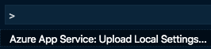
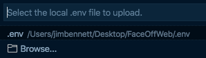

# Create a Face API resource

In the [previous step](./DeployTheWebAppToTheCloud.md) deployed your Web App to the cloud, hosted in Azure. In this step you will create a Face API resource that can be used to analyse the camera images.

## Using AI to analyze images

AI, or Artificial Intelligence is where computers can perform tasks normally associated with people, not computers. Computers can learn how to do something, rather than be told how to do it using explicit instructions by writing programs. For example, a computer can be trained how to recognize cats by being shown thousands of images of cats. You can then give it an image it hasn't seen before, and it can tell if there is a cat in the image. This is called Machine Learning or ML. Once taught, the computer builds a model, and this can be re-used by other computers to perform the same task.

You can train Machine Learning models yourself, or you can use models created by others. Microsoft has a range of these pre-trained models available, called [Cognitive Services](https://azure.microsoft.com/services/cognitive-services/?WT.mc_id=happysadangry-github-jabenn). These models include recognizing images, recognizing speech, or translating between different languages.

One of the models, the [Face Api](https://azure.microsoft.com/services/cognitive-services/face/?WT.mc_id=happysadangry-github-jabenn), can be used to look for faces in an image. If it finds any, it can guess the emotion shown on the face (happiness, sadness etc.), tell if the person is smiling, look for hair color, facial hair, even estimate the persons age. We can use this Api in our app to look for faces in the uploaded image, and predict the emotion being displayed on each face.

## Sign up for a Face Api subscription key

Before you can use the Face Api, you will need a subscription key. You can get this from your Azure account that was used to deploy the web app.

* Open the Azure Portal from [portal.azure.com](https://portal.azure.com/?WT.mc_id=happysadangry-github-jabenn). Log in if required.

* Select *Create a resource* or select the green plus button.

* Search for *Face*
  
  

* Select *Face*, then select the **Create** button.

* Enter the required details:
  * Give this a name. This needs to be globally unique as this will become part of a URL you need to call to find faces in the image.

  * Select the Azure Subscription you want to use.

  * Choose a location to run this code. Azure has 'regions' all around the world, a region being a group of data centers full of computers and other cloud hardware. Choose a region closest to you.

  * Select the pricing tier. With this app, you will make less than 20 calls a minute, and less than 30,000 calls a month, so select *F0*, the free tier. There is a paid tier for apps that need to use the service more often.

    > You can only have one free tier of each Azure Service, so if you have already created a free tier Face API resource before you will either need to use a paid tier, or connect to the existing resource.

  * Select the resource group you want to run the code in. One would have been created for you when you deployed the web app in an earlier step called something like `appsvc_linux_centralus`, so select this one.

    > Everything you create in Azure, such as access to the Face Api, App Services, and databases are called Resources. Resource groups are a way to group resources together so you can manage them in bulk. By having everything for this workshop in the same resource group makes it easy to delete everything at the end when you have finished.

  * Select the **Create** button.

  

* The face resource will be created. You will be notified when done. Select **Go to resource** from the popup, or the notification pane.
  
  

* From the resource, head to the *Quick Start* tab. Take a note of the *Key1* and *Endpoint* as you will need these later.

## Create configuration variables for the Face API key and endpoint

To use the Face API, you will need the key and endpoint you copied earlier. Ideally you don't want to put the key and endpoint for your Face API into your code, instead it should be stored in some kind of configuration.

Flask uses files called `.env` to store configuration data as key/value pairs. These are read at launch and are made available as environment variables that can be read from your Python code. The advantage of this method is you can create Application Settings in your Azure App Service that are read the same way - as environment variables.

You should put all your secret keys into the `.env` file, and you should not check any `.env` files into source code control. Flask can access values in this file using the `python-dotenv` package.

* Open the `requirements.txt` file in Visual Studio Code.

* Add the following to the bottom of the file:

  ```python
  python-dotenv
  ```

* Save the file

* Install the new package from the terminal using the following command:
  
  ```sh
  pip3 install -r requirements.txt
  ```

* Create a new file file called `.env`.

* Add the following lines:

  ```sh
  face_api_endpoint=<endpoint>
  face_api_key=<key>
  ```

  Replace `<endpoint>` with the first part of the endpoint you noted down earlier from the Face Api Resource Quick start. You don't need the `/face/v1.0` part.

  For example, if your resource was called `HappySadAngryFaceApi`, then the endpoint showing in the portal will be `https://happysadangryfaceapi.cognitiveservices.azure.com/face/v1.0`. Set the `face_api_endpoint` to be `https://happysadangryfaceapi.cognitiveservices.azure.com`.

  Replace `<key>` with one the key you noted down earlier from the Face Api Resource Quick start.

## Deploy the configuration variables to Azure App Service

To use these values in your deployed app, you will need to add them to the Application Settings for your Azure App Service. This can be done from inside Visual Studio Code.

* Open the command palette:
  * On Windows, press Ctrl+Shift+P
  * On MacOS, press Cmd+Shift+P

* Select *Azure App Service: Upload Local Settings...*

  

* Select the `.env` file you created.

  

* Select the Azure subscription for your web app.
  
  

* Select the web app you deployed to.

The settings will be deployed to your web app. You will see a pop up once this is complete.

## Verify the Application Settings

You can view the application settings from the Azure tab of the Visual Studio Code toolbar.

* In the *App Service* section, expand your subscription.

* Expand the *Application Settings* section.

You should see the two new application settings, `face_api_endpoint` and `face_api_key` with the values hidden. You can show and hide the values by clicking them

## Next step

In this step you created a Face API resource that can be used to analyse the camera images. In the [next step](./CheckTheEmotion.md), you will build out the game to capture frames from the camera and look for emotions.
