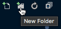

# Create a web page for the game

In the [previous step](./CreateAFlaskWebApp.md), you created a simple Flask Web App that showed 'Hello World' when run. In this step, you will create the web page for the game that shows the emotion you are trying to show, and captures images from the camera.

## Rendering HTML

To show a web page for the game, the Flask app needs to show some HTML. This HTML needs to be configurable to include a randomly selected emotion.

There are two ways to return an HTML page from a Flask app. You can return text or raw HTML, or you can use templates. Templates allow you to define some HTML that can show data in some way, and use that template with data to build an HTML page. For example if you wanted to show page with a list of names you could specify a template that iterated the list and returned list items, then use that template with some actual data to create the list in HTML.

Converting a template and data to HTML is called *Rendering*.

## Create the template

Templates live in a folder called `templates`.

* Create a new folder in Visual Studio Code inside your app folder. To do this, select the *New folder* button from the *Explorer* tab.
  
  

* Name this folder `templates`.

* Create a new file in this folder called `home.html`

* Add the following code to this file:

  ```html
  <!DOCTYPE html>
  <html>
    <head>
      <title>Happy, Sad, Angry</title>
    </head>
    <body>
      <h1>Give me your best {{ page_data.emotion }} face</h1>
      <video id="video" autoplay></video>
      <br/>
      <button id="capture">Capture emotion</button>
      <h1 id="message"></h1>

      <script type="text/javascript">
        window.addEventListener("DOMContentLoaded", function() {
          var video = document.getElementById('video');

          if (navigator.mediaDevices && navigator.mediaDevices.getUserMedia) {
            const getImage = async () => {
              video.srcObject = await navigator.mediaDevices.getUserMedia({ video: true })
              video.play();
            }
            getImage()
          }
        })
      </script>
    </body>
  </html>
  ```

* Save the file

* Open `app.py`

* At the start of the file import the `render_template` member from the flask module by adding it to the existing import statement. In addition, add an import for the `random` module.
  
  ```python
  import random
  from flask import Flask, render_template
  ```

* Add a list of possible emotions for the player to show below the import statements.

  ```python
  emotions = ['anger','contempt','disgust','fear','happiness','sadness','surprise']
  ```

  This list of emotions is based off the emotions that can be detected by the Azure Cognitive Services Face API.

* Replace the `home` function with the following code:
  
  ```python
  @app.route('/')
  def home():
    page_data = {
      'emotion' : random.choice(emotions)
    }
    return render_template('home.html', page_data = page_data)
  ```

* Save the file.

## Run the code

There are two ways to run this code:

* From the Debug pane of the toolbar, select the green *Start Debugging* button.

  If you use this method you will be able to set breakpoints and debug your code.

* From the terminal, run the file as a Flask app using:
  
  ```sh
  flask run
  ```

  If you use this method you will not be able to set breakpoints and debug your code.

The Web App will be run, and can be accessed from your device at [http://127.0.0.1:5000](http://127.0.0.1:5000). You will see this URL in the output window, and you can use **ctrl+click** to go directly to this site.

* Open this URL in a web browser to see the game web page. You may be asked for permission for the page to access the camera. If this happens you many want to always allow this to save being asked every time. One the page you will see a random emotion being asked for, and a live feed from your camera.

  

* Stop the debugger once you have tested this out.

## What does this code do

### The template file

```html
<!DOCTYPE html>
<html>
  <head>
    <title>Happy, Sad, Angry</title>
  </head>
  <body>
  ...
  </body>
</html>
```

This is a standard HTML file with a body and a title of 'Happy, Sad, Angry', the name of this game.

```html
<h1>Give me your best {{ page_data.emotion }} face</h1>
```

This code puts a header on the screen to show the emotion that the player has to show. The `{{ page_data.emotion }}` part indicates that this is a value that will be rendered using data passed in to the Flask renderer. It will look for a property passed in called `page_data`, and on that find a field called `emotion`, and insert that value into the header. For example if the value of `page_data.emotion` was `"angry"`, the header would show `Give me your best angry face`.

```html
<video id="video" autoplay></video>
<br/>
<button id="capture">Capture emotion</button>
<h1 id="message"></h1>
```

This defines some standard HTML elements, namely a video player, a button and another header that will show the result. These elements are named by setting their `id` property so that they can be accessed in code in a later step.

```html
<script type="text/javascript">
...
</script>
```

This defines a block of JavaScript code inside the HTML.

```js
window.addEventListener("DOMContentLoaded", function() {
  ...
})
```

This defines an event that is executed when the page is fully loaded in the browser.

```js
var video = document.getElementById('video');
```

This code will get the video player from the HTML based off its `id` of `video`, and assign it to a variable.

```js
if (navigator.mediaDevices && navigator.mediaDevices.getUserMedia) {
  const getImage = async () => {
    video.srcObject = await navigator.mediaDevices.getUserMedia({ video: true })
    video.play();
  }
  getImage()
}
```

This code will use the JavaScript media devices APIs to access the local camera from the browser if one exists. It will set the source of the video element to be the camera and start it playing. This will show a continuous stream of video from the camera on the page.

### The `app.py` file

```python
import random
from flask import Flask, render_template
```

This tells the Python compiler that we want to use code in the `render_template` module that was installed as part of the `flask` package, as well as the `random` module that comes as part of Python.

```python
emotions = ['anger','contempt','disgust','fear','happiness','sadness','surprise']
```

This defines a list of the possible emotions that the game will ask you to show.

```python
page_data = {
  'emotion' : random.choice(emotions)
}
```

This defines a dictionary of values to be passed to the HTML template.

```python
return render_template('home.html', page_data = page_data)
```

This will render the HTML from the `home.html` template file, passing the `page_data` dictionary in as a parameter called `page_data`. The tokens in the HTML template that refer to `page_data` will refer to values passed in in this field.

## Next step

In this step you created the web page for the game that shows the emotion you are trying to show, and captures images from the camera. In the [next step](./DeployTheWebAppToTheCloud.md), you will deploy this Web App to the cloud using Azure App Service.
