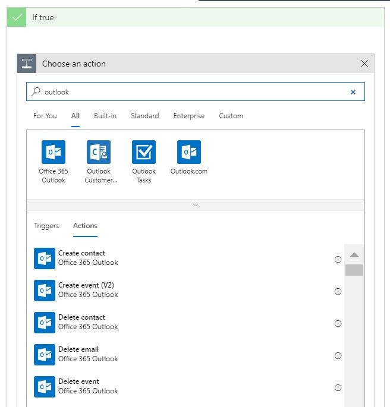
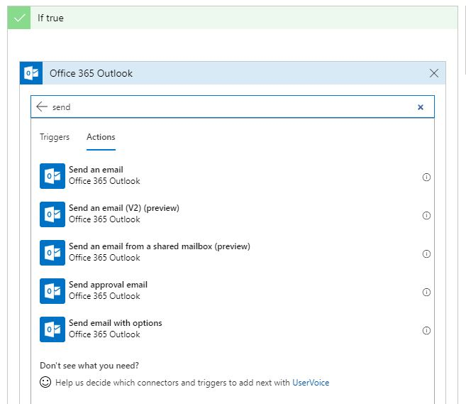
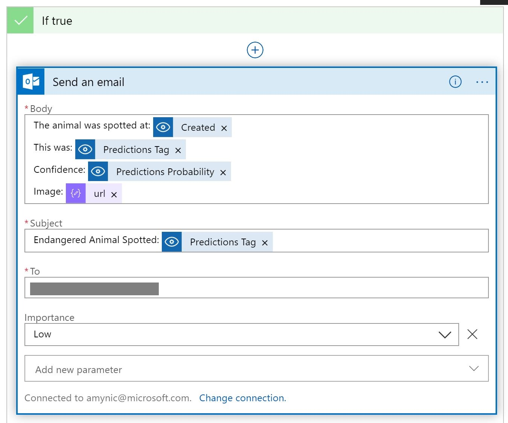

# O365 output for Logic App 

**If you have an office 365 account you can edit the logic app to send you a personalised email instead of outputting the data to another storage account.**

**This is a bonus option**

> continuing on from the logic app stage

Search for **outlook** and select the icon for **Office 365 Outlook**

Next sign into your Outlook email account and allow it access to the logic app

Next select the **Send an Email** option - it might be easiest to search for send

Add to the content of your email, some examples of what you could enter below:

* **To:** [your email address]
* **Subject:** Endangered Animal Spotted: [select Predictions Tag]
* **Body:** The animal was spotted at: [select Created At]. This was: [select Predictions Tag]. Confidence: [select Predictions Probability] Image: [select url]
* **Add new parameter:** select the drop down and select **Importance** check box. Once selected - you will see **Low** as an option in the dropdown.

head back to the [Logic Apps page](endangered-animal-detector-pipeline.md) to test and finish the application

When testing your Logic App you should receive an email containing the content about the image.

