# Azure Custom Vision Service
## Creating an Endangered Animal Detector Classification Algorithm

Using Azure Custom Vision service you can start to build your own personalised image classification and object detection algorithms with very little code. In this section we will create en endangered animal detector classification algorithm using the images provided in this repository

We have **3 Classes** of endangered animals each with **45 images** [(available in a .zip file here)](endangered-animals-images.zip)

* Arctic Fox
* Polar Bear
* Walrus

There is also a set of **test images** (not for training) in [the .zip folder](endangered-animals-images.zip).

First create a Custom Vision instance in your Azure account.

* Go to the **Azure Portal** main dashboard.
* Click **'Create a Resource'** in the top left
* Search for **'Custom Vision'**
* On the description pane for Custom Vision click **Create**.

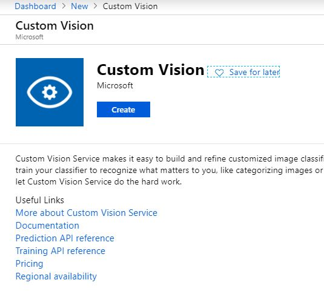
* Enter details to create
    * a **name** for the service
    * select your **subscription**
        * *[Note] Choose the Data Center geographically closest to you*
    * Choose the **F0 tier** for both 'Prediction pricing tier' and Training pricing tier
* For **'Resource group'** click 'Create new' and enter a name for the folder of services and choose OK. Example: student-ai-workshop

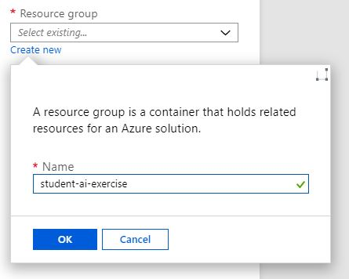
* Click **Create**

The service will go to be created in the Azure Portal. Once completed you will receive a toast notification to confirm this. Choose **'Go to resource'**

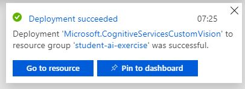

This will take you to your Custom Vision service page - this is where you can access documentation, keys and setting for the service.

Note down your **'Key'**

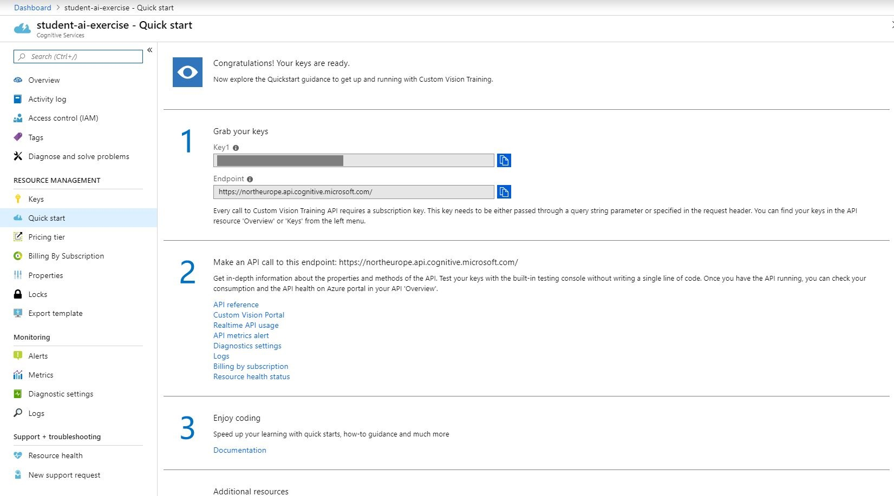

Now we can build our classifier, navigate to [https://www.customvision.ai](https://www.customvision.ai) and choose sign in. Sign in with your Azure credentials account

> Accept the terms and conditions box to continue

Once loaded choose **'New Project'** which opens a window to enter details

* **Name:** choose a suitable name (example: endangered animal detector)
* **Description:** add a description of the classifier (example shown in image below)
* **Resource Group:** choose the resource group you created your custom vision service in (example: student-ai-exercise [FO])
* **Project Types:** Classification
* **Classification Types:** Multiclass (Single tag per image)
* **Domains:** General

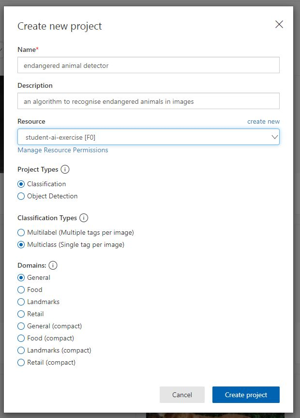

Choose **'Create Project'** and you will land on an empty workspace like below

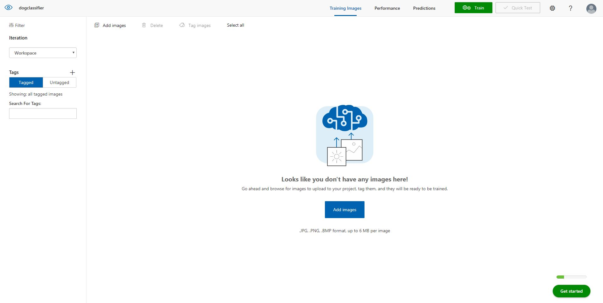

Now we can start adding images and assigning them tags to create our image classifier

In the top left, select **'Add images'**, browse for the first folder of images from the .zip folder - arctic-fox - and select all 45 of the images in the folder.

Add the **tag 'arctic-fox'** to the Arctic Fox images and select 'Upload 45 files'

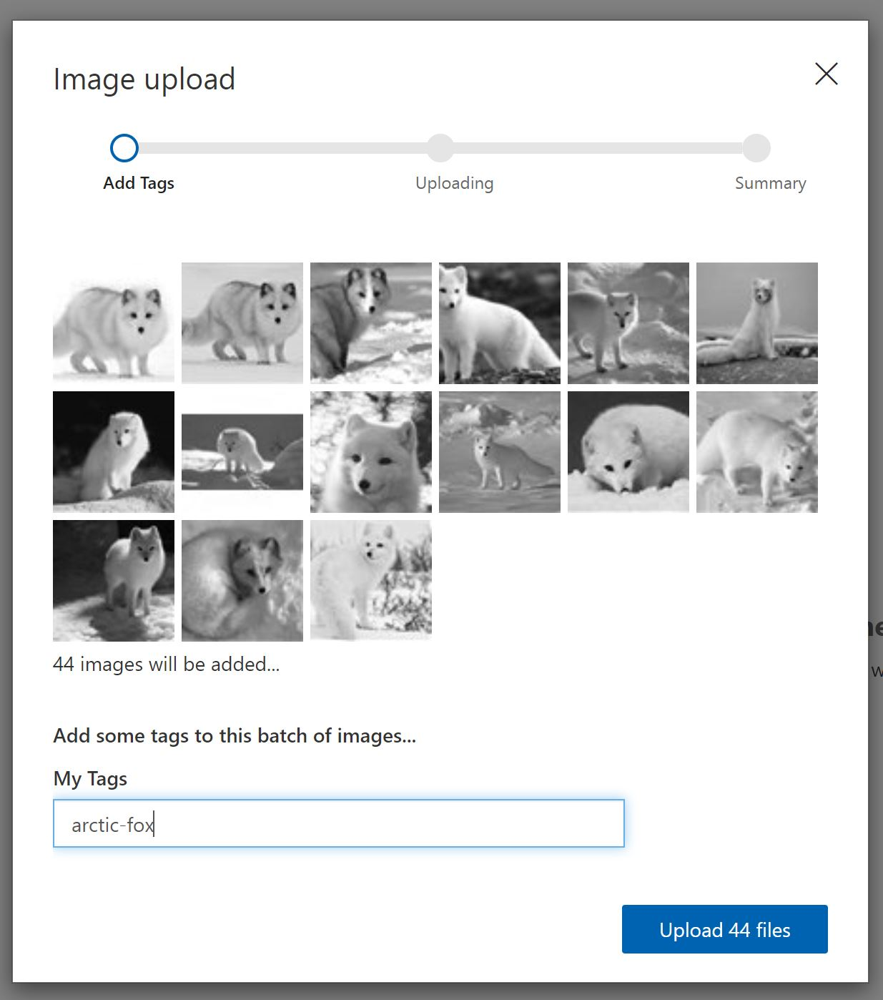

Once successful you receive a confirmation message and you should see your images are now available in the workspace

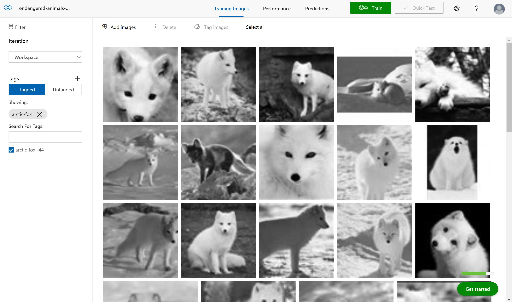

Now complete the same steps of uploading and tagging images for the other 2 animal categories in the folder. 

For each animal:

* Click **add images**
* Select the **45 new animal images**
* Add the **class label** (polar-bear, walrus etc)
* choose **upload**
* **confirm images uploaded** into the workspace

Now you should have all categories uploaded and on the left hand side you can see your 3 animal classes and you can filter depending on type of animal image

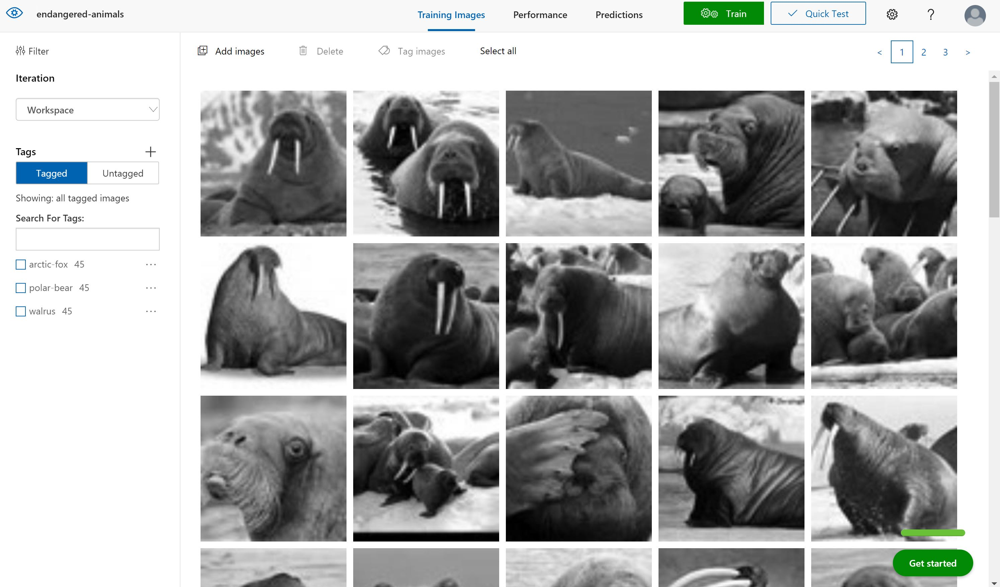

Now you are ready to train your algorithm on the animal image data you have uploaded. Select the green **'Train'** button in the top right corner and select the **'Fast Training'** Option

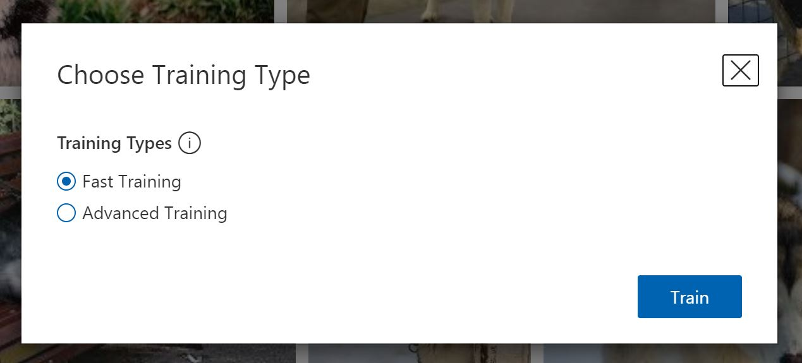

Once the training process is complete it will take you to the **Performance** tab. Here you will receive machine learning evaluation metrics for your model

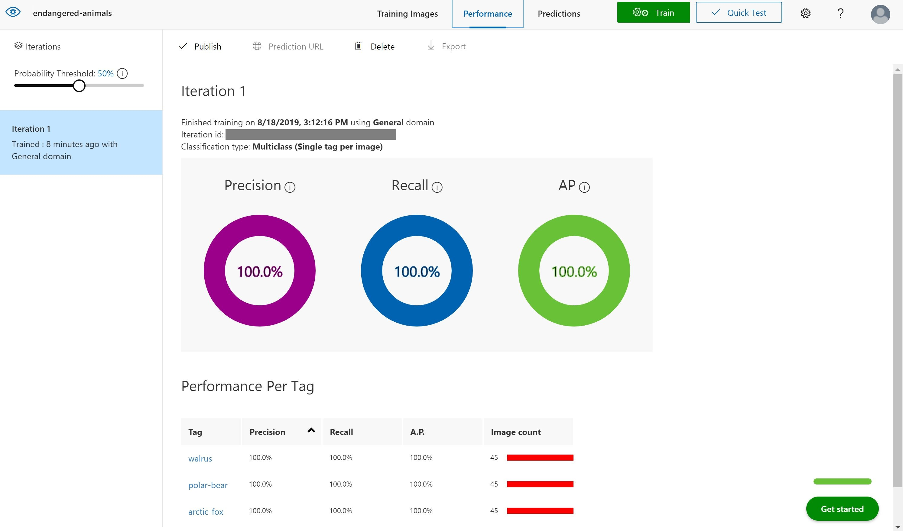

Now we have a model we need to test the model. Choose the **'Quick Test'** button in the top right (next to the train button) this will open a window where you can browse for a local image or enter a web URL.

Browse for an image in the test folder (images the model have not been trained on) and upload. The image will be analysed and a result returned of what animal the model thinks it is (prediction tag) and the models confidence of its result (prediction probability)

> Test an example from all 3 animal categories

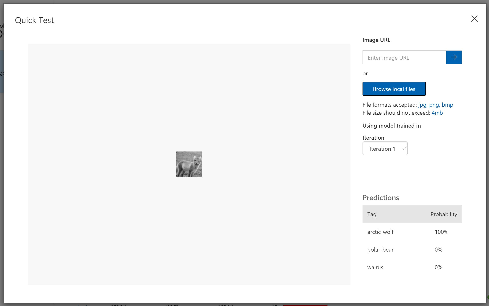

If you click the **'Predictions'** tab on the top toolbar - you should see all the test images you have submitted. This section is for **re-training**, as you get new data you can add this to your model to improve its performance. The images are ordered by importance - the image, which if classified correctly, will add the most new information to the model is listed first. Whereas the last image might be very similar to other images already learnt by the model so this is less important to classify correctly.

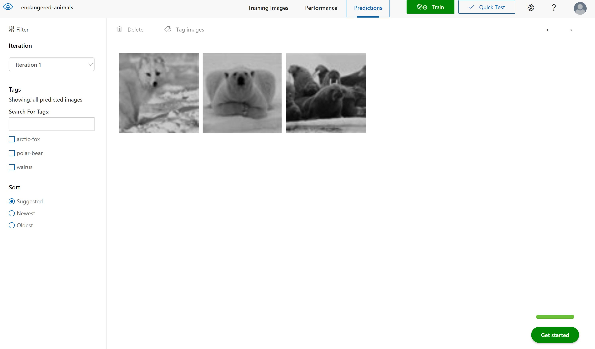

To add these images to the model - select the first image, review the results the model provided and then in the **'My Tags'** box enter the correct tag and click **'save and close'**

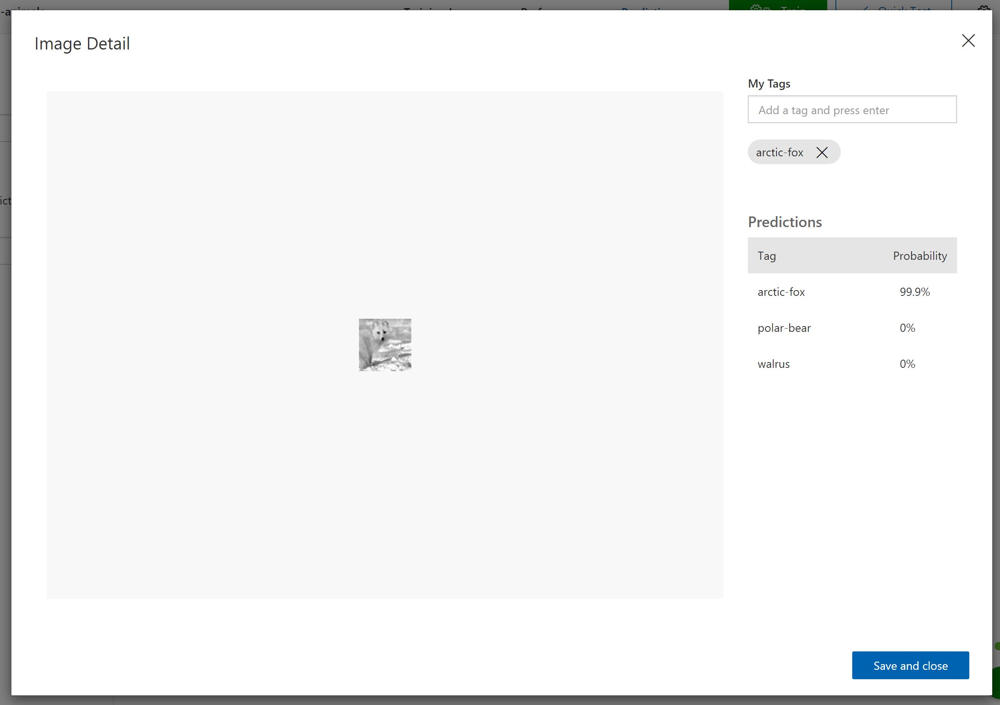

This image will disappear from the your predictions workspace and be added to the training images workspace. Once you add a few new images and tags you can re-train the model to see if there are improvements.

To use this model within applications you need the prediction details. Therefore, you have to go to the **Performance** tab from the top bar, click the **Publish** button and provide a name for this published iteration.

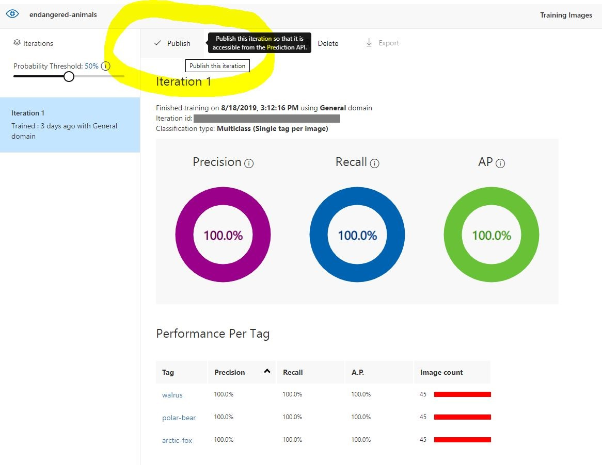

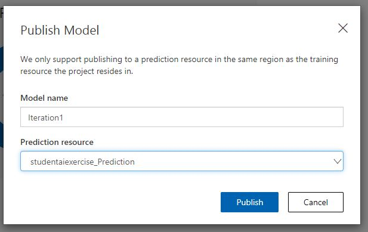

You can now select the **Prediction URL** button to gain all information you need to create an API call to your model - Copy down the details of **'if you have an image URL'** you will need this later

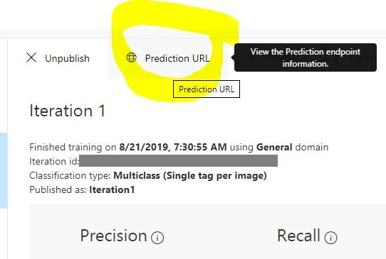

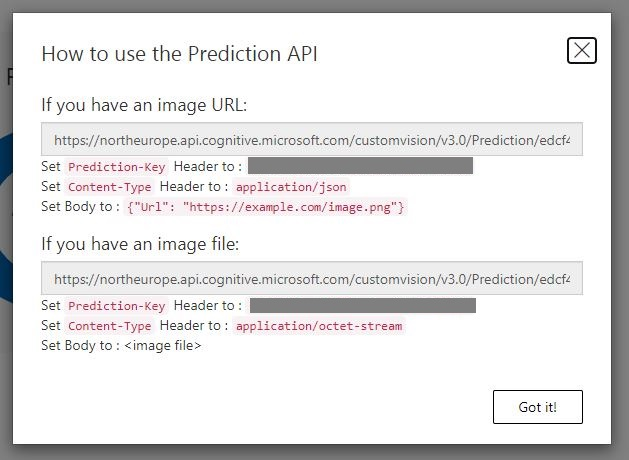

## Great work! 

you have created your endangered animal detector classification model using the Azure Custom Vision Service

## Continue the workshop ...

Build this intelligence into a process by following the next step of the tutorial **[HERE](endangered-animal-detector-pipeline.md)**

