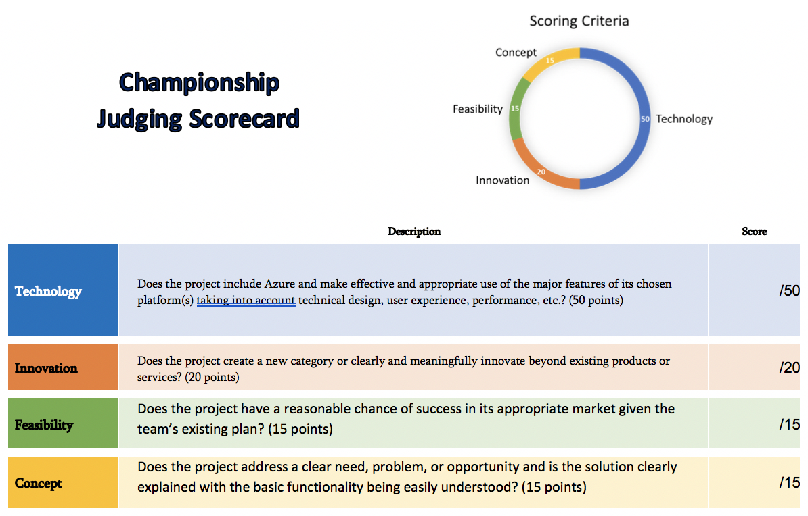

# Judging
The organizers will give you a list of all the projects that entered into your challenge. 

The easiest way to do the judging is to split the list of projects up amongst everyone juding, then set them loose with the below judging form. 

**Step 1:** Copy the judging form and save a version for your hackathon

[Link to make a copy](https://forms.office.com/Pages/ShareFormPage.aspx?id=v4j5cvGGr0GRqy180BHbRz_m6h1IaXlHh-JzkM0298RUQ1dMRERSUlRBWVk0WEVZMFRMODVOQzNMUS4u&sharetoken=qpdoCyyDnYfZ1UueqnXt)

**Step 2**: Get a sharing link for your copy of the form and distribute to all judges at your event. 

Easiest way to do that amid the chaos? Up for debate. I put the link at the very top of my hack-specific repo. You could also email it out, or make an aka.ms link (e.g. aka.ms/judgehackgt) that points to your copy of the form.

**Step 3**: Have each judge fill out the form once per team. Make sure judges have enough of a conversation with each team to feel confident that they actually *did* use Azure.

**Step 4**: Once juding is complete... 
- download the excel data from your copy of the form
- modify the data as needed (change '1' text to 1 digits, etc. This part may actually be the most painful because it's stupid and tedious.)
- sum totals

**Step 5**: Choose a winner! 
You may just choose the highest sum, or you may choose to perform additional steps to account for differences in scoring between judges. I like to grab the top ~2 that each judge scored and have a quick discussion amongst the judges - maybe allowing judges to revisit the top projects if there's time.

## Judging criteria

| Criteria | Points |
| -------- | ------ |
| Does the project address a clear need, problem, or opportunity and is the solution clearly explained? | /10 |
| Does the project include innovations in technical design and/or implementation of services (e.g., Cognitive Services, Machine Learning) and/or User Experience? | /20 |
| Does the project have a clear target market or audience? | /5 |
| Is the project’s purpose and basic functionality easily understood? | /5 |
| Does the project have a professional degree of production in terms of performance, user interface, visuals, and audio? | /10 |

