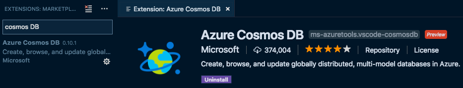
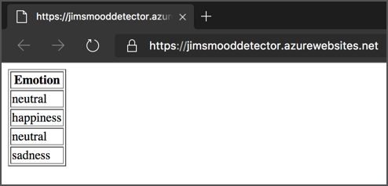

# Mood Detector Workshop

This workshop shows how to build a web app using [Python](https://www.python.org) and [Flask](http://flask.pocoo.org) running on [Microsoft Azure](https://azure.microsoft.com/free/students/?WT.mc_id=pythonworkshop-github-jabenn) that takes images from a desktop app, analyses them for faces using AI and stores information about the emotion of any faces in the image, notifying you if it detects sad faces multiple times. The web app also serves up a simple page showing the data captured.

This workshop is designed for students, and can be run using the free services available as part of the [Azure for students](https://azure.microsoft.com/free/students/?WT.mc_id=pythonworkshop-github-jabenn) offer.

## Prerequisites

To complete this workshop, you will need:

* An Azure account. Sign up for free using [Azure for students](https://azure.microsoft.com/free/students/?WT.mc_id=pythonworkshop-github-jabenn), or the [Azure free account](https://azure.microsoft.com/free/?WT.mc_id=pythonworkshop-github-jabenn) if you are not at an academic institution.
* [Python 3](https://www.python.org/downloads/).
  
  > If you are using Windows you will need to restart your machine after installing to ensure you can use Python and Pip from the command line.

* [Visual Studio Code](https://code.visualstudio.com/?WT.mc_id=pythonworkshop-github-jabenn)
* The [Python Extension for Visual Studio Code](https://marketplace.visualstudio.com/itemdetails?itemName=ms-python.python&WT.mc_id=pythonworkshop-github-jabenn). This can be installed from inside VS Code using the *Extensions* tab.
  
  

* The [Azure App Service Extension for Visual Studio Code](https://marketplace.visualstudio.com/itemdetails?itemName=ms-azuretools.vscode-azureappservice&WT.mc_id=pythonworkshop-github-jabenn). This can be installed from inside VS Code using the *Extensions* tab.
  
  

* The [Azure Cosmos DB Extension for Visual Studio Code](https://marketplace.visualstudio.com/itemdetails?itemName=ms-azuretools.vscode-cosmosdb&WT.mc_id=pythonworkshop-github-jabenn). This can be installed from inside VS Code using the *Extensions* tab.
  
  

  > You will need to restart Visual Studio Code before using this extension.

* A laptop with a Web Cam, or an external camera.

This workshop works on MacOS and Windows.

## The Mood Detector app

The mood detector is a Python app. It uses a library called [OpenCV](https://opencv.org) which is accessible from Python to access the Web Cam and take a picture. Once a picture has been taken, this app will send it to a Web Api built in Python, using a framework called [Flask](http://flask.pocoo.org) and running in the cloud. This is a special type of web site address that doesn't return a web page, but instead allows you to send and receive data.

The Web Api will take the picture, and analyze it using the [Azure Face Api](https://azure.microsoft.com/services/cognitive-services/face/?WT.mc_id=pythonworkshop-github-jabenn) from [Azure Cognitive Services](https://azure.microsoft.com/services/cognitive-services/?WT.mc_id=pythonworkshop-github-jabenn). This is an AI service that can recognize faces in images, as well as estimating the age of the face, if the person is smiling amongst other things. The Web Api will use this service to detect the emotion of all the faces. This will then be saved into a database called [CosmosDB](https://azure.microsoft.com/services/cosmos-db/?WT.mc_id=pythonworkshop-github-jabenn). This is a document database - instead of storing data in rows and columns in tables, it stored data as documents. These documents contain key/value pairs of data stored in a format called [JSON](https://www.json.org). It will also return a count of emotions.

The python app will use this count and ask the user if they are ok if the number of sad faces is greater than 3. This is a simple demo around how this technology could be used for a self care app.

The Web Api will then have a web site added. This web site will load all the data from CosmosDB and show it in a simple HTML table, showing all details from all faces captured.



## Code format

All code in this sample is shown in code blocks like this one:

```python
print('Here is some code')
```

Ellipses will be used to indicate other code, removed to make new code or the code that is being discussed easier to see. For example a code block like this:

```python
def func():
  ...
  print('end of the suite')
```

means that the `print('end of the suite')` will need to go inside the `func` function, but *after* all existing code in this function

## Steps

The steps for this workshop are:

1. [Build an app to take a photo](./Steps/BuildAnAppToTakeAPhoto.md)
2. [Create a Flask Web App](./Steps/CreateAFlaskWebApp.md)
3. [Deploy the Web App to Azure](./Steps/DeployTheWebAppToTheCloud.md)
4. [Add a Web Api to accept a photo](./Steps/AddWebApi.md)
5. [Analyse the photo using AI](./Steps/AnalyseThePhotoUsingAI.md)
6. [Save the face details to a database](./Steps/SaveTheResultsToADatabase.md)
7. [Return the count of each emotion](./Steps/ReturnTheEmotionCount.md)
8. [Call the web Api from the app](./Steps/CallTheWebApiFromDesktop.md)
9. [Alert the user if sad faces are found too often](./Steps/AlertTheUser.md)
10. [Add a web page to view the results](./Steps/ViewTheResults.md)
11. [Clean up](./Steps/CleanUp.md)

## Code

For reference, you can find the final code for this workshop in the [Code](./Code/) folder.

## Clean up Azure resources

This workshop uses resources that are available in the [Azure for Students account as free services](https://azure.microsoft.com/free/free-account-students-faq/?WT.mc_id=pythonworkshop-github-jabenn). As there are limits on the number of free services you can create, you may want to delete the resources created once you are done. The instructions to do this are in the last step - [Clean up](./Steps/CleanUp.md).
