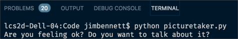

# Alert the user if sad faces are detected too often

In th [previous step](./CallTheWebApiFromDesktop.md) you connected the photo taking app to the Web Api and tested it out, uploading a picture and seeing the results of the analysis in Cosmos DB. In this step you will alert the user via the command line if sad faces are detected too often.

## Write the code

* Open the `picturetaker.py` file in Visual Studio Code.

* Add an import for the json package below the other imports
  
  ```python
  import json
  ```

* Add the following code just after the imports:
  
  ```python
  def check_sadness(emotions):
    if 'sadness' in emotions:
      if emotions['sadness'] >= 3:
        print('Are you feeling ok? Do you want to talk about it?')
  ```

* In the `upload` function, change the call to `post` the image to store the return value of this call and pass it to the new `check_sadness` function.
  
  ```python
  def upload(frame):
    ...
    results = requests.post(url=imageUrl, json=data)
    check_sadness(results.json())
  ```

## Run the code

There are two ways to run this code:

* Start debugging by either:
  * Select *Debug -> Start Debugging*
  * Press **F5**
  * Select the Debug pane from the toolbar on the left and select the green *Start Debugging* button.

  If you use one of these methods you will be able to set breakpoints and debug your code.

* Run this directly from the Visual Studio Code terminal using the command
  
  ```sh
  python picturetaker.py
  ```

  If you use this method you will not be able to set breakpoints and debug your code.

When the code runs, a window will appear showing the view from your camera. Press *Space* to take a photo and end the app. If more than 3 sad faces are detected you will see a message in the console output. Try this out by simulating various emotions.



## What does this code do

The overall flow of this code is:

1. Get the result from the post
2. Extract the number of times the sadness emotion was detected
3. If sadness was detected more than 3 times, output a message to the console

Lets look in more detail at the actual code.

```python
import json
```

This tells the Python compiler that we want to use `json` from the Python standard libraries - these come with Python so there is no need to install another package to use them.

```python
def check_sadness(emotions):
```

This code declares the `check_sadness` function to check the results for how many times sadness was detected based on a dictionary of emotion to count.

```python
if 'sadness' in emotions:
    if emotions['sadness'] >= 3:
      print('Are you feeling ok? Do you want to talk about it?')
```

The `emotions` dictionary is keyed of the emotion name, with the value being the count of the number of times that emotion was detected. This code checks if the `'sadness`' key exists, and the number of times sadness was detected. If it is greater than 3 it prints a message to the console.

```python
results = requests.post(url=imageUrl, json=data)
```

This code gets the return value of the post and stores it as `results`.

```python
check_sadness(results.json())
```

The `json` property of the results returns the JSON automatically converted to a dictionary. This code then passes this dictionary to the `check_sadness` functions.

## Next step

In this step you alerted the user via the command line if sad faces are detected too often. In the [next step](./ViewTheResults.md) you will create a web page to view the data from the database.
