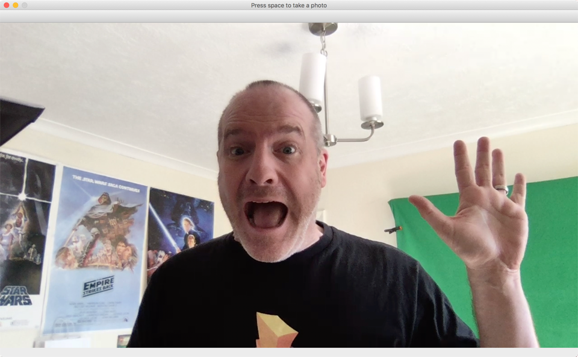

# Build an app to take a photo

In this step, you will build an app in Python that will launch the camera and take a photo.

## Create folders for the project

* Create a folder called `MoodDetector` somewhere on your machine.

## Open this folder in Visual Studio Code

* Launch Visual Studio Code.

* Open the newly created folder
  * On MacOS select *File->Open...*
  * On Windows select *File->Open Folder...*

* Navigate to the new `MoodDetector` folder and select **Open**.

You will see the empty folder appear in the *Explorer*.

## Install the required Python packages

This app will need the OpenCV Python package. This can be installed from [Pip](https://pypi.org/project/pip/).

* From Visual Studio Code, select *Terminal->New Terminal*
* In the terminal run the following command:

  ```sh
  pip install opencv-python
  ```

## Create a file for the code

* From Visual Studio Code, select the **New File** button in the Explorer bar in the *MoodDetector* section.

  

* Name the file `picturetaker.py`.
  
  > You may be prompted to install a Linter. This is a tool that can inspect your code for error as you write it. If a popup appears asking if you want to install this, select **Install**.

## Write the code

* Add the following code to this file:
  
  ```python
  import cv2

  cam = cv2.VideoCapture(0)
  cv2.namedWindow('Press space to take a photo')

  while True:
    ret, frame = cam.read()
    cv2.imshow('Press space to take a photo', frame)

    key = cv2.waitKey(1)
    if key%256 == 32:
      break

  cam.release()
  cv2.destroyAllWindows()
  ```

* Save the file.
  
  > If you don't want to have to remember to always save files, you can turn on Auto Save by selecting *File -> Auto Save*.

## Run the code

There are two ways to run this code:

* Start debugging by either:
  * Select *Debug -> Start Debugging*
  * Press **F5**
  * Select the Debug pane from the toolbar on the left and select the green *Start Debugging* button.

  If you use one of these methods you will be able to set breakpoints and debug your code.

* Run this directly from the Visual Studio Code terminal using the command
  
  ```sh
  python picturetaker.py
  ```

  If you use this method you will not be able to set breakpoints and debug your code.

When the code runs, a window will appear showing the view from your camera. Press *Space* to end the app.



## What does this code do

The overall flow of this code is:

1. Create the camera and a window
2. Loop forever, capturing a frame from the camera and displaying it on screen
3. Every millisecond check for a key press. If no key is pressed, or a key other than space is pressed, continue the loop capturing the next frame from the camera and display it on screen.
4. If the space key is pressed, break out of the loop and clean up the app before exiting

Lets look in more detail at the actual code.

```python
import cv2
```

This tells the Python compiler that we want to use code in the `cv2` module. This module was installed as part of the `opencv-python` package.

```python
cam = cv2.VideoCapture(0)
...
cam.release()
```

This creates an instance of the camera that can be used to capture an image. Once the code has run, this is released cleaning up any resources needed. The value of `0` passed to the `VideoCapture` function will use the only camera if your device has one, or the first if your device has more than one. When you run this code, if the wrong camera is being used on a device with multiple cameras (for example the rear one instead of a front-facing one), then you can change this value to `1` or higher to select the right camera.

```python
cv2.namedWindow('Press space to take a photo')
...
cv2.destroyAllWindows()
```

This will create a window with the title `Press space to take a photo`, and show it on the screen. Once the app has finished running, the window will be removed. This window will be named the same as its title, and this name can be used later to reference this window in other code.

```python
while True:
  ...
```

This code will loop the suite continuously until it is broken out of. The `while True:` loop means run all this code until something causes control to break out.

```python
ret, frame = cam.read()
cv2.imshow('Press space to take a photo', frame)
```

This reads the current image from the camera into the `frame` variable. This is then shown inside the window named `Press space to take a photo`. This causes the image from the camera to appear inside the window that was created earlier.

```python
key = cv2.waitKey(1)
```

This reads a key from the board, waiting 1 millisecond for a key to be pressed. If a key is pressed, `key` will be a value indicating which key was pressed, otherwise it will be `-1`.

```python
if key%256 == 32:
  break
```

This checks if the value of the key is the same as the space key (`32`), and if so, it breaks out of the while loop allowing the program to end.

## Next step

In this step you created the first Python file for this project, adding code to launch the camera in a window and capture an image. In the [next step](./CreateAFlaskWebApp.md) you will create a Flask Web App that this photo can be sent to.
