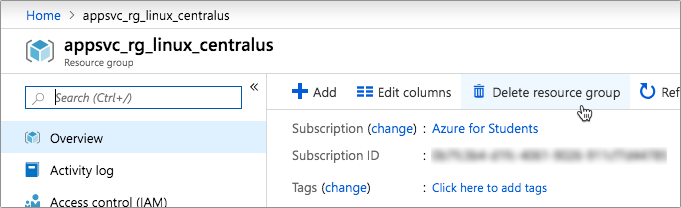

# Clean up

In the [previous step](./ViewTheResults.md) you created a web page to view the data from the database using an HTML template. In this step you will clean up your Azure resources.

## Deleting the resource group

Everything you created for this workshop should have been in the same resource group. This resource group was created when you first deployed the Azure App Service, and was used when you created the Face Api and Cosmos DB account.

Deleting this resource group will delete all the resources created.

* Open the Azure Portal from [portal.azure.com](https://portal.azure.com/?WT.mc_id=pythonworkshop-github-jabenn). Log in if required.

* From the search bar at the top, search for the resource group that was created. Select it from the results.
  
  

* Select **Delete resource group**.
  
  

* The confirmation panel will appear showing all the resources that will be deleted along with the resource group.

  

* Enter the name of the resource group and select *Delete*.

All the resources in this group will be deleted. If you used the 7 day trial for the Face Api instead of creating it in the Azure portal then you won't see this in the resource group, and you don't need to clean it up as this will be deleted automatically after 7 days.
