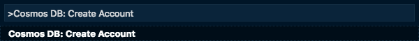
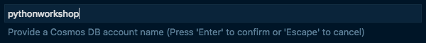
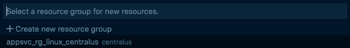

# Create a Cosmos DB Account

In the [previous step](./DeployTheWebAppToTheCloud.md) you deployed your Web App to the cloud, hosted in Azure. In this step you will create a Cosmos DB account that can be used to store face analysis results.

## Create a database

In a later step, you will be adding code to analyze faces. Once faces have been analyzed, the data needs to be stored somewhere so that it can be shown on a web page later. The database that this workshop will use is called [Cosmos DB](https://azure.microsoft.com/services/cosmos-db/?WT.mc_id=pythonworkshop-github-jabenn). Cosmos DB is a document database - instead of storing data in columns, rows and tables, Cosmos DB allows you to store, retrieve and search for JSON documents from inside named collections.

To create a Cosmos DB database, you first create an account. Inside the account you can create databases, and these databases can each contain one or more collections. Documents are stored in collections.

In this step you will start the creation of a Cosmos DB Account. This can take a few minutes, so it will be started now, and should be complete by the time it is needed.

### Create a Cosmos DB account

* Open the command palette:
  * On Windows, press Ctrl+Shift+P
  * On MacOS, press Cmd+Shift+P

* From the Visual Studio Code command palette, select *Cosmos DB: Create Account*

  

* Select the Azure subscription you want to use.
  
  

* Give your account a name. This needs to be unique as it will be a part of a URL used to access the database, and needs to be between 3 and 31 characters and only contain letters, numbers or '-'.
  
  

* Select an API for the Cosmos DB account. Cosmos DB has a number of ways you can access the data, some mimicking other databases. For this workshop, select *SQL (Document DB)*.
  
  

* Select the resource group you want to run the code in. One would have been created for you when you deployed the web app in an earlier step called something like `appsvc_linux_centralus`, so select this one.
  
  

* Select a location for the Cosmos DB resource. Choose a location closest to you.
  
  

* The Cosmos DB resource will be created, and a dialog will appear showing the progress. This will take a few minutes.
  
  

You can leave this creation running and move on to the next step.

## Next step

In this step you created a Cosmos DB account that can be used to store face analysis results. In the [next step](./AddWebApi.md), you will add a route to this app to provide a Web Api to accept a photo that can be sent by the app.
