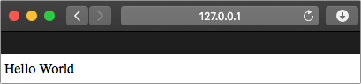

# Create a Flask Web app

In the [previous step](./BuildAnAppToTakeAPhoto.md) you created the first Python file for this project, adding code to launch the camera in a window and capture an image. In this step you will create a simple Flask Web App.

## Install the Flask package

[Flask](http://flask.pocoo.org) is a Python micro-framework for creating Web Apps. It is lightweight and easy to use to create simple Web Apps. It is available as a Python package that can be installed with `pip`.

Instead of install it using `pip` from the terminal, it should be configured inside a `requirements.txt` file. This file lists all the packages that a Python app depends on, and will be needed once the Web App is deployed to the cloud in a later step. This file will tell whatever server in the cloud that the web site is running on that packages that have to be installed before the Web App can be started.

* Create a new file in the folder called `requirements.txt`
* Add the following packages to the file:
  
  ```python
  opencv-python
  flask
  ```

  This adds all the packages needed by both the app to take a photo, and the web server.

* Save the file

* Install the packages from the terminal using the following command:
  
  ```sh
  pip install -r requirements.txt
  ```

  This will install all packages in the `requirements.txt` file, skipping any that are already installed..

## Write the code

* Create a new file called `app.py`
* Add the following code to this file:
  
  ```python
  from flask import Flask

  app = Flask(__name__)

  @app.route('/')
  def home():
    return 'Hello World'
  ```

* Save the file

## Run the code

This code can't be run from the terminal using the file name, instead it has to be run as a Flask app using the Flask package. There are two ways to do this:

* From the Debug pane of the toolbar, drop down the *Debug configuration* box and select *Python: Flask*.
  
  > If you do not see this option, then select *Add configuration* to edit the `launch.json` file. This should create a set of launch options for Python files.
  >
  > If these options are not created automatically, select *Add Configuration...* and select the *Python: Flask* option. Save this file.
  >
  > Select *Python: Flask* from the *Debug configuration* box.

  Select the green *Start Debugging* button.

  If you use this method you will be able to set breakpoints and debug your code.

* From the terminal, run the file as a Flask app using:
  
  ```sh
  flask run
  ```

  If you use this method you will not be able to set breakpoints and debug your code.

The Web App will be run, and can be accessed from your device at [http://127.0.0.1:5000](http://127.0.0.1:5000). You will see this URL in the output window, and you can use **ctrl+click** to go directly to this site.

* Open this URL in a web browser to see the `Hello World` message.

  

* Stop the debugger once you have tested this out.

## What does this code do

The overall flow of this code is:

1. Create a Flask app that the Flask framework can use to know this is a Flask Web App
2. Define a route for '/' that returns `'Hello World'`

Lets look in more detail at the actual code.

```python
from flask import Flask
```

This tells the Python compiler that we want to use code in the `Flask` module. This module was installed as part of the `flask` package.

```python
app = Flask(__name__)
```

This creates a Flask Web App called whatever the file is called. `__name__` is a special variable in Python that returns the name of the current module - so the file without the `.py` extension.

```python
@app.route('/')
def home():
```

This defines a function called `home`. This function is mapped to a route called `/`. In a Web App, a route is the part of the URL after the domain name, and different routes can be mapped to different web pages. `/` is usually the home page, and there can be as many other routes as needed, for example `/about` would route to an about page, `/basket` could route to a shopping basket. If your website was at `http://www.mywebsite.com` then the `/` route is the one that would be used when you point your browser to `http://www.mywebsite.com`, `/about` would be used when you went to `http://www.mywebsite.com/about` and so on.

```python
return 'Hello World'
```

The contents of the `home` function just returns simple text, and this will be converted to a simple web page showing this text.

If you view the source of the web page generated by this code, you will see the following:

```html
<html>
  <head></head>
  <body>Hello World</body>
</html>
```

## Next step

In this step you created a simple Flask Web App that showed 'Hello World' when run. In the [next step](./DeployTheWebAppToTheCloud.md) you will deploy this Web App to the cloud so it can be accessed from anywhere.
