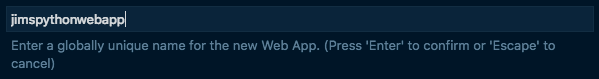
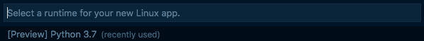
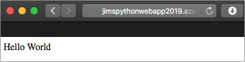

# Deploy the Web App to the cloud

In the [previous step](./CreateAFlaskWebApp.md) you created a simple Flask Web App that showed 'Hello World' when run. In this step you will deploy this Web App to the cloud.

## Running Web Apps in the cloud

In the last step, you ran the Web App on your local computer. This means that you can see the web page, but it is not available to anyone else. To make it available, it needs to run on a computer somewhere that is accessible over the internet. Cloud services allow you to easily deploy your Web Sites to computers running in the cloud. The Cloud service available from Microsoft is called [Azure](https://azure.microsoft.com/?WT.mc_id=pythonworkshop-github-jabenn), and this runs all around the world.

Running web sites used to be a lot of work. You would need to configure a computer connected to the internet, install software to host the web site, connect it to the internet with a domain name, configure security so hackers couldn't break in, and ensure everything is backed up in case of something breaking. For busy sites you might want to configure multiple computers to spread the load, and services to ensure one computer doesn't get overloaded handling requests. Now, thanks to services in the cloud you can just deploy your code and let the cloud provider make everything else work.

Using your Azure subscription, you will be able to deploy your code to the cloud, with Azure managing all the complexities for you using [Azure App Service](https://azure.microsoft.com/services/app-service/?WT.mc_id=pythonworkshop-github-jabenn). You configure an App Service and send your code to it, and Azure handles the rest.

## Deploying to an App Service

You can configure an Azure App Service and deploy your code from inside Visual Studio Code.

* Open the command palette:
  * On Windows, press Ctrl+Shift+P
  * On MacOS, press Cmd+Shift+P

* Select *Azure App Service: Deploy to Web App...*
  
  

* You will be asked what code you want to deploy. This option will automatically select the folder with your code in it, so select that.

  

* If you have never signed into Azure from Visual Studio Code before, you will be asked to sign in.
  * Select *Sign in to Azure...*
  * Your browser will be launched, and you can sign in with your Azure account.
  * Once signed in from the browser, you can close the web page that was launched.

* Select the Azure subscription you want to use.
  
  

* Select *+ Create New Web App*

  There are 2 *Create New Web App* options, one marked as *Advanced*. You want the normal one, **not** the *Advanced* one.

  

* Give your web app a name. This will be part of the public web site address, so needs to be unique across the world. For example, I might use `jimspythonwebapp2019`.

  

* Select the runtime for your App Service App. This is a Python app, so select the latest version of the Python runtime, such as *Python 3.7*

  

* The App Service will start being created. You will see a progress bar on the bottom right, and this will show you once it is complete. You can monitor the progress from the *Output* window by selecting *View -> Output* and selecting *Azure App Service* from the window selector..

  

* Some popups wil appear asking if you want to make configuration changes to speed up deployment and always deploy this web app. Select **Yes** for both.
  
  
  
  

* A popup will appear showing the deployment progress. You can monitor the progress from the *Output* window by selecting *View -> Output* and selecting *Azure App Service* from the window selector.
  
  

* Once the code has been deployed, you will be able to view the code over the internet. Launch your browser and open your web site. The address will be `https://<web app name>.azurewebsites.net/`. For example, for my web site this is `https://jimspythonwebapp2019.azurewebsites.net/`. You will see the `'Hello World'` page.
  
  

* Try this from different devices such as your phone. This web site is available anywhere.

## Resource groups

In Azure, resources such as App Service or AI services must belong to a Resource Group. Resource Groups are logical groupings of resources, grouped any way that makes sense to you. Every resource has to belong to one and only one Resource Group.

Resource Groups are useful as you can use them to group resources together that make up an application. You can view all resources in the group, and manage them together, for example if you want to delete all the resources you can delete the Resource Group and all resources in it will be deleted.

When your App Service was created, it would have been created inside a new Resource Group, probably named something like `appsvc_linux_centralus`. We will be adding all new resources to this Resource Group in the remainder of this workshop, and deleting this Resource Group at the end to remove all resources.

## Next step

In this step you deployed your Web App to the cloud, hosted in Azure. In the [next step](./CreateACosmosDbAccount.md), you will create a Cosmos DB account that can be used to store face analysis results.
