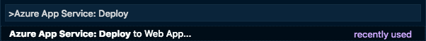

# Return the count of each emotion from the Web Api

In the [previous step](./SaveTheResultsToADatabase.md) you created a Cosmos DB collection, and saved the results of the analysis into a database. In this step you will return the count of each emotion from this Web Api.

## Extracting and manipulating the data

The detected emotions are stored in the Cosmos DB database as individual documents, one per detected emotion. The Web Api needs to return a count of each emotion, so the code will need to read all the records and count each individual emotion, returning just a simple dictionary of emotions and counts.

## Returning data from a Web Api call

REST calls can return data, and this is typically done as JSON, the same way that data is sent. The `upload_image` function that handles the `image` route currently returns `'OK'`, a string containing a message that the call worked. This can be changed to return the dictionary of emotions to count as a JSON document.

The format of this JSON is emotion to count, with each emotion as a separate property in the JSON document.

```json
{
  "neutral" : "2",
  "sadness" : "4",
  "anger" : "1",
  "happiness" : "7"
}
```

## Write the code

* Open the `app.py` file.

* At the start of the file import the `jsonify` member from the flask module by adding it to the existing import statement
  
  ```python
  from flask import Flask, request, jsonify
  ```

* Add a new function called `get_emotions` above the `upload_image` function, with the following code:

  ```python
  def get_emotions():
    docs = list(client.ReadItems(cosmos_collection_link))
    emotions = [doc['emotion'] for doc in docs]
    counts = dict()
    for emotion in emotions:
      counts[emotion] = counts.get(emotion, 0) + 1

    return jsonify(counts)
  ```

* In the `upload_image` function, replace the `return 'OK'` statement with the following code:
  
  ```python
  return get_emotions()
  ```

## Deploy the code

* Open the command palette:
  * On Windows, press Ctrl+Shift+P
  * On MacOS, press Cmd+Shift+P

* Select *Azure App Service: Deploy to Web App...*
  
  

* A dialog will pop up asking if you want to overwrite the existing deployment. Select the **Deploy** button.
  
  

* A popup will appear showing the deployment progress. You can monitor the progress from the *Output* window by selecting *View -> Output* and selecting *Azure App Service* from the window selector.
  
  

* Open the web site in your browser to verify that everything is working correctly.

## What does this code do

The overall flow of this code is:

1. Retrieve all the emotion records from the Cosmos DB collection
2. Build a dictionary of emotions to the count of that emotion
3. Return the dictionary as JSON

Lets look in more detail at the actual code.

```python
from flask import Flask, request, jsonify
```

This tells the Python compiler that we want to use code in the `jsonify` module. This module was installed as part of the `flask` package.

```python
def get_emotions():
```

This defines a new function called `get_emotions`. This function isn't marked with `@app.route` so is not a route that can be called by the Web Api, instead it is an internal function.

```python
docs = list(client.ReadItems(cosmos_collection_link))
```

This code uses the Cosmos DB client to read all the items from the `faces` collection into a `list`.

```python
emotions = [doc['emotion'] for doc in docs]
```

This code iterates through the items read from Cosmos DB and extracts the emotion value. The documents extracted from Cosmos DB are created as dictionaries, so this code extracts the `'emotion'` property from each document in the dictionary, and puts these into a list.

```python
counts = dict()
```

This code creates a new dictionary to store the emotions into. This dictionary will be keyed off the emotion and contain the count of each emotion.

```python
for emotion in emotions:
  counts[emotion] = counts.get(emotion, 0) + 1
```

This code loops through the emotions, extracts the current count of that emotion from the dictionary (or 0 if the emotion isn't in the dictionary yet), and increments it, setting the new value back into the dictionary

```python
return jsonify(counts)
```

The results need to be returned as JSON, so this call to `jsonify` will convert the dictionary to JSON and return it.

```python
return get_emotions()
```

This returns the JSON of the emotions from the Web Api endpoint.

## Next steps

In this step you returned the count of each emotion from the Web Api. In the [next step](./CallTheWebApiFromDesktop.md) you will connect the photo taking app to the Web Api to test it out.
