<a name="HOLTitle"></a>
# Using the Custom Vision Service to Perform Image Classification #

[Azure Cognitive Services](https://azure.microsoft.com/services/cognitive-services/) is a suite of services and APIs backed by machine learning that enables developers to incorporate intelligent features such as facial recognition in photos and videos, sentiment analysis in text, and language understanding into their applications. Microsoft's [Custom Vision Service](https://azure.microsoft.com/services/cognitive-services/custom-vision-service/) is one of the members of the Cognitive Services suite. Its purpose is to create image-classification models backed by Artificial Intelligence that "learn" from labeled images you provide. Want to know if a photo contains a picture of a flower? Train the Custom Vision Service with a collection of flower images, and it can tell you whether the next image includes a flower—or even what type of flower it is.

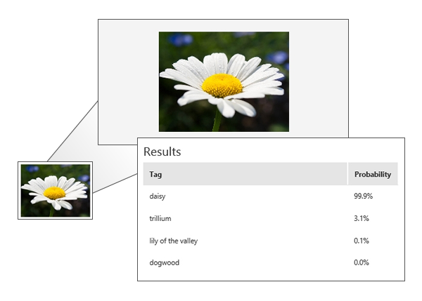

The Custom Vision Service enables organizations to develop domain-specific image-classification models and use it to analyze image content. Examples include identifying a dog's breed from a picture of the dog, analyzing images for adult content, and identifying defective parts produced by manufacturing processes. It was recently used to [help search-and-rescue drones](https://blogs.technet.microsoft.com/canitpro/2017/05/10/teaching-drones-to-aid-search-and-rescue-efforts-via-cognitive-services/) identify objects such as boats and life vests in large bodies of water and recognize potential emergency situations in order to notify a rescue squad without waiting for human intervention.

The Custom Vision Service exposes two APIs: the [Custom Vision Training API](https://southcentralus.dev.cognitive.microsoft.com/docs/services/Custom_Vision_Training_3.0/operations/5c771cdcbf6a2b18a0c3b7fa) and the [Custom Vision Prediction API](https://southcentralus.dev.cognitive.microsoft.com/docs/services/Custom_Vision_Prediction_3.0/operations/5c82db60bf6a2b11a8247c15). You can build, train, and test image-classification models using the [Custom Vision Service portal](https://www.customvision.ai/), or you can build, train, and test them using the Custom Vision Training API. Once a model is trained, you can use the Custom Vision Prediction API to build apps that utilize it. Both are REST APIs that are easily called from a variety of programming languages.

In this lab, you will create a Custom Vision Service model, train it with images of famous paintings tagged with the artists' names, and utilize the model from a Node.js app to identify the artist of paintings that you upload. Along the way, you will learn how to train a Custom Vision Service model and leverage it from your apps using REST APIs.

<a name="Objectives"></a>
### Objectives ###

In this hands-on lab, you will learn how to:

- Create a Custom Vision Service project 
- Train a Custom Vision Service model with tagged images  
- Test a Custom Vision Service model 
- Create apps that leverage Custom Vision Service models by calling REST APIs 

<a name="Prerequisites"></a>
### Prerequisites ###

The following are required to complete this hands-on lab:

- A Microsoft account. If you don't have one, [sign up for free](https://account.microsoft.com/account).
- An active Microsoft Azure subscription. If you don't have one [sign up for free](https://azure.microsoft.com/free).
- Microsoft [Visual Studio Code](http://code.visualstudio.com)
- [Node.js](https://nodejs.org)

<a name="Resources"></a>
### Resources ###

[Click here](https://topcs.blob.core.windows.net/public/cvs-resources.zip) to download a zip file containing the resources used in this lab. Copy the contents of the zip file into a folder on your hard disk.

<a name="Cost"></a>
### Cost ###


The cost of this lab is **low**. For an overview of cost ratings, refer to [Explanation of Costs](../../Costs.md).

<a name="Exercises"></a>
## Exercises ##

This hands-on lab includes the following exercises:

- [Exercise 1: Create a Custom Vision Service project](#Exercise1)
- [Exercise 2: Upload tagged images](#Exercise2)
- [Exercise 3: Train the model](#Exercise3)
- [Exercise 4: Test the model](#Exercise4)
- [Exercise 5: Create a Node.js app that uses the model](#Exercise5)
- [Exercise 6: Use the app to classify images](#Exercise6)

Estimated time to complete this lab: **45** minutes.

<a name="Exercise1"></a>
## Exercise 1: Create a Custom Vision Service project ##

The first step in building an image-classification model with the Custom Vision Service is to create a project. In this exercise, you will use the Custom Vision Service portal to create a Custom Vision Service project.

1. Open the [Custom Vision Service portal](https://www.customvision.ai/) in your browser. Then click **SIGN IN** and sign in with your Microsoft account. 
 
    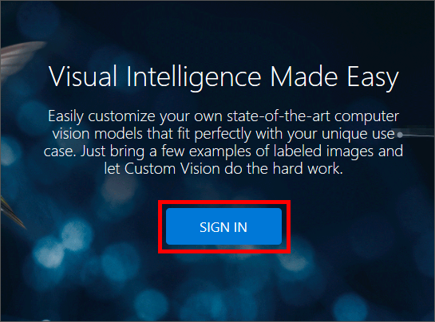

    _Signing in to the Custom Vision Service portal_

1. Click the profile icon in the upper-right corner of the portal and select the Azure directory you want associated with your Custom Vision project.

1. Click **NEW PROJECT** to create a new project.
  
	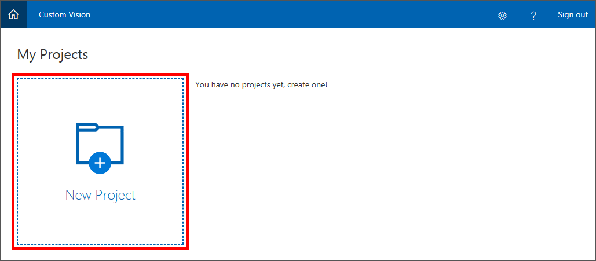
	
	_Creating a Custom Vision Service project_

1. In the "New project" dialog, name the project "Artworks." Then click **create new** and create a new resource group named "cvs-lab-rg" for your project.

	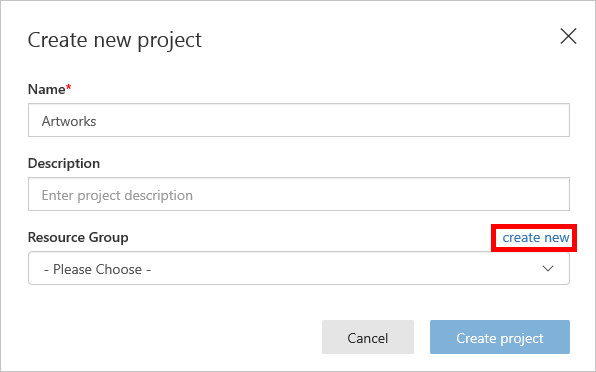

    _Entering project information_

1. Select the resource group you created in the previous step from the list labeled "Resource Group." Ensure that  **Classification** is selected as the project type, **Multiclass** is selected as the classification type, and **General** is selected as the domain. Then click **Create project**.

	> A domain optimizes a model for specific types of images. For example, if your goal is to classify food images by the types of food they contain or the ethnicity of the dishes, then it might be helpful to select the Food domain. For scenarios that don't match any of the offered domains, or if you are unsure of which domain to choose, select the General domain.

	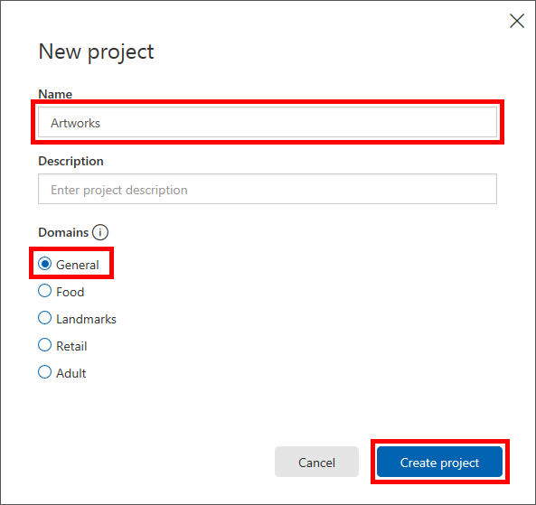

    _Creating a Custom Vision Service project_

The next step is to upload images to the project and assign tags to those images to classify them.

<a name="Exercise2"></a>
## Exercise 2: Upload tagged images ##

In this exercise, you will add images of famous paintings by Picasso, Pollock, and Rembrandt to the Artworks project, and tag the images so the Custom Vision Service can learn to differentiate one artist from another.
  
1. Click **Add images** to add images to the project.

	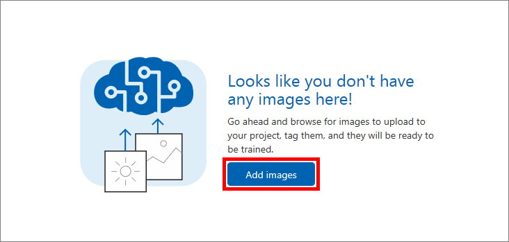

    _Adding images to the project_ 
 
1. Browse to the "Artists\Picasso" folder in the [resources that accompany this lab](https://topcs.blob.core.windows.net/public/cvs-resources.zip), select all of the files in the folder, and click **Open**.

	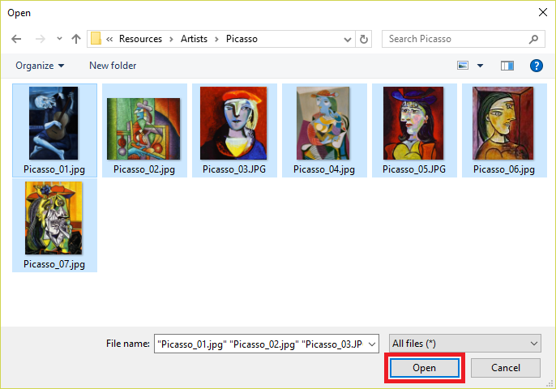

    _Uploading Picasso images_ 
 
1. Type "Picasso" (without quotation marks) into the "My Tags" box. Then click the **Upload 7 files** button to upload the images. Once the upload has completed, click **Done**.

	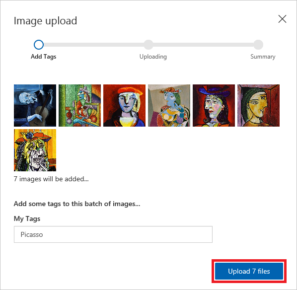

    _Tagging Picasso images_ 

1. With seven Picasso images, the Custom Vision Service can do a decent job of identifying paintings by Picasso. But if you trained the model right now, it would only understand what a Picasso looks like, and it would not be able to identify paintings by other artists.

	The next step is to upload images of paintings by another artist. Click **Add images** and select all of the images in the "Artists\Rembrandt" folder in the lab resources. Tag them with the label "Rembrandt" and upload them to the project.

1. Repeat the previous step to upload the images in the "Artists\Pollock" folder and tag them with the label "Pollock."

With the tagged images uploaded, the next step is to train the model with these images so it can distinguish between paintings by Picasso, Rembrandt, and Pollock.

<a name="Exercise3"></a>
## Exercise 3: Train the model ##

In this exercise, you will train the model using the images uploaded and tagged in the previous exercise. Training can be accomplished with a simple button click in the portal, or by calling the [TrainProject](https://southcentralus.dev.cognitive.microsoft.com/docs/services/Custom_Vision_Training_3.0/operations/5c771cdcbf6a2b18a0c3b813) method in the [Custom Vision Training API](https://southcentralus.dev.cognitive.microsoft.com/docs/services/Custom_Vision_Training_3.0/operations/5c771cdcbf6a2b18a0c3b7fa). Once trained, a model can be refined by uploading additional tagged images and retraining it.
 
1. Click the **Train** button at the top of the page to train the model. Each time you train the model, a new iteration is created. The Custom Vision Service maintains several iterations, allowing you to compare your progress over time.

	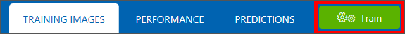

    _Training the model_

1. Wait for the training process to complete. (It should only take a few seconds.) Then review the training statistics presented to you for iteration 1.

	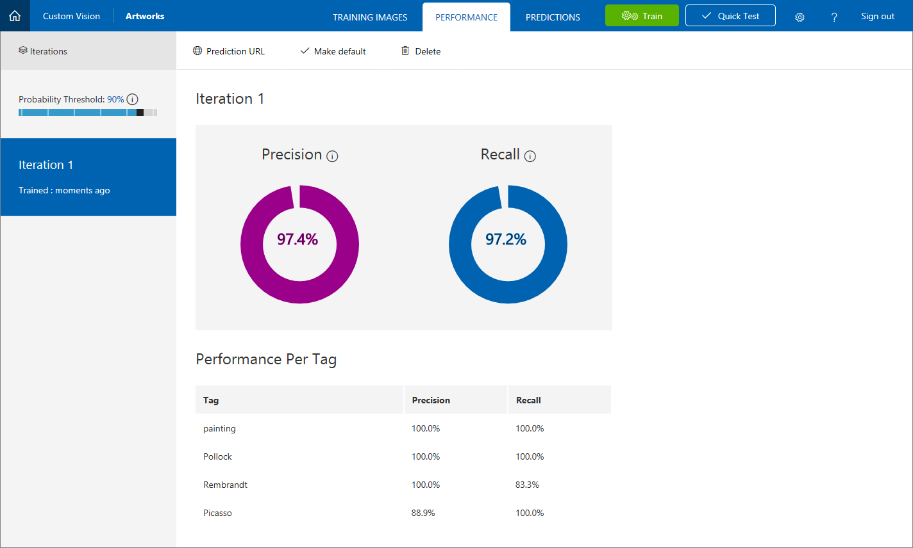

    _Results of training the model_ 

	**Precision** and **recall** are separate but related  measures of the model's accuracy. Suppose the model was presented with three Picassos and three Van Goghs, and that it correctly identified two of the Picassos as "Picasso" images, but incorrectly identified two of the Van Goghs as Picassos. In this case, the precision would be 50% (two of the four images it classified as Picassos are actually Picassos), while its recall would be 67% (it correctly identified two of the three Picasso images as Picassos). You can learn more about precision and recall from https://en.wikipedia.org/wiki/Precision_and_recall.

	**AP**, short for Average Precision, is a third measurement of the model's accuracy. Whereas precision measures the false-positive rate and recall measures the false-negative rate, AP is a mean of false-positive rates computed across a range of thresholds. For more information, see [Understanding the mAP Evaluation Metric for Object Detection](https://medium.com/@timothycarlen/understanding-the-map-evaluation-metric-for-object-detection-a07fe6962cf3).

Now let's test the model using the portal's Quick Test feature, which allows you to submit images to the model and see how it classifies them using the knowledge gained from the training images.

<a name="Exercise4"></a>
## Exercise 4: Test the model ##

In [Exercise 5](#Exercise5), you will create a Node.js app that uses the model to identify the artist of paintings presented to it. But you don't have to write an app to test the model. You can do your testing in the portal, and you can further refine the model using the images that you test with. In this exercise, you will test the model's ability to identify the artist of a painting using test images provided for you.

1. Click **Quick Test** at the top of the page. Then click **Browse local files**, browse to the "Quick Tests" folder in the lab resources, and select **PicassoTest_01.jpg**. Then click **Open**.

1. Examine the results of the test in the "Quick Test" dialog. What is the probability that the painting is a Picasso? What is the probability that it is a Rembrandt or Pollock?

1. Close the "Quick Test" dialog. Then click **Predictions** at the top of the page.
 
	

    _Viewing the tests that have been performed_ 

1. Click the test image that you uploaded to show a detail of it. Then tag the image as a "Picasso" by selecting **Picasso** from the drop-down list and clicking **Save and close**.

	> By tagging test images this way, you can refine the model without uploading additional training images.
 
	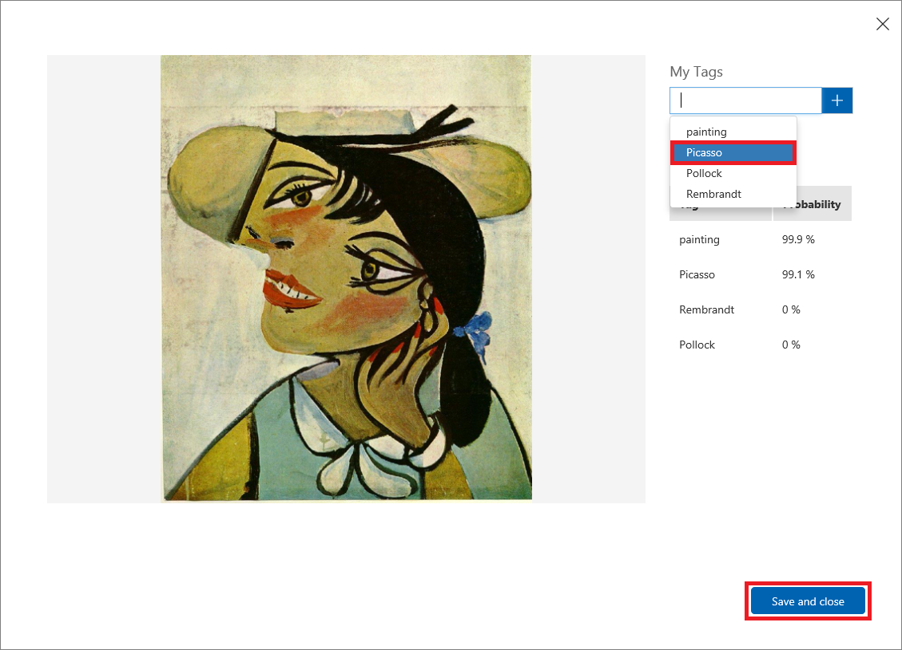

    _Tagging the test image_ 

1. Test the model with some of other Picasso, Rembrandt, and Pollock images in the "Quick Test" folder. How well does it identify the artists of the paintings in the test images?

1. Perform another quick test using the file named **FlowersTest.jpg** in the "Quick Test" folder. Confirm that this image is assigned a low probability of being a Picasso, a Rembrandt, or a Pollock.

The model is trained and ready to go and appears to be adept at identifying paintings by certain artists. Now let's go a step further and incorporate the model's intelligence into an app.

<a name="Exercise5"></a>
## Exercise 5: Create a Node.js app that uses the model ##

The true power of the Custom Vision Service is the ease with which developers can incorporate its intelligence into their own applications using the [Custom Vision Prediction API](https://southcentralus.dev.cognitive.microsoft.com/docs/services/Custom_Vision_Prediction_3.0/operations/5c82db60bf6a2b11a8247c15). In this exercise, you will use Visual Studio Code to modify an app named Artwork to use the model you built and trained in previous exercises.

1. If Node.js isn't installed on your PC, go to https://nodejs.org/ and install the latest LTS version. You can determine whether Node is installed by opening a Command Prompt or terminal window and typing the following command:

	```
	node --version
	```

	If Node is installed, the version number will be displayed.

1. If Visual Studio Code isn't installed on your PC, go to http://code.visualstudio.com and install it now.

1. Start Visual Studio Code and select **Open Folder...** from the **File** menu. In the ensuing dialog, select the "Client\Artworks" folder included in the lab resources.

	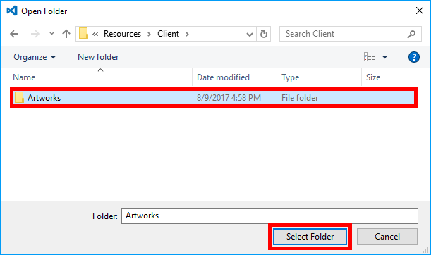

    _Selecting the Artworks folder_ 

1. Use the **View** > **Terminal** command to open an integrated terminal window in Visual Studio Code. Then execute the following command in the integrated terminal to load the packages required by the app:

	```
	npm install
	```

1. Return to the Artwork project in the Custom Vision Service portal. Click **Performance** at the top of the page, and then click **Publish** to publish the model and make it available available through the Prediction API. 

	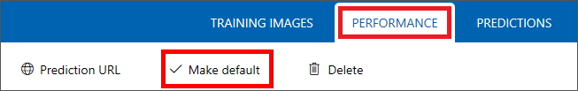

    _Publishing the model_ 

1. Before you can run the app and use it to call the Custom Vision Service, the code must be modified to include endpoint and authorization information. To that end, click **Prediction URL** at the top of the page. The ensuing dialog lists two URLs: one for uploading images via URL, and another for uploading local images. Copy the Prediction API URL for image files to the clipboard. 

	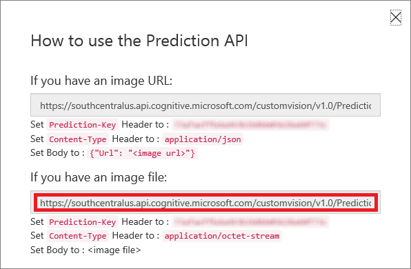

    _Copying the Prediction API URL_ 

1. Return to Visual Studio Code and open **predict.js** in the code editor. Replace "PREDICTION_ENDPOINT" on line 3 with the URL on the clipboard.

1. Return to the Custom Vision Service portal and copy the Prediction API key to the clipboard. 

	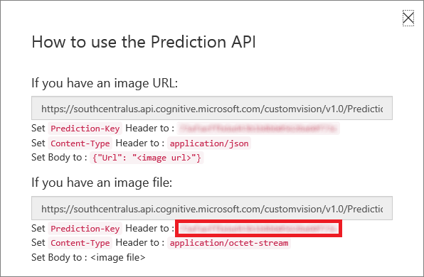

    _Copying the Prediction API key_ 

1. Return to Visual Studio Code and replace "PREDICTION_KEY" on line 4 of **predict.js** with the API key on the clipboard.

1. Scroll down in **predict.js** and examine the block of code that begins on line 29. This is the code that calls out to the Custom Vision Service using AJAX. Using the Custom Vision Prediction API is as simple as making an authenticated POST to a REST endpoint.

	```javascript
	$.ajax({
	    type: "POST",
	    url: url,
	    data: imageBytes,
	    processData: false,
	    headers: {
	        "Prediction-Key": predictionKey,
	        "Content-Type": "multipart/form-data"
	    }
	}).done(function (data) {
	    var predictions = data.predictions;
	    var artists = [predictions.find(o => o.tagName === 'Picasso'), predictions.find(o => o.tagName === 'Rembrandt'), predictions.find(o => o.tagName === 'Pollock')];
	    var sortedArtists = _.sortBy(artists, 'probability').reverse();
	    var possibleArtist = sortedArtists[0];
	
	    if (possibleArtist.probability > 0.9) {
	        $('#analysisResults').html('<div class="matchLabel">' + possibleArtist.tagName + ' (' + (possibleArtist.probability * 100).toFixed(0) + '%)' + '</div>');
	    }
	    else {
	        $('#analysisResults').html('<div class="noMatchLabel">Unknown artist</div>');
	    }
	
	}).fail(function (xhr, status, err) {
	    alert(err);
	});
	```

1. Return to the integrated terminal in Visual Studio Code and execute the following command to start the app:

	```
	npm start
	```

1. Confirm that the Artworks app starts and displays a window like this one:

	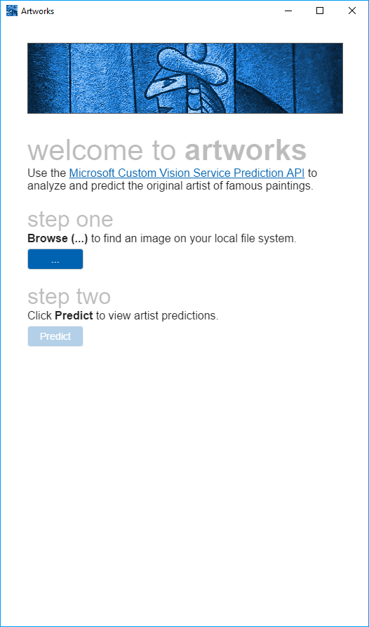

    _The Artworks app_ 

Artworks is a cross-platform app written with Node.js and [Electron](https://electron.atom.io/). As such, it is equally capable of running on Windows, macOS, and Linux. In the next exercise, you will use it to classify images by the artists who painted them.

<a name="Exercise6"></a>
## Exercise 6: Use the app to classify images ##

In this exercise, you will use the Artworks app to submit images to the Custom Vision Service for classification. The app uses the JSON information returned from calls to the Custom Vision Prediction API's [ClassifyImage](https://southcentralus.dev.cognitive.microsoft.com/docs/services/Custom_Vision_Prediction_3.0/operations/5c82db60bf6a2b11a8247c15) method to tell you whether an image represents a painting by Picasso, Rembrandt, Pollock, or none of the above. It also shows the probability that the classification assigned to the image is correct.

1. Click the **Upload Image** button in the Artworks app. Browse to the "Quick Tests" folder in the lab resources. Select the file named **PicassoTest_02.jpg**, and then click **Open**. Confirm that after a few seconds, a green bar appears under the image identifying it as a Picasso.

	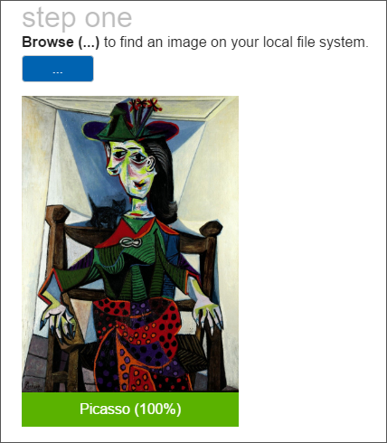

    _Classifying an image as a Picasso_ 

1. Repeat the previous step for **RembrandtTest_01.jpg** and **PollockTest_01.jpg** and confirm that the app can identify paintings by Rembrandt and Pollock.

1. Upload **FlowersTest.jpg** and confirm that the app does not identify this painting as one by Picasso, Rembrandt, or Pollock.

	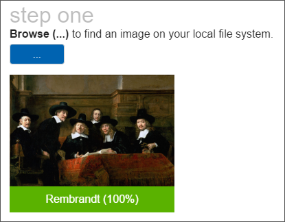

    _Testing a painting not produced by Picasso, Rembrandt, or Pollock_ 

1. As you can see, using the Prediction API from an app is just as reliable as through the Custom Vision Service portal, and way more fun! What's more, if you go to the Predictions page in the portal, you'll find that each of the images uploaded via the app is shown there as well.
 
	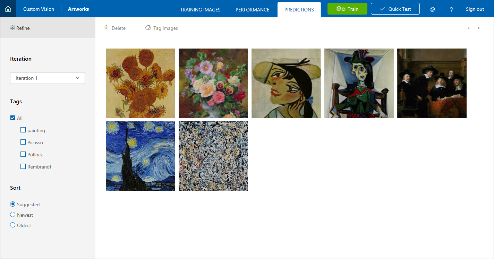

	_Images submitted to the Custom Vision Service_ 

Feel free to test with images of your own and gauge the model's adeptness at identifying artists or determining that an image is not a Picasso, Rembrandt, or Pollock. If you'd like to train it to recognize Van Goghs, too, simply upload some Van Gogh paintings, tag them with "Van Gogh," and retrain the model. There is no limit to the intelligence you can add if you're willing to do the training. And remember that in general, the more images you train with, the smarter the model will be.

<a name="Summary"></a>
## Summary ##

Image classification is playing an increasingly large role in industry as a means for automating such tasks as checking images uploaded to Web sites for offensive content and inspecting parts rolling off of assembly lines for defects. Building an image-classification model manually—that is, coding it from the ground up in Python, R, or another language—requires no small amount of expertise, but the Custom Vision Service enables virtually anyone to build sophisticated image-classification models. And once a model is built and trained, an app that uses it is only few lines of code away.

---

Copyright 2019 Microsoft Corporation. All rights reserved. Except where otherwise noted, these materials are licensed under the terms of the MIT License. You may use them according to the license as is most appropriate for your project. The terms of this license can be found at https://opensource.org/licenses/MIT.
