# Building Neural Networks with TensorFlow and the Azure Data Science Virtual Machine #

Data scientists use a variety of tools to ply their trade. One of the challenges they face is building an environment with the right software installed and configuring all the pieces to work in harmony. The Azure [Data Science Virtual Machine](https://docs.microsoft.com/azure/machine-learning/data-science-virtual-machine/overview) (DSVM) is a customized virtual-machine image hosted in Azure that is built specifically for data science workloads. It comes with a number of popular open-source tools preinstalled, and it runs on Windows Server as well as Linux. The Linux edition is available in both Ubuntu and CentOS versions.

With a DSVM providing the environment, you can get up and running quickly with popular tools such as [Jupyter](http://jupyter.org/), [R Studio](https://www.rstudio.com/), the [Microsoft Cognitive Toolkit](https://www.microsoft.com/en-us/cognitive-toolkit/), and many others. You can also build neural networks with [TensorFlow](https://www.tensorflow.org/), the open-source machine-learning framework from Google that specializes in [deep learning](https://en.wikipedia.org/wiki/Deep_learning) applications. For a complete list of tools installed in the DSVM, see [What's included in the Data Science VM](https://docs.microsoft.com/azure/machine-learning/data-science-virtual-machine/overview#whats-included-in-the-data-science-vm).

In this lab, you will create a Linux Data Science Virtual Machine in Azure, connect to it via remote desktop, and train a [deep neural network](https://en.wikipedia.org/wiki/Artificial_neural_network) built with TensorFlow to recognize images that contain hot dogs. Then you will write a Python app that tells you whether images input to it contain hot dogs — your own variation of the [NotHotDog app](https://www.youtube.com/watch?v=ACmydtFDTGs) made famous on the TV show [Silicon Valley](https://www.hbo.com/silicon-valley).

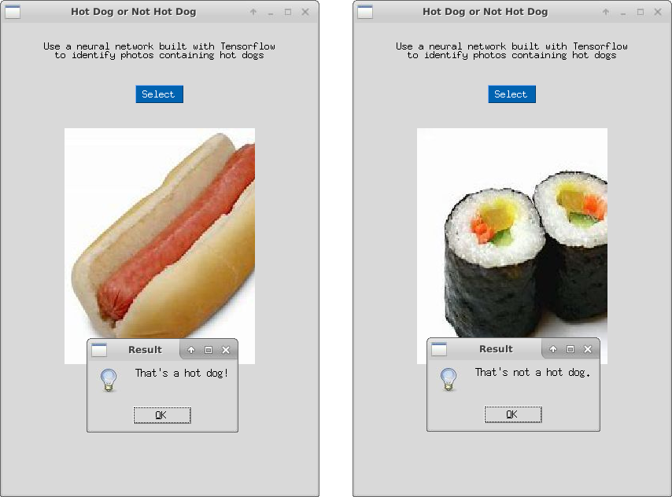

<a name="Objectives"></a>

### Objectives ###

In this hands-on lab, you will learn how to:

- Create a Linux Data Science Virtual Machine in Azure
- Connect to the DSVM via remote desktop
- Train a TensorFlow model to classify images as ones containing hot dogs and ones NOT containing hot dogs
- Use the model in a Python app

<a name="Prerequisites"></a>

### Prerequisites ###

The following are required to complete this hands-on lab:

- An active Microsoft Azure subscription. If you don't have one, [sign up for a free trial](http://aka.ms/WATK-FreeTrial).
- An [Xfce](https://xfce.org/) remote-desktop client such as [X2Go](https://wiki.x2go.org/doku.php/download:start)

<a name="Cost"></a>

### Cost ###


The cost of this lab series is **moderate**. For an overview of cost ratings, refer to [Explanation of Costs](../../../Costs.md).

<a name="Exercises"></a>

## Exercises ##

This hands-on lab includes the following exercises:

- [Exercise 1: Create an Ubuntu Data Science VM](#Exercise1)
- [Exercise 2: Connect to the Data Science VM](#Exercise2)
- [Exercise 3: Train a TensorFlow model](#Exercise3)
- [Exercise 4: Create a NotHotDog app](#Exercise4)
- [Exercise 5: Delete the Data Science VM](#Exercise4)

Estimated time to complete this lab: **45** minutes.

<a name="Exercise1"></a>
## Exercise 1: Create an Ubuntu Data Science VM ##

The Data Science Virtual Machine for Linux is a virtual-machine image that simplifies getting started with data science. Multiple tools are already built, installed, and configured in order to get you up and running quickly. The NVIDIA GPU driver, [NVIDIA CUDA](https://developer.nvidia.com/cuda-downloads), and [NVIDIA CUDA Deep Neural Network](https://developer.nvidia.com/cudnn) (cuDNN) library are also included, as are [Jupyter](http://jupyter.org/), several sample Jupyter notebooks, and [TensorFlow](https://www.tensorflow.org/). All pre-installed frameworks are GPU-enabled but work on CPUs as well. In this exercise, you will create an instance of the Data Science Virtual Machine for Linux on Azure.

1. Open the [Azure Portal](https://portal.azure.com) in your browser. If asked to log in, do so using your Microsoft account.

1. Click **+ Create a resource** in the menu on the left side of the portal, and then type "data science" into the search box. Select **Data Science Virtual Machine for Linux (Ubuntu)** from the results list.

    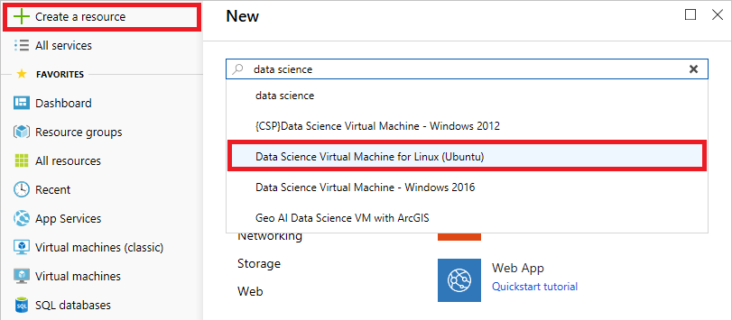

    _Finding the Ubuntu Data Science VM_

1. Take a moment to review the list of tools included in the VM. Then click **Create** at the bottom of the blade.

1. Click **Create new** and enter a name for a new resource group to hold the Data Science VM. Enter a name for the VM and select the region closest to you. Click **Change size** and select **DS1_v2** as the VM size. (The default VM size is abut four times more powerful, but also costs about four times more. DS1_v2 is sufficient for the purposes of this lab, and it minimizes the cost to your Azure subscription.) Change "Authentication type" to **Password** and enter a user name and password for logging into the VM. Then click **Review + create** at the bottom of the blade. 

    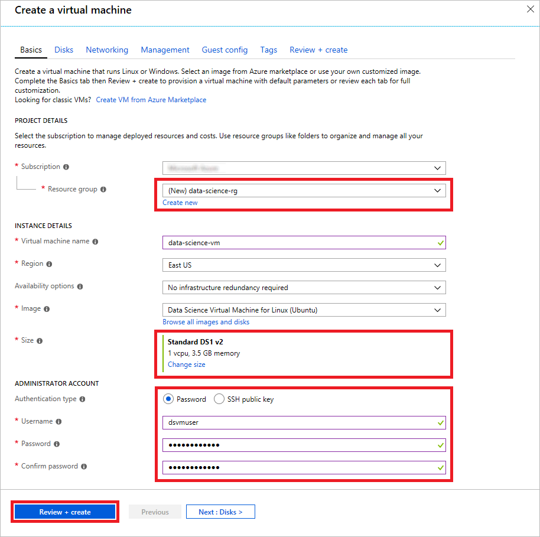

    _Creating a Data Science VM_

1. Review the settings presented to you, and click **Create** at the bottom of the blade to begin deploying the VM.

Wait until the deployment is complete. It typically takes 5 minutes or less. Observe that the resource group you created contains more than just a virtual machine. It also contains a virtual disk for the VM, a storage account to hold the virtual disk, a virtual IP address, a network security group (NSG) that defines rules for inbound and outbound connections, and more. Placing Azure resources such as these in a resource group has many benefits, including the fact that you can view costs for the resource group as a whole, use role-based access control (RBAC) to restrict access to the resource group's resources, and delete all of the resources in the resource group at once by deleting the resource group itself.

<a name="Exercise2"></a>
## Exercise 2: Connect to the Data Science VM ##

In this exercise, you will connect remotely to the Ubuntu desktop in the VM that you created in the previous exercise. To do so, you need a client that supports [Xfce](https://xfce.org/), which is a lightweight desktop environment for Linux. For background, and for an overview of the various ways you can connect to a DSVM, see [How to access the Data Science Virtual Machine for Linux
](https://docs.microsoft.com/en-us/azure/machine-learning/data-science-virtual-machine/dsvm-ubuntu-intro#how-to-access-the-data-science-virtual-machine-for-linux).

1. If you don't already have an Xfce client installed, download the [X2Go client](https://wiki.x2go.org/doku.php/download:start) and install it before continuing with this exercise. X2Go is a free and open-source Xfce solution that works on a variety of operating systems, including Windows and OS X. The instructions in this exercise assume you are using X2Go, but you may use any client that supports Xfce.

1. Return to the Azure Portal and click the Data Science VM.

	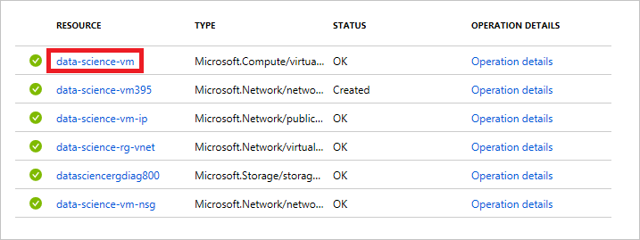

	_Opening the virtual machine_

1. Hover the cursor over the VM's public IP address and cick the **Copy** button that appears next to it to copy the IP address to the clipboard.

	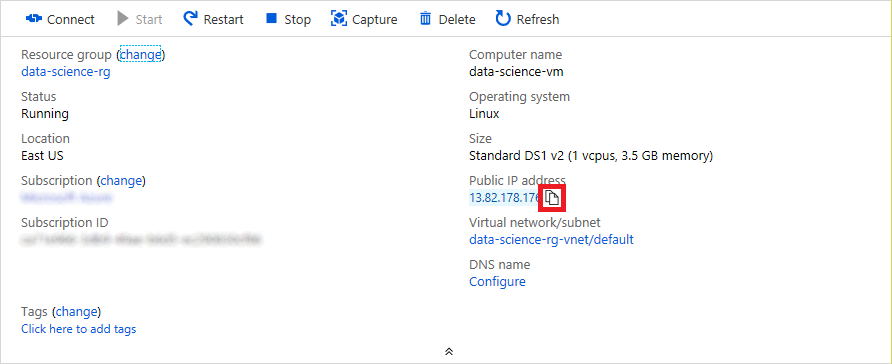

	_Copying the IP address_

1. Start the X2Go client and connect to the Data Science VM using the IP address on the clipboard and the user name you specified in the previous exercise. Connect via port **22** (the standard port used for SSH connections), and specify **XFCE** as the session type. Click the **OK** button to confirm your preferences.

    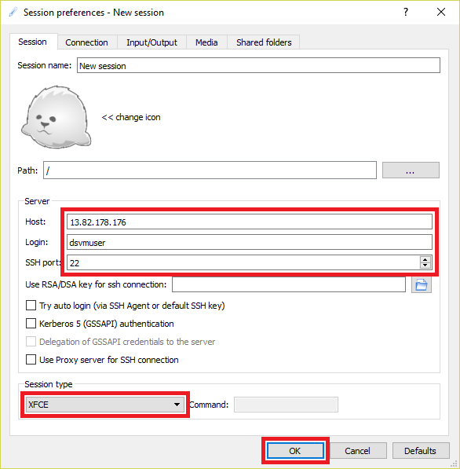

    _Connecting with X2Go_

1. In the "New session" panel on the right, select the resolution that you wish to use for the remote desktop. Then click **New session** at the top of the panel.

    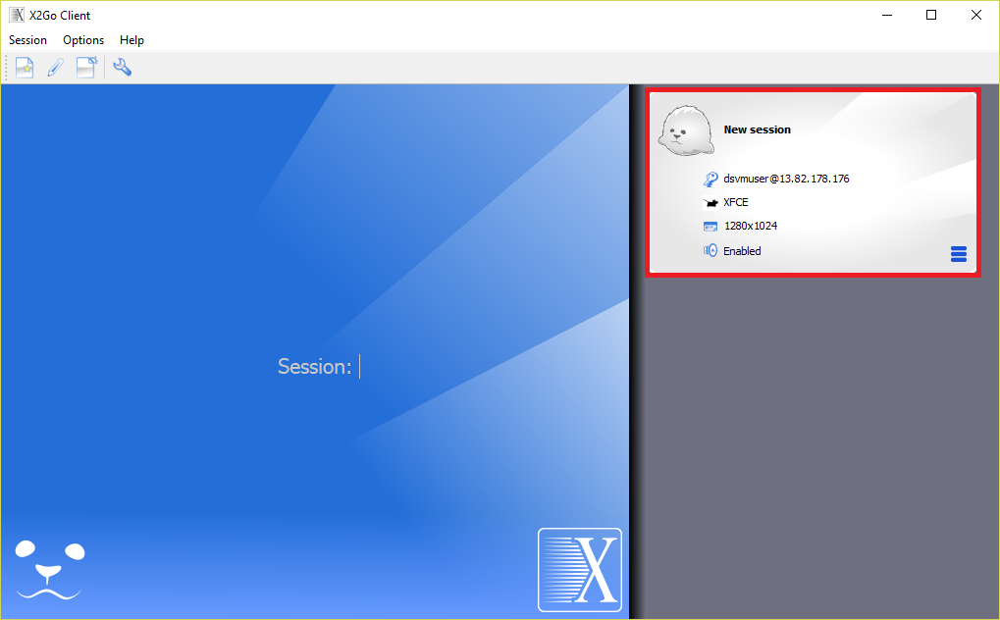

    _Starting a new session_

1. Enter the password you specified in [Exercise 1](#Exercise1), and then click the **OK** button. If asked if you trust the host key, answer **Yes**. Also ignore any error messages stating that the SSH daemon could not be started.

    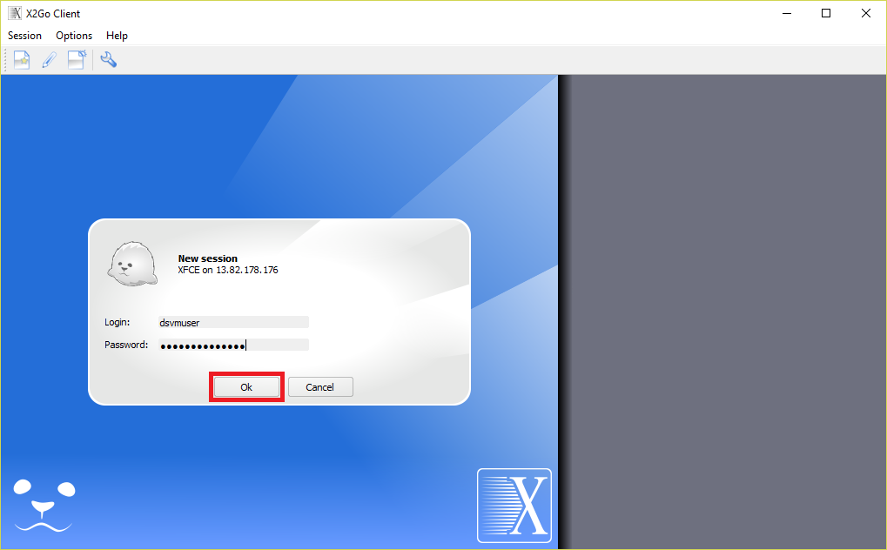

    _Logging into the VM_

1. Wait for the remote desktop to appear and confirm that it resembles the one below.

    > If the text and icons on the desktop are too large, terminate the session. Click the icon in the lower-right corner of the "New Session" panel and select **Session preferences...** from the menu. Go to the "Input/Output" tab in the "New session" dialog and adjust the display DPI, and then start a new session. Start with 96 DPI and adjust as needed.

    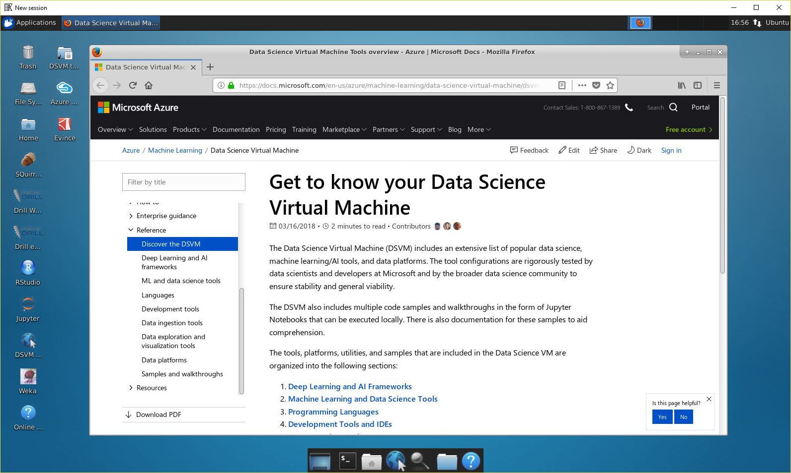

    _Connected!_

Now that you are connected, take a moment to explore the shortcuts on the desktop. These are shortcuts to the numerous data-science tools preinstalled in the VM, which include [Jupyter](http://jupyter.org/), [R Studio](https://www.rstudio.com/), and the [Microsoft Azure Storage Explorer](https://azure.microsoft.com/en-us/features/storage-explorer/), among others.

<a name="Exercise3"></a>
## Exercise 3: Train a TensorFlow model ##

In this exercise, you will train an image-classification model built with [TensorFlow](https://www.tensorflow.org/) to recognize images that contain hot dogs. Rather than create the model from scratch, which would require vast amounts of computing power and tens or hundreds of thousands of images, you will customize a preexisting model, a practice known as [transfer learning](https://en.wikipedia.org/wiki/Transfer_learning). Transfer learning allows you to achieve high levels of accuracy with as little as a few minutes of training time on a typical laptop or PC and as few as several dozen images.

In the context of deep learning, transfer learning involves starting with a deep neural network that is pretrained to perform image classification and adding a layer that customizes the network for your problem domain — for example, to classify images into two groups: those that contain hot dogs, and those that do not. More than 20 pretrained TensorFlow image-classification models are available at <https://github.com/tensorflow/models/tree/master/research/slim#pre-trained-models.> The [Inception](https://arxiv.org/abs/1512.00567) and [ResNet](https://towardsdatascience.com/an-overview-of-resnet-and-its-variants-5281e2f56035) models are characterized by higher accuracy and commensurately higher resource requirements, while the MobileNet models trade accuracy for compactness and power efficiency and were developed with mobile devices in mind. All of these models are well known in the deep-learning community and have been used in a number of competitions as well as in real-world applications. You will use one of the MobileNet models as the basis for your neural network in order to strike a reasonable balance between accuracy and training time.

Training the model involves little more than running a Python script that downloads the base model and adds a layer trained with domain-specific images and labels. The script you need is available on GitHub, and the images you will use were assembled from thousands of public-domain food images available from [Kaggle](https://www.kaggle.com).

1. In the Data Science VM, click the Terminal icon at the bottom of the screen to open a terminal window.

    

    _Launching a terminal window_

1. Execute the following command in the terminal window to navigate to the "notebooks" folder:

    ```bash
    cd notebooks
    ```
    This folder is prepopulated with sample Jupyter notebooks curated for the DSVM.

1. Now use the following command to clone the "TensorFlow for Poets" repository from GitHub:

    ```bash
    git clone https://github.com/googlecodelabs/tensorflow-for-poets-2
    ```
    > **Tip**: You can copy this line to the clipboard, and then use **Shift+Ins** to paste it into the terminal window.

    This repo contains scripts for creating transfer-learning models, invoking a trained model in order to classify an image, and more. It is part of [Google Codelabs](https://codelabs.developers.google.com/), which contains a variety of resources and hands-on labs for software developers interested in learning about TensorFlow and other Google tools and APIs.

1. Once cloning is complete, navigate to the folder containing the cloned model:

    ```bash
    cd tensorflow-for-poets-2
    ```

1. Use the following command to download the images that will be used to train the model:

    ```bash
    wget https://topcs.blob.core.windows.net/public/tensorflow-resources.zip -O temp.zip; unzip temp.zip -d tf_files; rm temp.zip
    ```

    This command downloads a zip file containing hundreds of food images — half containing hot dogs, and half that do not — and copies them into the subdirectory named "tf_files."

1. Click the File Manager icon at the bottom of the screen to open a File Manager window.

    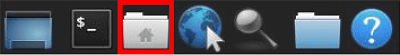

    _Launching File Manager_

1. In File Manager, navigate to the "notebooks/tensorflow-for-poets-2/tf_files" folder. Confirm that the folder contains a pair of subdirectories named "hot_dog" and "not_hot_dog." The former contains several hundred images containing hot dogs, while the latter contains an equal number of images that do **not** contain hot dogs. Browse the images in the "hot_dog" folder to get a feel for what they look like. Check out the images in the "not_hot_dog" folder as well.

    > In order to train a neural network to determine whether an image contains a hot dog, you will train it with images that contain hot dogs as well as images that do not contain hot dogs.

    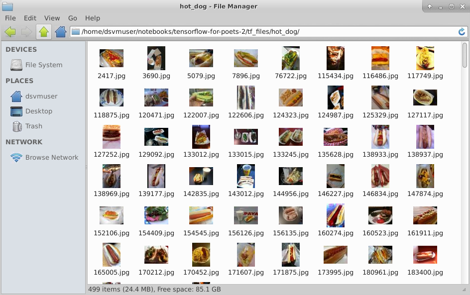

    *Images in the "hot_dog" folder*

    Also confirm that the folder contains a text file named **retrained_labels_hotdog.txt**. This file identifies the subdirectories containing the training images. It is used by the Python script that trains the model. The script enumerates the files in each subdirectory identifed in the text file (the text file's name is a parameter passed to the script) and uses those files to train the network.

1. Open a second terminal window and navigate to the "notebooks/tensorflow-for-poets-2" folder — the same one that is open in the first terminal window. Then use the following command to launch [TensorBoard](https://www.tensorflow.org/programmers_guide/summaries_and_tensorboard), which is a set of tools used to visualize TensorFlow models and gain insight into the transfer-learning process:

	```bash
	tensorboard --logdir tf_files/training_summaries
	```

     > This command will fail if there is already an instance of TensorBoard running. If you are notified that port 6006 is already in use, use a ```pkill -f "tensorboard"``` command to kill the existing process. Then execute the ```tensorboard``` command again.

1. Switch back to the original terminal window and execute the following commands:

    ```bash
    IMAGE_SIZE=224;
    ARCHITECTURE="mobilenet_0.50_${IMAGE_SIZE}";
    ```

    These commands initialize environment variables specifying the resolution of the training images and the base model that your neural network will build upon. Valid values for IMAGE_SIZE are 128, 160, 192, and 224. Higher values increase the training time, but also increase the accuracy of the classifier.

1. Now execute the following command to start the transfer-learning process — that is, to train the model with the images you downloaded:

    ```bash
    python scripts/retrain.py \
    --bottleneck_dir=tf_files/bottlenecks \
    --how_many_training_steps=500 \
    --model_dir=tf_files/models/ \
    --summaries_dir=tf_files/training_summaries/"${ARCHITECTURE}" \
    --output_graph=tf_files/retrained_graph_hotdog.pb \
    --output_labels=tf_files/retrained_labels_hotdog.txt \
    --architecture="${ARCHITECTURE}" \
    --image_dir=tf_files \
    --testing_percentage=15 \
    --validation_percentage=15
    ```

    **retrain.py** is one of the scripts in the repo that you downloaded. It is complex, comprising more than 1,000 lines of code and comments. Its job is to download the model specified with the ```--architecture``` switch and add to it a new layer trained with the images found in subdirectories of the directory specified with the ```--image_dir``` switch. Each image is labeled with the name of the subdirectory in which it is located — in this case, either "hot_dog" or "not_hot_dog" — enabling the modified neural network to classify images input to it as hot-dog images ("hot_dog") or not-hot-dog images ("not_hot_dog"). The output from the training session is a TensorFlow model file named **retrained_graph_hotdog.pb**. The name and location are specified in the ```--output_graph``` switch.

1. Wait for training to complete; it should take less than 5 minutes. Then check the output to determine the accuracy of the model. Your result may vary slightly from the one below because the training process involves a small amount of random estimation.

	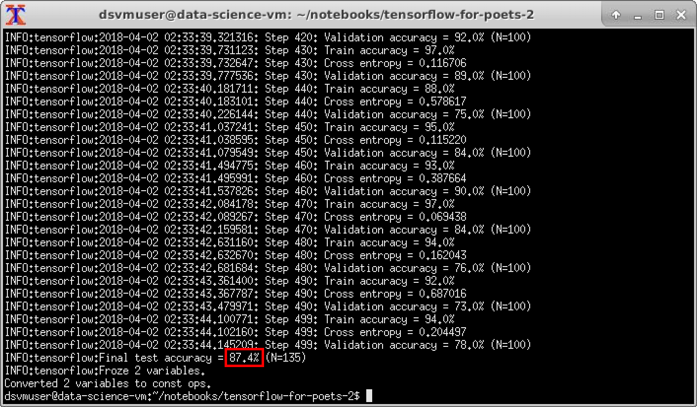
	
	_Gauging the model's accuracy_

1. Click the browser icon at the bottom of the desktop to open the browser installed in the Data Science VM. Then navigate to <http://0.0.0.0:6006> to connect to Tensorboard.

    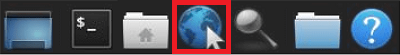

    _Launching Firefox_

1. Inspect the graph labeled "accuracy_1." The blue line depicts the accuracy achieved over time as the 500 training steps specified with the ```how_many_training_steps``` switch are executed. This metric is important, because it shows how the accuracy of the model evolves as training progresses. Equally important is the distance between the blue and orange lines, which quantifies the amount of overfitting that occurred and should always be minimized. [Overfitting](https://en.wikipedia.org/wiki/Overfitting) means the model is adept at classifying the images it was trained with, but not as adept at classifying other images presented to it. The results here are acceptable, because there is a difference of less than 10% between the orange line (the "training" accuracy achieved with the training images) and the blue line (the "validation" accuracy achieved when tested with images outside the training set).

    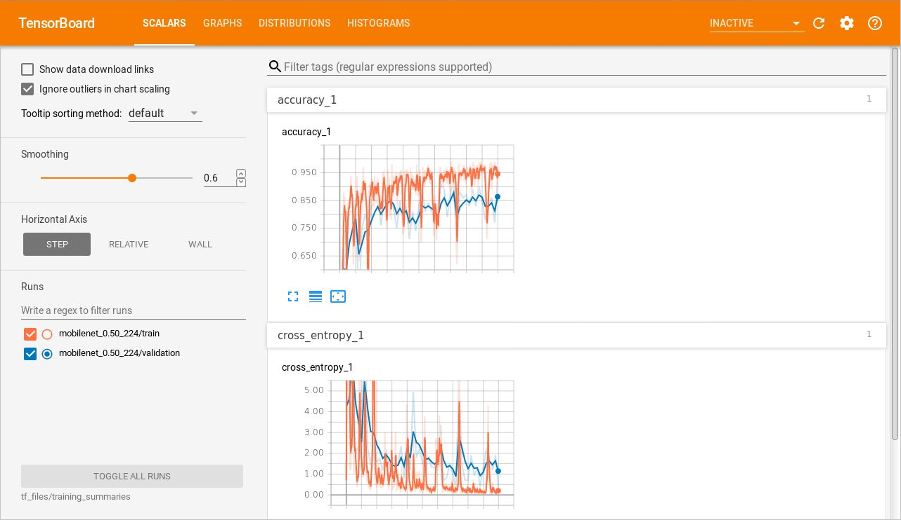

    _The TensorBoard Scalars display_

1. Click **GRAPHS** in the TensorBoard menu and inspect the graph shown there. The primary purpose of this graph is to depict the neural network and the layers that comprise it. In this example, "input_1" is the layer that was trained with food images and added to the network. "MobilenetV1" is the base neural network that you started with. It contains many layers which aren't shown. Had you built a deep neural network from scratch, all of the layers would have been diagrammed here. (If you would like to see the layers that comprise the MobileNet, double-click the "MobilenetV1" block in the diagram.) For more information on the Graphs display and the information surfaced there, refer to [TensorBoard: Graph Visualization](https://www.tensorflow.org/programmers_guide/graph_viz).

    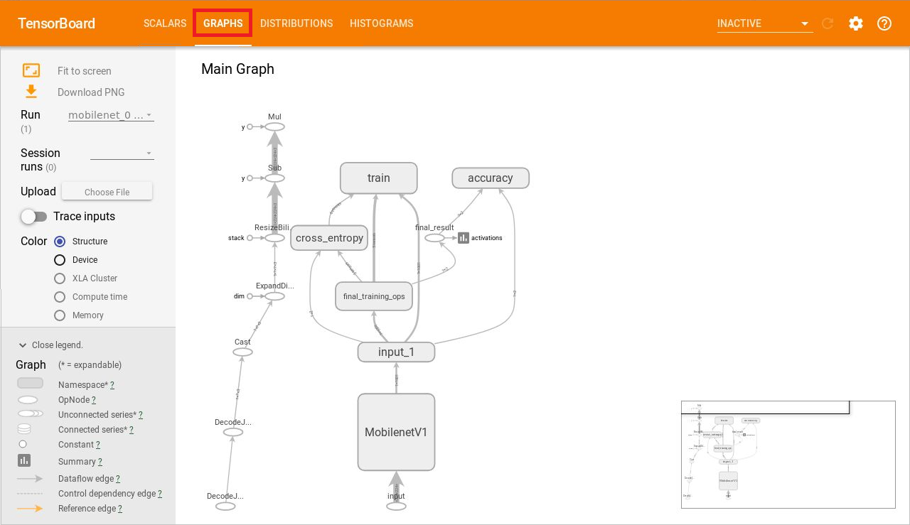

    _The TensorBoard Graphs display_

1. Switch back to File Manager and navigate to the "notebooks/tensorflow-for-poets-2/tf_files" folder. Confirm that it contains a file named **retrained_graph_hotdog.pb**. *This file was created during the training process and contains the trained TensorFlow model*. You will use it in the next exercise to invoke the model from the NotHotDog app.

The script that you executed in Step 10 specified 500 training steps, which strikes a balance between accuracy and the time required for training. If you would like, try training the model again with a higher ```how_many_training_steps``` value such as 1000 or 2000. A higher step count generally results in higher accuracy, but at the expense of increased training time. Watch out for overfitting, which, as a reminder, is represented by the difference between the orange and blue lines in TensorBoard's Scalars display.

<a name="Exercise4"></a>
## Exercise 4: Create a NotHotDog app ##

In this exercise, you will use [Visual Studio Code](https://code.visualstudio.com/), Microsoft's free, cross-platform source-code editor which is preinstalled in the Data Science VM, to write a NotHotDog app in Python. The app will use [Tkinter](https://wiki.python.org/moin/TkInter), which is a popular GUI framework for Python, to implement its user interface, and it will allow you to select images from your local file system. Then it will pass those images to the model you trained in the previous exercise and tell you whether they contain a hot dog.

1. Click **Applications** in the upper-left corner of the desktop and select **Accessories > Visual Studio Code** to start Visual Studio Code. Use Visual Studio Code's **File > Open Folder...** command to open the "notebooks/tensorflow-for-poets-2/tf_files" folder containing the **retrained_graph_hotdog.pb** file created when you trained the model.

1. Create a new file named **classify.py** in the current folder. If Visual Studio Code offers to install the Python extension, click **Install** to install it. Copy the code below to the clipboard and use **Shift+Ins** to paste it into **classify.py**. Then save the file:

	```python
	import tkinter as tk
	from tkinter import messagebox, filedialog, font
	from PIL import ImageTk, Image
	import subprocess
	import re
	
	def select_image_click(img_label):
	    try:
	        file = filedialog.askopenfilename()
	
	        img = Image.open(file)
	        img = img.resize((300, 300))
	        selected_img = ImageTk.PhotoImage(img)
	
	        img_label.configure(image=selected_img, width=240)
	
	        output = subprocess.check_output(["python",
	            "../scripts/label_image.py",
	            "--graph=retrained_graph_hotdog.pb",
	            "--image={0}".format(file),
	            "--labels=retrained_labels_hotdog.txt"])
	
	        highest = str(output).split("\\n")[3].split(" ")
	
	        if len(highest) == 3:
	            index = re.search("\d", highest[2]).start()
	            score = float(highest[2][index:-1])
	            is_hotdog = True
	        else:
	            index = re.search("\d", highest[3]).start()
	            score = float(highest[3][index:-1])
	            is_hotdog = False	

	        if score > 0.90:
	            if is_hotdog:
	                messagebox.showinfo("Result", "That's a hot dog!")
	            else:
	                messagebox.showinfo("Result", "That's not a hot dog.")
	        else:
	            messagebox.showinfo("Result", "Can't tell.")
	
	    except FileNotFoundError as e:
	        messagebox.showerror("File not found", "File {0} was not found.".format(e.filename))
	
	def run():
	    window = tk.Tk()
	
	    window.title("Hotdog or Not Hotdog")
	    window.geometry('400x600')
	
	    text_font = font.Font(size=18, family="Helvetica Neue")
	    welcome_text = tk.Label(window, text="Hot Dog or Not Hot Dog", font=text_font)
	    welcome_text.pack()
	
	    instructions_text = tk.Label(window, text="\n\nUse a neural network built with Tensorflow\n"
	        "to identify photos containing hot dogs")
	    instructions_text.pack(fill=tk.X)
	
	    select_btn = tk.Button(window, text="Select", bg="#0063B1", fg="white", width=5, height=1)
	    select_btn.pack(pady=30)
	
	    image_label = tk.Label(window)
	    image_label.pack()
	
	    select_btn.configure(command=lambda: select_image_click(image_label))
	    window.mainloop()
	
	if __name__ == "__main__":
	    run()
	```

    They key code here is the call to ```subprocess.check_output```, which invokes the trained model by executing a Python script named **label_image.py** found in the "scripts" folder, passing in the image that the user selected. This script came from the repo that you cloned in the previous exercise.

1. Use your favorite search engine to find a few food images — some containing hot dogs, and some not. Download these images and store them in the location of your choice in the VM's file system.

1. Use Visual Studio Code's **View > Terminal** command to open an integrated terminal. Then execute the following command in the integrated terminal to run the app:

	```bash
	python classify.py
	```

1. Click the app's **Select** button and pick one of the hot-dog images you downloaded in Step 3. Wait for a message box to appear, indicating whether the image contains a hot dog. Did the model get it correct?

	> If you see error messages regarding a missing kernel driver in the terminal window when you process an image, you can safely ignore them. They result from the fact that the Data Science VM does not contain a virtual GPU.

    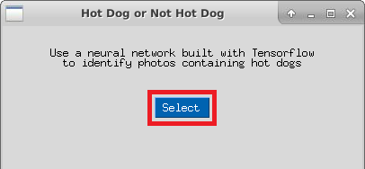

    _Selecting an image_

1. Repeat the previous step using an image that doesn't contain a hot dog. Was the model right this time?

Continue feeding food images into the app until you're satisfied that it can identify images containing hot dogs. Don't expect it to be right 100% of the time, but do expect it to be right *most* of the time.

<a name="Exercise5"></a>
## Exercise 5: Delete the Data Science VM ##

In this exercise, you will delete the resource group created in [Exercise 1](#Exercise1) when you created the Data Science VM. Deleting the resource group deletes everything in it and prevents any further charges from being incurred for it. Resource groups that are deleted can't be recovered, so be certain you're finished using it before deleting it. However, it is **important not to leave this resource group deployed any longer than necessary** because a Data Science VM is moderately expensive.

1. Click **Resource groups** in the menu on the left side of the portal to show a list of resource groups. Then click the resource group that you created in [Exercise 1](#Exercise1).

    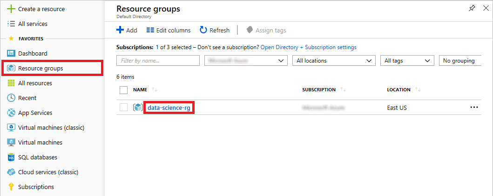

    _Opening the resource group_

1. Click **Delete resource group** at the top of the blade.

    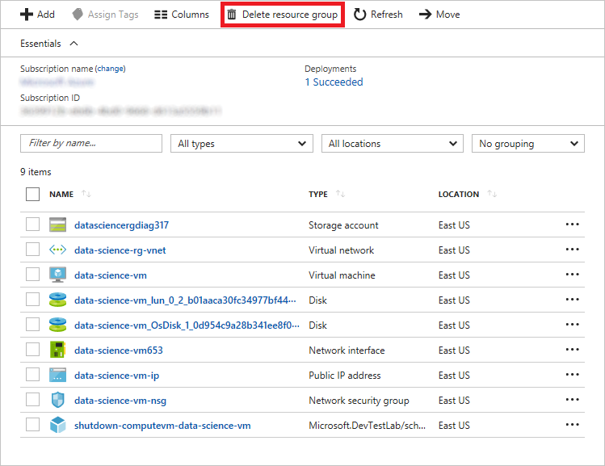

    _Deleting the resource group_

1. For safety, you are required to type in the resource group's name. (Once deleted, a resource group cannot be recovered.) Type the name of the resource group. Then click the **Delete** button to remove all traces of this lab from your Azure subscription.

After a few minutes, the resource group and all of its resources will be deleted. Billing stops when you click **Delete**, so you're not charged for the time required to delete the resources. Similarly, billing doesn't start until the resources are fully and successfully deployed.

<a name="Summary"></a>
## Summary ##

The steps in this lab may be generalized to perform other types of image-classification tasks. For example, you could train the same TensorFlow model to recognize cat images or identify defective parts parts produced on an assembly line. Image classification is one of the most prevalent uses of machine learning today, and its usefulness will only increase over time. Now that you have a basis to work from, try creating some image-classification models of your own. You never know what might come of it!

---

Copyright 2018 Microsoft Corporation. All rights reserved. Except where otherwise noted, these materials are licensed under the terms of the MIT License. You may use them according to the license as is most appropriate for your project. The terms of this license can be found at <https://opensource.org/licenses/MIT.>
