<a name="HOLTitle"></a>
# Using Video Indexer to Extract Video Insights #

[Azure Cognitive Services](https://azure.microsoft.com/services/cognitive-services/) is a suite of services and APIs backed by machine learning that enables developers to incorporate intelligent features such as facial recognition in photos and videos, sentiment analysis in text, and language understanding into their applications. [Video Indexer](https://azure.microsoft.com/services/cognitive-services/video-indexer/) is one of the newest members of the Cognitive Services family. Its purpose is to transform raw video content into content that is searchable, discoverable, and more engaging to the user. Want to generate a video transcript, index words spoken in the video or written on a whiteboard, or create a list of keywords from topics discussed in the video? Video Indexer can do all this and more. It can even find individuals in the video, and sometimes tell who they are.

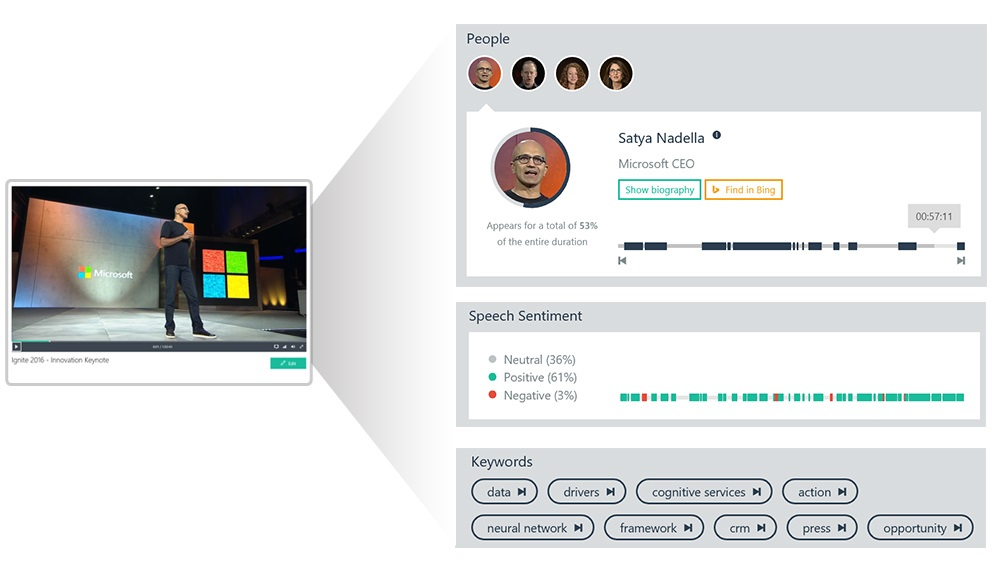

Video Indexer is both a service and an API. The service is accessed through a Web portal. It allows you to upload videos and examine the information generated from them. The [Video Indexer API](https://api-portal.videoindexer.ai/docs/services/) is a REST API that does everything the portal does, and also allows you to access the information that is generated when videos are indexed.

In this lab, you will learn how to use Video Indexer to analyze videos and extract actionable information and insights. Then you will build an app named Video Explorer that uses the Video Indexer API to make content in the videos that you indexed searchable.

<a name="Objectives"></a>
### Objectives ###

In this hands-on lab, you will learn how to:
 
- Submit videos to Video Indexer for indexing
- View and edit the information that is generated
- Translate video transcriptions into other languages
- Use the Video Indexer API in a Node.js app

<a name="Prerequisites"></a>
### Prerequisites ###

The following are required to complete this hands-on lab:

- An active Microsoft personal account. If you don't have one, [sign up for free](https://account.microsoft.com/account).
- [Visual Studio Code](http://code.visualstudio.com)
- [Node.js](https://nodejs.org)

<a name="Cost"></a>
### Cost ###


There is no cost associated with this lab because it doesn't require an Azure subscription. For an overview of cost ratings, refer to [Explanation of Costs](../../Costs.md).

<a name="Exercises"></a>
## Exercises ##

This hands-on lab includes the following exercises:

- [Exercise 1: Index a collection of videos](#Exercise1)
- [Exercise 2: Explore an indexed video in the portal](#Exercise2)
- [Exercise 3: Create a Video Indexer API subscription](#Exercise3)
- [Exercise 4: Build an app that uses Video Indexer](#Exercise4)

Estimated time to complete this lab: **30 to 40** minutes.

<a name="Exercise1"></a>
## Exercise 1: Index a collection of videos ##

In this exercise, you will use the Video Indexer portal to index three short educational videos created by Microsoft. You can upload videos from your local file system, or provide video URLs. The videos you will index are publicly available MP4s that have been loaded into Azure blob storage, so you will upload them by URL.

1. Open the [Video Indexer portal](https://www.videoindexer.ai/) in your browser and click **Get Started**. Then click **Sign in with a Live or Outlook account** and sign in using your Microsoft account. Answer **Yes** if prompted to let this app access your info.

	> You can also sign in using your Facebook account or other account types, but for these exercises, you should sign in with your Microsoft account. 

    

    _Getting started with Video Indexer_

1. Click the **Upload** button. Then click **enter a file url** to upload a video from a URL.

    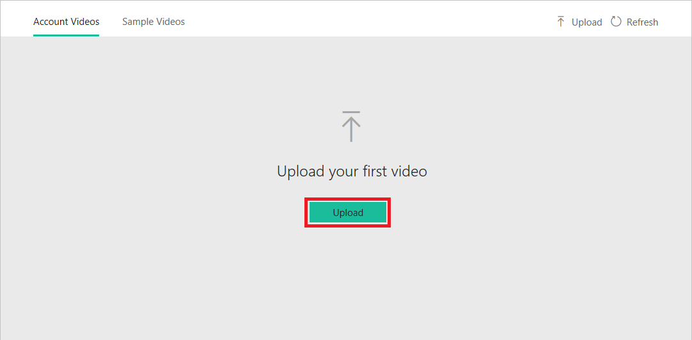

    _Uploading a video_

1. Paste the following URL into the URL field, and enter "Overview of the Microsoft AI School" as the video name. Then click **Upload** to begin the upload.

	```
	https://topcs.blob.core.windows.net/public/Overview-of-the-Microsoft-AI-School_high.mp4
	```

    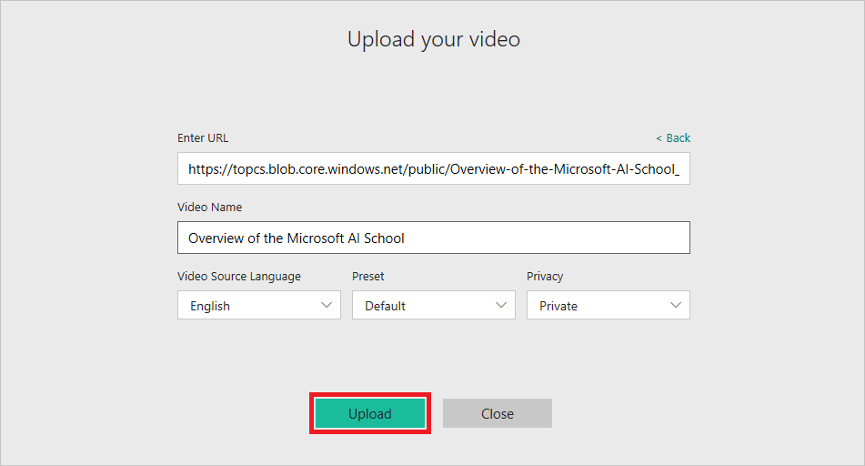

    _Starting the upload_

1. Wait for the upload to complete and indexing to begin. The indexing process typically requires 5 to 10 minutes. While waiting for the video to be indexed, upload a second video, entering "Microsoft in Education" as the video name:

	```
	https://topcs.blob.core.windows.net/public/Microsoft-in-Education_mid.mp4
	```

1. Once the upload of the second video has completed, upload a third video and name it "Machine Learning in IoT Solutions":

	```
	https://topcs.blob.core.windows.net/public/Machine-Learning-in-IoT-solutions_high.mp4
	```

When indexing is complete, you will receive an e-mail notification for each video with a link to the video and a short description of what was found in it, such as people, topics, and keywords. Wait for all three videos to finish indexing, and then proceed to the next exercise.

<a name="Exercise2"></a>
## Exercise 2: Explore an indexed video in the portal ##

In Video Indexer, insights are aggregated views of the knowledge extracted from a video, such as faces, keywords, and sentiment. For example, you can see the faces of people appearing in the video, as well as time ranges and percentages for each face shown. Video Indexer cross-references the faces that it finds against a database of thousands of famous people and automatically identifies them. You can see for yourself by opening the "Microsoft in Education" video in the portal. Microsoft CEO Satya Nadella appears in that video, and Video Indexer recognizes him.

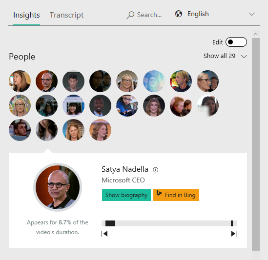

_A famous person who appears in "Microsoft in Education"_

Video Indexer automatically generates video transcripts based on its built-in speech and speaker recognition services. It even provides facilities for editing the information that it generated so you can correct errors in transcripts, put names to faces that weren't recognized, and more. In this exercise, you will examine and edit the information generated for one of the videos indexed in the previous exercise.

1. Click **Play** to play the "Overview of the Microsoft AI School" video.

	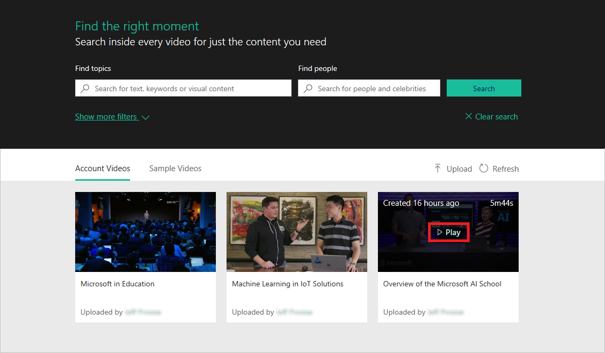
	
	_Playing a video_

1. Take a moment to explore the information that Video Indexer generated from the video. The "Insights" tab shows people featured in the video, keywords generated from the video, topics identified in the video, brands featured in the video, and even emotions found in the video. You can click **Play next** for any of these items and cycle through the corresponding points in the video.

	In this example, Video indexer found two people in the video. It was unable to identify them because they don't appear in its database of famous people. However, you can lend a helping hand by identifying them yourself. Enable editing by clicking the **Edit** icon in the upper-right corner. Then click the pencil icon next to "Unknown #1" and enter "Sonya Koptyev" as the person's name. Finish up by pressing **Enter** to save the change.

	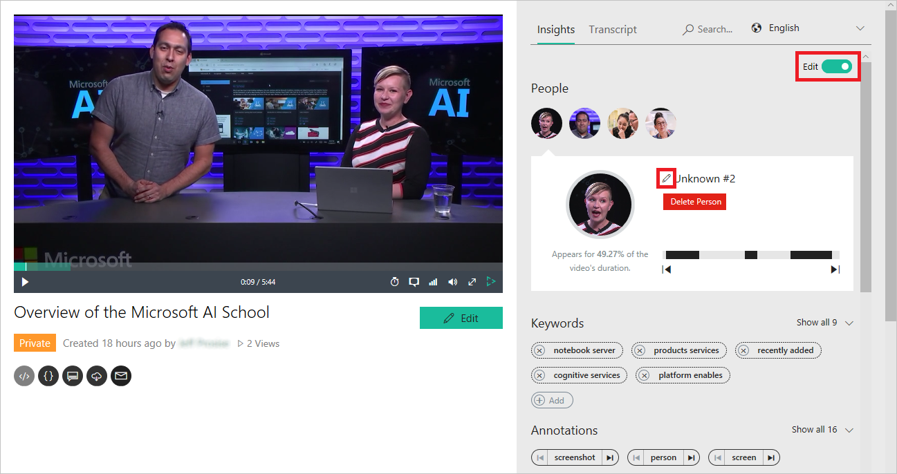

	_Editing a person's name_ 

1. Repeat this step for the "Unknown #2" in the video. This person's name is "Seth Juarez".

1. Want to see a full transcript of the video? Click **Timeline** at the top of the page. Video Indexer uses a deep neural network (DNN) to aid in converting speech to text, but such conversions are rarely perfect. Here, too, you can help out by editing words and phrases that weren't converted properly. To demonstrate, make sure you're still in editing mode and change "High Amsonia captive." to "Hi, I'm Sonya Koptyev."

	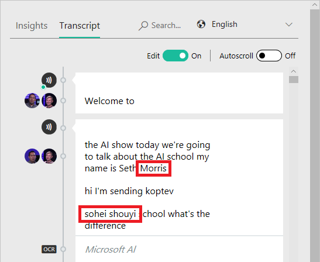

	_Editing a transcript_

1. Scroll through the transcript looking for other words and phrases that weren't transcribed correctly and take a moment to fix them.

	> Tip: When you select a block of text in the timeline with edit mode off, the video will jump to that point in the video so you can listen to what was said.

1. Once a video is indexed, you can search its contents. Type "suggestion" into the search box at the top of the page and press **Enter.** Confirm that the search results include four instances in which the word "suggestion" was found in the video.

	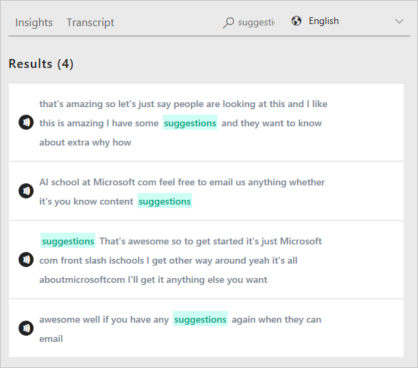

	_Search results containing timeline content_

1. Click **Insights**, and then search for the word "intelligence." This time, the results are conceptual topics that include the search term.

	

	_Search results containing topic content_

1. Video Indexer has the ability to translate transcripts into a variety of languages, including German, Dutch, Spanish, French, Czech, Korean, and Japanese. To demonstrate, click **Timeline** again, click the world icon, and select a language other than English from the drop-down list.

	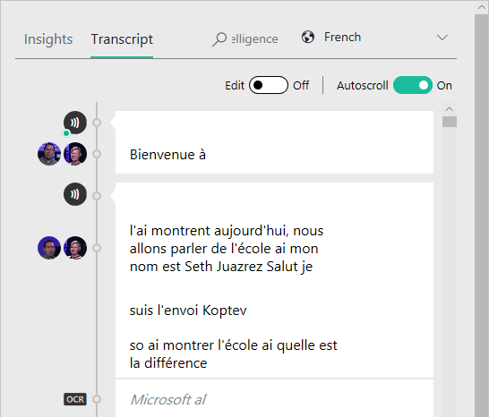

	_Video transcript translated into French_

Video Indexer provides a wealth of information regarding each video that it indexes, and this information is available not only in the portal, but through the Video Indexer API.

<a name="Exercise3"></a>
## Exercise 3: Create a Video Indexer API subscription ##

The Video Indexer portal provides a window into the videos that you index and lets you see the information extracted from them. But the real power of Video Indexer lies in the [Video Indexer API](https://docs.microsoft.com/en-us/azure/cognitive-services/video-indexer/video-indexer-use-apis), which lets you submit videos for indexing programmatically and access the results using a REST API. In [Exercise 4](#Exercise4), you will build an app that uses this API to expose content in the videos you indexed in [Exercise 1](#Exercise1). But to call the API, you must first subscribe to it and obtain an API key that is transmitted in each request. In this exercise, you will create a Video Indexer API subscription and retrieve the API key created for it.

1. Open the [Video Indexer API portal](https://api-portal.videoindexer.ai/) in your browser and click **SIGN IN** in the top-right corner. Sign in with your Microsoft account — the same one you used to sign in to the Video Indexer portal. Answer **Yes** if prompted to let this app access your info.

1. Click **Products**, and then click **Authorization**. 

	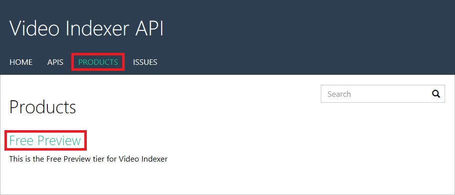

    _Signing up for the Authorization APIs_

1. Click the **Subscribe** button. Click **Show** to the right of "Primary key". Copy the API key to the clipboard, and then click **Hide** to hide it again. 

	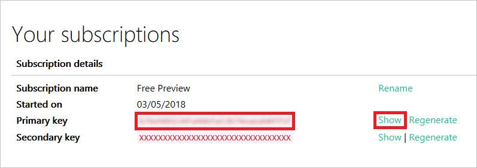

    _Copying the API key to the clipboard_

Now that you have an API key, you can write apps that call the Video Indexer API. The API key travels in an HTTP header in each request. Without a valid API key, the Video Indexer API fails requests placed to it. It is the API's way of ensuring that the caller is authorized.

<a name="Exercise4"></a>
## Exercise 4: Build an app that uses Video Indexer ##

[Visual Studio Code](http://code.visualstudio.com) is a free, lightweight, and powerful source-code editor available for Windows, macOS, and Linux. It supports a variety of popular programming languages including JavaScript, and it features built-in support for Git. In this exercise, you will use Visual Studio Code to run an app named Video Explorer that surfaces content from the videos you indexed in [Exercise 1](#Exercise1). Because the app is written with [Node.js](https://nodejs.org/) and [Electron](https://electronjs.org/), it, too, can run on Windows, macOS, and Linux. The source code is provided for you. All you have to do is insert the API key that you retrieved in the previous exercise.

1. If Node.js isn't installed on your PC, go to https://nodejs.org/ and install the latest LTS version. You can determine whether Node is installed by opening a Command Prompt or terminal window and typing the following command:

	```
	node --version
	```

	If Node is installed, the version number will be displayed.

1. If Visual Studio Code isn't installed on your PC, go to https://code.visualstudio.com/ and install it now.

1. Create a folder named "Video Explorer" on your hard disk. Then download the [zip file containing Video Explorer's source code](https://topcs.blob.core.windows.net/public/video-explorer.zip) and copy its contents into the "Video Explorer" folder.

1. Start Visual Studio Code and use the **File** > **Open Folder...** command to open the "Video Explorer" folder.

1. Select **Terminal** from Visual Studio Code's **View** menu to open an integrated terminal. Then execute the following command in the integrated terminal to install [Electron](https://electronjs.org/) and other packages that the app requires:

	```
	npm install
	```

1. Use the EXPLORER panel in Visual Studio code to open the file named **search.js**. Replace SUBSCRIPTION_KEY on line 2 with the API key you retrieved in the previous exercise.

	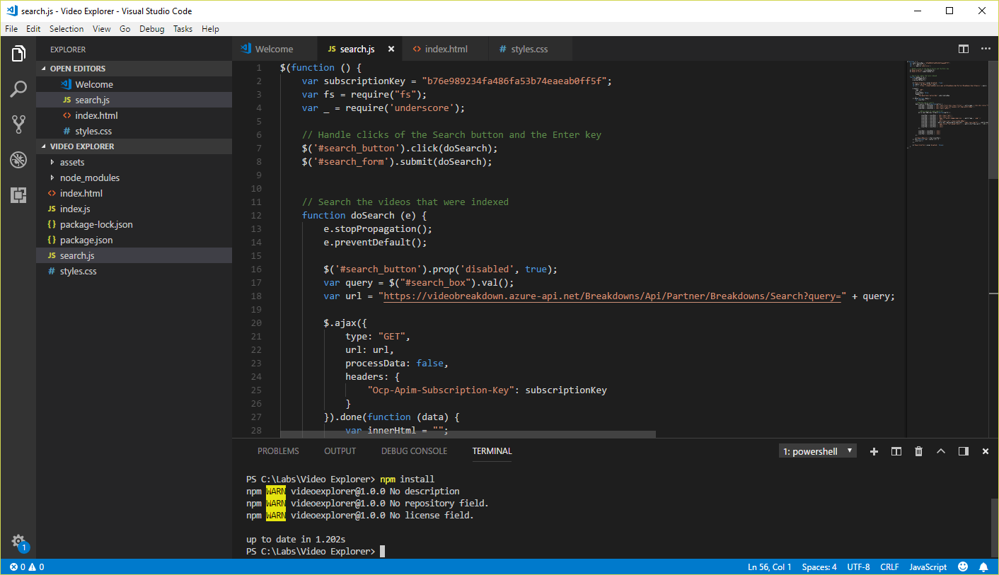

	_Adding the subscription key_

1. Return to the [Video Indexer API portal](https://www.videoindexer.ai/), click the profile icon in the upper-right corner, and select **Settings** from the menu. Ensure that the "Account" tab is selected. Then click **Copy** to copy your account ID to the clipboard.

	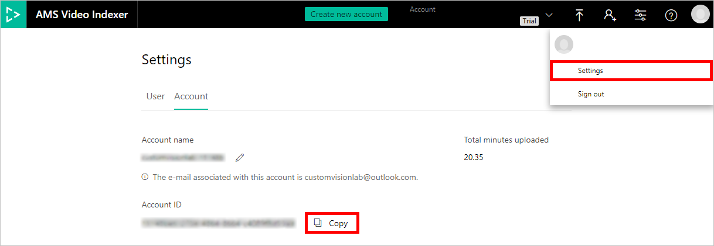

	_Copying the Video Indexer account ID_

1. Return to Visual Studio Code and replace ACCOUNT_ID on line 3 with the account ID retrieved in the previous step.

	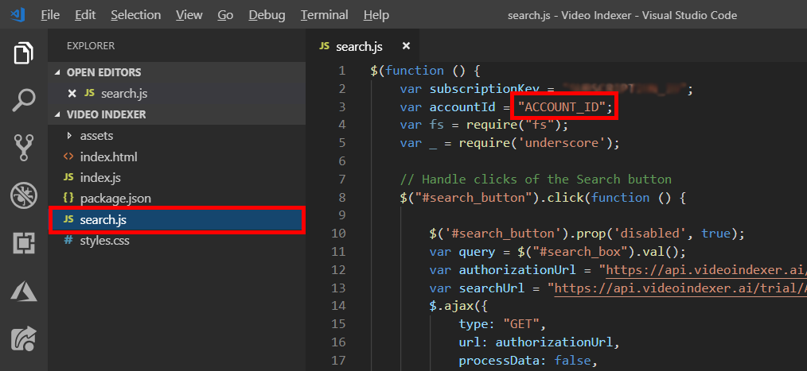

	_Adding the account ID_

1. Execute the following command in Visual Studio Code's integrated terminal to start the app:

	```
	npm start
	```
1. Once Video Explorer starts, type "technology" into the search box and click **search**. Confirm that two video thumbnails appear in the Video Explorer window, along with details indicating each time the word "technology" appeared, the context in which it appeared, and whether it was spoken or written.

	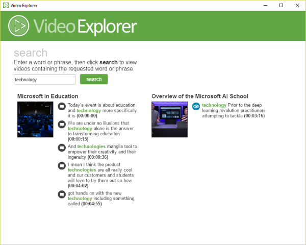

    _Video Explorer in action_ 

Try other search terms such as "AI," "awesome," and "Microsoft." The results will show at most three videos since that's all you indexed, but feel free to upload additional videos and use Video Explorer to search them as well.

<a name="Summary"></a>
## Summary ##

The [Video Indexer API](https://api-portal.videoindexer.ai/docs/services/) is a rich one that includes methods for uploading videos for indexing, searching indexed videos, retrieving and modifying transcripts, monitoring the processing state as a video is being indexed, and more. One of the more powerful methods is [Get Video Index](https://api-portal.videoindexer.ai/docs/services/operations/operations/Get-Video-Index?), which returns the indexed content of a video containing the same kind of detailed information found in the Video Indexer portal after a video is indexed.

Video Explorer uses the [Search Videos](https://api-portal.videoindexer.ai/docs/services/operations/operations/Search-videos?) method, which is just one of more than 30 methods featured in the Video Indexer API. You could leverage additional APIs to make Video Explorer richer and more interactive. For example, you could allow users to search for people that appear in a video, or search specifically for text that is extracted via OCR. You could even use the [Get Video Player Widget URL](https://api-portal.videoindexer.ai/docs/services/operations/operations/Get-Video-Player-Widget?) method to embed a video player in the app. Feel free to use these APIs to expand Video Explorer and customize it to fit your needs, and learn more about Video Indexer in the process.

---

Copyright 2019 Microsoft Corporation. All rights reserved. Except where otherwise noted, these materials are licensed under the terms of the MIT License. You may use them according to the license as is most appropriate for your project. The terms of this license can be found at https://opensource.org/licenses/MIT.