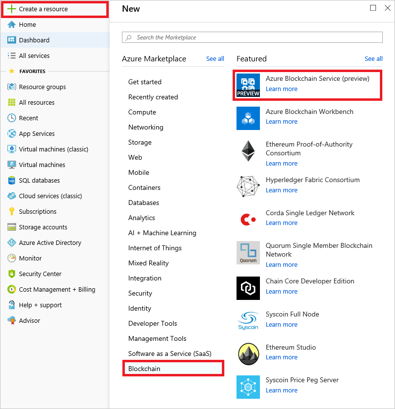
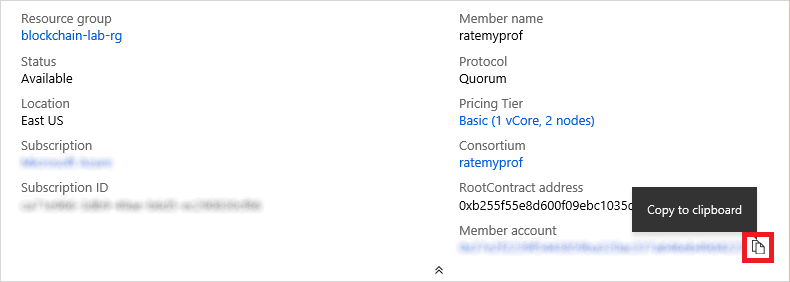
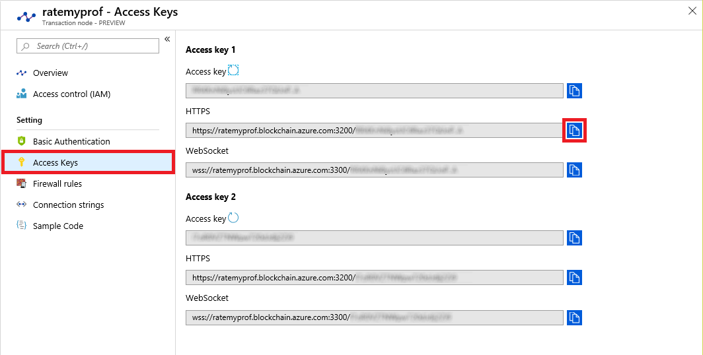
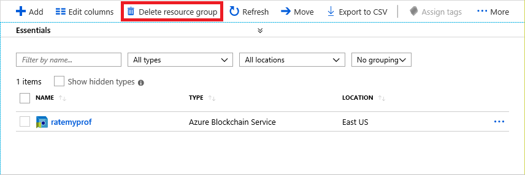

<a name="HOLTitle"></a>

# Build a Tamper-Proof Ratings System with Azure Blockchain Service #

[Blockchain](https://en.wikipedia.org/wiki/Blockchain) is one of the world's most talked-about technologies, and one that has the potential to fundamentally change the way we use the Internet. Originally designed for [Bitcoin](https://en.wikipedia.org/wiki/Bitcoin), Blockchain remains the technology behind that digital currency but is not limited to applications involving virtual money. In the words of Dan Tapscott, author, TED speaker, and Executive Director of the [Blockchain Research Institute](https://www.blockchainresearchinstitute.org/), "Blockchain is an incorruptible digital ledger of economic transactions that can be programmed to record not just financial transactions, but virtually everything of value." One of the more inventive uses for Blockchain is to implement tamper-proof digital voting systems, a concept that is being actively explored [in the U.S. and abroad](https://venturebeat.com/2016/10/22/blockchain-tech-could-fight-voter-fraud-and-these-countries-are-testing-it/).

Blockchain gets its name from the manner in which it stores data. Transactions such as a transfer of money from one party to another or a vote cast for a political candidate are stored in cryptographically sealed blocks. Blocks are joined together into chains ("blockchains"), with each block in the chain containing a hash of the previous block. A blockchain acts like an electronic ledger, with blocks replicated across countless computers (nodes) in a Blockchain network rather than stored in one place. This decentralization means that a blockchain has no single point of failure and is controlled by no single entity. The latter is especially important for a system whose primary goal is to allow private transactions to take place without involving a "trusted" third party such as a bank.

Anyone can build a Blockchain network and use it to host blockchains. Microsoft Azure makes it incredibly simple to do both by supporting Blockchain-as-a-Service. A few button clicks in the Azure Portal are sufficient to deploy a network of virtual machines provisioned with popular Blockchain implementations such as [Ethereum](https://www.ethereum.org/), [Corda](https://www.corda.net/), or [Hyperledger Fabric](https://www.hyperledger.org/projects/fabric).

In this lab, you will deploy an [Azure Blockchain Service](https://azure.microsoft.com/solutions/blockchain/) and use it to host a custom blockchain. Then you will build a Web site named "Profrates" for rating professors that stores the comments and ratings that users enter in the blockchain. Along the way, you will get first-hand experience running Blockchain networks on Azure, as well as writing smart contracts and using them to store digital records in such a way that they cannot be altered.


<a name="Objectives"></a>
### Objectives ###

In this hands-on lab, you will learn how to:

- Deploy a blockchain on Azure
- Write smart contracts in Solidity
- Deploy smart contracts to Ethereum networks
- Invoke smart contracts from Node.js

<a name="Prerequisites"></a>
### Prerequisites ###

- An active Microsoft Azure subscription. If you don't have one, [sign up for a free trial](http://aka.ms/WATK-FreeTrial).
- [Visual Studio Code](http://code.visualstudio.com)
- [Node.js](https://nodejs.org)

<a name="Cost"></a>
### Cost ###


The cost of this lab is **moderate**. For an overview of cost ratings, refer to [Explanation of Costs](../../Costs.md).

<a name="Exercises"></a>
## Exercises ##

This hands-on lab includes the following exercises:

- [Exercise 1: Create a blockchain on Azure](#Exercise1)
- [Exercise 2: Unlock the coinbase account](#Exercise2)
- [Exercise 3: Deploy a smart contract](#Exercise3)
- [Exercise 4: Invoke the contract from a Web app](#Exercise4)
- [Exercise 5: Delete the blockchain network](#Exercise5)

Estimated time to complete this lab: **60** minutes.

<a name="Exercise1"></a>
## Exercise 1: Create a blockchain on Azure ##

In this exercise, you will use the Azure Portal to deploy an Azure Blockchain Service that hosts an Ethereum blockchain. [Ethereum](https://www.ethereum.org/) is a platform for running decentralized applications that rely on smart contracts, and it is offered as a service in Azure. For a great introduction to Ethereum, its history, and its uses, see [What is Ethereum? A Step-by-Step Beginners Guide](https://blockgeeks.com/guides/ethereum/).

1. In your browser, navigate to the [Azure Portal](https://portal.azure.com). If you are asked to sign in, do so using your Microsoft account.

1. In the portal, click **+ Create a resource**. Click **Blockchain**, and then click **Azure Blockchain Service (preview)**.

    

    _Creating a blockchain service_

1. Fill in the blade as shown below to create a blockchain member. This "member" will be the first in a new consortium blockchain. Consortium blockchains allow multiple members to each have a stake in the blockchain, but no one member controls the entire blockchain.

	Use the **Create new** links to create a new resource group and a new consortium. The consortium name must be unique within Azure, so you will probably have to use something other than "ratemyprof." Use the **Change** link to change from the Standard pricing model to Basic in order to minimize cost. Then click **Review + create** at the bottom of the blade.

	> Be sure to remember the passwords you enter. You will need the member-account password in the next exercise.

	

	_Creating a blockchain member_

	The protocol that you selected is [Quorum](https://blockchainatberkeley.blog/introduction-to-quorum-blockchain-for-the-financial-sector-58813f84e88c), which is currently the only validation protocol supported in Azure Blockchain Service. A protocol is a way in which transactions are validated on a blockchain. Popular protocols include Proof-of-Work, Proof-of-Authority, and Proof-of-Stake. Each protocol emphasizes different aspects of transaction validation, but have trade-offs related to performance and scalability. Other protocols will likely be added to Azure Blockchain Service in the future.

1. Review the settings presented to you, and then click **Create**.

Deployment will probably take 10 to 15 minutes. Wait for the deployment to complete, and then click **Go to resource**.	

<a name="Exercise2"></a>
## Exercise 2: Unlock the account ##

In order to deploy smart contracts to a consortium blockchain, you must first unlock the account that was created when the blockchain was deployed. You can do this with [Geth](https://github.com/ethereum/go-ethereum/wiki/geth), which is a client for interacting with blockchain nodes from the command line.

1. Download `Geth` from the [Geth website](https://geth.ethereum.org/downloads/) and install it. Versions are available for Windows, macOS, and Linux.

	

	_Installing Geth_

	The Windows download is an installer that installs `Geth`. After installion is complete, open a Command Prompt window. The installer will attempt to add the install location to the PATH environmental variable, but if this is not possible, you will be notified that PATH wasn't updated. If this happens, simply change directories to the install path, which is usually "C:\Program Files\Geth." 

	For macOS and Linux, open a terminal session and extract the contents of the **tar.gz** file you downloaded (for example, **tar xvzf geth-linux-amd64-1.8.27-4bcc0a37.tar.gz**) and change directories to the path the extraction process created.

1. Return to the Azure Portal and click the **Copy** button next to "Member account" to copy the account address to the clipboard. Paste it into a text file so you can easily retrieve it later.

	

	_Copying the account address_

1. Click **Transaction nodes** in the menu on the left side of the blade. Then click the link to your node.

	

	_Browsing to a node_

1. Click **Access keys**. Then copy the HTTPS URL for "Access key 1" to the clipboard, and paste the URL into a text file so you can retrieve it later.

	

	_Copying the URL and access key_

1. If you are running Windows, return to the Command Prompt window and execute the following command to connect to your node with `Geth`, replacing HTTPS_URL with the URL on the clipboard:

	```
	geth attach HTTPS_URL
	```

	If you are running macOs or Linux instead, return to the terminal session and execute this command, replacing HTTPS_URL with the URL on the clipboard: 

	```
	 ./geth attach HTTPS_URL
	```

1. Now use the following command to unlock the account, replacing ACCOUNT_ADDRESS with the account address you copied in Step 2 and PASSWORD with the member-account password you specified in the previous exercise:

	```
	web3.personal.unlockAccount("ACCOUNT_ADDRESS", "PASSWORD", 28800)
	```

	Confirm that the output from the command is the word "true." This command uses the `web3` client built into `Geth`. 28800 is the length of time in seconds that the account will remain unlocked.

Now that the account is unlocked, you are ready to start using the network to execute transactions on the blockchain. To code those transactions, you will create and then deploy a smart contract.

<a name="Exercise3"></a>
## Exercise 3: Deploy a smart contract ##

Ethereum blockchains use smart contracts to broker transactions. A smart contract is a program that runs on blockchain transaction nodes in [Ethereum Virtual Machines](https://themerkle.com/what-is-the-ethereum-virtual-machine/). Ethereum developers often use the popular [Truffle](http://truffleframework.com/) framework to develop smart contracts. In this exercise, you will set up a Truffle development environment, compile a smart contract, and deploy it to the blockchain.

1. If Node.js isn't installed on your computer, go to <https://nodejs.org> and install the latest LTS version for your operating system. If you aren't sure whether Node.js is installed, open a Command Prompt or terminal and execute the following command:

	```shell
	node --version
	```

    If you don't see a Node.js version number, then Node.js isn't installed.

1. If you are running Windows, open a PowerShell window running **as an administrator**. Then execute the following command to install [Windows-Build-Tools](https://www.npmjs.com/package/windows-build-tools), which enables native Node modules to be compiled on Windows:

	```shell
	npm install -g --production windows-build-tools
	```

	This command might take 5 minutes or more to complete, so be patient! You may close the PowerShell window once the install has completed.

1. Create a directory named "truffle" in the location of your choice on your hard disk.

1. If you are using macOS or Linux, open a terminal. If you are using Windows, open a PowerShell window. (There is no need to run as administrator this time.) In the terminal or PowerShell window, ```cd``` to the "truffle" directory you created in the previous step and use the following commands to install Truffle and its dependencies:

	```shell
	npm install -g ethereumjs-testrpc 
	npm install -g truffle
	```

1. Now use the following command to initialize a Truffle project in the current directory. This will download a few Solidity scripts and install them, and create a scaffolding in the "truffle" folder.

	```shell
	truffle init
	```

1. If Visual Studio Code isn't installed on your PC, go to https://code.visualstudio.com/ and install it now. Visual Studio Code is a free, lightweight source-code editor for Windows, macOS, and Linux. It features IntelliSense, integrated Git support, and much more.

1. Start Visual Studio Code and use the **File** > **Open Folder...** command to open the "truffle" directory that you created in Step 2. Confirm that the directory contains a file named **truffle-config.js**, as shown below. This file is part of the scaffolding created by the ```truffle init``` command.

	

	_Visual Studio Code_

1. Open **truffle-config.js** in Visual Studio Code and replace its contents with the following statements: 

	```javascript
	var Web3 = require("Web3");

	module.exports = {
	    networks: {
	        development: {
	            provider: function() {
	                return new Web3.providers.HttpProvider('HTTPS_URL');
	            },
	            network_id: "*", // Match any network id
	            gas: 4712388,
	            gasPrice:0
	        }
	    }
	}
	```

1. Replace HTTPS_URL on line 7 with the URL you copied from the Azure Portal in the previous exercise. Then save the file.

1. Create a file named **profrates.sol** in the subdirectory named "contracts" and paste in the following code. Then save the file.

	```javascript
	pragma solidity ^0.5.0;

	contract profrates {

	    event newRating(uint id);

	    struct Rating {
	        uint professorID;
	        string comment;
	        uint stars;
	    }

	    Rating[] ratings;

	    function addRating(uint professorID, string memory comment, uint stars) public returns (uint ratingID) {
	        ratingID = ratings.length;
	        ratings[ratings.length++] = Rating(professorID, comment, stars);
	        emit newRating(ratingID);
	    }

	    function getRatingsCount() view public returns (uint count) {
	        return ratings.length;
	    }

	    function getRating(uint index) view public returns (uint professorID, string memory comment, uint stars) {
	        professorID = ratings[index].professorID;
	        comment = ratings[index].comment;
	        stars = ratings[index].stars;
	    }
	}
	```

    This code, which constitutes a smart contract, is written in [Solidity](https://en.wikipedia.org/wiki/Solidity), which is similar to JavaScript. Solidity files are compiled to JSON files containing interface definitions as well as bytecode. This contract contains functions for adding a rating to the blockchain, getting a count of ratings recorded in the blockchain, and retrieving individual ratings. A "rating" is defined by the ```Rating``` structure, which contains the ID of the professor to which the rating pertains, a textual comment, and a numeric value from 1 to 5.

1. Create a file named **2_deploy_contracts.js** in the "migrations" subdirectory. Paste the following code into the file and save it:

	```javascript
	var profrates = artifacts.require("./profrates.sol");
	
	module.exports = function(deployer) {
	    deployer.deploy(profrates);
	};
	```

    This is the code that deploys the contract to the blockchain.

1. Select **Terminal** from Visual Studio Code's **View** menu to open an integrated terminal. If you are using Windows, make sure the language selected for the integrated terminal is PowerShell. Then execute the following command in the integrated terminal to compile the  contract:

	```shell
	truffle compile
	```

1. Now execute the following command in the integrated terminal to deploy the contract to the blockchain:

	```shell
	truffle deploy
	```

1. Use the following command to get the address of the contract:

	```shell
	truffle networks
	```

1. Copy the address of the "profrates" contract shown in the command output to the clipboard and paste it into a text file so you can retrieve it later.

	

	_Saving the contract address_

The contract is now present in the blockchain and waiting to be invoked. All you lack is a mechanism for invoking it. In the next exercise, you will invoke the contract from a Web app that runs on Node.js.

<a name="Exercise4"></a>
## Exercise 4: Invoke the contract from a Web app ##

Smart contracts are designed to be used by applications that use the blockchain for secure transactions. In this exercise, you will run a Web app written in Node.js that uses the "profrates" contract. The app allows users to rate professors from one to five stars and enter comments to go with the ratings. The data is stored in the blockchain. The app uses a library named [web3.js](https://github.com/ethereum/web3.js/), which wraps the [Ethereum RPC API](https://ethereumbuilders.gitbooks.io/guide/content/en/ethereum_json_rpc.html) and dramatically simplifies code for interacting with smart contracts. Note that there are also web3 libraries available for other languages, including .NET, Java and Python.

1. Create a directory named "Profrates" to serve as the project directory for the Web site. Download the zip file containing the [source code for the Web site](https://topcs.blob.core.windows.net/public/profrates-resources.zip) and copy its contents into the "Profrates" directory.

1. Return to Visual Studio Code and use the **File > Open Folder...** command to open the "Profrates" directory. Then execute the following command in Visual Studio Code's integrated terminal to install the packages listed in the **package.json** file:

	```shell
	npm install
	```

1. Return to Visual Studio Code and open **index.js**. Replace ENDPOINT_URL on line 7 with the HTTPS URL you copied from the Azure Portal in Exercise 2, Step 4.

1. Replace ACCOUNT_ADDRESS on line 8 with the account address you copied from the Azure Portal in Exercise 2, Step 2.

1. Replace CONTRACT_ADDRESS on line 9 with the contract address you saved in Exercise, 3, Step 15. Then save your changes to **index.js**. The modified lines should look something like this:

	```javascript
	var etherUrl = "https://profrates.blockchain.azure.com:3200/3Zex...INvh";
	var account = "0xb0d158c41e38035943080850236bee8f05095317";
	var contract = "0xEF317Aa0B20cd73F0c4baDbFc690EC354063bd40";
	```

1. Execute the following command in Visual Studio Code's integrated terminal to start the Web app:

	```shell
	node index.js
	```

1. Now open your browser and navigate to http://localhost:8080. Confirm that the Web site's home page appears.

    

    _The Profrates home page_

1. Click one of the professors on the home page. Type a comment into the comment box and click a star to specify a rating from one to five stars. Then click the **Submit** button.

    

    _Submitting a comment_

1. Confirm that the comment and rating you entered appear at the bottom of the page. Then enter more comments and ratings for this professor.

    Each time you click **Submit**, an asynchronous request is submitted to the Ethereum network to add a block to the blockchain. Inside that block is the comment and star rating that you entered, as well as the ID of the professor to which they pertain.

    

    _Submitting additional comments_

1. Click the image of the graduate in the upper-left corner of the page to return to the home page. Confirm that the comments you entered are reflected on the home page in the comment count and the star rating for the professor that you rated.

    > IMPORTANT: These changes might not show up on the home page for 30 seconds or more. If necessary, refresh the page every few seconds until the changes appear. The delay is due to the fact that the average [block time](https://en.wikipedia.org/wiki/Blockchain#Block_time) on an Ethereum network is around 17 seconds. For more information on block times and the logic behind them, see  [The Mystery Behind Block Time](https://medium.facilelogin.com/the-mystery-behind-block-time-63351e35603a) and [On Slow and Fast Block Times](https://blog.ethereum.org/2015/09/14/on-slow-and-fast-block-times/).

1. Rate some of the other professors and confirm that the ratings "stick," despite the short delay between the time a rating is entered and the time it can be retrieved from the blockchain.

1. Care to see the code in the Web app that adds a rating to the blockchain? Clicking the **Submit** button transmits an AJAX request to a REST method on the server. That method is implemented in **index.js**:

	```javascript
	app.post("/add", function (req, res) {
	    contractInstance.methods.addRating(parseInt(req.body.professorId), req.body.comment, parseInt(req.body.stars)).send({ from: account, gas:500000 }, (error, result) => {
	        if (error) {
	            console.error(error)
	            res.status(500).send(error)	;
	        }
	        else {
	            res.status = 200;
	            res.json({ id: 0 });
	        }
	    });
	});

	```

    The real work is performed by the call to ```contractInstance```, which is initialized this way:

	```javascript
	contractInstance = new web3.eth.Contract(abi, contract);
	```

    ```web3``` comes from web3 library. ```abi``` is a variable that contains a JSON definition of the contract — the same contract that you implemented in Solidity in the previous exercise — and ```contract``` is the contract address that you retrieved with the ```truffle networks``` command earlier in this exercise.

1. While you have **index.js** open, find the following statement block:

	```javascript
	app.get("/rating/:index", function (req, res) {
	  ...
	});
	```

    This implements a REST method that retrieves from the blockchain the rating whose index is specified. What contract function is called inside this method to retrieve a block from the blockchain?

The Web site is currently running locally. As an optional exercise, consider deploying it to the cloud as an Azure Web App so you can access it from anywhere. For a hands-on introduction to deploying Web apps as Azure Web Apps, refer to [Deploying a Cognitive Services Web Site to Azure via GitHub](../../Web%20Development/Azure%20Web%20Apps%20and%20GitHub/Deploying%20a%20Cognitive%20Services%20Web%20Site%20to%20Azure%20via%20GitHub.md).

<a name="Exercise5"></a>
## Exercise 5: Delete the Blockchain Service ##

In this exercise, you will delete the resource group created in [Exercise 1](#Exercise1) when you created the Blockchain Service. Deleting the resource group deletes everything in it and prevents any further charges from being incurred for it. Resource groups that are deleted can't be recovered, so be certain you're finished using it before deleting it.

1. Click **Resource groups** in the menu on the left side of the portal. Open the "blockchain-lab-rg" resource group. Then click **Delete resource group** at the top of the blade.

    

    _Deleting the resource group_

1. For safety, you are required to type in the resource group's name. (Once deleted, a resource group cannot be recovered.) Type the name of the resource group. Then click the **Delete** button to remove all traces of this lab from your Azure subscription.

After a few minutes, the network and all of the associated resources will be deleted. Billing stops when you click **Delete**, so you're not charged for the time required to delete the resources. Similarly, billing doesn't start until the resources are fully and successfully deployed.

<a name="Summary"></a>
## Summary ##

This is just one example of the kinds of apps you can build with Blockchain, and with Ethereum Blockchain networks in particular. It also demonstrates how easily Blockchain networks are deployed on Azure. For more on Azure blockchains and on Ethereum networks and their capabilities, refer to <https://www.ethereum.org/.>

---

Copyright 2019 Microsoft Corporation. All rights reserved. Except where otherwise noted, these materials are licensed under the terms of the MIT License. You may use them according to the license as is most appropriate for your project. The terms of this license can be found at <https://opensource.org/licenses/MIT.>