<a name="HOLTitle"></a>
# Azure Functions #

Functions have been the basic building blocks of software since the first lines of code were written and the need for code organization and reuse became a necessity. Azure Functions expand on these concepts by allowing developers to create "serverless", event-driven functions that run in the cloud and can be shared across a wide variety of services and systems, uniformly managed, and easily scaled based on demand. In addition, Azure Functions can be written in a variety of languages, including C#, JavaScript, Python, Bash, and PowerShell, and they're perfect for building apps and nanoservices that employ a compute-on-demand model.

In this lab, you will create an Azure Function that monitors a blob container in Azure Storage for new images, and then performs automated analysis of the images using the Microsoft Cognitive Services [Computer Vision API](https://www.microsoft.com/cognitive-services/en-us/computer-vision-api). Specifically, the Azure Function will analyze each image that is uploaded to the container for adult or racy content and create a copy of the image in another container. Images that contain adult or racy content will be copied to one container, and images that do not contain adult or racy content will be copied to another. In addition, the scores returned by the Computer Vision API will be stored in blob metadata.

<a name="Objectives"></a>
### Objectives ###

In this hands-on lab, you will learn how to:

- Create an Azure Function App
- Write an Azure Function that uses a blob trigger
- Add application settings to an Azure Function App
- Use Microsoft Cognitive Services to analyze images and store the results in blob metadata

<a name="Prerequisites"></a>
### Prerequisites ###

The following are required to complete this hands-on lab:

- An active Microsoft Azure subscription. If you don't have one, [sign up for a free trial](http://aka.ms/WATK-FreeTrial).
- [Microsoft Azure Storage Explorer](http://storageexplorer.com) (optional)

<a name="Resources"></a>
### Resources ###

[Click here](https://a4r.blob.core.windows.net/public/functions-resources.zip) to download a zip file containing the resources used in this lab. Copy the contents of the zip file into a folder on your hard disk.

<a name="Cost"></a>
### Cost ###


The cost of this lab is **low**. For an overview of cost ratings, refer to [Explanation of Costs](../../Costs.md).

<a name="Exercises"></a>
## Exercises ##

This hands-on lab includes the following exercises:

- [Exercise 1: Create an Azure Function App](#Exercise1)
- [Exercise 2: Add an Azure Function](#Exercise2)
- [Exercise 3: Add a subscription key to application settings](#Exercise3)
- [Exercise 4: Test the Azure Function](#Exercise4)
- [Exercise 5: View blob metadata (optional)](#Exercise5)

Estimated time to complete this lab: **45** minutes.

<a name="Exercise1"></a>
## Exercise 1: Create an Azure Function App ##

The first step in writing an Azure Function is to create an Azure Function App. In this exercise, you will create an Azure Function App using the Azure Portal. Then you will add the three blob containers to the storage account that is created for the Function App: one to store uploaded images, a second to store images that do not contain adult or racy content, and a third to contain images that *do* contain adult or racy content.

1. Open the [Azure Portal](https://portal.azure.com) in your browser. If asked to log in, do so using your Microsoft account.

2. Click **+ Create a resource**, followed by **Compute** and **Function App**.

    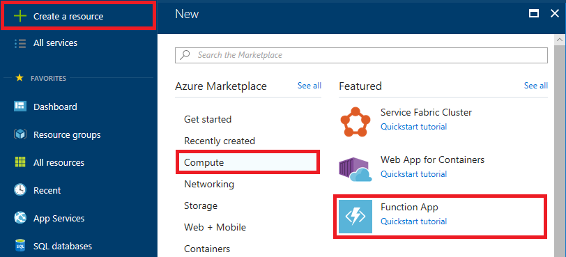

    _Creating an Azure Function App_

3. Enter an app name that is unique within Azure. Under **Resource Group**, select **Create new** and enter "FunctionsLabResourceGroup" (without quotation marks) as the resource-group name to create a resource group for the Function App. Choose the **Location** nearest you, and accept the default values for all other parameters. Then click **Create** to create a new Function App.

	> The app name becomes part of a DNS name and therefore must be unique within Azure. Make sure a green check mark appears to the name indicating it is unique. You probably **won't** be able to use "functionslab" as the app name.
 
    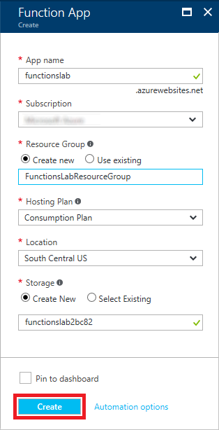

    _Creating a Function App_

1. Click **Resource groups** in the ribbon on the left side of the portal, and then click the resource group created for the Function App.
 
    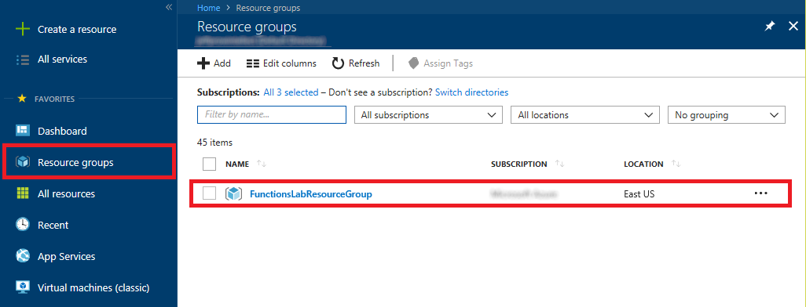

    _Opening the resource group_

1. Periodically click the **Refresh** button at the top of the blade until "Deploying" changes to "Succeeded," indicating that the Function App has been deployed. Then click the storage account that was created for the Function App.

    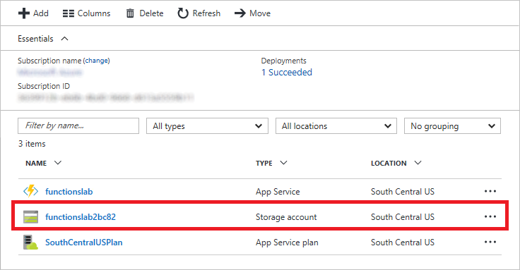

    _Opening the storage account_

1. Click **Blobs** to view the contents of blob storage.

    

    _Opening blob storage_

1. Click **+ Container**. Type "uploaded" into the **Name** box and set **Public access level** to **Private**. Then click the **OK** button to create a new container.

    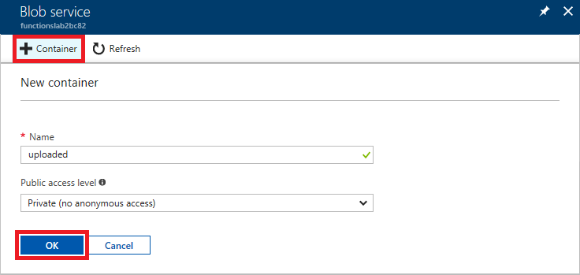

    _Adding a container_

1. Repeat Step 7 to add containers named "accepted" and "rejected" to blob storage.

1. Confirm that all three containers were added to blob storage.

    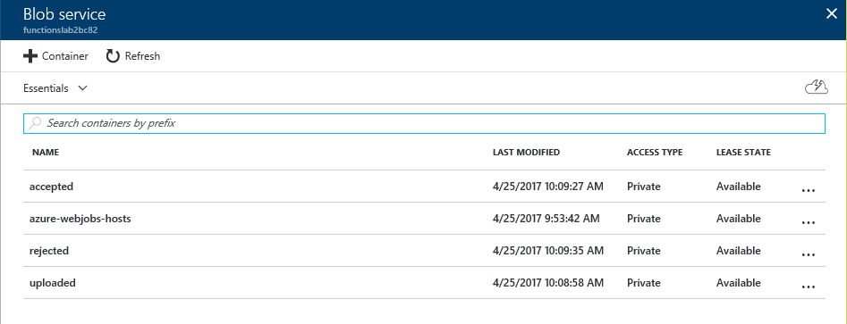

    _The new containers_

The Azure Function App has been created and you have added three containers to the storage account created for it. The next step is to add an Azure Function.

<a name="Exercise2"></a>
## Exercise 2: Add an Azure Function ##

Once you have created an Azure Function App, you can add Azure Functions to it. In this exercise, you will add a function to the Function App you created in [Exercise 1](#Exercise1) and write JavaScript code that uses the [Computer Vision API](https://www.microsoft.com/cognitive-services/en-us/computer-vision-api) to analyze images added to the "uploaded" container for adult or racy content.

1. Return to the blade for the "FunctionsLabResourceGroup" resource group and click the Azure Function App that you created in [Exercise 1](#Exercise1). 

    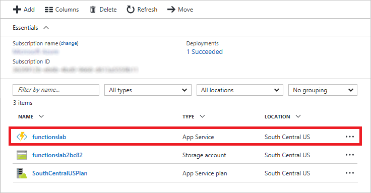

    _Opening the Function App_

1. Click the **+** sign to the right of **Functions**. Set the language to **JavaScript**, and then click **Custom function**.

    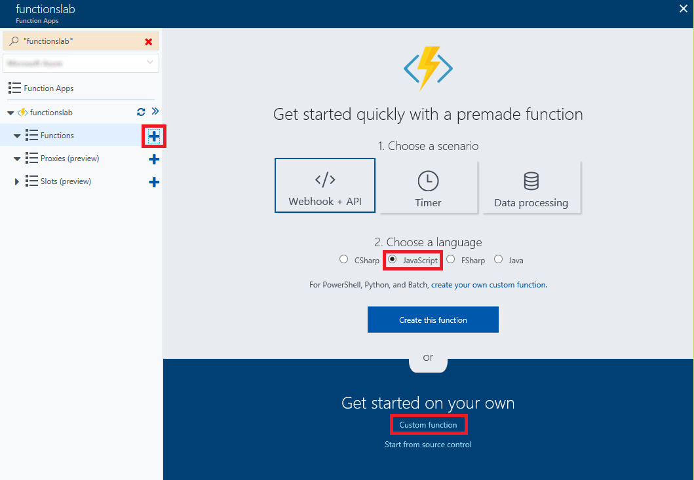

    _Adding a function_

1. Set **Language** to **JavaScript**. Then click **BlobTrigger-JavaScript**.
  
    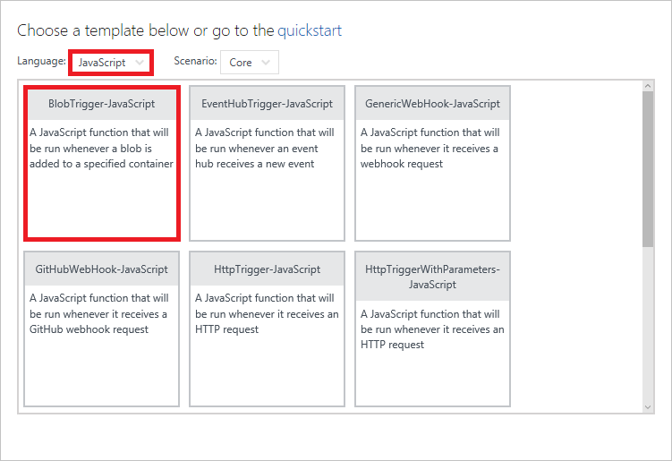

    _Selecting a function template_

1. Enter "BlobImageAnalysis" (without quotation marks) for the function name and "uploaded/{name}" into the **Path** box. (The latter applies the blob storage trigger to the "uploaded" container that you created in Exercise 1.) Then click the **Create** button to create the Azure Function.

    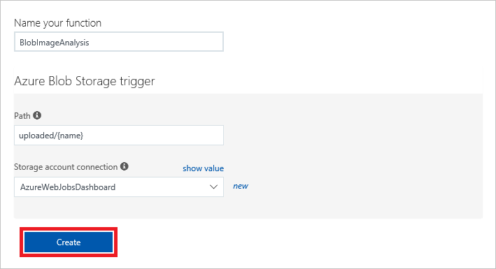

    _Creating an Azure Function_

1. Replace the code shown in the code editor with the following statements:

	```Javascript
	var request = require('request-promise');
	var azure  =  require('azure-storage');

	module.exports = function (context, myBlob) {

	context.log("Analyzing uploaded image '" + context.bindingData.name + "' for adult content...");
	var options = getAnalysisOptions(myBlob, process.env.SubscriptionKey, process.env.VisionEndpoint);
	analyzeAndProcessImage(context, options);

	function getAnalysisOptions(image, subscriptionKey, endpoint) {
	    return  {
	        uri: endpoint + "/analyze?visualFeatures=Adult",
	        method: 'POST',
	        body: image,
	        headers: {
	            'Content-Type': 'application/octet-stream',
	            'Ocp-Apim-Subscription-Key': subscriptionKey
	        }
	    }
	};
 
	function analyzeAndProcessImage(context, options) {
	    request(options)
        .then((response) => {

            response = JSON.parse(response);

	        context.log("Is Adult: ", response.adult.isAdultContent);
	        context.log("Adult Score: ", response.adult.adultScore);
	        context.log("Is Racy: " + response.adult.isRacyContent);
	        context.log("Racy Score: " + response.adult.racyScore);

	        var fileName = context.bindingData.name;
	        var targetContainer = ((response.adult.isRacyContent) ? 'rejected' : 'accepted');
	        var  blobService = azure.createBlobService(process.env.AzureWebJobsStorage); 

	        blobService.startCopyBlob(getStoragePath("uploaded", fileName), targetContainer, fileName, function (error, s, r) {
                            
	            if(error) context.log(error);
	            context.log(fileName + " created in " + targetContainer + ".");

	            blobService.setBlobMetadata(targetContainer, fileName, 
	            {
	                "isAdultContent" : response.adult.isAdultContent,
	                "adultScore" : (response.adult.adultScore * 100).toFixed(0) + "%",
	                "isRacyContent" : response.adult.isRacyContent,
	                "racyScore" : (response.adult.racyScore * 100).toFixed(0) + "%"
	            }, 

	            function(error,s,r) {
	                 if(error) context.log(error);
	                 context.log(fileName + " metadata added successfully.");
	            });
	        });
	    })
	    .catch((error) => context.log(error))
	    .finally(() => context.done());
	};

	function getStoragePath(container,fileName) {
	    var storageConnection = (process.env.WEBSITE_CONTENTAZUREFILECONNECTIONSTRING).split(';');
	    var accountName = storageConnection[1].split('=')[1];
	    return "https://" + accountName + ".blob.core.windows.net/" + container + "/" + fileName + ".jpg";
	};
	};
	```

	> In Node.js, **module.exports** is the method used to export a function to be executed. The **getAnalysisOptions** function in this code prepares a request for each blob added to the "uploaded" container, and then it calls the **analyzeAndProcessImage** function to call the Computer Vision API to analyze the image and create a copy of the blob in either the "accepted" container or the "rejected" container, depending on the scores returned by the Computer Vision API. 

1. Click the **Save** button at the top of the code editor to save your changes. Then click **View files**.

    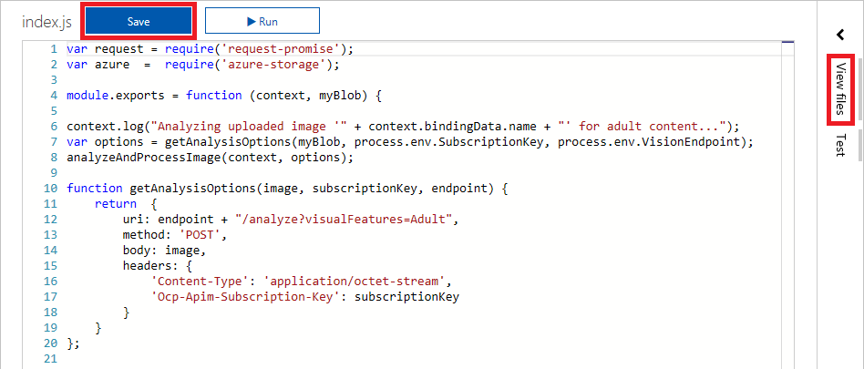

    _Saving the function_

1. Click **function.json** to open that file for editing.

    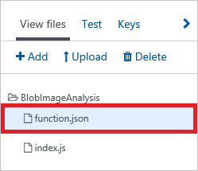

    _Opening function.json_

1. Replace the JSON shown in the code editor with the following JSON:

	```JSON
	{
	  "bindings": [
	    {
	      "name": "myBlob",
	      "type": "blobTrigger",
	      "path": "uploaded/{name}.jpg",
	      "connection": "AzureWebJobsStorage",
	      "dataType": "binary",
	      "direction": "in"
	    }
	  ],
	  "disabled": false
	}
	```

	> The statement that sets "dataType" to "binary" improves performance when processing blobs that are images.  

1. Click **Save** to save the changes to the file. 

    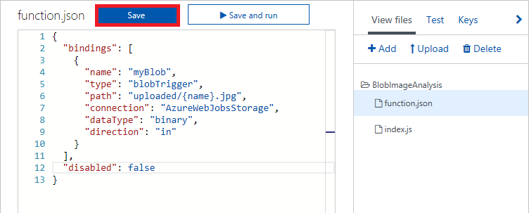

    _Saving function.json_

1. The function has been written, but you must install some dependency packages in order for it to work. The dependencies come from the two ```require``` statements at the beginning of the JavaScript code that you added. To resolve these dependencies, begin by clicking the function name in the ribbon on the left. Then click **Platform features**, followed by **Console** to open a developer console.

    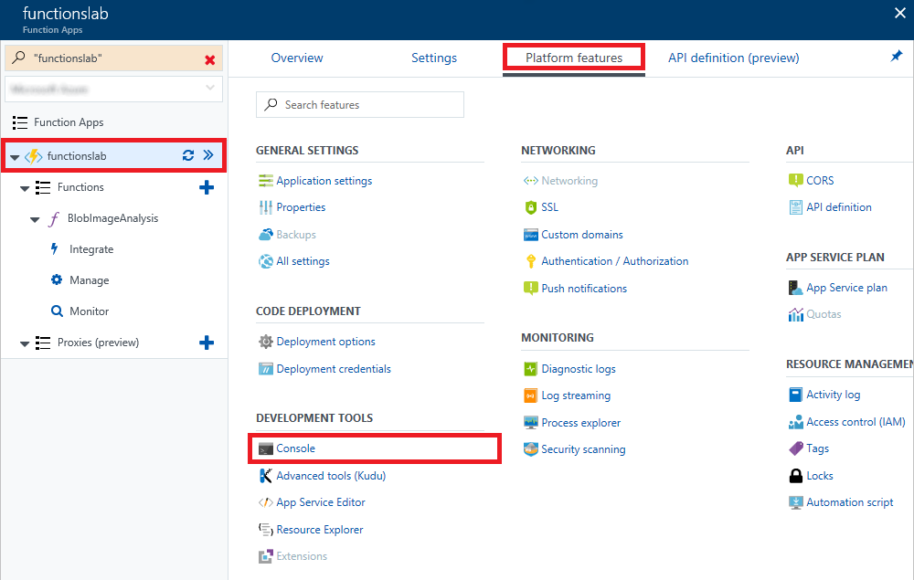

    _Opening the developer console_
 
1. Execute the following command in the console to navigate to the function directory:

	```
	cd BlobImageAnalyis
	```

1. Execute the following commands in the console to install the packages used by the function. Ignore any warning messages that are displayed, and note that each command may take a minute or more to run:

	```
	npm install request
	npm install request-promise
	npm install azure-storage
	```

An Azure Function written in JavaScript has been created and configured and the packages that the function relies upon have been installed. The next step is to add an application setting that the Azure Function relies on.

<a name="Exercise3"></a>
## Exercise 3: Add a subscription key to application settings ##

The Azure Function you created in [Exercise 2](#Exercise2) loads a subscription key for the Microsoft Cognitive Services Computer Vision API from application settings. This key is required in order for your code to call the Computer Vision API, and is transmitted in an HTTP header in each call. It also loads the base URL for the Computer Vision API (which varies by data center) from application settings. In this exercise, you will subscribe to the Computer Vision API, and then add an access key and a base URL to application settings.

1. In the Azure Portal, click **+ Create a resource**, followed by **AI + Machine Learning** and **Computer Vision**.

    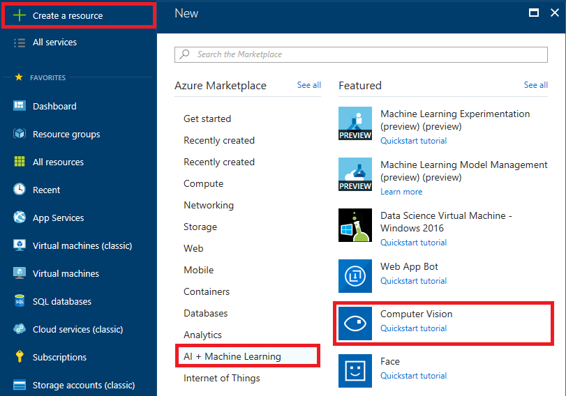

    _Creating a new Computer Vision API subscription_

1. Enter "VisionAPI" into the **Name** box and select **F0** as the **Pricing tier**. Under **Resource Group**, select **Use existing** and select the "FunctionsLabResourceGroup" resource group that you created for the Function App in Exercise 1. Check the **I confirm** box, and then click **Create**.

    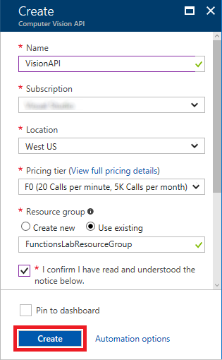

    _Subcribing to the Computer Vision API_

1. Return to the blade for "FunctionsLabResourceGroup" and click the Computer Vision API subscription that you just created.

    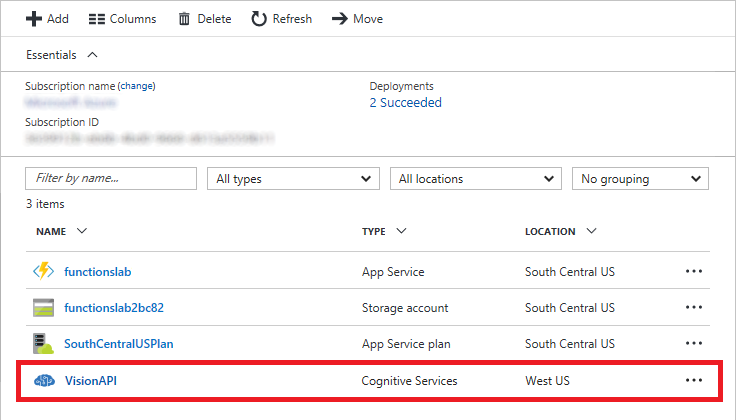

    _Opening the Computer Vision API subscription_

1. Copy the URL under **Endpoint** into your favorite text editor so you can easily retrieve it in a moment. Then click **Show access keys**.

    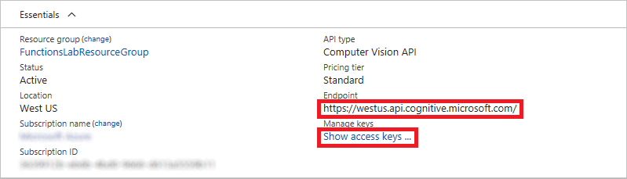

    _Viewing the access keys_

1. Click the **Copy** button to the right of **KEY 1** to copy the access key to the clipboard.

    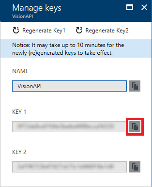

    _Copying the access key_

1. Return to the Function App in the Azure Portal and click the function name in the ribbon on the left. Then click **Platform features**, followed by **Application settings**. 

    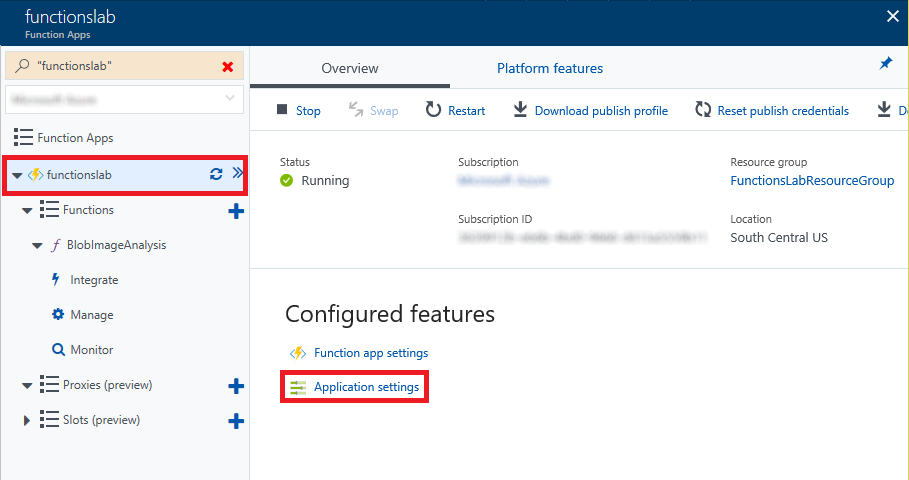

    _Viewing application settings_

1. Scroll down to the "App settings" section. Add a new app setting named "SubscriptionKey" (without quotation marks), and paste the subscription key that is on the clipboard into the **Value** box. Then add a setting named "VisionEndpoint" and set its value to the endpoint URL you saved in Step 4. Add "vision/v1.0" to the end of the URL if it isn't already there. Finish up by clicking **Save** at the top of the blade.

    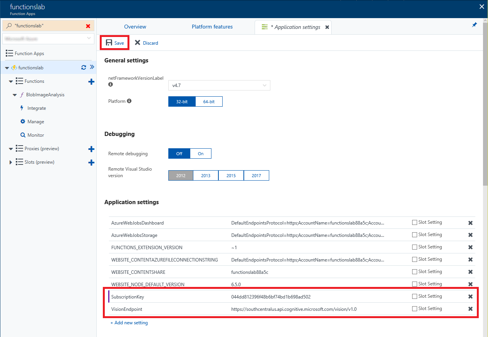

    _Adding application settings_

The work of writing and configuring the Azure Function is complete. Now comes the fun part: testing it out.

<a name="Exercise4"></a>
## Exercise 4: Test the Azure Function ##

Your function is configured to listen for changes to the blob container named "uploaded" that you created in [Exercise 1](#Exercise1). Each time an image appears in the container, the function executes and passes the image to the Computer Vision API for analysis. To test the function, you simply upload images to the container. In this exercise, you will use the Azure Portal to upload images to the "uploaded" container and verify that copies of the images are placed in the "accepted" and "rejected" containers.

1. In the Azure Portal, go to the resource group created for your Function App. Then click the storage account that was created for it.

    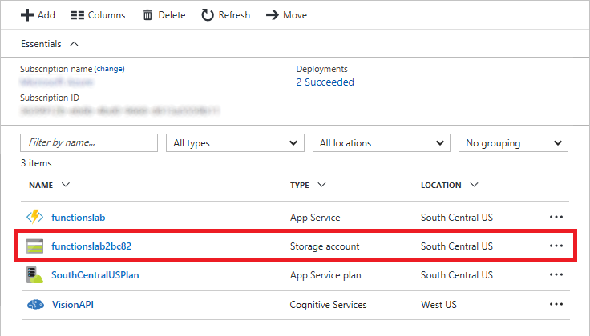

    _Opening the storage account_

1. Click **Blobs** to view the contents of blob storage.

    

    _Opening blob storage_

1. Click **uploaded** to open the "uploaded" container.

    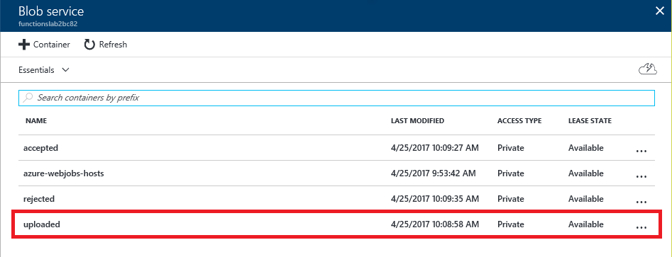

    _Opening the "uploaded" container_

1. Click **Upload**.

    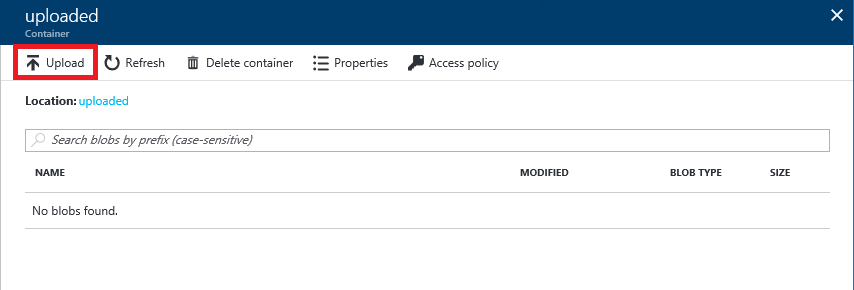

    _Uploading images to the "uploaded" container_

1. Click the button with the folder icon to the right of the **Files** box. Select all of the files in the [resources that accompany this lab](https://a4r.blob.core.windows.net/public/functions-resources.zip). Then click the **Upload** button to upload the files to the "uploaded" container.

    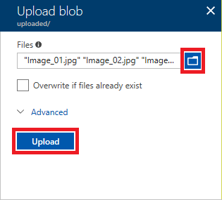

    _Uploading images to the "uploaded" container_

1. Return to the blade for the "uploaded" container and verify that eight images were uploaded.

    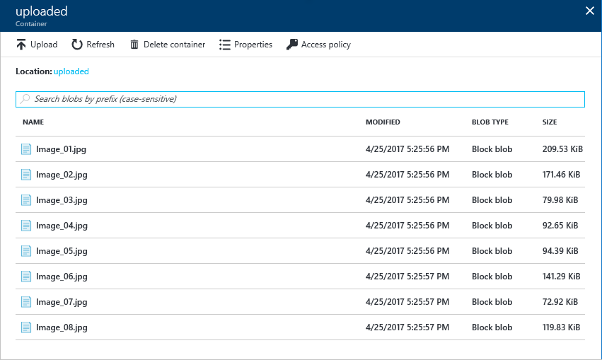

    _Images uploaded to the "uploaded" container_

1. Close the blade for the "uploaded" container and open the "accepted" container.

    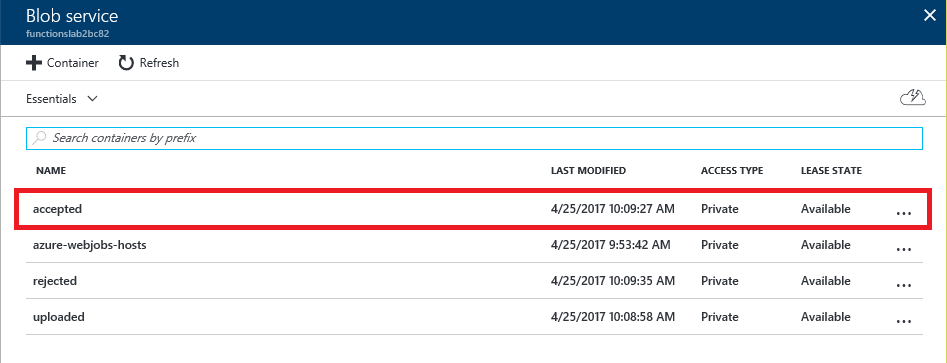

    _Opening the "accepted" container_

1. Verify that the "accepted" container holds seven images. **These are the images that were classified as neither adult nor racy by the Computer Vision API**.

	> It may take a minute or more for all of the images to appear in the container. If necessary, click **Refresh** every few seconds until you see all seven images.

    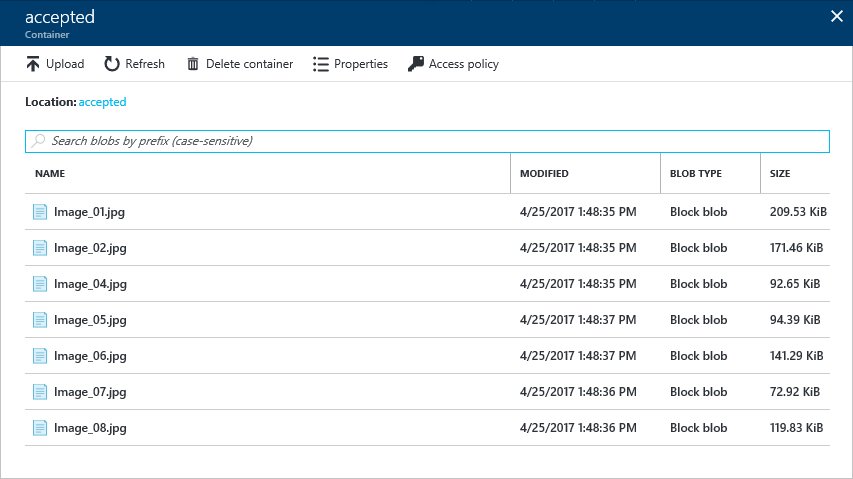

    _Images in the "accepted" container_

1. Close the blade for the "accepted" container and open the blade for the "rejected" container. Verify that the "rejected" container holds one image. **This image was classified as adult or racy (or both) by the Computer Vision API**.

    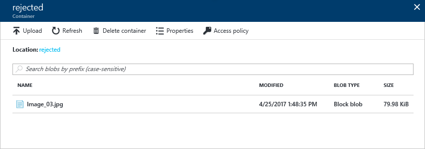

    _Images in the "rejected" container_

The presence of seven images in the "accepted" container and one in the "rejected" container is proof that your Azure Function executed each time an image was uploaded to the "uploaded" container. If you would like, return to the BlobImageAnalysis function in the portal and click **Monitor**. You will see a log detailing each time the function executed.

<a name="Exercise5"></a>
## Exercise 5: View blob metadata (optional) ##

What if you would like to view the scores for adult content and raciness returned by the Computer Vision API for each image uploaded to the "uploaded" container? The scores are stored in blob metadata for the images in the "accepted" and "rejected" containers, but blob metadata can't be viewed through the Azure Portal.

In this exercise, you will use the cross-platform [Microsoft Azure Storage Explorer](http://storageexplorer.com) to view blob metadata and see how the Computer Vision API scored the images you uploaded.

1. If you haven't installed the Microsoft Azure Storage Explorer, go to http://storageexplorer.com and install it now. Versions are available for Windows, macOS, and Linux.

1. Start Storage Explorer. If you are asked to log in, do so using the same account you used to log in to the Azure Portal.

1. Find the storage account that was created for your Azure Function App in [Exercise 1](#Exercise1) and expand the list of blob containers underneath it. Then click the container named "rejected."

	> If this is the first time you have run Storage Explorer, you may have to click the person icon and tell it which Azure subscription or subscriptions you want it to display. 

    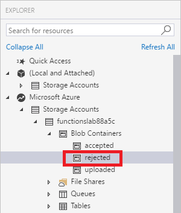

    _Opening the "rejected" container_

1. Right-click (on a Mac, Command-click) the image in the "rejected" container and select **Properties** from the context menu.

    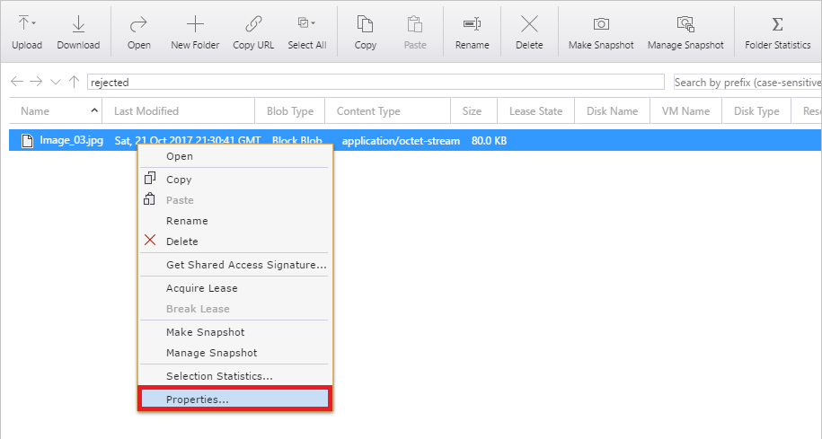

    _Viewing blob metadata_

1. Inspect the blob's metadata. *IsAdultContent* and *isRacyContent* are Boolean values that indicate whether the Computer Vision API detected adult or racy content in the image. *adultScore* and *racyScore* are the computed probabilities.

    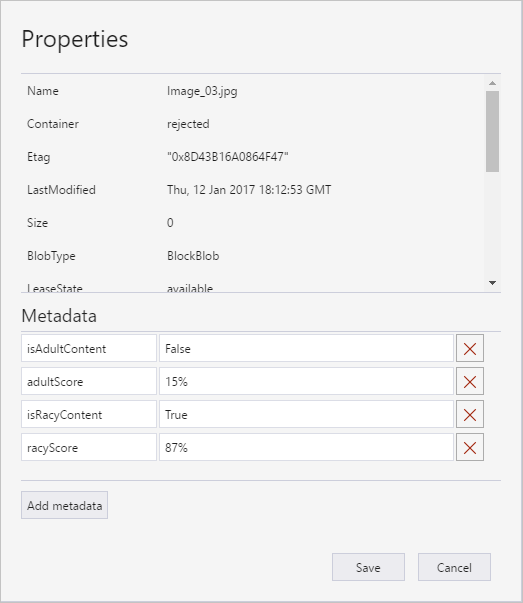

    _Scores returned by the Computer Vision API_

1. Open the "accepted" container and inspect the metadata for some of the blobs stored there. How do these metadata values differ from the ones attached to the blob in the "rejected" container?

You can probably imagine how this might be used in the real world. Suppose you were building a photo-sharing site and wanted to prevent adult images from being stored. You could easily write an Azure Function that inspects each image that is uploaded and deletes it from storage if it contains adult content.

<a name="Summary"></a>
## Summary ##

In this hands-on lab you learned how to:

- Create an Azure Function App
- Write an Azure Function that uses a blob trigger
- Add application settings to an Azure Function App
- Use Microsoft Cognitive Services to analyze images and store the results in blob metadata

This is just one example of how you can leverage Azure Functions to automate repetitive tasks. Experiment with other Azure Function templates to learn more about Azure Functions and to identify additional ways in which they can aid your research or business.

---

Copyright 2016 Microsoft Corporation. All rights reserved. Except where otherwise noted, these materials are licensed under the terms of the MIT License. You may use them according to the license as is most appropriate for your project. The terms of this license can be found at https://opensource.org/licenses/MIT.