<a name="HOLTitle"></a>
# Creating and Using an HPC Cluster in Azure #

One of the benefits of using the cloud to handle large computing workloads is virtually limitless scalability. In Microsoft Azure, you can create a cluster of virtual machines (VMs) networked to form a high-performance computing (HPC) cluster in a matter of minutes. If you need more computing power than the cluster can provide, you can *scale up* by creating a cluster with larger and more capable virtual machines (more cores, more RAM, etc.), or you can *scale out* by creating a cluster with more nodes.

In this lab, you will create a Linux cluster consisting of three virtual machines, or nodes — one master node and two worker nodes — and run a Python script on it to convert a batch of color images to grayscale. You will get first-hand experience deploying HPC clusters in Azure as well as managing and using the nodes in a cluster. And you will learn how easy it is to bring massive computing power to bear on problems that require it when you use the cloud.

To distribute the workload among all the nodes and cores in each cluster, the Python code that you will run to convert the images uses the [Simple Linux Utility for Resource Management](https://slurm.schedmd.com/), also known as the SLURM Workload Manager or simply SLURM. SLURM is a free and open-source job scheduler for Linux that excels at distributing heavy computing workloads across clusters of machines and processors. It is used on more than half of the world's largest supercomputers and HPC clusters, and it enjoys widespread use in the research community for jobs that require significant compute resources.

<a name="Objectives"></a>
### Objectives ###

In this hands-on lab, you will learn how to:

- Create a SLURM cluster using an Azure Resource Manager template
- Copy local resources to a SLURM cluster
- Remote into a SLURM cluster
- Run jobs on a SLURM cluster
- Start and stop nodes in a SLURM cluster
- Use the Azure Resource Manager to delete a SLURM cluster

<a name="Prerequisites"></a>
### Prerequisites ###

The following are required to complete this hands-on lab:

- An active Microsoft Azure subscription. If you don't have one, [sign up for a free trial](https://aka.ms/WATK-FreeTrial).
- [PuTTY](http://www.chiark.greenend.org.uk/~sgtatham/putty/download.html) (Windows users only)

<a name="Resources"></a>
### Resources ###

[Click here](https://a4r.blob.core.windows.net/public/hpc-resources.zip) to download a zip file containing the resources used in this lab. Copy the contents of the zip file into a folder on your hard disk.

<a name="Cost"></a>
### Cost ###


The cost of this lab is **high**. For an overview of cost ratings, refer to [Explanation of Costs](../../Costs.md).

<a name="Exercises"></a>
## Exercises ##

This hands-on lab includes the following exercises:

- [Exercise 1: Deploy a SLURM cluster](#Exercise1)
- [Exercise 2: Create blob containers and upload images](#Exercise2)
- [Exercise 3: Prepare the Python script](#Exercise3)
- [Exercise 4 (macOS and Linux): Copy the job scripts, configure the nodes, and run the job](#Exercise4)
- [Exercise 5 (Windows): Copy the job scripts, configure the nodes, and run the job](#Exercise5)
- [Exercise 6: View the converted images](#Exercise6)
- [Exercise 7: Suspend the SLURM cluster](#Exercise7)
- [Exercise 8: Delete the SLURM cluster](#Exercise8)

Estimated time to complete this lab: **45** minutes.

<a name="Exercise1"></a>
## Exercise 1: Deploy a SLURM cluster ##

The Azure Resource Manager allows you to provision complex groups of resources such as those comprising HPC clusters using declarative templates. A template contains a complete description of everything that makes up a resource group, including virtual machines, storage accounts, IP addresses, and other resources. Templates can include parameters that users are prompted to fill in each time a resource group is deployed. Templates can also invoke scripts to initialize resources to a known and consistent state. To learn more about Azure Resource Manager templates, refer to the [documentation](https://azure.microsoft.com/documentation/articles/resource-group-template-deploy/?WT.mc_id=academiccontent-github-cxa) online.

In this exercise, you will use a deployment template built by the Azure team. This template creates a collection of virtual machines and all the resources required to form a SLURM HPC cluster from them. It is one of many useful templates on the [Azure Quickstart Templates](http://azure.microsoft.com/documentation/templates/?WT.mc_id=academiccontent-github-cxa) page and in the Quickstart templates [GitHub repository](https://github.com/Azure/azure-quickstart-templates).

The template you will use, which you can [view here](https://github.com/Azure/azure-quickstart-templates/tree/master/slurm) on GitHub, is titled "Deploy a slurm cluster." It performs the following steps:

- Deploys a master VM plus a specified number of worker VMs
- Creates a private network for the VMs (nodes) in the cluster
- Creates a public IP address for master node
- Creates an identical user account on all nodes
- Executes a shell script to configure SLURM on all nodes

Let's get started!

1. In your browser, navigate to [https://github.com/Azure/azure-quickstart-templates/tree/master/slurm](https://github.com/Azure/azure-quickstart-templates/tree/master/slurm). In the middle of the page, click the **Deploy to Azure** button. This will load the template into a new instance of the Azure Portal. You may be asked to sign in again. If you are, sign in using your Microsoft account.

    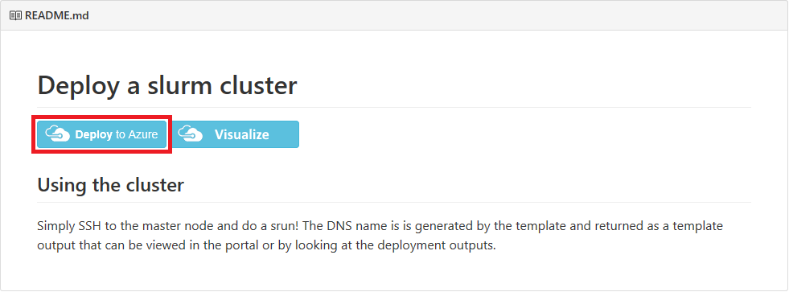

	_Deploying from GitHub_

1. Click **Edit template**.

    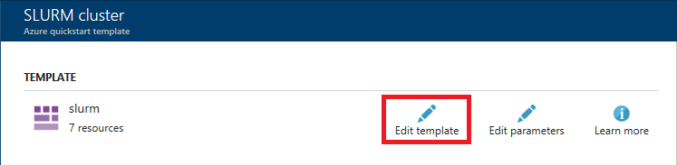

	_Editing the template_

1. On Line 50, change the Ubuntu version number to **16.04-LTS** if that isn't the version that's currently referenced. Then click the **Save** button to save the change.

    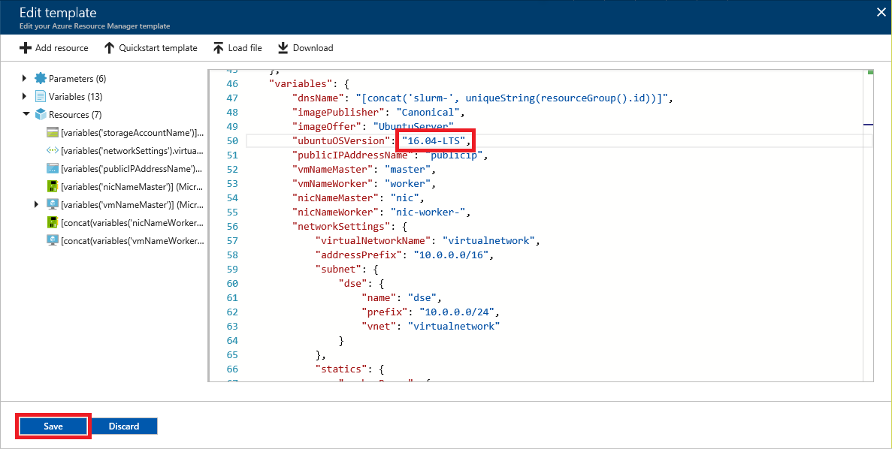

	_Modifying the Ubuntu version number_

1. Select **Create new** under **Resource group** and enter the resource-group name "ClusterResourceGroup" (without quotation marks). Under **Location**, select the location nearest you. Specify "azureuser" as the **Admin User Name** and "Azure4Research!" as the **Admin Password**. Leave **Vm Size** set to **Standard_D1_v2** and set **Scale Number** to **2** to create a cluster containing two worker nodes. Then check the **I agree to the terms and conditions stated above** box and click the **Purchase** button at the bottom of the blade.

	> It is very important to specify "azureuser" as the admin user name, because the scripts that you will use to configure the cluster use that user name.

    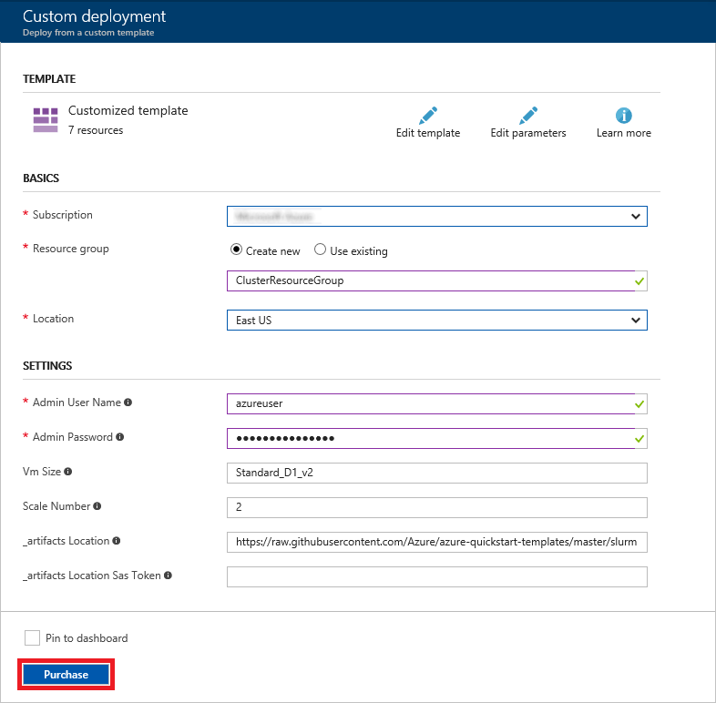

	_Deploying the cluster_

1.  Deploying the cluster can take 5 minutes or more. You can monitor the status of the deployment by opening the resource group's blade. Click **Resource groups** in the ribbon on the left. Then click the resource group created for the cluster.

    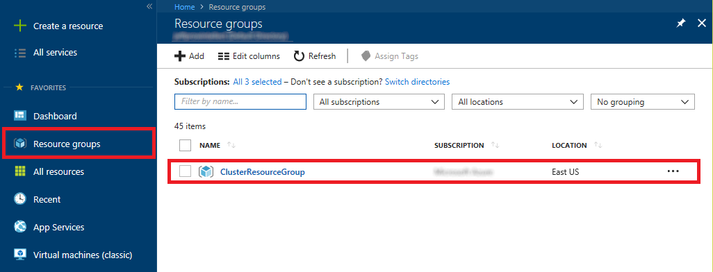

	_Opening the resource group_

1. Wait until "Deploying" changes to "Succeeded," indicating that the cluster has been successfully deployed. You can click the **Refresh** button at the top of the blade to refresh the deployment status.

    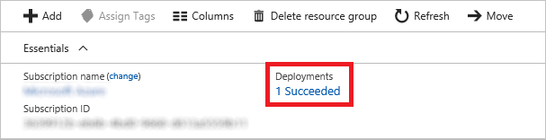

	_Successful deployment_

When the deployment completes successfully, you will see all the resources that comprise the cluster in the resource group. The next step is to create a couple of blob containers to hold the images that the cluster will process.

<a name="Exercise2"></a>
## Exercise 2: Create blob containers and upload images ##

In a later exercise, you will run a Python script on the cluster to generate grayscale images from color images. That script requires a set of color images as well as two blob storage containers: one for input and one for output. In this exercise, you will use the Azure Portal to create the containers and upload the images.

1. Return to the Azure Portal and the blade for the resource group containing the cluster. Then click the storage account created for the cluster.

	> The storage-account name will vary for different users. This storage account holds the virtual hard disks (VHDs) and other resources used by the cluster.

    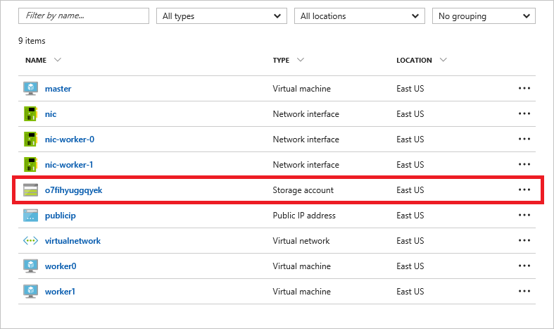

    _Opening the storage account_

1. Click **Blobs** to view a list of blob containers in the storage account.

    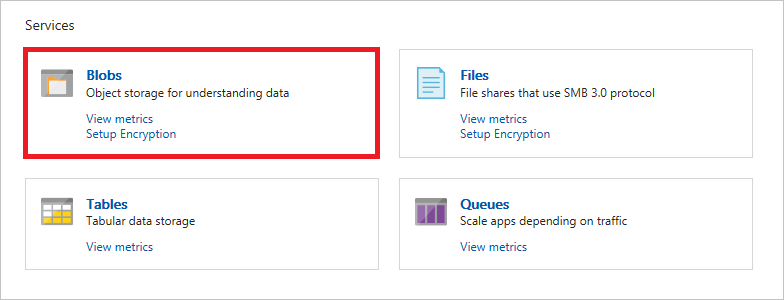

	_Viewing blob containers_

1. Click **+ Container**. Type "input" (without quotation marks) into the **Name** field and click the **OK** button to create a container named "input."

    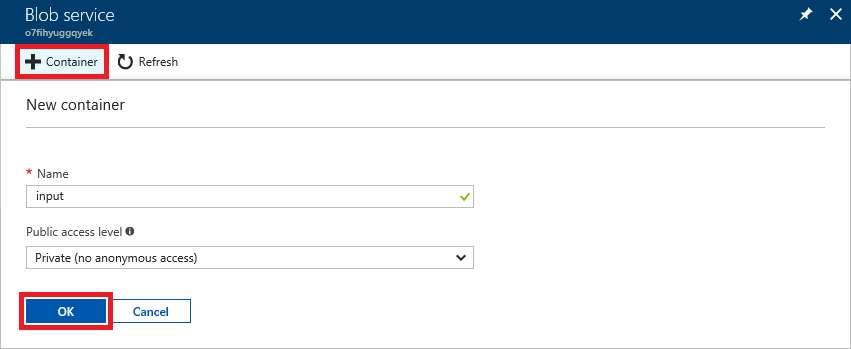

    _Creating an "input" container_

1. Repeat Step 3 to create a container named "output."

1. Click **input** to open the "input" container.

    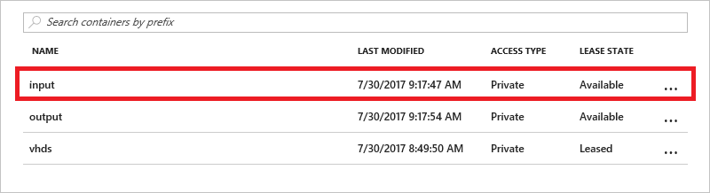

    _Opening the "input" container_

1. Click **Upload**.

    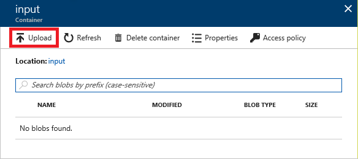

    _Uploading blobs to the "input" container_

1. Click the **Open** button to the right of the **Files** box. Select all of the files in the "ColorImages" folder of the [resources that accompany this lab](https://a4r.blob.core.windows.net/public/hpc-resources.zip). Then click the **Upload** button to upload color images to the "input" container.

    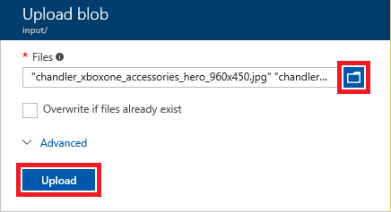

    _Uploading color images_

1. Wait until all of the uploads have completed. Then close the "Upload blob" blade and return to the blade for the "input" container. Confirm that the container now contains a collection of .jpg and .png blobs, and click the blob named **Consoles_superhero_1920x768.jpg**.

    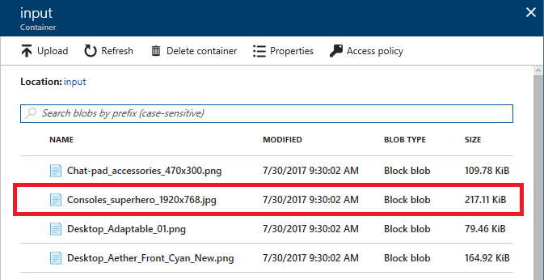

    _Opening a blob in the "input" container_

1. Click **Download** to download the blob.

    

    _Downloading an image blob_

1. Confirm that you see the color image below.

    

    _The downloaded blob_

You now have containers to hold input and output and a collection of color images in the input container. The next step is to update the Python script that will be used to process the images.

<a name="Exercise3"></a>
## Exercise 3: Prepare the Python script ##

With the SLURM cluster up and running and the images uploaded to blob storage, you are now ready to modify the Python script that processes the images with information enabling it to access the storage account. The script is named **slurmdemo.py** and is included in lab resources. You can use any text editor that you're comfortable with. There is no need to be concerned about how line breaks are encoded, because after uploading these scripts to the cluster's master node, you will run a utility to insert Linux-style line breaks into each script.

1. Return to the Azure Portal and to the resource group containing the cluster. In the resource group's blade, click the storage account to open a blade for the storage account.

    

    _Opening the storage account_

1. In the storage-account blade, click **Access keys**.

    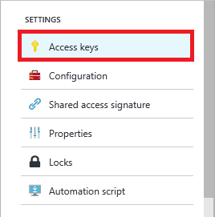

    _Viewing the storage account's access keys_

1. Click the **Copy** button to the right of **Storage account name** to copy the storage account's name to the clipboard.

    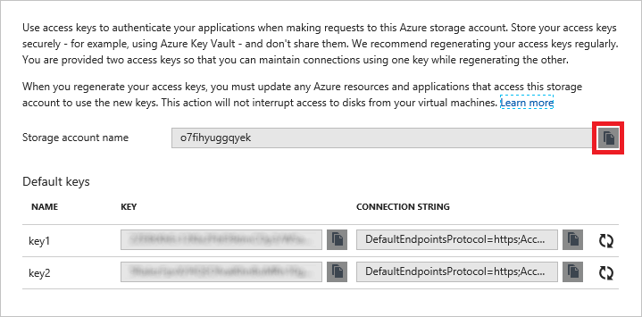

    _Copying the storage account's name_

1. Navigate to the directory where you copied the lab resources. Then open **slurmdemo.py** in a text editor and find the following section near the top of the file:

	```python
    #######################################################
    # Update these two variables to those for your account.
    #######################################################
    ACCOUNT_NAME = 'account_name'
    ACCOUNT_KEY = 'account_key'
    #######################################################
    ```

1. Replace *account_name* with the storage-account name that you copied to the clipboard. Make sure the account name is enclosed in single quotes.

1. Return to the Azure Portal and click the **Copy** button to the right of **key1** to copy the storage account's primary access key to the clipboard.

    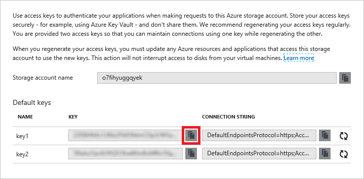

    _Copying the storage account's primary access key_

1. In **slurmdemo.py**, replace *account_key* with the access key that you copied to the clipboard. Make sure it is enclosed in single quotes. The modified code will look something like this:

	```python
    #######################################################
    # Update these two variables to those for your account.
    #######################################################
    ACCOUNT_NAME = 'o7fihyuggqyek'
    ACCOUNT_KEY = 'qFndvj3/a6O/dHYQ1FfKU+9K04AzOIRz2/5R...'
    #######################################################
    ```

1. Save your changes to **slurmdemo.py** and close the text editor.

You've updated the Python script with the necessary information. Now you're ready for the next step: configuring the SLURM cluster and using it to process the images. If you're running macOS or Linux, proceed to [Exercise 4](#Exercise4). If you are running Windows, skip to [Exercise 5](#Exercise5).

<a name="Exercise4"></a>
## Exercise 4 (macOS and Linux): Copy the job scripts, configure the nodes, and run the job ##

In this exercise, you will upload the Python script and a pair of setup scripts to the master node of the SLURM cluster and use them to configure the cluster and run the job.

1. The deployment template that you used to create the SLURM cluster created an IP address and a publicly addressable DNS name for the master node. To find the node's DNS name, open the blade for the resource group that holds the cluster. Then click **publicip**.

    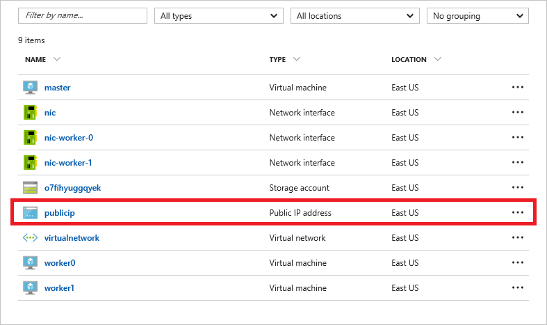

    _Opening the publicip resource_

1. Place the cursor over the DNS name. When a **Copy** button appears, click it to copy the DNS name to the clipboard.

    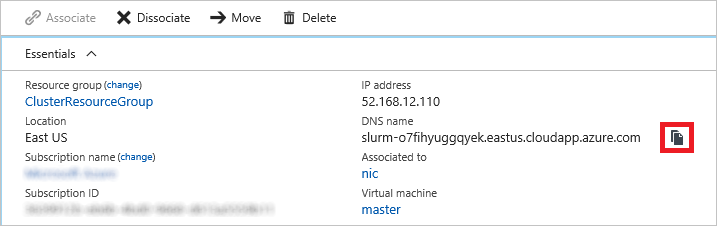

    _Copying the DNS name to the clipboard_

1. Open a terminal window and navigate to the directory containing the Python script you modified in [Exercise 3](#Exercise3).

1. Execute the following command in the terminal window to copy the script files to the cluster, replacing *masterDNS* with the DNS name on the clipboard. When prompted, enter the admin password for the cluster ("Azure4Research!").

    <pre>
    scp * azureuser@<i>masterDNS</i>:.</pre>

	> Because this is the first time you have connected to the master node, you will be prompted with a security warning asking if you want to update the cached key. Since the host is one you created, answer yes.

1. The next step is to establish an SSH connection to the master node. Execute the following command in the terminal window, replacing _masterDNS_ with the DNS name on the clipboard. When prompted, enter the admin password for the cluster ("Azure4Research!").

    <pre>
    ssh azureuser@<i>masterDNS</i></pre>

1. To be certain that the script files contain Linux-style line endings ("/r" rather than "/r/n"), execute the following commands in the terminal window to install and run the dos2unix conversion program:

    ```
    sudo apt-get install dos2unix
    dos2unix *
    ```

1. Now execute the command below in the terminal window to configure the nodes in the cluster. It typically takes about 5 minutes to run.

    ```
    sh setup.sh
    ```

1. Once **setup.sh** has finished, it is time to put the cluster to work converting the color images in the "input" container into grayscale images in the "output" container. Use the following command to start the job:

    ```
    python slurmdemo.py
    ```

Next, you'll check the output to verify that the job ran correctly. Since Exercise 5 is for Windows users only, proceed directly to [Exercise 6](#Exercise6).

<a name="Exercise5"></a>
## Exercise 5 (Windows): Copy the job scripts, configure the nodes, and run the job ##

In this exercise, you will upload the Python script and a pair of setup scripts to the master node of the SLURM cluster and use them to configure the cluster and run the job. To remote into the cluster, you'll use a popular Windows SSH client named PuTTY. If you haven't already installed PuTTY, [download the MSI](http://www.chiark.greenend.org.uk/~sgtatham/putty/download.html) and install it now.

1. The deployment template that you used to create the SLURM cluster created an IP address and a publicly addressable DNS name for the master node. To find the node's DNS name, open the blade for the resource group that holds the cluster. Then click **publicip**.

    

    _Opening the publicip resource_

1. Place the cursor over the DNS name. When a **Copy** button appears, click it to copy the DNS name to the clipboard.

    

    _Copying the DNS name to the clipboard_

1. Open a Command Prompt window and navigate to the directory containing the Python script you modified in [Exercise 3](#Exercise3).

1. To copy files to the master node, you will use PuTTY's Secure Copy utility, pscp.exe. Execute the following command in the Command Prompt window, replacing _masterDNS_ with the DNS name on the clipboard. When prompted, enter the admin password for the cluster ("Azure4Research!").

    <pre>
    pscp * azureuser@<i>masterDNS</i>:.</pre>

	> Because this is the first time you have connected to the master node, you will be prompted with a security warning asking if you want to update the cached key. Since the host is one you created, answer yes.

1. Start PuTTY and paste the DNS name into the **Host Name (or IP address)** field. Then click the **Open** button to initiate a Secure Shell (SSH) connection.

    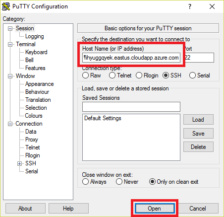

    _Connecting with PuTTY_

1. A PuTTY terminal window will appear and you will be prompted to **login as**. Log in with the user name ("azureuser") and password ("Azure4Research!") you entered into the deployment template in [Exercise 1](#Exercise1).

1. To be certain that the script files contain Linux-style line endings ("/r" rather than "/r/n"), execute the following commands in the PuTTY terminal window to install and run the dos2unix conversion program:

    ```
    sudo apt-get install dos2unix
    dos2unix *
    ```

1. Now execute the command below in the PuTTY terminal window to configure the nodes in the cluster. It typically takes about 5 minutes to run.

    ```
    sh setup.sh
    ```

1. Once **setup.sh** has finished, it is time to put the cluster to work converting the color images in the "input" container into grayscale images in the "output" container. Execute the following command in the PuTTY terminal window to start the job:

    ```
    python slurmdemo.py
    ```

Next, you'll check the output to verify that the job ran correctly.

<a name="Exercise6"></a>
## Exercise 6: View the converted images ##

If the job ran successfully, the grayscale images generated from the color images in the input container will be in the output container you created in [Exercise 2](#Exercise2). In this exercise, you will check the contents of that container.

1. Return to the Azure Portal and the blade for the resource group containing the cluster. Then click the storage account created for the cluster.

    

    _Opening the storage account_

1. Click **Blobs** to view a list of blob containers in the storage account.

    

	_Viewing blob containers_

1. Click **output** to open the "output" container.

    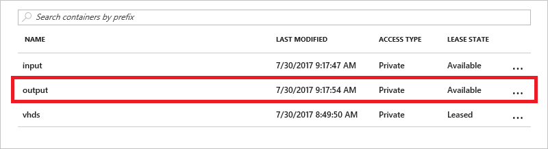

    _Opening the "output" container_

1. Click the blob named **Consoles_superhero_1920x768.2.jpg**.

    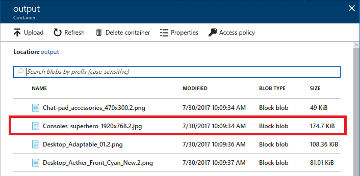

    _Opening a converted image_

1. Click **Download** to download the blob.

    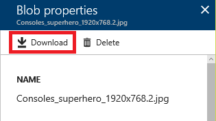

    _Downloading a converted image_

1. When the downloaded image opens, confirm that it's a grayscale image, not a color image. To be sure, download a few other images, too. If the images are grayscale, congratulations! You have a working SLURM cluster.

    

    _The converted image_

You now know how to deploy and configure SLURM clusters and run jobs on them. But when those clusters aren't being used, you should shut them down to avoid incurring unnecessary charges. The next exercise explains how.

<a name="Exercise7"></a>
## Exercise 7: Suspend the SLURM cluster ##

When virtual machines are running, you are being charged — even if the VMs are idle. Therefore, it's advisable to stop virtual machines when they are not in use. You will still be charged for storage, but that cost is typically insignificant compared to the cost of an active VM. The Azure Portal makes it easy to stop virtual machines. VMs that you stop are easily started again later so you can pick up right where you left off.

1. Return to the blade for the resource group containing the cluster. Then click **worker0** to open a blade for the virtual machine named "worker0."

    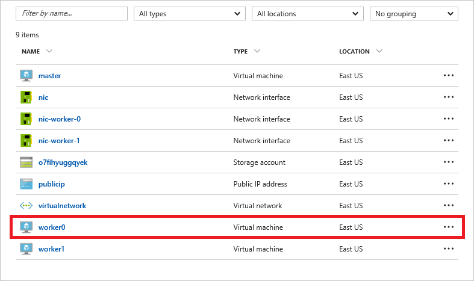

    _Opening a virtual machine_

1. Click the **Stop** button to stop the virtual machine.

    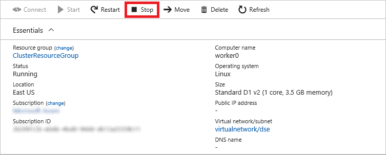

    _Stopping a virtual machine_

1. Repeat this process to stop the virtual machines named "worker1" and "master."

You can stop and start virtual machines in the Azure portal, but if you have a lot of VMs, that's not very efficient. In the real world, you might prefer to use an Azure CLI or PowerShell script to enumerate all the VMs in a resource group and start or stop them all. For more information on scripting the Azure CLI, see the section entitled "How to script the Azure CLI for Mac, Linux, and Windows" in [Install and Configure the Azure CLI](https://azure.microsoft.com/documentation/articles/xplat-cli/). If you prefer visual tools to command-line tools, you can use [Azure Automation](https://azure.microsoft.com/services/automation/) to automate VM operations.

<a name="Exercise8"></a>
## Exercise 8: Delete the SLURM cluster ##

Resource groups are a useful feature of Azure because they simplify the task of managing related resources. One of the most practical reasons to use resource groups is that deleting a resource group deletes all of the resources it contains. Rather than delete those resources one by one, you can delete them all at once.

In this exercise, you will delete the resource group created in [Exercise 1](#Exercise1) when you created the SLURM cluster. Deleting the resource group deletes everything in it and prevents any further charges from being incurred for it.

1. Return to the blade for the cluster's resource group. Then click the **Delete resource group** button at the top of the blade.

	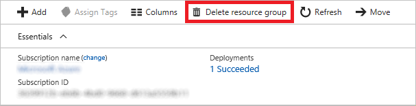

	_Deleting a resource group_

1. For safety, you are required to type in the resource group's name. (Once deleted, a resource group cannot be recovered.) Type the name of the resource group. Then click the **Delete** button to remove all traces of this lab from your account.

After a few minutes, the cluster and all of its resources will be deleted. Billing stops when you click the **Delete** button, so you're not charged for the time required to delete the cluster. Similarly, billing doesn't start until a cluster is fully and successfully deployed.

## Summary ##

In this hands-on lab, you learned how to:

- Create a SLURM cluster using an Azure Resource Manager template
- Copy local resources to a SLURM cluster
- Remote into a SLURM cluster
- Run jobs on a SLURM cluster
- Start and stop nodes in a SLURM cluster
- Use the Azure Resource Manager to delete a SLURM cluster

It is **much** easier to deploy a SLURM cluster in Azure than to install and configure a physical SLURM cluster. This is one of the ways in which cloud computing benefits researchers: it allows you to quickly and easily deploy the resources you need, *when* you need them, pay only for the resources you use, and delete them when they are no longer necessary.

---

Copyright 2017 Microsoft Corporation. All rights reserved. Except where otherwise noted, these materials are licensed under the terms of the MIT License. You may use them according to the license as is most appropriate for your project. The terms of this license can be found at https://opensource.org/licenses/MIT.
