<a name="HOLTitle"></a>
# Azure Storage and Cognitive Services #

Microsoft Azure Storage is a set of services that allows you to store large volumes of data in a cost-effective manner and in a way that makes the data readily and reliably available to services and applications that consume it. Data committed to Azure Storage can be stored in blobs, tables, queues, or files. [Azure blobs](http://azure.microsoft.com/en-us/services/storage/blobs/) are ideal for storing images, videos, and other types of data, and are frequently used to provide input to and capture output from other Azure services such as [Azure Stream Analytics](http://azure.microsoft.com/en-us/services/stream-analytics/). [Azure tables](http://azure.microsoft.com/en-us/services/storage/tables/) provide NoSQL storage for semi-structured data. [Azure queues](http://azure.microsoft.com/en-us/services/storage/queues/) support queued message transfers between applications (or parts of applications) and can be used to make applications more scalable and robust by loosely coupling them together. Finally, [Azure Files](http://azure.microsoft.com/en-us/services/storage/files) use the Server Message Block (SMB) protocol to share files through the cloud and access storage as network drives.

Data stored in Microsoft Azure Storage can be accessed over HTTP or HTTPS using straightforward REST APIs, or it can be accessed using rich client libraries available for many popular languages and platforms, including .NET, Java, Android, Node.js, PHP, Ruby, and Python. The [Azure Portal](https://portal.azure.com) includes features for working with Azure Storage, but richer functionality is available from third-party tools, many of which are free and some of which work cross-platform.

In this lab, you will use Visual Studio to write an MVC Web app that accepts images uploaded by users and stores the images in Azure blob storage. You will learn how to read and write blobs in C#, and how to use blob metadata to attach additional information to the blobs you create. You will also get first-hand experience using [Microsoft Cognitive Services](https://www.microsoft.com/cognitive-services/), a set of intelligence APIs for building smart applications. Specifically, you'll submit each image uploaded by the user to Cognitive Services' [Computer Vision API](https://www.microsoft.com/cognitive-services/en-us/computer-vision-api) to generate a caption for the image as well as search metadata describing the contents of the image. And you will discover how easy it is to deploy apps to the cloud using Visual Studio.

<a name="Objectives"></a>
### Objectives ###

In this hands-on lab, you will learn how to:

- Create a storage account and storage containers using the Azure Portal
- Create a Web app in Visual Studio and deploy it to Azure
- Read and write blobs and attach metadata to them
- Use the Computer Vision API to extract information from images
- Use the cross-platform [Microsoft Azure Storage Explorer](http://storageexplorer.com/) to work with Azure Storage

<a name="Prerequisites"></a>
### Prerequisites ###

The following are required to complete this hands-on lab:

- An active Microsoft Azure subscription. If you don't have one, [sign up for a free trial](http://aka.ms/WATK-FreeTrial).
- [Visual Studio 2017 Community edition](https://www.visualstudio.com/en-us/products/visual-studio-community-vs.aspx) or higher with the "ASP.NET and web development" and "Azure development" workloads installed
- [Microsoft Azure Storage Explorer](http://storageexplorer.com/)

<a name="Resources"></a>
### Resources ###

[Click here](https://a4r.blob.core.windows.net/public/cs-storage-resources.zip) to download a zip file containing the resources used in this lab. Copy the contents of the zip file into a folder on your hard disk.

<a name="Cost"></a>
### Cost ###


The cost of this lab is **low**. For an overview of cost ratings, refer to [Explanation of Costs](../../Costs.md).

<a name="Exercises"></a>
## Exercises ##

This hands-on lab includes the following exercises:

- [Exercise 1: Create a storage account](#Exercise1)
- [Exercise 2: Run the Microsoft Azure Storage Explorer](#Exercise2)
- [Exercise 3: Create a new Web app in Visual Studio](#Exercise3)
- [Exercise 4: Add a lightbox for viewing photos](#Exercise4)
- [Exercise 5: Use Cognitive Services to generate metadata](#Exercise5)
- [Exercise 6: Add search to the app](#Exercise6)
- [Exercise 7: Deploy the app to Azure](#Exercise7)

Estimated time to complete this lab: **60** minutes.

<a name="Exercise1"></a>
## Exercise 1: Create a storage account

The [Azure Portal](https://portal.azure.com) allows you to perform basic storage operations such as creating storage accounts, creating containers, uploading and downloading blobs, and managing access keys. In this exercise, you will use the portal to create a storage account. Then you'll create a pair of containers: one to store images uploaded by the user, and another to store image thumbnails generated from the uploaded images.

1. Open the [Azure Portal](https://portal.azure.com) in your browser. If you are asked to log in, do so using your Microsoft account.
 
1. To create a storage account, click **+ Create a resource** in the ribbon on the left. Then click **Storage**, followed by **Storage account**.

    

    _Creating a storage account_

1. Enter a unique name for the storage account in **Name** field and make sure a green check mark appears next to it. The name is important, because it forms one part of the URL through which blobs created under this account are accessed. Place the storage account in a new resource group named "IntellipixResources," and select the region nearest you. Finish up by clicking the **Review + create** button at the bottom of the blade to create the new storage account.

	> Storage account names can be 3 to 24 characters in length and can only contain numbers and lowercase letters. In addition, the name you enter must be unique within Azure. If someone else has chosen the same name, you'll be notified that the name isn't available with a red exclamation mark in the **Name** field.
   
	

    _Specifying parameters for a new storage account_

1. Click **Resource groups** in the ribbon on the left. Then click the "IntellipixResources" resource group.

    

    _Opening the resource group_

1. In the blade that opens for the resource group, click the storage account you just created. If the storage account isn't there yet, you can click **Refresh** at the top of the blade until it appears.
 
    

    _Opening the new storage account_

1. In the blade for the storage account, click **Blobs** to view a list of containers associated with this account.

    

    _Viewing blob containers_

1. The storage account currently has no containers. Before you can create a blob, you must create a container to store it in. Click **+ Container** to create a new container. Type "photos" (without quotation marks) into the **Name** field and select **Blob** as the **Public access level**. Then click **OK** to create a container named "photos."

	> By default, containers and their contents are private. Selecting **Blob** as the access level makes the blobs in the "photos" container publicly accessible, but doesn't make the container itself public. This is what you want since the images stored in the "photos" container will be linked to from a Web app. 

    

    _Creating a "photos" container_

1. Repeat the previous step to create a container named "thumbnails," once more ensuring that the container's **Public access level** is set to **Blob**.

1. Confirm that both containers appear in the list of containers for this storage account, and that the names are spelled correctly.

    

    _The new containers_

1. Close the "Blob service" blade. Click **Access keys** in the menu on the left side of the storage-account blade, and then click the **Copy** button next to **KEY** for **key1**. Paste this access key into your favorite text editor for later use.

    

    _Copying the access key_

You have now created a storage account to hold images uploaded to the app you're going to build, and containers to store the images in. Note that you *could* create these containers from within the app. Whether to create them programmatically or create them as part of the provisioning process is a choice that's left up to app developers.

<a name="Exercise2"></a>
## Exercise 2: Run the Microsoft Azure Storage Explorer

The [Microsoft Azure Storage Explorer](http://storageexplorer.com/) is a free tool that provides a graphical interface for working with Azure Storage on PCs running Windows, macOS, and Linux. It provides most of the same functionality as the Azure Portal. It also offers features the portal does not, such as the ability to view blob metadata. In this exercise, you will use the Microsoft Azure Storage Explorer to view the containers you created in Exercise 1.

1. If you haven't installed Storage Explorer or would like to make sure you're running the latest version, go to http://storageexplorer.com/ and download and install it.

1. Start Storage Explorer. If you are asked to log in, do so using your Microsoft account — the same one that you used to log in to the Azure Portal. If you don't see the storage account created in the previous exercise in Storage Explorer's left pane, click the **Manage Accounts** button highlighted below and ensure that your Microsoft account *and* the subscription used to create the storage account have been added to Storage Explorer.

    

    _Managing accounts in Storage Explorer_

1. Click the small arrow next to the storage account you created in Exercise 1 to display its contents, and then click the arrow next to **Blob Containers**. Confirm that the containers you created in Exercise 1 appear in the list.

    

    _Viewing blob containers_

The containers are currently empty, but that will change once your app is deployed and you start uploading photos. Having Storage Explorer installed will make it easy for you to see what your app writes to blob storage.

<a name="Exercise3"></a>
## Exercise 3: Create a new Web app in Visual Studio

In this exercise, you will create a new Web app in Visual Studio and add code to implement the basic functionality required to upload images, write them to blob storage, and display them in a Web page.

1. Start Visual Studio and use the **File -> New -> Project** command to create a new Visual C# **ASP.NET Web Application** project named "Intellipix" (short for "Intelligent Pictures").

    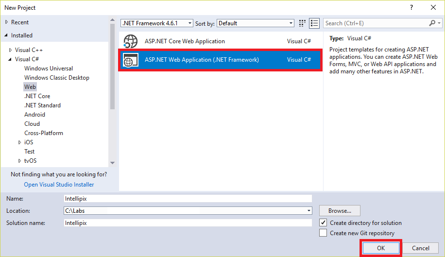

    _Creating a new Web Application project_

1. In the "New ASP.NET Web Application" dialog, make sure **MVC** is selected. Then click **OK**.

    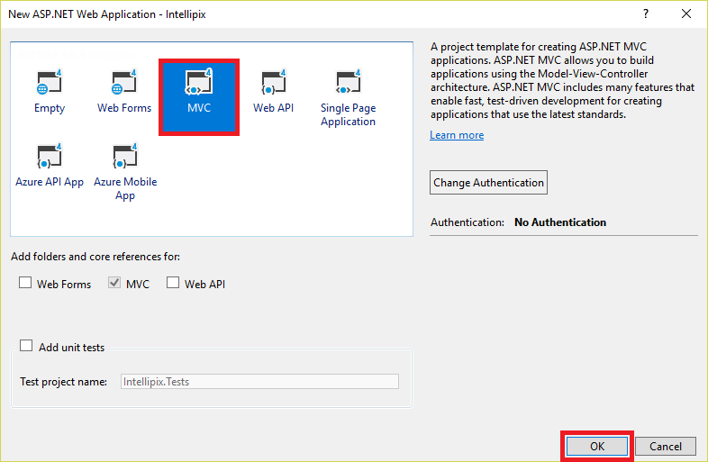

    _Creating a new ASP.NET MVC project_

1. Take a moment to review the project structure in Solution Explorer. Among other things, there's a folder named "Controllers" that holds the project's MVC controllers, and a folder named "Views" that holds the project's views. You'll be working with assets in these folders and others as you implement the application.

	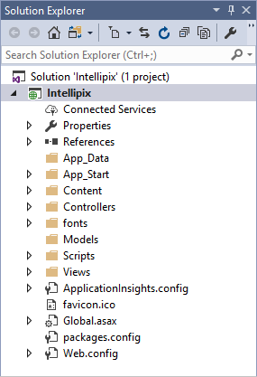

	_The project shown in Solution Explorer_

1. Use Visual Studio's **Debug -> Start Without Debugging** command (or simply press **Ctrl+F5**) to launch the application in your browser. Here's how the application looks in its present state:

    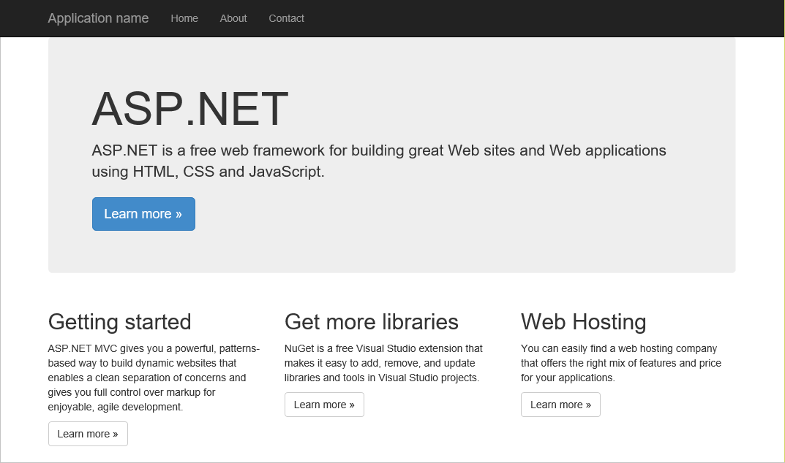

    _The initial application_

1. Close the browser and return to Visual Studio. In Solution Explorer, right-click the **Intellipix** project and select **Manage NuGet Packages...**. Click **Browse**. Then type "imageresizer" (without quotation marks) into the search box and select the NuGet package named **ImageResizer**. Finally, click **Install** to install the latest stable version of the package. ImageResizer contains APIs that you will use to create image thumbnails from the images uploaded to the app. OK any changes and accept any licenses presented to you.

    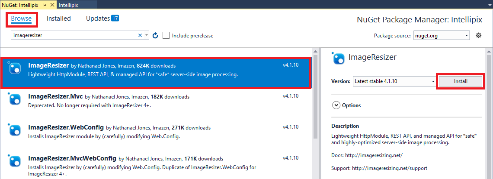

    _Installing ImageResizer_

	NuGet is a free and open-source package manager for Microsoft development platforms. It provides access to thousands of libraries, or *packages*, containing code to perform a variety of tasks. It is integrated into Visual Studio, which makes it easy to add NuGet packages to your project and make a lot of things happen without writing a lot of code.

1. Repeat this process to add the NuGet package named **WindowsAzure.Storage** to the project. This package contains APIs for accessing Azure Storage from .NET applications. OK any changes and accept any licenses presented to you.

    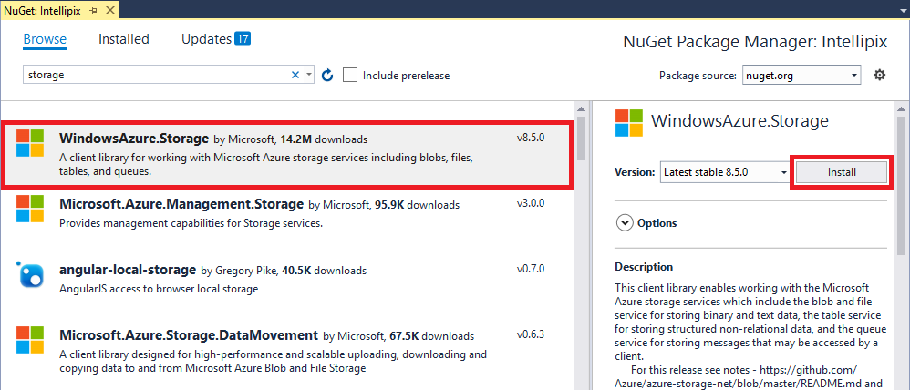

    _Installing WindowsAzure.Storage_

1. Open **Web.config** and add the following statement to the ```<appSettings>``` section, replacing ACCOUNT_NAME with the name of the storage account you created in Exercise 1, and ACCOUNT_KEY with the access key you saved in Exercise 1, Step 10.

	```xml
	<add key="StorageConnectionString" value="DefaultEndpointsProtocol=https;AccountName=ACCOUNT_NAME;AccountKey=ACCOUNT_KEY" />
	```

1. Open the file named **_Layout.cshtml** in the project's "Views/Shared" folder. On line 19, change "Application name" to "Intellipix." Here is the edited line of code:

	```C#
	@Html.ActionLink("Intellipix", "Index", "Home", new { area = "" }, new { @class = "navbar-brand" })
	```

	In an ASP.NET MVC project, **_Layout.cshtml** is a special view that serves as a template for other views. You typically define header and footer content that is common to all views in this file.

1. Right-click the project's "Models" folder and use the **Add -> Class...** command to add a class file named **BlobInfo.cs** to the folder. Then replace the empty ```BlobInfo``` class with the following class definition:

	```C#
	public class BlobInfo
	{
	    public string ImageUri { get; set; }
	    public string ThumbnailUri { get; set; }
	    public string Caption { get; set; }
	}
	```

1. Open **HomeController.cs** in the project's "Controllers" folder and add the following ```using``` statements to the top of the file:

	```C#
	using ImageResizer;
	using Intellipix.Models;
	using Microsoft.WindowsAzure.Storage;
	using Microsoft.WindowsAzure.Storage.Blob;
	using System.Configuration;
	using System.Threading.Tasks;
	using System.IO;
	```

1. Replace the ```Index``` method in **HomeController.cs** with the following implementation:

	```C#
	public ActionResult Index()
	{
	    // Pass a list of blob URIs in ViewBag
	    CloudStorageAccount account = CloudStorageAccount.Parse(ConfigurationManager.AppSettings["StorageConnectionString"]);
	    CloudBlobClient client = account.CreateCloudBlobClient();
	    CloudBlobContainer container = client.GetContainerReference("photos");
	    List<BlobInfo> blobs = new List<BlobInfo>();
	
	    foreach (IListBlobItem item in container.ListBlobs())
	    {
	        var blob = item as CloudBlockBlob;
	
	        if (blob != null)
	        {
	            blobs.Add(new BlobInfo()
	            {
	                ImageUri = blob.Uri.ToString(),
	                ThumbnailUri = blob.Uri.ToString().Replace("/photos/", "/thumbnails/")
	            });
	        }
	    }
	
	    ViewBag.Blobs = blobs.ToArray();
	    return View();
	}
	```

	The new ```Index``` method enumerates the blobs in the "photos" container and passes an array of ```BlobInfo``` objects representing those blobs to the view through ASP.NET MVC's ```ViewBag``` property. In a moment, you will modify the view to enumerate these objects and display a collection of photo thumbnails. The classes used to access your storage account and enumerate the blobs — [CloudStorageAccount](https://docs.microsoft.com/dotnet/api/microsoft.windowsazure.storage.cloudstorageaccount?view=azurestorage-8.1.3), [CloudBlobClient](https://docs.microsoft.com/dotnet/api/microsoft.windowsazure.storage.blob.cloudblobclient?view=azurestorage-8.1.3), and [CloudBlobContainer](https://docs.microsoft.com/dotnet/api/microsoft.windowsazure.storage.blob.cloudblobcontainer?view=azurestorage-8.1.3) — come from the WindowsAzure.Storage package you installed from NuGet.

1. Add the following method to the ```HomeController``` class in **HomeController.cs**:

	```C#
	[HttpPost]
	public async Task<ActionResult> Upload(HttpPostedFileBase file)
	{
	    if (file != null && file.ContentLength > 0)
	    {
	        // Make sure the user selected an image file
	        if (!file.ContentType.StartsWith("image"))
	        {
	            TempData["Message"] = "Only image files may be uploaded";
	        }
	        else
	        {
	            try
	            {
	                // Save the original image in the "photos" container
	                CloudStorageAccount account = CloudStorageAccount.Parse(ConfigurationManager.AppSettings["StorageConnectionString"]);
	                CloudBlobClient client = account.CreateCloudBlobClient();
	                CloudBlobContainer container = client.GetContainerReference("photos");
	                CloudBlockBlob photo = container.GetBlockBlobReference(Path.GetFileName(file.FileName));
	                await photo.UploadFromStreamAsync(file.InputStream);
	
	                // Generate a thumbnail and save it in the "thumbnails" container
	                using (var outputStream = new MemoryStream())
	                {
	                    file.InputStream.Seek(0L, SeekOrigin.Begin);
	                    var settings = new ResizeSettings { MaxWidth = 192 };
	                    ImageBuilder.Current.Build(file.InputStream, outputStream, settings);
	                    outputStream.Seek(0L, SeekOrigin.Begin);
	                    container = client.GetContainerReference("thumbnails");
	                    CloudBlockBlob thumbnail = container.GetBlockBlobReference(Path.GetFileName(file.FileName));
	                    await thumbnail.UploadFromStreamAsync(outputStream);
	                }
	            }
	            catch (Exception ex)
	            {
	                // In case something goes wrong
	                TempData["Message"] = ex.Message;
	            }
	        }
	    }
	
	    return RedirectToAction("Index");
	}
	```

	This is the method that's called when you upload a photo. It stores each uploaded image as a blob in the "photos" container, creates a thumbnail image from the original image using the ImageResizer package you installed in the previous lab, and stores the thumbnail image as a blob in the "thumbnails" container.

1. Open **Index.cshmtl** in the project's "Views/Home" folder and replace its contents with the following code and markup:

	```HTML
	@{
	    ViewBag.Title = "Intellipix Home Page";
	}
	
	@using Intellipix.Models
	
	<div class="container" style="padding-top: 24px">
	    <div class="row">
	        <div class="col-sm-8">
	            @using (Html.BeginForm("Upload", "Home", FormMethod.Post, new { enctype = "multipart/form-data" }))
	            {
	                <input type="file" name="file" id="upload" style="display: none" onchange="$('#submit').click();" />
	                <input type="button" value="Upload a Photo" class="btn btn-primary btn-lg" onclick="$('#upload').click();" />
	                <input type="submit" id="submit" style="display: none" />
	            }
	        </div>
	        <div class="col-sm-4 pull-right">
	        </div>
	    </div>
	
	    <hr />
	
	    <div class="row">
	        <div class="col-sm-12">
	            @foreach (BlobInfo blob in ViewBag.Blobs)
	            {
	                
	            }
	        </div>
	    </div>
	</div>
	
	@section scripts
	{
	    <script type="text/javascript" language="javascript">
	        if ("@TempData["Message"]" !== "") {
	            alert("@TempData["Message"]");
	        }
	    </script>
	}
	```

	The language used here is [Razor](http://www.asp.net/web-pages/overview/getting-started/introducing-razor-syntax-c), which lets you embed executable code in HTML markup. The ```@foreach``` statement in the middle of the file enumerates the ```BlobInfo``` objects passed from the controller in ```ViewBag``` and creates HTML `````` elements from them. The ```src``` property of each element is initialized with the URI of the blob containing the image thumbnail.

1. Save your changes and press **Ctrl+F5** to launch the application in your browser. Then click the **Upload a Photo** button and upload one of the images found in the "photos" folder of the [resources that accompany this lab](https://a4r.blob.core.windows.net/public/cs-storage-resources.zip). Confirm that a thumbnail version of the photo appears on the page:

    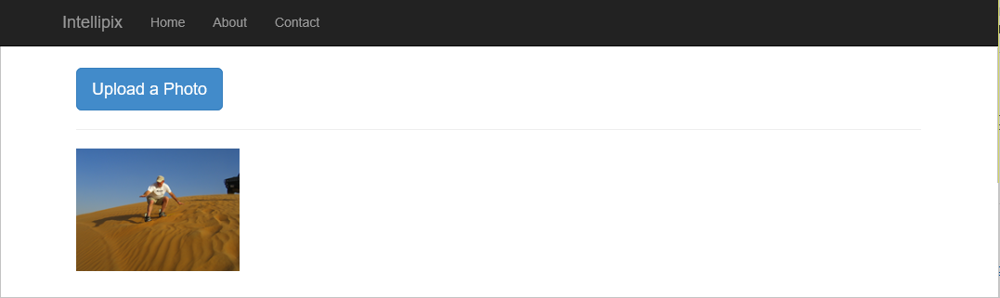

    _Intellipix with one photo uploaded_

1. Upload a few more images from the "photos" folder. Confirm that they appear on the page, too:

    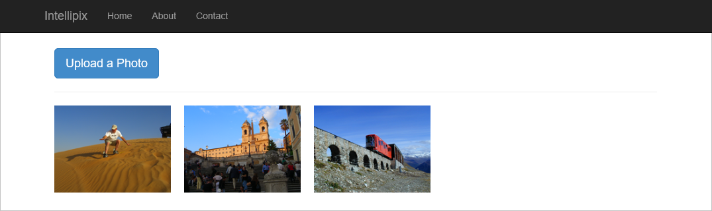

    _Intellipix with three photos uploaded_

1. Do a **View Source** in your browser to view the source for the page. Find the `````` elements representing the image thumbnails. Observe that the URLs assigned to the images refer **directly to blobs in blob storage**. This is possible because you set the containers' **Public access level** to **Blob**, which makes the blobs inside them publicly accessible.

	> What would happen if the containers were private? If you're not sure, try it and see. Temporaily change the "thumbnails" container's public access level to **Private** in the Azure Portal. Then refresh the Intellipix page in your browser and see what happens.

1. Return to the Microsoft Azure Storage Explorer (or restart if it you didn't leave it running) and click the "photos" container under the storage account you created in Exercise 1. The number of blobs in the container should equal the number of photos you uploaded. Double-click one of the blobs to download it and see the image stored in the blob.

    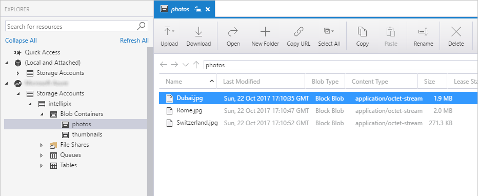

    _Contents of the "photos" container_

1. Open the "thumbnails" container in Storage Explorer. How many blobs do you see there? Open one of the blobs to see what's inside. These are the thumbnail images generated from the image uploads.

The app doesn't yet offer a way to view the original images that you uploaded. Ideally, clicking an image thumbnail should display the original image. Let's add that feature before proceeding further. 

<a name="Exercise4"></a>
## Exercise 4: Add a lightbox for viewing photos

In this exercise, you will use a free, open-source JavaScript library to add a lightbox viewer enabling users to see the original images that they uploaded (rather than just the image thumbnails). The files are provided for you in the resources that accompany this lab. All you have to do is integrate them into the project and make a minor modification to **Index.cshtml**.

1. In Solution Explorer, right-click the project's "Scripts" folder and use the **Add -> Existing Item...** command to import **lightbox.js** from the "scripts" folder in the lab resources.

1. Right-click the project's "Content" folder and use the **Add -> Existing Item...** command to import **lightbox.css** from the "css" folder in the lab resources.

1. Right-click the Intellipix project in Solution Explorer and use the **Add -> New Folder** command to add a folder named "Images" to the project.

1. Right-click the "Images" folder and use the **Add -> Existing Item...** command to import the four images from the "images" folder in the lab resources.

1. Open **BundleConfig.cs** in the project's "App_Start" folder. Add the following statement to the ```RegisterBundles``` method in **BundleConfig.cs**:

	```C#
	bundles.Add(new ScriptBundle("~/bundles/lightbox").Include(
              "~/Scripts/lightbox.js"));
	```

1. In the same method, find the statement that creates a ```StyleBundle``` from "~/Content/css" and add **lightbox.css** to the list of style sheets in the bundle. Here is the modified statement:

	```C#
	bundles.Add(new StyleBundle("~/Content/css").Include(
              "~/Content/bootstrap.css",
              "~/Content/site.css",
              "~/Content/lightbox.css"));
	```

1. Open **_Layout.cshtml** in the project's "Views/Shared" folder and add the following statement just before the ```@RenderSection``` statement near the bottom:

	```C#
	@Scripts.Render("~/bundles/lightbox")
	```

1. The final task is to incorporate the lightbox viewer into the home page. To do that, open **Index.cshtml** (it's in the project's "Views/Home" folder) and replace the ```@foreach``` loop with this one:

	```HTML
	@foreach (BlobInfo blob in ViewBag.Blobs)
	{
	    <a href="@blob.ImageUri" rel="lightbox" title="@blob.Caption">
	        
	    </a>
	}
	```

1. Save your changes and press **Ctrl+F5** to launch the application in your browser. Then click one of the images you uploaded earlier. Confirm that a lightbox appears showing an enlarged view of the image.

    

    _An enlarged image_

1. Click the **X** in the lower-right corner of the lightbox to dismiss it.

Now you have a way to view the images you uploaded. The next step is to do more with those images.

<a name="Exercise5"></a>
## Exercise 5: Use Cognitive Services to generate metadata

Now comes the fun part: using [Microsoft Cognitive Services](https://www.microsoft.com/cognitive-services/) to generate captions and search keywords for the photos you upload. Cognitive Services is a set of intelligence APIs that you can call from your apps. Among the more than 25 APIs it offers are the [Computer Vision API](https://www.microsoft.com/cognitive-services/en-us/computer-vision-api) for distilling actionable information from images, and the [Text Analytics API](https://www.microsoft.com/cognitive-services/en-us/text-analytics-api) for extracting sentiments and other information from text (for example, Twitter feeds). These APIs make it possible to build smart apps that would have been impossible just a few short years ago. And they're available for you to begin using today.

In this exercise, you will use the Computer Vision API to generate a caption for each image that is uploaded, as well as keywords describing the contents of the image. You will store this data in metadata attached to each blob in the "photos" container.

1. Begin by using the Azure Storage Explorer to delete the blobs in the "photos" container and the "thumbnails" container. (Do not delete the containers themselves.) This will allow you to start fresh with a new batch of images to process with the Computer Vision API.

1. In the Azure Portal, click **+ Create a resource**, followed by **AI + Machine Learning** and **Computer Vision**.

    

    _Creating a new Computer Vision API subscription_

1. Type "vision-api-key" into the **Name** box and select **F0** as the **Pricing tier**. Select the same **Location** that you selected for the storage account in [Exercise 1](#Exercise1). Under **Resource group**, select **Use existing** and select the "IntellipixResources" resource group. Check the **I confirm** box, and then click **Create**.

    

    _Subcribing to the Computer Vision API_

1. Return to the blade for the "IntellipixResources" resource group and click the Computer Vision API subscription that you just created.

    

    _Opening the Computer Vision API subscription_

1. Copy the URL under **Endpoint** into your favorite text editor so you can easily retrieve it in a moment. Then click **Show access keys**.

    

    _Viewing the access keys_

1. Click the **Copy** button to the right of **KEY 1** to copy the access key to the clipboard.

    

    _Copying the access key_

1. Return to Visual Studio. Open the **Web.config** file at the root of the project and add the following statements to the ```<appSettings>``` section of the file, replacing VISION_KEY with the key you saved in the previous step, and VISION_ENDPOINT with the URL you saved in the step before that:

	```xml
    <add key="SubscriptionKey" value="VISION_KEY" />
	<add key="VisionEndpoint" value="VISION_ENDPOINT" />
	```

1. If the endpoint URL you just added to **Web.config** doesn't end with "/vision/v1.0", add it. The complete URL should look something like this: https://eastus.api.cognitive.microsoft.com/vision/v1.0.

1. In Solution Explorer, right-click the project and use the **Manage NuGet Packages...** command to install a package named **Microsoft.Azure.CognitiveServices.Vision.ComputerVision**. This package contains types for calling the Computer Vision API. As usual, approve any changes and licenses that are presented to you.

    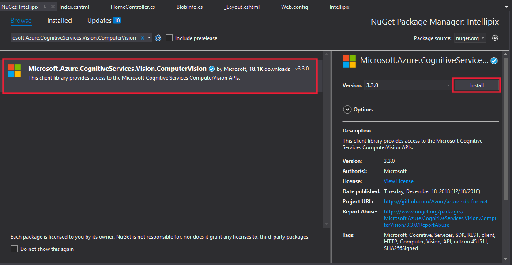

    _Installing Microsoft.Azure.CognitiveServices.Vision.ComputerVision_

1. Open **HomeController.cs** in the project's "Controllers" folder and add the following ```using``` statement at the top of the file:

	```C#
	using Microsoft.Azure.CognitiveServices.Vision.ComputerVision;
    using Microsoft.Azure.CognitiveServices.Vision.ComputerVision.Models;
	```

1. Add the following statements to the ```Upload``` method, immediately after the block of code that begins with the comment "Generate a thumbnail and save it in the thumbnails container." This code passes the URL of the blob containing the image that was uploaded to the Computer Vision API, and requests that Computer Vision generate a description for the image. In addition to generating a description, the Computer Vision API also generates a list of keywords describing what it sees in the image. Your code stores the computer-generated description and the keywords in the blob's metadata so they can be retrieved later on.

	```C#
    // Submit the image to Azure's Computer Vision API
    ComputerVisionClient vision = new ComputerVisionClient(
        new ApiKeyServiceClientCredentials(ConfigurationManager.AppSettings["SubscriptionKey"]),
        new System.Net.Http.DelegatingHandler[] { });
    vision.Endpoint = ConfigurationManager.AppSettings["VisionEndpoint"];

    VisualFeatureTypes[] features = new VisualFeatureTypes[] { VisualFeatureTypes.Description };
    var result = await vision.AnalyzeImageAsync(photo.Uri.ToString(), features);

    // Record the image description and tags in blob metadata
    photo.Metadata.Add("Caption", result.Description.Captions[0].Text);

    for (int i = 0; i < result.Description.Tags.Count; i++)
    {
        string key = String.Format("Tag{0}", i);
        photo.Metadata.Add(key, result.Description.Tags[i]);
    }

    await photo.SetMetadataAsync();
	```

1. Replace the ```foreach``` block in the ```Index``` method with the following statements:

	```C#
    foreach (IListBlobItem item in container.ListBlobs())
    {
        var blob = item as CloudBlockBlob;
    
        if (blob != null)
        {
            blob.FetchAttributes(); // Get blob metadata
            var caption = blob.Metadata.ContainsKey("Caption") ? blob.Metadata["Caption"] : blob.Name;
    
            blobs.Add(new BlobInfo()
            {
                ImageUri = blob.Uri.ToString(),
                ThumbnailUri = blob.Uri.ToString().Replace("/photos/", "/thumbnails/"),
                Caption = caption
            });
        }
    }
	```

	The modified ```foreach``` block calls [CloudBlockBlob.FetchAttributes](https://msdn.microsoft.com/library/microsoft.windowsazure.storage.blob.cloudblockblob.fetchattributes(v=azure.10).aspx) to fetch the metadata for the blob. Then it extracts the computer-generated description from the metadata and adds it to the ```BlobInfo``` object passed to the view.

1.  Save your changes and press **Ctrl+F5** to launch the application in your browser. Upload a few images from the "photos" folder in the lab resources.

1. Hover the cursor over one of the thumbnails. Confirm that a tooltip window appears containing the computer-generated caption for the image.

    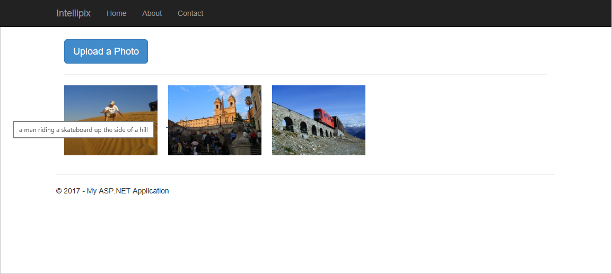

    _The computer-generated caption_

1. Click one of the thumbnails to display the original image in a lightbox. Confirm that the computer-generated caption appears at the bottom of the lightbox. Then dismiss the lightbox.

    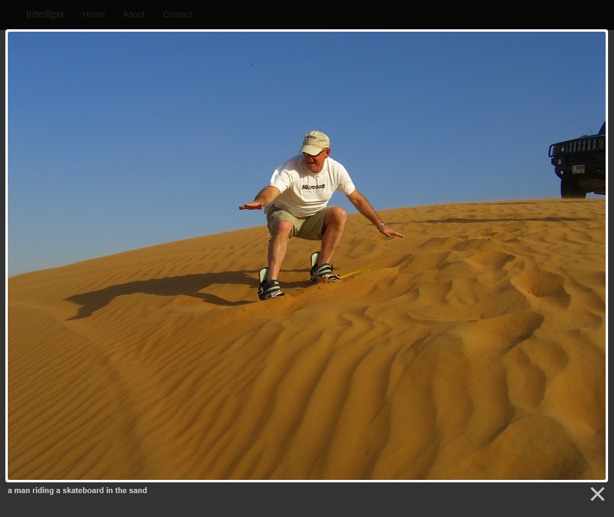

    _Lightbox with computer-generated caption_

1. Want to see where the metadata generated by the Computer Vision API is stored? Use the Azure Storage Explorer to open the "photos" container. Right-click any of the blobs in the container and select **Properties**. In the ensuing dialog, you'll see the metadata attached to the blob. Each metadata item is a key-value pair. The computer-generated image description is stored in the item named "Caption," while the metadata items named "Tag0," "Tag1," and so on hold the additional keywords created for the image. When you're finished, click **Cancel** to close the dialog.

    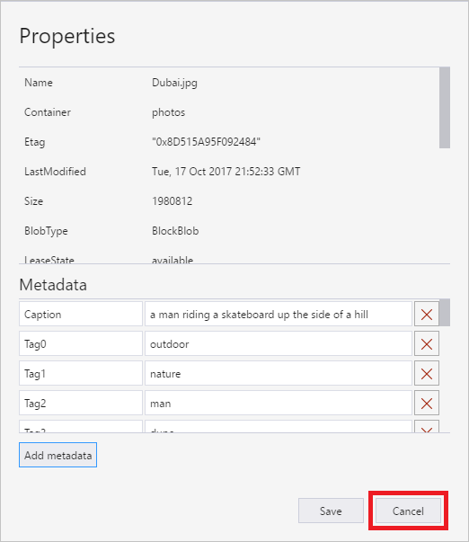

    _Blob metadata_

In the next exercise, you'll put the extra keywords to work by adding search to the app.

<a name="Exercise6"></a>
## Exercise 6: Add search to the app

In this exercise, you will add a search box to the home page enabling users to do keyword searches on the images that they have uploaded. The keywords are the ones generated by the Computer Vision API and stored in blob metadata.

1. Open **Index.cshtml** in the project's "Views/Home folder" and add the following statements to the empty ```<div>``` element with the ```class="col-sm-4 pull-right"``` attribute:

	```HTML
    @using (Html.BeginForm("Search", "Home", FormMethod.Post, new { enctype = "multipart/form-data", @class = "navbar-form" }))
    {
	    <div class="input-group">
	        <input type="text" class="form-control" placeholder="Search photos" name="term" value="@ViewBag.Search" style="max-width: 800px">
	        <span class="input-group-btn">
	            <button class="btn btn-primary" type="submit">
	                <i class="glyphicon glyphicon-search"></i>
	            </button>
	        </span>
	    </div>
	}
	```

	This code and markup adds a search box and a **Search** button to the home page.

1. Open **HomeController.cs** in the project's "Controllers" folder and add the following method to the ```HomeController``` class:

	```C#
    [HttpPost]
    public ActionResult Search(string term)
    {
        return RedirectToAction("Index", new { id = term });
    }
	```

	This is the method that's called when the user clicks the **Search** button added in the previous step. It refreshes the page and includes a search parameter in the URL.

1. Replace the ```Index``` method with the following implementation:

	```C#
    public ActionResult Index(string id)
    {
        // Pass a list of blob URIs and captions in ViewBag
        CloudStorageAccount account = CloudStorageAccount.Parse(ConfigurationManager.AppSettings["StorageConnectionString"]);
        CloudBlobClient client = account.CreateCloudBlobClient();
        CloudBlobContainer container = client.GetContainerReference("photos");
        List<BlobInfo> blobs = new List<BlobInfo>();

        foreach (IListBlobItem item in container.ListBlobs())
        {
            var blob = item as CloudBlockBlob;

            if (blob != null)
            {
                blob.FetchAttributes(); // Get blob metadata

                if (String.IsNullOrEmpty(id) || HasMatchingMetadata(blob, id))
                {
                    var caption = blob.Metadata.ContainsKey("Caption") ? blob.Metadata["Caption"] : blob.Name;

                    blobs.Add(new BlobInfo()
                    {
                        ImageUri = blob.Uri.ToString(),
                        ThumbnailUri = blob.Uri.ToString().Replace("/photos/", "/thumbnails/"),
                        Caption = caption
                    });
                }
            }
        }

        ViewBag.Blobs = blobs.ToArray();
        ViewBag.Search = id; // Prevent search box from losing its content
        return View();
    }
	```

	Observe that the ```Index``` method now accepts a parameter ("id") that contains the value the user typed into the search box. An empty or missing "id" parameter indicates that all the photos should be displayed.

1. Add the following helper method to the ```HomeController``` class:

	```C#
    private bool HasMatchingMetadata(CloudBlockBlob blob, string term)
    {
        foreach (var item in blob.Metadata)
        {
            if (item.Key.StartsWith("Tag") && item.Value.Equals(term, StringComparison.InvariantCultureIgnoreCase))
                return true;
        }

        return false;
    }
	```

	This method is called by the ```Index``` method to determine whether the metadata keywords attached to a given image blob contain the search term that the user entered.

1. Launch the application again and upload several photos. **Feel free to upload photos of your own**, not just the ones provided with the lab.

1. Type a keyword such as "river" into the search box. Then click the **Search** button.

    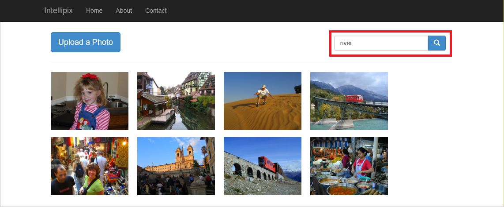

    _Performing a search_

1. Search results will vary depending on what you typed and what images you uploaded. But the result should be a filtered list of images — images whose metadata keywords include all or part of the keyword that you typed.

    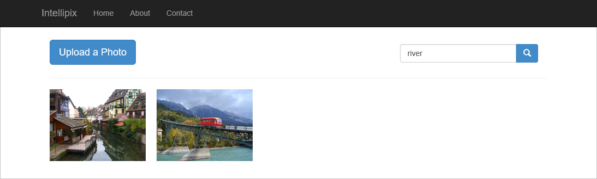

    _Search results_

1. Click the browser's back button to display all of the images again.

You're almost finished, but the final and most important step remains. It is time to deploy the app to the cloud.

<a name="Exercise7"></a>
## Exercise 7: Deploy the app to Azure

In this exercise, you will deploy the app to Azure from Visual Studio. You will even allow Visual Studio to create an Azure Web App for you, preventing you from having to go into the Azure Portal and create it separately.

1. Right-click the project in Solution Explorer and select **Publish...** from the context menu. Make sure **Microsoft Azure App Service** and **Create New** are selected, and then click the **Publish** button.

    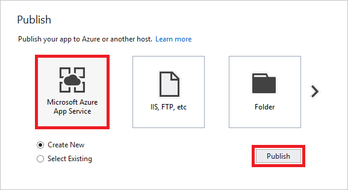

    _Publishing the app_

1. In the ensuing dialog, select the "IntellipixResources" resource group under **Resource Group**. Click the **New...** button next to "App Service Plan" and create a new App Service Plan in the same location you selected for the storage account in [Exercise 1](#Exercise1), accepting the defaults everywhere else. Finish up by clicking the **Create** button.

    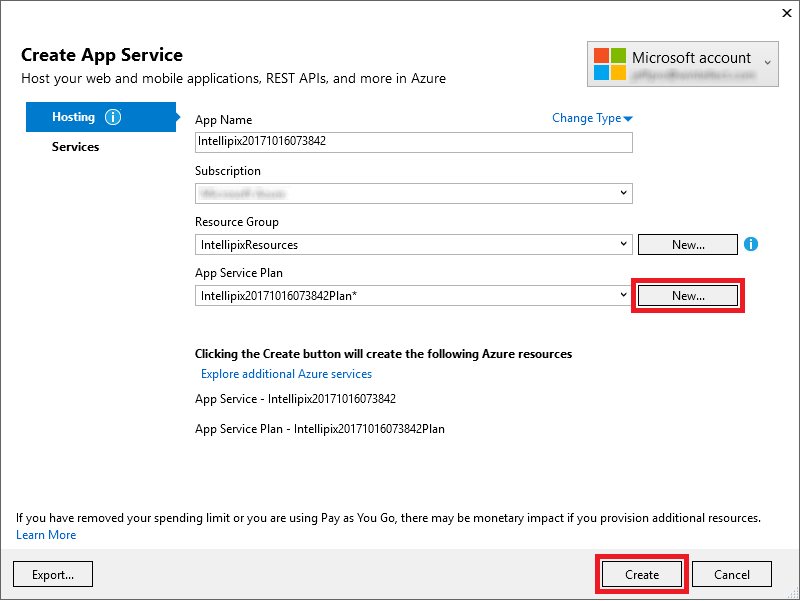

    _Creating an Azure Web App_

1. After a few moments, the app will appear in a browser window. Note the URL in the address bar. The app is no longer running locally; it's on the Web, where it's reachable by everyone.

    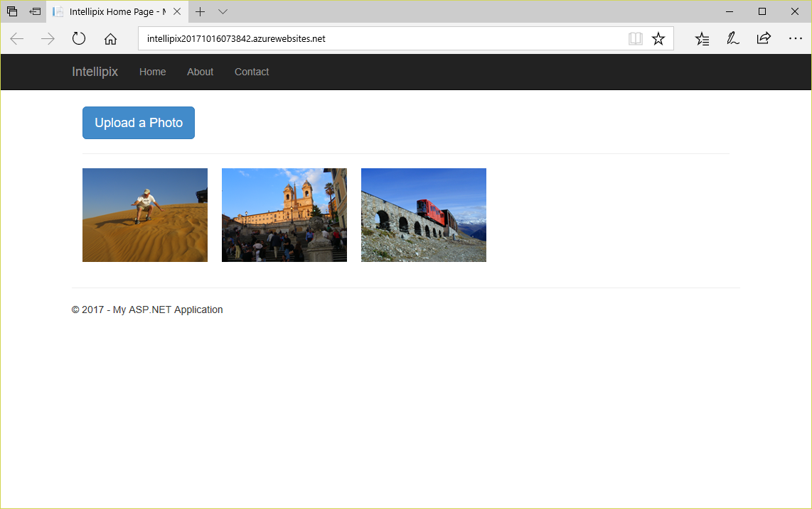

    _The finished product!_

If you make changes to the app and want to push the changes out to the Web, simply go through the publish process again. Of course, you can still test your changes locally before publishing to the Web.

<a name="Summary"></a>
## Summary

When you're finished using the site, you should delete the resource group containing it. Deleting the resource group deletes all of the resources inside it (including the storage account, the blobs uploaded to it, and the App Service), removes all traces of this lab from your account, and prevents any further charges from being incurred for it. To delete the resource group, simply open the resource-group blade in the portal and click **Delete resource group** at the top of the blade. You will be asked to type the resource group's name to confirm that you want to delete it, because once deleted, a resource group can't be recovered.

There is much more that you could do to develop Intellipix and to leverage Azure even further. For example, you could add support for authenticating users and deleting photos, and rather than force the user to wait for Cognitive Services to process a photo following an upload, you could use [Azure Functions](https://azure.microsoft.com/en-us/services/functions/) to call the Computer Vision API asynchronously each time an image is added to blob storage. You could even use Cognitive Services to detect faces in the photos and analyze the emotions depicted by those faces. With the cloud as your platform, the sky is the limit (pun intended).

----

Copyright 2017 Microsoft Corporation. All rights reserved. Except where otherwise noted, these materials are licensed under the terms of the MIT License. You may use them according to the license as is most appropriate for your project. The terms of this license can be found at https://opensource.org/licenses/MIT.