<a name="HOLTitle"></a>

# Building a Tamper-Proof Ratings System with Blockchain on Azure #

[Blockchain](https://en.wikipedia.org/wiki/Blockchain) is one of the world's most talked-about technologies, and one that has the potential to fundamentally change the way we use the Internet. Originally designed for [Bitcoin](https://en.wikipedia.org/wiki/Bitcoin), Blockchain remains the technology behind that digital currency but is not limited to applications involving virtual money. In the words of Dan Tapscott, author, TED speaker, and Executive Director of the [Blockchain Research Institute](https://www.blockchainresearchinstitute.org/), "Blockchain is an incorruptible digital ledger of economic transactions that can be programmed to record not just financial transactions, but virtually everything of value." One of the more inventive uses for Blockchain is to implement tamper-proof digital voting systems, a concept that is being actively explored [in the U.S. and abroad](https://venturebeat.com/2016/10/22/blockchain-tech-could-fight-voter-fraud-and-these-countries-are-testing-it/).

Blockchain gets its name from the manner in which it stores data. Transactions such as a transfer of money from one party to another or a vote cast for a political candidate are stored in cryptographically sealed blocks. Blocks are joined together into chains ("blockchains"), with each block in the chain containing a hash of the previous block. A blockchain acts like an electronic ledger, with blocks replicated across countless computers (nodes) in a Blockchain network rather than stored in one place. This decentralization means that a blockchain has no single point of failure and is controlled by no single entity. The latter is especially important for a system whose primary goal is to allow private transactions to take place without involving a "trusted" third party such as a bank.

Anyone can build a Blockchain network and use it to host blockchains. Microsoft Azure makes it incredibly simple to do both by supporting Blockchain-as-a-Service. A few button clicks in the Azure Portal are sufficient to deploy a network of virtual machines provisioned with popular Blockchain implementations such as [Ethereum](https://www.ethereum.org/), [Corda](https://www.corda.net/), or [Hyperledger Fabric](https://www.hyperledger.org/projects/fabric).

Ethereum was one of the first general-purpose Blockchain implementations. The software is open-source and is the basis for Ethereum's own cryptocurrency known as [Ether](https://www.ethereum.org/ether). You can deploy Ethereum networks of your own and use its Blockchain implementation however you wish. Among other features, Ethereum supports [smart contracts](https://en.wikipedia.org/wiki/Smart_contract), which are written in languages such as [Solidity](https://en.wikipedia.org/wiki/Solidity) and then compiled into bytecode and deployed to the blockchain for execution.

In this lab, you will deploy an Ethereum network on Azure and create a custom blockchain. Then you will build a Web site named "Profrates" for rating professors that stores the comments and ratings that users enter in the blockchain. Along the way, you will get first-hand experience running Blockchain networks on Azure, as well as writing smart contracts for Ethereum and using them to store digital records in such a way that they cannot be altered.

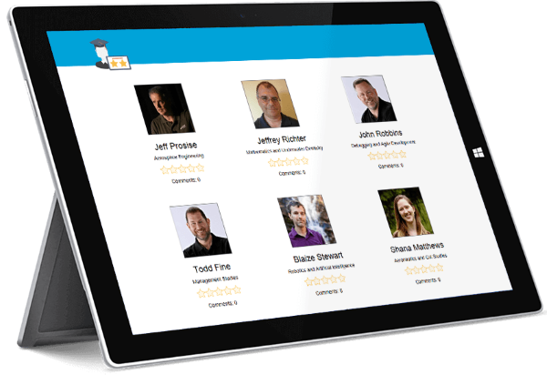

<a name="Objectives"></a>
### Objectives ###

In this hands-on lab, you will learn how to:

- Deploy an Ethereum blockchain network on Azure
- Write smart contracts in Solidity
- Deploy smart contracts to Ethereum networks
- Invoke smart contracts from Node.js

<a name="Prerequisites"></a>
### Prerequisites ###

- An active Microsoft Azure subscription. If you don't have one, [sign up for a free trial](http://aka.ms/WATK-FreeTrial).
- [Node.js](https://nodejs.org)

<a name="Cost"></a>
### Cost ###


The cost of this lab is **high**. For an overview of cost ratings, refer to [Explanation of Costs](../../Costs.md).

<a name="Exercises"></a>
## Exercises ##

This hands-on lab includes the following exercises:

- [Exercise 1: Create a blockchain on Azure](#Exercise1)
- [Exercise 2: Unlock the coinbase account](#Exercise2)
- [Exercise 3: Deploy a smart contract](#Exercise3)
- [Exercise 4: Invoke the contract from a Web app](#Exercise4)
- [Exercise 5: Delete the blockchain network](#Exercise5)

Estimated time to complete this lab: **60** minutes.

<a name="Exercise1"></a>
## Exercise 1: Create a blockchain on Azure ##

In this exercise, you will use the Azure Portal to deploy an Ethereum Blockchain network in the cloud. [Ethereum](https://www.ethereum.org/) is a platform for running decentralized applications that rely on smart contracts, and it is offered as a service in Azure. For a great introduction to Ethereum, its history, and its uses, see [What is Ethereum? A Step-by-Step Beginners Guide](https://blockgeeks.com/guides/ethereum/).

1. In your browser, navigate to the [Azure Portal](https://portal.azure.com). If you are asked to sign in, do so using your Microsoft account.

1. In the portal, click **+ Create a resource**, followed by **Blockchain** and **Ethereum Proof-of-Work Consortium**.

    

    _Creating an Ethereum blockchain_

1. Fill in the "Basics" blade as shown below, providing a password that's at least 12 characters long containing a mix of uppercase letters, lowercase letters, numbers, and special characters. Select the region nearest you, and then click **OK**. *Remember the password that you entered, because you will need it in the next exercise*.

    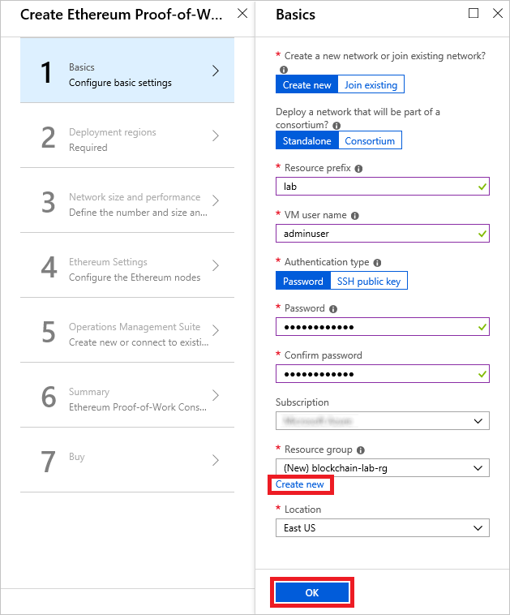

    _Entering basic settings_

1. In the "Deployment regions" blade, make sure **Number of regions** is set to 1 and select the region closest to you. Then click **OK** at the bottom of the blade.

    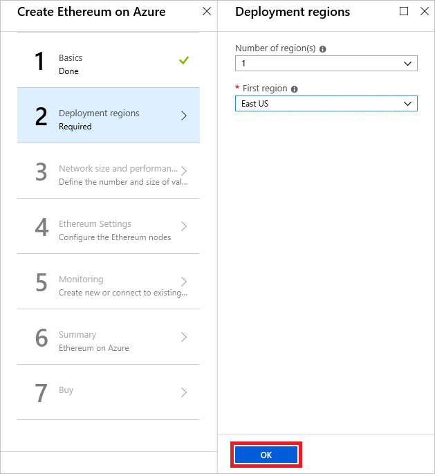

    _Specifying deployment regions_

1. Click **OK** at the bottom of the "Network Size and Performance" blade to accept the default settings for VM sizes, number of nodes, and so on.

1. In the "Ethereum Settings" blade, set the member ID to **123** and enter a password in four places as the Ethereum account password and private key passphrase. Then click **OK**. Once again, *remember the password that you entered, because you will need it in the next exercise*.

    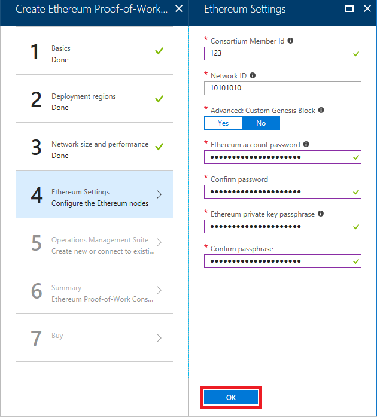

    _Entering Ethereum settings_

1. Fill in the "OMS" blade as shown below, selecting the region closest to you. Then click **OK**.

    > OMS stands for [Operations Management Suite](https://www.microsoft.com/cloud-platform/operations-management-suite) and is a feature of Azure that allows you to monitor workloads running in the cloud and gain real-time insights into their operation. When you deploy an Ethereum network, Azure automatically connects it to an OMS instance.

    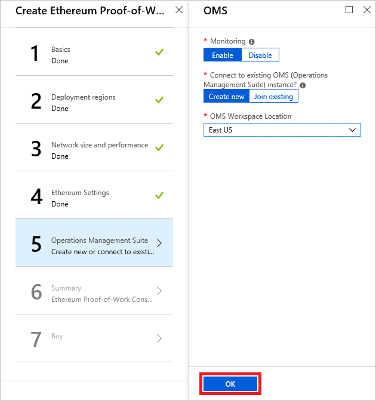

    _Entering OMS settings_

1. Review the settings in the "Summary" blade and click **OK** at the bottom of the blade. Then click the **Create** button at the bottom of the "Create" blade to begin the deployment.

1. Click **Resource groups** in the ribbon on the left. Then click the resource group named "blockchain-lab-rg." Wait until "Deploying" changes to "Succeeded" in the resource-group blade indicating that the Blockchain network and all of its resources have been deployed.

    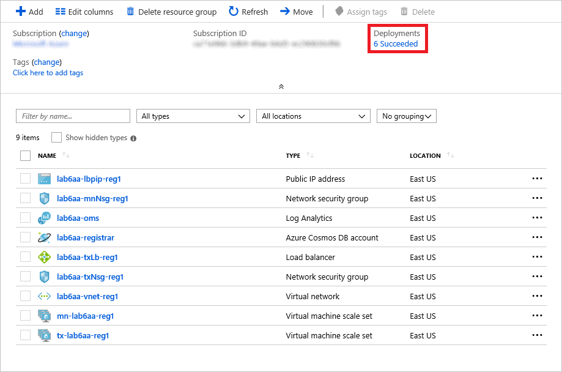

    _Monitoring the deployment_

Deployment will probably take 10 to 15 minutes. You can click the **Refresh** button at the top of the blade to refresh the deployment status. Once the deployment has completed, proceed to the next exercise.

<a name="Exercise2"></a>
## Exercise 2: Unlock the coinbase account ##

When it created the Ethereum network, Azure also created a *coinbase* account to support transactions performed in the blockchain. The name "coinbase" is misleading. It alludes to the fact that Blockchain is often used as the basis for digital currencies. But Blockchain can be used for much more than that, as you are in the process of demonstrating.

Every transaction performed in a blockchain must be "fueled" by an account. This coinbase account will fuel transactions that allow comments and ratings to be recorded in the blockchain. Before the coinbase account can be used, however, it must be unlocked. In this exercise, you will use SSH to connect to the Ethereum network you deployed in the previous exercise and execute a series of commands to unlock the account and retrieve its address.

1. Return to the "blockchain-lab-rg" resource group in the Azure portal. Click **Deployments** in the menu on the left, and then click **microsoft-azure-blockchain**.

    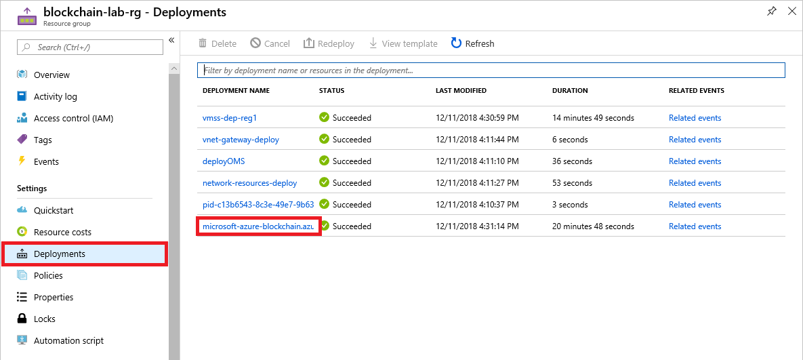

    _Opening the blockchain_

1. Click **Outputs** in the menu on the left, and then click the **Copy** button next to SSH-TO-FIRST-TX-NODE-REGION1 to copy the SSH command to the clipboard.

    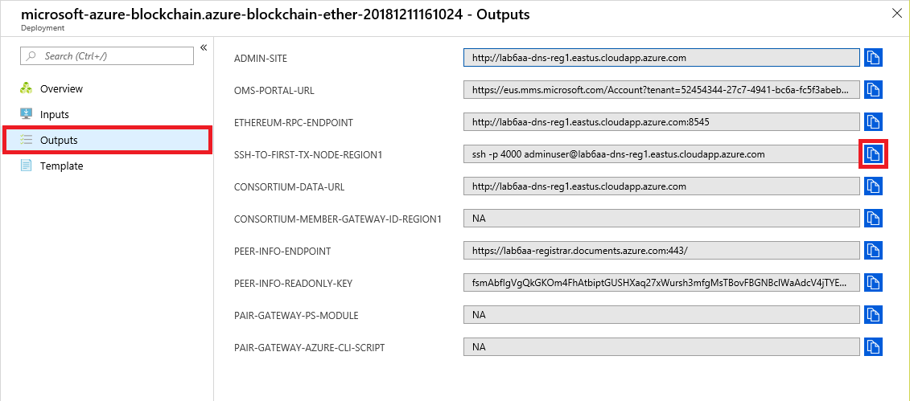

    _Copying the SSH command_

1. Click the **Cloud Shell** button in the toolbar at the top of the portal to open a cloud shell. The Azure cloud shell provides an environment for executing Bash and PowerShell commands without leaving the portal. You can use **Shift+Insert** to paste commands into the cloud shell, and **Ctrl+Insert** to copy text from the cloud shell to the clipboard.

    

    _Opening the Azure cloud shell_

1. Make sure **Bash** is the language selected in the upper-left corner of the cloud shell. Press **Shift+Insert**  to paste the ```ssh``` command that is on the clipboard into the cloud shell. Then press **Enter** to execute the command. If you are prompted with a security warning informing you that the authenticity of the host can't be established and asking if you want to connect anyway, type "yes" and press **Enter**.

1. When prompted for a password, enter the password you entered in Exercise 1, Step 3.

1. Execute the following command in the cloud shell to attach to the first node in the Ethereum network. [geth](https://github.com/ethereum/go-ethereum/wiki/Command-Line-Options), which is short for "go-ethereum," is a multipurpose command for managing Ethereum networks.

    ```shell
    geth attach
    ```

1. Now execute the following command to unlock the coinbase account, substituting the password you entered in Exercise 1, Step 6 for PASSWORD:

    ```shell
    web3.personal.unlockAccount(web3.personal.listAccounts[0],"PASSWORD",28800)
    ```

    This will allow you to perform transactions using the coinbase account for up to 8 hours (28,800 seconds). Make sure that the output from the command is the word "true," as shown below.

    

    _Unlocking the account_

1. Now use the following command to get the address of the coinbase account:

    ```shell
    web3.personal.listAccounts[0]
    ```

    The output will be a hex value similar to this one:

    ```shell
    0xd19cc89f0c9c1bf8280b9c8ec8125bd0e028ee51
    ```

    Copy this address to the clipboard and paste it into a text file so you can easily retrieve it later.

1. Type ```exit``` into the cloud shell to detach from Ethereum.

1. Type ```exit``` again to close the SSH connection.

Now that the coinbase account is unlocked, you are ready to start using the network to execute transactions on the blockchain. To code those transactions, you will create and then deploy a smart contract.

<a name="Exercise3"></a>
## Exercise 3: Deploy a smart contract ##

Ethereum blockchains use smart contracts to broker transactions. A smart contract is a program that runs on blockchain transaction nodes in [Ethereum Virtual Machines](https://themerkle.com/what-is-the-ethereum-virtual-machine/). Ethereum developers often use the popular [Truffle](http://truffleframework.com/) framework to develop smart contracts. In this exercise, you will set up a Truffle development environment, compile a smart contract, and deploy it to the blockchain.

1. If Node.js isn't installed on your computer, go to <https://nodejs.org> and install the latest LTS version for your operating system. If you aren't sure whether Node.js is installed, open a Command Prompt or terminal window and execute the following command:

    ```shell
    node --version
    ```

    If you don't see a Node.js version number, then Node.js isn't installed.

1. If you are using macOS or Linux, open a terminal window. If you are using Windows instead, open a PowerShell window running **as an administrator**. In the terminal or PowerShell window, use the following command to create a directory named "truffle" in the location of your choice:

    ```shell
    mkdir truffle
    ```

1. Now change to the "truffle" directory:

    ```shell
    cd truffle
    ```

1. Use the following command to install Truffle:

    ```shell
    npm install -g truffle
    ```

1. Use the following command to initialize a Truffle project in the current directory. This will download a few Solidity scripts and install them, and create a scaffolding in the "truffle" folder.

    ```shell
    truffle init
    ```

1. Return to the Azure portal and click the **Copy** button to the right of ETHEREUM-RPC-ENDPOINT to copy the endpoint URL to the clipboard. This URL is important, because it allows apps to make JSON-RPC calls to the network to deploy smart contracts and perform other blockchain-related tasks.

    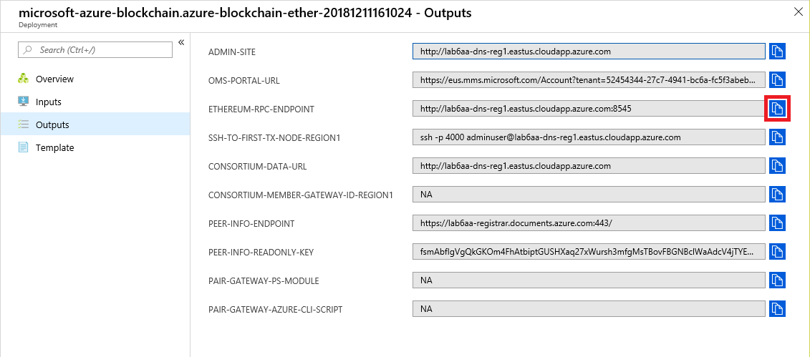

    _Copying the endpoint URL_

1. Use your favorite text or program editor such as [Visual Studio Code](https://code.visualstudio.com/) to open the file named **truffle.js** in the "truffle" folder you created. Replace its contents with the statements below. Then replace ENDPOINT_URL on line 4 with the URL on the clipboard minus the leading "http://" and the trailing port number (for example, ":8545"), and replace PORT_NUMBER on line 5 with the port number you removed from the URL.

	> Visual Studio Code is Microsoft's free, cross-platform source-code editor. It runs great on Windows as well as on Linux and macOS. It also features IntelliSense, integrated Git support, and much more.

    ```javascript
    module.exports = {
      networks: {
        development: {
          host: "ENDPOINT_URL",
          port: PORT_NUMBER,
          network_id: "*", // Match any network id
          gas: 4712388
        }
      }
    };
    ```

    The modified file should look something like this:

    ```javascript
    module.exports = {
      networks: {
        development: {
          host: "labng2-dns-reg1.eastus.cloudapp.azure.com",
          port: 8545,
          network_id: "*", // Match any network id
          gas: 4712388
        }
      }
    };
    ```

    Once these changes are made, save the file.

1. Create a file named **profrates.sol** in the subdirectory named "contracts" (which was created when you ran ```truffle init```) and paste in the following code. Then save the file.

    ```javascript
    pragma solidity ^0.4.16;

    contract profrates {

        event newRating(uint id);

        struct Rating {
            uint professorID;
            string comment;
            uint stars;
        }

        Rating[] ratings;

        function addRating(uint professorID, string comment, uint stars) public returns (uint ratingID) {
            ratingID = ratings.length;
            ratings[ratings.length++] = Rating(professorID, comment, stars);
            emit newRating(ratingID);
        }

        function getRatingsCount() constant public returns (uint count) {
            return ratings.length;
        }

        function getRating(uint index) constant public returns (uint professorID, string comment, uint stars) {
            professorID = ratings[index].professorID;
            comment = ratings[index].comment;
            stars = ratings[index].stars;
        }
    }
    ```

    This code, which constitutes a smart contract, is written in [Solidity](https://en.wikipedia.org/wiki/Solidity), which is similar to JavaScript. Solidity files are compiled to JSON files containing interface definitions as well as bytecode. This contract contains functions for adding a rating to the blockchain, getting a count of ratings recorded in the blockchain, and retrieving individual ratings. A "rating" is defined by the ```Rating``` structure, which contains the ID of the professor to which the rating pertains, a textual comment, and a numeric value from 1 to 5.

1. Create a file named **2_deploy_contracts.js** in the "migrations" subdirectory. Paste the following code into the file and save it:

    ```javascript
    var profrates = artifacts.require("./profrates.sol");

    module.exports = function(deployer) {
        deployer.deploy(profrates);
    };
    ```

    This is the code that deploys the contract to the blockchain.

1. Return to the terminal or PowerShell window and execute the following command to compile the  contract:

    ```shell
    truffle compile
    ```

1. Now use the following command to deploy the contract to the blockchain:

    ```shell
    truffle deploy
    ```

The contract is now present in the blockchain and waiting to be invoked. All you lack is a mechanism for invoking it. In the next exercise, you will invoke the contract from a Web app that runs on Node.js.

<a name="Exercise4"></a>
## Exercise 4: Invoke the contract from a Web app ##

Smart contracts are designed to be used by applications that use the blockchain for secure transactions. In this exercise, you will run a Web app written in Node.js that uses the "profrates" contract. The app allows users to rate professors from one to five stars and enter comments to go with the ratings. The data is stored in the blockchain. The app uses a library named [web3.js](https://github.com/ethereum/web3.js/), which wraps the [Ethereum RPC API](https://ethereumbuilders.gitbooks.io/guide/content/en/ethereum_json_rpc.html) and dramatically simplifies code for interacting with smart contracts. Note that there are also web3 libraries available for other languages, including .NET, Java and Python.

1. Create a directory named "Profrates" to serve as the project directory for the Web site. Open the zip file containing the [source code for the Web site](https://topcs.blob.core.windows.net/public/profrates-resources.zip) and copy its contents into the "Profrates" directory.

1. In a terminal or PowerShell window, ```cd``` to the "Profrates" directory. If you are running Linux or macOS, proceed to Step 3. If you are running Windows, make sure PowerShell is running as an an administrator and execute the following command to install [Windows-Build-Tools](https://www.npmjs.com/package/windows-build-tools), which enables native Node modules to be compiled on Windows:

    ```shell
    npm install -g --production windows-build-tools
    ```

    This command might take 5 minutes or more to complete, so be patient! It must be run as an administrator, so if you closed the PowerShell window that you opened as an administrator in [Exercise 3](#Exercise3), start PowerShell as an administrator to execute the command.

1. Now execute the following command to install the packages listed in the **package.json** file:

    ```shell
    npm install
    ```

1. Open **index.js** in the "Profrates" directory in your favorite text or program editor. Replace ENDPOINT_URL on line 6 with the Ethereum RPC endpoint you obtained from the Azure Portal in Exercise 3, Step 6 (`ETHEREUM-RPC-ENDPOINT`).

1. Replace ACCOUNT_ADDRESS on line 7 with the hex value address you saved in Exercise 2, Step 8.

1. In the PowerShell or terminal window, ```cd``` back to the "truffle" directory that you created in the previous exercise. Then use the following command to list the addresses of all the smart contracts in the project, including the "profrates" contract and some sample contracts that were created when you ran ```truffle init```:

    ```shell
    truffle networks
    ```

    Replace CONTRACT_ADDRESS on line 8 of **index.js** with the "profrates" address in the output. Then save the file. The modified lines should look something like this:

    ```javascript
    var etherUrl = "http://labng2-dns-reg1.eastus.cloudapp.azure.com:8545";
    var account = "0xd19cc89f0c9c1bf8280b9c8ec8125bd0e028ee51";
    var contract = "0x62af894ebf09a58dbdb3f7b1444d767241c83da5";
    ```

1. Use a ```cd``` command to navigate back to the "Profrates" directory. Then execute the following command to start the Web app:

    ```shell
    node index.js
    ```

1. Now open your browser and navigate to <http://localhost:8080.> Confirm that the Web site's home page appears.

    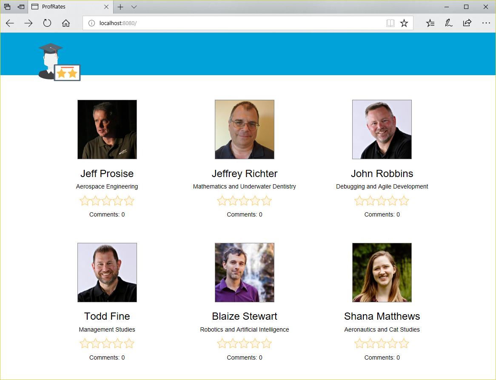

    _The Profrates home page_

1. Click one of the professors on the home page. Type a comment into the comment box and click a star to specify a rating from one to five stars. Then click the **Submit** button.

    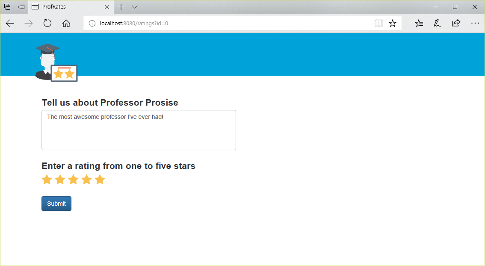

    _Submitting a comment_

1. Confirm that the comment and rating you entered appear at the bottom of the page. Then enter more comments and ratings for this professor.

    Each time you click **Submit**, an asynchronous request is submitted to the Ethereum network to add a block to the blockchain. Inside that block is the comment and star rating that you entered, as well as the ID of the professor to which they pertain.

    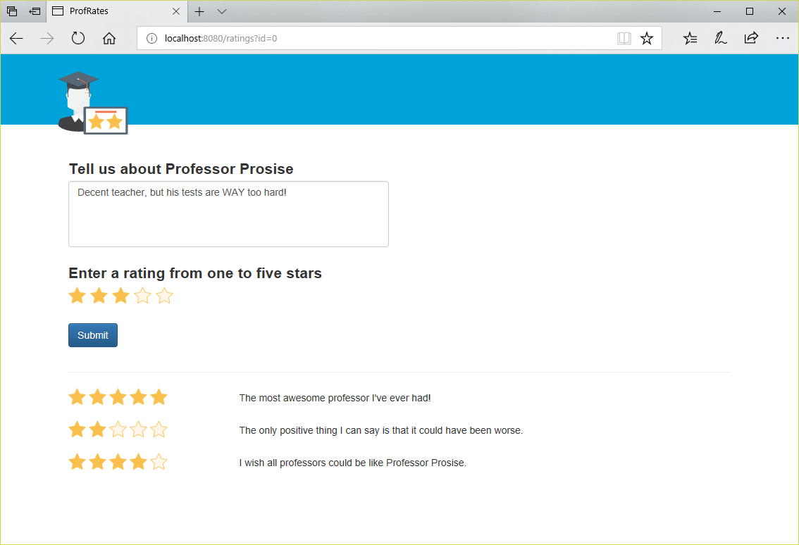

    _Submitting additional comments_

1. Click the image of the graduate in the upper-left corner of the page to return to the home page. Confirm that the comments you entered are reflected on the home page in the comment count and the star rating for the professor that you rated.

    > IMPORTANT: These changes might not show up on the home page for 30 seconds or more. If necessary, refresh the page every few seconds until the changes appear. The delay is due to the fact that the average [block time](https://en.wikipedia.org/wiki/Blockchain#Block_time) on an Ethereum network is around 17 seconds. For more information on block times and the logic behind them, see  [The Mystery Behind Block Time](https://medium.facilelogin.com/the-mystery-behind-block-time-63351e35603a) and [On Slow and Fast Block Times](https://blog.ethereum.org/2015/09/14/on-slow-and-fast-block-times/).

1. Rate some of the other professors and confirm that the ratings "stick," despite the short delay between the time a rating is entered and the time it can be retrieved from the blockchain.

1. Care to see the code in the Web app that adds a rating to the blockchain? Clicking the **Submit** button transmits an AJAX request to a REST method on the server. That method is implemented in **index.js**, which you'll find in the "Profrates" directory:

    ```javascript
    app.post("/add", function (req, res) {
        contractInstance.methods.addRating(parseInt(req.body.professorId), req.body.comment, parseInt(req.body.stars)).send({ from: account, gas:500000 }, function(error, transactionHash) {
            if (error) {
                res.status(500).send(error);
            }
            else {
                res.status = 200;
                res.json({ id: 0 });
            }
        });
    });
    ```

    The real work is performed by the call to ```contractInstance```, which is initialized this way:

    ```javascript
    contractInstance = new web3.eth.Contract(abi, contract);
    ```

    ```web3``` comes from web3 library. ```abi``` is a variable that contains a JSON definition of the contract — the same contract that you implemented in Solidity in the previous exercise — and ```contract``` is the contract address that you retrieved with the ```truffle networks``` command earlier in this exercise.

1. While you have **index.js** open, find the following statement block:

    ```javascript
    app.get("/rating/:index", function (req, res) {
      ...
    });
    ```

    This implements a REST method that retrieves from the blockchain the rating whose index is specified. What contract function is called inside this method to retrieve a block from the blockchain?

The Web site is currently running locally. As an optional exercise, consider deploying it to the cloud as an Azure Web App so you can access it from anywhere. For a hands-on introduction to deploying Web apps as Azure Web Apps, refer to [Deploying a Cognitive Services Web Site to Azure via GitHub](../../Web%20Development/Azure%20Web%20Apps%20and%20GitHub/Deploying%20a%20Cognitive%20Services%20Web%20Site%20to%20Azure%20via%20GitHub.md).

<a name="Exercise5"></a>
## Exercise 5: Delete the blockchain network ##

In this exercise, you will delete the resource group created in [Exercise 1](#Exercise1) when you created the Ethereum network. Deleting the resource group deletes everything in it and prevents any further charges from being incurred for it. Resource groups that are deleted can't be recovered, so be certain you're finished using it before deleting it. However, it is **important not to leave this resource group deployed any longer than necessary** because the resources in it are relatively expensive.

1. Return to the blade for the resource group you created in Exercise 1. Then click the **Delete** button at the top of the blade.

    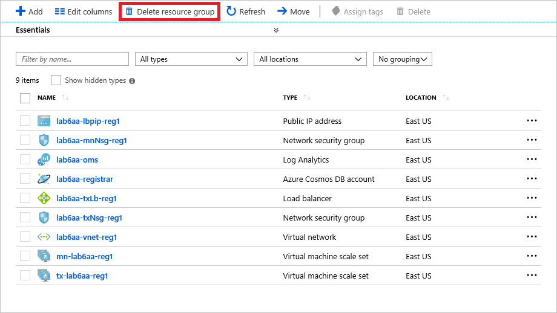

    _Deleting the resource group_

1. For safety, you are required to type in the resource group's name. (Once deleted, a resource group cannot be recovered.) Type the name of the resource group. Then click the **Delete** button to remove all traces of this lab from your Azure subscription.

After a few minutes, the network and all of the associated resources will be deleted. Billing stops when you click **Delete**, so you're not charged for the time required to delete the resources. Similarly, billing doesn't start until the resources are fully and successfully deployed.

<a name="Summary"></a>
## Summary ##

This is just one example of the kinds of apps you can build with Blockchain, and with Ethereum Blockchain networks in particular. It also demonstrates how easily Blockchain networks are deployed on Azure. For more on Azure blockchains and on Ethereum networks and their capabilities, refer to <https://www.ethereum.org/.>

---

Copyright 2018 Microsoft Corporation. All rights reserved. Except where otherwise noted, these materials are licensed under the terms of the MIT License. You may use them according to the license as is most appropriate for your project. The terms of this license can be found at <https://opensource.org/licenses/MIT.>