<a name="HOLTitle"></a>
# Blockchain-as-a-Service on Azure #

[Blockchain](https://en.wikipedia.org/wiki/Blockchain) is one of the world's most talked-about technologies, and one that has the potential to fundamentally change the way we use the Internet. Originally designed for [Bitcoin](https://en.wikipedia.org/wiki/Bitcoin), Blockchain remains the technology behind that digital currency but is not limited to applications involving virtual money. In the words of Dan Tapscott, author, TED speaker, and Executive Director of the [Blockchain Research Institute](https://www.blockchainresearchinstitute.org/), "Blockchain is an incorruptible digital ledger of economic transactions that can be programmed to record not just financial transactions, but virtually everything of value." One of the more inventive uses for Blockchain is to implement tamper-proof digital voting systems, a concept that is being actively explored [in the U.S. and abroad](https://venturebeat.com/2016/10/22/blockchain-tech-could-fight-voter-fraud-and-these-countries-are-testing-it/).

Blockchain gets its name from the manner in which it stores data. Transactions such as a transfer of money from one party to another or a vote cast for a political candidate are stored in cryptographically sealed blocks. Blocks are joined together into chains ("blockchains"), with each block in the chain containing a hash of the previous block. A blockchain acts like an electronic ledger, with blocks replicated across countless computers (nodes) in a Blockchain network rather than stored in one place. This decentralization means that a blockchain has no single point of failure and is controlled by no single entity. The latter is especially important for a system whose primary goal is to allow private transactions to take place without involving a "trusted" third party such as a bank.

Anyone can build a Blockchain network and use it to host blockchains. Microsoft Azure makes it incredibly simple to do both by supporting Blockchain-as-a-Service. A few button clicks in the Azure Portal are sufficient to deploy a network of virtual machines provisioned with popular Blockchain implementations such as [Ethereum](https://www.ethereum.org/), [Corda](https://www.corda.net/), or [Hyperledger Fabric](https://www.hyperledger.org/projects/fabric).

Ethereum was one of the first general-purpose Blockchain implementations. The software is open-source and is the basis for Ethereum's own cryptocurrency known as [Ether](https://www.ethereum.org/ether). You can deploy Ethereum networks of your own and use its Blockchain implementation however you wish. Among other features, Ethereum supports [smart contracts](https://en.wikipedia.org/wiki/Smart_contract), which are written in languages such as [Solidity](https://en.wikipedia.org/wiki/Solidity) and then compiled into bytecode and deployed to the blockchain for execution.

In this lab, you will deploy an Ethereum network on Azure and create your own cryptocurrency named "My Coin" to run on it. The currency will be brokered by a smart contract that allows funds to be transferred between accounts. Along the way, you will get first-hand experience running Blockchain networks on Azure, as well as writing smart contracts for Ethereum and deploying them to the network.

<a name="Objectives"></a>
### Objectives ###

In this hands-on lab, you will learn how to:

- Deploy an Ethereum blockchain network on Azure
- Use MetaMask to create an Ethereum wallet
- Write smart contracts and deploy them to Ethereum networks
- Manipulate Ethereum blockchains using Node.js

<a name="Prerequisites"></a>
### Prerequisites ###

- An active Microsoft Azure subscription. If you don't have one, [sign up for a free trial](http://aka.ms/WATK-FreeTrial).
- [Google Chrome](https://www.google.com/chrome/browser/desktop/index.html)
- [Node.js](https://nodejs.org)

<a name="Cost"></a>
### Cost ###


The cost of this lab is **high**. For an overview of cost ratings, refer to [Explanation of Costs](../../Costs.md).

<a name="Exercises"></a>
## Exercises ##

This hands-on lab includes the following exercises:

- [Exercise 1: Create a Blockchain on Azure](#Exercise1)
- [Exercise 2: Create a wallet](#Exercise2)
- [Exercise 3: Unlock the coinbase account](#Exercise3)
- [Exercise 4: Deploy a smart contract](#Exercise4)
- [Exercise 5: Invoke the contract from an app](#Exercise5)
- [Exercise 6: Delete the Ethereum network](#Exercise6)

Estimated time to complete this lab: **60** minutes.

<a name="Exercise1"></a>
## Exercise 1: Create a blockchain on Azure ##

In this exercise, you will use the Azure Portal to deploy an Ethereum Blockchain network in the cloud. [Ethereum](https://www.ethereum.org/) is a platform for running decentralized applications that rely on smart contracts, and it is offered as a service in Azure. For a great introduction to Ethereum, its history, and its uses, see [What is Ethereum? A Step-by-Step Beginners Guide](https://blockgeeks.com/guides/ethereum/).

1. In your browser, navigate to the [Azure Portal](https://portal.azure.com). If you are asked to sign in, do so using your Microsoft account.

1. In the portal, click **+ Create a resource**, followed by **Blockchain** and **Ethereum Proof-of-Work Consortium**.

	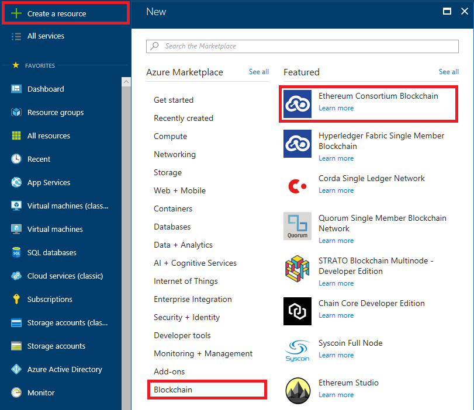

	_Creating an Ethereum blockchain_

1. Fill in the "Basics" blade as shown below, providing a password that's at least 12 characters long containing a mix of uppercase letters, lowercase letters, numbers, and special characters. Select the region nearest you, and then click **OK**. *Remember the password that you entered, because you will need it in the next exercise*.

	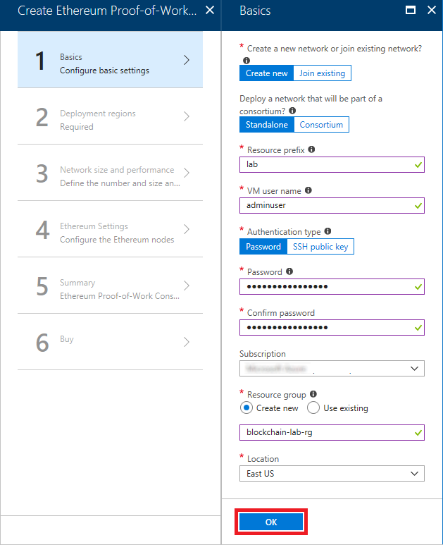

	_Entering basic settings_

1. In the "Deployment regions" blade, make sure **Number of regions** is set to 1 and select the region closest to you. Then click **OK** at the bottom of the blade.

	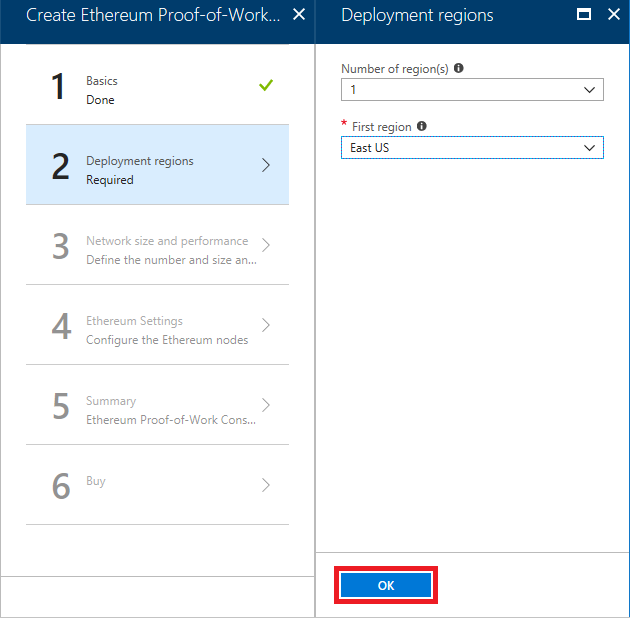

	_Specifying deployment regions_

1. Click **OK** at the bottom of the "Network Size and Performance" blade to accept the default settings for VM sizes, number of nodes, and so on.

1. In the "Ethereum Settings" blade, set the member ID to **123** and enter a password in four places as the Ethereum account password and private key passphrase. Then click **OK**. Once again, *remember the password that you entered, because you will need it in the next exercise*.

	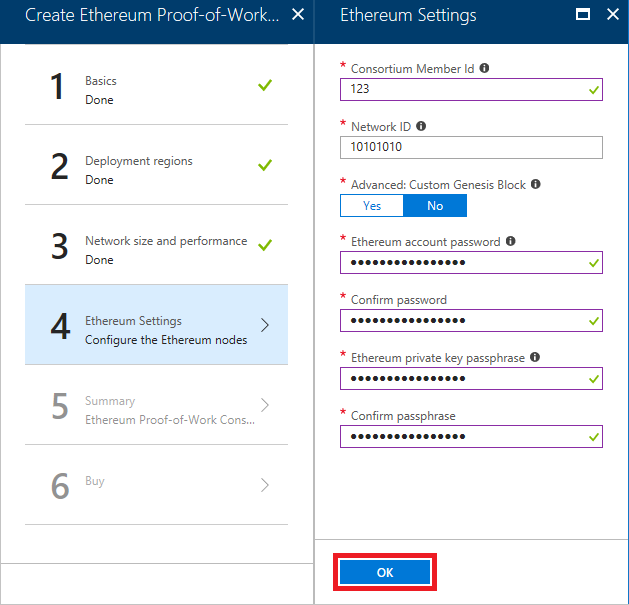

	_Entering Ethereum settings_

1. Fill in the "OMS" blade as shown below, selecting the region closest to you. Then click **OK**.

	> OMS stands for [Operations Management Suite](https://www.microsoft.com/cloud-platform/insight-and-analytics) and is a feature of Azure that allows you to monitor workloads running in the cloud and gain real-time insights into their operation. When you deploy an Ethereum network, Azure automatically connects it to an OMS instance.

	

	_Entering OMS settings_

1. Review the settings in the "Summary" blade and click **OK** at the bottom of the blade. Then click the **Create** button at the bottom of the "Create" blade to begin the deployment.

The deployment will probably take 10 to 15 minutes to complete, but rather than wait for it to finish, proceed to Exercise 2 and begin the process of setting up a wallet. 

<a name="Exercise2"></a>
## Exercise 2: Create a wallet ##

The next task is to set up a wallet and connect it to the Ethereum network deployed in Exercise 1. For this, you'll use a Google Chrome extension called [MetaMask](https://metamask.io/). MetaMask enables you to use the Ether from a Blockchain network on Ethereum-enabled Web sites as well as create an account and seed it with Ether. You won't be using Ether directly, but setting up a wallet is an easy way to create an account on the network that can be used in digital transactions.

1. If Google Chrome isn't installed on your computer, [download it and install it](https://www.google.com/chrome/browser/desktop/index.html) now.

1. Start Chrome, paste the following link into the address bar, and press **Enter**. 

	```
	https://chrome.google.com/webstore/detail/meta-mask/nkbihfbeogaeaoehlefnkodbefgpgknn?hl=en
	```

1. Click **Add to Chrome**.

	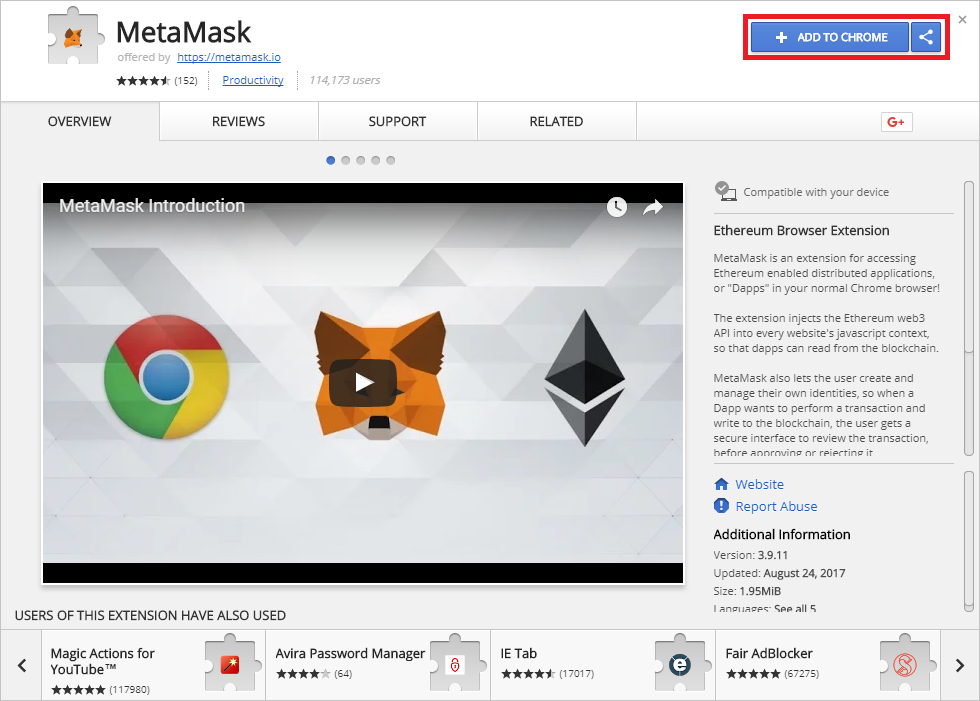

	_Adding MetaMask to Chrome_

1. Click **Add Extension**.

	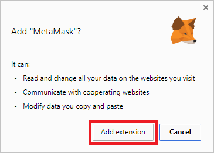

	_Installing the MetaMask extension_

1. Click the MetaMask icon to the right of the address bar, and then click **Accept**.

	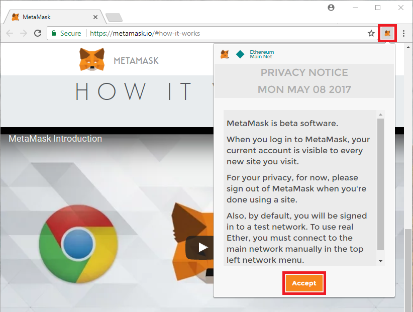

	_Accepting the privacy notice_

1. Scroll to the bottom of the terms of use, and then click **Accept**.

	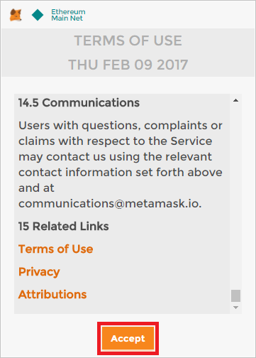

	_Accepting the terms of use_

1. Enter a password, and then click **Create**.

	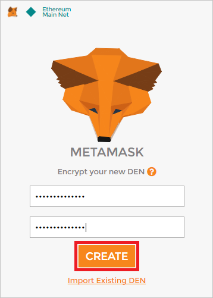

	_Creating a MetaMask account_

1. Copy the 12 words presented to you into a text file and save the file for safekeeping. Then click **I've Copied It Somewhere Safe**.

	> You won't need this recovery information in this lab, but in the real world, these words act as a pass phrase that can be used to restore access to a MetaMask account that you have been locked out of.

	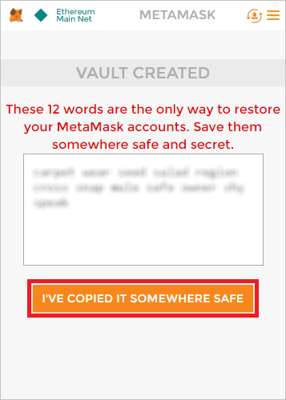

	_Saving MetaMask recovery information_

1. Return to the Azure Portal. Click **Resource groups** in the ribbon on the left, and then click the resource group that you created for the Ethereum network in [Exercise 1](#Exercise1).

	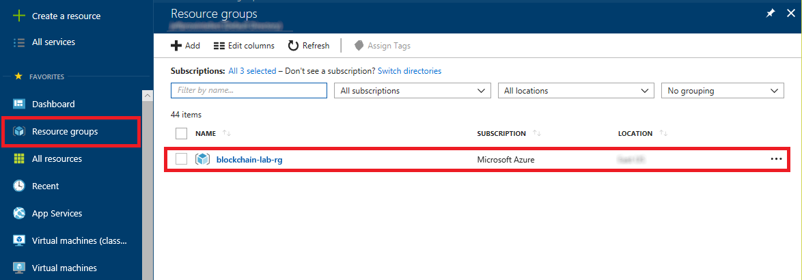

	_Opening the resource group_

1. Make sure all deployments have finished. (If they haven't, periodically click the **Refresh** button at the top of the blade until all deployments have completed.) Then click **Deployments**, followed by **microsoft-azure-blockchain...**.

	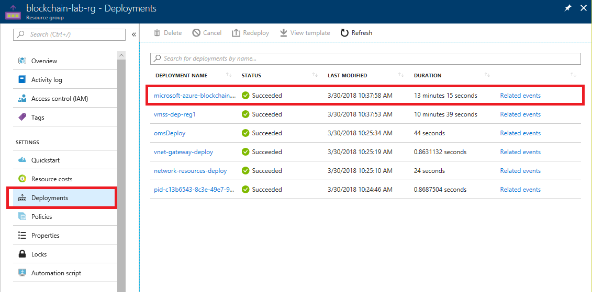

	_Opening the Blockchain resource_
	
1. Click **Outputs** in the menu on the left. Then click the **Copy** button next to ETHEREUM-RPC-ENDPOINT. This URL is very important, because it allows apps to make JSON-RPC calls to the network to deploy smart contracts and perform other blockchain-related tasks.

	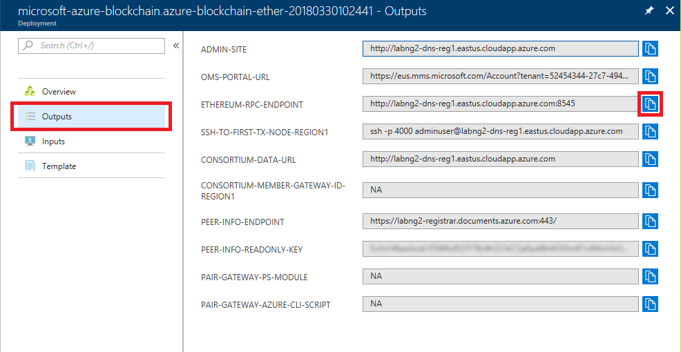

	_Copying the endpoint URL_
 
1. Return to Chrome and the MetaMask window. (If the window is no longer displayed, click the MetaMask icon to the right of the address bar to display it again.) Then click the hamburger icon to display the MetaMask menu, and select **Settings** from the menu.

	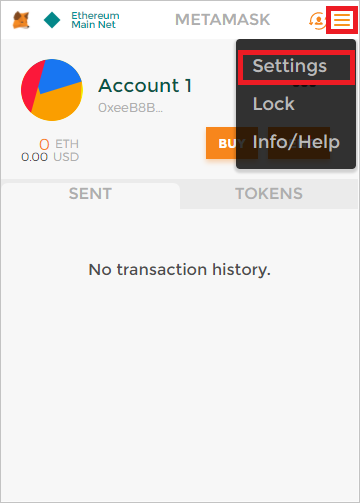

	_Opening MetaMask settings_

1. Paste the URL on the clipboard into the "Current Network" box and and click **Save**. Then click the back arrow next to "Settings."

	

	_Connecting the wallet to the network_

1. Return to the Azure Portal and click the **Copy** button next to ADMIN-SITE.

	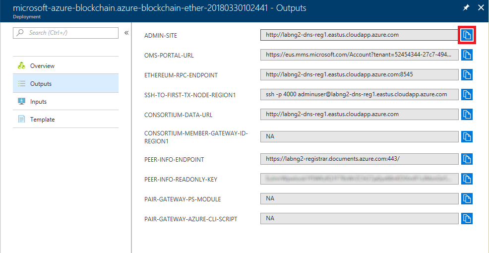

	_Copying the admin-site link_

1. Open a new browser instance and paste the URL on the clipboard into the browser's address bar. Then press **Enter**.

	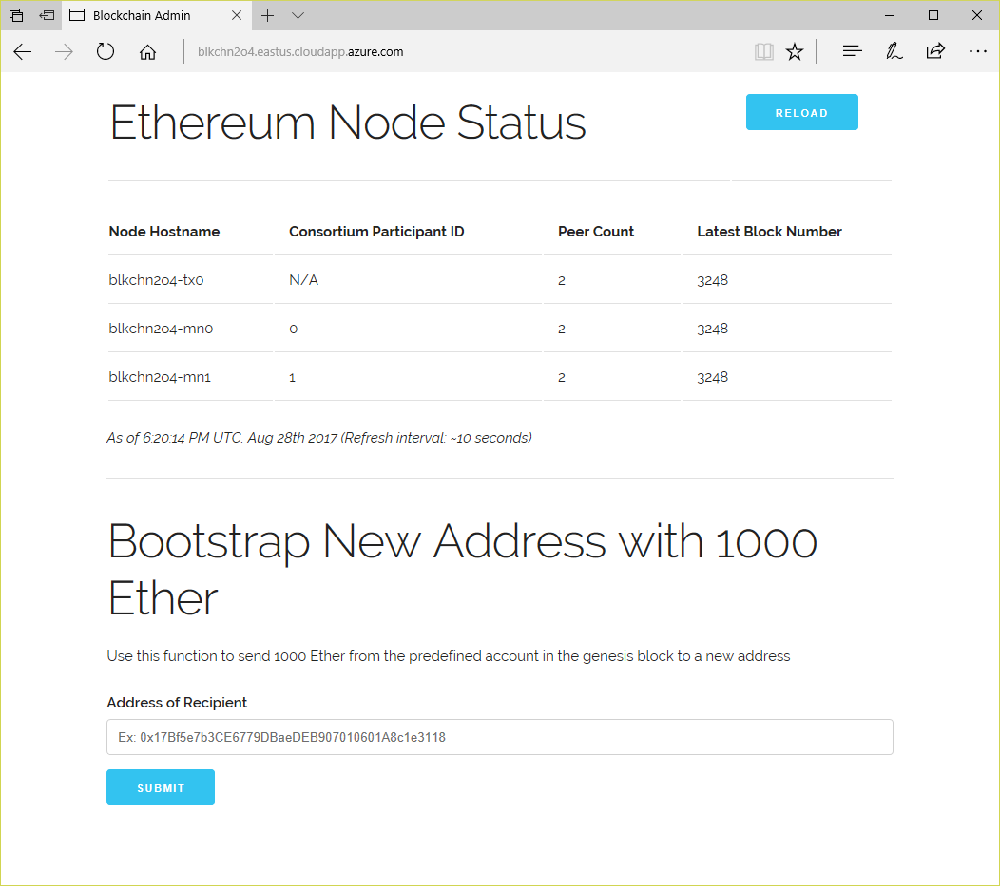

	_Opening the admin site_

1. Return to Chrome. Click the ellipsis (**...**) in the MetaMask window, and then select **Copy Address to clipboard**. The "address" you are copying is actually the account ID for Account 1, which was created automatically when you "joined" the network by pasting the Ethereum RPC endpoint URL into MetaMask.

	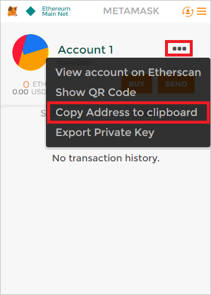

	_Copying the account address to the clipboard_

1. Return to the admin site you open in Step 15 and paste the value on the clipboard into the **Address of Recipient** box. Then click **Submit** to seed Account 1 with 1,000 Ether.

	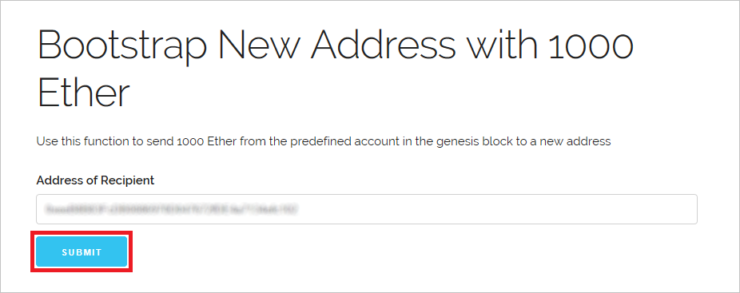

	_Boostrapping the account with 1,000 Ether_

1. Return to MetaMask and click the refresh icon. Then select **Account 1** and confirm that the account now shows a balance of 1,000 Ether.

	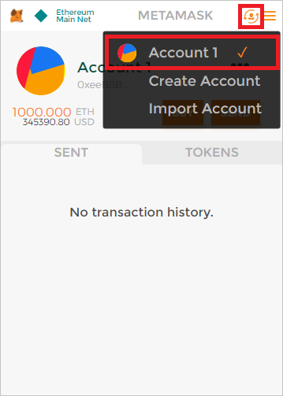

	_Refreshing the wallet_

Seeding your wallet with Ether isn't strictly necessary because you won't be using the Ether in it in this lab; you will use your own cryptocurrency instead. But if you *were* deploying an Ethereum network for the purpose of transferring Ether between accounts, you now know how to get some Ether into your account for testing purposes. 

Where did the 1,000 Ether come from? They came from the *coinbase* account that was created when the network was created. The coinbase account holds all the Ether that haven't been transferred to individual accounts. Later, you will use Ether in this account to *fuel* the transactions that you perform via the contracts that you deploy. Before you can do that, you must unlock the account.

<a name="Exercise3"></a>
## Exercise 3: Unlock the coinbase account ##

In this exercise, you will use SSH to connect to the Ethereum network you deployed in the previous exercise and execute a series of commands to unlock the account and retrieve its address.

1. Return to the Azure portal and click the **Copy** button next to SSH-TO-FIRST-TX-NODE-REGION1 to copy the SSH command to the clipboard.

	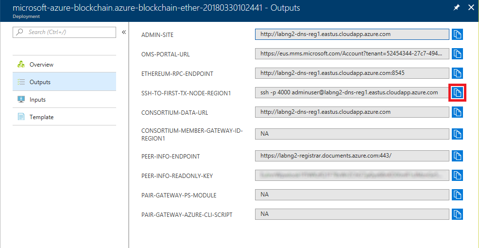

	_Copying the SSH command_

1. Click the **Cloud Shell** button in the toolbar at the top of the portal to open a cloud shell. The Azure cloud shell provides an environment for executing Bash and PowerShell commands without leaving the portal. You can use **Shift+Insert** to paste commands into the cloud shell, and **Ctrl+Insert** to copy text from the cloud shell to the clipboard.

	

	_Opening the Azure cloud shell_

1. Make sure **Bash** is the language selected in the upper-left corner of the cloud shell. Press **Shift+Insert**  to paste the ```ssh``` command that is on the clipboard into the cloud shell. Then press **Enter** to execute the command. If you are prompted with a security warning informing you that the authenticity of the host can't be established and asking if you want to connect anyway, type "yes" and press **Enter**.

1. When prompted for a password, enter the password you entered in Exercise 1, Step 3.

1. Execute the following command in the cloud shell to attach to the first node in the Ethereum network. [geth](https://github.com/ethereum/go-ethereum/wiki/Command-Line-Options), which is short for "go-ethereum," is a multipurpose command for managing Ethereum networks.

	```
	geth attach
	```

1. Now execute the following command to unlock the coinbase account, substituting the password you entered in Exercise 1, Step 6 for PASSWORD:

	```
	web3.personal.unlockAccount(web3.personal.listAccounts[0],"PASSWORD",28800)
	```

	This will allow you to perform transactions using the coinbase account for up to 8 hours (28,800 seconds). Make sure that the output from the command is the word "true," as shown below.

	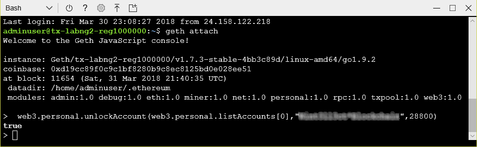

	_Unlocking the account_

1. Type ```exit``` into the cloud shell to detach from Ethereum.

1. Type ```exit``` again to close the SSH connection.

Now that the coinbase account is unlocked, you are ready to start using the network to execute transactions on the blockchain. To code those transactions, you will create and then deploy a smart contract.

<a name="Exercise4"></a>
## Exercise 4: Deploy a smart contract ##

Ethereum blockchains use smart contracts to broker transactions. A smart contract is a program that runs on blockchain transaction nodes in [Ethereum Virtual Machines](https://themerkle.com/what-is-the-ethereum-virtual-machine/). Ethereum developers often use the popular [Truffle](http://truffleframework.com/) framework to develop smart contracts. In this exercise, you will set up a Truffle development environment, compile a smart contract, and deploy it to the blockchain.

1. If Node.js isn't installed on your computer, go to https://nodejs.org and install the latest LTS version for your operating system. If you aren't sure whether Node.js is installed, open a Command Prompt or terminal window and execute the following command:

	```
	node --version
	```

	If you don't see a Node.js version number, then Node.js isn't installed.

1. If you are using macOS or Linux, open a terminal window. If you are using Windows instead, open a PowerShell window. In the terminal or PowerShell window, use the following command to create a directory named "truffle" in the location of your choice:

	```
	mkdir truffle
	```

1. Now change to the "truffle" directory:

	```
	cd truffle
	```

1. Use the following command to install Truffle:

	```
	npm install -g truffle
	```

1. Most smart contracts for Ethereum networks are written in a language called Solidity, which is similar to JavaScript. Use the following command to install the Solidity compiler:

	```
	npm install -g solc
	```

1. Now use the following command to initialize a Truffle project in the current directory. This will download a few Solidity scripts and install them, and create a scaffolding in the "truffle" folder.

	```
	truffle init
	```

1. Use your favorite text or program editor to open the file named **truffle.js** in the "truffle" folder. Return to the Azure Portal and copy the Ethereum RPC endpoint to the clipboard as you did in Exercise 2, Step 11. Replace "localhost" on line 4 of **truffle.js** with the URL on the clipboard, and remove the leading "http://" and the trailing ":8545," as shown below. Then save the modified file.

	```javascript
	module.exports = {
  	    networks: {
            development: {
                host: "labng2-dns-reg1.eastus.cloudapp.azure.com",
                port: 8545,
	            network_id: "*" // Match any network id
	        }
 	    }
	};
	```

1. Create a new contract in the subdirectory named "contracts" (which was created when you ran ```truffle init```) by creating a text file named **myCoin.sol** in that directory, pasting in the following code, and then saving the file:

	```javascript
	pragma solidity ^0.4.4;

	// Declares the contract
	contract myCoin {
		
	    // This is a mapping that works like a dictionary or associated array in other languages.
	    mapping (address => uint) balances;

	    // This registers an event
	    event Transfer(address indexed _from, address indexed _to, uint256 _value);

	    // The contract constructor, which is called when the contract is deployed to the blockchain. The contract is persistent on the blockchain, so it remains until it is removed.
	    function myCoin() {
	        balances[tx.origin] = 100000;
	    }

	    // This method modifies the blockchain. The sender is required to fuel the transaction in Ether.
	    function sendCoin(address receiver, uint amount) returns(bool sufficient) {
	        if (balances[msg.sender] < amount) return false;
	        balances[msg.sender] -= amount;
	        balances[receiver] += amount;
	        Transfer(msg.sender, receiver, amount);
	        return true;
	    }

	    // This method does not modify the blockchain, so it does not require an account to fuel for the call.
	    function getBalance(address addr) returns(uint) {
	        return balances[addr];
	    }
	}
	```

	This contract, named "myCoin," is written in Solidity. Solidity files are compiled to JSON files containing interface definitions as well as bytecode that is used when the contracts are deployed. The contract contains a function named ```sendCoin``` that, when called, transfers the specified number of coins from the sender's account to the receiver's account.

1. Create a new file named **3_deploy_myCoin.js** in the "migrations" subdirectory. Paste the following code into the file and save it:

	```javascript
	var myCoin = artifacts.require("./myCoin.sol");

	module.exports = function(deployer) {
	    deployer.deploy(myCoin);
	};
	```

	This is the code that deploys the "myCoin" contract to the blockchain.

1. Return to the terminal or PowerShell window and execute the following command to compile the  contract:

	```
	truffle compile
	```

1. Now use the following command to deploy the contract to the blockchain:

	```
	truffle deploy
	```

The contract is now present in the blockchain and waiting for its ```sendCoin``` function to be called to transfer funds. All we lack is a mechanism for calling that function using RPC. In the next exercise, you will close the loop by using a Node.js app to invoke the contract.

<a name="Exercise5"></a>
## Exercise 5: Invoke the contract from an app ##

Smart contracts are designed to be used by applications that use the blockchain for secure transactions. In this exercise, you will create a Node.js app that uses the "myCoin" contract and then run it to broker an exchange of My Coin currency — specifically, to transfer funds from the coinbase account to the account you created in [Exercise 2](#Exercise2) (Account 1). The app will use a library named [web3.js](https://github.com/ethereum/web3.js/), which wraps the Ethereum RPC API and dramatically simplifies code for interacting with smart contracts. Note that there are also web3 libraries available for other languages, including Java and Python.

1. In a terminal or PowerShell window, use the following command to create a directory named "use-contract" in the location of your choice:

	```
	mkdir use-contract
	```

1. Make "use-contract" the current directory:

	```
	cd use-contract
	```

1. Use the following commands to install the NPM package named "web3:"

	```
	npm init
	npm install web3@^0.20.0
	```

1. Create a new text file named **use-contract.js** in the "use-contract" folder. Then paste in the following code:

	```javascript
	var Web3 = require("web3");

	var AzureBlockchainRPC = "AZURE_RPC_URL";
	var account1 = "ACCOUNT1_ADDRESS";
	var contractAddress = "CONTRACT_ADDRESS";

	let web3 = new Web3();
	web3.setProvider(new web3.providers.HttpProvider(AzureBlockchainRPC));

	// The abi object defines the contract interface. Web3 uses this to build the contract interface.
	var abi = JSON.parse('[{"constant":false,"inputs":[{"name":"receiver","type":"address"},{"name":"amount","type":"uint256"}],"name":"sendCoin","outputs":[{"name":"sufficient","type":"bool"}],"payable":false,"type":"function"},{"constant":false,"inputs":[{"name":"addr","type":"address"}],"name":"getBalance","outputs":[{"name":"","type":"uint256"}],"payable":false,"type":"function"},{"inputs":[],"payable":false,"type":"constructor"},{"anonymous":false,"inputs":[{"indexed":true,"name":"_from","type":"address"},{"indexed":true,"name":"_to","type":"address"},{"indexed":false,"name":"_value","type":"uint256"}],"name":"Transfer","type":"event"}]');

	let myCoinContract = web3.eth.contract(abi);
	let myCoinInstance = myCoinContract.at(contractAddress);

	// This sets up a listener for the Transfer event.
	var transferEvent = myCoinInstance.Transfer( {}, {fromBlock: 0, toBlock: 'latest'});

	// Watching for transfer.... 
	transferEvent.watch(function(error, result) {
	    if (!error) {
	        console.log("Coin Sent!\n\nChecking balance for coin base...");
	        console.log(myCoinInstance.getBalance.call(web3.eth.coinbase));
	        console.log("Checking balance for account1...");
	        console.log(myCoinInstance.getBalance.call(account1));
	    }
	    else {
	        console.log("An error occurred.");
	        console.log(error);
	    }
	    process.exit();
	});

	web3.eth.defaultAccount = web3.eth.coinbase;
	console.log("Sending some coin...");
	console.log(myCoinInstance.sendCoin(account1, 1000, {from: web3.eth.coinbase}));

	console.log("Checking balance for coin base...")
	console.log(myCoinInstance.getBalance.call(web3.eth.coinbase));

	console.log("Checking balance for account1...")
	console.log(myCoinInstance.getBalance.call(account1));

	console.log("Waiting for event to fire...");
	```

	This code, when executed, transfers 1,000 My Coin from the coinbase account to Account 1. Notice the asynchronous nature of the call. Before calling ```sendCoin``` to invoke the contract, the code registers a handler for the ```Transfer``` event that fires after the transaction has completed.

1. Replace AZURE_RPC_URL on line 3 of **use-contract.js** with the Ethereum RPC endpoint obtained from the Azure Portal (see Exercise 2, Step 11).

1. In the PowerShell or terminal window, CD back to the "truffle" directory that you created in the previous exercise. Then use the following command to list the addresses of all the smart contracts in the project, including the "myCoin" contract and some sample contracts that were created when you ran ```truffle init```:

	```
	truffle networks
	```

1. Replace CONTRACT_ADDRESS on line 5 of **use-contract.js** with the "myCoin" address in the output.

	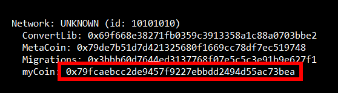

	_Retrieving the contract address_
 
1. Return to the MetaMask window in Chrome and copy the address for **Account 1** to the clipboard as you did in Exercise 2, Step 16. Then replace ACCOUNT1_ADDRESS on line 4 of **use-contract.js** with the address on the clipboard and save your changes to **use-contract.js**.

	

	_Copying the account address to the clipboard_

1. In the PowerShell or terminal window, CD back to the "use-contract" directory. Then execute the following command to invoke the contract and transfer My Coin:

	```
	node use-contract.js
	```

1. Watch the output. Onserve that before the ```Transfer``` event fires, the accounts hold their original balances even though the ```sendCoin``` method had already been invoked. Checking the balances again in the ```Transfer``` event handler reveals the final, post-transaction balances, and shows that 1,000 My Coin were transferred to Account 1.

	```	
	Sending some coin...
	0xb677604426c9589bb1072f1ec517d2ad3d5e37c56f0b5d9a3b2d689a4bd962ad
	Checking balance for coin base...
	{ [String: '100000'] s: 1, e: 5, c: [ 100000 ] }
	Checking balance for account1...
	{ [String: '0'] s: 1, e: 0, c: [ 0 ] }
	Waiting for event to fire...
	Coin Sent!

	Checking balance for coin base...
	{ [String: '99000'] s: 1, e: 4, c: [ 99000 ] }
	Checking balance for account1...
	{ [String: '1000'] s: 1, e: 3, c: [ 1000 ] }
	```

If you'd like, you can run the app again to transfer another 1,000 My Coin. Each time you run the app and invoke the contract, the balance in the coinbase account will decrease by 1,000, and the balance in Account 1 will increase by the same amount.

<a name="Exercise6"></a>
## Exercise 6: Delete the blockchain network 

In this exercise, you will delete the resource group created in [Exercise 1](#Exercise1) when you created the Ethereum network. Deleting the resource group deletes everything in it and prevents any further charges from being incurred for it. Resource groups that are deleted can't be recovered, so be certain you're finished using it before deleting it. However, it is **important not to leave this resource group deployed any longer than necessary** because the resources in it are relatively expensive.

1. Return to the blade for the resource group you created in Exercise 1. Then click the **Delete** button at the top of the blade.

	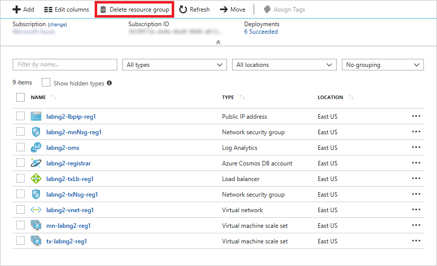

	_Deleting the resource group_

1. For safety, you are required to type in the resource group's name. (Once deleted, a resource group cannot be recovered.) Type the name of the resource group. Then click the **Delete** button to remove all traces of this lab from your Azure subscription.

After a few minutes, the network and all of the associated resources will be deleted. Billing stops when you click **Delete**, so you're not charged for the time required to delete the resources. Similarly, billing doesn't start until the resources are fully and successfully deployed.

<a name="Summary"></a>
## Summary ##

This is just one example of the kinds of apps you can build with Blockchain, and with Ethereum Blockchain networks in particular. It also demonstrates how easily Blockchain networks are deployed on Azure. For more on Azure blockchains and on Ethereum networks and their capabilities, refer to https://www.ethereum.org/.

---

Copyright 2018 Microsoft Corporation. All rights reserved. Except where otherwise noted, these materials are licensed under the terms of the MIT License. You may use them according to the license as is most appropriate for your project. The terms of this license can be found at https://opensource.org/licenses/MIT. 