<a name="HOLTitle"></a>
# Handling Big Data with Azure Data Lake #

[Azure Data Lake](https://azure.microsoft.com/en-us/solutions/data-lake/) enables you to collect data of any size, type, and velocity in one place in order to explore, analyze, and process the data using tools and languages such as U-SQL, Apache Spark, Hive, HBase, and Storm. It works with existing IT investments for identity, management, and security for simplified handling and governance. It also integrates easily with operational stores and data warehouses.

Data Lake consists of two primary elements: [Azure Data Lake Storage Gen1](https://azure.microsoft.com/en-us/services/storage/data-lake-storage/) and [Azure Data Lake Analytics](https://azure.microsoft.com/en-us/services/data-lake-analytics/). Data Lake Storage Gen1 is an enterprise-wide hyper-scale repository for big-data analytical workloads. It was built from the ground up to support massive throughput and integrates with Apache Hadoop by acting as an HDFS distributed file system. It also supports [Azure Active Directory](https://www.microsoft.com/en-us/cloud-platform/azure-active-directory) for access control independent of Hadoop. Data Lake Analytics is an easy-to-learn query and analytics engine that features a new query language called U-SQL, which combines elements of traditional SQL syntax with powerful expression support and extensibility. It integrates seamlessly with Data Lake Storage Gen1 so you can execute queries against multiple disparate data sources as if they were one. This lab will introduce Data Lake Storage Gen1 and Data Lake Analytics and walk you through typical usage scenarios for each.

<a name="Objectives"></a>
### Objectives ###

In this hands-on lab, you will learn how to:

- Create a Data Lake Storage Gen1
- Create a Data Lake Analytics accounts and connect it to a Data Lake Storage Gen1
- Import data into an Azure Data Lake Storage Gen1
- Run U-SQL jobs in Azure Data Lake Analytics 
- Federate Azure SQL Databases and query them with U-SQL 

<a name="Prerequisites"></a>
### Prerequisites ###

The following are required to complete this hands-on lab:

- An active Microsoft Azure subscription. If you don't have one, [sign up for a free trial](http://aka.ms/WATK-FreeTrial).
- [Azure Command-Line Interface (CLI)](https://azure.microsoft.com/en-us/documentation/articles/xplat-cli-install/)

<a name="Resources"></a>
### Resources ###

[Click here](https://a4r.blob.core.windows.net/public/data-lake-resources.zip) to download a zip file containing the resources used in this lab. Copy the contents of the zip file into a folder on your hard disk.

<a name="Cost"></a>
### Cost ###


The cost of this lab is **moderate**. For an overview of cost ratings, refer to [Explanation of Costs](../../Costs.md).

<a name="Exercises"></a>
## Exercises ##

This hands-on lab includes the following exercises:

- [Exercise 1: Create an Azure Data Lake Storage Gen1](#Exercise1)
- [Exercise 2: Create an Azure Data Lake Analytics account](#Exercise2)
- [Exercise 3: Import data into an Azure Data Lake Storage Gen1](#Exercise3)
- [Exercise 4: Query a TSV file with U-SQL](#Exercise4)
- [Exercise 5: Create an Azure SQL Database as a federated data source](#Exercise5)
- [Exercise 6: Perform a federated query with U-SQL](#Exercise6)

Estimated time to complete this lab: **60** minutes.

<a name="Exercise1"></a>
## Exercise 1: Create an Azure Data Lake Storage Gen1 ##

The starting point for using Azure Data Lake is setting up an Azure Data Lake Storage Gen1 to serve as a repository for various data sources. In this exercise, you will create a new Azure Data Lake Storage Gen1 in your Azure subscription. Later, you will import data into the Data Lake Storage Gen1 and query it with U-SQL. 

1. In your browser, navigate to the [Azure Portal](https://portal.azure.com). If you are asked to sign in, do so using your Microsoft account.

2. In the portal, click **+ Create a resource**, followed by **Storage** and **Data Lake Storage Gen1**.

    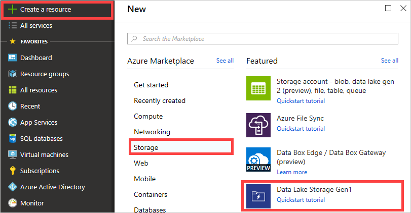

    _Adding a new Data Lake Storage Gen1_

3. In the "New Data Lake Storage Gen1" blade, enter a unique name for your Data Lake Storage Gen1 in all lowercase and make sure a green check mark appears next to it. (The name must be unique within Azure since it becomes part of the store's DNS name.) Click the **Create new** link under **Resource Group**, and then enter a resource-group name such as "DataLakeResourceGroup" in the popup box and click **OK**.  Next choose the location nearest you, and then finally click **Create**.

    

    _Creating a Data Lake Storage Gen1_

4. Click **Resource groups** in the ribbon on the left, and then click the resource group whose name you specified in the previous step.

    

    _Opening the resource group_

5. Wait until "Deploying" changes to "Succeeded," indicating that the Data Lake Storage Gen1 has been created. Deployment typically takes a minute or less. You can click the **Refresh** button at the top of the blade to refresh the deployment status.

    

    _Deployment succeeded_

Now that you have created a Data Lake Storage Gen1, the next step is to create a Data Lake Analytics account so you can run queries against the store.

<a name="Exercise2"></a>
## Exercise 2: Create an Azure Data Lake Analytics account ##

Azure Data Lake formally separates the concepts of storing data and querying data. This allows Azure Data Lake Analytics to operate against a range of possible data sources contained in an Azure Data Lake Storage Gen1. In this exercise, you will create a Data Lake Analytics account and connect it to the Data Lake Storage Gen1 you created in [Exercise 1](#Exercise1).

1. In the portal, click **+ Create a resource**, followed by **Analytics** and **Data Lake Analytics**.

    

    _Adding a new Data Lake Analytics account_

1. In the "New Data Lake Analytics" blade, enter a name for the new account. Once more, the name must be unique across Azure because it becomes part of a DNS name. Under **Resource Group** select the resource group that you created in Exercise 1. Then select the same location you selected for the Data Lake Storage Gen1 in Exercise 1. Finally, click **Data Lake Storage Gen1** and select the Data Lake Storage Gen1 you created in Exercise 1 to associate the Data Lake Analytics account with your Data Lake Storage Gen1. 

	When you're finished, click the **Create** button at the bottom of the "New Data Lake Analytics" blade.

    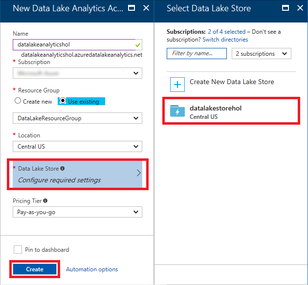

    _Creating a Data Lake Analytics account_

1. Return to the resource group that holds the Data Lake Storage Gen1 and the Data Lake Analytics account and wait for "Deploying" to change to "Succeeded." Once more, You can click the **Refresh** button at the top of the blade to refresh the deployment status.

    

    _Deployment succeeded_

You now have Azure Data Lake storage and query capability set up in your Azure subscription. The next task is to add some data to query.

<a name="Exercise3"></a>
## Exercise 3: Import data into Azure Data Lake Storage Gen1 ##

The [resources that accompany this lab](https://a4r.blob.core.windows.net/public/data-lake-resources.zip) include two tab-delimited TSV files containing sample data. The data comes from the public domain and consists of questions and answers from the popular site http://academia.stackexchange.com. In this exercise, you will import the sample data into your Azure Data Lake Storage Gen1 so you can execute queries against it.

1. In the portal, open the Azure Data Lake Storage Gen1 that you created in [Exercise 1](#Exercise1). (An easy way to do that is to open the resource group and then click the Data Lake Storage Gen1 resource.) In the blade for the Data Lake Storage Gen1, click **Data Explorer** near the top.

    

    _Opening Data Explorer_

1. Click **Upload**.

    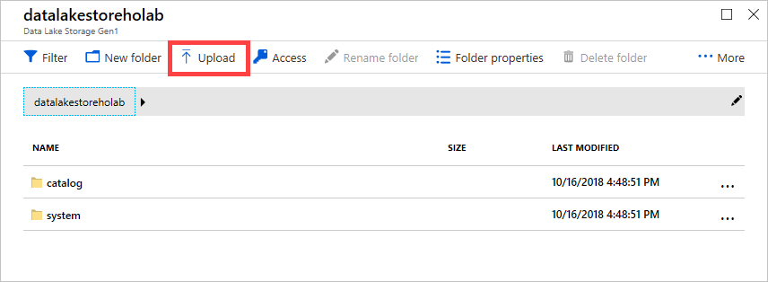

    _Opening the "Upload files" blade_
    
1. In the "Upload files" blade, click the **Open** button and select the files named **comments.tsv** and **posts.tsv** in the directory containing the lab resources. Then click **Add selected files** button. The combined file size file is more than 90 MB, so the upload might take a few minutes.

    

    _Uploading TSV files_

1. Once the uploads have finished, close the "Upload files" blade and return to the blade for your Data Lake Storage Gen1. Confirm that both of the data files you uploaded appear there. Then click **posts.tsv** to view the contents of that file.

    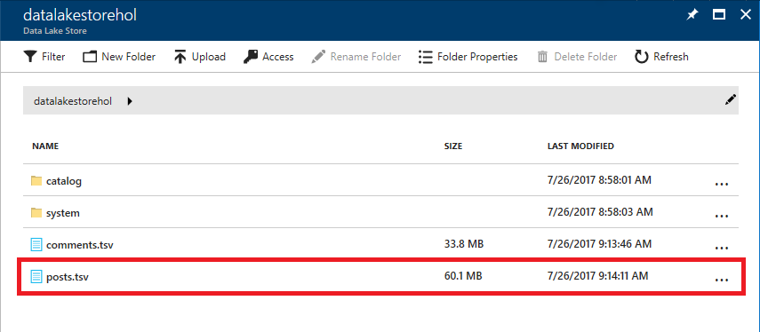

    _Opening posts.tsv_
    
1. The file preview only shows a portion of the data file. Take a moment to examine the data and familiarize yourself with its content and structure.

    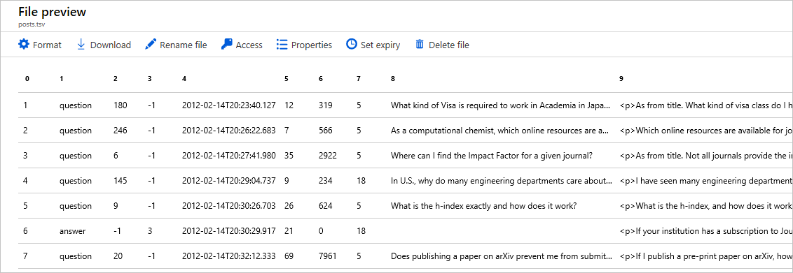

    _Previewing  posts.tsv_

The next step is to query the data to extract the information you want from it. For that, Azure Data Lake Analytics provides U-SQL. 

<a name="Exercise4"></a>
## Exercise 4: Query a TSV file with U-SQL ##

[U-SQL](http://usql.io/) is a language created by Microsoft that combines traditional SQL Data Definition Language (DDL) and Data Manipulation Language (DML) constructs with expressions, functions, and operators based on the popular C# programming language. It marries the benefits of SQL with the power of expressive code. And it is supported natively in Azure Data Lake Analytics. In this exercise, you will use U-SQL to query the data you imported in [Exercise 3](#Exercise3).

1. In the portal, open the Azure Data Lake Analytics account that you created in [Exercise 2](#Exercise2). In the ensuing blade, click **+ New job** to create a new U-SQL job.

    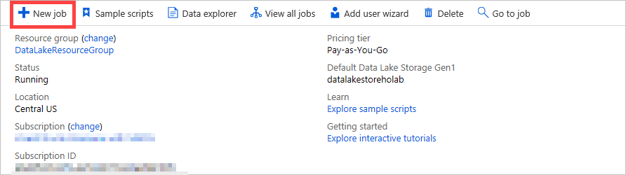

    _Creating a new job_

1. In the "New job" blade, paste the following query into the empty query field:

	```sql
	// here we define the schema for the imported posts.tsv file
	@posts =
	    EXTRACT id                  int,
	            [type]              string,
	            acceptedanswerid    int?,
	            parentquestionid    int?,
                creationdate        string,
	            score               int,
	            views               int,
	            ownerid             int,
	            title               string,
	            body                string,
	            tags                string,
	            answers             int,
	            comments            int
	    FROM "posts.tsv"
	    USING Extractors.Tsv();
	
	// here we transform the imported data using various aggregate functions
	@results =
	    SELECT
	        ownerid AS userid,
	        SUM(score) AS totalscore,
	        COUNT(*) AS totalposts
	    FROM @posts
	GROUP BY ownerid;
	
	// finally we output the transformed data for further analysis or visualization
	OUTPUT @results
	    TO "totalscores.csv"
	    ORDER BY totalscore DESC
	    USING Outputters.Csv();
	```

    The query contains three main parts. The **EXTRACT** statement extracts data from an existing data source, in this case the **posts.tsv** file you uploaded to the Data Lake Storage Gen1. The **SELECT** statement transforms the input data into a shape suitable to the task at hand. Finally, the **OUTPUT** statement outputs the result as a named rowset in a file named **totalscores.csv**, which can be used for further analysis or visualization.

2. Click **Submit** to execute the query.

    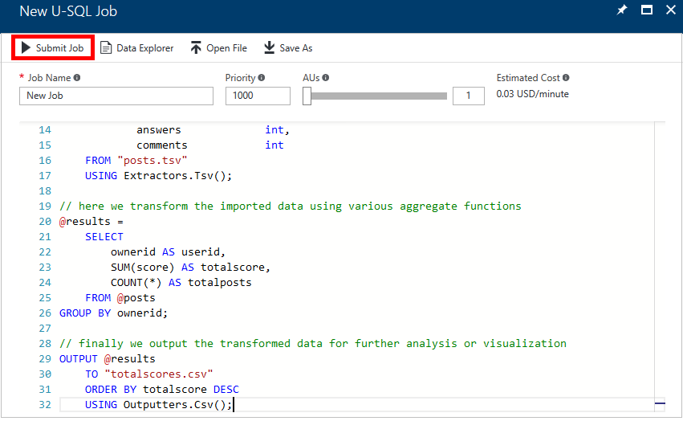

    _Executing the query_

3. A new blade will open to show what is happening as the Data Lake Analytics engine prepares, queues, and executes your query. The job is complete when the "Done" step turns green.

    

    _The completed job_

4. Return to the blade for your Data Lake Storage Gen1 and click **Data Explorer**. Then click **totalscores.csv** to view the query results and verify that it contains three columns of data.

    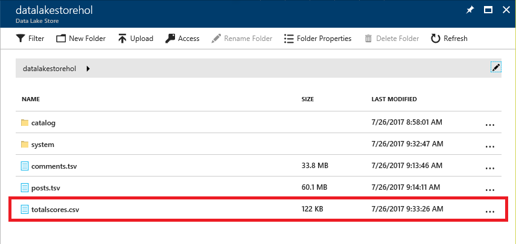

    _Viewing the query results_

In the next two exercises, you will build on what you learned here by joining multiple data sources and performing more complex queries against the aggregated data. Now that you know how to set up a Data Lake Storage Gen1, import data, connect it to in Data Lake Analytics, and execute U-SQL queries, the fundamentals are in place.

<a name="Exercise5"></a>
## Exercise 5: Create an Azure SQL Database as a federated data source ##

In the previous exercise, you issued a simple query against a single file in an Azure Data Lake Storage Gen1. To make things more interesting, you are now going to create a SQL database in your Azure subscription and configure it to serve as a federated data source in Data Lake Analytics. This will allow you to not only query the database with U-SQL, but also join data from the database to data already residing in your Data Lake Storage Gen1. This demonstrates the power of Azure Data Lake as a distributed storage and analytics engine.

Enabling federated queries will require a series of steps: 

- Create an Azure storage account in your Azure subscription
- Upload a SQL database backup file (a .bacpac file) to the new storage account
- Create a new SQL database in your Azure subscription and restore it from the .bacpac file
- Configure your Data Lake Analytics account to query against the database

Let's get started!

1. In the Azure Portal, click **+ Create a resource**, followed by **Storage** and **Storage account**.

    

    _Adding a storage account_

1. In the ensuing "Create storage account" blade, make sure that the selected **Subscription** and **Resource group** as the same as those used in Exercise 1.  Next enter a name for the new storage account in **Storage account name** field. Storage account names must be 3 to 24 characters in length and can only contain numbers and lowercase letters. In addition, the name you enter must be unique within Azure. If someone else has chosen the same name, you'll be notified that the name isn't available with a red exclamation mark in the **Storage account name** field.

	Once you have a name that Azure will accept, select the **Location** that you selected for the Data Lake Storage Gen1. Click the **Review + create** button at the bottom of the blade to proceed to the "Review + create" tab of the blade.
    
	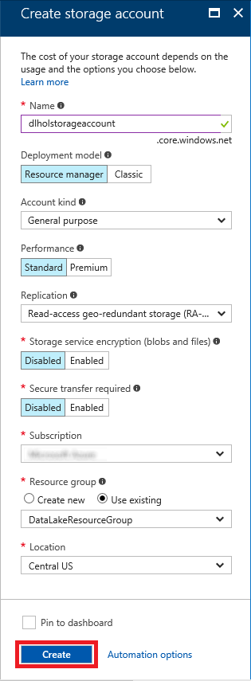

    _Creating a new storage account_

1. Clicking the **Review + create** button will open the "Review + create" tab of the "Create storage account" blade as well as execute a validation process that ensures all data entered is valid.  The "Review + create" tab will display a list of all of the configuration data for the new storage account.  Click the **Create** button to deploy the new storage account.
    
	

    _Creating a new storage account review step_

1. Click **Resource groups** in the ribbon on the left side of the portal, and then click the resource group that holds the storage account. Wait for the storage account to finish deploying. Then click the storage account to open a blade for that account.

    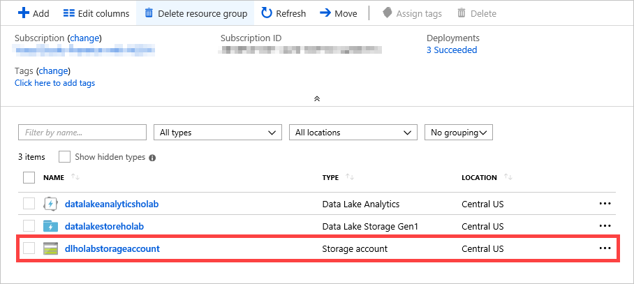

    _Opening the storage account_

1. You need to create a container in the storage account to hold the database backup. To begin, click **Blobs** in the storage account's blade.

    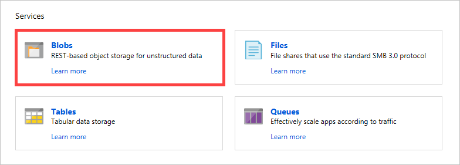

    _Opening blob storage_

1. Click **+ Container** to create a new container. Enter the name "bacpacs" (without quotation marks) for the new blob container, and then click **OK**.

    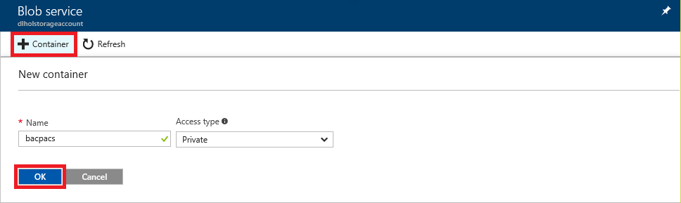

    _Adding a container_

1. Click the "bacpacs" container to open it.

    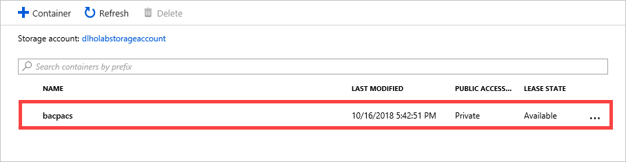

    _Opening the "bacpacs" container_

1. Click **Upload**.

    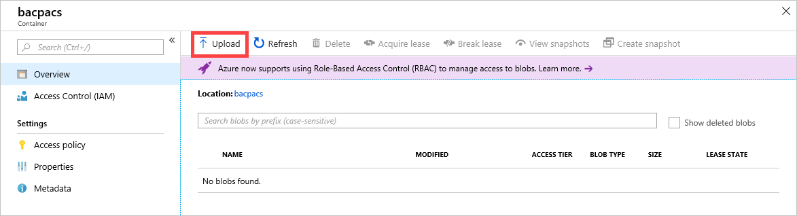

    _Uploading to the "bacpacs" container_

1. Click the **Open** button to the right of the **Files** box. Navigate to the directory containing the lab resources and select the file named **academics-stackexchange-users.bacpac**. Then click the **Upload** button to upload the file to the container.

    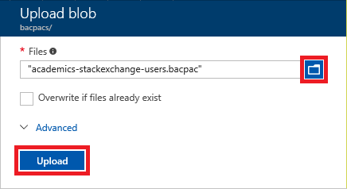

    _Uploading a file_

1. Wait until the upload has completed. Then close the "Upload blob" blade and return to the blade for the "bacpacs" container. Confirm that the container now contains a blob named **academics-stackexchange-users.bacpac**. 

    

    _The uploaded blob_

1. The next step is to create a new SQL database server. In the Azure portal, click **All services** in the ribbon on the left and type "sql" (without quotation marks) in the search box. Then click **SQL servers**:

    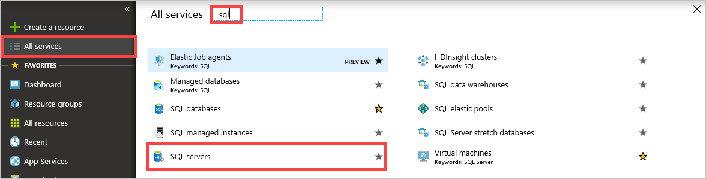

    _Searching for SQL servers_

1. Click **+ Add** in the "SQL servers" blade. In the "SQL Server" blade, enter a unique name for your SQL server. (It must be unique across all of Azure; be sure a green check mark appears in the box.) Enter "azureuser" as the user name, and "Azure4Research!" as the password. Under **Resource group**, select the same resource group you have used throughout this lab. For **Location**, select the same location you selected in previous exercises. When you're finished, click the **Create** button at the bottom of the blade.

    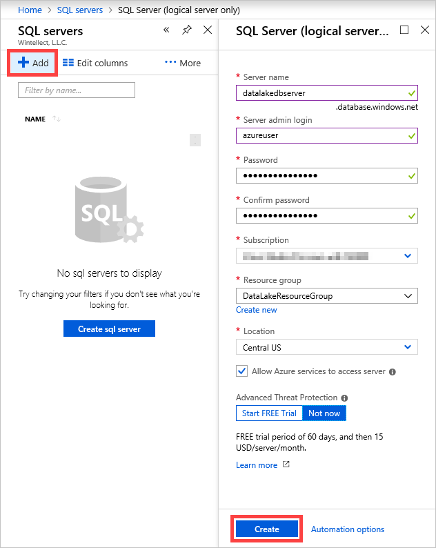

    _Creating a new SQL server_

1. Next, you need to create a new database instance using the blob you uploaded earlier. Wait until the new SQL server is created. (It will probably take a minute or two. Click the **Refresh** button in the "SQL servers" blade from time to time until it appears.) In the "SQL servers" blade, click the SQL server you just created.

    

    _Opening the SQL server_

1. Click **Import database**.

    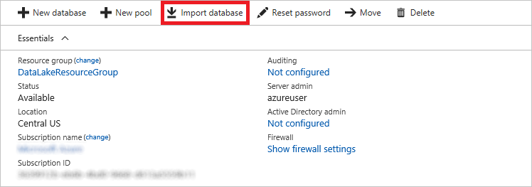

    _Importing a database_

1. In the "Import database" blade, click **Storage** and select the storage account that you uploaded the .bacpac file to, followed by the "bacpacs" container and, after that, the blob you uploaded to that container. Then click the **Select** button at the bottom of the blade. Return to the "Import database" blade and enter "azureuser" as the user name and "Azure4Research!" as the password. Finish up by clicking **OK** at the bottom of the blade.

    

    _Specifying database import options_

1. While you wait for the database instance to be created, click **Show firewall settings** in the database-server blade.

	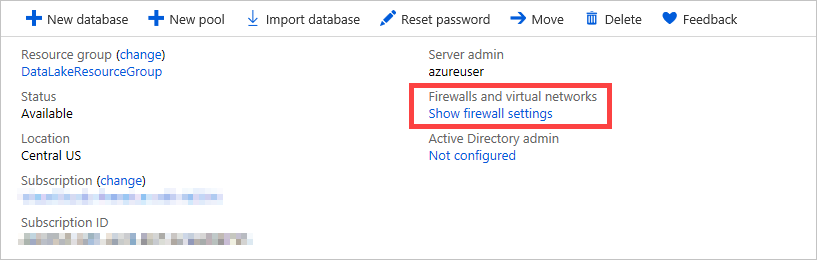

	_Viewing firewall settings_

1. Add an IP range to allow Data Lake Analytics to communicate with your server during federated query execution. Type the following values into the three input fields, and then click **Save** at the top of the blade:

    - **Rule Name**: Allow Data Lake
    - **Start IP**: 25.66.0.0
    - **End IP**: 25.66.255.255

    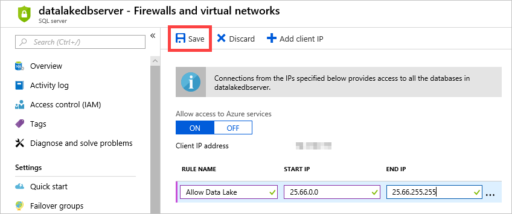

    _Configuring the firewall_

2. Now that you have a SQL database instance up and running, the final step is to register it with Data Lake Analytics for federation. Navigate back to your Data Lake Analytics account in the portal and click **+ New job** at the top of the blade. In the "New job" blade, enter the following statement and then click **Submit** to run the job:

    ```sql
	CREATE DATABASE UserIntegration;
	```

1. If you haven't installed the [Azure CLI](https://azure.microsoft.com/en-us/documentation/articles/xplat-cli-install/), take a moment to install it now. Then open a command shell (Bash, Terminal, Command Prompt, etc.) and execute the following command:

	```
	az login
	```

	> As an alternative to installing the Azure CLI, you can use the [Azure Cloud Shell](https://azure.microsoft.com/features/cloud-shell/) available in the [Azure Portal](https://portal.azure.com). Simply open the portal in your browser and click the **Cloud Shell** button in the toolbar at the top of the page. One of the benefits of using the Cloud Shell is that you're *always* running an up-to-date version. Note that you can use **Shift+Insert** to paste commands into the Cloud Shell, and **Ctrl+Insert** to copy text from the Cloud Shell to the clipboard.

	

	_Opening the Azure Cloud Shell_

1. Copy the access code presented to you in the command shell to the clipboard. Then open a browser window and navigate to https://aka.ms/devicelogin and enter the code. If prompted to sign in, do so using your Microsoft account. Upon successful authentication, your command-line session will be connected to your Azure subscription.

1. Assuming you are using the Azure Pass subscription provided to you for these labs, execute the following command to ensure that Azure Pass is the active subscription (the subscription that will be charged against) for operations performed with the CLI, replacing SUBSCRIPTION_NAME_OR_ID with the subscription's name or ID:

	```
	az account set --subscription "SUBSCRIPTION_NAME_OR_ID"
	```

1. Now execute the following commands to create a Data Lake catalog credential used to authenticate when executing federated queries. Substitute your Data Lake Analytics account name for ANALYTICS_ACCOUNT_NAME, your database server name (the one specified in Step 12 of this exercise) for DATABASE_SERVER_NAME, and the database server user (also specified in Step 12) for DATABASE_USER:

    <pre>
	az dla catalog credential create --account ANALYTICS_ACCOUNT_NAME --database-name UserIntegration --uri tcp://DATABASE_SERVER_NAME.database.windows.net --credential-name FederatedCredential --user-name DATABASE_USER</pre>

	When prompted for a password, enter the SQL server password ("Azure4Research!") you specified in Step 12.
	
	> Alternative code for above for use with PowerShell (if you are getting an error with Azure CLI):
	
	<pre>
	$dbName = "UserIntegration"
	$credentialName = "FederatedCredential"
	$dbUri = "tcp://DATABASE_SERVER_NAMEd.database.windows.net"
	$adla = "ANALYTICS_ACCOUNT_NAME"
	
	New-AdlCatalogCredential -AccountName $adla `
		-DatabaseName $dbName `
		-CredentialName $credentialName `
		-Credential (Get-Credential) `
		-Uri $dbUri</pre>

1. Return to your Data Lake Analytics account in the Azure Portal. Then click **+ New job** and execute the following query:

    ```sql
    USE DATABASE UserIntegration;
    
    CREATE DATA SOURCE IF NOT EXISTS AcademicSEDb FROM AZURESQLDB WITH
       ( PROVIDER_STRING = "Database=academics-stackexchange-users;Trusted_Connection=False;Encrypt=True",
         CREDENTIAL = FederatedCredential,
         REMOTABLE_TYPES = (bool, byte, sbyte, short, ushort, int, uint, long, ulong, decimal, float, double, string, DateTime) );

    CREATE EXTERNAL TABLE User (
                            [id] int,
                            [reputation] int,
                            [created] DateTime,
                            [displayname] string,
                            [lastaccess] DateTime,
                            [location] string
                        ) FROM AcademicSEDb LOCATION "dbo.User";
	```

    This query configures your SQL database as a data source authenticated with the credential you created in Step 22, and then creates a named table in your local Data Lake Analytics database which is backed by the SQL data source.

That was a lot of work, but you are now ready to issue federated queries. Let's try it out!

<a name="Exercise6"></a>
## Exercise 6: Perform a federated query with U-SQL ##

Two of the most compelling features of Data Lake Analytics are its ability to federate external data sources (meaning, query them in their native storage, with copying) and its ability to address multiple disparate data sources in a single query. In this exercise, you'll use both to join data from the SQL database you created in [Exercise 5](#Exercise5) with data in one of the tab-delimited files you imported in [Exercise 3](#Exercise3).

1. In the Azure Portal, navigate to your Data Lake Analytics account and click **+ New job**. Paste the following query into the query-text field and click **Submit** to run the job.

	```sql
	USE DATABASE UserIntegration;
	
	// here we define the schema for the imported posts.tsv file
	@posts =
	    EXTRACT id                  int,
	            [type]              string,
	            acceptedanswerid    int?,
	            parentquestionid    int?,
	            creationdate        string,
	            score               int,
	            views               int,
	            ownerid             int,
	            title               string,
	            body                string,
	            tags                string,
	            answers             int,
	            comments            int
	    FROM "posts.tsv"
	    USING Extractors.Tsv();
	
	// here we find the earliest post date per user... note the C# date conversion
	@earliest_posts =
	    SELECT
	        ownerid,
	        MIN(DateTime.Parse(creationdate)) AS created
	    FROM @posts
	GROUP BY ownerid;
	
	// now we join to the external SQL Database table to add user names to the output
	@results =
	    SELECT
	        u.[displayname] AS [name],
	        ep.[created] AS [first_post_date]
	    FROM
	        User AS u
	            INNER JOIN @earliest_posts AS ep ON ep.[ownerid] == u.[id];
	
	// finally we output the transformed data for further analysis or visualization
	OUTPUT @results
	    TO "firstposts.csv"
	    USING Outputters.Csv();
	```

	This query first applies structure to the data in **posts.tsv** and then queries that file for the earliest post by each user. Then it joins the query results to the external database table created in the previous exercise and performs another query to associate a user name with each post. Finally, it writes the output of this query to **firstposts.csv**. Note the call to ```DateTime.Parse``` embedded in the query. This is an example of how C# expressions can be included in U-SQL to richen the queries you perform.

1. Once the job has run successfully, open the blade for your Data Lake Storage Gen1 and click **Data Explorer** near the top. Confirm that the Data Lake Storage Gen1 contains a file named **firstposts.csv**. Then click the file.

    

    _Viewing the query results_

1. Confirm that the file contains two columns of data: one containing the name of each user who posted in the discussion forum, and another containing the time and date of each user's first post.

    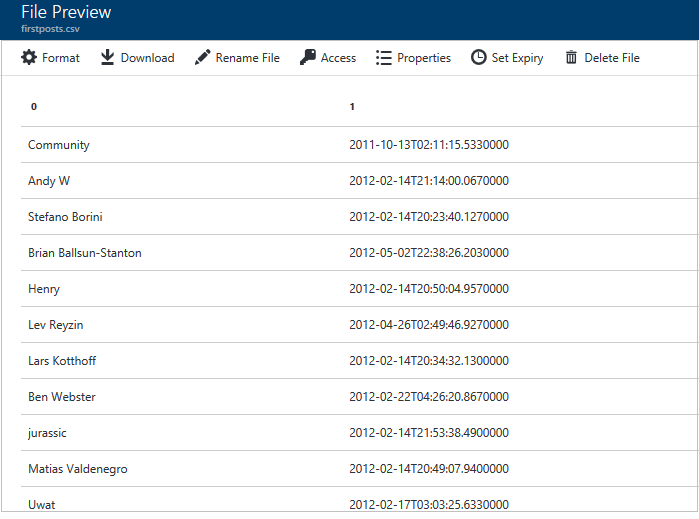

    _The query results_

You just demonstrated that U-SQL can be used to query multiple data sources of different types. You also saw one example of how C# expressions can be used to richen queries in U-SQL. 

## Summary ##

Azure Data Lake provides a hyperscale, enterprise-wide repository in which different types of data can be collected without regard to size, structure, or velocity. Once aggregated in a Data Lake Storage Gen1, data can be analyzed with Azure Data Lake Analytics, or processed with popular open-source tools such as Apache Hadoop and Apache Spark hosted in [Azure HDInsight](https://azure.microsoft.com/en-us/services/hdinsight/). In this lab, you learned how to import various types of data into a Data Lake Storage Gen1 and use Azure Data Lake Analytics to query the combined data with U-SQL. 

Azure Data Lake does not itself provide tools for visualizing query results, but other components of Azure and the Azure ecosystem do. For example, [Microsoft Power BI](https://powerbi.microsoft.com/en-us/) can be used to visualize query results and can even be connected directly to a Data Lake Storage Gen1. For more information about combining Azure Data Lake with Power BI and a tutorial to help guide the way, see [Analyze data in Data Lake Storage Gen1 by using Power BI](https://azure.microsoft.com/en-us/documentation/articles/data-lake-store-power-bi/).

---

Copyright 2017 Microsoft Corporation. All rights reserved. Except where otherwise noted, these materials are licensed under the terms of the MIT License. You may use them according to the license as is most appropriate for your project. The terms of this license can be found at https://opensource.org/licenses/MIT.
