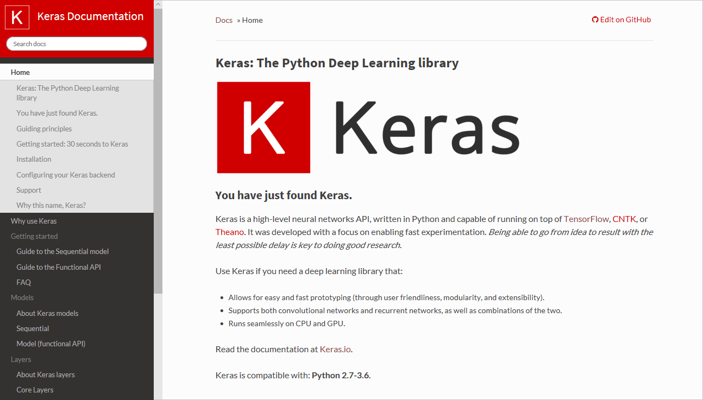
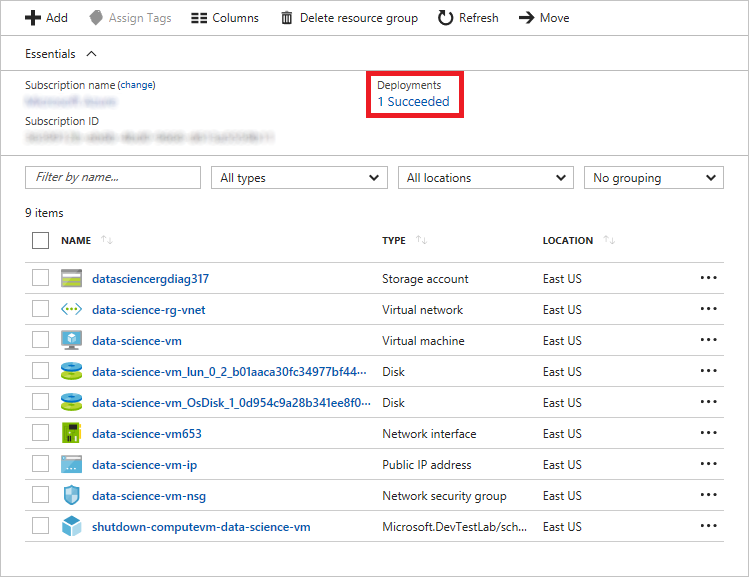
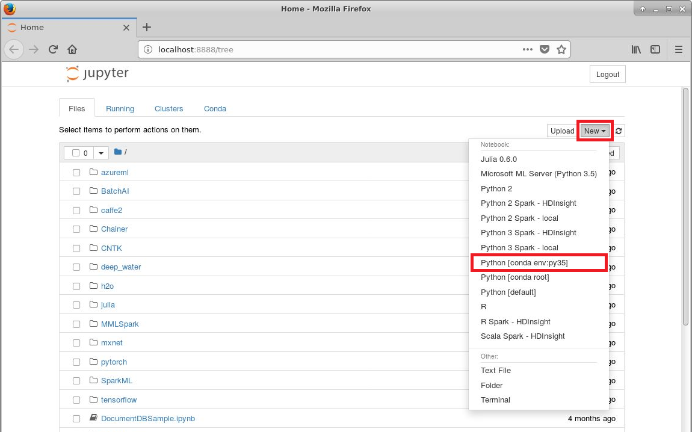
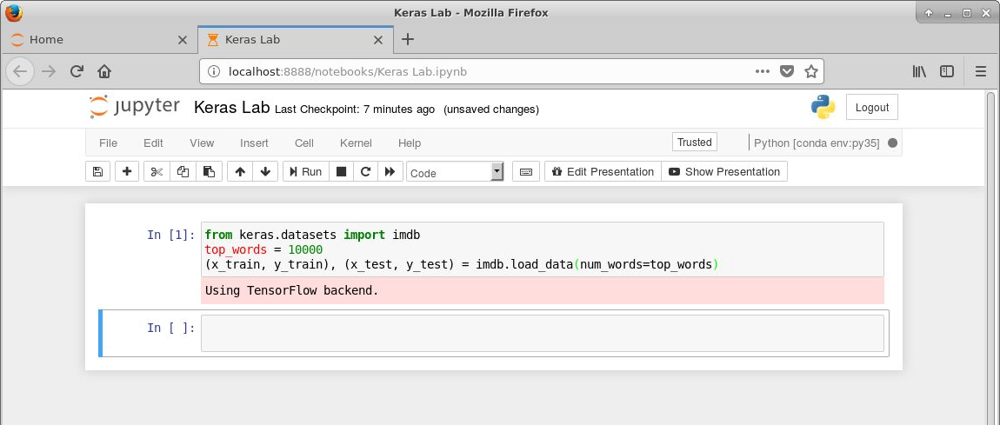
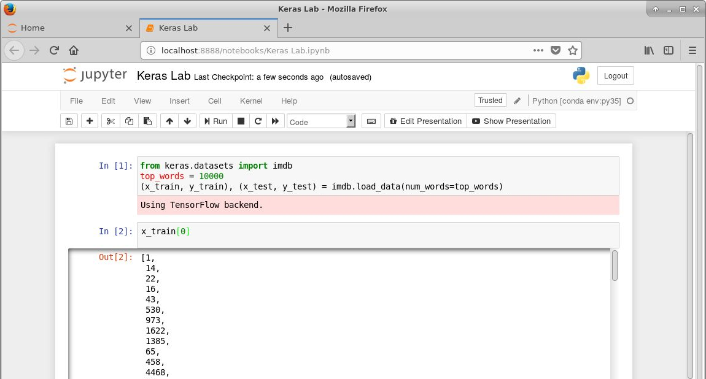
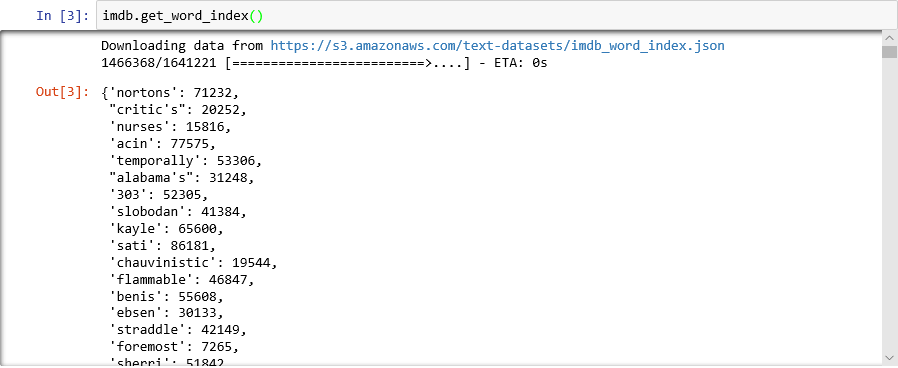
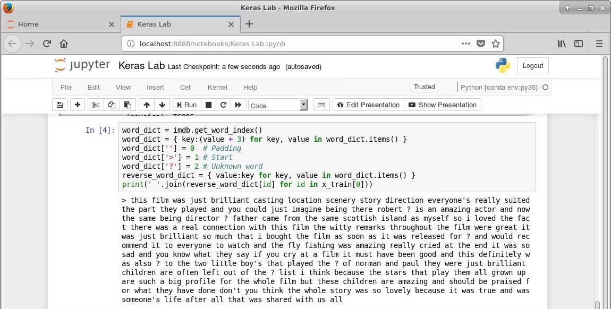
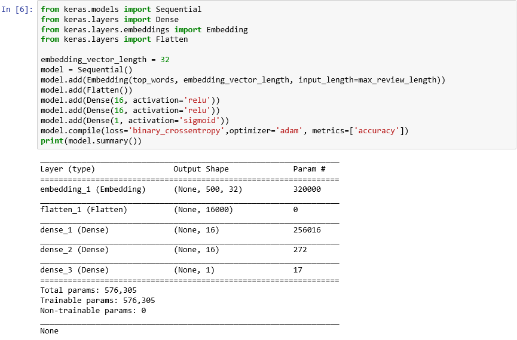
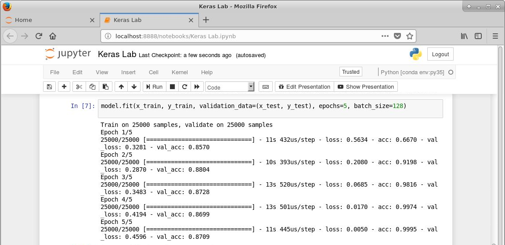

# Building Neural Networks with Keras #

Building neural networks isn't easy. Even with popular libraries such as the [Microsoft Cognitive Toolkit](https://www.microsoft.com/en-us/cognitive-toolkit/) and [TensorFlow](https://www.tensorflow.org/) to help out, it often requires several hundred lines of code to get a neural network up and running. That's one reason [Keras](https://keras.io/) has become popular in the deep-learning community. Keras is an open-source Python library that dramatically simplifies the building of neural networks. Under the hood, it uses the Microsoft Cognitive Toolkit, TensorFlow, or [Theano](https://github.com/Theano) to do the heavy lifting. With Keras, you can build sophisticated neural networks with just a few dozen lines of code and train them to classify images, analyze text for sentiment, perform natural-language processing, and perform other tasks at which deep learning excels.



In this lab, you will use Keras to build a neural network that scores text for sentiment. An input such as "Great service, and some of the best sushi I've ever tasted" will score close to 1.0 indicating the sentiment is very positive, while an input such as "The food was bland and the service was terrible" will score closer to 0.0. Such systems are widely used today to monitor Twitter, Yelp, and other social-media services for sentiment regarding businesses, political candidates, and other parties. And to simplify the setup and configuration, you will use Keras in an Azure [Data Science Virtual Machine](https://docs.microsoft.com/azure/machine-learning/data-science-virtual-machine/overview) (DSVM), which is a customized virtual-machine image hosted in Azure that is built specifically for data-science workloads. DSVMs come with [Jupyter](http://jupyter.org/), the Microsoft Cognitive Toolkit, TensorFlow, and other popular open-source tools preinstalled, and they run on Windows Server as well as Linux. The Linux edition is available in both Ubuntu and CentOS versions.

<a name="Objectives"></a>

### Objectives ###

In this hands-on lab, you will learn how to:

- Create a Linux Data Science Virtual Machine in Azure
- Connect to the DSVM via remote desktop
- Use Keras to build and train a neural network to perform sentiment analysis
- Use the neural network to analyze text for sentiment

<a name="Prerequisites"></a>

### Prerequisites ###

The following are required to complete this hands-on lab:

- An active Microsoft Azure subscription. If you don't have one, [sign up for a free trial](http://aka.ms/WATK-FreeTrial).
- An [Xfce](https://xfce.org/) remote-desktop client such as [X2Go](https://wiki.x2go.org/doku.php/download:start)

<a name="Cost"></a>

### Cost ###


The cost of this lab series is **moderate**. For an overview of cost ratings, refer to [Explanation of Costs](../../../Costs.md).

<a name="Exercises"></a>

## Exercises ##

This hands-on lab includes the following exercises:

- [Exercise 1: Create an Ubuntu Data Science VM](#Exercise1)
- [Exercise 2: Connect to the Data Science VM](#Exercise2)
- [Exercise 3: Build and train a neural network](#Exercise3)
- [Exercise 4: Use the neural network to analyze text for sentiment](#Exercise4)
- [Exercise 5: Delete the Data Science VM](#Exercise4)

Estimated time to complete this lab: **45** minutes.

<a name="Exercise1"></a>

## Exercise 1: Create an Ubuntu Data Science VM ##

The Data Science Virtual Machine for Linux is a virtual-machine image that simplifies getting started with data science. Multiple tools are already built, installed, and configured in order to get you up and running quickly. The NVIDIA GPU driver, [NVIDIA CUDA](https://developer.nvidia.com/cuda-downloads), and [NVIDIA CUDA Deep Neural Network](https://developer.nvidia.com/cudnn) (cuDNN) library are also included, as are [Jupyter](http://jupyter.org/), several sample Jupyter notebooks, and [TensorFlow](https://www.tensorflow.org/). All pre-installed frameworks are GPU-enabled but work on CPUs as well. In this exercise, you will create an instance of the Data Science Virtual Machine for Linux on Azure.

1. Open the [Azure Portal](https://portal.azure.com) in your browser. If asked to log in, do so using your Microsoft account.

1. Click **+ Create a resource** in the menu on the left side of the portal, and then type "data science" (without quotation marks) into the search box. Select **Data Science Virtual Machine for Linux (Ubuntu)** from the results list.

    

    _Finding the Ubuntu Data Science VM_

1. Take a moment to review the list of tools included in the VM. Then click **Create** at the bottom of the blade.

1. Fill in the "Basics" blade as shown below. Provide a password that's at least 12 characters long containing a mix of uppercase letters, lowercase letters, numbers and special characters. *Be sure to remember the user name and password that you enter, because you will need them later in the lab.*

    

    _Entering basic settings_

1. In the "Choose a size" blade, select **DS1_V2 Standard**, which provides a low-cost way to experiment with Data Science VMs. Then click the **Select** button at the bottom of the blade.

    

    _Choosing a VM size_

1. Click **OK** at the bottom of the "Settings" blade. Review the information presented to you in the "Create" blade, and then click **Create** to start the VM creation process.

    

    _Creating the VM_

1. Click **Resource groups** in the menu on the left side of the portal. Then click the "data-science-rg" resource group.

    

    _Opening the resource group_

1. Wait until "Deploying" changes to "Succeeded" indicating that DSVM and supporting Azure resources have been created. Deployment typically takes 5 minutes or less. Periodically click **Refresh** at the top of the blade to refresh the deployment status.

    

    _Monitoring the deployment_

Once the deployment has completed, proceed to the next exercise.

<a name="Exercise2"></a>

## Exercise 2: Connect to the Data Science VM ##

In this exercise, you will connect remotely to the Ubuntu desktop in the VM that you created in the previous exercise. To do so, you need a client that supports [Xfce](https://xfce.org/), which is a lightweight desktop environment for Linux. For background, and for an overview of the various ways you can connect to a DSVM, see [How to access the Data Science Virtual Machine for Linux
](https://docs.microsoft.com/en-us/azure/machine-learning/data-science-virtual-machine/dsvm-ubuntu-intro#how-to-access-the-data-science-virtual-machine-for-linux).

1. If you don't already have an Xfce client installed, download the [X2Go client](https://wiki.x2go.org/doku.php/download:start) and install it before continuing with this exercise. X2Go is a free and open-source Xfce solution that works on a variety of operating systems, including Windows and OS X. The instructions in this exercise assume you are using X2Go, but you may use any client that supports Xfce.

1. Return to the "data-science-rg" resource group in the Azure portal. Click the "data-science-vm" resource to open it in the portal.

    

    _Opening the Data Science VM_

1. Hover over the IP address shown for the VM and click the **Copy** button that appears to copy the IP address to the clipboard.

    

    _Copying the VM's IP address_

1. Start the X2Go client and connect to the Data Science VM using the IP address on the clipboard and the user name you specified in the previous exercise. Connect via port **22** (the standard port used for SSH connections), and specify **XFCE** as the session type. Click the **OK** button to confirm your preferences.

    

    _Connecting with X2Go_

1. In the "New session" panel on the right, select the resolution that you wish to use for the remote desktop. Then click **New session** at the top of the panel.

    

    _Starting a new session_

1. Enter the password you specified in [Exercise 1](#Exercise1), and then click the **OK** button. If asked if you trust the host key, answer **Yes**. Also ignore any error messages stating that the SSH daemon could not be started.

    

    _Logging into the VM_

1. Wait for the remote desktop to appear and confirm that it resembles the one below.

    > If the text and icons on the desktop are too large, terminate the session. Click the icon in the lower-right corner of the "New Session" panel and select **Session preferences...** from the menu. Go to the "Input/Output" tab in the "New session" dialog and adjust the display DPI, and then start a new session. Start with 96 DPI and adjust as needed.

    

    _Connected!_

Now that you are connected, take a moment to explore the shortcuts on the desktop. These are shortcuts to the numerous data-science tools preinstalled in the VM, which include [Jupyter](http://jupyter.org/), [R Studio](https://www.rstudio.com/), and the [Microsoft Azure Storage Explorer](https://azure.microsoft.com/en-us/features/storage-explorer/), among others.

<a name="Exercise3"></a>

## Exercise 3: Build and train a neural network ##

In this exercise, you will install Keras in the Data Science VM and use it to first build and then train a neural network to perform sentiment analysis. Keras will use TensorFlow to implement the network, but TensorFlow is already installed in the VM, so there's no need to install it separately. The Python code that you write to build and train the neural network will be executed in a [Jupyter notebook](http://jupyter.org/), which provides an interactive environment for entering and executing Python code and using popular Python libraries such as Keras, [NumPy](http://www.numpy.org/), and [Matplotlib](https://matplotlib.org/).

In order to train a neural network, you need data to train it with. Rather than download an external dataset, you will use the [IMDB movie reviews sentiment classification](https://keras.io/datasets/#imdb-movie-reviews-sentiment-classification) dataset that's included with Keras. The IMDB dataset contains 50,000 movie reviews that have been individually scored as positive (1) or negative (0). The dataset is divided into 25,000 reviews for training and 25,000 reviews for testing. The sentiment expressed in these reviews is the basis for which your neural network will analyze text presented to it and score it for sentiment.

> The IMDB dataset is one of several useful datasets included with Keras. For a complete list of built-in datasets, see https://keras.io/datasets/.

1. In the Data Science VM, click the Terminal icon at the bottom of the screen to open a terminal window.

    

    _Launching a terminal window_

1. Execute the following command in the terminal window to install Keras in the Data Science VM:

	```
	pip install --upgrade keras
	```

1. Double-click the Jupyter icon on the desktop to launch the Jupyter notebook server. Then click **New** and select **Python [conda env:py35]** from the menu to create a new notebook with a Python kernel.

    

    _Creating a new Jupyter nootebook_

1. Click the notebook title (it will probably default to "Untitled") and change the title to "Keras Lab."

    

    _Naming the notebook_

1. Enter the following code into the notebook's first cell and click the **Run** button (or press **Shift+Enter**) to execute it and add a new cell below it:

	```python
	from keras.datasets import imdb 
	top_words = 10000 
	(x_train, y_train), (x_test, y_test) = imdb.load_data(num_words=top_words)
	```

	This code loads the IMDB dataset that's included with Keras and creates a dictionary mapping the words in all 50,000 reviews to integers indicating the words' relative frequency of occurrence. Each word is assigned a unique integer. The most common word is assigned the number 1, the second most common word is assigned the number 2, and so on. `load_data` also returns a pair of tuples containing the movie reviews (in this example, `x_train` and `x_test`) and the 1s and 0s classifying those reviews as positive and negative (`y_train` and `y_test`).

1. Confirm that the dataset loads without errors and that you see the message "Using TensorFlow backend" indicating that Keras is using TensorFlow by default. Note that a [simple change to a JSON configuration file](https://keras.io/backend/) is all that's required to configure Keras to use the Microsoft Cognitive Toolkit or Theano instead.

    

    _Loading the IMDB dataset_

1. So what exactly the did the `load_data` function load? The variable named `x_train` is a list of 25,000 lists, each of which represents one movie review. (`x_test` is also a list of 25,000 lists representing 25,000 reviews. `x_train` will be used for training, while `x_test` will be used for testing.) But the inner lists — the ones representing movie reviews — don't contain words; they contain integers. Here's how it's described in the Keras documentation:

    

	The reason the inner lists contain numbers rather than text is that you don't train a neural network with text; you train it with numbers. Specifically, you train it with [tensors](https://en.wikipedia.org/wiki/Tensor). In this case, each review is a 1-dimensional tensor (think of a 1-dimensional array) containing integers identifying the words comprising the review. To demonstrate, type the following Python statement into an empty cell and execute it to see the integers representing the first review in the training set:

	```python
	x_train[0]
	```

    

    _Integers comprising the first review in the IMDB training set_

	The first number in the list — 1 — doesn't represent a word at all. It marks the start of the review and is the same for every review in the dataset. The numbers 0 and 2 are reserved as well, and you subtract 3 from the other numbers to map an integer in a review to the corresponding integer in the dictionary. The second number — 14 — references the word that corresponds to the number 11 in the dictionary, the third number represents the word assigned the number 19 in the dictionary, and so on.

1. Curious to see what the dictionary looks like? Execute the following statement in a new notebook cell:

	```python
	imdb.get_word_index()
	```

	Only a subset of the dictionary entries are shown, but in all, the dictionary contains more than 88,000 words and the integers that correspond to them. Note that the output you see will probably not match the output in the screen shot because the dictionary is generated anew each time `load_data` is called.

    

    _Dictionary mapping words to integers_

1. As you have seen, each review in the dataset is encoded as a collection of integers rather than words. Is it possible reverse-encode a review so you can see the original text that comprised it? Enter the following statements into a new cell and execute them to show the first review in `x_train` in textual format:

	```python
	word_dict = imdb.get_word_index()
	word_dict = { key:(value + 3) for key, value in word_dict.items() }
	word_dict[''] = 0  # Padding
	word_dict['>'] = 1 # Start
	word_dict['?'] = 2 # Unknown word
	reverse_word_dict = { value:key for key, value in word_dict.items() }
	print(' '.join(reverse_word_dict[id] for id in x_train[0]))
	```

	In the output, ">" marks the beginning of the review, while "?" marks words that aren't among the most common 10,000 words in the dataset. These "unknown" words are represented by 2s in the list of integers representing a review. Remember the `num_words` parameter you passed to `load_data`? This is where it comes into play. It doesn't reduce the size of the dictionary, but it restricts the range of integers used to encode the reviews.

    

    _The first review in textual format_

1. The reviews are "clean" in the sense that letters have been converted to lowercase and punctuation characters removed. But they are not quite ready to be used in deep learning. When you train a neural network with collection of tensors, each tensor needs to be the same length. At present, the lists representing reviews in `x_train` and `x_test` have varying lengths.

	Fortunately, Keras includes a function that takes a list of lists as input and converts the inner lists to a specified length by truncating them if necessary or padding them with 0s. Enter the following code into the notebook and run it to force all the lists representing movie reviews in `x_train` and `x_test` to a length of 500 integers:

	```python
	from keras.preprocessing import sequence 
	max_review_length = 500 
	x_train = sequence.pad_sequences(x_train, maxlen=max_review_length) 
	x_test = sequence.pad_sequences(x_test, maxlen=max_review_length)
	```

1. Now that the training and testing data is prepared, it is time to build the model! Run the following code in the notebook to create a neural network: 

	```python
	from keras.models import Sequential
	from keras.layers import Dense
	from keras.layers.embeddings import Embedding
	from keras.layers import Flatten
	
	embedding_vector_length = 32 
	model = Sequential() 
	model.add(Embedding(top_words, embedding_vector_length, input_length=max_review_length)) 
	model.add(Flatten())
	model.add(Dense(16, activation='relu'))
	model.add(Dense(16, activation='relu'))
	model.add(Dense(1, activation='sigmoid')) 
	model.compile(loss='binary_crossentropy',optimizer='adam', metrics=['accuracy']) 
	print(model.summary())
	```

	Confirm that the output looks like this:

    

    _Creating a neural network with Keras_

	TODO: Describe what this code does and how it does it. LOTS to talk about here! Also include a diagram depicting the network that was built.

1. Now call the `fit` function to to train the neural network:

	```python
	model.fit(x_train, y_train, validation_data=(x_test, y_test), epochs=5, batch_size=128)
	```

	Training should take about a minute, or 10 to 12 seconds per epoch. `epochs=5` tells Keras to make 5 forward and backward passes through the model. With each pass, the model learns from the training data and measures ("validates") how well it learned using the test data. Then it makes adjustments based on the validation results and goes back for the next pass or *epoch*. This is reflected in the output from the `fit` function, which shows the training accuracy (`acc`) and validation accuracy (`val_acc`) for each epoch.

    

    _Training the model_

	This model is somewhat unusual in that it learns well with just a few epochs. Note that the training accuracy quickly zooms to near 100%, while the validation accuracy goes up for an epoch or two and then flattens out. You generally don't want to train a model for any longer than is required for these accuracies to stabilize. The risk is [overfitting](https://en.wikipedia.org/wiki/Overfitting), which results in the model performing well against test data but not so well with real-world data. One indication that a model is overfitting is a growing discrepancy between the training accuracy and the validation accuracy. For a great introduction to overfitting, see [Overfitting in Machine Learning: What It Is and How to Prevent It](https://elitedatascience.com/overfitting-in-machine-learning).

1. Finish up by calling the model's `evaluate` method to determine how accurately the model is able to quantify the sentiment expressed in text based on the test data in `x_test` (reviews) and `y_test` (0s and 1s, or "labels," indicating which reviews are positive and which are negative):

	```python
	scores = model.evaluate(x_test, y_test, verbose=0) 
	print("Accuracy: %.2f%%" % (scores[1] * 100))
	```

	What is the computed accuracy of your model?

You probably achieved an accuracy in the 85% to 90% range. That's acceptable considering you built the model from scratch (as opposed to using a pretrained neural network) and the training time was short even in a VM that lacks a GPU. It *is* possible to achieve accuracies of 95% or higher with alternate neural network architectures, particularly [recurrent neural networks](https://en.wikipedia.org/wiki/Recurrent_neural_network) (RNNs) that utilize [Long Short-Term Memory](https://en.wikipedia.org/wiki/Long_short-term_memory) (LSTM) layers. Keras makes it easy to build such networks, but training time can increase exponentially. The model that you built strikes a reasonable balance between accuracy and training time. However, if you would like to learn more about building RNNs with Keras, see [Understanding LSTM and its Quick Implementation in Keras for Sentiment Analysis](https://towardsdatascience.com/understanding-lstm-and-its-quick-implementation-in-keras-for-sentiment-analysis-af410fd85b47).

<a name="Exercise4"></a>

## Exercise 4: Use the neural network to analyze text for sentiment ##

Of course, the real test comes when you input text of your own into the model and see how it performs — that is, how adept it is an quantifying the sentiment expressed in that text. In this exercise, you will write a Python function that accepts a text string as input, passes it to the model, and returns a sentiment score. Then you will use the function to analyze the sentiment expressed in various text strings.

1. Add the following code to a cell at the end of the notebook and run the cell:

	```python
	import string 
	import numpy as np
	
	def analyze(text):
	    # Prepare the input by removing punctuation characters, converting
	    # characters to lower case, and removing words containing numbers
	    translator = str.maketrans('', '', string.punctuation)
	    text = text.translate(translator)
	    text = text.lower().split(' ')
	    text = [word for word in text if word.isalpha()]
	
	    # Generate an input tensor
	    input = []
	    for word in text:
	        if word in word_dict and word_dict[word] < top_words:
	            input.append(word_dict[word])
	        else:
	            input.append(2)
	    padded_input = sequence.pad_sequences([input], maxlen=max_review_length)
	
	    # Invoke the model and return the result
	    result = model.predict(np.array([padded_input][0]))[0][0]
	    return result
	```

	These statements define a function named `analyze` that accepts a string as input and returns a number from 0.0 to 1.0 quantifying the sentiment expressed in that string. The higher the number, the more positive the sentiment. The function cleans the input string, converts it into a list of integers referencing words in the dictionary created by the `load_data` function, and finally calls the model's `predict` function to score the text for sentiment.

1. Use the notebook to execute the following statement:

	```python
	analyze('Absolutely delicious! Far and away the best sushi I have ever had.')
	```

	The output is the sentiment expressed in the input text as a number from 0.0 to 1.0. Would you agree with the model's assessment?

1. Now try this statement:

	```python
	analyze('The poor service and bland food really turned me off.')
	```

	How does the model quantify the sentiment expressed in this text?

Finish up by testing the model with input strings of your own. The results won't be perfect, but you should find that the model is reasonably adept at quantifying sentiment. Note that even though the model was trained with movie reviews, it isn't *limited* to analyzing movie reviews. That makes sense because there are inherent similarities between language expressing the like or dislike of a movie and words expressing feelings about other and perhaps completely unrelated subjects. 

<a name="Exercise5"></a>

## Exercise 5: Delete the Data Science VM ##

In this exercise, you will delete the resource group created in [Exercise 1](#Exercise1) when you created the Data Science VM. Deleting the resource group deletes everything in it and prevents any further charges from being incurred for it. Resource groups that are deleted can't be recovered, so be certain you're finished using it before deleting it. However, it is **important not to leave this resource group deployed any longer than necessary** because a Data Science VM is moderately expensive.

1. Return to the blade for the resource group you created in Exercise 1. Then click **Delete resource group** at the top of the blade.

    

    _Deleting the resource group_

1. For safety, you are required to type in the resource group's name. (Once deleted, a resource group cannot be recovered.) Type the name of the resource group. Then click the **Delete** button to remove all traces of this lab from your Azure subscription.

After a few minutes, the resource group and all of its resources will be deleted. Billing stops when you click **Delete**, so you're not charged for the time required to delete the resources. Similarly, billing doesn't start until the resources are fully and successfully deployed.

<a name="Summary"></a>

## Summary ##

Keras makes it remarkably easy to build and train neural networks to perform a wide range of deep-learning tasks. It doesn't absolve you from understanding various neural network architectures, knowing what types of layers to include in a network or the sizes of those layers, or, for example, understanding the role of activation functions and when to apply activation functions of different types, but once you have determined what to build, a few lines of code generally gets the job done. Moreover, Keras allows you to experiment with different network architectures and implementations and rather quickly compare the results.

If you would like to learn more about Keras, there are some great online resources available, including the [Keras blog](https://blog.keras.io/). You may also want to follow [François Chollet](https://twitter.com/fchollet) on Twitter. François is the author of Keras as well as the author of the book [Deep Learning with Python](https://www.amazon.com/Deep-Learning-Python-Francois-Chollet/dp/1617294438), which is the ultimate self-learning guide for Keras. In addition to introducing Keras and providing key insights to help you use it effectively, the book provides a working introduction to deep learning that is independent of the platforms and libraries that you use.

---

Copyright 2018 Microsoft Corporation. All rights reserved. Except where otherwise noted, these materials are licensed under the terms of the MIT License. You may use them according to the license as is most appropriate for your project. The terms of this license can be found at <https://opensource.org/licenses/MIT.>
