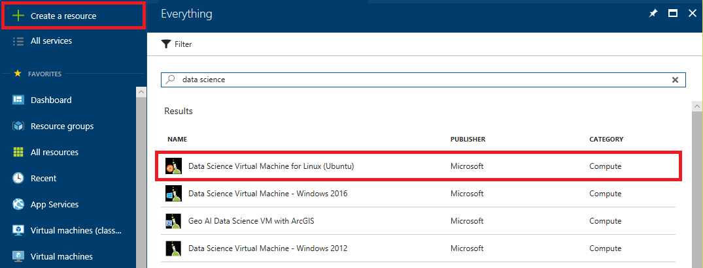
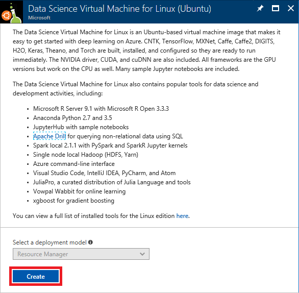
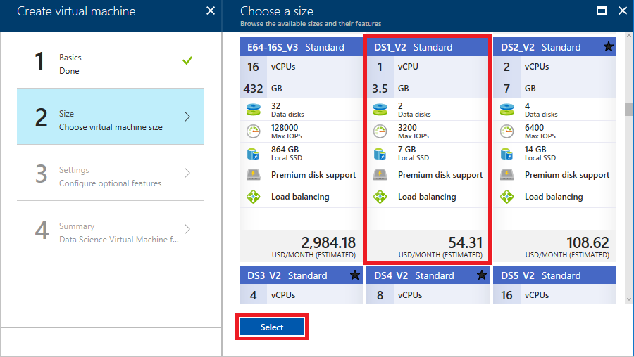
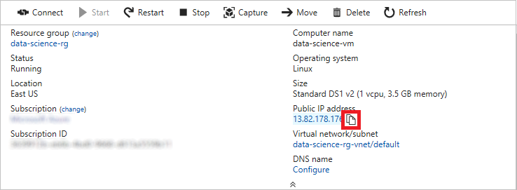
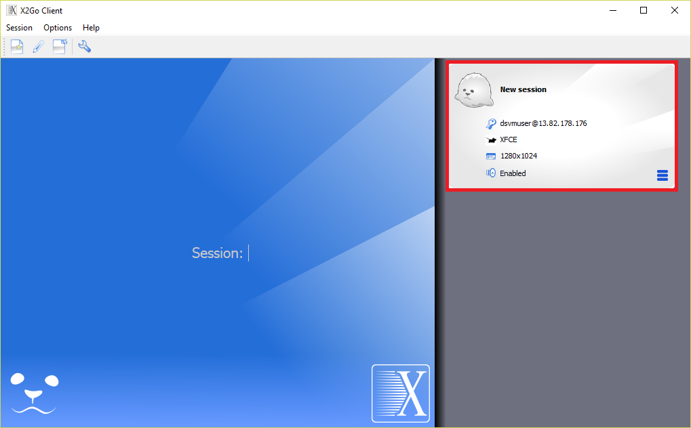
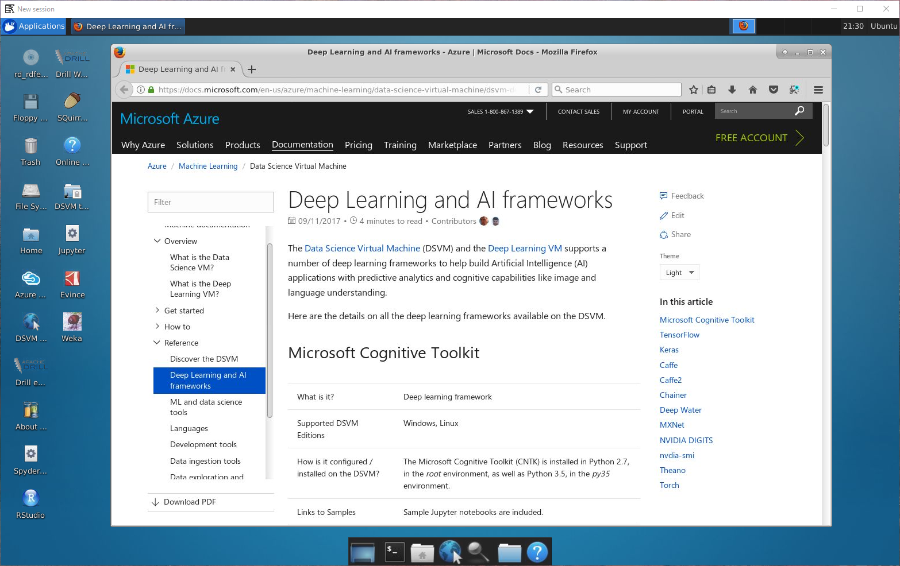
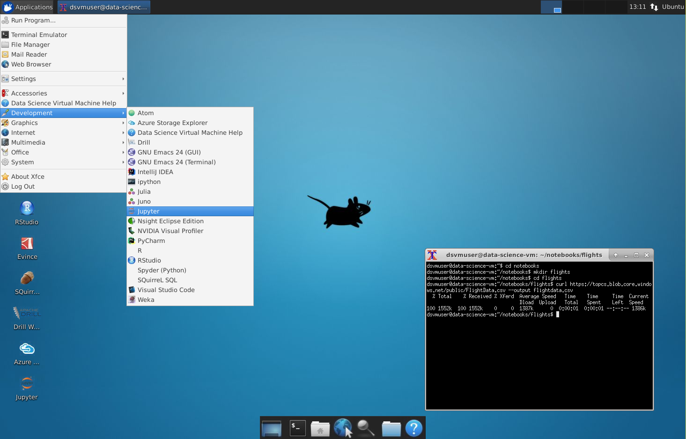
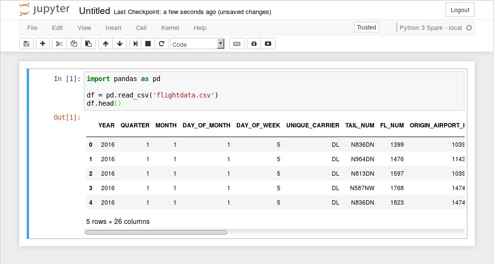

Data scientists use a variety of tools to ply their trade. One of the challenges they face is building an environment with the right software installed and configuring all the pieces to work in harmony. Microsoft's [Data Science Virtual Machine](https://docs.microsoft.com/azure/machine-learning/data-science-virtual-machine/overview) (DSVM) is a customized virtual-machine image hosted in Azure that is built specifically for data-science workloads. It comes with a number of popular open-source tools preinstalled, and it runs on Windows Server as well as Linux. The Linux edition is available in both Ubuntu and CentOS versions.

With a DSVM shouldering the load, you can get up and running quickly with popular tools  such as [Jupyter](http://jupyter.org/), [R Studio](https://www.rstudio.com/), and many others. You can choose a VM size that fits your needs and your budget, from a [D-series VM](https://docs.microsoft.com/azure/virtual-machines/windows/sizes-general#dsv2-series) with a single-core CPU and 3.5 GB of RAM all the way up to an [F-series VM](https://docs.microsoft.com/azure/virtual-machines/windows/sizes-compute) with 72 cores and 144 GB of RAM. Smaller VM sizes are ideal for learning and experimentation, while beefier VMs can handle deep-learning workloads that demand multiple cores, NVIDIA GPUs, and vast amounts of memory. A variation of the DSVM called the [Deep Learning Virtual Machine](https://docs.microsoft.com/azure/machine-learning/data-science-virtual-machine/deep-learning-dsvm-overview) that is optimized for GPUs is also available for running neural networks and other systems that require the ultimate in processing power.

In this lab, the first of four in a series, you will create a Linux Data Science Virtual Machine in Azure, connect to it via remote desktop, import a dataset from Azure blob storage, and load the dataset into a Jupyter notebook. In subsequent labs, you will clean the dataset with [Pandas](https://pandas.pydata.org/), build a machine-learning model with [Scikit-learn](http://scikit-learn.org/stable/), and use [Matplotlib](https://matplotlib.org/) to visualize output from the model.


<a name="Objectives"></a>
### Objectives ###

In this hands-on lab, you will learn how to:

- Create a Linux Data Science Virtual Machine
- Connect to the DSVM via remote desktop
- Import data files into the DSVM using ```curl```
- Create a Jupyter notebook in the DSVM 

<a name="Prerequisites"></a>
### Prerequisites ###

The following are required to complete this hands-on lab:

- An active Microsoft Azure subscription. If you don't have one, [sign up for a free trial](http://aka.ms/WATK-FreeTrial).
- An [Xfce](https://xfce.org/) remote-desktop client such as [X2Go](https://wiki.x2go.org/doku.php/download:start)

<a name="Cost"></a>
### Cost ###


The cost of this lab series is **moderate**. For an overview of cost ratings, refer to [Explanation of Costs](../../../Costs.md).

<a name="Exercises"></a>
## Exercises ##

This hands-on lab includes the following exercises:

- [Exercise 1: Create an Ubuntu Data Science VM](#Exercise1)
- [Exercise 2: Connect to the Data Science VM](#Exercise2)
- [Exercise 3: Download a dataset and create a Jupyter notebook](#Exercise3)

Estimated time to complete this lab: **20** minutes.

<a name="Exercise1"></a>
## Exercise 1: Create an Ubuntu Data Science VM ##

The Ubuntu Data Science Virtual Machine for Linux is a virtual-machine image that makes it easy to get started with data science. Multiple tools are already built, installed, and configured in order to get you up and running quickly. The NVIDIA GPU driver, [NVIDIA CUDA](https://developer.nvidia.com/cuda-downloads), and [NVIDIA CUDA Deep Neural Network](https://developer.nvidia.com/cudnn) library (cuDNN) are also included, as are [Jupyter](http://jupyter.org/) and several sample Jupyter notebooks. All installed frameworks are GPU-enabled but work on CPUs as well. In this exercise, you will create an instance of the Data Science Virtual Machine for Linux in Azure.

1. Open the [Azure Portal](https://portal.azure.com) in your browser. If asked to log in, do so using your Microsoft account.

1. Click **+ Create a resource** in the menu on the left side of the portal, and then type "data science" (without quotation marks) into the search box. Select **Data Science Virtual Machine for Linux (Ubuntu)** from the results list.

    

    _Finding the Ubuntu Data Science VM_

1. Take a moment to review the list of tools included in the VM. Then click **Create**.

    

    _Creating a Data Science VM_

1. Enter a name for the virtual machine and a user name for logging into it. Set **Authentication type** to **Password** and enter a password. *Be sure to remember the user name and password that you enter*, because you will need them to access the VM. Select **Create new** under **Resource group** and enter a resource-group name such as "data-science-rg." Select the **Location** nearest you, and then click **OK**..

    

    _Entering basic settings_

1. In the "Choose a size" blade, select **DS1_V2 Standard**, which provides a low-cost way to experiment with Data Science VMs. Then click the **Select** button at the bottom of the blade.

    

    _Choosing a VM size_

1. In the "Settings" blade, check **SSH (22)** in the list of inbound ports so clients can connect to the VM using the [Secure Shell](https://en.wikipedia.org/wiki/Secure_Shell) (SSH) protocol on port 22. Then click **OK**.

    

    _Creating the VM_

1. In the "Create" blade, take a moment to review the options you selected for the VM, and click **Create** to start the VM creation process.

    

    _Creating the VM_

1. Click **Resource groups** in the menu on the left side of the portal. Then click the resource group whose name you specified in Step 4.

    

    _Opening the resource group_

1. Wait until "Deploying" changes to "Succeeded" indicating that deployment has completed. Deployment typically takes 5 minutes or less. Periodically click **Refresh** at the top of the blade to refresh the deployment status.

    

    _Monitoring the deployment status_

The VM has been created. The next step is to connect to it remotely so you can work with the VM's Ubuntu desktop.

<a name="Exercise2"></a>
## Exercise 2: Connect to the Data Science VM ##

In this exercise, you will connect remotely to the Ubuntu desktop in the VM that you created in the previous exercise. To do so, you need a client that supports [Xfce](https://xfce.org/), which is a lightweight desktop environment for Linux.

1. If you don't already have an Xfce client installed, download the [X2Go client](https://wiki.x2go.org/doku.php/download:start) and install it now. X2Go is a free and open-source Xfce solution that works on a variety of operating systems. The instructions in this exercise assume you are using X2Go, but you can use any client as long as it supports Xfce.

1. Return to the Azure Portal and the blade for the resource group containing the Data Science VM. Then click the VM.

    

    _Opening the Data Science VM_

1. Hover over the IP address shown for the VM and click the **Copy** button that appears to copy the IP address to the clipboard.

    

    _Copying the VM's IP address_

1. Start the X2Go client and connect to the Data Science VM at the IP address that's on the clipboard using the user name you specified in the previous exercise. Connect via port **22** (the standard port used for SSH connections), and specify **XFCE** as the session type.

    

    _Connecting with X2Go_

1. In the **New session** panel on the right, select the resolution that you wish to use for the remote desktop. Then click the **New session** panel.

    

    _Starting a new session_

1. Enter the password you specified in [Exercise 1](#Exercise1), and then click the **OK** button. If asked if you trust the host key, answer **Yes**. Also ignore any error messages saying the "SSH daemon could not be started."

    

    _Logging into the VM_

1. Wait for the remote desktop to appear and confirm that it resembles the one below.

    

    _Connected!_

Now that you are connected, take a moment to explore the shortcuts on the desktop. These are shortcuts to the numerous data-science tools preinstalled in the VM, which include [Jupyter](http://jupyter.org/), [R Studio](https://www.rstudio.com/), and the [Microsoft Azure Storage Explorer](https://azure.microsoft.com/en-us/features/storage-explorer/), among others.

<a name="Exercise3"></a>
## Exercise 3: Download a dataset and create a Jupyter notebook ##

In this exercise, you will import a dataset from Azure blob storage into the VM and load it into a Jupyter notebook. Jupyter is already installed in the VM and is accessible through the **Applications** menu or through the shortcut on the desktop. Jupyter notebooks are widely used in the data-science community to explore, transform, and visualize data. Notebooks are highly interactive, and since they can include executable code, they provide the perfect platform for manipulating data and building predictive models from it. 

1. Click the Terminal icon at the bottom of the desktop to open a terminal window.

    

    _Opening a terminal window_

1. Enter the following commands in the terminal window to create a "flights" subdirectory in the "notebooks" directory and download a dataset from Azure blob storage into the "flights" subdirectory:

    ```bash
    cd notebooks
    mkdir flights
    cd flights
    curl https://topcs.blob.core.windows.net/public/FlightData.csv --output flightdata.csv
    ```

1. Click **Applications** in the upper-left corner of the desktop. Then click **Development**, followed by **JupyterHub**.

    

    _Launching JupyterHub_

1. In the browser window that opens, click **flights** to open the "flights" directory.

    

    _Opening the "flights" directory_

1. Confirm that **flightdata.csv** is present in the "flights" directory. Then click the **New** button and choose **Python 3 Spark - local** from the drop-down list to create a new Jupyter notebook with a Python 3 kernel.

    

    _Creating a new Jupyter notebook_

1. In the first cell of the notebook, enter the following Python code to load **flightdata.csv** and create a [Pandas DataFrame](https://pandas.pydata.org/pandas-docs/stable/generated/pandas.DataFrame.html) from it.

    ```python
    import pandas as pd

    df = pd.read_csv('flightdata.csv')
    df.head()
    ```

1. Select the **Run Cells** command from the **Cell** menu (or press **Ctrl+Enter**) to execute the Python code. Confirm that the output resembles the output below.

    

    _Loading the dataset_

	The DataFrame that you created contains on-time arrival information for a major U.S. airline. It has more than 11,000 rows and 26 columns. (The output says "5 rows" because DataFrame's [head](https://pandas.pydata.org/pandas-docs/stable/generated/pandas.DataFrame.head.html) function only returns the first five rows.) Each row represents one flight and contains information such as the origin, the destination, the scheduled departure time, and whether the flight arrived on time or late. You will learn more about the data, including its content and structure, in the next lab.

1. Use the **File** -> **Save and Checkpoint** command to save the notebook.

1. Use the **File** -> **Rename...** command to name the notebook "FlightData."

If you check the "flights" directory, you should find that it now contains a file named **FlightData.ipynb** containing the Jupyter notebook you created. You will return to this notebook in the next lab and use it to prepare the data for use in a machine-learning model.

<a name="Summary"></a>
## Summary ##

The Data Science Virtual Machine for Linux provides a preconfigured virtual machine ready to handle data-science workloads large and small. Now that you have an instance up and running and have a dataset loaded into it, proceed to the next lab in this series — [Using Microsoft's Data Science Virtual Machine to Build Predictive Machine-Learning Models, Part 2](../2%20-%20Process) — to begin shaping the dataset for machine learning.

---

Copyright 2018 Microsoft Corporation. All rights reserved. Except where otherwise noted, these materials are licensed under the terms of the MIT License. You may use them according to the license as is most appropriate for your project. The terms of this license can be found at https://opensource.org/licenses/MIT.
