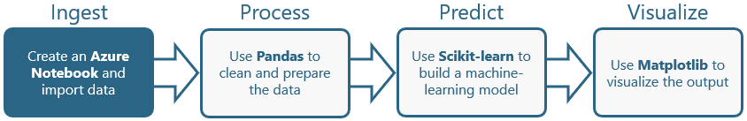
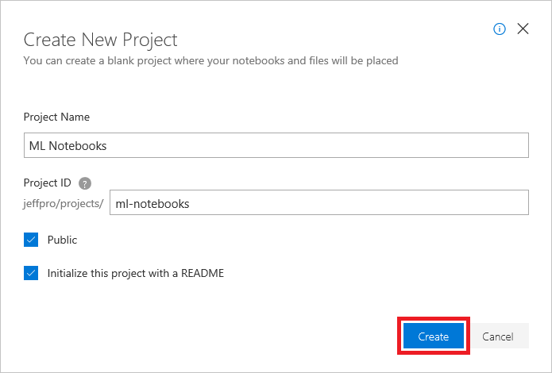
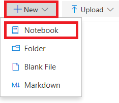
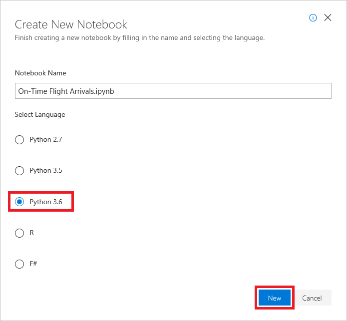
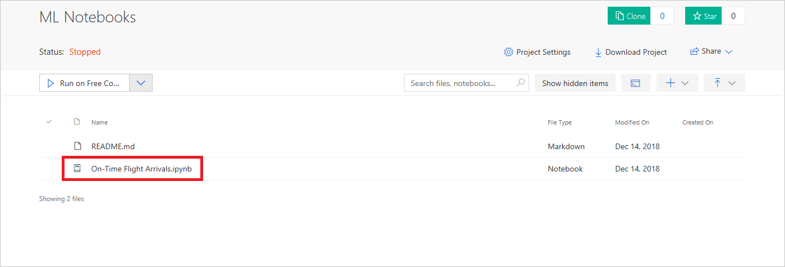
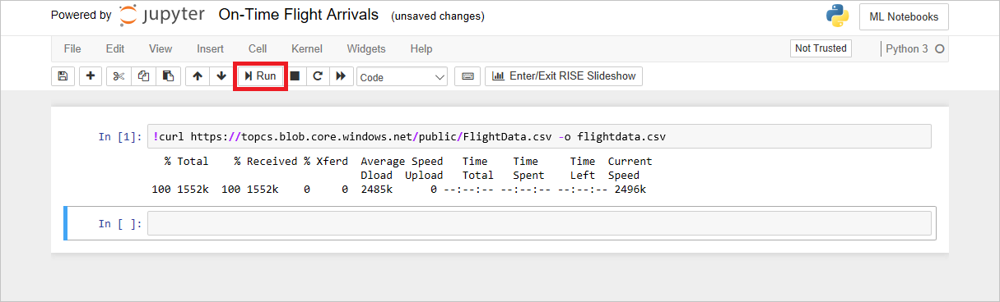
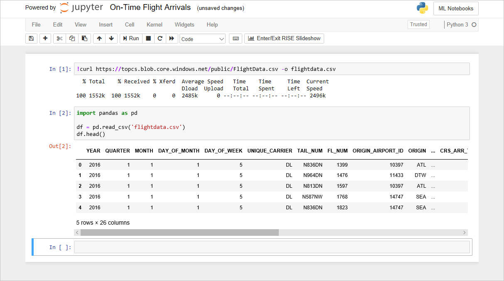

Python is one of the world's most popular programming languages. It is used extensively in the data-science community for machine learning and statistical analysis. One of the reasons it is so popular is the availability of thousands of open-source libraries such as [NumPy](http://www.numpy.org/), [Pandas](https://pandas.pydata.org/), [Matplotlib](https://matplotlib.org/), and [Scikit-learn](https://scikit-learn.org/stable/index.html), which enable programmers and researchers alike to explore, transform, analyze, and visualize data.

[Azure Notebooks](https://notebooks.azure.com/) is a cloud-based platform for building and running [Jupyter](http://jupyter.org/) notebooks. Jupyter is an environment based on [IPython](https://ipython.org/) that facilitates interactive programming and data analysis using Python and other programming languages. Azure Notebooks provide Jupyter as a service for free. It's a convenient way to write Python code without having to install and manage a Jupyter server. And it's completely Web-based, making it an ideal solution for collaborating online.

In this lab, the first of four in a series, you will create an Azure notebook, import a dataset containing on-time arrival information for a major U.S. airline, and load the dataset into the notebook. In subsequent labs, you will clean the dataset with [Pandas](https://pandas.pydata.org/), build a machine-learning model with [Scikit-learn](http://scikit-learn.org/stable/), and use [Matplotlib](https://matplotlib.org/) to visualize output from the model.



<a name="Objectives"></a>
### Objectives ###

In this hands-on lab, you will learn how to:

- Create a Jupyter notebook in Azure Notebooks
- Import data files and load them into notebooks
- View the data loaded into notebooks

<a name="Prerequisites"></a>
### Prerequisites ###

The following are required to complete this hands-on lab:

- An active Microsoft account. If you don't have one, [get one for free](https://account.microsoft.com/account).

<a name="Cost"></a>
### Cost ###


There is no cost associated with this lab because it doesn't require an Azure subscription. For an overview of cost ratings, refer to [Explanation of Costs](../../../Costs.md).

<a name="Exercises"></a>
## Exercises ##

This hands-on lab includes the following exercises:

- [Exercise 1: Create an Azure notebook](#Exercise1)
- [Exercise 2: Import and load a dataset](#Exercise2)

Estimated time to complete this lab: **10** minutes.

<a name="Exercise1"></a>
## Exercise 1: Create an Azure notebook ##

The first order of business is to create a new Azure notebook. Azure notebooks are contained in projects, whose primary purpose is to group related notebooks. In this exercise, you will create a new project and then create a notebook inside it.

1. Navigate to https://notebooks.azure.com in your browser and sign in using your Microsoft account. Click **My Projects** in the menu at the top of the page. Then click the **+ New Project** button at the top of the "My Projects" page.

1. Create a new project named "ML Notebooks" or something similar. You may uncheck the "Public" box if you'd like, but making the project public allows the notebooks in it to be shared with others through links, social media, or e-mail. If you're unsure which to choose, you can easily change a project to public or private later on.

	

	_Creating a project_

1. Click **+ New** and select **Notebook** from the menu to add a notebook to the project.

	

	_Adding a notebook to the project_

1. Give the notebook a name such as "On-Time Flight Arrivals.ipynb", and select **Python 3.6** as the language. This will create a notebook with a Python 3.6 kernel for executing Python code. One of the strengths of Azure notebooks is that you can use different languages by choosing different kernels.

	

	_Creating a notebook_

	If you're curious, the .ipynb file-name extension stands for "IPython notebook." Jupyter notebooks were originally known as IPython (Interactive Python) notebooks, and they only supported Python as a programming language. The name Jupyter is a combination of Julia, Python, and R — the core programming languages that Jupyter supports.

1. Click the notebook to open it for editing.

	

	_Opening the notebook_

You can create additional projects and notebooks as you work with Azure Notebooks. You can create notebooks from scratch, or you can upload existing notebooks. In the next exercise, you will import a dataset and load it into the notebook you created.

<a name="Exercise2"></a>
## Exercise 2: Import and load a dataset ##

In this exercise, you will import a dataset from Azure blob storage and load it into the notebook. Jupyter notebooks are highly interactive, and since they can include executable code, they provide the perfect platform for manipulating data and building predictive models from it. 

1. Enter the following command into the first cell of the notebook:

    ```bash
    !curl https://topcs.blob.core.windows.net/public/FlightData.csv -o flightdata.csv
    ```

	```curl``` is a Bash command. You can execute Bash commands in a Jupyter notebook by prefixing them with an excalamation mark. This command downloads a CSV file from Azure blob storage and saves it using the name **flightdata.csv**.

1. Click the **Run** button to execute the ```curl``` command.

    

    _Importing a dataset_

1. In the notebook's second cell, enter the following Python code to load **flightdata.csv**, create a [Pandas DataFrame](https://pandas.pydata.org/pandas-docs/stable/generated/pandas.DataFrame.html) from it, and display the first five rows.

    ```python
    import pandas as pd

    df = pd.read_csv('flightdata.csv')
    df.head()
    ```

1. Click the **Run** button to execute the code. Confirm that the output resembles the output below.

    

    _Loading the dataset_

	The DataFrame that you created contains on-time arrival information for a major U.S. airline. It has more than 11,000 rows and 26 columns. (The output says "5 rows" because DataFrame's [head](https://pandas.pydata.org/pandas-docs/stable/generated/pandas.DataFrame.head.html) function only returns the first five rows.) Each row represents one flight and contains information such as the origin, the destination, the scheduled departure time, and whether the flight arrived on time or late. You will learn more about the data, including its content and structure, in the next lab.

1. Use the **File** -> **Save and Checkpoint** command to save the notebook.

Use the horizontal scroll bar to scroll left and right and view all the columns in the dataset. How many columns does the dataset contain? Can you guess what each column represents from the column names?

<a name="Summary"></a>
## Summary ##

Now that you have an Azure notebook up and running and have a dataset loaded into it, proceed to the next lab in this series — [Using Python and Azure Notebooks to Build Predictive Machine-Learning Models, Part 2](../2%20-%20Process) — to begin shaping the dataset for use in machine learning.

---

Copyright 2018 Microsoft Corporation. All rights reserved. Except where otherwise noted, these materials are licensed under the terms of the MIT License. You may use them according to the license as is most appropriate for your project. The terms of this license can be found at https://opensource.org/licenses/MIT.
