<a name="Overview"></a>
## Overview ##

In the real world, few datasets can be used as is to train machine-learning models. It is not uncommon for data scientists to spend 80% or more of their time on a project cleaning, preparing, and shaping the data — a process sometimes referred to as *data wrangling*. Typical actions include removing duplicate rows, removing rows or columns with missing values or algorithmically replacing the missing values, normalizing data, and selecting feature columns. A machine-learning model is only as good as the data it is trained with. Preparing the data is arguably the most crucial step in the machine-learning process. 

In this lab, the second of four in a series, you will use the Jupyter notebook you created in the previous lab to wrangle the dataset that you imported. You will use the [Python Data Analysis Library](https://pandas.pydata.org/pandas-docs/stable/) (Pandas) to do the bulk of the work in transforming the data. The goal is to get the dataset ready to use in a machine-learning model, and to get first-hand experience with Pandas.


<a name="Objectives"></a>
### Objectives ###

In this hands-on lab, you will learn how to:

- Use Pandas to identify columns in a dataset with missing values
- Use Pandas to replace missing values with real values
- Use Pandas to filter columns in a dataset
- Use Pandas to quantize values in a column
- Use Pandas to create indicator columns representing categorical data

<a name="Prerequisites"></a>
### Prerequisites ###

If you haven't completed the [previous lab in this series](../1%20-%20Ingest), you must do so before starting this lab.

<a name="Exercises"></a>
## Exercises ##

This hands-on lab includes the following exercises:

- [Exercise 1: Explore the data](#Exercise1)
- [Exercise 2: Clean the data](#Exercise2)
- [Exercise 3: Bin departure times and add indicator columns](#Exercise3)

Estimated time to complete this lab: **20** minutes.

<a name="Exercise1"></a>
## Exercise 1: Explore the data ##

Before you can prepare a dataset, you need to understand its content and structure. In the previous lab, you imported a dataset containing on-time arrival information for a major U.S. airline. That data included 26 columns and thousands of rows, with each row representing one flight and containing information such as the flight's origin, destination, and scheduled departure time. You also loaded the data into a Jupyter notebook and used a simple Python script to create a Pandas DataFrame from it.

A [DataFrame](https://pandas.pydata.org/pandas-docs/stable/generated/pandas.DataFrame.html) is a two-dimensional labeled data structure. The columns in a DataFrame can be of different types, just like columns in a spreadsheet or database table. It is the most commonly used object in Pandas. In this exercise, you will examine the DataFrame — and the data inside it — more closely.

1. Return to [Azure Notebooks](https://notebooks.azure.com) and to the notebook that you created in the previous lab. If you closed the notebook after the previous lab, use the **Cell** -> **Run All** to rerun the all of the cells in the notebook after opening it.

	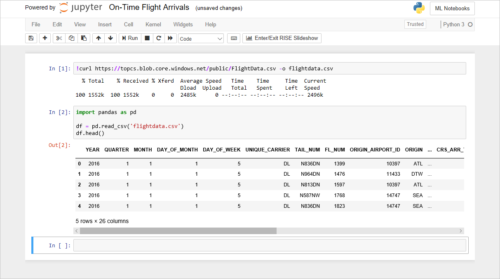

	_The FlightData notebook_

1. The code that you added to the notebook in the previous lab creates a DataFrame from **flightdata.csv** and calls [DataFrame.head](https://pandas.pydata.org/pandas-docs/stable/generated/pandas.DataFrame.head.html) on it to display the first five rows. One of the first things you typically want to know about a dataset is how many rows it contains. To get a count, type the following statement into an empty cell at the end of the notebook and run it:

	```python
	df.shape
	```

	Confirm that the DataFrame contains 11,231 rows and 26 columns:

	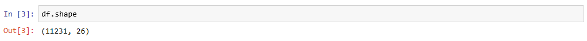

	_Getting a row and column count_

1. Now take a moment to examine the 26 columns in the dataset. They contain important information such as the date that the flight took place (YEAR, MONTH, and DAY_OF_MONTH), the origin and destination (ORIGIN and DEST), the scheduled departure and arrival times (CRS_DEP_TIME and CRS_ARR_TIME), the difference between the scheduled arrival time and the actual arrival time in minutes (ARR_DELAY), and whether the flight was late by 15 minutes or more (ARR_DEL15). 

	Here is a complete list of the columns in the dataset. Times are expressed in 24-hour military time. For example, 1130 equals 11:30 a.m. and 1500 equals 3:00 p.m.

	| Column              | Description                                                                      |
	|---------------------|----------------------------------------------------------------------------------|
	| YEAR                | Year that the flight took place                                                  |
	| QUARTER             | Quarter that the flight took place<br>(1-4)                                         |
	| MONTH               | Month that the flight took place<br>(1-12)                                          |
	| DAY_OF_MONTH        | Day of the month that the flight took place<br>(1-31)                               |
	| DAY_OF_WEEK         | Day of the week that the flight took place<br> (1=Monday, 2=Tuesday, etc.)           |
	| UNIQUE_CARRIER      | Airline carrier code (e.g., DL)                                                  |
	| TAIL_NUM            | Aircraft tail number                                                             |
	| FL_NUM              | Flight number                                                                    |
	| ORIGIN_AIRPORT_ID   | ID of the airport of origin                                                      |
	| ORIGIN              | Origin airport code (ATL, DFW, SEA, etc.)                                        |
	| DEST_AIRPORT_ID     | ID of the destination airport                                                    |
	| DEST                | Destination airport code (ATL, DFW, SEA, etc.)                                   |
	| CRS_DEP_TIME        | Scheduled departure time                                                         |
	| DEP_TIME            | Actual departure time                                                            |
	| DEP_DELAY           | Number of minutes departure was delayed                                          |
	| DEP_DEL15           | 0=Departure delayed less than 15 minutes <br> 1=Departure delayed 15 minutes or more |
	| CRS_ARR_TIME        | Scheduled arrival time                                                           |
	| ARR_TIME            | Actual arrival time                                                              |
	| ARR_DELAY           | Number of minutes flight arrived late                                            |
	| ARR_DEL15           | 0=Arrived less than 15 minutes late <br> 1=Arrived 15 minutes or more late           |
	| CANCELLED           | 0=Flight was not cancelled  <br> 1=Flight was cancelled                               |
	| DIVERTED            | 0=Flight was not diverted <br> 1=Flight was diverted                                 |
	| CRS_ELAPSED_TIME    | Scheduled flight time in minutes                                                 |
	| ACTUAL_ELAPSED_TIME | Actual flight time in minutes                                                    |
	| DISTANCE            | Distance traveled in miles                                                       |

The dataset includes a roughly even distribution of dates throughout the year, which is important because a flight out of Minneapolis is less likely to be delayed due to winter storms in July than it is in January. But this dataset is far from being "clean" and ready to use. Let's write some Pandas code to clean it up.

<a name="Exercise2"></a>
## Exercise 2: Clean the data ##

One of the most important aspects of preparing a dataset for use in machine learning is selecting the "feature" columns that are relevant to the outcome you are trying to predict while filtering out columns that do not affect the outcome, could bias it in a negative way, or might produce [multicollinearity](https://en.wikipedia.org/wiki/Multicollinearity). Another important task is to eliminate missing values, either by deleting the rows or columns containing them or replacing them with meaningful values. In this exercise, you will eliminate extraneous columns and replace missing values in the remaining columns.

1. One of the first things data scientists typically look for in a dataset is missing values. There's an easy way to check for missing values in Pandas. To demonstrate, execute the following code in a cell at the end of the notebook: 

	```python
	df.isnull().values.any()
	```

	Confirm that the output is "True," which indicates that there is at least one missing value somewhere in the dataset.

    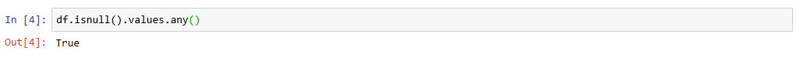

    _Checking for missing values_

1. The next step is to find out where the missing values are. To do so, execute the following code:

	```python
	df.isnull().sum()
	```

	Confirm that you see the following output listing a count of missing values in each column:

    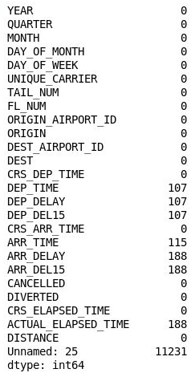

    _Number of  missing values in each column_

1. Curiously, the 26th column ("Unnamed: 25") contains 11,231 missing values, which equals the number of rows in the dataset. This column was mistakenly created because the CSV file that you imported contains a comma at the end of each line. To eliminate that column, add the following code to the notebook and execute it:

	```python
	df = df.drop('Unnamed: 25', axis=1)
	df.isnull().sum()
	```

	Inspect the output and confirm that column 26 has disappeared from the DataFrame:

    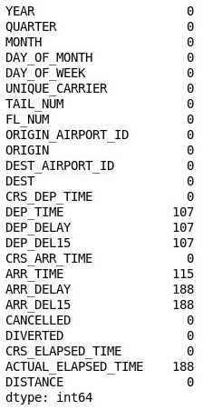

    _The DataFrame with column 26 removed_

1. The DataFrame still contains a lot of missing values, but some of them are irrelevant because the columns containing them are not germane to the model that you are building. The goal of that model is to predict whether a flight you are considering booking is likely to arrive on time. If you know that the flight is likely to be late, you might choose to book another flight.

	The next step, therefore, is to filter the dataset to eliminate columns that aren't relevant to a predictive model. For example, the aircraft's tail number probably has little bearing on whether a flight will arrive on time, and at the time you book a ticket, you have no way of knowing whether a flight will be cancelled, diverted, or delayed. By contrast, the scheduled departure time could have a *lot* to do with on-time arrivals. Because of the hub-and-spoke system used by most airlines, morning flights tend to be on time more often than afternoon or evening flights. And at some major airports, traffic stacks up during the day, increasing the likelihood that later flights will be delayed.

	Pandas provides an easy way to filter out columns you don't want. Execute the following code in a new cell at the end of the notebook:

	```python
	df = df[["MONTH", "DAY_OF_MONTH", "DAY_OF_WEEK", "ORIGIN", "DEST", "CRS_DEP_TIME", "ARR_DEL15"]]
	df.isnull().sum()
	```

	The output shows that the DataFrame now includes only the columns that are relevant to the model, and that the number of missing values is greatly reduced:

    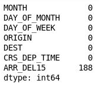

    _The filtered DataFrame_

1. The only column that now contains missing values is the ARR_DEL15 column, which uses 0s to identify flights that arrived on time and 1s for flights that didn't. Use the following code to show the first five rows with missing values:

	```python
	df[df.isnull().values.any(axis=1)].head()
	```

	Pandas represents missing values with ```NaN```, which stands for *Not a Number*. The output shows that these rows are indeed missing values in the ARR_DEL15 column:

    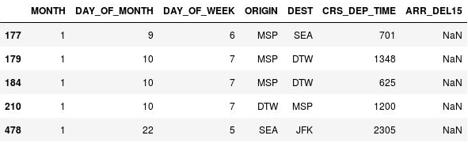

    _Rows with missing values_

1. The reason these rows are missing ARR_DEL15 values is that they all correspond to flights that were canceled or diverted. You could call [dropna](https://pandas.pydata.org/pandas-docs/stable/generated/pandas.DataFrame.dropna.html) on the DataFrame to remove these rows. But since a flight that is canceled or diverted to another airport could be considered "late," let's use the [fillna](https://pandas.pydata.org/pandas-docs/stable/generated/pandas.DataFrame.fillna.html) method to replace the missing values with 1s.

	Use the following code to replace missing values in the ARR_DEL15 column with 1s and display rows 177 through 184:
 
	```python
	df = df.fillna({'ARR_DEL15': 1})
	df.iloc[177:185]
	```

	Confirm that the ```NaN```s in rows 177, 179, and 184 were replaced with 1s indicating that the flights arrived late:

    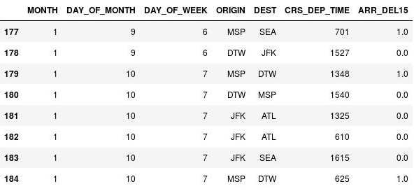

    _NaNs replaced with 1s_

The dataset is now "clean" in the sense that missing values have been replaced and the list of columns has been narrowed to those most relevant to the model. But you're not finished yet. There is more to do to prepare the dataset for use in machine learning.
 
<a name="Exercise3"></a>
## Exercise 3: Bin departure times and add indicator columns ##

The CRS_DEP_TIME column of the dataset you are using represents scheduled departure times. The granularity of the numbers in this column — it contains more than 500 unique values — could have a negative impact on accuracy in a machine-learning model. This can be resolved using a technique called [binning](http://data-informed.com/enhance-machine-learning-with-standardizing-binning-reducing/) or quantization. What if you divided each number in this column by 100 and rounded down to the nearest integer? 1030 would become 10, 1925 would become 19, and so on, and you would be left with a maximum of 24 discrete values in this column. Intuitively, it makes sense, because it probably doesn't matter much whether a flight leaves at 10:30 a.m. or 10:40 a.m. It matters a great deal whether it leaves at 10:30 a.m. or 5:30 p.m.

In addition, the dataset's ORIGIN and DEST columns contain airport codes that represent categorical machine-learning values. These columns need to be converted into discrete columns containing indicator variables, sometimes known as "dummy" variables. In other words, the ORIGIN column, which contains five airport codes, needs to be converted into five columns, one per airport, with each column containing 1s and 0s indicating whether a flight originated at the airport that the column represents. The DEST column needs to be handled in a similar manner.

In this exercise, you will "bin" the departure times in the CRS_DEP_TIME column and use Pandas' [get_dummies](https://pandas.pydata.org/pandas-docs/stable/generated/pandas.get_dummies.html) method to create indicator columns from the ORIGIN and DEST columns.

1. Use the following command to display the first five rows of the DataFrame:

	```python
	df.head()
	```

	Observe that the CRS_DEP_TIME column contains values from 0 to 2359 representing military times.

	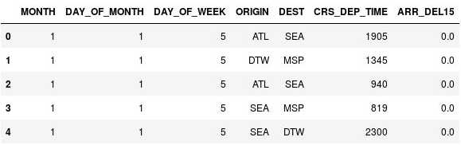

	_The DataFrame with unbinned departure times_

1. Use the following statements to bin the departure times:

	```python
	import math
	
	for index, row in df.iterrows():
	    df.loc[index, 'CRS_DEP_TIME'] = math.floor(row['CRS_DEP_TIME'] / 100)
	df.head()
	```

	Confirm that the numbers in the CRS_DEP_TIME column now fall in the range 0 to 23:

	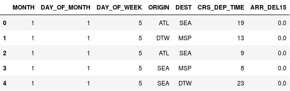

	_The DataFrame with binned departure times_

1. Now use the following statements to generate indicator columns from the ORIGIN and DEST columns, while dropping the ORIGIN and DEST columns themselves:

	```python
	df = pd.get_dummies(df, columns=['ORIGIN', 'DEST'])
	df.head() 
	```

	Examine the resulting DataFrame and observe that the ORIGIN and DEST columns were replaced with columns corresponding to the airport codes present in the original columns. The new columns have 1s and 0s indicating whether a given flight originated at or was destined for the corresponding airport.
  
   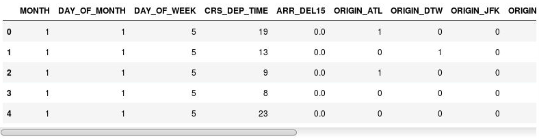

   _The DataFrame with indicator columns_

1. Use the **File** -> **Save and Checkpoint** command to save the notebook.
   
The dataset looks very different than it did at the start, but it is now optimized for use in machine learning.

<a name="Summary"></a>
## Summary ##

In this lab, you used Pandas to clean and prepare the flight dataset for use in machine learning. In addition to filtering the columns and replacing missing values, you binned departure times and created indicator columns that allow airport codes to be used as categorical values. Now proceed to the next lab  — [Using Python and Azure Notebooks to Build Predictive Machine-Learning Models, Part 3](../3%20-%20Predict) — and put the dataset to work using [Scikit-learn](http://scikit-learn.org/stable/). 

---

Copyright 2018 Microsoft Corporation. All rights reserved. Except where otherwise noted, these materials are licensed under the terms of the MIT License. You may use them according to the license as is most appropriate for your project. The terms of this license can be found at https://opensource.org/licenses/MIT.
