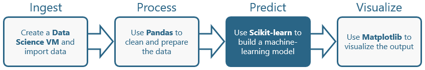
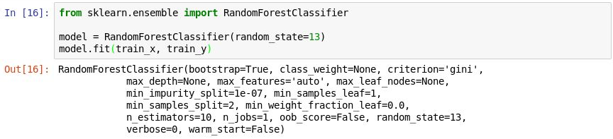
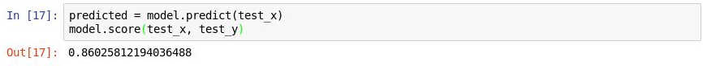
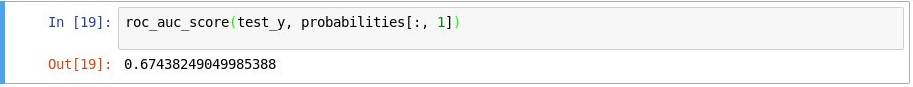
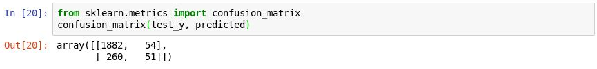
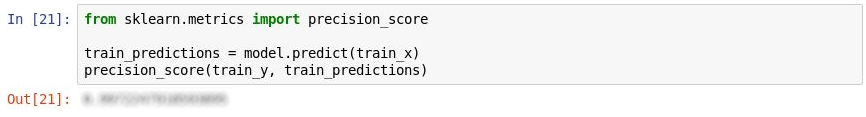
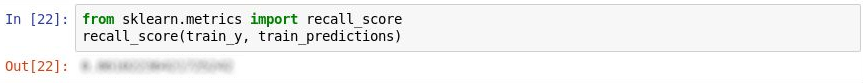

<a name="Overview"></a>
## Overview ##

Machine learning, which facilitates predictive analytics using large volumes of data by employing algorithms that iteratively learn from that data, is one of the fastest growing areas of data science. Its uses range from credit-card fraud detection and self-driving cars to optical character recognition (OCR) and online shopping recommendations. It makes us smarter by making computers smarter. And its usefulness will only increase as more and more data becomes available and the desire to perform predictive analytics from that data grows, too.

One of the most popular tools for building machine-learning models is [Scikit-learn](http://scikit-learn.org/stable/), a free and open-source toolkit for Python programmers. It has built-in support for popular regression, classification, and clustering algorithms and works with other Python libraries such as [NumPy](http://www.numpy.org/) and [SciPy](https://www.scipy.org/). With Sckit-learn, a simple method call can replace hundreds of lines of hand-written code. Sckit-learn allows you to focus on building, training, tuning, and testing machine-learning models without getting bogged down coding algorithms.

In this lab, the third of four in a series, you will use Sckit-learn to build a machine-learning model utilizing on-time arrival data for a major U.S. airline. The goal is to create a model that might be useful in the real world for predicting whether a flight is likely to arrive on time. It is precisely the kind of problem that machine learning is commonly used to solve. And it's a great way to increase your machine-learning chops while getting acquainted with Scikit-learn.



<a name="Objectives"></a>
### Objectives ###

In this hands-on lab, you will learn how to:

- Use Sckit-learn to split the data into separate datasets for training and testing
- Use Sckit-learn to create a machine-learning model
- Use Sckit-learn to analyze the model's accuracy

<a name="Prerequisites"></a>
### Prerequisites ###

If you haven't completed the [previous lab in this series](../2%20-%20Process), you must do so before starting this lab.

<a name="Exercises"></a>
## Exercises ##

This hands-on lab includes the following exercises:

- [Exercise 1: Split the data](#Exercise1)
- [Exercise 2: Train a machine-learning model](#Exercise2)
- [Exercise 3: Gauge the model's accuracy](#Exercise3)

Estimated time to complete this lab: **20** minutes.

<a name="Exercise1"></a>
## Exercise 1: Split the data ##

To create a machine-learning model, you need two datasets: one for training and one for testing. In practice, you often have only one dataset, so you split it into two datasets. In this exercise, you will perform an 80-20 split on the DataFrame you prepared in the previous lab so you can use it to train a machine-learning model. You will also separate the DataFrame into feature columns and label columns. The former contains the columns used as input to the model (for example, the flight's origin and destination and the scheduled departure time), while the latter contains the column that the model will attempt to predict — in this case, the ARR_DEL15 column which indicates whether a flight will arrive on time.

1. Return to [Azure Notebooks](https://notebooks.azure.com) and to the notebook that you created in the first lab. If you closed the notebook after the previous lab, use the **Cell** -> **Run All** to rerun the all of the cells in the notebook after opening it.

1. In a new cell at the end of the notebook, enter and execute the following statements: 

	```python
	from sklearn.model_selection import train_test_split
	train_x, test_x, train_y, test_y = train_test_split(df.drop('ARR_DEL15', axis=1), df['ARR_DEL15'], test_size=0.2, random_state=42)
	```

	The first statement imports Sckit-learn's [train_test_split](http://scikit-learn.org/stable/modules/generated/sklearn.model_selection.train_test_split.html) helper function. The second line uses the function to split the DataFrame into a training set containing 80% of the original data, and a test set containing the remaining 20%. The ```random_state``` parameter seeds the random-number generator used to do the splitting, while the first and second parameters are DataFrames containing the feature columns and the label column.

1. ```train_test_split``` returns four DataFrames. Use the following command to display the number of rows and columns in the DataFrame containing the feature columns used for training:

	```python
	train_x.shape
	```

1. Now use this command to display the number of rows and columns in the DataFrame containing the feature columns used for testing:

	```python
	test_x.shape
	```

	How do the two outputs differ, and why?

Can you predict what you would see if you called ```shape``` on the other two DataFrames, ```train_y``` and ```test_y```? If you're not sure, try it and find out.

<a name="Exercise2"></a>
## Exercise 2: Train a machine-learning model ##

There are many types of machine-learning models. One of the most common is the regression model, which uses one of a number of regression algorithms to produce a numeric value — for example, a person's age or the probability that a credit-card transaction is fraudulent. You will train a classification model, which seeks to resolve a set of inputs into one of a set of known outputs. A classic example of a classification model is one that examines e-mails and classifies them as "spam" or "not spam." Your model will be a binary classification model that predicts whether a flight will arrive on-time or late ("binary" because there are only two possible outputs).

One of the benefits of using Sckit-learn is that you don't have to build these models — or implement the algorithms that they use — by hand. Sckit-learn includes a variety of classes for implementing common machine-learning models. One of them is [RandomForestClassifier](http://scikit-learn.org/stable/modules/generated/sklearn.ensemble.RandomForestClassifier.html), which fits multiple decision trees to the data and uses averaging to boost the overall accuracy and limit [overfitting](https://en.wikipedia.org/wiki/Overfitting). 

1. Execute the following code in a new cell to create a ```RandomForestClassifier``` object and train it by calling the [fit](http://scikit-learn.org/stable/modules/generated/sklearn.ensemble.RandomForestClassifier.html#sklearn.ensemble.RandomForestClassifier.fit) method.

	```python
	from sklearn.ensemble import RandomForestClassifier
	
	model = RandomForestClassifier(random_state=13)
	model.fit(train_x, train_y)
	```

	The output shows the parameters used in the classifier, including ```n_estimators```, which specifies the number of trees in each decision-tree forest, and ```max_depth```, which specifies the maximum depth of the decision trees. The values shown are the defaults, but you can override any of them when creating the ```RandomForestClassifier``` object.

	

	_Training the model_

2. Now call the [predict](http://scikit-learn.org/stable/modules/generated/sklearn.ensemble.RandomForestClassifier.html#sklearn.ensemble.RandomForestClassifier.predict) method to test the model using the values in ```test_x```, followed by the [score](http://scikit-learn.org/stable/modules/generated/sklearn.ensemble.RandomForestClassifier.html#sklearn.ensemble.RandomForestClassifier.score) method to determine the mean accuracy of the model:

	```python
	predicted = model.predict(test_x)
	model.score(test_x, test_y)
	```

	Confirm that you see the following output:

	

	_Testing the model_

The mean accuracy is 86%, which seems good on the surface. However, mean accuracy isn't always a reliable indicator of the accuracy of a classification model. Let's dig a little deeper and determine how accurate the model really is — that is, how adept it is at determining whether a flight will arrive on time.

<a name="Exercise3"></a>
## Exercise 3: Gauge the model's accuracy ##

There are several ways to measure the accuracy of a classification model. One of the best overall measures for a binary classification model is [Area Under Receiver Operating Characteristic Curve](https://en.wikipedia.org/wiki/Receiver_operating_characteristic) (sometimes referred to as "ROC AUC"), which essentially quantifies how often the model will make a correct prediction regardless of the outcome. In this exercise, you will compute an ROC AUC score for the model you built in the previous exercise and learn about some of the reasons why that score is lower than the mean accuracy output by the ```score``` method. You will also learn about other ways to gauge the accuracy of the model.

1. Before you compute the ROC AUC, you must generate *prediction probabilities* for the test set. These probabilities are estimates for each of the classes, or answers, the model can predict. For example, `[0.88199435,  0.11800565]` means that there's an 89% chance that a flight will arrive on time (ARR_DEL15 = 0) and a 12% chance that it won't (ARR_DEL15 = 1). The sum of the two probabilities adds up to 100%.

	Run the following code to generate a set of prediction probabilities from the test data:

	```python
	from sklearn.metrics import roc_auc_score
	probabilities = model.predict_proba(test_x)
	```

1. Now use the following statement to generate an ROC AUC score from the probabilities using Sckit-learn's [roc_auc_score](http://scikit-learn.org/stable/modules/generated/sklearn.metrics.roc_auc_score.html) method:

	```python
	roc_auc_score(test_y, probabilities[:, 1])
	```

	Confirm that the output shows a score of 67%:

	

	_Generating an AUC score_

	Why is the AUC score lower than the mean accuracy computed in the previous exercise? 
   
   The output from the `score` method reflects how many of the items in the test set the model predicted correctly. This score is skewed by the fact that the dataset the model was trained and tested with contains many more rows representing on-time arrivals than rows representing late arrivals. Because of this imbalance in the data, you are more likely to be correct if you predict that a flight will be on time than if you predict that a flight will be late.

	ROC AUC takes this into account and provides a more accurate indication of how likely it is that a prediction of on-time *or* late will be correct.

1. You can learn more about the model's behavior by generating a [confusion matrix](https://en.wikipedia.org/wiki/Confusion_matrix), also known as an *error matrix*. The confusion matrix quantifies the number of times each answer was classified correctly or incorrectly. Specifically, it quantifies the number of false positives, false negatives, true positives, and true negatives. This is important, because if a binary classification model trained to recognize cats and dogs is tested with a dataset that is 95% dogs, it could score 95% simply by guessing "dog" every time. But if it failed to identify cats at all, it would be of little value.

	Use the following code to produce a confusion matrix for your model:

	```python
	from sklearn.metrics import confusion_matrix
	confusion_matrix(test_y, predicted)
	```

   The first row in the output represents flights that were on time. The first column in that row shows how many flights were correctly predicted to be on time, while the second column reveals how many flights were predicted as delayed but were not. From this, the model appears to be very adept at predicting that a flight will be on time.

   

   _Generating a confusion matrix_
   
   But look at the second row, which represents flights that were delayed. The first column shows how many delayed flights were incorrectly predicted to be on time. The second column shows how many flights were correctly predicted to be delayed. Clearly, the model isn't nearly as adept at predicting that a flight will be delayed as it is at predicting that a flight will arrive on time. What you *want* in a confusion matrix is big numbers in the upper-left and lower-right corners, and small numbers (preferably zeros) in the upper-right and lower-left corners.
   
1. Other measures of accuracy for a classification model include *precision* and *recall*. Suppose the model was presented with three on-time arrivals and three delayed arrivals, and that it correctly predicted two of the on-time arrivals, but incorrectly predicted that two of the delayed arrivals would be on time. In this case, the precision would be 50% (two of the four flights it classified as being on time actually were on time), while its recall would be 67% (it correctly identified two of the three on-time arrivals). You can learn more about precision and recall from https://en.wikipedia.org/wiki/Precision_and_recall

	Sckit-learn contains a handy method named [precision_score](http://scikit-learn.org/stable/modules/generated/sklearn.metrics.precision_score.html) for computing precision. To quantify the precision of your model, execute the following statements:

	```python
	from sklearn.metrics import precision_score
	
	train_predictions = model.predict(train_x)
	precision_score(train_y, train_predictions)
	```

	Examine the output. What is your model's precision?

	

	_Measuring precision_

1. Sckit-learn also contains a method named [recall_score](http://scikit-learn.org/stable/modules/generated/sklearn.metrics.recall_score.html) for computing recall. To measure you model's recall, execute the following statements:

	```python
	from sklearn.metrics import recall_score

	recall_score(train_y, train_predictions)
	```

	What is the model's recall?

	

	_Measuring recall_

1. Use the **File** -> **Save and Checkpoint** command to save the notebook.

In the real world, a trained data scientist would look for ways to make the model even more accurate. Among other things, he or she would try different algorithms and take steps to *tune* the chosen algorithm to find the optimum combination of parameters. Another likely step would be to expand the dataset to millions of rows rather than a few thousand and also attempt to reduce the imbalance between late and on-time arrivals. But for our purposes, the model is fine as is.

<a name="Summary"></a>
## Summary ##

In this lab, you learned how to split data into training and test sets, build a machine-learning model using Sckit-learn, and gauge the accuracy of the model. In the next lab  — [Using Python and Azure Notebooks to Build Predictive Machine-Learning Models, Part 4](../4%20-%20Visualize) — you will use the model to make some predictions and use the popular Python library [Matplotlib](https://matplotlib.org/) to visualize the results.

---

Copyright 2018 Microsoft Corporation. All rights reserved. Except where otherwise noted, these materials are licensed under the terms of the MIT License. You may use them according to the license as is most appropriate for your project. The terms of this license can be found at https://opensource.org/licenses/MIT.
