In the [previous lab](../1%20-%20Ingest), you uploaded four files comprising the [MNIST database](http://yann.lecun.com/exdb/mnist/) to Azure blob storage. MNIST is a popular dataset for training and evaluating machine-learning models that perform handwriting recognition. It contains 60,000 scanned and normalized images of the digits 0 through 9 drawn by high school students. It also includes a set of 10,000 test images for evaluating a model's accuracy.

In this lab, you will prepare the data to be used in a machine-learning model by converting it into a format supported by the [Microsoft Cognitive Toolkit](https://www.microsoft.com/research/product/cognitive-toolkit/?WT.mc_id=academiccontent-github-cxa), also known as CNTK. And you will use Microsoft's Azure Machine Learning Workbench, a free cross-platform tool for wrangling data and building machine-learning models, to do the conversion.

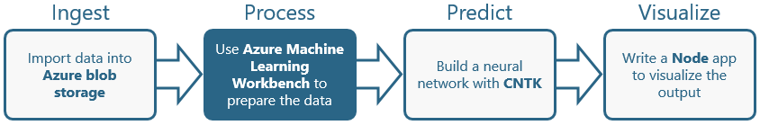

<a name="Objectives"></a>
### Objectives ###

In this hands-on lab, you will learn how to:

- Write Python code to wrangle data stored in Azure blob storage
- Execute that code in Docker containers using Azure Machine Learning Workbench
- Format labeled image data for input to CNTK

<a name="Prerequisites"></a>
### Prerequisites ###

The following are required to complete this hands-on lab:

- An active Microsoft Azure subscription. If you don't have one, [sign up for a free trial](https://aka.ms/WATK-FreeTrial).
- A computer running Windows 10, Windows Server 2016, macOS Sierra, or macOS High Sierra
- [Azure Machine Learning Workbench](https://docs.microsoft.com/azure/machine-learning/preview/quickstart-installation?WT.mc_id=academiccontent-github-cxa)
- [Docker](https://www.docker.com/)

If you haven't completed the [previous lab in this series](../1%20-%20Ingest), you must do so before starting this lab.

<a name="Exercises"></a>
## Exercises ##

This hands-on lab includes the following exercises:

- [Exercise 1: Install Workbench and create a project](#Exercise1)
- [Exercise 2: Customize the project](#Exercise2)
- [Exercise 3: Convert MNIST data to CNTK format](#Exercise3)

Estimated time to complete this lab: **30** minutes.

<a name="Exercise1"></a>
## Exercise 1: Install Workbench and create a project ##

In this exercise, you will install Azure Machine Learning Workbench and create a new project to house the files for a machine-learning project.

1. Azure Machine Learning Workbench runs jobs in Docker containers, and as such, it requires that Docker be installed on your computer. If you haven't installed Docker, go to https://www.docker.com/ and download and install [Docker for Windows](https://www.docker.com/docker-windows) or [Docker for Mac](https://www.docker.com/docker-mac). If you are not sure whether Docker is installed on your computer, open a Command Prompt window (Windows) or a terminal window (macOS) and type the following command:

	```
	docker -v
	```

	If a Docker version number is displayed, then Docker is installed. If Docker is not installed, you should restart your PC after installing it.

1. If Azure Machine Learning Workbench isn't installed on your computer, go to https://docs.microsoft.com/azure/machine-learning/preview/quickstart-installation and follow the instructions there to install it, create a Machine Learning Experimentation account, and sign in to Machine Learning Workbench for the first time. The experimentation account is required in order to use Azure Machine Learning Workbench.

1. Launch Azure Machine Learning Workbench if it isn't already running. Then click the **+** sign in the "Projects" panel and select **New Project**.

	

	_Creating a new project_

1. Enter a project name such as "MNIST-Lab" and a project description. For **Project directory**, specify the location where you would like for the project directory to be created. Make sure **Blank Project** is selected as the project type, and then click the **Create** button.

	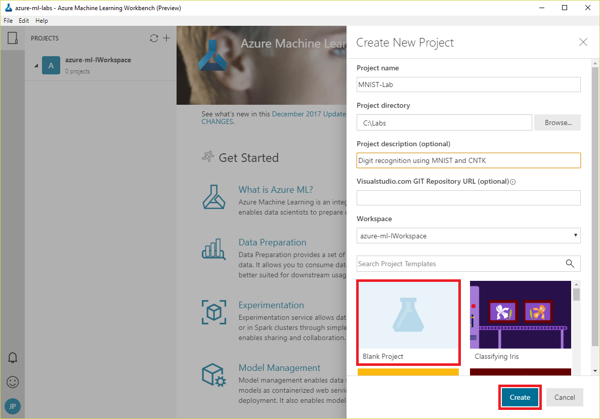

	_Creating a new project_

1. Open a File Explorer window (Windows) or a Finder window (macOS) and navigate to the project directory that you specified in the previous step. Confirm that it contains a subdirectory with the same name as the project. Open the subdirectory and examine its contents. Confirm that it contains a subdirectory named "aml_config" and a pair of Python scripts named **train.py** and **score.py**, as shown below.

	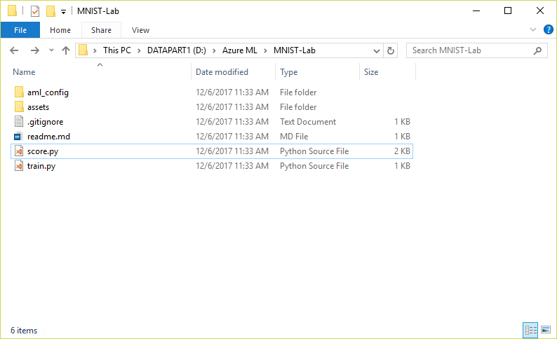

	_Inspecting the project directory_

The files in the project directory are merely starter files that will need to be modified in order to build a machine-learning model. But before you can build a model, you need to prepare the data that will be used to train it.

<a name="Exercise2"></a>
## Exercise 2: Customize the project ##

One of the tasks at which Machine Learning Workbench excels is helping you prepare data for training machine-learning models. For example, its [Derive Column by Example](https://docs.microsoft.com/azure/machine-learning/preview/data-prep-derive-column-by-example?WT.mc_id=academiccontent-github-cxa) feature lets you create new feature columns with information derived from data in other columns, and it uses AI to learn by example. You do the first few transformations, and it does the rest. It also includes features for replacing missing values, trimming strings, and performing other common data-cleaning operations.

The MNIST data that you uploaded to blob storage in the previous lab doesn't require cleaning in the conventional sense, but it does need to be converted into a format that is compatible with CNTK. In this exercise, you will write Python scripts to perform the conversion, and configure the project to execute them.

1. Return to Machine Learning Workbench and click the folder icon in the ribbon on the left to display all the files in the project. Then expand the treeview to show the files in the "aml_config" directory and click **docker.runconfig**. This file contains configuration information used when the project is executed in a Docker container.

	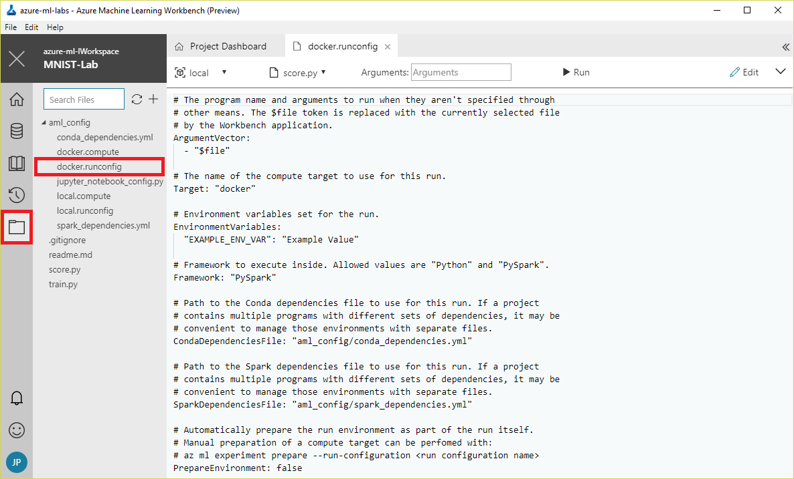

	_Opening docker.runconfig_

1. Click the down-arrow next to **Edit** and select **Edit as text in Workbench** to enter editing mode.

	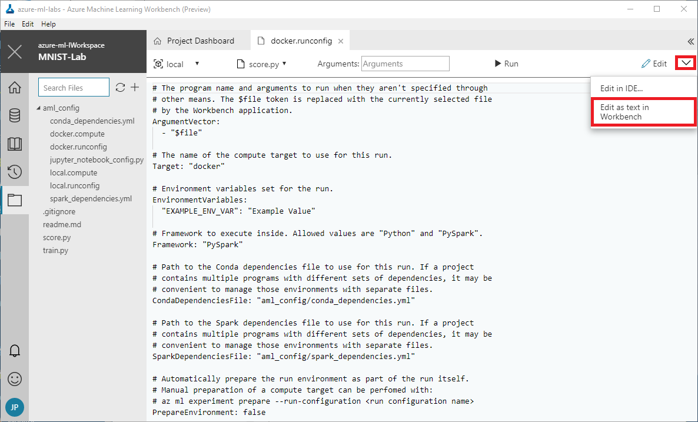

	_Editing docker.runconfig_

1. Replace lines 10-15 of **docker.runconfig** with the following statements:

	```
	# Environment variables set for the run.
	EnvironmentVariables:
	  "AZ_STORAGE_CONNSTR": "CONNECTION_STRING"
	
	# Framework to execute inside. Allowed values are "Python" and "PySpark".
	Framework: "Python"
	```

1. Open the [Azure Portal](https://portal.azure.com?WT.mc_id=academiccontent-github-cxa) in your browser and open the storage account that you created in the [previous lab](../1%20-%20Ingest).

	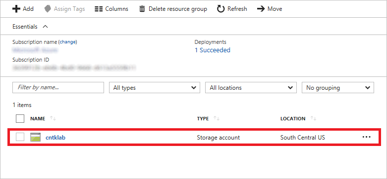

	_Opening the storage account_

1. Click **Access keys** in the menu on the left. Then click the **Copy** button to the right of the first connection string to copy the storage account's connection string to the clipboard. This connection string allows scripts and programs to access blobs stored in the storage account, even if the blobs are private.

	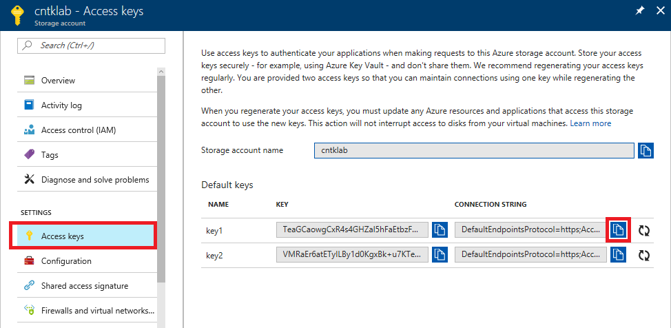

	_Copying the connection string_

1. Return to Machine Learning Workbench and replace CONNECTION_STRING on line 12 of **docker.runconfig** with the connection string on the clipboard. This assigns the connection string to an environment variable so it can be retrieved at run-time by scripts executed by Machine Learning Workbench.

1. On line 30 of **docker.runconfig**, change the value of ```PrepareEnvironment``` from false to true:

	```
	PrepareEnvironment: true
	```

	This configures the project to automatically prepare the environment by loading dependencies when the project is run.

1. Select **Save** from the **File** menu to save the modified **docker.runconfig** file.

1. Open **docker.compute** for editing in Machine Learning Workbench. Then change the value of ```baseDockerImage``` on line 8 to "blaize/mlspark-brainscript," as shown here:

	```
	baseDockerImage: "blaize/mlspark-brainscript"
	```

	This changes the base Docker image used for the Docker container to a custom image that adds support for BrainScript to the Docker image that Machine Learning Workbench uses by default. [BrainScript](https://docs.microsoft.com/cognitive-toolkit/brainscript-basic-concepts?WT.mc_id=academiccontent-github-cxa) is the language used by CNTK to define neural networks.

	> You won't be using BrainScript in this lab, but you *will* use it in the next lab when you use CNTK to build a neural network.

	For reference, and in case you want to create a similar Docker image of your own, here is the Dockerfile used to create the ```mlspark-brainscript``` image:

	```dockerfile
	FROM microsoft/mmlspark:plus-0.7.91
	WORKDIR /home/mmlspark/
	USER root
	ENV PATH=/home/mmlspark/cntk/cntk/bin:$PATH
	ENV LD_LIBRARY_PATH=/home/mmlspark/cntk/cntk/lib:/home/mmlspark/cntk/cntk/dependencies/lib:$LD_LIBRARY_PATH
	RUN curl https://cntk.ai/BinaryDrop/CNTK-2-3-Linux-64bit-CPU-Only.tar.gz -o /home/mmlspark/CNTK.tar.gz && \
	   tar -xzf /home/mmlspark/CNTK.tar.gz && \
	   chown -R mmlspark:mmlspark cntk
	USER mmlspark
	```

1. Use the **File** > **Save** command to save the modified **docker.compute** file.

1. Click the **+** sign in the project panel and use the **New Item** command to add a file named **mnist_utils.py** to the project.

	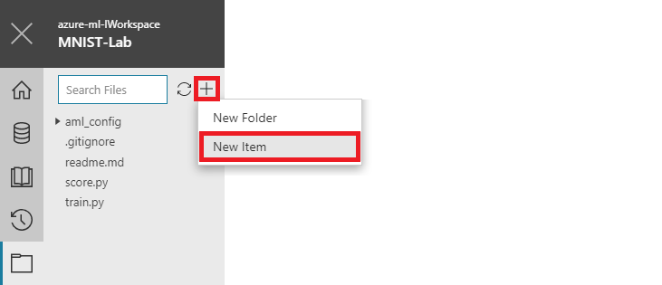

	_Adding a file to the project_

1. Open **mnist_utils.py** for editing in Machine Learning Workbench and paste in the following Python code:

	```Python
	from __future__ import print_function
	try: 
	    from urllib.request import urlretrieve 
	except ImportError: 
	    from urllib import urlretrieve
	import sys
	import gzip
	import shutil
	import os
	import struct
	import numpy as np
	
	def loadData(src, cimg):
	    print ('Downloading ' + src)
	    gzfname, h = urlretrieve(src, './delete.me')
	    print ('Done.')
	    try:
	        with gzip.open(gzfname) as gz:
	            n = struct.unpack('I', gz.read(4))
	            # Read magic number.
	            if n[0] != 0x3080000:
	                raise Exception('Invalid file: unexpected magic number.')
	            # Read number of entries.
	            n = struct.unpack('>I', gz.read(4))[0]
	            if n != cimg:
	                raise Exception('Invalid file: expected {0} entries.'.format(cimg))
	            crow = struct.unpack('>I', gz.read(4))[0]
	            ccol = struct.unpack('>I', gz.read(4))[0]
	            if crow != 28 or ccol != 28:
	                raise Exception('Invalid file: expected 28 rows/cols per image.')
	            # Read data.
	            res = np.fromstring(gz.read(cimg * crow * ccol), dtype = np.uint8)
	    finally:
	        os.remove(gzfname)
	    return res.reshape((cimg, crow * ccol))
	
	def loadLabels(src, cimg):
	    print ('Downloading ' + src)
	    gzfname, h = urlretrieve(src, './delete.me')
	    print ('Done.')
	    try:
	        with gzip.open(gzfname) as gz:
	            n = struct.unpack('I', gz.read(4))
	            # Read magic number.
	            if n[0] != 0x1080000:
	                raise Exception('Invalid file: unexpected magic number.')
	            # Read number of entries.
	            n = struct.unpack('>I', gz.read(4))
	            if n[0] != cimg:
	                raise Exception('Invalid file: expected {0} rows.'.format(cimg))
	            # Read labels.
	            res = np.fromstring(gz.read(cimg), dtype = np.uint8)
	    finally:
	        os.remove(gzfname)
	    return res.reshape((cimg, 1))
	
	def load(dataSrc, labelsSrc, cimg):
	    data = loadData(dataSrc, cimg)
	    labels = loadLabels(labelsSrc, cimg)
	    return np.hstack((data, labels))
	
	def savetxt(filename, ndarray):
	    with open(filename, 'w') as f:
	        labels = list(map(' '.join, np.eye(10, dtype=np.uint).astype(str)))
	        for row in ndarray:
	            row_str = row.astype(str)
	            label_str = labels[row[-1]]
	            feature_str = ' '.join(row_str[:-1])
	            f.write('|labels {} |features {}\n'.format(label_str, feature_str))
	```

	This file contains helper functions for loading data from blob storage and writing structured text files to the local file system.

1. Use the **File** > **Save** command to save the modified **mnist_utils.py** file.

1. Click the **+** sign in the project panel and use the **New Item** command to add a file named **convert.py** to the project. Then open **convert.py** for editing and paste in the following code:

	```Python
	from __future__ import print_function
	import os
	import mnist_utils as ut
	from azure.storage.blob import (
	    BlockBlobService,
	    ContainerPermissions,
	    BlobPermissions,
	    PublicAccess,
	)
	from datetime import datetime, timedelta
	
	block_blob_service = BlockBlobService(connection_string=os.environ['AZ_STORAGE_CONNSTR'])
	block_blob_service.socket_timeout = 600
	
	# Function for getting a SAS URL for blobs
	def getUrl(blobName):
	    container = 'mnist-data'
	    token = block_blob_service.generate_blob_shared_access_signature(
	            container,
	            blobName,
	            BlobPermissions.READ,
	            datetime.utcnow() + timedelta(hours=1),
	        )
	    return block_blob_service.make_blob_url(container, blobName, sas_token=token)
	
	if __name__ == "__main__":
	
	    # Convert the data to the CNTK Format
	    os.chdir(os.path.abspath(os.path.dirname(__file__)))
	    train = ut.load(getUrl('train-images-idx3-ubyte.gz'),
	        getUrl('train-labels-idx1-ubyte.gz'), 60000)
	    print ('Writing train text file...')
	    ut.savetxt(r'./Train-28x28_cntk_text.txt', train) 
	    test = ut.load(getUrl('t10k-images-idx3-ubyte.gz'),
	        getUrl('t10k-labels-idx1-ubyte.gz'), 10000)
	    print ('Writing test text file...')
	    ut.savetxt(r'./Test-28x28_cntk_text.txt', test)
	
	    cntkContainer = 'cntk-data'
	
	    # Upload the CNTK-formatted data to blob storage
	    print ('Uploading results to Azure Storage.')
	    block_blob_service.create_container(cntkContainer, metadata=None, public_access=None, fail_on_exist=False, timeout=None)
	    block_blob_service.create_blob_from_path(cntkContainer, 'Train-28x28_cntk_text.txt', r'./Train-28x28_cntk_text.txt') 
	    block_blob_service.create_blob_from_path(cntkContainer, 'Test-28x28_cntk_text.txt', r'./Test-28x28_cntk_text.txt')
	```

	This file contains code that loads MNIST training and testing data from blob storage, converts it to CNTK format, saves the converted data in text files in the local file system, and then uploads the text files from the local file system to a new container in blob storage.

1. Use the **File** > **Save** command to save the modified **convert.py** file.

The project now contains a Python script that converts the MNIST data in blob storage into CNTK data in blob storage, as well as a Python script containing helper functions used by that script. It also contains a Docker configuration file that holds the connection string that the scripts use to access the storage account, and a Docker compute file that specifies the base Docker image to use for the container in which the scripts run. Now it's time to put these scripts to work.

<a name="Exercise3"></a>
## Exercise 3: Convert MNIST data to CNTK format ##

In this exercise, you will run the **convert.py** script that you created in the previous exercise in a local Docker container using Machine Learning Workbench to convert MNIST data from its native format to CNTK format. Then you will examine the output in blob storage and see what CNTK-formatted data looks like. 

1. In Machine Learning Workbench, select **Docker** from the Run Configuration drop-down and **convert.py** from the Script drop-down to configure Workbench to run **convert.py** in a Docker container. Then click the **Run** button.

	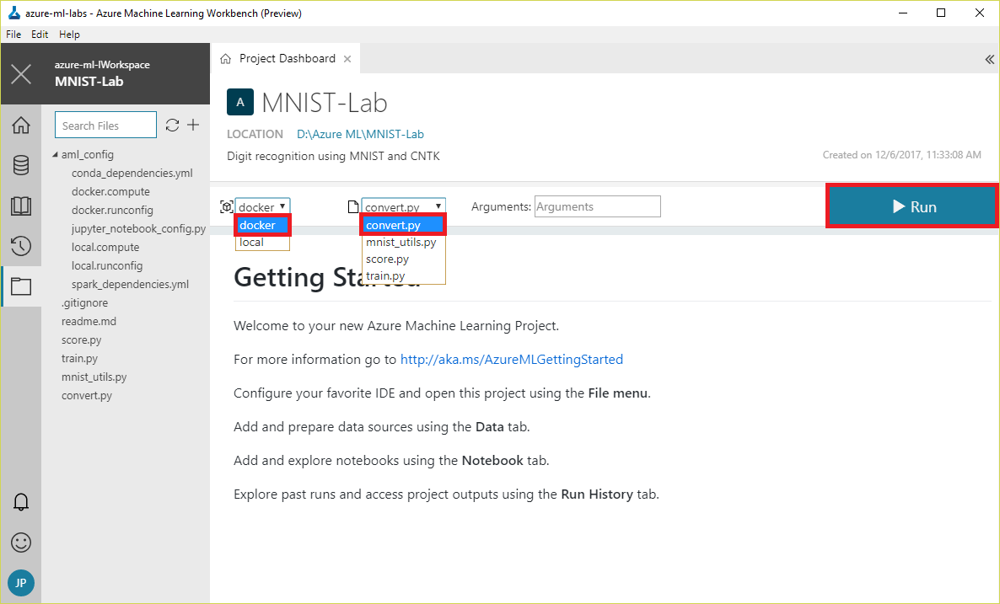

	_Running convert.py_

1. Wait for the job to complete. The first run may take a few minutes because Machine Learning Workbench has to download the base Docker image from Docker Hub. Subsequent runs should be much faster.

	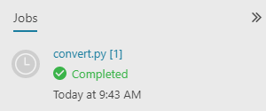

	_Successful run_

1. Return to the storage account that you created in the previous lab in the [Azure Portal](https://portal.azure.com?WT.mc_id=academiccontent-github-cxa). Confirm that the storage account now contains *two* containers: the "mnist-data" container you created in the previous lab, and a container named "cntk-data" that holds the output from **convert.py**.

	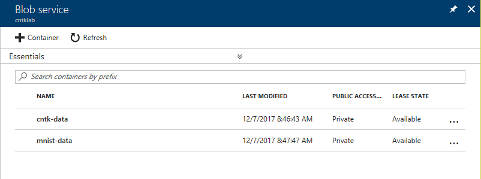

	_Containers for converted and unconverted data_

1. Open the "cntk-data" container and confirm that it contains two blobs. One contains CNTK-formatted data for training a model, and the other contains CNTK-formatted data for testing the model.

	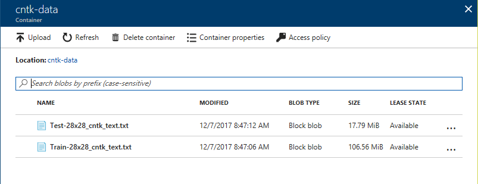

	_Blobs containing CNTK input_

If you are curious to know what data formatted for input to CNTK looks like, download the blob named **Test-28x28_cntk_text.txt** and open it in your favorite text editor. The blob contains one row for each digitized image. Each row contains a section named "labels" and a section named "features." The "labels" data denotes the digit represented by the image. The first value is 1 or 0 for 0, the second is 1 or 0 for 1, and so on. For the digit 7, all of the values in "labels" will be 0 except the 8th, which will contain a 1. The "features" data represents the image itself. There are 784 values, one for each pixel in a 28 x 28 array, and each value is a grayscale value from 0 to 255, with 0 representing empty space and 255 representing filled space.

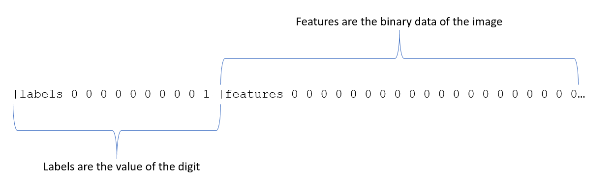

_CNTK-formatted data_

<a name="Summary"></a>
## Summary ##

The raw MNIST data has been converted into CNTK format and is ready to be used to train a neural network. This sets the stage for the next lab in this series — [Using the Microsoft Cognitive Toolkit (CNTK) to Build Neural Networks, Part 3](../3%20-%20Predict) — in which you will use CNTK and Machine Learning Workbench to build a set of neural networks and compare their accuracy.

---

Copyright 2018 Microsoft Corporation. All rights reserved. Except where otherwise noted, these materials are licensed under the terms of the MIT License. You may use them according to the license as is most appropriate for your project. The terms of this license can be found at https://opensource.org/licenses/MIT.
