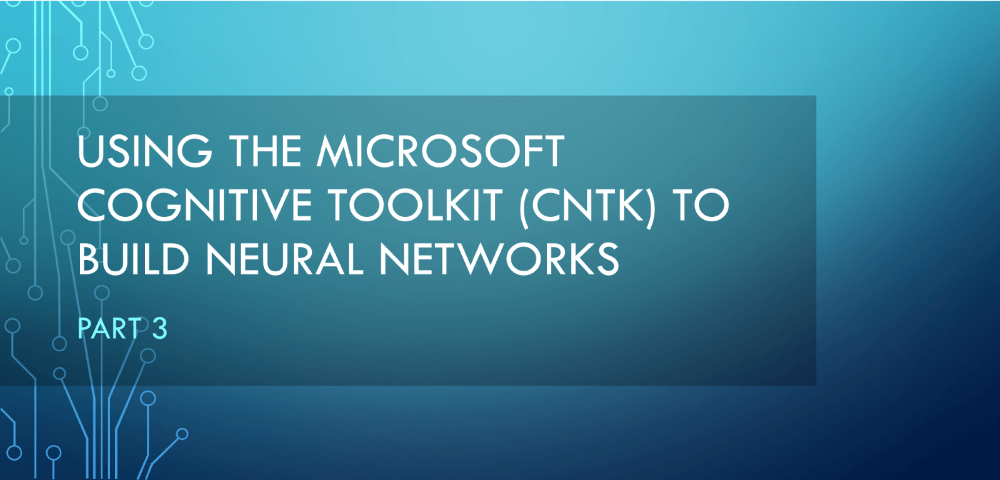
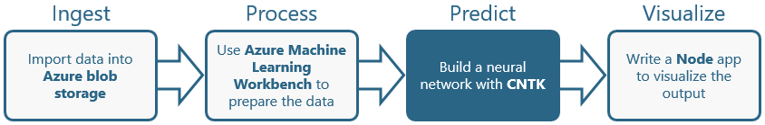
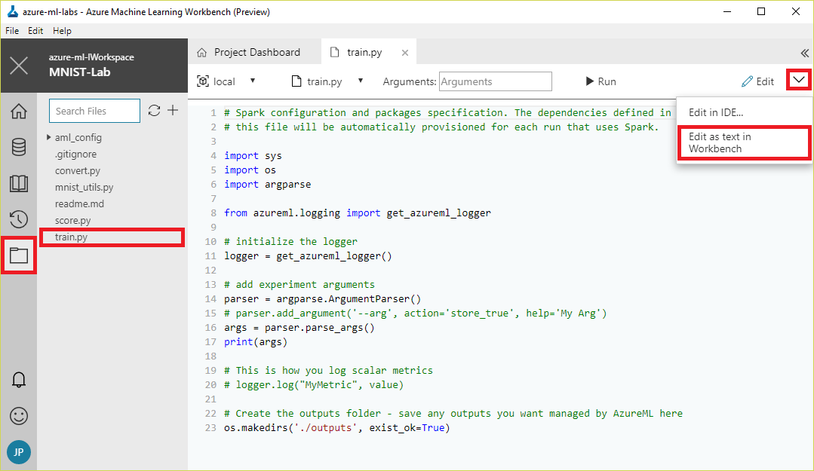
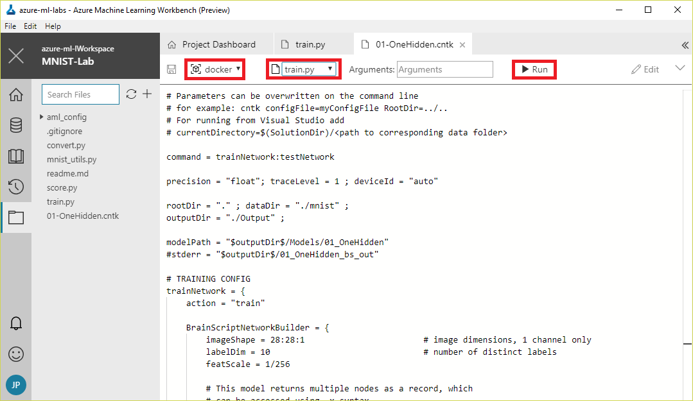
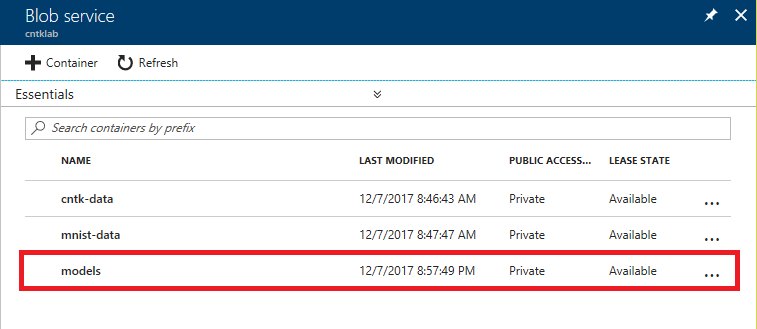
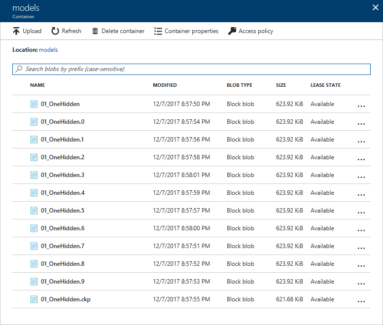

In the [previous lab](../2%20-%20Process), you used Azure Machine Learning Workbench to execute a Python script that converts raw data from the [MNIST database](http://yann.lecun.com/exdb/mnist/), which contains 60,000 scanned and normalized images of the hand-written digits 0 through 9, into data that can be used to train neural networks built with the [Microsoft Cognitive Toolkit](https://www.microsoft.com/research/product/cognitive-toolkit/?WT.mc_id=academiccontent-github-cxa), also known as CNTK. The script ran in a Docker container, received input from Azure blob storage, and wrote its output to Azure blob storage.

In this lab, the third of four in a series, you will return to Machine Learning Workbench and train three machine-learning models that rely on CNTK neural networks. The goal: to find the best model for recognizing hand-written digits, with an eye toward operationalizing the model and building a client app that uses it in the fourth and final lab.



<a name="Objectives"></a>
### Objectives ###

In this hands-on lab, you will learn how to:

- Write Python code to train CNTK models
- Execute that code in Docker containers using Azure Machine Learning Workbench
- Determine the accuracy of a trained CNTK model

<a name="Prerequisites"></a>
### Prerequisites ###

The following are required to complete this hands-on lab:

- An active Microsoft Azure subscription. If you don't have one, [sign up for a free trial](https://aka.ms/WATK-FreeTrial).
- A computer running Windows 10, Windows Server 2016, macOS Sierra, or macOS High Sierra
- [Azure Machine Learning Workbench](https://docs.microsoft.com/azure/machine-learning/preview/quickstart-installation?WT.mc_id=academiccontent-github-cxa)
- [Docker](https://www.docker.com/)

If you haven't completed the [previous lab in this series](../2%20-%20Process), you must do so before starting this lab.

<a name="Resources"></a>
### Resources ###

[Click here](https://topcs.blob.core.windows.net/public/300-cntk-resources-03.zip) to download a zip file containing the resources used in this lab. Copy the contents of the zip file into a folder on your hard disk.

<a name="Exercises"></a>
## Exercises ##

This hands-on lab includes the following exercises:

- [Exercise 1: Train a neural network and score it for accuracy](#Exercise1)
- [Exercise 2: Train and score a second neural network](#Exercise2)
- [Exercise 3: Train and score a third neural network](#Exercise3)

Estimated time to complete this lab: **30** minutes.

<a name="Exercise1"></a>
## Exercise 1: Train a neural network and score it for accuracy ##

It's time to leverage the work you performed in the first two labs by using the CNTK-formatted data that you generated to train and test a machine-learning model that utilizes a CNTK neural network. The Microsoft Cognitive Toolkit comes with several [BrainScript](https://docs.microsoft.com/cognitive-toolkit/brainscript-basic-concepts?WT.mc_id=academiccontent-github-cxa) files enabling various types of neural networks to be trained and tested with a single command. BrainScript provides a simple way to define a network in code-like fashion using expressions, variables, functions, and other constructs. CNTK networks can also be defined in pure Python, but BrainScript files are shorter, more concise, and generally more readable.

One of the simplest network types is the "One Hidden Layer" network, which is not a deep neural network, but rather one that contains a single layer of hidden nodes. In this exercise, you will write a Python script that uses BrainScript to train and score a "One Hidden Layer" network that recognizes hand-written digits, and execute the script in a Docker container from Azure Machine Learning Workbench.

1. Return to Machine Learning Workbench and to the project that you created in the previous lab. Then open the file named **train.py** for editing.

	

	_Opening train.py for editing in Machine Learning Workbench_

1. Replace the contents of **train.py** with the Python code below. Then save the file.

	```Python
	from __future__ import print_function
	import os
	from shutil import copyfile
	import mnist_utils as ut
	from azure.storage.blob import (
	    BlockBlobService,
	    ContainerPermissions,
	    BlobPermissions,
	    PublicAccess,
	)
	from datetime import datetime, timedelta
	from subprocess import Popen, PIPE
	import subprocess
	
	print(os.environ['AZ_STORAGE_CONNSTR'])
	block_blob_service = BlockBlobService(connection_string=os.environ['AZ_STORAGE_CONNSTR'])
	block_blob_service.socket_timeout = 600

	def trainModel(modelFile):
	    modelDir = 'models'
	    modelName = os.path.splitext(modelFile)[0].lower()
	
	    if not os.path.exists(os.path.join('.', modelDir)):
	        os.makedirs(os.path.join('.', modelDir))
	
	    print('Training model ' + modelFile);
	
	    p = Popen(['cntk', 'configFile=./' + modelFile], stdout=subprocess.PIPE, stderr=subprocess.PIPE)
	    std_out, std_err = p.communicate()
	    print(std_err.decode('utf-8'))
	    print('Uploading model ' + modelFile);
	
	    modelContainer = 'models' #os.path.splitext(modelFile)[0].lower()
	
	    block_blob_service.create_container(modelContainer, metadata=None, public_access=None, fail_on_exist=False, timeout=None)
	
	    for filename in os.listdir(os.path.join('.', modelDir)):
	        # copyfile('./Output/Models/' + filename, './outputs/Models/' +  modelName  + '/' + filename)
	        block_blob_service.create_blob_from_path(modelContainer, filename, os.path.join('.', modelDir, filename))
	        os.remove(os.path.join('.', modelDir, filename))
	        
	    print ('Done.')
	
	if __name__ == "__main__":
	    container = 'cntk-data'
	    if not os.path.exists(os.path.join('.', 'mnist')):
	        os.makedirs(os.path.join('.', 'mnist'))
	    print('Downloading CNTK data...');
	    block_blob_service.get_blob_to_path(container, 'Train-28x28_cntk_text.txt', r'./mnist/Train-28x28_cntk_text.txt');
	    block_blob_service.get_blob_to_path(container, 'Test-28x28_cntk_text.txt', r'./mnist/Test-28x28_cntk_text.txt');
	    print('Done.');
	
	    trainModel('01-OneHidden.cntk')
	```

	This Python script downloads the CNTK-formatted training and testing data that you created in the previous lab from blob storage and invokes the ```cntk``` command from the Cognitive Toolkit (remember, you are executing code in a Docker container created from a Docker image that contains the Cognitive Toolkit) to train and score a neural network. It passes as input to the ```cntk``` command the path to a file named **01-OneHidden.cntk**. The output from the command is a set of binary files that comprise a "compiled" neural network. The script uploads these files as blobs to the storage account that you created in the first lab.

1. Add a file named **01-OneHidden.cntk** to the project and insert the following statements. Then save the file.

	```
	command = trainNetwork:testNetwork
	precision = "float"; traceLevel = 1 ; deviceId = "auto"
	rootDir = "." ; dataDir = "./mnist" ;
	outputDir = "./models" ;
	
	modelPath = "$outputDir$/01_OneHidden"
	#stderr = "$outputDir$/01_OneHidden_bs_out"
	
	# TRAINING CONFIG
	trainNetwork = {
	    action = "train"
	    
	    BrainScriptNetworkBuilder = {
	        imageShape = 28:28:1                        # image dimensions, 1 channel only
	        labelDim = 10                               # number of distinct labels
	        featScale = 1/256
	
	        # This model returns multiple nodes as a record, which
	        # can be accessed using .x syntax.
	        model(x) = {
	            s1 = x * featScale
	            h1 = DenseLayer {200, activation=ReLU} (s1) 
	            z = LinearLayer {labelDim} (h1)
	        }
	        
	        # inputs
	        features = Input {imageShape}
	        labels = Input {labelDim}
	
	        # apply model to features
	        out = model (features)
	
	        # loss and error computation
	        ce   = CrossEntropyWithSoftmax (labels, out.z)
	        errs = ClassificationError (labels, out.z)
	
	        # declare special nodes
	        featureNodes    = (features)
	        labelNodes      = (labels)
	        criterionNodes  = (ce)
	        evaluationNodes = (errs)
	        outputNodes     = (out.z)
	    }
	
	    SGD = {
	        epochSize = 60000
	        minibatchSize = 64
	        maxEpochs = 10
	        learningRatesPerSample = 0.01*5:0.005
	        momentumAsTimeConstant = 0
	        numMBsToShowResult = 500
	    }
	
	    reader = {
	        readerType = "CNTKTextFormatReader"
	        file = "$DataDir$/Train-28x28_cntk_text.txt"
	        input = {
	            features = { dim = 784 ; format = "dense" }
	            labels =   { dim = 10  ; format = "dense" }
	        }
	    }   
	}
	
	# TEST CONFIG
	testNetwork = {
	    action = "test"
	    minibatchSize = 1024    # reduce this if you run out of memory
	
	    reader = {
	        readerType = "CNTKTextFormatReader"
	        file = "$DataDir$/Test-28x28_cntk_text.txt"
	        input = {
	            features = { dim = 784 ; format = "dense" }
	            labels =   { dim = 10  ; format = "dense" }
	        }
	    }
	}
	```

	This file contains [BrainScript](https://docs.microsoft.com/cognitive-toolkit/brainscript-basic-concepts?WT.mc_id=academiccontent-github-cxa) code that defines a neural network. It is a slightly modified version of a file of the same name that comes with CNTK. The first section — TRAINING CONFIG — defines a network with one hidden layer and identifies the shape and source of the training data. The TEST CONFIG section identifies the file containing testing data. The files containing the training and testing data are local versions of the files that you created in the previous lab and downloaded from blob storage.

1. Select **Docker** from the Run Configuration drop-down and **train.py** from the Script drop-down to configure Workbench to run **train.py** in a Docker container. Then click **Run**.

	

	_Training a neural network_

1. Wait for the run to complete and confirm that it completed successfully. It may take a few minutes to complete, and the duration will depend somewhat on your connection speed since the CNTK-formatted data has to be downloaded from blob storage.

	Now click the completed run in the "Jobs" panel. Scroll to the bottom of the output window that appears and find the value named ```errs```. This is the percentage of errors that were encountered when the model was tested. Lower percentages mean that the neural network was able to correctly identify more digits in the test dataset. It appears that this network is reasonably adept at identifying hand-written digits.

	

	_Gauging the accuracy of the neural network_

1. Close the output window and return in the Azure Portal to the storage account that you created in the first lab. Confirm that it now has a container named "models." Then click the container to view its contents.

	

	_Opening the "models" container_

1. Confirm that the "models" container holds the blobs pictured below. These files represent the trained network and can be used to deploy an operationalized model that performs predictive analytics.

	

	_Contents of the "models" container_

Writing the files that represent the trained network to blob storage is not a CNTK requirement — the files can be stored anywhere — but it does make it easy for you to download the files so you can put them to use elsewhere. This is something you will take advantage of in the next lab.

<a name="Exercise2"></a>
## Exercise 2: Train and score a second neural network ##

CNTK supports many different types of neural networks. Some are better than others at recognizing hand-written digits. In this exercise, you will train and score a second neural network and compare the results to the one you created in the previous exercise.

1. Return to Machine Learning Workbench and add a file named **02-OneConv.cntk** to the project. Insert the following BrainScript code and save the file. This script trains a "One Convolution" network, which is a [convolutional neural network](https://en.wikipedia.org/wiki/Convolutional_neural_network) with a single convolutional layer. Convolutional networks are often used to perform image recognition and classification. Once more, this script is a slightly modified version of the file with the same name that is included in CNTK.

	```
	command = trainNetwork:testNetwork
	precision = "float"; traceLevel = 1 ; deviceId = "auto"
	rootDir = "." ; dataDir = "./mnist" ;
	outputDir = "./models" ;
	
	modelPath = "$outputDir$/02_OneConv"
	#stderr = "$outputDir$/02_OneConv_bs_out"
	
	# TRAINING CONFIG
	trainNetwork = {
	    action = "train"
	    
	    BrainScriptNetworkBuilder = {
	        imageShape = 28:28:1                        # image dimensions, 1 channel only
	        labelDim = 10                               # number of distinct labels
	        featScale = 1/256
	        Scale{f} = x => Constant(f) .* x
	        
	        model = Sequential (
	            Scale {featScale} :
	            ConvolutionalLayer {16, (5:5), pad = true} : ReLU : 
	            MaxPoolingLayer    {(2:2), stride=(2:2)} :
	            DenseLayer {64} : ReLU : 
	            LinearLayer {labelDim}
	        )
	        
	        # inputs
	        features = Input {imageShape}
	        labels = Input (labelDim)
	
	        # apply model to features
	        ol = model (features)
	
	        # loss and error computation
	        ce   = CrossEntropyWithSoftmax (labels, ol)
	        errs = ClassificationError (labels, ol)
	
	        # declare special nodes
	        featureNodes    = (features)
	        labelNodes      = (labels)
	        criterionNodes  = (ce)
	        evaluationNodes = (errs)
	        outputNodes     = (ol)
	    }
	
	    SGD = {
	        epochSize = 60000
	        minibatchSize = 64
	        maxEpochs = 15
	        learningRatesPerSample = 0.001*5:0.0005
	        momentumAsTimeConstant = 0
	        numMBsToShowResult = 500
	    }
	
	    reader = {
	        readerType = "CNTKTextFormatReader"
	        file = "$DataDir$/Train-28x28_cntk_text.txt"
	        input = {
	            features = { dim = 784 ; format = "dense" }
	            labels =   { dim = 10  ; format = "dense" }
	        }
	    }   
	}
	
	# TEST CONFIG
	testNetwork = {
	    action = "test"
	    minibatchSize = 1024    # reduce this if you run out of memory
	
	    reader = {
	        readerType = "CNTKTextFormatReader"
	        file = "$DataDir$/Test-28x28_cntk_text.txt"
	        input = {
	            features = { dim = 784 ; format = "dense" }
	            labels =   { dim = 10  ; format = "dense" }
	        }
	    }
	}
	```

1. Modify the final line of **train.py** to reference the file you just added. Then save the file.

	```Python
	trainModel('02-OneConv.cntk')
	```

1. Run **train.py** in a Docker container and examine the output to determine how accurately the model is able to identify hand-written digits. Is this one more or less accurate than the "One Hidden Layer" network?

Rather than settle on the better of these two networks, let's train a third one and see how it compares. One of the benefits of CNTK is that you can easily experiment with different network types and the parameters that characterize them simply by varying the BrainScript passed to the ```cntk``` command.

<a name="Exercise3"></a>
## Exercise 3: Train and score a third neural network ##

In this exercise, you will train and score a third neural network and compare the results to the ones you created in [Exercise 1](#Exercise1) and [Exercise 2](#Exercise2).

1. Return to Machine Learning Workbench and add a file named **06-OneConvRegrMultiNode.cntk** to the project. Insert the following BrainScript code and save the file. This script trains a deep convolutional neural network and could require 10 minutes or more to run.

	```
	command = trainNetwork:testNetwork
	precision = "float"; traceLevel = 1 ; deviceId = "auto"
	rootDir = "." ; dataDir = "./mnist" ;
	outputDir = "./models" ;
	
	modelPath = "$outputDir$/06_OneConvRegrMultiNode"
	#stderr = "$outputDir$/06_OneConvRegr_bs_out"
	
	parallelizationMethod=DataParallelSGD
	
	# TRAINING CONFIG
	trainNetwork = {
	    action = "train"
	    
	    BrainScriptNetworkBuilder = {
	        imageShape = 28:28:1                        # image dimensions, 1 channel only
	        labelDim = 10                               # number of distinct labels
	        featScale = 1/256
	        Scale{f} = x => Constant(f) .* x
	        
	        model = Sequential (
	            Scale {featScale} :
	            ConvolutionalLayer {16, (5:5), pad = true} : ReLU : 
	            MaxPoolingLayer    {(2:2), stride=(2:2)} :
	            DenseLayer {64} : ReLU : 
	            LinearLayer {labelDim}
	        )
	        
	        # inputs
	        features = Input {imageShape}
	        labels = Input {labelDim}
	
	        # apply model to features
	        z = model (features)
	
	        # loss and error computation
	        diff = labels - z
	        sqerr = ReduceSum (diff.*diff, axis=1)
	        rmse =  Sqrt (sqerr / labelDim)
	
	        # declare special nodes
	        featureNodes    = (features)
	        labelNodes      = (labels)
	        criterionNodes  = (rmse)
	        evaluationNodes = (rmse)
	        outputNodes     = (z)
	    }
	
	    SGD = {
	        epochSize = 0
	        minibatchSize = 64
	        maxEpochs = 15
	        learningRatesPerSample = 0.001*5:0.0005
	        momentumAsTimeConstant = 1024
	        numMBsToShowResult = 500
	        ParallelTrain = [
	            parallelizationMethod = $parallelizationMethod$
	            distributedMBReading = "true"
	            parallelizationStartEpoch = 1
	            DataParallelSGD = [
	                gradientBits = 32
	            ]
	            ModelAveragingSGD = [
	                blockSizePerWorker = 64
	            ]
	            DataParallelASGD = [
	                syncPeriod = 64
	                usePipeline = false
	            ]
	        ]
	    }
	
	    reader = {
	        readerType = "CNTKTextFormatReader"
	        file = "$DataDir$/Train-28x28_cntk_text.txt"
	        input = {
	            features   = { dim = 784 ; format = "dense" }
	            labels =   { dim = 10  ; format = "dense" }
	        }
	    }   
	}
	
	# TEST CONFIG
	testNetwork = {
	    action = "test"
	    minibatchSize = 1024    # reduce this if you run out of memory
	
	    reader = {
	        readerType = "CNTKTextFormatReader"
	        file = "$DataDir$/Test-28x28_cntk_text.txt"
	        input = {
	            features = { dim = 784 ; format = "dense" }
	            labels =   { dim = 10  ; format = "dense" }
	        }
	    }
	}
	```

1. Modify the final line of **train.py** to reference the file you just added. Then save the file.

	```Python
	trainModel('06-OneConvRegrMultiNode.cntk')
	```

1. Run **train.py** in a Docker container and examine the output to determine how accurately the model is able to identify hand-written digits. Rather than present an ```err``` value, this model will present ```rmse```, which stands for [root mean square error](https://en.wikipedia.org/wiki/Root-mean-square_deviation). A simple way to compare ```rmse``` to ```err``` is to multiply the ```rmse``` value by 100, so that 0.02, for example, becomes 2%. Based on that, is this network more or less accurate than the other networks you trained?

The [resources that accompany this lab](https://topcs.blob.core.windows.net/public/300-cntk-resources-03.zip) include the three BrainScript files that you used to train neural networks, and four more that you didn't use. Feel free to train additional networks using the extra files. For a great tutorial on training various types of machine-learning models with CNTK and additional insights into BrainScript, see https://github.com/Microsoft/CNTK/wiki/Tutorial.

<a name="Summary"></a>
## Summary ##

You have now used Machine Learning Workbench and the Microsoft Cognitive Toolkit (CNTK) to train and test three machine-learning models backed by neural networks. And you identified the model that scored the highest in testing. You are now ready to proceed to the fourth and final lab in this series — [Using the Microsoft Cognitive Toolkit (CNTK) to Build Neural Networks, Part 4](../4%20-%20Visualize) — in which you will operationalize one of these models and build a Node.js app that uses it to identify digits drawn onto the screen.

---

Copyright 2018 Microsoft Corporation. All rights reserved. Except where otherwise noted, these materials are licensed under the terms of the MIT License. You may use them according to the license as is most appropriate for your project. The terms of this license can be found at https://opensource.org/licenses/MIT.
