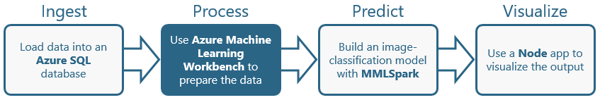
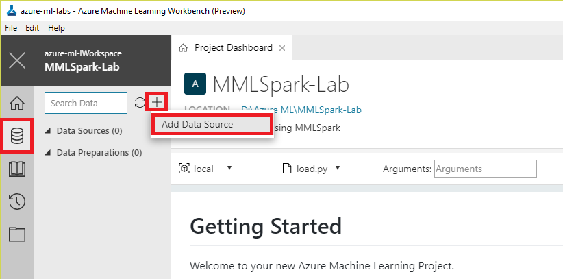
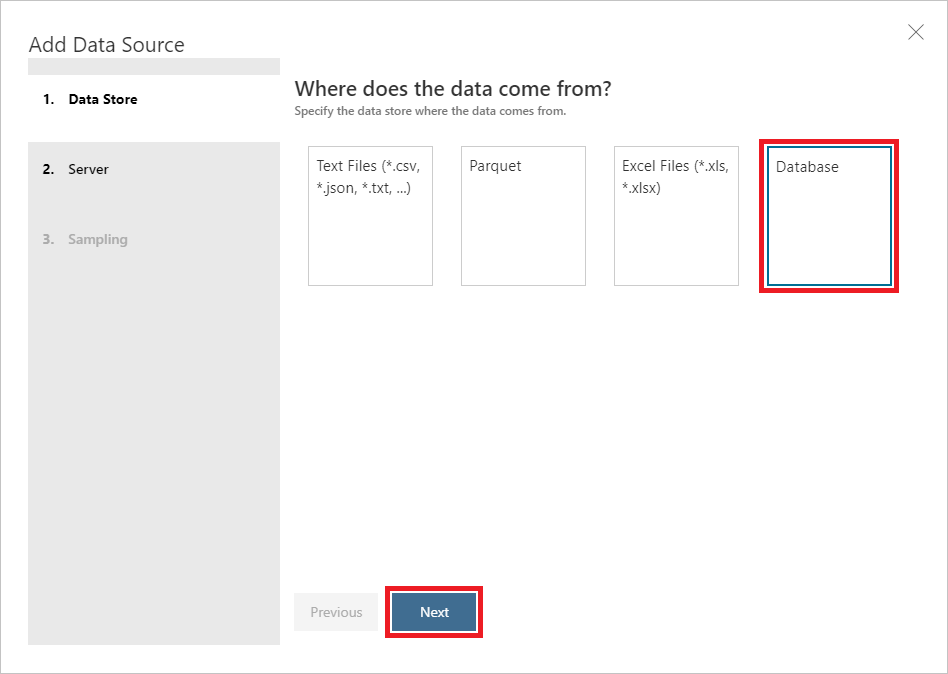
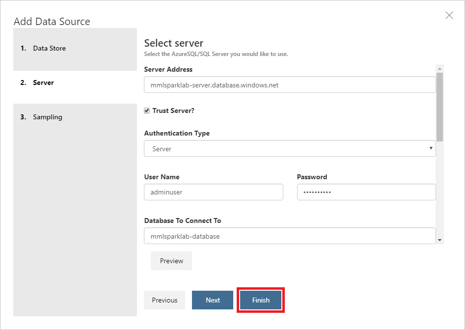
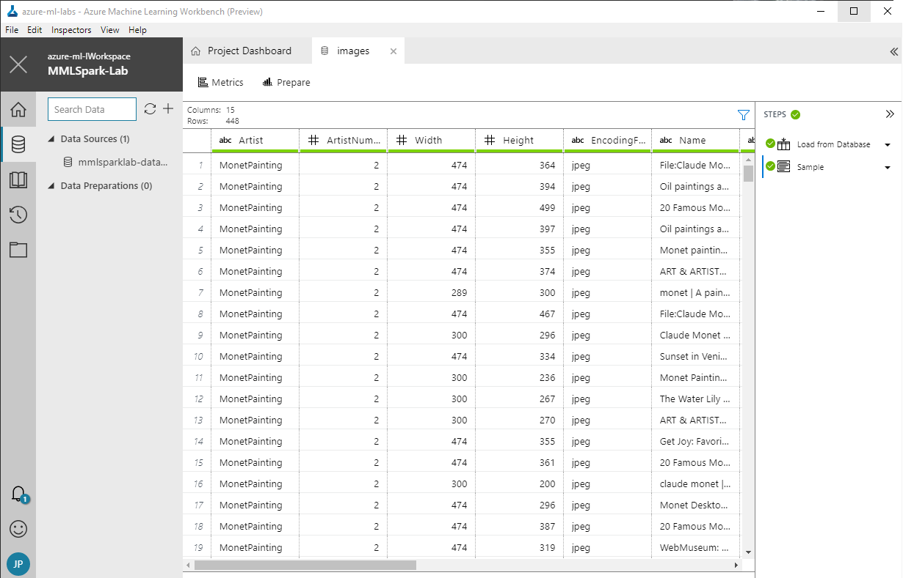
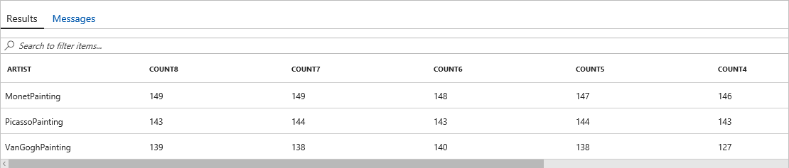
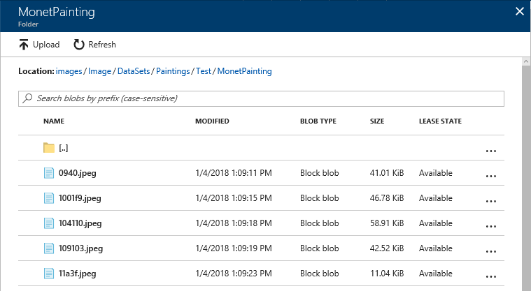

In this lab, the second of four in a series, you will prepare the image data that you stored in an Azure SQL database in the [previous lab](../1%20-%20Ingest) so it can be used to train a machine-learning model that performs image classification. Preparation will involve using a technique called [perceptual image hashing](https://www.pyimagesearch.com/2017/11/27/image-hashing-opencv-python/) to identify images that are identical or highly similar so the model won't be biased by training it with multiple variations of the same image. In the [next lab](../3%20-%20Predict), you will use the deduped image set to train a machine-learning model to recognize the artists of famous paintings.



<a name="Objectives"></a>
### Objectives ###

In this hands-on lab, you will learn how to:

- Use an Azure SQL database as a data source in Machine Learning Workbench
- Use perceptual image hashing to identify similar images
- Upload images to Azure blob storage

<a name="Prerequisites"></a>
### Prerequisites ###

The following are required to complete this hands-on lab:

- An active Microsoft Azure subscription. If you don't have one, [sign up for a free trial](https://aka.ms/WATK-FreeTrial).
- A computer running Windows 10, Windows Server 2016, macOS Sierra, or macOS High Sierra
- [Azure Machine Learning Workbench](https://docs.microsoft.com/azure/machine-learning/preview/quickstart-installation?WT.mc_id=academiccontent-github-cxa)
- The [Azure CLI](https://docs.microsoft.com/cli/azure/install-azure-cli?WT.mc_id=academiccontent-github-cxa)
- [Docker](https://www.docker.com/)

If you haven't completed the [previous lab in this series](../1%20-%20Ingest), you must do so before starting this lab.

<a name="Exercises"></a>
## Exercises ##

This hands-on lab includes the following exercises:

- [Exercise 1: Connect to Azure SQL from ML Workbench](#Exercise1)
- [Exercise 2: Dedupe the images](#Exercise2)
- [Exercise 3: Create a storage account](#Exercise3)
- [Exercise 4: Upload deduped images to blob storage](#Exercise4)

Estimated time to complete this lab: **40** minutes.

<a name="Exercise1"></a>
## Exercise 1: Connect to Azure SQL from ML Workbench ##

In this exercise, you will connect to the Azure SQL database you created in the previous lab from Azure Machine Learning Workbench by specifying the database as a data source.

1. Launch Azure Machine Learning Workbench and open the project that you created in the previous lab. Then click the **Data** icon in the ribbon on the left, click the **+** sign, and select **Add Data Source**.

	

	_Adding a data source_

1. Click **Database**, and then click the **Next** button.

	

	_Adding a database as a data source_

1. In the **Server Address** box, enter "SERVER_NAME.database.windows.net" (without quotation marks), where SERVER_NAME is the name you assigned to the database server in the previous lab. Make sure **Server** is selected as the **Authentication Type**, and enter the admin user name and password that you specified in the previous lab for logging in to the database. In **Database To Connect To**, enter the name you assigned to the database in the previous lab. Next, scroll down and enter the following statement into the **Query** box:

	```
	SELECT * FROM dbo.Paintings
	```

	Then finish up by clicking the **Finish** button.

	

	_Adding an Azure SQL database as a data source_

1. Confirm that the contents of the "Paintings" table appears in ML Workbench, complete with columns named "Artist,"  "Artist Number," "Width," "Height," and others.

	

	_Data imported from the Azure SQL database_

	Scroll to the right and observe that the table includes fields named "DHashHex8," "DHashHex7," and so on, all the way down to "DHashHex1." The **load.py** script that you ran in the previous lab used Bing Image Search to find images of paintings by famous artists. Then it downloaded each image and generated a series of [dHashes](https://pypi.python.org/pypi/dhash) with bit sizes from 8 to 1. A dHash is a [perceptual image hash](https://www.pyimagesearch.com/2017/11/27/image-hashing-opencv-python/); its purpose is to quantify the similarity between images. Higher bit sizes produce finer-grained results, meaning images have to be more alike to produce the same dHash. Image hashing is an important part of a strategy to clean the data because you don't want to train a machine-learning model that recognizes Van Gogh paintings with 50 images of the same Van Gogh. Perceptual hashes wouldn't be needed if training images were picked by hand. They are extraordinarily useful when picking images algorithmically.

1. Return to the [Azure Portal](https://portal.azure.com?WT.mc_id=academiccontent-github-cxa) and open the database that you created in the previous lab. Then use the query editor to execute the following query, which uses common table expressions (CTEs) to tabulate the number of unique images for each artist:

	``` SQL
	WITH RowTagging
	AS (SELECT [Artist],
	    ROW_NUMBER() OVER (PARTITION BY Artist, DHashHex8 ORDER BY Width DESC, Height DESC) AS RowNumber8,
	    ROW_NUMBER() OVER (PARTITION BY Artist, DHashHex7 ORDER BY Width DESC, Height DESC) AS RowNumber7,
	    ROW_NUMBER() OVER (PARTITION BY Artist, DHashHex6 ORDER BY Width DESC, Height DESC) AS RowNumber6,
	    ROW_NUMBER() OVER (PARTITION BY Artist, DHashHex5 ORDER BY Width DESC, Height DESC) AS RowNumber5,
	    ROW_NUMBER() OVER (PARTITION BY Artist, DHashHex4 ORDER BY Width DESC, Height DESC) AS RowNumber4,
	    ROW_NUMBER() OVER (PARTITION BY Artist, DHashHex3 ORDER BY Width DESC, Height DESC) AS RowNumber3,
	    ROW_NUMBER() OVER (PARTITION BY Artist, DHashHex2 ORDER BY Width DESC, Height DESC) AS RowNumber2,
	    ROW_NUMBER() OVER (PARTITION BY Artist, DHashHex1 ORDER BY Width DESC, Height DESC) AS RowNumber1
	    FROM [dbo].[Paintings]),
	    Count8
	AS (SELECT R.Artist, COUNT(*) AS Count8
	    FROM RowTagging R
	    WHERE RowNumber8 = 1
	    GROUP BY R.Artist), Count7
	AS (SELECT R.Artist, COUNT(*) AS Count7
	    FROM RowTagging R
	    WHERE RowNumber7 = 1
	    GROUP BY R.Artist),
	     Count6
	AS (SELECT R.Artist, COUNT(*) AS Count6
	    FROM RowTagging R
	    WHERE RowNumber6 = 1
	    GROUP BY R.Artist), Count5
	AS (SELECT R.Artist, COUNT(*) AS Count5
	    FROM RowTagging R
	    WHERE RowNumber5 = 1
	    GROUP BY R.Artist), Count4
	AS (SELECT R.Artist, COUNT(*) AS Count4
	    FROM RowTagging R
	    WHERE RowNumber4 = 1
	    GROUP BY R.Artist), Count3
	AS (SELECT R.Artist, COUNT(*) AS Count3
	    FROM RowTagging R
	    WHERE RowNumber3 = 1
	    GROUP BY R.Artist), Count2
	AS (SELECT R.Artist, COUNT(*) AS Count2
	    FROM RowTagging R
	    WHERE RowNumber2 = 1
	    GROUP BY R.Artist), Count1
	AS (SELECT R.Artist, COUNT(*) AS Count1
	    FROM RowTagging R
	    WHERE RowNumber1 = 1
	    GROUP BY R.Artist)
	SELECT A.Artist,
	       A.Count8,
	       B.Count7,
	       C.Count6,
	       D.Count5,
	       E.Count4,
	       F.Count3,
	       G.Count2,
	       H.Count1
	FROM Count8 A
	    LEFT JOIN Count7 B
	        ON B.Artist = A.Artist
	    LEFT JOIN Count6 C
	        ON C.Artist = A.Artist
	    LEFT JOIN Count5 D
	        ON D.Artist = A.Artist
	    LEFT JOIN Count4 E
	        ON E.Artist = A.Artist
	    LEFT JOIN Count3 F
	        ON F.Artist = A.Artist
	    LEFT JOIN Count2 G
	        ON G.Artist = A.Artist
	    LEFT JOIN Count1 H
	        ON H.Artist = A.Artist;
	``` 

1. Take a moment to examine the results. Mathematically, the results are as you would expect: as the bit size of the dHash decreases, the number of unique hash values decreases, too. Scroll all the way to the right to see how many images survive with a bit size of 1. Note that in a dHash, the actual bit size is the specified number of bits plus one (in case the results for 1-bit dHashes seem odd).

	

	_Distribution of unique dHash values_

Now that you have a series of perceptual hashes for each image, a question arises: what is a "unique image" for the purpose of this project? More specifically, which column should you use to dedupe the images before using them to train a machine-learning model?

<a name="Exercise2"></a>
## Exercise 2: Dedupe the images ##

In this exercise, you will run some Python code in Azure Machine Learning Workbench to dedupe the images referenced in the database's "Paintings" table. The outcome will be a new table in the database named "UniquePaintings" containing only images that are relatively unique. The SQL logic enacted in the code will use the "DHashHex3" column in the "Paintings" table to identify images that are sufficiently unique.

1. Add a file named **dedupe.py** to the project in Azure Machine Learning Workbench. Then open it for editing and paste in the following code:

	```python
	# SQL Alchemy for full relational power
	# http://docs.sqlalchemy.org/en/latest/core/engines.html
	from sqlalchemy import create_engine
	import pyodbc 
	
	# Pandas for DataFrame
	# https://pypi.python.org/pypi/pandas
	import pandas as pd
	
	# Numpy
	import numpy as np
	
	# Create engine
	# http://docs.sqlalchemy.org/en/latest/dialects/mssql.html#module-sqlalchemy.dialects.mssql.pyodbc
	server = 'SERVER_NAME'
	database = 'DATABASE_NAME'
	username = 'ADMIN_USERNAME'
	password = 'ADMIN_PASSWORD'
	
	engine = create_engine('mssql+pyodbc://' + username + ':' + password + '@' + \
	    server + '.database.windows.net:1433/' + database + '?driver=ODBC+Driver+13+for+SQL+Server')
	
	# Custom SQL Query to remove duplicates
	# Solution uses T-SQL window functions https://docs.microsoft.com/sql/t-sql/queries/select-over-clause-transact-sql
	# Result set keeps the largest width image (then largest height) if the hash is equivalent
	sql = 'WITH RowTagging \
	    AS (SELECT [Artist], \
	            [ArtistNumber], \
	            [Width], \
	            [Height], \
	            [EncodingFormat], \
	            [Name], \
	            [URL], \
	            [DHashHex3], \
	            ROW_NUMBER() OVER (PARTITION BY DHashHex3 ORDER BY Width DESC, Height DESC) AS RowNumber \
	        FROM [dbo].[Paintings]) \
	    SELECT R.Artist, \
	        R.ArtistNumber, \
	        R.Width, \
	        R.Height, \
	        R.EncodingFormat, \
	        R.Name, \
	        R.URL, \
	        R.DHashHex3 \
	    FROM RowTagging R \
	    WHERE RowNumber = 1;'
	
	# Run SQL Query in SQL Azure, return results into Pandas DataFrame
	# http://pandas.pydata.org/pandas-docs/stable/generated/pandas.read_sql.html
	df = pd.read_sql(sql, engine)
	print('Columns: ', list(df.columns.values))
	print('DataFrame Shape: ', df.shape)
	
	# Assign a random column using numpy
	df['Random'] = np.random.rand(df.shape[0])
	
	# Output Pandas DataFrame to Azure SQL
	# Note that the output would add an index by default
	# http://pandas.pydata.org/pandas-docs/stable/generated/pandas.DataFrame.to_sql.html
	df.to_sql('UniquePaintings', engine, if_exists='replace', index=False)
	```

	This code queries the database's "Paintings" table and loads the results into a [Pandas DataFrame](https://pandas.pydata.org/pandas-docs/stable/generated/pandas.DataFrame.html). In cases in which multiple images have the same dHash, the query uses T-SQL's [ROW_NUMBER](https://docs.microsoft.com/sql/t-sql/functions/row-number-transact-sql?WT.mc_id=academiccontent-github-cxa) function to exclude all but the largest of those images. The script then writes the resulting DataFrame to a database table named "UniquePaintings."

1. Replace the following values in **dedupe.py**. Then save the file.

	- Replace SERVER_NAME on line 15 with the database server name
	- Replace DATABASE_NAME on line 16 with the database name
	- Replace ADMIN_USERNAME on line 17 with the database user name
	- Replace ADMIN_PASSWORD on line 18 with the database password

1. Use Machine Learning Workbench to run **dedupe.py** in a Docker container.

1. Wait for the run to complete and confirm that it completed successfully. Then return to the database in the Azure Portal and use the following query to compare the number of rows in the "Paintings" and "UniquePaintings" tables:

	```sql
	SELECT
	   (SELECT COUNT(*) from dbo.Paintings) AS Paintings,
	   (SELECT COUNT(*) from dbo.UniquePaintings) AS UniquePaintings
	```

How do the row counts compare? How many images were eliminated by using the "DHashHex3" column to dedupe the collection?

<a name="Exercise3"></a>
## Exercise 3: Create a storage account ##

In this exercise, you will use the Azure CLI to create an Azure storage account to store the images listed in the database's "UniquePaintings" table. In the next lab, these images will be used to train a machine-learning model on an [Azure HDInsight](https://azure.microsoft.com/services/hdinsight/?WT.mc_id=academiccontent-github-cxa) cluster. Blob storage is a convenient medium for storing these images because HDInsight clusters can [access blobs seamlessly](https://docs.microsoft.com/azure/hdinsight/hdinsight-hadoop-use-blob-storage?WT.mc_id=academiccontent-github-cxa) using the [WASB](https://blogs.msdn.microsoft.com/cindygross/2015/02/04/understanding-wasb-and-hadoop-storage-in-azure/?WT.mc_id=academiccontent-github-cxa) extension to the Hadoop Distributed File System (HDFS).

1. Open a command Prompt or terminal window (or the [Azure Cloud Shell](https://azure.microsoft.com/features/cloud-shell/?WT.mc_id=academiccontent-github-cxa)) and use the following command to create a general-purpose storage account in the "mmlsparklab-rg" resource group. Replace ACCOUNT_NAME with the name you wish to assign the storage account. The account name must be unique within Azure, so if the command fails because the storage-account name is already in use, change the name and try again. In addition, storage-account names must be from 3 to 24 characters in length and can contain only numbers and lowercase letters.

	```
	az storage account create --name ACCOUNT_NAME --resource-group mmlsparklab-rg --location southcentralus --kind Storage --sku Standard_LRS
	```

1. Before you can upload blobs to a storage account, you must create a container to store them in. Use the following command to create a container named "images" in the storage account, replacing ACCOUNT_NAME with the name you assigned to the storage account in the previous step:

	```
	az storage container create --name images --account-name ACCOUNT_NAME --public-access container
	```

	The ```--public-access container``` switch makes the contents of the container public. This will come in handy when the blobs are accessed from a Spark container in the next lab.

You now have a storage account for storing images and a container to store them in. The next step is to upload some images.

<a name="Exercise4"></a>
## Exercise 4: Upload deduped images to blob storage ##

In this exercise, you will run a Python script in Machine Learning Workbench that fetches the image URLs in the database's "UniquePaintings" table, downloads the images, and uploads them to blob storage.

1. Add a file named **upload.py** to the project in Azure Machine Learning Workbench. Then open it for editing and paste in the following code:

	```python
	from azure.storage.blob import BlockBlobService
	
	# Transfer objects to/from Azure Blob storage using Python: https://docs.microsoft.com/azure/storage/blobs/storage-quickstart-blobs-python
	from azure.storage.blob import ContentSettings
	
	# Allow appending to blob
	from azure.storage.blob import AppendBlobService
	
	# SQL Alchemy for full relational power
	# http://docs.sqlalchemy.org/en/latest/core/engines.html
	from sqlalchemy import create_engine
	import pyodbc 
	
	# Pandas for DataFrame
	# https://pypi.python.org/pypi/pandas
	import pandas as pd
	
	# HTTP for humans
	# https://pypi.python.org/pypi/requests
	import requests
	
	# PIL for image generation
	# https://pypi.python.org/pypi/Pillow
	from PIL import Image
	
	# BytesIO to obtain from URL
	# https://wiki.python.org/moin/BytesIO
	from io import BytesIO
	
	# StringIO to create TXT files
	# https://docs.python.org/3/library/io.html
	from io import StringIO
	
	# Access your blob storage
	# Help on using Azure Blob in Python:  https://docs.microsoft.com/azure/storage/blobs/storage-python-how-to-use-blob-storage
	# Azure Storage Services REST API Reference: https://docs.microsoft.com/rest/api/storageservices/Azure-Storage-Services-REST-API-Reference
	myaccount = 'ACCOUNT_NAME'
	mykey = 'ACCOUNT_KEY'
	block_blob_service = BlockBlobService(account_name=myaccount, account_key=mykey)
	
	# Create Engine
	# http://docs.sqlalchemy.org/en/latest/dialects/mssql.html#module-sqlalchemy.dialects.mssql.pyodbc
	server = 'SERVER_NAME'
	database = 'DATABASE_NAME'
	username = 'ADMIN_USERNAME'
	password = 'ADMIN_PASSWORD'
	
	engine = create_engine('mssql+pyodbc://' + username + ':' + password + '@' + \
	    server + '.database.windows.net:1433/' + database + '?driver=ODBC+Driver+13+for+SQL+Server')
	
	# Create Directory stem for HDInsight
	azure_blob_root = 'wasbs://images@'+ myaccount + '.blob.core.windows.net/'
	url_blob_root = 'https://'+ myaccount + '.blob.core.windows.net/images/'
	
	# Read a SQL Table into Pandas DataFrame
	# http://pandas.pydata.org/pandas-docs/stable/generated/pandas.read_sql_table.html
	df = pd.read_sql_table('UniquePaintings', engine)
	print("Columns: ", list(df.columns.values))
	print("DataFrame Shape: ", df.shape)
	
	# Array of valid image encodings
	encodingarray = ['jpeg','bmp','png','gif']
	container_name = 'images'
	paintings_stem = 'Image/DataSets/Paintings/'
	transfer_images_blob_name = paintings_stem + 'transferimages.txt'
	
	# Create empty StringIO objects to allow appending
	transfer_images_stream = StringIO()
	
	for index, row in df.iterrows():
	    if row['EncodingFormat'] in encodingarray:
	        print (row['URL'],row['DHashHex3'],row['EncodingFormat'])
	        image_id =  row['DHashHex3'] + "." + row['EncodingFormat'] ;
	
	        # Assign to test or train (80/20 split) based on the random number value
	        # Because the random number is stored, you may modify to a different split value
	        # Also, build a map.txt file in the appropriate directory
	        # How to use Azure Blob Storage: https://docs.microsoft.com/azure/storage/blobs/storage-python-how-to-use-blob-storage
	        if row['Random'] < .80:
	            image_group = "Train/" + row['Artist'] + "/" 
	        else:
	            image_group = "Test/" + row['Artist'] + "/" 
	
	        # Single stream for all uploaded images for transferring into HDInsight file system
	        image_blob_name = paintings_stem + image_group + image_id
	        transfer_images_stream.write(url_blob_root + image_blob_name + ' ' + image_group + ' ' + image_id + '\n')
	
	        # Acquire image:  "response" could be saved as an image file
	        # response = requests.get(row['URL'], stream=True)
	
	        # Convert to Binary Stream
	        # https://docs.python.org/3/library/io.html
	        image_stream = BytesIO(requests.get(row['URL'], stream=True).content)
	        imagecontent = "image/" + row['EncodingFormat']
	
	        # azure.storage.blob.blockblobservice module http://azure.github.io/azure-storage-python/ref/azure.storage.blob.blockblobservice.html
	        block_blob_service.create_blob_from_stream(container_name, image_blob_name, image_stream, content_settings=ContentSettings(content_type=imagecontent))
	
	        # memory management
	        del image_stream
	
	# write to block blobs:  using create_blob_from_text 
	block_blob_service.create_blob_from_text(container_name, transfer_images_blob_name, transfer_images_stream.getvalue())
	
	# memory management
	del transfer_images_stream
	```

	This code downloads the ```jpeg```, ```bmp```, ```png```, and ```gif``` files referenced in the "UniquePaintings" table and uploads them to the storage account's "images" container. Note that the files are never saved in the local file system; instead, they are uploaded directly to blob storage.

1. Replace the following values in **upload.py**:

	- Replace ACCOUNT_NAME on line 37 with the name of the storage account you created in the previous exercise 
	- Replace SERVER_NAME on line 43 with the database server name
	- Replace DATABASE_NAME on line 44 with the database name
	- Replace ADMIN_USERNAME on line 45 with the database user name
	- Replace ADMIN_PASSWORD on line 46 with the database password

1. Return to the Command Prompt or terminal window and use the following command to list the access keys for the storage account you created in the previous exercise, replacing ACCOUNT_NAME with the storage account's name:

	```
	az storage account keys list --account-name ACCOUNT_NAME --resource-group mmlsparklab-rg
	```

	Even though you made the "images" container that images will be uploaded to public, an access key is required to upload blobs to the container. You should treat access keys with great care and **never** give them to someone you don't trust.

1. Copy the ```value``` property of either of the two keys that is displayed in the command output to the clipboard. Then replace ACCOUNT_KEY on line 38 of **upload.py** with the access key, and save the file.

1. Use Machine Learning Workbench to run **upload.py** in a Docker container.

1. Wait for the run to complete and confirm that it completed successfully. Then go to the storage account in the Azure Portal, open the "images" container, and navigate down the folder hierarchy until you find folders named "Test" and "Train." Each contains subfolders with images for testing and training a machine-learning model. Examine some of these subfolders and confirm that they contain collections of image blobs, as shown below.

	> Blob storage doesn't support nested containers, but you can create the illusion of a folder hierarchy within a container by including slashes in the blob names.

	

	_Blobs containing images of Monet paintings_

If you're curious to see what some of the images look like, simply select a blob and click the **Download** button at the top of the ensuing blade. Browsing a large collection of blobs is tedious in the Azure Portal, but there are numerous external tools available for managing blob storage. One of them is the [Microsoft Azure Storage Explorer](https://azure.microsoft.com/features/storage-explorer/?WT.mc_id=academiccontent-github-cxa), which is free and runs on Windows, macOS, and Linux.

<a name="Summary"></a>
## Summary ##

In this lab, you used a combination of T-SQL and perceptual image hashing to dedupe the images you identified through Bing Image Search in the previous lab. Then you retrieved the images and uploaded them to blob storage. You may now proceed to the next lab in this series — [Using the Microsoft Machine Learning Library for Apache Spark (MMLSpark) to Perform Image Classification, Part 3](../3%20-%20Predict) — to use these images to train a machine-learning model.

---

Copyright 2018 Microsoft Corporation. All rights reserved. Except where otherwise noted, these materials are licensed under the terms of the MIT License. You may use them according to the license as is most appropriate for your project. The terms of this license can be found at https://opensource.org/licenses/MIT.
