[Azure Cognitive Services](https://azure.microsoft.com/services/cognitive-services/) is a suite of services and APIs backed by machine learning that enables developers to incorporate intelligent features such as facial recognition in photos and videos, sentiment analysis in text, and language understanding into their applications. Microsoft's [Custom Vision Service](https://azure.microsoft.com/services/cognitive-services/custom-vision-service/) is among the newest members of the Cognitive Services suite. Its purpose is to create image-classification models that "learn" from labeled images you provide. Want to know if a photo contains a picture of a flower? Train the Custom Vision Service with a collection of flower images, and it can tell you whether the next image includes a flower — or even what type of flower it is.

The Custom Vision Service exposes two APIs: the [Custom Vision Training API](https://southcentralus.dev.cognitive.microsoft.com/docs/services/d9a10a4a5f8549599f1ecafc435119fa/operations/58d5835bc8cb231380095be3) and the [Custom Vision Prediction API](https://southcentralus.dev.cognitive.microsoft.com/docs/services/eb68250e4e954d9bae0c2650db79c653/operations/58acd3c1ef062f0344a42814). You can build, train, and test image-classification models using the [Custom Vision Service portal](https://www.customvision.ai/), or you can build, train, and test them using the Custom Vision Training API. Once a model is trained, you can use the Custom Vision Prediction API to build apps that utilize it. Both are REST APIs that can be called from a variety of programming languages.

In this lab, the third of four in a series, you will create a Custom Vision Service model and train it to differentiate between various types of Arctic wildlife. Then you will connect it to the Stream Analytics job you created in the previous lab.

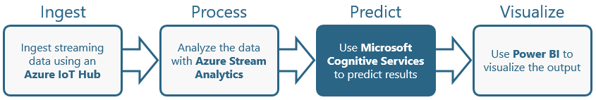

<a name="Objectives"></a>
### Objectives ###

In this hands-on lab, you will learn how to:

- Use the Custom Vision Service to train an image-classification model
- Test a Custom Vision Service model
- Call the model from an app or service

<a name="Prerequisites"></a>
### Prerequisites ###

The following are required to complete this hands-on lab:

- An active Microsoft Azure subscription. If you don't have one, [sign up for a free trial](http://aka.ms/WATK-FreeTrial).

If you haven't completed the [previous lab in this series](../2%20-%20Process), you must do so before starting this lab.

<a name="Resources"></a>
### Resources ###

[Click here](https://topcs.blob.core.windows.net/public/400-streaming-resources-03.zip) to download a zip file containing the resources used in this lab. Copy the contents of the zip file into a folder on your hard disk.

<a name="Exercises"></a>
## Exercises ##

This hands-on lab includes the following exercises:

- [Exercise 1: Build a Custom Vision Service model](#Exercise1)
- [Exercise 2: Train and test the model](#Exercise2)
- [Exercise 3: Create an Azure SQL database](#Exercise3)
- [Exercise 4: Modify the Azure Function](#Exercise4)

Estimated time to complete this lab: **30** minutes.

<a name="Exercise1"></a>
## Exercise 1: Build a Custom Vision Service model ##

In this exercise, you will create a new Custom Vision Service project. Then you will upload images of polar bears, arctic foxes, and walruses and tag the images so the Custom Vision Service can learn to differentiate between them.

1. Open the [Custom Vision Service portal](https://www.customvision.ai/) in your browser. Then click **Sign In** and sign in with your Microsoft account. 
 
    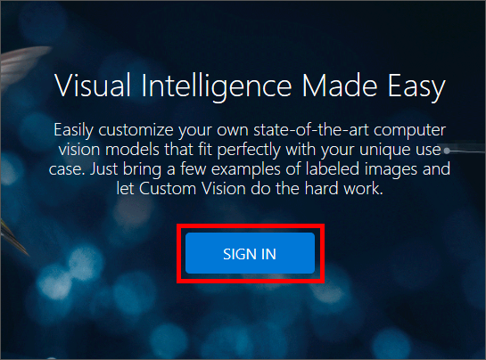

    _Signing in to the Custom Vision Service portal_

1. Click **+ NEW PROJECT** to display the "Create new project" dialog. Enter a project name and either select the "streaminglab-rg" resource group if it appears in the drop-down list, or create a new resource group if it doesn't. (Note that the lower half of the dialog might not appear until a resource group has been selected.) Ensure that **General** is selected as the domain and **Multiclass** as the classification type. Then click **Create project**.

	> A domain optimizes a model for specific types of images. For example, if your goal is to classify food images by the types of food they contain or the ethnicity of the dishes, then it is helpful to select the Food domain. For scenarios that don't match any of the offered domains, or if you are unsure of which domain to choose, select the General domain.

	

    _Creating a Custom Vision Service project_

1. Click **Add images** to add images to the project.

	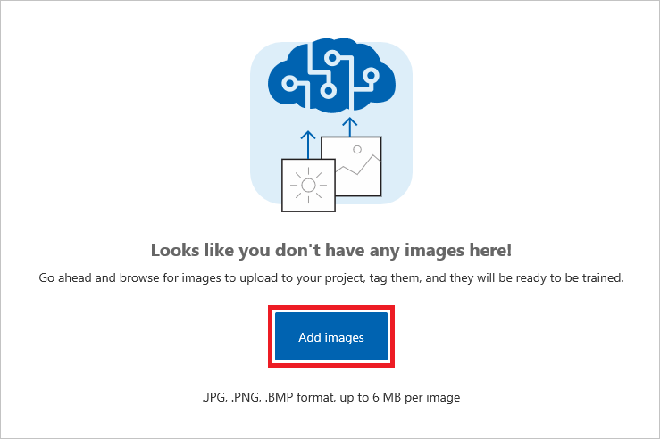

    _Adding images to the project_ 
 
1. Browse to the folder containing the [resources that accompany this lab](https://topcs.blob.core.windows.net/public/400-streaming-resources-03.zip) and select all of the files in the "Training Images/Arctic Fox" directory. Then OK the selection, enter "Arctic fox" as the tag for the images, and click the **Upload 130 files** button. Wait for the upload to complete, and then click **Done**.

	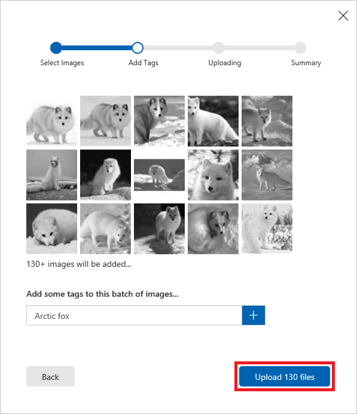

    _Uploading Arctic-fox images_ 
 
1. Click **Add images** at the top of the page and repeat the previous step to upload all of the images in the "Training Images/Polar Bear" directory to the Custom Vision Service and tag them with the term "Polar bear." Wait for the upload to complete, and then click **Done**.

	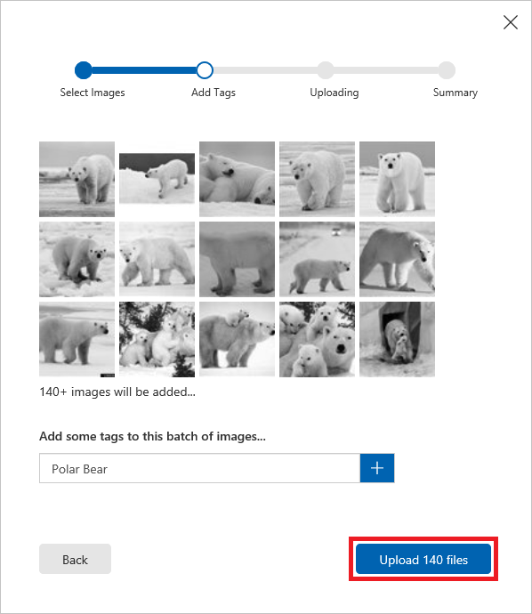

    _Uploading polar-bear images_ 

1. Repeat the previous step to upload all of the images in the "Training Images/Walrus" directory to the Custom Vision Service and tag them with the term "Walrus." Wait for the upload to complete, and then click **Done**.

With the images tagged and uploaded, the next step is to train the model so it can distinguish between Arctic foxes, polar bears, and walruses, as well as determine whether an image contains one of these animals.

<a name="Exercise2"></a>
## Exercise 2: Train and test the model ##

In this exercise, you will train the model using the images that you tagged and uploaded in the previous exercise. Then you will test the model to determine how adept it is at identifying Arctic wildlife from photos. Training can be accomplished with a simple button click in the portal, or by calling the [TrainProject](https://southcentralus.dev.cognitive.microsoft.com/docs/services/d9a10a4a5f8549599f1ecafc435119fa/operations/58d5835bc8cb231380095bed) method in the [Custom Vision Training API](https://southcentralus.dev.cognitive.microsoft.com/docs/services/d9a10a4a5f8549599f1ecafc435119fa/operations/58d5835bc8cb231380095be3). Once trained, a model can be refined by uploading additional tagged images and retraining it.

1. Click the **Train** button at the top of the page to train the model. Each time you train the model, a new iteration is created. The Custom Vision Service maintains several iterations, allowing you to compare your progress over time.

	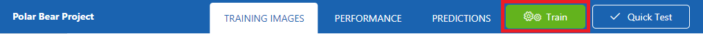

	_Training the model_

1. Wait for the training process to complete. (It should only take a few seconds.) Then review the training statistics presented to you for iteration 1.

	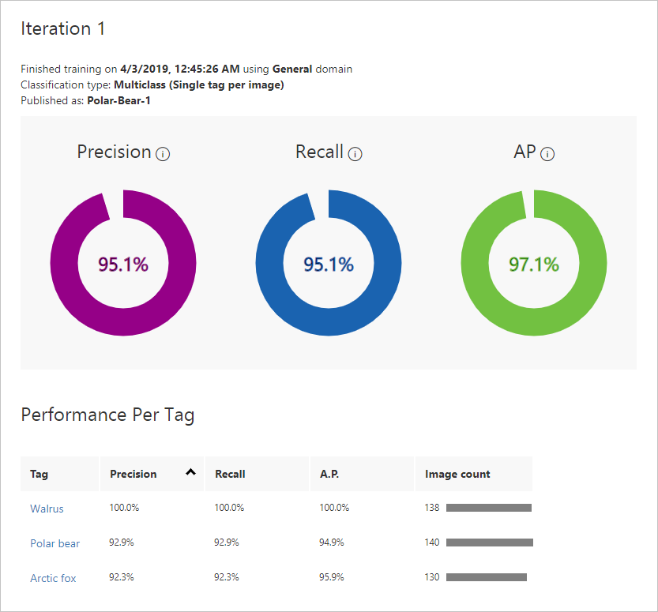

    _Results of training the model_ 

	**Precision** and **recall** are separate but related  measures of the model's accuracy. Suppose the model was presented with three polar-bear images and three walrus images, and that it correctly identified two of the polar-bear images as polar-bear images, but incorrectly identified two of the walrus images as polar-bear images. In this case, the precision would be 50% (two of the four images it classified as polar-bear images actually are polar-bear images), while its recall would be 67% (it correctly identified two of the three polar-bear images as polar-bear images). You can learn more about precision and recall from https://en.wikipedia.org/wiki/Precision_and_recall.

	**AP**, short for *Average Precision*, is a third measurement of the model's accuracy. Whereas precision measures the false-positive rate and recall measures the false-negative rate, AP is a mean of false-positive rates computed across a range of thresholds. For more information, see [Understanding the mAP Evaluation Metric for Object Detection](https://medium.com/@timothycarlen/understanding-the-map-evaluation-metric-for-object-detection-a07fe6962cf3).

1. Now let's test the model using the portal's Quick Test feature, which allows you to submit images to the model and see how it classifies them using the knowledge gained during training.

	Click the **Quick Test** button at the top of the page. Then click **Browse local files**, browse to the "Testing Images/Polar Bear" directory in the resources accompanying this lab, and select any one of the test images in that directory.

1. Examine the results of the test in the "Quick Test" dialog. What is the probability that the image contains a polar bear? What is the probability that it contains an Arctic fox or a walrus?

	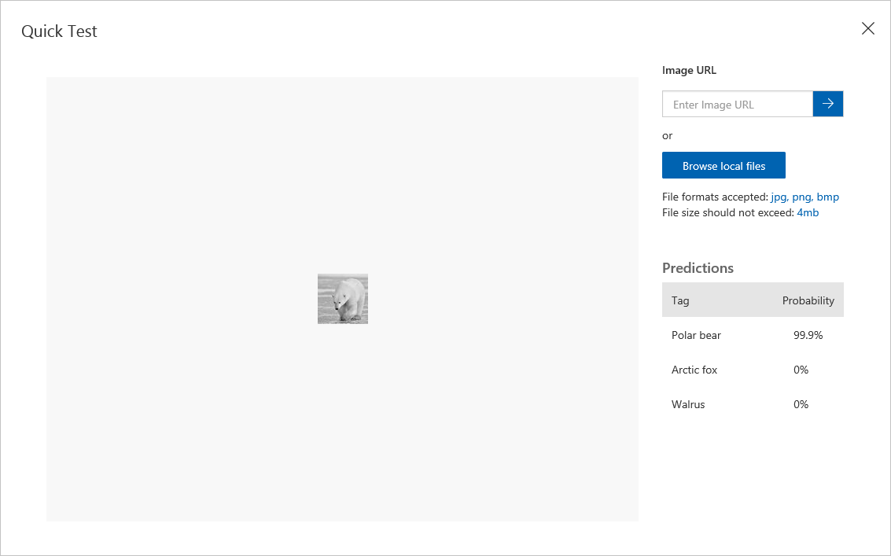

	_Testing the model with a polar-bear image_

1. Repeat this test with one of the images in the "Testing Images/Arctic Fox" directory. How well is the model able to differentiate between Arctic foxes and polar bears?

1. The "Testing Images" directory in the lab resources contains subdirectories with a total of 30 different images for testing. Perform additional quick tests using these images until you are satisfied that the model is reasonably adept at predicting whether an image contains a polar bear.

1. Return to the project and click **Publish**. Enter a name for this iteration of the model. Then click **Prediction URL**.

	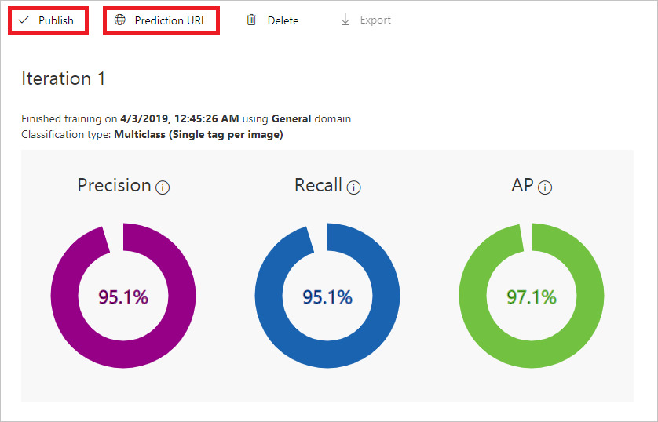

    _Publishing the current iteration of the model_ 

1. The ensuing dialog lists two URLs: one for uploading images via URL, and another for uploading images as byte streams. Copy the former to the clipboard, and then paste it into your favorite text editor so you can retrieve it later. Do the same for the ```Prediction-Key``` value underneath the URL. This value must be passed in each call to the prediction URL. 

	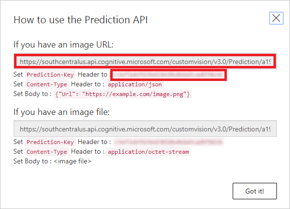

    _Copying the Prediction API URL_ 

You now have a machine-learning model that can discern whether an image contains a polar bear, as well as a URL and API key for invoking the model. The next step is create a database for storing the results of those calls.

<a name="Exercise3"></a>
## Exercise 3: Create an Azure SQL database ##

In this exercise, you will use the Azure Cloud Shell to create an Azure SQL database. This database will collect output from the Azure Function you connected to Stream Analytics in the previous lab, and in the next lab, you will connect the database to Power BI to show where polar bears are being spotted.

1. Return to the Azure Portal. Click the **Cloud Shell** button in the toolbar at the top of the page to open the Azure Cloud Shell. If you would prefer to run the Cloud Shell in its own browser window, open a separate browser instance and navigate to https://shell.azure.com.

    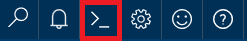

    _Opening the Azure Cloud Shell_

1. Execute the following command in the Cloud Shell to create a database server in the "streaminglab-rg" resource group. Replace SERVER_NAME with the name you wish to assign the database server, and replace ADMIN_USERNAME and ADMIN_PASSWORD with the user name and password for an admin user. **Remember the user name and password** you enter, because you will need them later.

	```
	az sql server create --name SERVER_NAME --resource-group streaminglab-rg --location southcentralus --admin-user ADMIN_USERNAME --admin-password ADMIN_PASSWORD
	```

	The server name must be unique within Azure, and the admin password must be at least 8 characters long. The user name cannot be one that is reserved in SQL Server such as "admin" or "sa." The user name "adminuser" is valid if you want to use that.

1. Use the following command to create a database assigned the [S0 service tier](https://docs.microsoft.com/azure/sql-database/sql-database-service-tiers). Replace DATABASE_NAME with the name you wish to assign the database, and SERVER_NAME with the server name you specified in Step 2.

	```
	az sql db create --resource-group streaminglab-rg --server SERVER_NAME --name DATABASE_NAME --service-objective S0
	```

1. Go to the database server in the [Azure Portal](https://portal.azure.com) and click **Firewalls and virtual networks** in the menu on the left. Turn on **Allow access to Azure services** to allow other Azure services to connect to the server, and click **+ Add client IP** so you can connect to the database from Power BI Desktop in the next lab. Then click **Save** at the top of the blade to save these changes.

	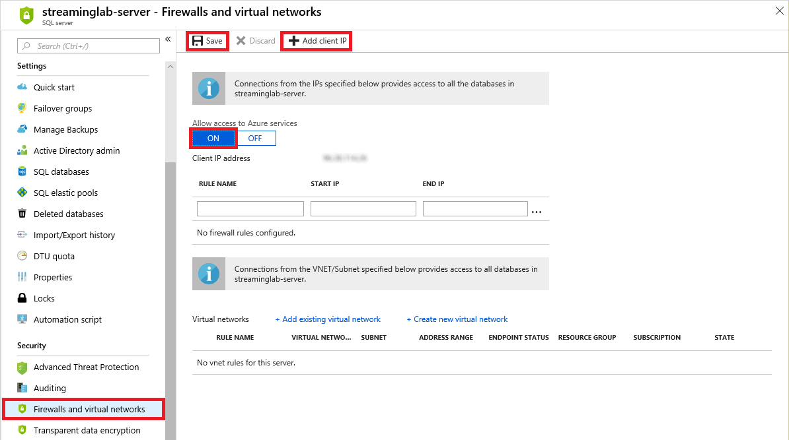

	_Allowing Azure to access the database server_

1. Open the database in the Azure Portal. Click **Query editor** in the menu on the left and enter the user name and password you specified in Step 2. Then click **OK** to log in to the database.

	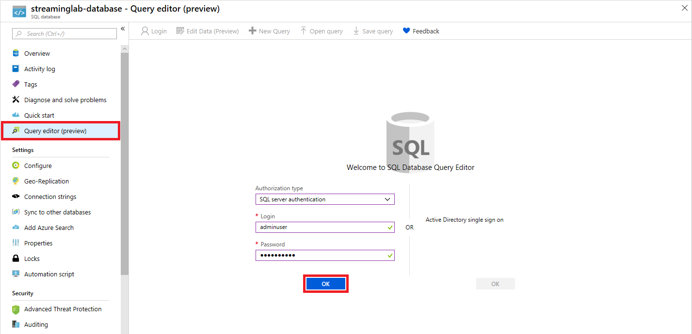

	_Logging in to the database server_

1. Paste the following statements into the query window and click **Run** to create a database table:

	```sql
	CREATE TABLE [dbo].[PolarBears]
	(
	    [Id] [uniqueidentifier] NOT NULL,
	    [CameraId] [nvarchar](16) NULL,
	    [Latitude] [real] NULL,
	    [Longitude] [real] NULL,
	    [Url] [varchar](max) NULL,
	    [Timestamp] [datetime] NULL,
	    [IsPolarBear] [bit] NULL,
	    PRIMARY KEY CLUSTERED ([Id] ASC)
	    WITH (STATISTICS_NORECOMPUTE = OFF, IGNORE_DUP_KEY = OFF) ON [PRIMARY]
	)
	ON [PRIMARY] TEXTIMAGE_ON [PRIMARY]
	GO
	
	ALTER TABLE [dbo].[PolarBears] ADD DEFAULT (newid()) FOR [Id]
	GO
	
	ALTER TABLE [dbo].[PolarBears] ADD DEFAULT (getdate()) FOR [Timestamp]
	GO
	
	ALTER TABLE [dbo].[PolarBears] ADD DEFAULT ((0)) FOR [IsPolarBear]
	GO
	```

1. Expand the list of tables in the treeview on the left and confirm that the "PolarBears" table was created, and that it has the following schema:

	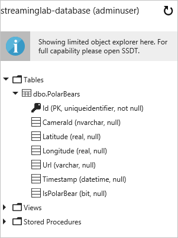

	_The database's "PolarBears" table_

Note the column named "IsPolarBear," which will be set to 1 or 0 to indicate that the corresponding images does or does not contain a polar bear.  

<a name="Exercise4"></a>
## Exercise 4: Modify the Azure Function ##

In this exercise, you will modify the Azure Function that you created in the previous lab to call the Custom Vision Service and determine the likelihood that an image that *might* contain a polar bear *does* contain a polar bear, and to write the output to the Azure SQL database that you created in the previous exercise.

1. Open the Azure Function App that you created in the previous lab in the Azure Portal. Click **Platform features** to open the "Platform features" tab, and then click **Console**.

	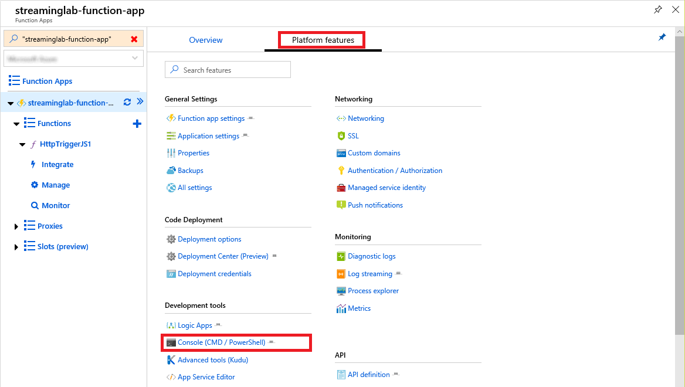

	_Opening a function console_

1. Execute the following commands in the function console to install the NPM [request](https://www.npmjs.com/package/request) package, the NPM [tedious](https://www.npmjs.com/package/tedious) package, and the [Azure Storage SDK for Node.js](https://www.npmjs.com/package/azure-storage) so your function can use them, and ignore any warning messages that are displayed.

	```
	npm install request
	npm install tedious
	npm install azure-storage
	```

	> Azure Functions written in JavaScript execute in a Node.js environment. The function console gives you access to that environment and lets you install NPM packages the same as you would in a local environment.

1. Open the Azure Function contained in the Function App. Replace the function code with the following code:

	```javascript
	module.exports = function (context, req) {
	    var predictionUrl = 'PREDICTION_URL';
	    var predictionKey = 'PREDICTION_KEY';
	    var storageAccountName = 'ACCOUNT_NAME';
	    var storageAccountKey = 'ACCOUNT_KEY';
	    var databaseServer = 'SERVER_NAME.database.windows.net';
	    var databaseName = 'DATABASE_NAME';
	    var databaseUsername = 'ADMIN_USERNAME';
	    var databasePassword = 'ADMIN_PASSWORD';

	    // Parse input
	    var input = JSON.parse(req.rawBody)[0];
	    var id = input.deviceid;
	    var latitude = input.latitude;
	    var longitude = input.longitude;
	    var url = input.url;
	    var blobName = url.substr(url.lastIndexOf('/') + 1);
	    var timestamp = input.timestamp;
	
	    // Generate a SAS
	    var azure = require('azure-storage');
	    var blobService = azure.createBlobService(storageAccountName, storageAccountKey);
	
	    var now = new Date();
	    var expiry = new Date(now).setMinutes(now.getMinutes() + 3);
	
	    var policy = {
	        AccessPolicy: {
	            Permissions: azure.BlobUtilities.SharedAccessPermissions.READ,
	            Start: now,
	            Expiry: expiry
	        },
	    };
	
	    var sas = blobService.generateSharedAccessSignature('photos', blobName, policy);
	
	    // Call the Custom Vision Service
	    const options = {
	        url: predictionUrl,
	        method: 'POST',
	        headers: {
	            'Prediction-Key': predictionKey
	        },
	        body: {
	            'Url': url + '?' + sas
	        },
	        json: true
	    };
	
	    var request = require('request');
	
	    request(options, (err, res, body) => {
	        if (err) {
	            context.log(err);
	            context.done();
	        }
	        else {
	            var probability =  body.predictions.find(p => p.tagName.toLowerCase() === 'polar bear').probability;          
	            var isPolarBear = probability > 0.8; // 80% threshhold
	
	            // Update the database
	            var Connection = require('tedious').Connection;
	            var Request = require('tedious').Request;
	        
	            var config = 
	            {
	                authentication:
	                {
	                    type: 'default',
	                    options:
	                    {
	                        userName: databaseUsername,
	                        password: databasePassword
	                    }
	                },
	                server: databaseServer,
	                options: 
	                {
	                    database: databaseName,
	                    encrypt: true
	                }
	            }
	            
	            var connection = new Connection(config);
	
	            connection.on('connect', (err) => {
	                if (err) {
	                    context.log(err)
	                    context.done();
	                }
	                else {
	                    var query = "INSERT INTO dbo.PolarBears (CameraID, Latitude, Longitude, URL, Timestamp, IsPolarBear) " +
	                        "VALUES ('" + id + "', " + latitude + ", " + longitude + ", '" + url + "', '" + timestamp + "', " + (isPolarBear ? "1" : "0") + ")";
	
	                    dbRequest = new Request(query, err => {
	                        if (err) {
	                            context.log(err);
	                            context.done();
	                        }
	                    });
	
	                    dbRequest.on('error', err => {
	                        context.log(err);
	                        context.done();
	                    });
	
	                    dbRequest.on('requestCompleted', () => {
	                        context.done();
	                    });
	
	                    connection.execSql(dbRequest);
	                }
	            });
	        }
	    });
	};
	```

	The modified function uses NPM [request](https://www.npmjs.com/package/request) to call the Custom Vision Service, passing the URL of the image to be analyzed. It parses the results and retrieves the value indicating the probability that the image contains a polar bear. Then it uses NPM [tedious](https://www.npmjs.com/package/tedious) to write a record to the database. That record contains the camera ID, the latitude and longitude of the camera, the image URL, a timestamp indicating when the picture was taken, and an ```IsPolarBar``` value indicating whether the image contains a polar bear. The threshhold for determining whether an image contains a polar bear is 80%:

	```javascript
	var isPolarBear = probability > 0.8; // 80% threshhold
	```

	Another notable aspect of this code is its use of a [shared-access signature](https://docs.microsoft.com/en-us/azure/storage/common/storage-dotnet-shared-access-signature-part-1), or SAS. The "photos" container that you created in Lab 1 is private. To access the blobs stored there, you must have access to the storage account or have the storage account's access key. Shared-access signatures allow anonymous users to access individual blobs, but only for a specified length of time and optionally with read-only access.

	The code that you just added uses the Azure Storage SDK for Node.js ([azure-storage](https://www.npmjs.com/package/azure-storage)) to generate a read-only SAS for the blob that is passed to the Custom Vision Service, and appends it to the blob URL as a query string. The SAS is valid for 3 minutes and allows read access only. This allows your code to submit private blobs to the Custom Vision Service for analysis without putting the blobs in a public container where anyone could download them.

1. Replace the following placeholders in the function code with the values below. Then save your changes.

	- Replace PREDICTION_URL on line 2 with the prediction URL you saved in Exercise 2
	- Replace PREDICTION_KEY on line 3 with the prediction key you saved in Exercise 2
	- Replace ACCOUNT_NAME on line 4 with the name of the storage account you created in [Part 1](../1%20-%20Ingest)
	- Replace ACCOUNT_KEY on line 5 with the storage account's access key
	- Replace SERVER_NAME on line 6 with the name you assigned to the database server in Exercise 3
	- Replace DATABASE_NAME on line 7 with the name you assigned to the database
	- Replace ADMIN_USERNAME on line 8 with the database user name you specified
	- Replace ADMIN_PASSWORD on line 9 with the database password you specified

1. Use the Azure Portal to start the Stream Analytics job.

1. Once the Stream Analytics job is running, open a Command Prompt or terminal window, ```cd``` to the project directory, and start the camera array running with the following command:

	```
	node run.js
	```

1. **Let the camera array and the Stream Analytics job run for 3 to 5 minutes**. Then stop the Stream Analytics job and stop **run.js**.

1. Return to the database in the Azure Portal and use the query editor to execute the following query:

	```sql
	SELECT * FROM dbo.PolarBears
	```

1. Confirm that the table contains a few rows representing images that were submitted to the Custom Vision Service for analysis. Look at the "IsPolarBear" column in each row. How many of the images that were analyzed contain a polar bear?

	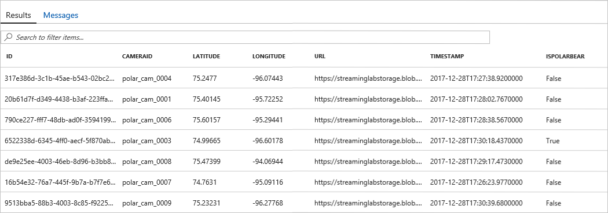

	_Rows written to the database by the Azure Function_

In the next lab, you will use Power BI to produce a more compelling — and graphical — visualization of the data.

<a name="Summary"></a>
## Summary ##

In this lab, you used the Custom Vision Service to train an image-classification model that can differentiate between different types of Arctic wildlife. Then you modified the Azure Function you wrote in the previous lab to call the model and write the results to an Azure SQL database.You may now proceed to the final lab in this series — [Processing IoT Data in Real Time Using Stream Analytics and Machine Learning, Part 4](../4%20-%20Visualize) — to apply the finishing touches by building a live dashboard that shows where polar bears are being spotted in the wild.

---

Copyright 2018 Microsoft Corporation. All rights reserved. Except where otherwise noted, these materials are licensed under the terms of the MIT License. You may use them according to the license as is most appropriate for your project. The terms of this license can be found at https://opensource.org/licenses/MIT.
