The goal of business intelligence is being able to quickly identify and respond to ever-changing trends in business and industry. Whether you’re a data analyst delivering reports and analytics to your organization or a stakeholder or decision-maker in need of critical insights, Power BI can organize and unify all of your organization's data to provide a clear view of the world around you.

[Microsoft Power BI](https://powerbi.microsoft.com) was created to address the data explosion in commercial and academic organizations, the need to analyze that data, and the need for rich, interactive visuals to represent the data and reveal key insights. It contains a suite of tools that assist in data analysis, from data discovery and collection to data transformation, aggregation, sharing, and collaboration. Moreover, it allows you to create rich visualizations and package them in interactive dashboards.

In this lab, the fourth of four in a series, you will connect Microsoft Power BI to the Azure SQL database you created in the previous lab to capture information emanating from the virtual camera array you deployed in the Arctic. Then you will use Power BI to build a report that shows in near real-time where polar bears are being spotted.


<a name="Objectives"></a>
### Objectives ###

In this hands-on lab, you will learn how to:

- Connect Power BI to an Azure SQL database
- Use Power BI to visualize data written to the database
- Create a report that can be shared with colleagues

<a name="Prerequisites"></a>
### Prerequisites ###

The following are required to complete this hands-on lab:

- An active Microsoft work/school or organizational account
- An active Microsoft Power BI subscription. If you don't have one, [sign up for a free trial](https://app.powerbi.com/signupredirect?pbi_source=web).
- [Power BI Desktop](https://powerbi.microsoft.com/en-us/desktop/) (Requires Windows)

If you haven't completed the [previous lab in this series](../3%20-%20Predict), you must do so before starting this lab.

<a name="Exercises"></a>
## Exercises ##

This hands-on lab includes the following exercises:

- [Exercise 1: Connect Power BI to Azure SQL](#Exercise1)
- [Exercise 2: Build a report in Power BI](#Exercise2)
- [Exercise 3: Run the end-to-end solution](#Exercise3)
 
Estimated time to complete this lab: **30** minutes.

<a name="Exercise1"></a>
## Exercise 1: Connect Power BI to Azure SQL ##

In the previous lab, you used the [Custom Vision Service](https://azure.microsoft.com/services/cognitive-services/custom-vision-service/) to train an image-classification model to differentiate between different types of Arctic wildlife, and modified the Azure Function you wrote to output the results to an Azure SQL database. The first step in using Microsoft Power BI to explore and visualize this data is connecting it to Power BI as a data source. In this exercise, you will create a report in [Power BI Desktop](https://powerbi.microsoft.com/en-us/desktop/) and connect to the Azure SQL database.

1. If Power BI Desktop isn't already installed on your computer, go to https://powerbi.microsoft.com/en-us/desktop/ and install it now.

1. Start Power BI Desktop. If you are asked to sign in, do so using your work/school or organizational account.

	> There are two types of Microsoft accounts: personal Microsoft accounts and work/school accounts, also known as organizational accounts. Power BI accepts the latter but not the former. If you have an Office 365 subscription, it uses your work/school account. You can have a work/school account without having an Office 365 subscription, however. For an explanation of the differences between personal Microsoft accounts and work/school accounts, see [Understanding Microsoft Work And Personal Accounts](http://www.brucebnews.com/2016/06/finding-your-way-through-microsofts-maze-of-work-and-personal-accounts/).

1. Click **Get Data** in the ribbon at the top of the window. Then select **Azure SQL database** from the list of data sources and click the **Connect** button.

    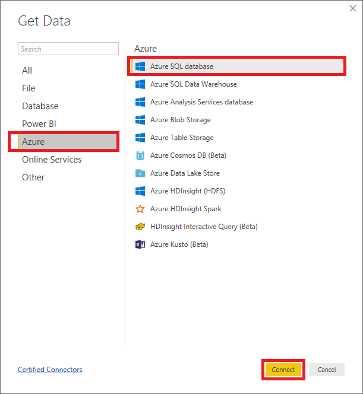

    _Adding a data source_

1. Enter the server's host name (the server name you specified in the previous lab plus ".database.windows.net" since it's an Azure SQL database server) and the database name. Select **DirectQuery**, and click **Advanced options**. Then type the query below into the "SQL statement" box to select the 20 most recently added rows in the "PolarBears" table. This is the query that the report will use to pull information from the database. When you're done, click **OK**. Then click the **Load** button in the ensuing dialog.

	```sql
	SELECT TOP 20 Id, CameraId, Latitude, Longitude, Url, Timestamp, FORMAT(Timestamp,'MM/dd/yyyy h:mm:ss tt') AS TimestampLabel, IsPolarBear FROM dbo.PolarBears ORDER BY Timestamp DESC
	```
    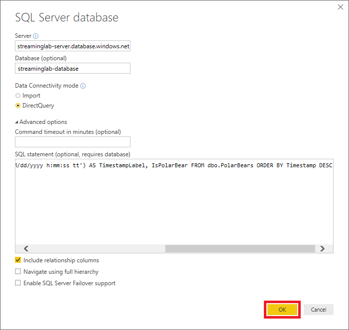

    _Connecting to a database_

1. If prompted, enter the user name and password you specified when you created the database server, and select the database from the drop-down list labeled "Select which level." Then click **Connect**.

    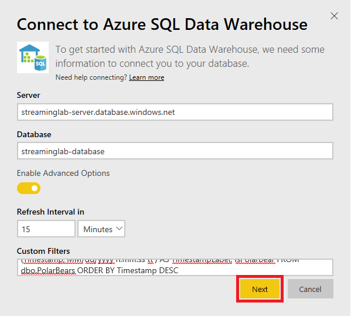

    _Entering admin credentials_

After a short delay, Power BI will connect to the database and import a dataset using the query you provided. The next step is to create a report using that dataset.

<a name="Exercise2"></a>
## Exercise 2: Build a report in Power BI ##

Visualizations (or simply "visuals") are the primary element that make up Power BI reports. In this exercise, you will use the Power BI report designer to create visuals from the database you connected to in the previous exercise, adjust filters and aggregates to refine the way the data is displayed, and format the visuals to produce compelling output.

1. Click the **Map** icon in the "Visualizations" panel to add a map visual to the report.
	
	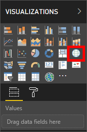

	_Adding a map visual_

1. Check the **Latitude** and **Longitude** boxes in the "Fields" panel to include these fields in the visual.
	
	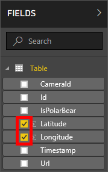

	_Adding latitude and longitude_

1. In the "Visualizations" panel, click the down arrow next to **Average of Latitude** and select **Don't summarize** from the menu. Then do the same for **Average of Longitude**.

	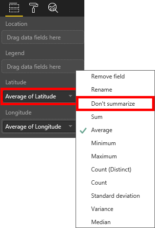

	_Removing summary calculations_

1. Return to the "Fields" panel and check the **IsPolarBear** box to add that field to the map. Then resize the map so that it looks something like this:

	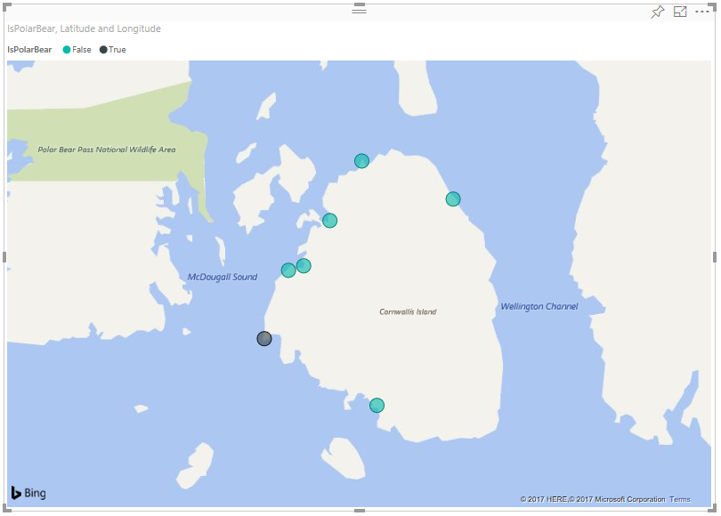

	_Resizing the map_

	Note that the number and location of the "bubbles" in your map will probably be different than what's shown here.

1. Click in the empty area outside the map to deselect it. Then check the **CameraId**, **IsPolarBear**, and **TimestampLabel** boxes in the "Fields" panel to add a table visual containing those columns to the report.

	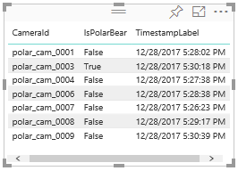

	_Adding a table visual_

1. Deselect the table visual. Then check **IsPolarBear** and **Latitude** in the "Fields" panel to add another table visual, and click the **Pie Chart** icon in the "Visualizations" panel to convert the table into a pie chart. 

	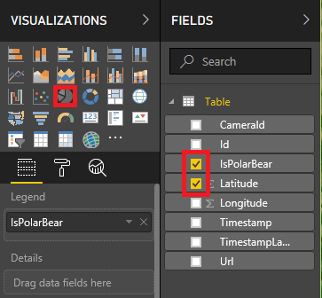

	_Adding a pie-chart visual_

1. Click the down arrow next to **Average of Latitude** and select **Count** from the menu to configure the pie chart to show a count of sightings and the proportion of sightings in which polar bears were detected. 

	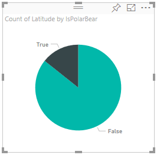

	_Refining the pie-chart visual_

1. Deselect the pie-chart visual and click the **Slicer** icon to add a slicer to the report. Slicers provide a convenient means for filtering information in a Power BI report by narrowing the data shown in other visuals.

	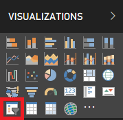

	_Adding a slicer_

1. Select the **IsPolarBear** field in the "Fields" panel so the slicer shows checkboxes labeled "True" and "False." 

	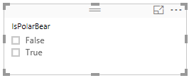

	_Refining the slicer_

1. Now resize and reposition the visuals to achieve a layout similar to this:

	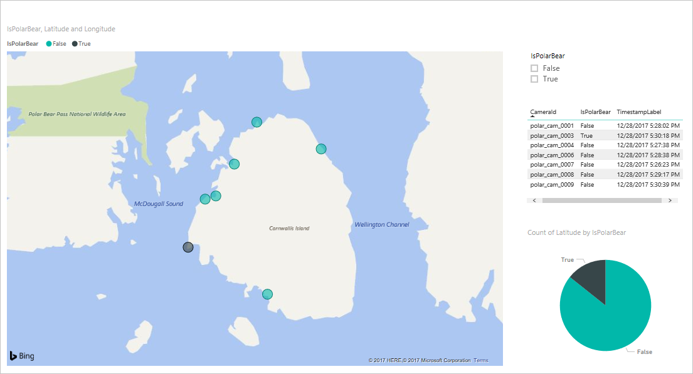

	_Adjusting the layout_

1. With the report structure in place, the next task is to use some of Power BI's rich formatting options to embellish the visuals. Start by selecting the map visual in the report designer. Then click the **Format** icon in the "Visualizations" panel.

	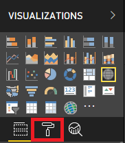

	_Formatting the map visual_

1. Use the formatting controls in the "Visualizations" panel to make the following changes to the map visual:

	- Under "Legend," set "Legend Name" to "Polar bear sighted?"
	- Under "Data colors," set the color for False to 00FF00 (pure green) and the color for True to FF0000 (pure red)
	- Under "Bubbles," set  the bubble size to 30%
	- Under "Map styles," set the theme to "Aerial"
	- Turn "Title" from on to off

	Confirm that the resulting map looks something like this:

	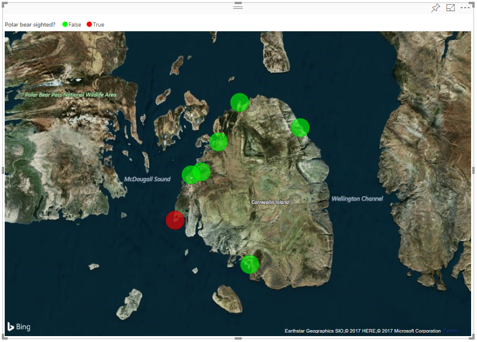

	_Formatted map visual_

1. Select the pie-chart visual and use the formatting controls in the "Visualizations" panel to make the following changes:

	- Under "Data colors," set False to 00FF00 and True to FF0000
	- Under "Detail  labels," change the label style to "Data value, percent of total"
	- Under "Title," change the title text to "Proportion of polar bear sightings"

	Confirm that the resulting pie-chart visual resembles this:

	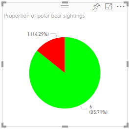

	_Formatted pie-chart visual_

1. Select the table visual and use the formatting controls in the "Visualizations" panel to make the following changes:

	- Under "Style," change the table style to "Alternating rows"
	- Turn "Title" on, and change the title text to "Camera activity" 

	Confirm that the resulting table looks like this:

	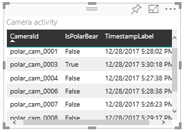

	_Formatted table visual_

1. Select the slicer visual and use the formatting controls in the "Visualizations" panel to make the following changes:

	- Under "Selection Controls," set "Single Select" to off
	- Turn "Visual Header" off
	- Turn "Title" on and set the title text to "Show sightings that are:"

1. Double-click **Page 1** in the bottom-left corner of the designer and change the report title to "Polar Bear Activity."

1. Use the **File -> Save** command to save the report.

The formatted report should resemble the one below. Feel free to embellish it further. You could, for example, add a title in a large font at the top of the report. Once you're satisfied with the layout and content, it's time to put it to work using a live data source.

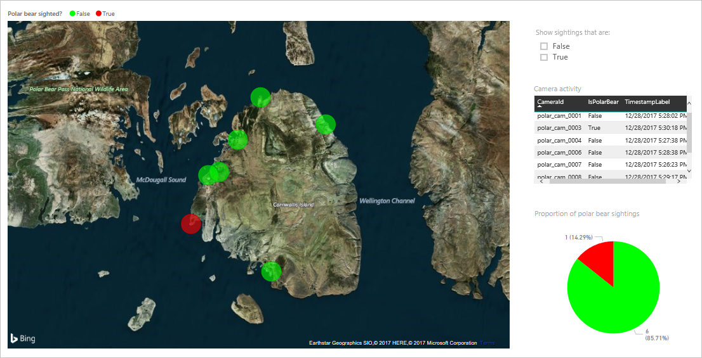

_The formatted report_

<a name="Exercise3"></a>
## Exercise 3: Run the end-to-end solution ##

Now that the report is prepared in Power BI, your final task is to run the end-to-end solution that you built in this series of hands-on labs and check for polar bears!

1. Open the database that you created in [Part 3](../3%20-%20Predict) in the [Azure Portal](https://portal.azure.com) and use the query editor to execute the following query and delete all rows from the "PolarBears" table:

	```sql
	DELETE FROM dbo.PolarBears
	```

1. Open the Stream Analytics job that you created in [Part 2](../2%20-%20Process) in the Azure Portal and start the job running.

1. Wait until the Stream Analytics job is running. Then open a Command Prompt or terminal window and ```cd``` to the project directory you created in [Part 1](../1%20-%20Ingest). Use the following command to start the virtual cameras running:

	```
	node run.js
	```

1. Return to Power BI Desktop and click **Refresh** in the ribbon at the top of the window. Click it again every 15 seconds or so. The report will refresh automatically every 15 minutes or so, but you can refresh it manually as often as you would like to update the visuals. 

1. Confirm that red and green bubbles appear at various locations around the island. Red bubbles indicate the presence of polar bears, while green bubbles represent locations where photos were taken but no polar bears were detected. Locations that have a mixture of sightings will show red *and* green, as pictured below.

	

	_There be polar bears!_

1. Suppose you *only* wanted to show locations where polar bears were detected. Check the **True** box in the slicer visual. What happens in the map?

1. Continue running for a few minutes and refreshing the report once or twice a minute. Confirm that there are polar bears active on the island!

1. When you're satisfied that the solution is working as intended, stop the cameras and stop the Stream Analytics job.

You now have a report that shows, in near real-time, polar-bear activity on the island. If you have a [Power BI Pro or Power BI Premium](https://powerbi.microsoft.com/blog/power-bi-pro-power-bi-premium-flexibility-to-choose-the-licensing-best-for-you-and-your-organization/) account, you can share the report with other Power BI users so they, too, can monitor polar-bear activity. For more information about sharing your work, see [Share Power BI Dashboards and Reports](https://docs.microsoft.com/en-us/power-bi/service-how-to-collaborate-distribute-dashboards-reports "Share Power BI Dashboards and Reports"). Reports can also be viewed in the [Power BI mobile apps](https://docs.microsoft.com/power-bi/mobile-apps-for-mobile-devices) so you can keep track of polar bears on your Windows, Android, or iOS device — even on an Apple watch!

<a name="Summary"></a>
## Summary ##

In a series of four hands-on labs, you built a solution that feeds data from a simulated array of cameras into an [Azure IoT hub](https://azure.microsoft.com/services/iot-hub/), uploads photographs to [Azure Storage](https://azure.microsoft.com/services/storage/?v=16.50), processes the data using [Azure Stream Analytics](https://azure.microsoft.com/services/stream-analytics/), analyzes the photographs using the [Custom Vision Service](https://azure.microsoft.com/services/cognitive-services/custom-vision-service/), and visualizes the output using [Microsoft Power BI](https://powerbi.microsoft.com/). You also got first-hand experience using [Azure Functions](https://azure.microsoft.com/services/functions/) and [Azure SQL Database](https://azure.microsoft.com/services/sql-database/). It's a sophisticated solution, and one that has applications in the real world.

Once you're finished using the solution, you should delete all the Azure services you deployed so they no longer charge to your subscription. To delete them, simply go to the Azure Portal and delete the "streaminglab-rg" resource group. That's one of the many benefits of using resource groups: one simple action deletes the resource group and everything inside it. Once deleted, a resource group cannot be recovered, so make sure you're finished with it before deleting it.

---

Copyright 2018 Microsoft Corporation. All rights reserved. Except where otherwise noted, these materials are licensed under the terms of the MIT License. You may use them according to the license as is most appropriate for your project. The terms of this license can be found at https://opensource.org/licenses/MIT.
