<a name="HOLTitle"></a>
# Deploying a Cognitive Services Web Site to Azure via GitHub #

How easy is it to build a Web site, store it in GitHub, and deploy it to Azure? What if it's not just a static Web site, but a dynamic, data-driven Web site that runs on Node.js and uses Artificial Intelligence (AI) to process user input? It's easier than you might think, thanks to [Azure Web Apps](https://azure.microsoft.com/en-us/documentation/articles/app-service-web-overview/), which provides a robust platform for Web apps of all types and features built-in [GitHub](https://github.com/) support; [Visual Studio Code](https://code.visualstudio.com/), a free and cross-platform source-code editor that includes GitHub support of its own; and Azure Cognitive Services' [Text Analytics API](https://azure.microsoft.com/services/cognitive-services/text-analytics/), which exposes [REST](https://en.wikipedia.org/wiki/Representational_state_transfer) methods backed by AI and machine learning for extracting insights from text.

In this lab, you will create an Azure Web App and use Visual Studio Code to deploy to it the "Classrates" site pictured below for rating college classes. Rather than enter ratings directly, you will enter comments, and the site will use the Text Analytics API to analyze comments for sentiment and rate the classes accordingly. You will also leverage the GitHub support in Azure and Visual Studio Code to enact source control and publish to Azure directly from GitHub. And you will accomplish all of this in under 30 minutes.

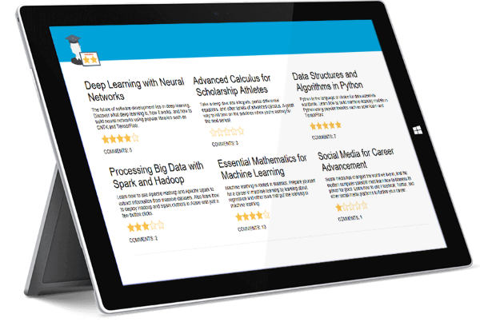

Sound like fun? Then let's get started!

<a name="Prerequisites"></a>
### Prerequisites ###

The following are required to complete this hands-on lab:

- An active Microsoft Azure subscription. If you don't have one, [sign up for a free trial](http://aka.ms/WATK-FreeTrial).
- An active [GitHub](https://github.com/) account. If you don't have one, [sign up for free](https://github.com/join).
- [Git](https://git-scm.com) for Windows, macOS, or Linux
- [Visual Studio Code](http://code.visualstudio.com)
- [Node.js](https://nodejs.org)

<a name="Cost"></a>
### Cost ###


The cost of this lab is **moderate**. For an overview of cost ratings, refer to [Explanation of Costs](../../Costs.md).

<a name="Exercises"></a>
## Exercises ##

This hands-on lab includes the following exercises:

- [Exercise 1: Get a Text Analytics API key](#Exercise1)
- [Exercise 2: Fork the repo and run Classrates locally](#Exercise2)
- [Exercise 3: Create an Azure Web App](#Exercise3)
- [Exercise 4: Deploy the modified Classrates site to Azure](#Exercise4)
- [Exercise 5: Delete the resource group](#Exercise5)

Estimated time to complete this lab: **30** minutes.

<a name="Exercise1"></a>
## Exercise 1: Get a Text Analytics API key ##

The Classrates site that you are going to build uses Cognitive Services' [Text Analytics API](https://azure.microsoft.com/services/cognitive-services/text-analytics/) to analyze sentiment in the comments that students enter. The Text Analytics API takes text as input and returns a value from 0 to 1 quantifying the sentiment expressed in that text. The higher the score, the more favorable the sentiment. A comment such as "The most awesome class I've ever taken!" will score very high, while "Wouldn't wish this class on my worst enemy" will score low.

In order to call the Text Analytics API, you need an endpoint URL and an API key. In this exercise, you will create a Text Analytics resource in the Azure Portal and then retrieve an endpoint URL and API key.

1. Open the [Azure Portal](https://portal.azure.com) in your browser. If you are asked to sign in, do so using your Microsoft account.

1. In the Azure Portal, click **+ Create a resource**, followed by **AI + Machine Learning** and **Text Analytics**.

    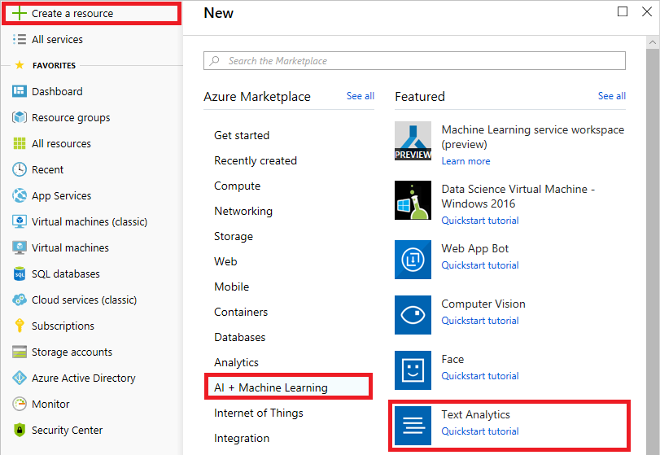

    _Creating a Text Analytics resource_

1. Enter "text-analytics-api" as the resource name and select the location nearest you. Select **F0** as the pricing tier, and then click **Create new** and create a new resource group named "classrates-rg" to hold the Text Analytics resource and other resources created in this lab. Then click the **Create** button.

    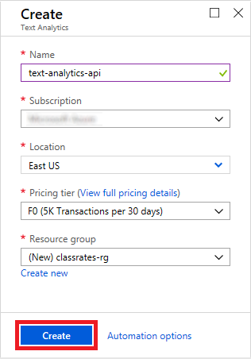

    _Creating a Text Analytics resource_

1. Click **Resource groups** in the menu on the left side of the portal to display a list of resource groups. Then click the "classrates-rg" resource group.

	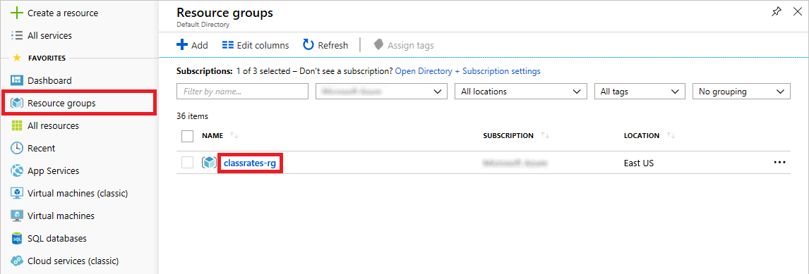

	_Opening the resource group_

1. Wait until the deployment has completed. (You can click **Refresh** at the top of the blade to refresh the deployment status.) Then click the Text Analytics resource to open it.

	

	_Opening the Text Analytics resource_

1. Click **Overview** in the menu on the left side of the blade. Then hover over the endpoint URL and click the **Copy** button that appears to its right to copy the endpoint URL to the clipboard. Paste the URL into your favorite text editor so you can easily retrieve it later.

	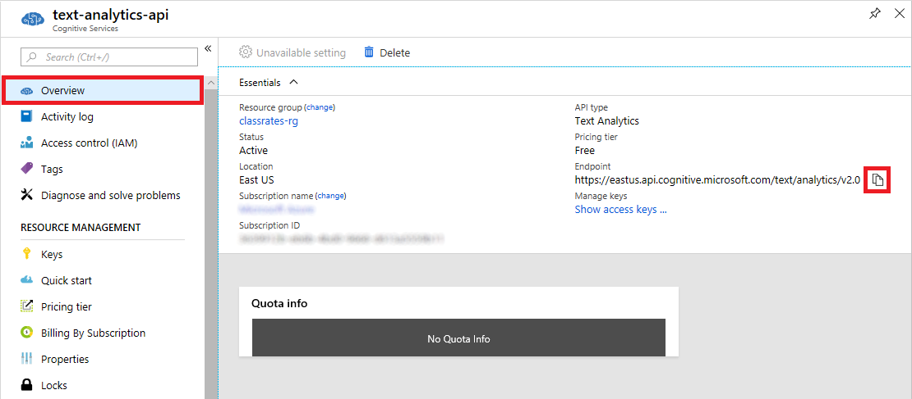

	_Copying the endpoint URL_

1. Click **Keys** in the menu on the left side of the blade. Then click the **Copy** button to copy the first key to the clipboard. Paste the key into a text editor so you can easily retrieve it later, too.

	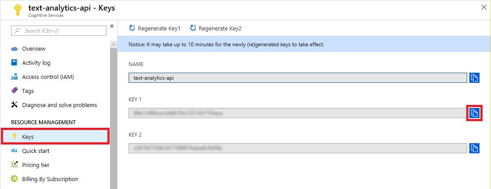

	_Copying the API key_

The endpoint URL is the base URL to which calls to the Text Analytics API are placed — "base" because "/sentiment" must be appended to the URL to score text for sentiment. The API key travels in an HTTP header in each request. Without a valid API key, the Text Analytics API fails requests placed to it. It is the API's way of ensuring that the caller is authorized.

<a name="Exercise2"></a>
## Exercise 2: Fork the repo and run Classrates locally ##

[Visual Studio Code](http://code.visualstudio.com) is a free, lightweight, and powerful source-code editor available for Windows, macOS, and Linux. In this exercise, you will fork a GitHub repository containing the source code for Classrates into a repo of your own. Then you will clone the repo to create a copy on your PC, open it in Visual Studio Code, add the endpoint and API key you retrieved in the previous exercise, and test the Classrates Web site locally.

1. If [Git](https://git-scm.com/) isn't installed on your PC, go to https://git-scm.com/downloads and install the Git client for your operating system. Git is a free and open-source distributed version-control system, and it integrates seamlessly into Visual Studio Code. If you aren't sure whether Git is installed, open a Command Prompt or terminal window and execute the following command:

	```	
	git --version
	```

	If a version number is displayed, then the Git client is installed.

1. If you don't already have a GitHub account, go to https://github.com/join and create one.

1. Go to the [Classrates repo on GitHub](https://github.com/Wintellect/Classrates) and log in if you aren't already logged in. Then click **Fork** to fork the repo and create a copy of it in your own GitHub account.

	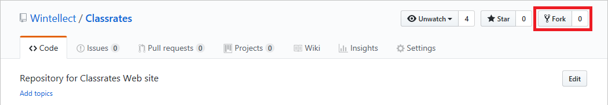

	_Forking the Classrates repo_

1. With the forked repo open in your browser, click **Clone or download**, and then click the **Copy** button to copy the repo's Git URL to the clipboard.

	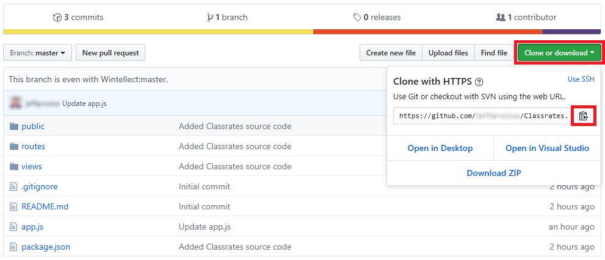

	_Copying the Git URL_

1. Open a Command Prompt or terminal window and use a ```cd``` command to navigate to the directory on your hard disk that you want to clone the Classrates repo into. Cloning will create a directory named "Classrates," so simply ```cd``` to the directory where you want the "Classrates" directory to be created.

1. Execute the following command in the Command Prompt or terminal window to clone Classrates on your PC, substituting the URL copied to the clipboard in Step 4 for URL.

	```
	git clone URL
	```

	When the command has completed, confirm that a directory named "Classrates" was created in the current directory. This is the local repo containing the Classrates source code.

1. If Node.js isn't installed on your PC, go to https://nodejs.org/ and install the latest LTS version. You can determine whether Node is installed by opening a Command Prompt or terminal window and typing the following command:

	```
	node --version
	```

	If Node is installed, the version number will be displayed.

1. If Visual Studio Code isn't installed on your PC, go to https://code.visualstudio.com/ and install it now.

1. Start Visual Studio Code and use the **File** > **Open Folder...** command to open the "Classrates" directory containing the cloned repo — the directory that was created by the ```git``` command in Step 6. On MacOS use the **File** > **Open...** command.

1. Select **Terminal** from Visual Studio Code's **View** menu to open an integrated terminal. Then execute the following command in the integrated terminal to install [Bootstrap](https://www.npmjs.com/package/bootstrap), [Express](https://www.npmjs.com/package/express), and other packages that Classrates requires:

	```
	npm install
	```

1. Use the EXPLORER panel in Visual Studio code to open the file named **functions.js** located in the project's "public/scripts" folder. Replace TEXT_ANALYTICS_API_KEY on line 3 with the API key you retrieved in the previous exercise, and replace TEXT_ANALYTICS_ENDPOINT on line 4 with the endpoint URL you retrieved in the same exercise. Then save the file.

	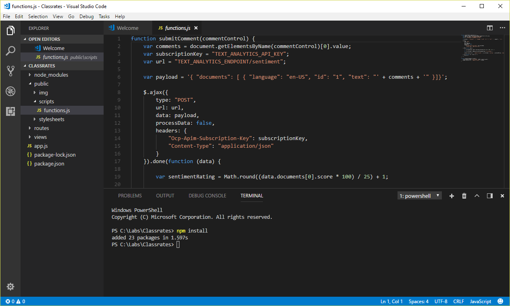

	_Editing functions.js_

1. Execute the following command in Visual Studio Code's integrated terminal to start the Web app:

	```
	npm start
	```

1. Open a browser to http://localhost:3000 and confirm that the Classrates home page appears:

	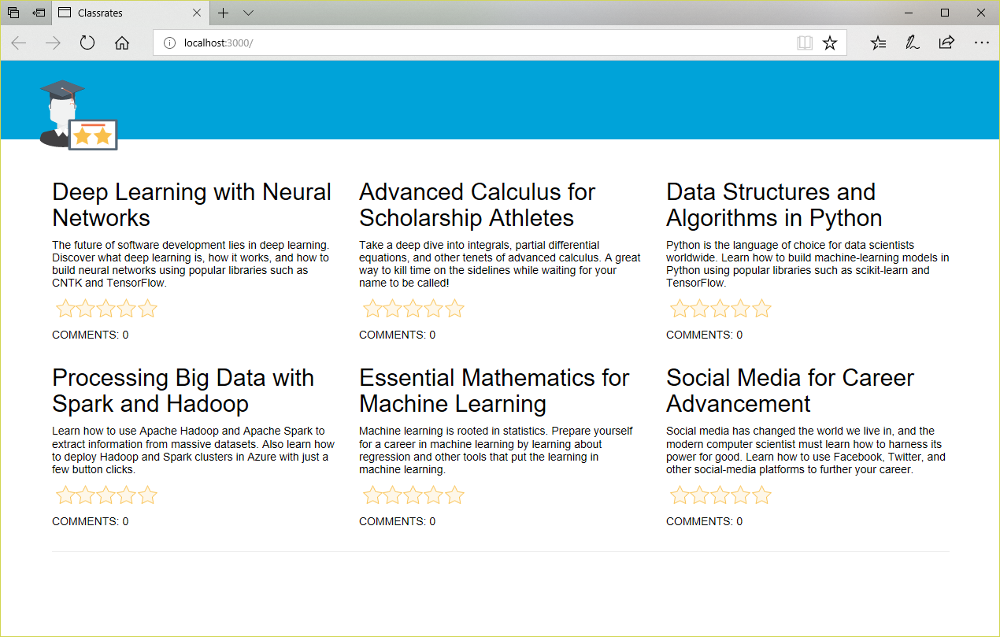

    _The Classrates Web site_ 

1. Click **Deep Learning with Neural Networks** to go to the comments page for that class. Enter a comment and click the **Submit Comment** button. How does this comment rate on a scale of one to five stars?

	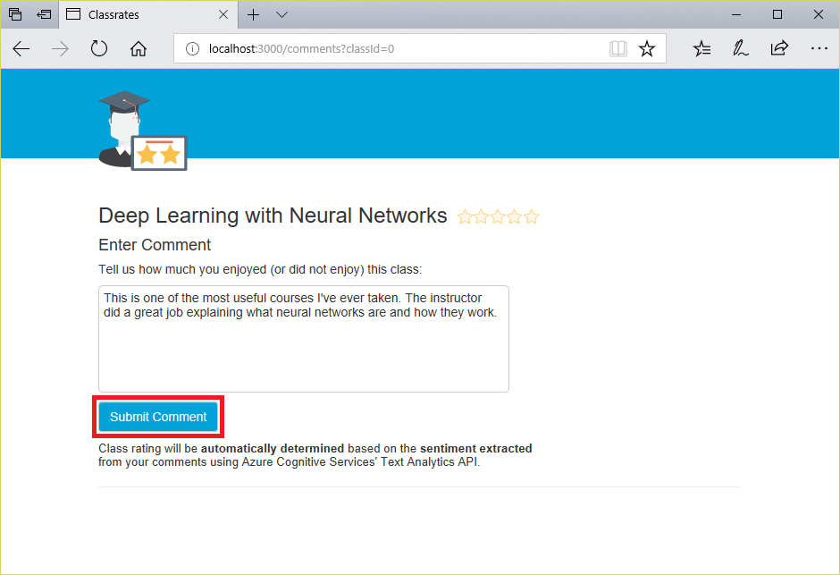

    _Entering a comment_ 

1. Enter additional comments for this class. Observe how the individual comments are rated, and how each new comment affects the overall rating for the class.

Play around with the Web site and familiarize yourself with how it works. Feel free to poke around the source code, too — particularly the **functions.js** file, which houses the code that submits comments to the Text Analytics API and parses the JSON that comes back for the results of the sentiment analysis. The next step is to deploy the site to Azure so others can enjoy it as well. But first, you need to create an Azure Web App to host it. 

<a name="Exercise3"></a>
## Exercise 3: Create an Azure Web App ##

In this exercise, you will use the [Azure Portal](https://portal.azure.com) to create an Azure Web App and connect it to the Classrates repo that was created for you in GitHub when you forked the master repo. With this connection established, pushing changes from the local repo to the GitHub repo will automatically publish those changes to Azure — a process known as [continuous integration](https://en.wikipedia.org/wiki/Continuous_integration).

1. In the portal, click **+ Create a resource**, followed by **Web** and **Web App**. Be careful not to click on the _Quickstart tutorial_ link as this will navigate you to the docs to work through a tutorial.

    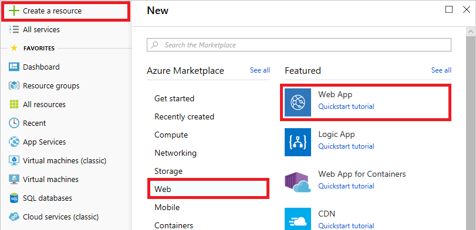

    _Creating an Azure Web App_

1. Enter a name for the Web App. The name must be unique across Azure, so you will probably have to use something other than "classrates." Place the Web App in the "classrates-rg" resource group you created in [Exercise 1](#Exercise1), and select the operating system on which you want the Web App to run. (Either Windows or Linux is fine.)

	Click **App Service plan/Location** and create a new service plan in the same region you selected for the Text Analytics resource in Exercise 1 and that uses an inexpensive pricing tier — for example, the B1 tier available under Dev/Test, which is free for 30 days if you deploy the Web App on Linux. Select **Node.js 8.11** or higher as the runtime stack. Then click the **Create** button at the bottom of the blade.

	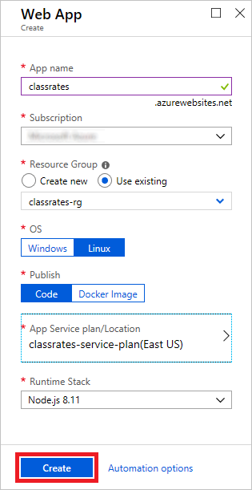

	_Creating an Azure Web App_

1. Go to the "classrates-rg" resource group in the Azure Portal and wait for the deployment to finish. Then open the Web App.

	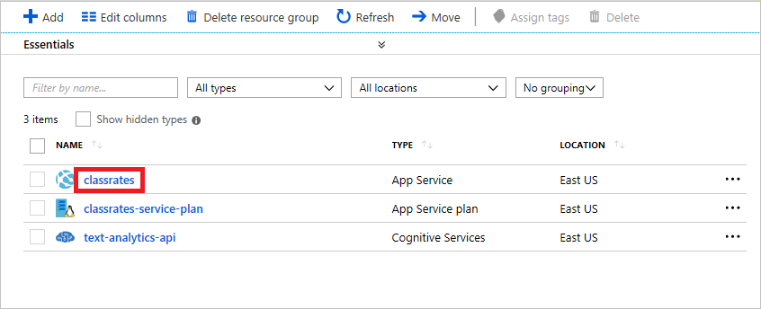

	_Opening the Web App_

1. Click **Deployment Center** in the menu on the left side of the blade for the Azure Web App. Select **GitHub**, then click the **Authorize** button.

	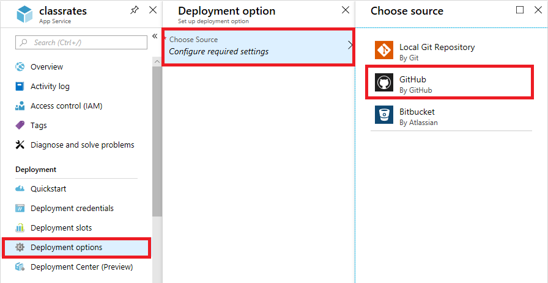

	_Authorizing GitHub as the deployment source_

1. Follow the on-screen instructions to authorize Azure to access your GitHub account. Once authorized you will see your GitHub user name in the GitHub option. If you still see "Not Authorized" you may need to refresh your browser window. Select **GitHub**, then click the **Continue** button.

	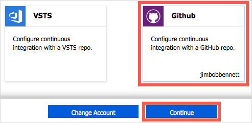

	_Selecting the deployment source_

1. Select **App Service Kudu build server** as the build provider and click the **Continue** button.
   
	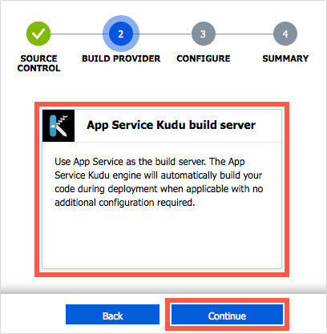

	_Selecting the build provider_

1. Select the Classrates repository, make sure **Branch** is set to "master," and then click **Continue**.

	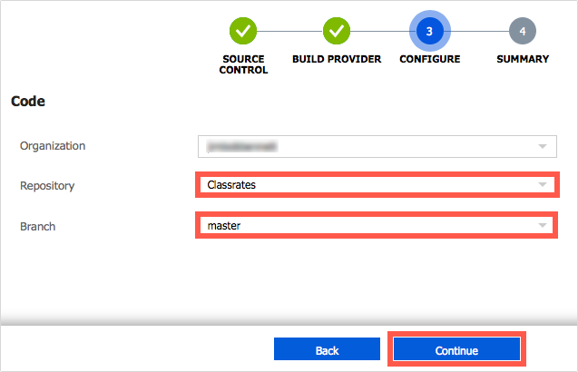

	_Specifying the repository and branch_

1. Check the deployment details and click **Finish**.

	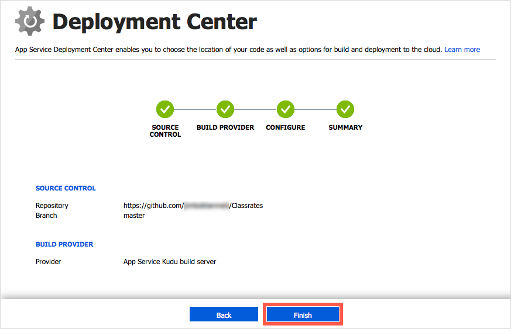
	_Confirming the deployment details_

With the Azure Web App created and configured to use a GitHub repo as a deployment source, the next step is to commit the changes you made to Classrates in Visual Studio Code and push the changes to GitHub.

<a name="Exercise4"></a>
## Exercise 4: Deploy the modified Classrates site to Azure ##

In this exercise, you will use Visual Studio Code to push the modified version of Classrates to GitHub. Then you will open the Web site (the Web version, not the local version) in your browser and confirm that the changes propagated to Azure.

1. Return to Visual Studio Code and click the **Source Control** button in the activity bar. Type "First commit" into the text box, and then click the check mark to commit your changes.

    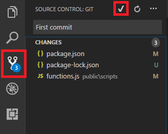

    _Committing changes to Classrates_ 

1. Click the ellipsis (the three dots) to the right of the check mark at the top of the SOURCE CONTROL panel and select **Publish Branch** from the menu to publish Classrates to Azure. When prompted, type in your GitHub user name and password.

	> If you have two-factor authentication enabled in GitHub, you will be prompted to enter a passcode as well. Two-factor authentication is highly recommended for security reasons.

1. Navigate to http://WEB_APP_NAME.azurewebsites.net in your browser, substituting your Azure Web App's name for WEB_APP_NAME. Confirm that Classrates' home page appears in your browser:

	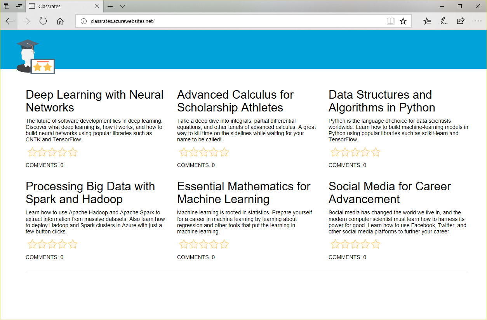

	_Classrates running in Azure_

1. Click around the site and enter a few comments, ensuring that the site works the same in Azure as it did when you ran it ran locally. In particular, make sure that the comments you enter are converted into ratings, which is proof that the version of **functions.js** that you modified with an endpoint URL and an API key was successfully published to GitHub and subsequently to Azure.

Now that you have continuous integration set up, you can make changes to the Web site by making the changes locally, checking them in, and rerunning the **Publish Branch** command. Of course, you can still test your changes locally before publishing them to Azure. You also enjoy the many benefits of source control, including the ability to isolate the work that you do in branches, view the changes that have been committed, and easily revert to previous versions of the code. To learn more about source control in Visual Studio Code, see [Using Version Control in VS Code](https://code.visualstudio.com/docs/editor/versioncontrol).

<a name="Exercise5"></a>
## Exercise 5: Delete the resource group ##

In this exercise, you will delete the resource group that holds all the resources created in this lab. Deleting the resource group deletes everything in it and prevents any further charges from being incurred for it. Resource groups that are deleted can't be recovered, so be certain you're finished using it before deleting it.

1. Click **Resource groups** in the menu on the left side of the portal to show a list of resource groups. Then click the "classrates-rg" resource group.

    

    _Opening the resource group_

1. Click **Delete resource group** at the top of the blade.

    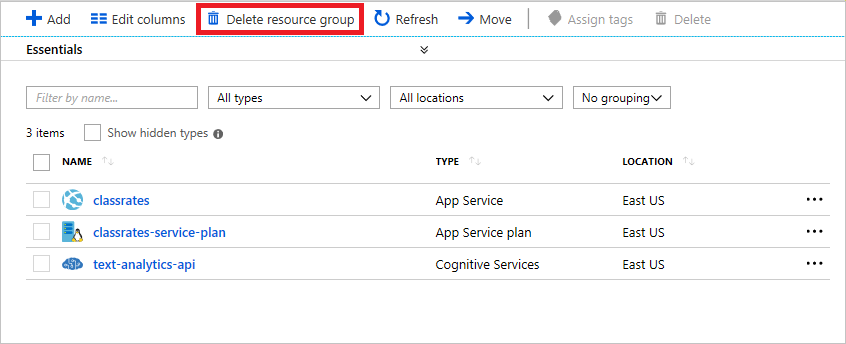

    _Deleting the resource group_

1. For safety, you are required to type in the resource group's name. (Once deleted, a resource group cannot be recovered.) Type the name of the resource group. Then click the **Delete** button to remove all traces of this lab from your Azure subscription.

After a few minutes, the resource group and all of its resources will be deleted. Billing stops when you click **Delete**, so you're not charged for the time required to delete the resources. Similarly, billing doesn't start until the resources are fully and successfully deployed.

<a name="Summary"></a>
## Summary ##

Want to do more to make Classrates a first-rate Web app? One suggestion is to add support for editing and deleting comments. Another idea is to add a MySQL database to persist the comments that are entered. Currently, the comments are stored only in memory, and they go away if the Web App is recycled. It's easy to create a MySQL database in Azure and connect it to an Azure Web App. For guidance, see [Connect an existing Azure App Service to Azure Database for MySQL server](https://docs.microsoft.com/en-us/azure/mysql/howto-connect-webapp). Now that you have a solid foundation to work from, the only limit is your imagination.

---

Copyright 2018 Microsoft Corporation. All rights reserved. Except where otherwise noted, these materials are licensed under the terms of the MIT License. You may use them according to the license as is most appropriate for your project. The terms of this license can be found at https://opensource.org/licenses/MIT.