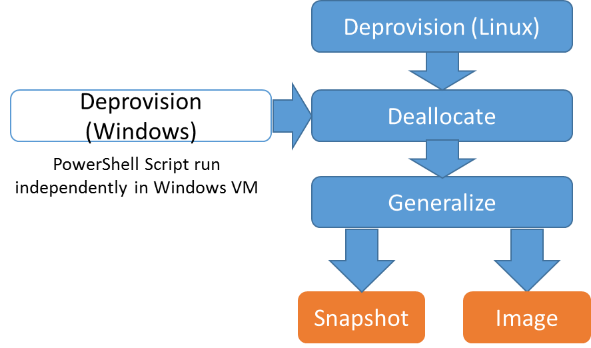

# Readme file - Azure CS University DS Sandboxes Project

## Table of Contents

* [Readme file - Azure CS University DS Sandboxes Project](#readme-file---azure-cs-university-ds-sandboxes-project)
    * [Description](#description)
    * [Prerequisites](#prerequisites)
    * [Installation](#installation)
    * [Input parameters](#input-parameters)
        * [Class &amp; User Information](#class--user-information)
        * [Deployment](#deployment)
        * [VM Details](#vm-details)
    * [Output file](#output-file)
        * [Deployment Results](#deployment-results)
    * [Master Script](#master-script)
        * [Script Design](#script-design)
        * [Script Usage](#script-usage)
        * [Examples](#examples)
    * [Logging](#logging)
    * [Resource Tags](#resource-tags)
    * [Known limitations](#known-limitations)
    * [Script Performance](#script-performance)
    * [Deploying different VM types](#deploying-different-vm-types)
    * [Email Server setup](#email-server-setup)
        * [Mail Service Provider](#mail-service-provider)
        * [Directions to set up Email](#directions-to-set-up-email)
        * [Sign up for a SendGrid account](#sign-up-for-a-sendgrid-account)
        * [Integrating Email with Deployments](#integrating-email-with-deployments)
        * [Find your SendGrid API Key](#find-your-sendgrid-api-key)
        * [Configure script file](#configure-script-file)
    * [Helper scripts](#helper-scripts)
        * [View VM Status or change state](#change-state-of-view-status)
            * [Script Usage](#script-usage-1)
            * [Examples](#examples-1)
        * [Create Image from Virtual Machines](#create-image-from-virtual-machines)
            * [Script Usage](#script-usage-2)
            * [Examples](#examples-2)
            * [Directions](#directions)


## Description

Educators want a simple way to provide students with VMs based on a specific VM image (for example, [Data Science VM](https://azuremarketplace.microsoft.com/en-us/marketplace/apps/microsoft-ads.standard-data-science-vm?tab=Overview)), so students can learn the fundamentals of data science.
These scripts would not only be helpful in the education sector, but any environment where you need to quickly create many VM sandboxes.
The goal is to deploy a massive set of preconfigured VMs from prebuilt deployment scripts.  An alternative approach to this script is to use the Azure Copy function, but this has shown to not be performant when it comes to hundreds of identical VMs.
These scripts achieve the following user stories:

**Development Environment Epic**

*	Ability to deploy 300 DSVMs (Data Science Virtual Machine) in either Windows, Ubuntu, of Linux CentOS
*   Ability to deploy VMs from marketplace image, custom image, or DSVM
*	Ability to deploy VMs across one or multiple subscriptions (ie. Each VM can be in its own subscription)
*	Ability for each VM to have its own Resource Group 
*   Ability to create a clean VM image from a VM  

**Administration Epic**

*	Ability to use a CSV file to configure a large number of DSVMs
*	Ability to validate inputs at run time
*	Ability to easily tag large numbers of resource groups & VMs (ex. to assign to a specific class)

**Data Storage Epic**
*	Ability to load zip files to VMs during deployment

**Cost Controls Epic**
*	Ability to see the status of deployments, pause, start and stop VMs

This bash script is developed to allow creation of multiple VMs in Azure within different subscriptions.

Each VM is deployed in a separate resource group; all supporting infrastructure is deployed within the resource group (e.g. virtual network, managed disk, network interface card, public IP address, DNS, and NSG).

## Prerequisites

The following prerequisites must be met for the script to run appropriately:

* Bash script should be run on Linux terminal or Bash on Ubuntu on Windows
	* Instructions on how to install Bash for Windows can be found [here](https://msdn.microsoft.com/en-us/commandline/wsl/about).
  * At this time the scripts won’t run on [Bash Azure Cloud Shell](https://docs.microsoft.com/en-us/azure/cloud-shell/overview) due to a few functions not being compatible.  Resolving these incompatibilities will be considered for future updates.
* Azure CLI 2.0 installed. 
	* Instructions on how to install Azure CLI 2.0 can be found [here](https://docs.microsoft.com/en-us/cli/azure/install-azure-cli).
* User must have an active Azure account. 
* Subscription(s) should have sufficient budget allowing VMs to run.
* User needs to ensure no subscription / region component limits will be exceeded
	* Typically, public IDs, cores, NICs, and VMs soft limits need to be increased via a service desk request if trying to deploy 300 VMs. 
	* [Information about Azure subscription and service limits, quotas, and constraints](https://docs.microsoft.com/en-us/azure/azure-subscription-service-limits). 

> **IMPORTANT NOTE:** 
> Before you proceed to use the script, you must accept the terms for the VM image (ex. Data Science Virtual Machine for Ubuntu) for every subscription utilized in the deployment. You can do this  by going to the VM you want to add and click the link about deploying the VM programmatically. See instructions for [reference](https://azure.microsoft.com/en-us/blog/working-with-marketplace-images-on-azure-resource-manager/).

This only must be done once and can be done for all subscriptions in the same update.

Currently you can deploy the following VM’s:

* Data Science Virtual Machine for Linux (Ubuntu) ([link](https://portal.azure.com/#create/microsoft-ads.linux-data-science-vm-ubuntulinuxdsvmubuntu))
* Data Science Virtual Machine for Windows ([link](https://portal.azure.com/#create/microsoft-ads.standard-data-science-vmstandard-data-science-vm))
* Data Science Virtual Machine for Linux (Centos) ([link](https://azuremarketplace.microsoft.com/en-us/marketplace/apps/microsoft-ads.linux-data-science-vm))
* Other types of VMs created using the `create-vm-image.sh` script.

## Installation

 1. Make sure all prerequisites are met.
 2. Make sure you restarted the terminal after installing Azure CLI. You
    can do it by running  `exec` bash command.
 3. Log in to Azure from the Azure CLI by following the instructions
    from [here](https://docs.microsoft.com/en-us/azure/xplat-cli-connect).
 4. Copy files from the repository to the computer where you would like
    to run the script.
 5.  Setting up a temporary VM in Azure in the same region will boost
    performance.
 6. Change permissions of the bash script file to be executable by
    running command:  
```sh
$ chmod +x deploy-vm.sh
```

## Input parameters

### Class & User Information

**File:** Input.csv 

**Purpose:** Allows for easy configuration of a massive deployment.  Example. One script can be used to deploy against multiple subscriptions, and users.

**Description:** Contains metadata about class and user information. Each line corresponds to one deployed VM.

**Field description:**

Field					| Required 	| Optional	| Description | Comments
----------------------- | --------- | --------- | ----------- | --------
Class Name 				| X | 	| Name of the class, (ex.  Computer Science 101) | May contain spaces. Just used to populate metadata tags
Subscription Name 		| 	| X | Name of the subscription to be used for deployment | Metadata to describe subscription ID. 
Subscription ID 		| X | 	| Azure Subscription ID | Each line can use different subscriptions which must be created beforehand. Subscription ID is on the Azure portal. 
Student Name 			| 	| X | Name of the student who is working on the VM | May contain spaces.
Student Email Address 	| 	| X | Valid student e-mail address | System does not test if valid
VM User Name 			| X | 	| Login used by the student to access the VM | No spaces allowed
MV User Password 		| X | 	| Password used by the student to login to the VM | No spaces allowed.
VM Admin Username 		| X | 	|Login used to access the VM as administrator | No spaces allowed.
VM Admin Password 		| X | 	| Password used by the student to login to the VM | No spaces allowed.
Comment 				| 	| X | Additional details to make it easier to manage CSV |

### Deployment

**File:** parameters.json 

**Purpose:** Pass parameters values required for deployment. 

**Description:** The file contains placeholders which will be replaced by exact values for each deployment and passed as a sting within az group deploy command. 

### VM Details

**File:** template-data-science.json

**Purpose:** Contains relevant metadata and parameters for specific DSVMs

**Description:** 

Currently we have the following types of DSVMs:

* Data Science VM for Windows
* Data Science VM for Ubuntu
* Data Science VM for CentOS

**File:** template-from-data-science-image.json

**Purpose:** Enables deployment from DSVM images and manages relevant metadata and parameters

**Description:** 

Currently we have the following types of DSVMs:

* Data Science VM for Windows
* Data Science VM for Ubuntu
* Data Science VM for CentOS

**File:** template-from-custom-image.json

**Purpose:** Enables deployment from any custom VM image and manages relevant metadata and parameters

**Description:** 
This template enables you to use any image from a custom built VM for your deployment.  This enables use cases outside of data science, such as web development and deep learning.

**Storage Methods** (impacts availability, redundancy and fault tolerance approach)
* manage  - utilizes Azure Managed Disc
* unmanage – uses standard disc option

Information about data science VMs can be found [here](https://docs.microsoft.com/en-us/azure/machine-learning/machine-learning-data-science-virtual-machine-overview).

## Output file

### Deployment Results

**File:** Output.csv

**Purpose:** Maps results of deployment to the original deployment values.

**Description:** Contains metadata about class, user information (except user passwords) and VMs which were deployed. Each line corresponds to one deployed VM.

**Field description:**

Field					| Description                                  | Comments
----------------------- | -------------------------------------------- | --------
Class Name              | Name of the class (ex. Computer Science 101) | Inherited from input csv file
Class ID                | Time-based GUID developed for the subscription | 
Subscription Name       | Name of the subscription to be used for deployment | Inherited from input csv file
Subscription ID         | Azure Subscription ID | Inherited from input csv file
Student Name            | Name of the student who is working on the VM | Inherited from input csv file
Student Email Address   | Valid student e-mail address | Inherited from input csv file
VM UserName             | Login used by the student to access the VM | Inherited from input csv file
VM Admin UserName       | Login used to access the VM as administrator | Inherited from input csv file
Location                | Region of Azure server farm | Location from input line   
VM Name                 | Name of the VM deployed | 
Public DNS              | DNS of the VM which can be used for connecting to it | 
Resource Group Name     | Resource group where VM has been deployed | 
Security Group Name     | Security group where VM has been deployed | 
Comment                 |  | Inherited from input csv file


## Master Script

The master script name is <kbd>deploy-vm.sh</kbd>

You must chose to either deploy a DSVM or deploy from an image.

### Script Design

The script runs az group deployment create command with --no-wait option. This means that once the script is finished, the deployment will still be in process.  You can visit Azure portal and use ClassID tag to determine when all VMs were deployed. This approach is used to minimize the time for the deployment.


### Script Usage

The following are the different required arguments for the deploy script:

Argument        | Command       | Description | Example
--------------- | ------------- | ----------- | --------
-h, --help      | Help          | Show brief help | 
-v, --version   | Version       | Output version information | 
-in, --input    | Input file    | Specify the input file in csv format | input.csv
-out, --output  | Output file   | Specify the output file in csv format | output.csv
-l, --location  | Location file | Specify location for the deployment | uswest
-s, --size	    | VM Type	      | Specify the specific VM for the deployment (-h provides recommended versions) | Standard_DS2_V2
-st, --storage	| Storage type  | Configure Premium (HHD) or standard hard drives (SSD) | premium
-vm, --vmtype	  | VM image      | Specify VM image for deployment | ds-vm-ubuntu
-d, --disk      | Disk type	    | Select managed or unmanaged disc | manage
-m, --sendemail	| Email toggle	| Email users following deployment with VM information | on
-u, --url	      | (Optional) Send | file |URL of file to send to desktop of VM | http://www.example.com/data.zip
-i, --image     | Image         | Specify the url to the file will be copied to the VM | /subscriptions/guid/resourceGroups/rgName/providers/Microsoft.Compute/images/imageName

### Examples

**Deploy a DSVM**

```sh
$ ./deploy-vm.sh -in input.csv -out output.csv -l westus -s Standard_DS3_v2 -st premium -u http://www.example.com/data.zip -vm ds-vm-ubuntu -d manage -m on
```

**Deploy from an image**
```sh
$ ./deploy-vm.sh -in input.csv -out output.csv -l westus -s Standard_DS3_v2 -st premium -u http://www.example.com/data.zip  -d manage -m on -i /subscriptions/<guid>/resourceGroups/<Resource Group Name>/providers/Microsoft.Compute/images/<Image Name>
```

Examples of files (input.csv, output.csv) are included in this repository.

## Logging

The script creates a log file for each deployment. The file can be found in the same folder as output.scv file. The file name of the log file includes time-based GUID generated for the specific deployment.

> **Example**: Deployment-c8f7dc5c-398e-11e7-a762-54ee759e9cc8.log

## Resource Tags

Resource groups have the following tags added during deployment from the <kbd>input.CSV</kbd> file:

* ClassID
* StudentLogin
* StudentEmail
* StudentName
* ClassName

Each VM has the following tags inherited from the <kbd>input.CSV</kbd> file:

## Known limitations

 * The script can only use existing subscriptions. It does not programmatically create new subscriptions based on subscription names/IDs in the input file.
 * Script does not verify infrastructure element availability before the deployment; deployment will partially succeed if limits are hit.
	* If the deployment requires infrastructure beyond the current subscription / region limit, the deployment will fail. User must ensure deployment infrastructure elements have not exceeded existingquota in the region of the deployment.
	* Typically, public IDs, cores, NICs, and VMs soft limits need to be increased via a service desk request if trying to deploy large amount of VMs.

## Script Performance
We recommend to spinning up a VM in Azure in the same region where you plan to do the deployement to use as a terminal to run the script. This accelerates script execution significantly.

Results of the performance testing (only one deployment were done per testing):

DSVM type   | Environment | Approx time to create 300 VMs
----------- | ------------| ---------
Windows     | Bash shell in Windows 10 local machine | 42 min 41 sec
Windows     | Ubuntu Jumpbox in deployment region (westus) | 18 min 17 sec

Please note that the performance of the execution depends on multiple factors including current load on Azure within the specified region and network bandwidth between terminal where script runs and Azure.

## Deploying different VM types

The script is accompanied with JSON files configured to deploy multiple VMs with Windows Data Science VM, Ubuntu Data Science VM or CentOS Data Science VM.
The existing JSON filess can be updated at your own risk. If any changes are made, it is recommended to keep a reference to parameters specified in `parameter.json`. 

> **Example**: publicIpAddressName is defined in `parameters.json` and used in the `template-*.json` files. The value is assigned inside the script. If this value is removed from the `template-*.json` files, the IP name will be assigned automatically, potentially causing deployment issues.

## Email Server setup
We recommend using SendGrid on Azure for email.

### Mail Service Provider
This example utilizes SendGrid as the email service provider.
To send emails, you should set up a master script.

SendGrid includes a free account for Azure customers that includes some free emails each month including access to advanced reporting, analytics, and all APIs (Web, SMTP, Event, Parse and more). See instructions for [reference](https://azuremarketplace.microsoft.com/en-us/marketplace/apps/SendGrid.SendGrid).

### Directions to set up Email

#### Sign up for a SendGrid account
1.	Log in to the Azure Management Portal.
1.	In the menu on the left, click New.
1.	Click Add-ons and then SendGrid Email Delivery.
1.	Complete the signup form and select Create.
1.	Enter a Name to identify your SendGrid service in your Azure settings. 
    * Names must be between 1 and 100 characters in length and contain only alphanumeric characters, dashes, dots, and underscores. 
    * The name must be unique in your list of subscribed Azure Store Items.
1.	Enter and confirm your Password.
1.	Choose your Subscription.
1.	Create a new Resource group or use an existing one.
1.	Select the appropriate SendGrid plan In the Pricing tier section.
    * Enter a Promotion Code if you have one.
1.	Enter your Contact Information.
1.	Review and accept the Legal terms.
1.	After confirming your purchase, you will see a Deployment Succeeded pop-up and you will see your account listed in the All Resources section.

After you have completed your purchase and clicked the Manage button to initiate the email verification process, you will receive an email from SendGrid asking you to verify your account. If you do not receive this email, or have problems verifying your account, please see the FAQ.

> **NOTE:** 
> You can only send up to 100 emails/day until you have verified your account.

To modify your subscription plan or see the SendGrid contact settings, click the name of your SendGrid service to open the SendGrid Marketplace dashboard.

To send an email using SendGrid, you must supply your API Key.

### Integrating Email with Deployments

#### Find your SendGrid API Key
1. Click Manage.
1. In your SendGrid dashboard, select Settings and then API Keys in the menu on the left.
1. Click the Create API Key dropdown and select General API Key.
1. At a minimum, provide the Name of this key and provide full access to Mail Send and select Save. 
1. Your API key will be displayed at this point one time. Please be sure to store it safely.

#### Configure script file
Sending email requires that you supply your SendGrid API Key. If you need details about how to configure API Keys, please visit SendGrid's API Keys documentation.

Open the <kbd>deploy-vm.sh</kbd> script, find apiKey section and replace value with your API key
```sh
local apiKey="SENDGRID_APIKEY"
local emailFrom="<email_from>"       
```

## Helper scripts

### Change state of View Status

**File:** change-vm-state.sh

**Purpose:** Start, stop, restart and redeploy VMs. Get provisioning State of deployment.  Delete the resource group by ClassID tag.

**Description:** This script allows you to manage the VM in Azure within different subscriptions.

#### Script Usage

The master script name is <kbd>change-vm-state.sh</kbd>.

The following are the different required arguments for the script: 

Argument        | Command       | Description | Example
--------------- | ------------- | ----------- | --------
-id,            | --classid     | Specify time-based GUID developed for the subscription | aa371ce6-c555-4c21-88b6-246742b8c61d
-a,             | --action      | Specify the task describes the action	                 | delete
-h,             | --help        | Show brief help | 
-v,             | --version     | Output version information |

#### Examples

**Example for VMs:**
```sh
$ ./change-vm-state.sh -id aa371ce6-c555-4c21-88b6-246742b8c61d -a start
```

**Example for RGs:**
```sh 
$ ./change-vm-state.sh -id 25b5b6de-79f8-4131-90f1-1ab296ec3a7f -a delete
```

**Actions related to the VMs:**
- start        -  The operation to power off (stop) a virtual machine.
- stop         -  The operation to start a virtual machine.
- restart      -  The operation to restart a virtual machine.
- redeploy     -  The operation to redeploy a virtual machine.

**Actions related to the RGs:**
- status       -  The operation provisioning State of deployment.
- delete       -  The operation deletes the resource group by ClassID tag.

### Create Image from Virtual Machines

**File:** create-vm-image.sh

**Purpose:** Create an image from a custom built VM

**Description:** This script allows you to expand the capabilities of this script to any VM, not just DSVMs.

During the process of creating an image, the script will clean all user and personal data from the device so it is not propagated into future VMs.  
When VMs are created from these image, they get new IP addresses.
The VM which is used as a template will not be available after the image is created and should be deleted.

#### Script Usage
The following are the different required arguments for the script: 

Argument        | Command       | Description | Example
--------------- | ------------- | ----------- | --------
-vm,            | --vmname      | The name of the Virtual Machine. | myVMName
-g,             | --group       | Name of resource group. | myResourceGroup
-ht,            | --host        | Public IP address or DNS url | 13.91.88.167
-u,             | --username    | Virtual Machine username | vmadmin
-subid,         | --subscriptionId | Subscription | d4b70cdf-78d7-45f7-9009-81a22a173bdf
-h,             | --help        | Show brief help | 
-v,             | --version     | Output version information | 

#### Examples

**Creating a VM from a Linux machine:**
```sh
$ ./create-vm-image.sh -vm <Virtual Machine Name> -g <Resource Group Name> -ht <DNS or IP address> -u <User Name> -subid <Subscription Id>
```

#### Directions

The script processes following this direction:



>**Important!**
>Note that if you are creating a Windows VM image, you will need to remote into the VM and execute a PowerShell script when prompted during the Bash script execution.

Run PowerShell as Administrator and execute:
```powershell
Start-Process -FilePath C:\Windows\System32\Sysprep\Sysprep.exe -ArgumentList '/generalize /oobe /shutdown /quiet'
```

>**Important!**
>After running the script, the VM will no longer be available. The script is cleared of all sensitive information.

---