
# Getting Started with Azure #

---

## Overview ##

[Microsoft Azure](https://azure.microsoft.com) is Microsoft's cloud computing platform. It offers dozens of services to help developers write cloud-based applications and researchers process and analyze big data. And it is supported by more than 20 data centers around the world, producing unprecedented scale, availability, and reliability, all while offering massive economy of scale to consumers.

The entry point to Azure is the [Azure Portal](https://portal.azure.com), which you will become familiar with as you work through the labs. In order to use the portal, you must have an Azure subscription. When you consume Azure services through the portal — when, for example, you store data in a storage account or deploy a high-performance computing (HPC) cluster — those services are billed against your subscription. A free subscription has been provided for you, along with unique credentials for logging into the portal and using that subscription. These credentials and the subscription associated with them have been provided specifically for the purpose of working these labs. To work with Azure outside the scope of these labs, you will need to associate an Azure subscription with your personal Microsoft account or with a work/school account (also known as an *Office 365 account*) provided by your school or organization.

Although Azure services can be accessed from any operating system running on an any device, some of the tools you will use for today's labs require Microsoft Windows. Therefore, a virtual machine (VM) running Windows 10 and preconfigured with all the tools you will need has been provided for you. The purpose of this lab is to connect to the lab VM, log in to the Azure Portal, and confirm that you have a working subscription. In subsequent labs, you will use this subscription to create storage accounts, deploy Web apps, create machine-learning models, run Docker containers in Azure, and much more. 

> You can work the labs in this course without a VM if you have an active Azure subscription and are running Windows 10 with the proper tools installed. Each lab lists the tools required as well as links for downloading them. Moreover, all of the required tools are free. Here's a complete list in case you would like to configure a Windows 10 PC or laptop with everything needed for the labs:

>- [Visual Studio 2015 Community edition](https://www.visualstudio.com/en-us/products/visual-studio-community-vs.aspx) or higher
- [Visual Studio Code](https://code.visualstudio.com/download)
- [PHP for Windows](http://windows.php.net/download/)
- [Microsoft Azure Storage Explorer](http://storageexplorer.com/)
- [Git](https://git-scm.com/downloads) version 2.0 or higher
- [Node.js](https://nodejs.org/en/download/) version 4 or higher
- [PuTTY](http://www.chiark.greenend.org.uk/~sgtatham/putty/download.html)
- [Docker client for Windows](https://get.docker.com/builds/Windows/x86_64/docker-latest.zip)

> In each case, it is recommended that you install the latest stable release of the tools to ensure compatibility with the lab exercises.

### Objectives ###

In this hands-on lab, you will:

- Connect to the lab VM
- Log in to the Azure Portal
- View the Azure subscription associated with your account

### Prerequisites ###

The following are required to complete this hands-on lab:

- An HTML5 browser such as Chrome 16+, Firefox 11+, Internet Explorer 10+, or Microsoft Edge
- A URL provided by the instructor for accessing the lab VM

For a complete list of requirements for connecting to and using the lab VM, visit https://microsoftevents.learnondemand.net/Lab/HyperVSupport.

---

## Exercises ##

This hands-on lab includes the following exercises:

- [Exercise 1: Connect to the lab VM](#Exercise1)
- [Exercise 2: Access the Azure Portal and view subscription information](#Exercise2)

Estimated time to complete this lab: **15** minutes.

---

## Exercise 1: Connect to the lab VM ##

In this exercise, you will use your browser to connect to a Windows 10 virtual machine (VM) that has been prepared for you. The VM contains all the tools you need to work the labs in this course, including Visual Studio 2015, Visual Studio Code, Node.js, and others.

1. Open your browser and navigate to https://ms-azureworkshop.learnondemand.net. Then click the **Sign In** button.

    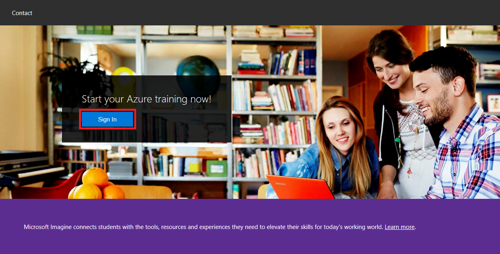

    _The Learn on Demand portal_

1. Click **Learn on Demand Systems Account**.

	> If you have a Microsoft account and would prefer to sign in with it, you can click **Microsoft Account** instead and sign in that way.

    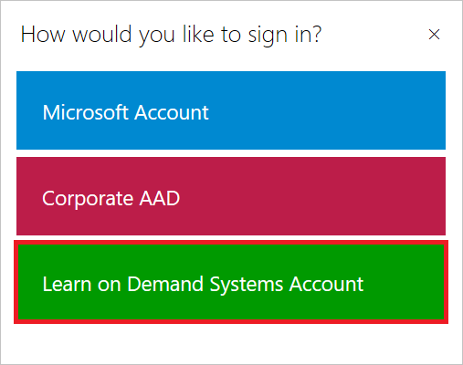

    _Choosing a sign-in option_

1. If you have a Learn on Demand account, enter your user name and password and click **Sign in**. Otherwise, click **Create an Account**.

    

    _Signing in_

1. If you clicked **Create an Account** in the previous step, fill out the form for creating a new account. Then click **Save**.

    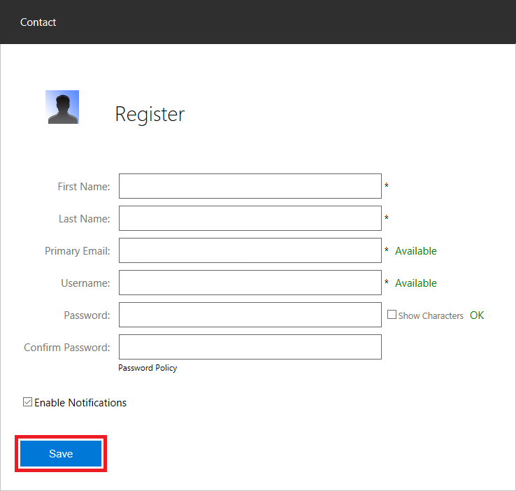

    _Creating an account_

1. Click **Redeem Training Key**.

    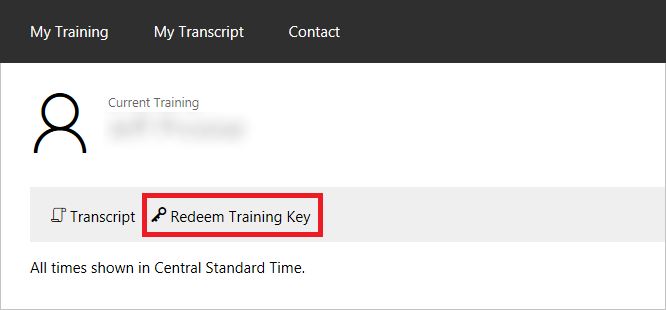

    _Redeeming a training key_

1. Enter the training key provided by the instructor. Then click **Redeem Training Key**.

    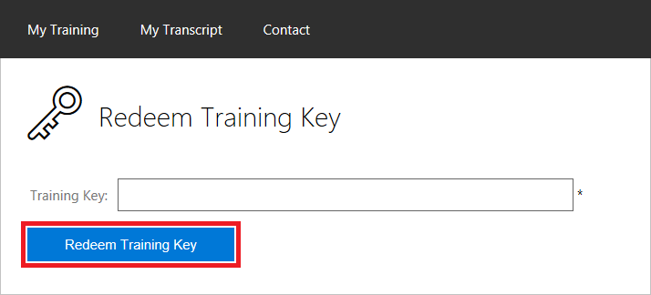

    _Entering a training key_

1. Click **Launch Test Lab**.

    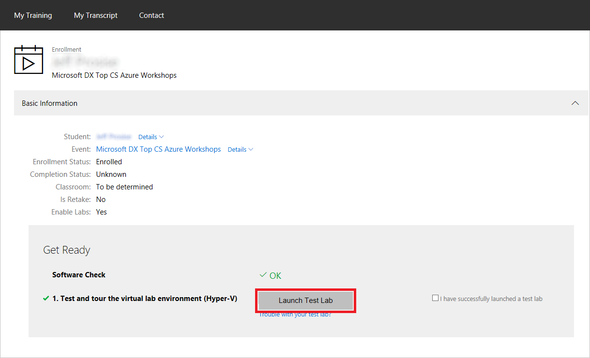

    _Launching the test lab_

1. After a few moments, the Windows 10 desktop appears in your browser. If you are asked whether you want "your PC" (the virtual machine) to be discoverable on the network, click **No**.

    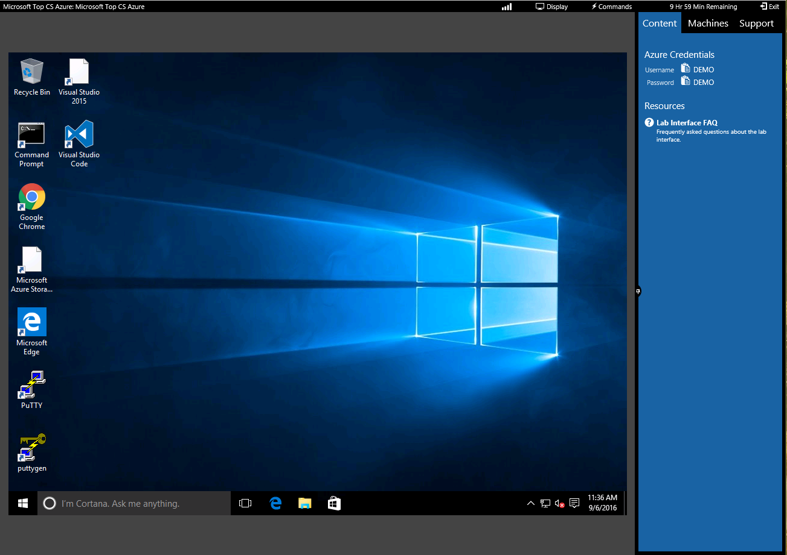

    _The virtual-machine desktop_

1. If you would like for the VM to occupy the entire screen, click **Display** in the menu bar at the top of the page and select **Full Screen**. (You can exit full-screen mode at any time by clicking **Display** again and selecting **Exit Full Screen**.)

    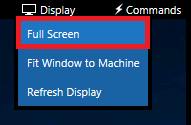

    _Switching to full-screen_

1. In the "Content" tab on the right side of the screen are the credentials you will use to log in to the Azure Portal and access the subscription that has been set up for you. Make note of these credentials, because you will need them in the next exercise and throughout the rest of the day.

    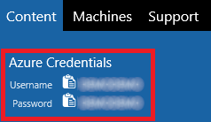

    _Your Azure credentials_

Now that you are connected to the lab VM, the next task is to log in to the Azure Portal and confirm that a subscription has been created for you.

## Exercise 2: Access the Azure Portal and view subscription information ##

In this exercise, you will log in to the Azure Portal and learn how to view the subscriptions associated with your account.

1. In the VM, click the Edge icon in the task bar at the bottom of the desktop to open Microsoft Edge.

    

    _Opening Microsoft Edge_

1. Type "portal.azure.com" (without quotation marks) into the browser's address bar to go to the Azure Portal.

1. When asked to log in, enter the user name and password displayed in the "Content" tab on the right side of the screen under "Azure Credentials." Then click the **Sign In** button.

    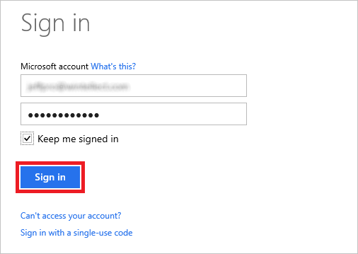

    _Logging in to the Azure Portal_

1. Click **Subscriptions** in the ribbon on the left side of the page.

    

    _Viewing Azure subscriptions_

1. Confirm that **Azure Pass** appears among the list of subscriptions associated with your account, and that the subscription status is **Active**.

    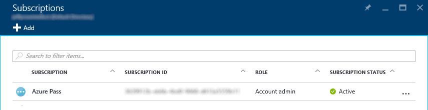

    _Your Azure Pass subscription_

You can click a subscription to retrieve billing and usage information for it. However, since your Azure Pass subscription is brand new, no data is presently available. Make a note to return here later today and see if there is billing and usage information available for your Azure Pass.

### Summary ###

In this hands-on lab, you learned how to:

- Log in to the Azure Portal
- View the Azure subscriptions associated with your account

The portal will be your home for everything Azure and your gateway for using the cloud.

---

Copyright 2016 Microsoft Corporation. All rights reserved. Except where otherwise noted, these materials are licensed under the terms of the MIT License. You may use them according to the license as is most appropriate for your project. The terms of this license can be found at https://opensource.org/licenses/MIT.