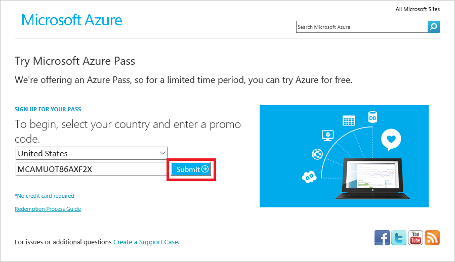
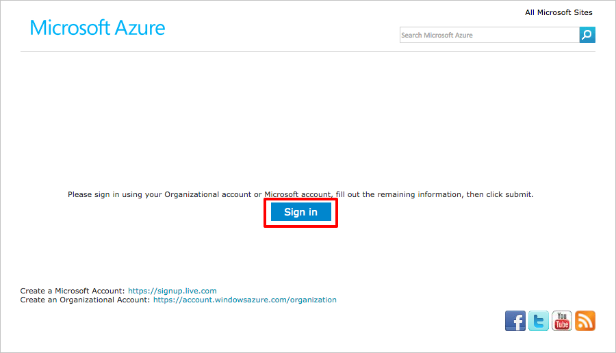
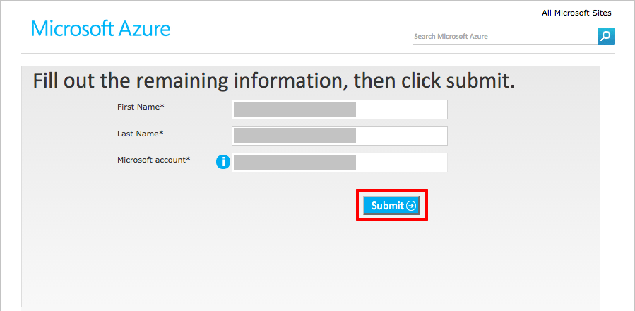
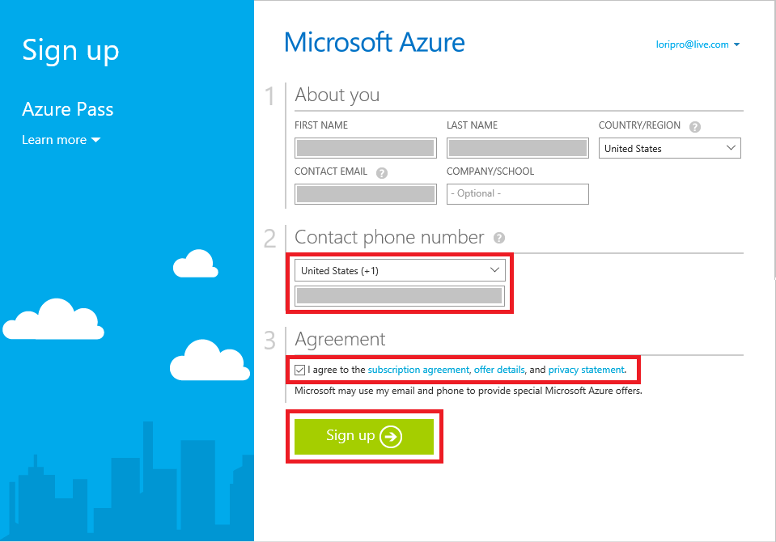
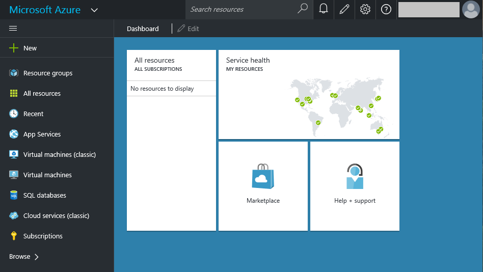
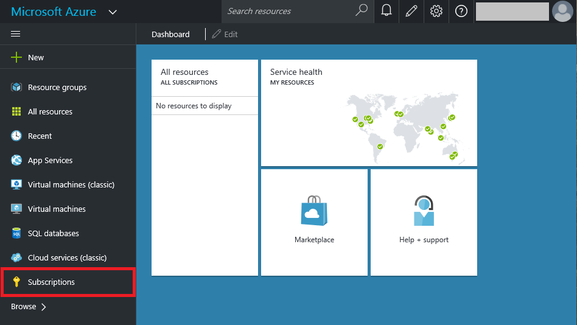
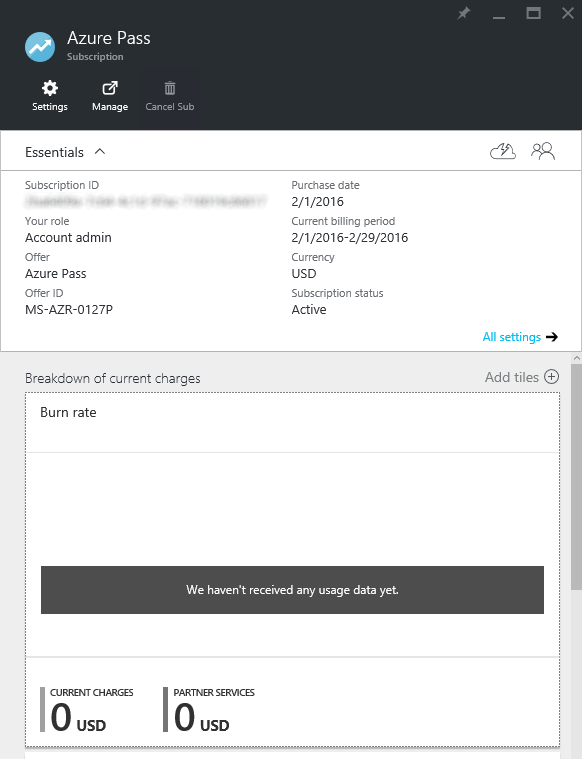
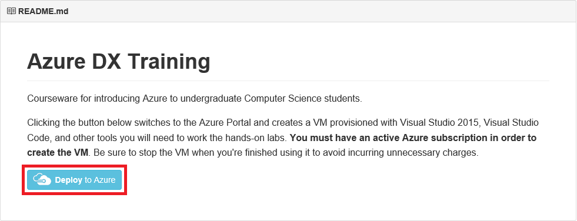
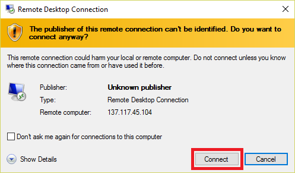

# Connecting to Azure and Setting Up the Lab VM #

---

## Overview ##

For this lab, we will demostrate how to get started exploring Azure without worrying about the cost. We will use an Azure Pass to do so although there are many programs for Academic users that you may already have access to. Activating your Azure Pass is simple and allows you to get started exploring Azure without worrying about the cost. In the Azure for Research initiative, the Azure Pass you were given requires a [Microsoft account](http://windows.microsoft.com/en-us/windows-live/sign-in-what-is-microsoft-account). If you already have a Microsoft account and it has never been used with an Azure Pass, you can use your existing Microsoft account. If you don't have a Microsoft account, or if you do but it has been used with an Azure Pass in the past, then you will create a new Microsoft account. Microsoft accounts are free and provide access to a wide range of Microsoft services, including Azure.

The entry point to Azure is the [Azure Portal](https://portal.azure.com), which you will become familiar with as you work through the labs. The Azure Portal was preceded by an earlier portal known as the [Classic Portal](https://manage.windowsazure.com). You will use the Azure Portal for most of your work, but because not all of the features of the Classic Portal have been ported over, you will use occasionally use the Classic Portal instead. Each of the hands-on labs contains explicit instructions showing which portal (and which features) to use. In this lab, you will activate your Azure Pass and learn how to access both portals.

### Objectives ###

In this hands-on lab, you will learn how to:

- Activate your Azure Pass
- Log in to Azure with a Microsoft account
- View the Azure subscriptions associated with your Microsoft account
- Deploy a virtual machine (VM) in Azure and remote into it

### Prerequisites ###

The following is required to complete this hands-on lab:

- An Azure Pass activation code. If you do not have one, please see the instructor.
- A Remote Desktop client that allows you to remote into a PC or VM running Windows. Mac users running OS X 10.9 or higher can download the [Microsoft Remote Desktop](https://itunes.apple.com/us/app/microsoft-remote-desktop/id715768417?mt=12) app for free from the Apple Store.

---

## Exercises ##

This hands-on lab includes the following exercises:

- [Exercise 1: Get a Microsoft account](#Exercise1)
- [Exercise 2: Activate your Azure Pass](#Exercise2)
- [Exercise 3: Access the Azure Portal and view subscription information](#Exercise3)
- [Exercise 4: Create a lab VM and connect to it via Remote Desktop](#Exercise4)

Estimated time to complete this lab: **30** minutes.

## Exercise 1: Get a Microsoft account ##

When you log in to the Azure Portal, you do so using a Microsoft account. A given account can have multiple Azure subscriptions associated with it. When you consume Azure services through the portal — when, for example, you store data in a storage account or deploy a high-performance computing (HPC) cluster — those services are billed against one of the subscriptions associated with your account. 
 
Your Azure Pass is a subscription that provides $500 worth of Azure credits. Currently, you can only use an Azure Pass with a given Microsoft account one time. If you already have a Microsoft account and are certain that it that has never been used with an Azure Pass, then you can **skip this exercise and proceed to [Exercise 2](#Exercise2)**. If you don't have a Microsoft account, or if you do but aren't sure whether it has ever been used with an Azure Pass, then follow the steps below to create a new Microsoft account.

1. Start a **private or incognito session** in the browser of your choice. Here are instructions for doing so in major browsers.
    - Google Chrome on all operating systems
        - Start Chrome
        - Click the  button in the upper-right corner
        - Select **New Incognito Window**
    - Mozilla Firefox on all operating systems
        - Start Firefox
        - Click the  button in the upper-right corner
        - Select **New Private Window**
    - Apple Safari on OS X
        - Start Safari
        - Select **File > New Private Window**
    - Microsoft Edge on Windows 10
        - Start Microsoft Edge
        - Click the  button in the upper-right corner
        - Select **New InPrivate window**
    - Internet Explorer on Windows
        - Start Internet Explorer
        - Click the gear icon in the upper-right corner
        - Select **Safety > InPrivate Browsing**

	>

1. In the private browsing window, navigate to the Microsoft account sign-up page at [https://signup.live.com](https://signup.live.com/).

    

    _Creating a new Microsoft account_

1. Type in the information requested and at the bottom of the page, click the **Create account** button. _Remember the user name and password you entered_ because you will need them to log in to the Azure Portal.

	> You can use any e-mail address you'd like as the user name for your new Microsoft account, including the .edu address provided by your school, but you can't use an e-mail address that has *already* been used to create a Microsoft account. If you need a new e-mail address, click **Get a new email address** under the **User name** box near the top of the form.

1. If you're prompted to provide further information or perform additional actions, follow the instructions provided to finish creating the Microsoft account.

Now that you have a Microsoft account, you can proceed to activate your Azure Pass.

## Exercise 2: Activate your Azure Pass ##

In this exercise, you will use the code you were given at the start of the day to activate an Azure Pass that's good for one month and $500 USD (or the equivalent in your local currency) and associate it with your Microsoft account.

1. Open your Web browser and navigate to [https://www.microsoftazurepass.com](https://www.microsoftazurepass.com). Select a country from the drop-down list labeled **Please Select Country**, and type the activation code you were given into the box underneath the drop-down list. Then click the **Submit** button.

    

    _Entering the activation code_

1. If your activation code is accepted, you will be asked to sign in using your Microsoft account. Click the **Sign in** button.

    

    _Signing in_

1. What happens next will vary depending on how many and what types of Microsoft accounts you have. The goal is to sign in using the credentials for the new Microsoft account you created in Exercise 1, or for your existing Microsoft account if you skipped Exercise 1. Ultimately, you will probably be asked to enter the user name and password for that account. Type them in and click the **Sign in** button.

    

    _Signing in with your Microsoft account_

1. You will now be returned to the Azure Pass site and asked to verify your first and last names. Confirm that they are correct and click the **Submit** button.

    

    _Verifying your Microsoft account information_

1. Click the **Activate** button to activate your Azure Pass.

    

    _Activating your Azure Pass_

1. After a few moments, you will be asked to provide additional information, including a contact phone number. Enter your phone number and check the **I agree to the subscription agreement, offer details, and privacy statement** box. Then click the **Sign up** button and *do not close the browser* as it can take several minutes to activate the Azure Pass.

    

    _Completing the activation process_

1. After several minutes, you'll be told "Your subscription is ready for you!" *Do not* click the **Start managing my service** button. Instead, close the browser window.

    

    _Your subscription is ready!_

1. Open up a new browser window and navigate to the Azure Portal at [https://portal.azure.com](https://portal.azure.com). If you're asked to choose which Microsoft account to log in with, select the one that you used to activate your Azure Pass. If you're asked to enter a user name and password for that account, do so. Once you're logged in, the portal will appear in your browser.
 
     

     _The Azure Portal_

Now let's confirm that your Azure Pass was activated and associated with your Microsoft account.

## Exercise 3: Access the Azure Portal and view subscription information ##

In this exercise, you will learn how to open the Azure Portal, how to list the subscriptions associated with your Microsoft account in the Azure Portal, and how to view usage data regarding those subscriptions so you can keep track of how much of your $500 credit is left.

1. Open your browser and navigate to the [Azure Portal](https://portal.azure.com) at [https://portal.azure.com](https://portal.azure.com). If you're prompted to log in, do so using the Microsoft account that you used to activate your Azure Pass in Exercise 2.

1. Click **Subscriptions** in the ribbon on the left side of the page.

    

    _Viewing Azure subscriptions_

1. Confirm that **Azure Pass** appears among the list of subscriptions associated with your account, and that the subscription status is **Active**. Then click **Azure Pass**.

    

    _Your Azure Pass subscription_

	> Don't be concerned if there are several Azure accounts associated with your subscription. What's important is that Azure Pass is one of them.

1. A new *blade* — that is, a window within the browser window — opens in the portal showing usage data and billing information for your Azure Pass. Since you just activated the subscription, there will probably be no charges listed. However, you can check back here from time to time to keep track of the charges being billed to your subscription. 

    

    _Usage data for your Azure Pass_

Now you know how to log in to the Azure Portal, as well as how to view usage data for your Azure Pass subscription. The next step is to use the portal to create the virtual machine (VM) required for subsequent labs.

## Exercise 4: Create a lab VM and connect to it via Remote Desktop ##

In this exercise, you will create a VM in Azure that has already been provisioned with Visual Studio 2015, Visual Studio Code, and other tools you will use in subsequent labs. Then you will remote into the VM using Remote Desktop.

1. In your browser, navigate to the [Azure One-Day Training](https://github.com/Azure-Readiness/Azure-One-Day-Training) repository on GitHub. This is the public repository in which the course materials for this class are stored. Near the bottom of the repository's home page, click the **Deploy to Azure** button.

    

    _Azure training GitHub repository_

1. In the Azure Portal, tk.

    

    _Caption_

1. tk.

    

    _Caption_

1. tk.

    

    _Caption_

1. If you're warned that the publisher of the remote connection can't be verified, click **Connect**.

    

    _Caption_

1. In the Windows Security dialog that ensues, click **Use another account**. Then log in with the user name and password you created for the VM.

    

    _Caption_

1. If you're warned again that the publisher of the remote connection can't be verified, click **Yes**.

    

    _Caption_

1. tk.

    

    _Caption_

1. tk.

    

    _Caption_

1. tk.

Your VM is ready to go. Now let's put it to work!

### Summary ###

In this hands-on lab, you learned how to:

- Activate an Azure Pass
- Log in to Azure with a Microsoft account
- View the Azure subscriptions associated with your Microsoft account
- View billing information in the Azure Portal
- Create a VM in Azure
- Remote into a VM

The portal will be your home for everything Azure and your gateway for using the cloud to aid your research.

---

Copyright 2016 Microsoft Corporation. All rights reserved. Except where otherwise noted, these materials are licensed under the terms of the Apache License, Version 2.0. You may use it according to the license as is most appropriate for your project on a case-by-case basis. The terms of this license can be found in http://www.apache.org/licenses/LICENSE-2.0.
