<a name="HOLTitle"></a>
# Azure Functions #

---

<a name="Overview"></a>
## Overview ##

Functions have been the basic building blocks of software since the first lines of code were written and the need for code organization and reuse became a necessity. Azure Functions expand on these concepts by allowing developers to create "serverless", event-driven functions that run in the cloud and can be shared across a wide variety of services and systems, uniformly managed, and easily scaled based on demand. In addition, Azure Functions can be written in a variety of languages, including C#, JavaScript, Python, Bash, and PowerShell, and they're perfect for building apps and nanoservices that employ a compute-on-demand model.

In this lab, you will create an Azure Function that monitors a blob container in Azure Storage for new images, and then performs automated analysis of the images using the Microsoft Cognitive Services [Computer Vision API](https://www.microsoft.com/cognitive-services/en-us/computer-vision-api). Specifically, The Azure Function will analyze each image that is uploaded to the container for adult or racy content and create a copy of the image in another container. Images that contain adult or racy content will be copied to one container, and images that do not contain adult or racy content will be copied to another. In addition, the scores returned by the Computer Vision API will be stored in blob metadata.

<a name="Objectives"></a>
### Objectives ###

In this hands-on lab, you will learn how to:

- Create an Azure Function App
- Write an Azure Function that uses a blob trigger
- Add application settings to an Azure Function App
- Use Microsoft Cognitive Services to analyze images and store the results in blob metadata

<a name="Prerequisites"></a>
### Prerequisites ###

The following are required to complete this hands-on lab:

- An active Microsoft Azure subscription. If you don't have one, [sign up for a free trial](http://aka.ms/WATK-FreeTrial)
- [Microsoft Azure Storage Explorer](http://storageexplorer.com) (optional)

---

<a name="Exercises"></a>
## Exercises ##

This hands-on lab includes the following exercises:

- [Exercise 1: Create an Azure Function App](#Exercise1)
- [Exercise 2: Add an Azure Function](#Exercise2)
- [Exercise 3: Add a subscription key to application settings](#Exercise3)
- [Exercise 4: Test the Azure Function](#Exercise4)
- [Exercise 5: View blob metadata (optional)](#Exercise5)

Estimated time to complete this lab: **60** minutes.

<a name="Exercise1"></a>
## Exercise 1: Create an Azure Function App ##

The first step in writing an Azure Function is to create an Azure Function App. In this exercise, you will create an Azure Function App using the Azure Portal. Then you will add the three blob containers to the storage account that is created for the Function App: one to store uploaded images, a second to store images that do not contain adult or racy content, and a third to contain images that *do* contain adult or racy content.

1. Open the [Azure Portal](https://portal.azure.com) in your browser. If asked to log in, do so using your Microsoft account.

2. Click **+ New**, followed by **Compute** and **Function App**.

    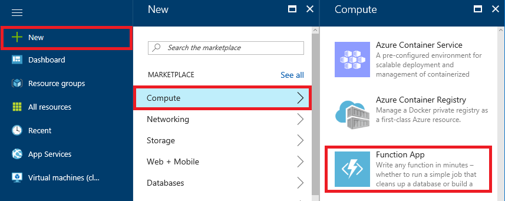

    _Creating an Azure Function App_

3. Enter an app name that is unique within Azure. Under **Resource Group**, select **Create new** and enter "FunctionsLabResourceGroup" (without quotation marks) as the resource-group name to create a resource group for the Function App. Choose the **Location** nearest you, and accept the default values for all other parameters. Then click **Create** to create a new Function App.

	> The app name becomes part of a DNS name and therefore must be unique within Azure. Make sure a green check mark appears to the name indicating it is unique. You probably **won't** be able to use "functionslab" as the app name.
 
    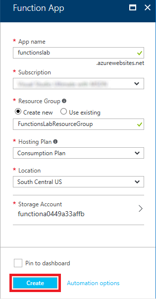

    _Naming a Function App_

1. Click **Resource groups** in the ribbon on the left side of the portal, and then click the resource group created for the Function App.
 
    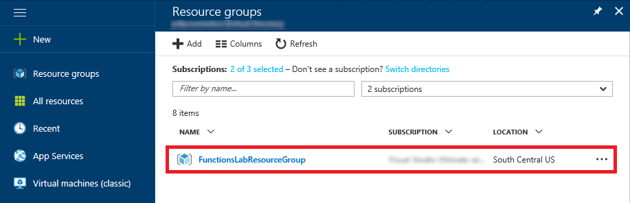

    _Opening the resource group_


1. Wait until "Deploying" changes to "Succeeded," indicating that the Function App has been deployed.

	> Refresh the page in the browser every now and then to update the deployment status. Clicking the **Refresh** button in the resource-group blade refreshes the list of resources in the resource group, but does not reliably update the deployment status.

    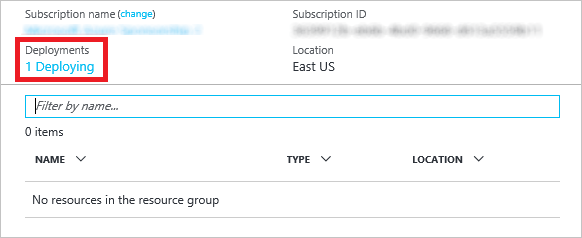

    _Viewing the deployment status_

1. Click the storage account that was created for the Function App.

    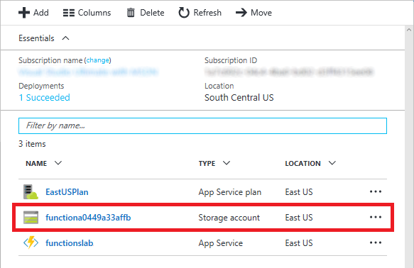

    _Opening the storage account_

1. Click **Blobs** to view the contents of blob storage.

    

    _Opening blob storage_

1. Click **+ Container** to add a container.

    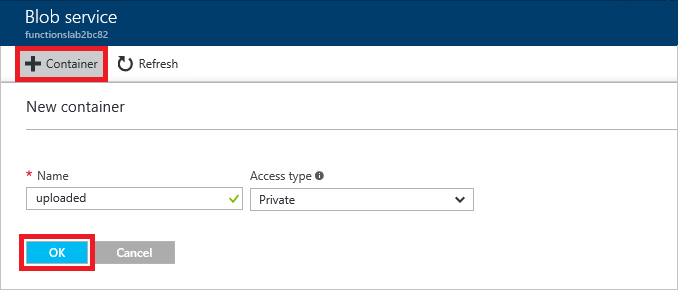

    _Adding a container_

1. Type "uploaded" into the **Name** box. Then click the **Create** button to create the container.

    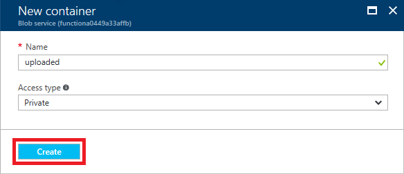

    _Naming the container_

1. Repeat Steps 8 and 9 to add containers named "accepted" and "rejected" to blob storage.

1. Confirm that all three containers were added to blob storage.

    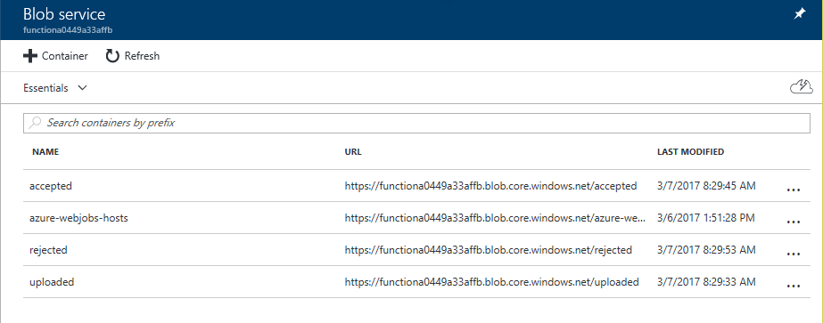

    _The new containers_

The Azure Function App has been created and you have added three containers to the storage account created for it. The next step is to add an Azure Function.

<a name="Exercise2"></a>
## Exercise 2: Add an Azure Function ##

Once you have created an Azure Function App, you can add Azure Functions to it. In this exercise, you will add a function to the Function App you created in [Exercise 1](#Exercise1) and write C# code that uses the [Computer Vision API](https://www.microsoft.com/cognitive-services/en-us/computer-vision-api) to analyze images added to the "uploaded" container for adult or racy content.

1. Return to the blade for the "FunctionsLabResourceGroup" resource group and click the Azure Function App that you created in [Exercise 1](#Exercise1). 

    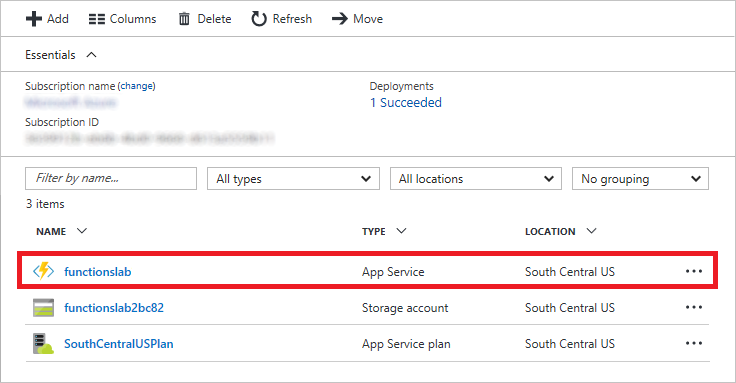

    _Opening the Function App_

1. Click **+ New Function** and set **Language** to **C#**. Then click **BlobTrigger-CSharp**.
  
    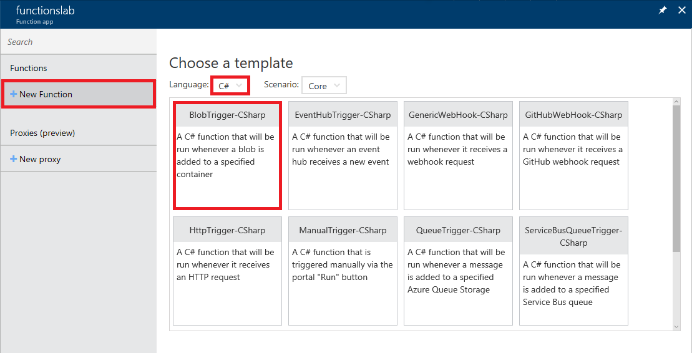

    _Selecting a function template_

1. Enter "BlobImageAnalysis" (without quotation marks) for the function name and "uploaded/{name}" into the **Path** box. (The latter applies the blob storage trigger to the "uploaded" container that you created in Exercise 1.) Then click the **Create** button to create the Azure Function.

    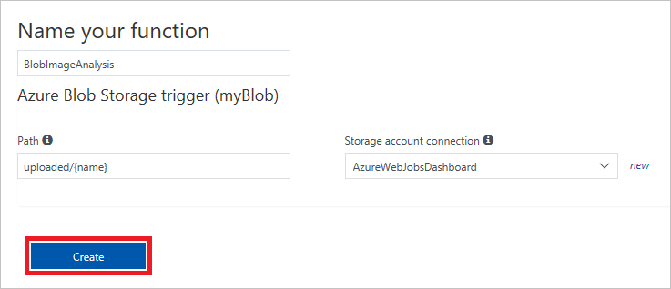

    _Creating an Azure Function_

1. Replace the code shown in the code editor with the following statements:

	```C#
	using Microsoft.WindowsAzure.Storage.Blob;
	using Microsoft.WindowsAzure.Storage;
	using System.Net.Http.Headers;
	using System.Configuration;
	
	public async static Task Run(Stream myBlob, string name, TraceWriter log)
	{       
	    log.Info($"Analyzing uploaded image {name} for adult content...");
	
	    var array = await ToByteArrayAsync(myBlob);
	    var result = await AnalyzeImageAsync(array, log);
	    
	    log.Info("Is Adult: " + result.adult.isAdultContent.ToString());
	    log.Info("Adult Score: " + result.adult.adultScore.ToString());
	    log.Info("Is Racy: " + result.adult.isRacyContent.ToString());
	    log.Info("Racy Score: " + result.adult.racyScore.ToString());
	
	    if (result.adult.isAdultContent || result.adult.isRacyContent)
	    {
	        // Copy blob to the "rejected" container
	        StoreBlobWithMetadata(myBlob, "rejected", name, result, log);
	    }
	    else
	    {
	        // Copy blob to the "accepted" container
	        StoreBlobWithMetadata(myBlob, "accepted", name, result, log);
	    }
	}
	
	private async static Task<ImageAnalysisInfo> AnalyzeImageAsync(byte[] bytes, TraceWriter log)
	{
	    HttpClient client = new HttpClient();
	
	    var key = ConfigurationManager.AppSettings["SubscriptionKey"].ToString();
	    client.DefaultRequestHeaders.Add("Ocp-Apim-Subscription-Key", key);
	
	    HttpContent payload = new ByteArrayContent(bytes);
	    payload.Headers.ContentType = new MediaTypeWithQualityHeaderValue("application/octet-stream");
	    
	    var results = await client.PostAsync("https://api.projectoxford.ai/vision/v1.0/analyze?visualFeatures=Adult", payload);
	    var result = await results.Content.ReadAsAsync<ImageAnalysisInfo>();
	    return result;
	}
	
	// Writes a blob to a specified container and stores metadata with it
	private static void StoreBlobWithMetadata(Stream image, string containerName, string blobName, ImageAnalysisInfo info, TraceWriter log)
	{
	    log.Info($"Writing blob and metadata to {containerName} container...");
	    
	    var connection = ConfigurationManager.AppSettings["AzureWebJobsStorage"].ToString();
	    var account = CloudStorageAccount.Parse(connection);
	    var client = account.CreateCloudBlobClient();
	    var container = client.GetContainerReference(containerName);
	
	    try
	    {
	        var blob = container.GetBlockBlobReference(blobName);
	    
	        if (blob != null) 
	        {
	            // Upload the blob
	            blob.UploadFromStream(image);
	
	            // Get the blob attributes
	            blob.FetchAttributes();
	            
				// Write the blob metadata
	            blob.Metadata["isAdultContent"] = info.adult.isAdultContent.ToString(); 
	            blob.Metadata["adultScore"] = info.adult.adultScore.ToString("P0").Replace(" ",""); 
	            blob.Metadata["isRacyContent"] = info.adult.isRacyContent.ToString(); 
	            blob.Metadata["racyScore"] = info.adult.racyScore.ToString("P0").Replace(" ",""); 
	            
				// Save the blob metadata
	            blob.SetMetadata();
	        }
	    }
	    catch (Exception ex)
	    {
	        log.Info(ex.Message);
	    }
	}
	
	// Converts a stream to a byte array 
	private async static Task<byte[]> ToByteArrayAsync(Stream stream)
	{
	    Int32 length = stream.Length > Int32.MaxValue ? Int32.MaxValue : Convert.ToInt32(stream.Length);
	    byte[] buffer = new Byte[length];
	    await stream.ReadAsync(buffer, 0, length);
	    return buffer;
	}
	
	public class ImageAnalysisInfo
	{
	    public Adult adult { get; set; }
	    public string requestId { get; set; }
	}
	
	public class Adult
	{
	    public bool isAdultContent { get; set; }
	    public bool isRacyContent { get; set; }
	    public float adultScore { get; set; }
	    public float racyScore { get; set; }
	}
	```

	> **Run** is the method called each time the function is executed. The **Run** method uses a helper method named **AnalyzeImageAsync** to pass each blob added to the "uploaded" container to the Computer Vision API for analysis. Then it calls a helper method named **StoreBlobWithMetadata** to create a copy of the blob in either the "accepted" container or the "rejected" container, depending on the scores returned by **AnalyzeImageAsync**. 

1. Click the **Save** button at the top of the code editor to save your changes. The click **View Files**.

    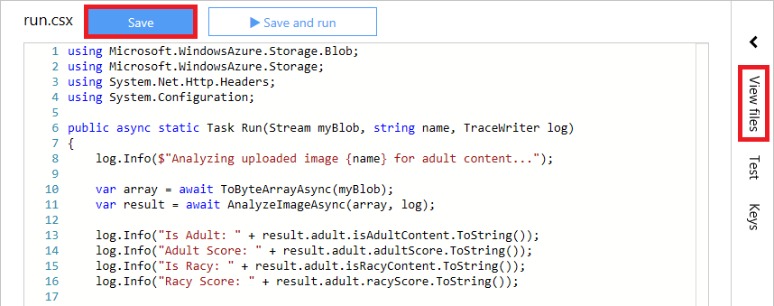

    _Saving the function_

1. Click **+ Add** to add a new file, and name the file **project.json**.

    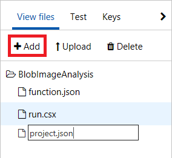

    _Adding a project file_

1. Add the following statements to **project.json**:

	```json
	{
	    "frameworks": {
	        "net46": {
	            "dependencies": {
	                "WindowsAzure.Storage": "7.2.0"
	            }
	        }
	    }
	}
	```

1. Click the **Save** button to save your changes. Then click **run.csx** to go back to that file in the code editor.

    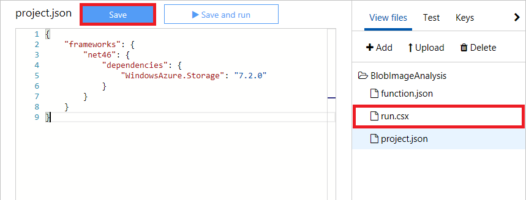

    _Saving the project file_

An Azure Function written in C# has been created, complete with a JSON project file containing information regarding project dependencies. The next step is to add an application setting that the code you added to the Azure Function relies on.

<a name="Exercise3"></a>
## Exercise 3: Add a subscription key to application settings ##

The Azure Function you created in [Exercise 2](#Exercise2) loads a subscription key for the Microsoft Cognitive Services Computer Vision API from application settings. This key is required in order for your code to call the Computer Vision API, and is transmitted in an HTTP header in each call. In this exercise, you will add an application setting containing the subscription key to the Function App.

1. Open a new browser window and navigate to https://www.microsoft.com/cognitive-services/en-us/subscriptions. If you haven't signed up for the Computer Vision API, do so now. (Signing up is free.) Then, on the subscriptions page, click **Copy** under **Key 1** to copy your Computer Vision subscription key to the clipboard.

    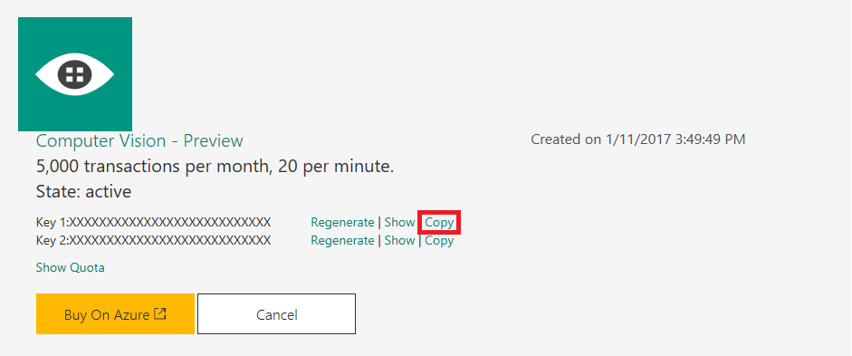

    _Copying the subscription key to the clipboard_

1. Return to your Function App in the Azure Portal and click **Function app settings** in the lower-left corner of the function designer.

    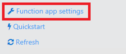

    _Viewing Function App settings_

1. Scroll down the page and click **Go to App Service Settings**.

    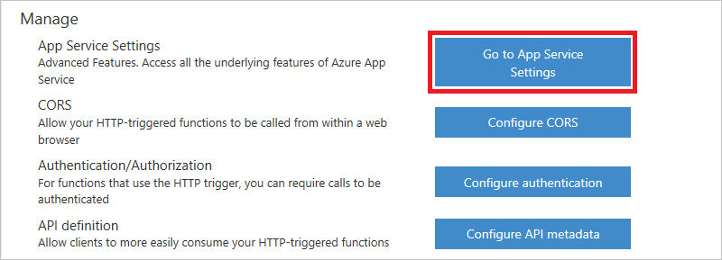

    _Viewing App Service settings_

1. Click **Application settings**. Then scroll down until you find the "App settings" section. Add a new app setting named "SubscriptionKey" (without quotation marks), and paste the subscription key that is on the clipboard into the **Value** box. Then click **Save** at the top of the blade.

    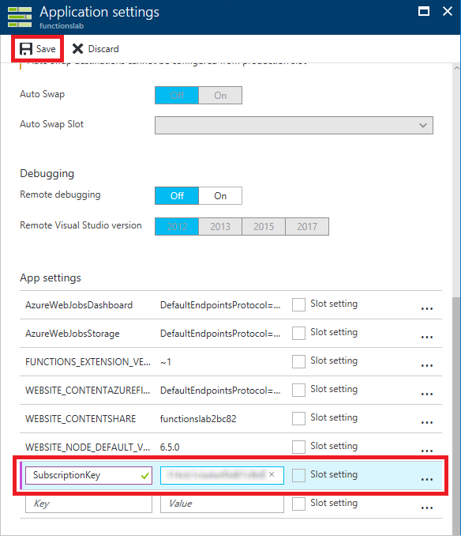

    _Adding a subscription key_

1. The app settings are now configured for your Azure Function. It's a good idea to validate those settings by recompiling the function and ensuring that it compiles without errors. Scroll left until you see the "Function app" blade, and then click **BlobImageAnalysis**.
	
    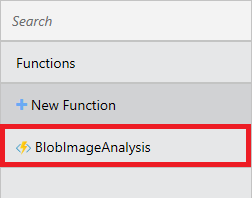

    _Opening the function_

1. Make sure **Develop** is selected. Make a simple change to the **run.csx** file in the code editor — for example, add a space or blank line and then delete it. Then click **Save and run** to recompile the function. Confirm that "Compilation succeeded" appears in the output log.
	
    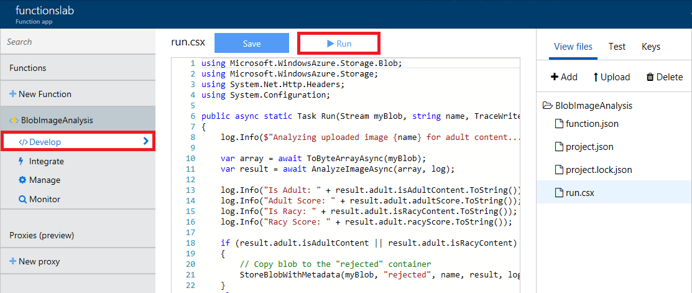

    _Recompiling the function_

The work of writing and configuring the Azure Function is complete. Now comes the fun part: testing it out.

<a name="Exercise4"></a>
## Exercise 4: Test the Azure Function ##

Your function is configured to listen for changes to the blob container named "uploaded" that you created in [Exercise 1](#Exercise1). Each time an image appears in the container, the function executes and passes the image to the Computer Vision API for analysis. To test the function, you simply upload images to the container. In this exercise, you will use the Azure Portal to upload images to the "uploaded" container and verify that copies of the images are placed in the "accepted" and "rejected" containers.

1. In the Azure Portal, go to the resource group created for your Function App. Then click the storage account that was created for it.

    

    _Opening the storage account_

1. Click **Blobs** to view the contents of blob storage.

    

    _Opening blob storage_

1. Click **uploaded** to open the "uploaded" container.

    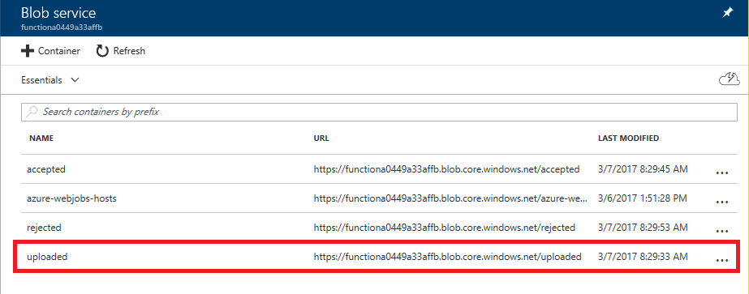

    _Opening the "uploaded" container_

1. Click **Upload**.

    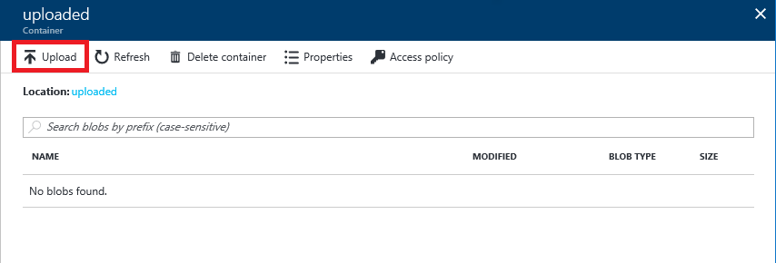

    _Uploading images to the "uploaded" container_

1. Click the button with the folder icon to the right of the **Files** box. Select all of the files in this lab's "Resources" folder. Then click the **Upload** button to upload the files to the "uploaded" container.

    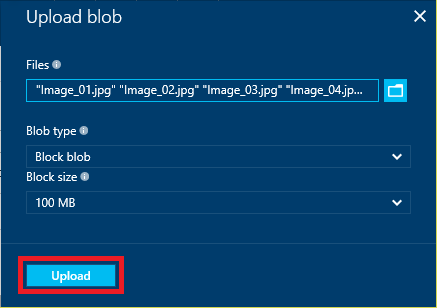

    _Uploading images to the "uploaded" container_

1. Return to the blade for the "uploaded" container and verify that eight images were uploaded.

    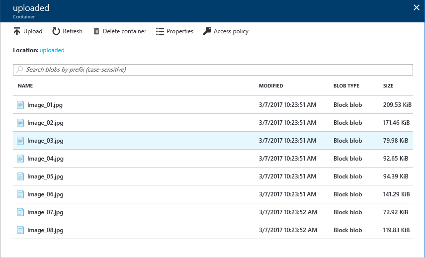

    _Images uploaded to the "uploaded" container_

1. Close the blade for the "uploaded" container and open the "accepted" container.

    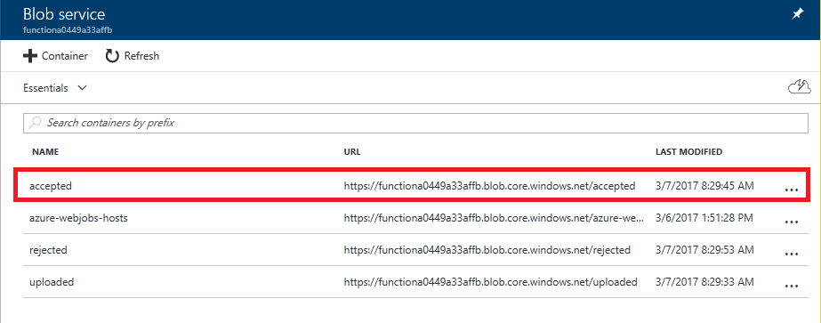

    _Opening the "accepted" container_

1. Verify that the "accepted" container holds seven images. **These are the images that were classified as neither adult nor racy by the Computer Vision API**.

	> It may take a minute or more for all of the images to appear in the container. Click **Refresh** every few seconds until you see all seven images.

    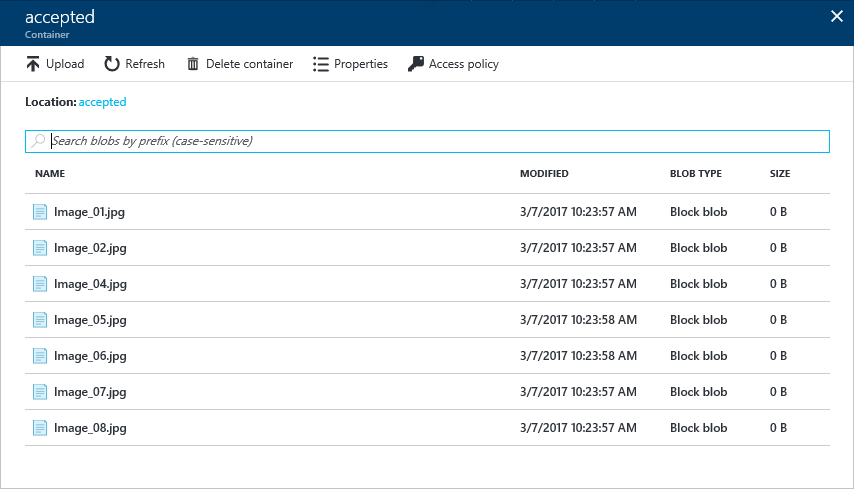

    _Images uploaded to the "accepted" container_

1. Close the blade for the "accepted" container and open the blade for the "rejected" container.

    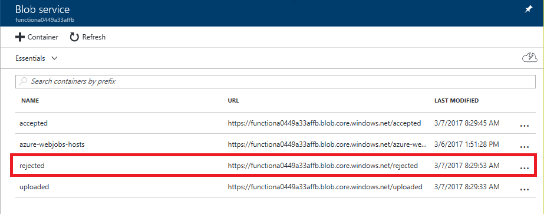

    _Opening the "rejected" container_

1. Verify that the "rejected" container holds one image. **This image was classified as adult or racy (or both) by the Computer Vision API**.

    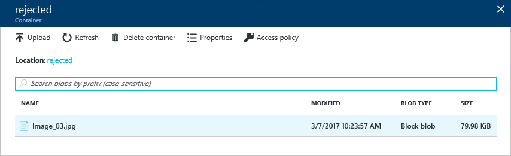

    _Images uploaded to the "rejected" container_

The presence of seven images in the "accepted" container and one in the "rejected" container is proof that your Azure Function executed each time an image was uploaded to the "uploaded" container. If you would like, return to the BlobImageAnalysis function in the portal and click **Monitor**. You will see a log detailing each time the function executed.

<a name="Exercise5"></a>
## Exercise 5: View blob metadata (optional) ##

What if you would like to view the scores for adult content and raciness returned by the Computer Vision API for each image uploaded to the "uploaded" container? The scores are stored in blob metadata for the images in the "accepted" and "rejected" containers, but blob metadata can't be viewed through the Azure Portal.

In this exercise, you will use the cross-platform [Microsoft Azure Storage Explorer](http://storageexplorer.com) to view blob metadata and see how the Computer Vision API scored the images you uploaded.

1. If you haven't installed the Microsoft Azure Storage Explorer, go to http://storageexplorer.com and install it now. Versions are available for Windows, macOS, and Linux.

1. Start Storage Explorer. If you are asked to log in, do so using the same account you used to log in to the Azure Portal.

1. Find the storage account that was created for your Azure Function App in [Exercise 1](#Exercise1) and expand the list of blob containers underneath it. Then click the container named "rejected."

	> If this is the first time you have run Storage Explorer, you may have to click the person icon and tell it which Azure subscription or subscriptions you want it to display. 

    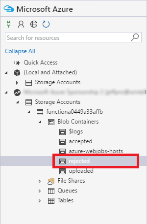

    _Opening the "rejected" container_

1. Right-click (on a Mac, Command-click) the image in the "rejected" container and select **Properties** from the context menu.

    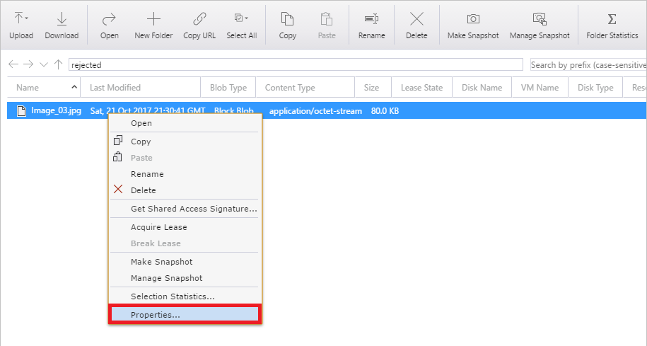

    _Viewing blob metadata_

1. Inspect the blob's metadata. *IsAdultContent* and *isRacyContent* are Boolean values that indicate whether the Computer Vision API detected adult or racy content in the image. *adultScore* and *racyScore* are the computed probabilities.

    

    _Scores returned by the Computer Vision API_

1. Open the "accepted" container and inspect the metadata for some of the blobs stored there. How do these metadata values differ from the ones attached to the blob in the "rejected" container?

You can probably imagine how this might be used in the real world. Suppose you were building a photo-sharing site and wanted to prevent adult images from being stored. You could easily write an Azure Function that inspects each image that is uploaded and deletes it from storage if it contains adult content.

<a name="Summary"></a>
## Summary ##

In this hands-on lab you learned how to:

- Create an Azure Function App
- Write an Azure Function that uses a blob trigger
- Add application settings to an Azure Function App
- Use Microsoft Cognitive Services to analyze images and store the results in blob metadata

This is just one example of how you can leverage Azure Functions to automate repetitive tasks. Experiment with other Azure Function templates to learn more about Azure Functions and to identify additional ways in which they can aid your research or business.

---

Copyright 2016 Microsoft Corporation. All rights reserved. Except where otherwise noted, these materials are licensed under the terms of the MIT License. You may use them according to the license as is most appropriate for your project. The terms of this license can be found at https://opensource.org/licenses/MIT.